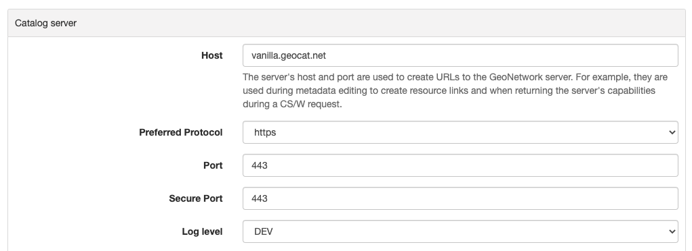

# Authentication mode

By default the catalog uses the internal database for user management and authentication. However there are some other authentication mechanisms available:

-   [Configuring LDAP](authentication-mode.md#authentication-ldap)
-   [Configuring LDAP - Hierarchy](authentication-mode.md#authentication-ldap-hierarchy)
-   [Configuring CAS](authentication-mode.md#authentication-cas)
-   [Configuring OAUTH2 OpenID Connect](authentication-mode.md#authentication-openid)
-   [Configuring Keycloak](authentication-mode.md#authentication-keycloak)
-   [Configuring Shibboleth](authentication-mode.md#authentication-shibboleth)

Which mode to use is configured in **`WEB-INF/config-security/config-security.xml`** or via an environment variable `geonetwork.security.type`.

Uncomment the relevant line in **`WEB-INF/config-security/config-security.xml`**:

``` xml
<import resource="config-security-{mode}.xml"/>
```

## Configuring LDAP {#authentication-ldap}

[Lightweight Directory Access Protocol (LDAP)](https://en.wikipedia.org/wiki/Ldap) enables GeoNetwork to verify usernames and passwords to a remote identity store. LDAP implementation uses the default GeoNetwork Login User Interface elements.

GeoNetwork currently has 2 approaches to configure LDAP. Verify also the alternative approach in [Configuring LDAP - Hierarchy](authentication-mode.md#authentication-ldap-hierarchy).

The LDAP configuration is defined in `WEB-INF/config-security/config-security.properties`, you can then configure your environment updating the previous file or overriding the properties in the file `WEB-INF/config-security/config-security-overrides.properties`.

1.  Define the LDAP connection:

    -   `ldap.base.provider.url`: This tells the portal where the LDAP server is located. Make sure that the computer with the catalog can hit the computer with the LDAP server. Check to make sure that the appropriate ports are opened, etc.
    -   `ldap.base.dn`: this will usually look something like: "dc=[organizationnamehere],dc=org"
    -   `ldap.security.principal` / `ldap.security.credentials`: Define LDAP administrator user to use to bind to LDAP. If not define, an anonymous bind is made. Principal is the username and credentials property the password.

    ``` text
    # LDAP security properties
    ldap.base.provider.url=ldap://localhost:389
    ldap.base.dn=dc=fao,dc=org
    ldap.security.principal=cn=admin,dc=fao,dc=org
    ldap.security.credentials=ldap
    ```

    To verify that you have the correct settings, try to connect to the LDAP server using an LDAP browser application.

2.  Define where to find users in LDAP structure for authentication:

    -   `ldap.base.search.base`: this is where the catalog will look for users for authentication.
    -   `ldap.base.dn.pattern`: this is the distinguished name for the user to bind with. `{0}` is replaced by the user name typed in the sign in screen.

    ``` text
    ldap.base.search.base=ou=people
    ldap.base.dn.pattern=uid={0},${ldap.base.search.base}
    #ldap.base.dn.pattern=mail={0},${ldap.base.search.base}
    ```

### Authorization Settings

When using LDAP, the user information and privileges for GeoNetwork could be defined from the LDAP attributes.

#### User information

The user information could be retrieved from the LDAP configuring for each user attribute in the catalog database which LDAP attributes match. If the attribute is empty or not defined, a default value could be defined. The property value is composed by two parts separated by `,` character. The first part is the attribute name and the second part is the default value in case the attribute name is not define or the attribute value in LDAP is empty.

The configuration is the following:

``` text
# Map user information to LDAP attributes and default values
# ldapUserContextMapper.mapping[name]=ldap_attribute,default_value
ldapUserContextMapper.mapping[name]=cn,
ldapUserContextMapper.mapping[surname]=givenName,
ldapUserContextMapper.mapping[mail]=mail,data@myorganization.org
ldapUserContextMapper.mapping[organisation]=,myorganization
ldapUserContextMapper.mapping[kind]=,
ldapUserContextMapper.mapping[address]=,
ldapUserContextMapper.mapping[zip]=,
ldapUserContextMapper.mapping[state]=,
ldapUserContextMapper.mapping[city]=,
ldapUserContextMapper.mapping[country]=,
```

#### Privileges configuration

User groups and user profiles could be set optionally from LDAP information or not. By default user privileges are managed from the local database. If LDAP information should be used to define user privileges, set the `ldap.privilege.import` property `true`:

``` text
ldap.privilege.import=true
```

When importing privileges from LDAP, the catalog administrator could decide to create groups defined in the LDAP and not defined in local database. For this set the following property to true:

``` text
ldap.privilege.create.nonexisting.groups=false
```

In order to define which groups the user is member of and which profile is the user:

``` text
ldapUserContextMapper.mapping[privilege]=groups,sample
# If not set, the default profile is RegisteredUser
# Valid profiles are ADMINISTRATOR, USER_ADMIN, REVIEWER, EDITOR, REGISTERED_USER, GUEST
ldapUserContextMapper.mapping[profile]=privileges,RegisteredUser
```

Attributes configuration:

-   privilege attribute contains the group this user is member of. More than one group is allowed.
-   profile attribute contains the profile of the user.

User valid profiles are:

-   Administrator
-   UserAdmin
-   Reviewer
-   Editor
-   RegisteredUser
-   Guest

If LDAP attribute containing profiles does not match the catalog profile list, a mapping could be defined:

``` text
# Map LDAP custom profiles to catalog profiles. Not used if ldap.privilege.pattern is defined.
ldapUserContextMapper.profileMapping[Admin]=Administrator
ldapUserContextMapper.profileMapping[Editor]=Reviewer
ldapUserContextMapper.profileMapping[Public]=RegisteredUser
```

For example, in the previous configuration, the attribute value `Admin` will be mapped to `Administrator` (which is a valid profile for the catalog).

An attribute could define both the profile and the group for a user. To extract this information, a custom pattern could be defined to populate user privileges according to that attribute:

1.  Define one attribute for the profile and one for groups in `WEB-INF/config-security/config-security-overrides.properties`

    ``` text
    # In config-security-overrides.properties
    ldapUserContextMapper.mapping[privilege]=cat_privileges,sample
    ```

2.  Define one attribute for the privilege and define a custom pattern:

    ``` text
    # In config-security.properties
    ldap.privilege.pattern=CAT_(.*)_(.*)
    ldap.privilege.pattern.idx.group=1
    ldap.privilege.pattern.idx.profil=2
    ```

    Enable the bean `ldapUserContextMapper` for `LDAPUserDetailsContextMapperWithPattern` ( in `WEB-INF/config-security/config-security-ldap.xml`).

    ``` xml
    <!--<bean id="ldapUserContextMapper"
        class="org.fao.geonet.kernel.security.ldap.LDAPUserDetailsContextMapper">
        <property name="mapping">
          <map/>
        </property>
        <property name="profileMapping">
          <map/>
        </property>
        <property name="ldapBaseDn" value="${ldap.base.dn}"/>
        <property name="importPrivilegesFromLdap" value="${ldap.privilege.import}"/>
        <property name="createNonExistingLdapGroup"
                  value="${ldap.privilege.create.nonexisting.groups}"/>
        <property name="createNonExistingLdapUser" value="${ldap.privilege.create.nonexisting.users}"/>
        <property name="ldapManager" ref="ldapUserDetailsService"/>
        <property name="contextSource" ref="contextSource"/>
        <property name="ldapUsernameCaseInsensitive" value="${ldap.usernameCaseInsensitive:#{true}}"/>
    </bean>-->

    <bean id="ldapUserContextMapper" class="org.fao.geonet.kernel.security.ldap.LDAPUserDetailsContextMapperWithPattern">
      <property name="mapping">
          <map/>
      </property>
      <property name="profileMapping">
          <map/>
      </property>
      <property name="importPrivilegesFromLdap" value="${ldap.privilege.import}"/>
      <property name="createNonExistingLdapGroup" value="${ldap.privilege.create.nonexisting.groups}" />
      <property name="createNonExistingLdapUser" value="${ldap.privilege.create.nonexisting.users}" />

      <property name="ldapManager" ref="ldapUserDetailsService" />

      <property name="privilegePattern" value="${ldap.privilege.pattern}" />
      <property name="groupIndexInPattern" value="${ldap.privilege.pattern.idx.group}"/>
      <property name="profilIndexInPattern" value="${ldap.privilege.pattern.idx.profil}"/>

      <property name="contextSource" ref="contextSource" />
    </bean>
    ```

3.  Define custom location for extracting group and role (no support for group/role combination) (use LDAPUserDetailsContextMapperWithProfileSearch in **`config-security.xml`**).

    ``` text
    ldap.privilege.search.group.attribute=cn
    ldap.privilege.search.group.object=ou=groups
    #ldap.privilege.search.group.query=(&(objectClass=*)(memberUid=uid={0},${ldap.base.search.base},${ldap.base.dn})(cn=EL_*))
    ldap.privilege.search.group.queryprop=memberuid
    ldap.privilege.search.group.query=(&(objectClass=*)(memberUid=uid={0},${ldap.base.search.base},${ldap.base.dn})(|(cn=SP_*)(cn=EL_*)))
    ldap.privilege.search.group.pattern=EL_(.*)
    ldap.privilege.search.privilege.attribute=cn
    ldap.privilege.search.privilege.object=ou=groups
    ldap.privilege.search.privilege.query=(&(objectClass=*)(memberUid=uid={0},${ldap.base.search.base},${ldap.base.dn})(cn=SV_*))
    ldap.privilege.search.privilege.pattern=SV_(.*)
    ```

    The LDAP attribute can contains the following configuration to define the different type of users, for example:

    ``` text
    cat_privileges=CAT_ALL_Administrator

    -- Define a reviewer for the group GRANULAT
    cat_privileges=CAT_GRANULAT_Reviewer

    -- Define a reviewer for the group GRANULAT and editor for MIMEL
    cat_privileges=CAT_GRANULAT_Reviewer
    cat_privileges=CAT_MIMEL_Editor

    -- Define a reviewer for the group GRANULAT and editor for MIMEL and RegisteredUser for NATURA2000
    cat_privileges=CAT_GRANULAT_Reviewer
    cat_privileges=CAT_MIMEL_Reviewer
    cat_privileges=CAT_NATURA2000_RegisteredUser

    -- Only a registered user for GRANULAT
    cat_privileges=CAT_GRANULAT_RegisteredUser
    ```

#### Synchronization

A synchronization task is taking care of removing LDAP users that may be deleted. For example:

-   T0: User A signs in to the catalog. A local user A is created in the user database.
-   T1: User A is deleted from the LDAP (User A cannot sign in to the catalog anymore).
-   T2: The synchronization task will check that all local LDAP users exist in LDAP:
    -   If the user does not own any records, it will be deleted.
    -   If the user owns metadata records, a warning message will be written to the catalog logging system. The owner of the record should be changed to another user before the task can remove the current owner.

By default the task runs once every day. This can be changed in the following property:

``` text
# Run LDAP sync every day at 23:30
ldap.sync.cron=0 30 23 * * ?
```

The following properties allow advanced configuration of the synchronisation process:

``` text
ldap.sync.user.search.base=${ldap.base.search.base}
ldap.sync.user.search.filter=(&(objectClass=*)(mail=*@*)(givenName=*))
ldap.sync.user.search.attribute=uid
ldap.sync.group.search.base=ou=groups
ldap.sync.group.search.filter=(&(objectClass=posixGroup)(cn=EL_*))
ldap.sync.group.search.attribute=cn
ldap.sync.group.search.pattern=EL_(.*)
```

#### Debugging

If the connection fails, try to increase the logging level for LDAP in `WEB-INF/classes/log4j.xml`:

``` xml
<logger name="geonetwork.ldap" additivity="false">
    <level value="DEBUG"/>
</logger>
```

Or from the Configuration Settings set the `Log level` to `DEV` temporarily:



## Configuring LDAP - Hierarchy {#authentication-ldap-hierarchy}

A slightly different method for LDAP configuration was introduced in mid-2020.

This extends the original configuration infrastructure (original configurations still work without any changes).

Before you start configuring, you will need to know;

1.  URL to your LDAP Server
2.  Username/password to login to the LDAP Server (to execute queries)
3.  LDAP query to find a user (given what they type in on the login screen)
4.  Details of how to convert the LDAP user's attributes to GeoNetwork user attributes
5.  LDAP query to find groups a user is a member of
6.  How to convert a LDAP group to a GeoNetwork Group/Profile

!!! note

    There is a [video developer chat](https://www.youtube.com/watch?v=f8rvbEdnE-g) that goes into details for how to configure LDAP including setting up a pre-configured LDAP server (using Apache Directory Studio) for testing/debugging/learning.


!!! note

    Should I use the Hierarchy or Original configuration?
    
    If you already have an existing (Original) configuration, there's no need to move to the new one. Most of the code between the two is the same.
    
    If you are starting a new configuration, I would recommend the Hierarchy configuration. It's a little simpler and supported by test cases and test infrastructure. It also supports LDAPs where users/groups are in multiple directories.


### Configuring LDAP Beans (Hierarchy)

GeoNetwork comes with a sample LDAP configuration that you can use in Apache Directory Studio to create the same LDAP server used in the test cases. There is also a sample GeoNetwork configuration that connects to this LDAP server. Please see `core-geonetwork/blob/master/core/src/test/resources/org/fao/geonet/kernel/security/ldap/README.md`{.interpreted-text role="repo"} or the [video developer chat](https://www.youtube.com/watch?v=f8rvbEdnE-g) for instructions.

!!! note

    To use this configuration, uncomment the "<import resource="config-security-ldap-recursive.xml"/>" line in ``web/src/main/webapp/WEB-INF/config-security/config-security.xml``


1.  Configure the `contextSource` bean with a reference to your LDAP server and a user that can execute LDAP queries.

    ``` xml
    <bean id="contextSource"   class="org.springframework.security.ldap.DefaultSpringSecurityContextSource">
        <constructor-arg value=“ldap://localhost:3333/dc=example,dc=com"/>

        <property name="userDn" value="cn=admin,ou=GIS Department,ou=Corporate Users,dc=example,dc=com"/>
        <property name="password" value="admin1"/>
    </bean>
    ```

2.  Configure the `ldapUserSearch` bean with the query used to find the user (given what was typed in the login page).

    NOTE: Set `searchSubtree` to `true` to do a recursive search of the LDAP. Use `searchBase` to control which directory the search starts in ("" means start from the root).

    ``` xml
    <bean id="ldapUserSearch" class="…">
       <constructor-arg name="searchBase" value=""/>
       <constructor-arg name="searchFilter" value="(sAMAccountName={0})"/>
       <constructor-arg name="contextSource" ref="contextSource"/>

       <property name="searchSubtree" value="true"/>
    </bean>
    ```

3.  Configure the `ldapUserContextMapper` bean with how to convert the LDAP user's attributes to GeoNetwork user attributes (see the original configuration documentation, above).

    NOTE: The `value` portion has two parts. The first part is the name of LDAP attribute (can be blank). The second part is the default value if the LDAP attribute is missing or empty (see the original configuration documentation, above).

    ``` xml
    <bean id="ldapUserContextMapper" class=“LDAPUserDetailsContextMapperWithProfileSearchEnhanced">

        <property name="mapping">
          <map>
            <entry key="name" value="cn,"/>
            <entry key="surname" value="sn,"/>
            <entry key="mail" value="mail,"/>
            <entry key="organisation" value=","/>
            <entry key="address" value=","/>
            <entry key="zip" value=","/>
            <entry key="state" value=","/>
            <entry key="city" value=","/>
            <entry key="country" value=","/>

            <entry key="profile" value=",RegisteredUser"/>
            <entry key="privilege" value=",none"/>
          </map>
        </property>

    </bean>
    ```

4.  Continue configuring the `ldapUserContextMapper` bean so the LDAP can also provide group/profile roles for the user.

    NOTE: The `ldapMembershipQuery` is the LDAP directory where the membership query will be start ("" means start at the root of the LDAP).

    ``` xml
    <bean id="ldapUserContextMapper" class="LDAPUserDetailsContextMapperWithProfileSearchEnhanced">

        <property name="importPrivilegesFromLdap" value=“true"/>

        <!-- typically, don't want GN to modify the LDAP server! -->
        <property name="createNonExistingLdapGroup" value="false" />
        <property name="createNonExistingLdapUser" value="false" />
        <property name="ldapManager" ref="ldapUserDetailsService" />

        <property name="membershipSearchStartObject" value=""/>
        <property name="ldapMembershipQuery" value="(&amp;(objectClass=*)(member=cn={2})(cn=GCAT_*))"/>

    </bean>
    ```

5.  Continue configuring the `ldapUserContextMapper` bean so the LDAP roles can be converted to GeoNetwork Groups/Profiles.

    NOTE: You can use multiple `ldapRoleConverters`.

    ``` xml
    <bean id="ldapUserContextMapper" class="LDAPUserDetailsContextMapperWithProfileSearchEnhanced">

       <property name="ldapRoleConverters">
         <util:list>
           <ref bean="ldapRoleConverterGroupNameParser"/>
         </util:list>
       </property>

    </bean>
    ```

There are currently two ways to convert an LDAP group to GeoNetwork Groups/Profiles.

-   The `LDAPRoleConverterGroupNameParser`, which works the same as the original LDAP configuration. It uses a regular expression to parse the LDAP group name into a GeoNetwork Group/Profile. This will convert the LDAP role `GCAT_GENERAL_EDITOR` into the GeoNetwork group `GENERAL` with Profile `Editor`.

    ``` xml
    <bean id="ldapRoleConverterGroupNameParser"  class="LDAPRoleConverterGroupNameParser">

        <property name="ldapMembershipQueryParser" value="GCAT_(.*)_(.*)"/>
        <property name="groupIndexInPattern" value="1"/>
        <property name="profileIndexInPattern" value=“2"/>

        <property name="profileMapping">
          <map>
            <entry key="ADMIN" value="Administrator"/>
            <entry key="EDITOR" value="Editor"/>
          </map>
        </property>

    </bean>
    ```

-   There is also a more direct way using `LDAPRoleConverterGroupNameConverter`. This directly converts the LDAP group name into a list of GeoNetwork Groups/Profiles.

    ``` xml
    <bean id=“ldapRoleConverterGroupNameParser" class="LDAPRoleConverterGroupNameConverter">

        <property name="convertMap">
          <map>

            <entry>
                <key>
                    <value>HGIS_GeoNetwork_Admin</value>
                </key>
                <list>

                    <bean class="org.fao.geonet.kernel.security.ldap.LDAPRole">
                      <constructor-arg name="groupName" type="java.lang.String" value="myGroup"/>
                      <constructor-arg name="profileName" type="java.lang.String" value="Administrator"/>
                    </bean>

                </list>
            </entry>
            <entry>
              <key>
                    <value>HGIS_GeoNetwork_Editor</value>
              </key>
              <list>

                <bean class="org.fao.geonet.kernel.security.ldap.LDAPRole">
                  <constructor-arg name="groupName" type="java.lang.String" value=“myGroup"/>
                  <constructor-arg name="profileName" type="java.lang.String" value="Editor"/>
                </bean>

              </list>
            </entry>
          </map>
        </property>
    </bean>
    ```

## Configuring CAS {#authentication-cas}

To enable CAS, set up authentication by including `WEB-INF/config-security/config-security-cas.xml` in `WEB-INF/config-security/config-security.xml`, uncommenting the following lines:

``` xml
<import resource="config-security-cas.xml"/>
<import resource="config-security-cas-ldap.xml"/>
```

CAS can use either LDAP or a database for user management. To use a database uncomment the following lines instead:

``` xml
<import resource="config-security-cas.xml"/>
<import resource="config-security-cas-database.xml"/>
```

The CAS configuration is defined in `WEB-INF/config-security/config-security.properties`. You can configure your environment by updating the previous file or by defining property overrides in the file `WEB-INF/config-security/config-security-overrides.properties`:

``` text
cas.baseURL=https://localhost:8443/cas
cas.ticket.validator.url=${cas.baseURL}
cas.login.url=${cas.baseURL}/login
cas.logout.url=${cas.baseURL}/logout?url=${geonetwork.https.url}/
```

## Configuring OAUTH2 OpenID Connect {#authentication-openid}

[OAUTH2 OpenID Connect](https://openid.net/connect/) is an authentication and authorization system based on OAUTH2. Geonetwork's OpenID Connect plugin has been tested with [Keycloak](https://keycloak.org) and [Azure AD](https://azure.microsoft.com/en-ca/services/active-directory/), but should work with any provider.

Basic Setup Steps:

1.  Configure your IDP Server (i.e. Keycloak or Azure AD)
    1.  Ensure that the ID Token provides role/group information
    2.  Authorize your Geonetwork URLs for redirects (i.e. `http://localhost:8080/geonetwork/login/oauth2/code/geonetwork-oicd`)
    3.  Record the Client ID
    4.  Record the Client Secret
    5.  Get the Server's JSON metadata document
2.  Configure Geonetwork via environment variables
    1.  ``GEONETWORK_SECURITY_TYPE=openidconnect``
    2.  ``OPENIDCONNECT_CLIENTSECRET=\...`` (from your IDP server)
    3.  ``OPENIDCONNECT_CLIENTID=\...`` (from your IDP server)
    4.  ``OPENIDCONNECT_SERVERMETADATA_JSON_TEXT='\...'`` (the text of your Server's JSON metadata document)
    5.  ``OPENIDCONNECT_IDTOKENROLELOCATION=\...`` (location of the user's roles in the ID Token)

Geonetwork's Open ID Connect plugin has a lot of configuration options - please see the `WEB-INF/config-security/config-security-openidconnect.xml` and `WEB-INF/config-security/config-security-openidconnect-overrides.properties` files.

### Environment Variable and Meaning

**GEONETWORK_SECURITY_TYPE**

Should be `openidconnect`.

**OPENIDCONNECT_CLIENTID**

The name of the client/application you configured on your OpenID server.

**OPENIDCONNECT_CLIENTSECRET**

The `client secret` you configured on your OpenID server.

**OPENIDCONNECT_SERVERMETADATA_CONFIG_URL**

URL to the external OIDC server's JSON metadata document. This is typically at ``/.well-known/openid-configuration`` on the IDP server.

!!! note

    This will download the server's configuration everytime GeoNetwork starts up, which could be a security concern. For security, use a `https` URL.


**OPENIDCONNECT_SERVERMETADATA_JSON_TEXT**

Should be the text of your OpenID server's metadata configuration (JSON).

**OPENIDCONNECT_SERVERMETADATA_FNAME**

Instead of putting the OpenID server's metadata configuration as text in a variable (``OPENIDCONNECT_SERVERMETADATA_JSON_TEXT``), you can put the JSON contents in a file and reference it with this variable (ie. `/WEB-INF/config-security/openid-configuration.json`)

**OPENIDCONNECT_IDTOKENROLELOCATION**

Where, in the ID Token, are the users roles/groups stored (i.e. "groups", "roles", or "resource_access.gn-key.roles")

**OPENIDCONNECT_ROLECONVERTER**

This provides simple role conversion from the OpenID server to Geonetwork roles.

ie. ``"GeonetworkAdmin=Administrator,GeonetworkEditor=Editor"``

This will convert "GeonetworkAdmin" (from the OpenID Server) to the Geonetwork "Administrator" role.

!!! note

    Like the keycloak plugin, you can use role/group names of the form "group:role" to assign a user to Geonetwork group and permission level.


**OPENIDCONNECT_MINIMUMPROFILE**

Every user who authenticates against the OpenID server will be given this role.

Default is ``"RegisteredUser"``.

**OPENIDCONNECT_USERPROFILEUPDATEENABLED**

When a user logs on, update their Geotwork profile from the OpenID server's ID Token.

Default is ``"true"``.

**OPENIDCONNECT_USERGROUPUPDATEENABLED**

When a user logs on, update their Geotwork group/role permissions.

Default is ``"true"``.

**OPENIDCONNECT_SCOPES**

Limit the requested scope access to the OpenID server.

Default "openid email profile", and "openid email profile offline_access" (for bearer tokens).

**OPENIDCONNECT_LOGINTYPE**

How Geonetwork deals with users who are not logged on.

Default is "LINK" - users can click on the "login" link on the main page.

"AUTOLOGIN" - No login form provided which will automatically login the user when possible.

**OPENIDCONNECT_LOGSENSITIVE_INFO**

"true" or "false" (default)

Logs: CODE, ACCESS TOKEN, ID TOKEN, userinfo endpoint result, and calculated GeoNetwork authorities.

LOGGING THIS INFORMATION IS PROBABLY A SECURITY AND PERSONAL INFORMATION RISK. DO NOT TURN THIS ON IN A SYSTEM THAT IS ACTUALLY BEING USED.

We try not to log very sensitive information - we don't log the full access or id token (just the claims part). We log the single-use CODE, but it should have already been deactivated by the server before we log it.

The access token, userinfo, and id token contain sensitive information (i.e. real names, email address, etc\...)

### Configuration for a Keycloak Server

It's outside the scope of this document to fully describe the steps to configure keycloak, but this should serve as a guide.

This will configure keycloak backed by **another OpenID IDP** (for example, by an Azure AD). In keycloak:

1.  Create a realm (i.e. `myrealm`)
2.  Create an openid client (i.e. `myclient`). This is your ClientID.
    1.  Root URL: ``http://localhost:7777/geonetwork`` (this is the GN root URL)
    2.  Valid Redirect URIs: ``http://localhost:7777/geonetwork/*``
    3.  Access Type: Confidential
    4.  On the `Credentials` tab, get the secret (this is your Client Secret)
    5.  On the `Roles` tab, create some roles: Administrator, Editor, Reviewer, RegisteredGuest
3.  Create your backing Identity Provider (i.e. to another OpenID server). Or you can configure users directly in keycloak.
    1.  At the bottom of the page, choose "import from URL" and import the backing server's configuration location.
    2.  Add the Client Secret (from the backing service)
    3.  Add the Client ID (from the backing service)
    4.  set "Client Authentication" to "Client secret sent as post"
4.  Configure role translation
    1.  Edit the "Identity Provider" you just created, and go to the "Mappers" tab.
    2.  Press "Create" and and add a "Claim to Role".
    3.  Set Sync Mode Override to "Force"
    4.  Claim: `roles`
    5.  Claim Value: `name of the administrator role in the backing IDP`
    6.  Role: choose the "Administrator" role from the `myclient` client.
    7.  Repeat the above for Administrator, Editor, Reviewer, and RegisteredGuest
5.  Configure details for your backing IDP
    1.  Edit the "Identity Provider" you just configured
    2.  On the Mappers tab, "Add Builtin" and tick "client roles (User Client Role)" then "Add selected"
    3.  Edit the "client roles" mapper and make sure "Add to ID token" and "Add to userinfo" are on

You should have Keycloak's Client id ("myclient") and the client secret. The configuration JSON is available at `https://YOUR_KEYCLOAK_HOST/realms/{YOUR REALM NAME}/.well-known/openid-configuration`

Your environment variables will looks like this:

``` properties
GEONETWORK_SECURITY_TYPE=openidconnect
OPENIDCONNECT_CLIENTSECRET='...'
OPENIDCONNECT_CLIENTID='...'
OPENIDCONNECT_SERVERMETADATA_JSON_TEXT='...big json text...'
OPENIDCONNECT_IDTOKENROLELOCATION='resource_access.{your client id}.roles'
```

### Azure AD Configuration

There are two ways to setup Azure AD. The first is with user and groups (a more traditional LDAP method) or with Application Roles.

#### With Users and Groups

Setup the Azure Application:

1.  Create a new `App Registration`
2.  use `http://localhost:8080/geonetwork/login/oauth2/code/geonetwork-oicd` as a redirect URIs
3.  On the "Certificates & Secrets" add a new secret and record it (make sure you get the secret value and NOT the object id)
4.  Make sure the groups are in the ID token - on the "Manifest" tab, edit the JSON so that "groupMembershipClaims": "SecurityGroup" is set
5.  On the summary page, get the Application (client) ID
6.  On the summary page, choose "Endpoints" (at the top) and get the JSON text from the "OpenID Connect metadata document" Endpoints

Setup users and groups:

1.  In Azure AD, go to groups
2.  Add new Groups - "geonetworkAdmin", "geonetworkReviewer", etc\... Record the name and the group's **Object ID**
3.  Edit a User, and choose Groups, and add them to appropriate group.

Your environment variables will looks like this:

``` properties
GEONETWORK_SECURITY_TYPE=openidconnect
OPENIDCONNECT_CLIENTSECRET='...'
OPENIDCONNECT_CLIENTID='...'
OPENIDCONNECT_SERVERMETADATA_JSON_TEXT='...big json text...'
OPENIDCONNECT_IDTOKENROLELOCATION='groups'
OPENIDCONNECT_ROLECONVERTER='3a94275f-7d53-4205-8d78-11f39e9ffa5a=Administrator,d93c6444-feee-4b67-8c0f-15d6796370cb=Reviewer'
```

!!! note

    The roles are in the "roles" part of the ID Token.


!!! note

    The OPENIDCONNECT_ROLECONVERTER converts the Azure AD Group's Object ID to a Geonetwork Role.


#### With Application Roles

Setup the Azure Application:

1.  Create a new Enterprise application
2.  use `http://localhost:8080/geonetwork/login/oauth2/code/geonetwork-oicd` as a redirect URIs
3.  On the "Certificates & Secrets" add a new secret and record it (make sure you get the secret value and NOT the object id)
4.  Make sure the groups are in the ID token - on the "Manifest" tab, edit the JSON so that "groupMembershipClaims": "ApplicationGroup" is set
5.  On the summary page, get the Application (client) ID
6.  On the summary page, choose "Endpoints" (at the top) and get the JSON text from the "OpenID Connect metadata document" Endpoints

Setup Application Roles:

1.  In Application you created, go to "App Roles".
2.  Add new Groups - "Editor", "Reviewer", etc\...

Assign Users:

1.  Go to Azure AD, Enterprise Application, then the application you created
2.  Choose "Assign users and groups"
3.  Press the "Add user/group" (top)
4.  Press "None Selected" (under Users) and choose some users
5.  Press "None Selected" (Under Select a Role) and choose some roles
6.  Configure all your users with roles

Your environment variables will looks like this:

``` properties
GEONETWORK_SECURITY_TYPE=openidconnect
OPENIDCONNECT_CLIENTSECRET='...'
OPENIDCONNECT_CLIENTID='...'
OPENIDCONNECT_SERVERMETADATA_JSON_TEXT='...big json text...'
OPENIDCONNECT_IDTOKENROLELOCATION='roles'
```

!!! note

    The roles are in the "roles" part of the ID Token.


!!! note

    You don't typically have to do any role conversion since the role name will be used in the ID Token.


### OIDC Bearer Tokens {#oidc_bearer_tokens}

Bearer Tokens are also supported - you can attach the JWT Bearer token to any request by setting the HTTP header like this:

``` properties
Authorization: Bearer:  <JWT token>
```

Bearer Tokens are mostly used for automated (desktop or application) API calls - real users should just login normally using OIDC.

1.  Setup your OIDC configuration (see [Configuring OAUTH2 OpenID Connect](authentication-mode.md#authentication-openid))
2.  Setup the OIDC Bearer token configuration (see [Configuration](authentication-mode.md#bearer_token_configuration))
3.  Obtain a Bearer token from the OIDC server. This is the hard part and there are several ways to do this. One way that is used is via the OAuth 2.0 Device Authorization Grant ("Device Flow") workflow.
4.  Attach it to your request headers (see [OIDC Bearer Tokens](authentication-mode.md#oidc_bearer_tokens))
5.  Make protected requests to the Geonetwork API

This has been tested with Keycloak and with Azure AD. It should work with other JWT-based OIDC services.

#### Validation

The token is validated in three major ways:

1.  The bearer token will be used to access the `userinfo` ("token validation") endpoint specified in the OIDC configuration. This means the IDP validates the token (at the very least its signature and expiry).
2.  The bearer token (JWT) will be checked that the audience for it is the same as our configurated OIDC configuration. This will ensure that someone isn't getting a token from a different service and attempting to use it here. See ``AudienceAccessTokenValidator.java``
3.  The bearer token (JWT) will be checked that the subject of the JWT and the `userinfo` (returned from the IDP) are the same. This shouldnt be a problem in our use-case, but the OAUTH2 specification recommends this check. See ``SubjectAccessTokenValidator.java``

#### Configuration {#bearer_token_configuration}

Configure OIDC as above - ensure this is working.

Instead of using `GEONETWORK_SECURITY_TYPE=openidconnect`, use `GEONETWORK_SECURITY_TYPE=openidconnectbearer`.

Inside `WEB-INF/config-security/config-security-openidconnectbearer.xml`:

1.  If you are using keycloak (configured with Groups in the `userinfo` response), then uncomment the `UserInfoAccessTokenRolesResolver` bean and comment out the `MSGraphUserRolesResolver` bean.
2.  If you are using Azure AD (MS Graph API for the user's groups), then then uncomment the `MSGraphUserRolesResolver` bean and comment out the `UserInfoAccessTokenRolesResolver` bean.

The easiest way to test is to obtain a Bearer Token, and then use a browser plugin to add the ``Authorization: Bearer <token>`` header to all requests. When you visit the Geonetwork website, you should see yourself logged in with the appropriate permissions.

#### Other Providers

This has been tested with Azure AD (groups in the MS Graph API) and KeyCloak (groups in the `userinfo`).

For other IDP, you might have to make some modifications.

1.  Make sure the `AudienceAccessTokenValidator` and `SubjectAccessTokenValidator` work correctly for your JWT bearer tokens.
2.  Make sure that the user's groups are available - see the `UserRolesResolver` interface and its two implementations - `UserInfoAccessTokenRolesResolver` and `MSGraphUserRolesResolver`.

## Configuring Keycloak {#authentication-keycloak}

[Keycloak](https://keycloak.org) is a software solution to facilitate storage of authentication details, user federation, identity brokering and social login. GeoNetwork can be set up to use a keycloak instance for authentication.

Install keycloak from its instructions or use this example setup in docker <https://www.keycloak.org/getting-started/getting-started-docker>

Keycloak details are defined via environment variables

``` text
KEYCLOAK_AUTH_SERVER_URL={keycloak url}
KEYCLOAK_REALM={realm name}
KEYCLOAK_RESOURCE={client name}
KEYCLOAK_SECRET={client secret}
KEYCLOAK_DISABLE_TRUST_MANAGER={true|false}
```

You can setup more advance keycloak settings by editing the file **`WEB-INF/config-security/keycloak.json`**

### Geonetwork client URL configuration

Ensure that when you configure your client that you setup the valid redirect uris to your geonetwork installation. i.e. `https://localhost:8443/geonetwork/*`. If this is not setup correctly you may get and error indicating that a wrong redirect uri was supplied. Also if wanting to test the client backchannel logout then ensure that the admin URL is also set to the geonetwork installation.

### Sample user/role/group setup

#### Sample Role setup

In your client role settings (clients -> myclient -> roles). Add the following roles

``` text
Administrator
RegisteredUser
Guest
sample:UserAdmin
sample:Reviewer
sample:Editor
sample:RegisteredUser
```

#### Sample Group configuration

1.  Go to keycloak groups (left menu).
2.  Create a new group called "Administrator"
3.  Edit the group. Go to Role Mappings -> Client Roles (myclient) -> select the administrator roles and click on "Add selected" Any user joined to the Administrator group will be a geonetwork administrator.

#### Sample User configuration

1.  Go to keycloak users (left menu)
2.  Add or select existing user. Then go to that user.
3.  Go to role Mappings -> Client Roles (myclient) -> select the available roles to be applied and click on "Add selected" or go to Groups -> Available Groups -> Click on the Administrator Group and then click on "Join"

A similar setup is described for geoserver in the [geoserver documentation](https://docs.geoserver.org/latest/en/user/community/keycloak/index.html).

## Configuring EU Login {#authentication-ecas}

EU Login is the central login mechanism of the European Commission. You can enable login against that central service in case your intended users have ar can acquire a EU Login.

To enable EU Login, set up authentication by including `WEB-INF/config-security/config-security-ecas.xml` in `WEB-INF/config-security/config-security.xml`, uncommenting the following line:

``` xml
<import resource="config-security-ecas.xml"/>
```

EU-login requires an ecas-plugin provided by the European Union. The ecas plugin is available via [CITnet](https://citnet.tech.ec.europa.eu/CITnet/nexus) for various java containers, such as Tomcat and JBoss.

For tomcat, add two files to the tomcat lib folder: ecas-tomcat-x.y.z.jar and log4j-x.y.z.jar. Inside the lib folder copy two folders from **`eulogin-tomcat-x.y.z-config.zip`**: **`org/apache/catalina/authenticator`** and **`org/apache/catalina/startup`**. The mbeans folder contains a file **`mbeans-descriptors.xml`**. The startup folder contains a file **`Authenticators.properties`**. Verify that the JDK trusts the [ECAS certificates](https://webgate.ec.europa.eu/CITnet/confluence/display/IAM/Downloads-Certificates) else import them on the keystore of the JVM.

The EU Login configuration is defined in **`WEB-INF/config-security/config-security.properties`**. You can configure your environment by updating the previous file or by defining property overrides in the file **`WEB-INF/config-security/config-security-overrides.properties`**:

``` text
cas.baseURL=https://webgate.ec.europa.eu/cas
```

Restart the service and check the authentication menchanism.

## Configuring Shibboleth {#authentication-shibboleth}

The catalog can operate in a SAML secured federation. Shibboleth should be installed in Apache as described [here](https://wiki.shibboleth.net/confluence/display/SHIB2/Installation). The catalog is accessed via Apache. Setup Shibboleth authentication by including `WEB-INF/config-security/config-security-shibboleth.xml` in `WEB-INF/config-security/config-security.xml`. You can then configure your environment in `config-security-shibboleth-overrides.properties`.
