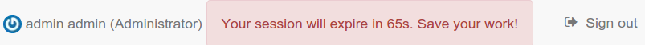

# Managing users and groups

-   [Creating group](creating-group.md)
-   [Creating user](creating-user.md)
-   [User Self-Registration](user-self-registration.md)
-   [Authentication mode](authentication-mode.md)

## Default user {#user-defaults}

Upon installation a default user with name `admin` and password `admin` is created. It is recommended to log in with these credentials directly after the installation has completed and to change the default password.

## User session

After the authentication process, a user session is created. This session will be closed automatically at some point by the server for security reasons. The default session timeout is set to 35 min (see [User session timeout configuration](../../customizing-application/advanced-configuration.md#session-timeout-configuration) for details).

When there is no activity in the browser and the session is about to expire, a warning is displayed next to the user details 3 minutes before the timeout takes place:

One (1) minute before the timeout, another message is displayed:

When the session seems to have been destroyed by the catalog, a message recommends to refresh the page and sign in again if needed:

## Users, Groups and Roles {#user_profiles}

The catalog uses the concept of Users, Groups and User Profiles.

-   A User can be part of one or more Groups.
-   A User has a Role in a Group.
-   The Administrator Role is not related to a Group.

The combination of Role and Group defines what tasks the User can perform on the system or on specific metadata records.

Users can have different roles in different groups. A role defines what tasks the user can perform.

Roles are hierarchical and based on inheritance. This means that a user with an Editor profile can create and modify new metadata records, but can also use all functions a Registered user can use.

Rights associated with the roles are illustrated in detail in the list below:

1.  **Administrator Profile**

    The Administrator has special privileges that give access to all available functions.

    These include:

    -   Full rights for creating new groups and new users.
    -   Rights to change users/groups profiles.
    -   Full rights for creating/editing/deleting new/old metadata.
    -   Perform system administration and configuration tasks.

2.  **User Administrator Profile**

    The user administrator is the administrator of his/her own group(s) with the following privileges:

    -   Full rights on creating new users within their own groups.
    -   Rights to change users profiles within their own groups.

3.  **Content Reviewer Profile**

    The content reviewer is the only person allowed to give final clearance on the metadata publication on the Intranet and/or on the Internet:

    -   Rights on reviewing metadata content within their own groups and authorising its approval and publication.

4.  **Editor Profile**

    The editor works on metadata with following privileges:

    -   Full rights on creating/editing/ deleting new/old data within their own groups.

5.  **Registered User Profile**

    The Registered User has more access privileges than non-authenticated Guest users:

    -   Right to download protected data.
