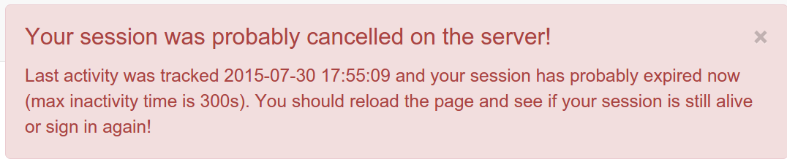

# Managing users and groups

-   [Creating group](creating-group.md)
-   [Creating user](creating-user.md)
-   [User Self-Registration](user-self-registration.md)
-   [User reset password](user-reset-password.md)
-   [Authentication mode](authentication-mode.md)

## Default user {#user-defaults}

Upon installation a default user with name `admin` and password `admin` is created. It is recommended to log in with these credentials directly after the installation has completed and to change the default password.

## User session

After the authentication process, a user session is created. This session will be closed automatically at some point by the server for security reasons. The default session timeout is set to 35 min (see [User session timeout configuration](../../customizing-application/advanced-configuration.md#session-timeout-configuration) for details).

When there is no activity in the browser and the session is about to expire, a warning is displayed next to the user details 3 minutes before the timeout takes place:

One (1) minute before the timeout, another message is displayed:

When the session seems to have been destroyed by the catalog, a message recommends to refresh the page and sign in again if needed:

## Users, Groups and Roles {#user_profiles}

The catalog uses the concept of Users, Groups and User Profiles.

-   A User can be part of one or more Groups.
-   A User has a Role in a Group.
-   The Administrator Role is not related to a Group.

The combination of Role and Group defines what tasks the User can perform on the system or on specific metadata records.

Users can have different roles in different groups. A role defines what tasks the user can perform.

Roles are hierarchical and based on inheritance. This means that a user with an Editor profile can create and modify new metadata records, but can also use all functions a Registered user can use.

Rights associated with the roles are illustrated in detail in the list below:

1.  **Administrator Profile**

    The Administrator has special privileges that give access to all available functions.

    These include:

    -   Full rights for creating new groups and new users.
    -   Rights to change users/groups profiles.
    -   Full rights for creating/editing/deleting new/old metadata.
    -   Perform system administration and configuration tasks.

2.  **User Administrator Profile**

    The user administrator is the administrator of his/her own group(s) with the following privileges:

    -   Full rights on creating new users within their own groups.
    -   Rights to change users profiles within their own groups.

3.  **Content Reviewer Profile**

    The content reviewer is the only person allowed to give final clearance on the metadata publication on the Intranet and/or on the Internet:

    -   Rights on reviewing metadata content within their own groups and authorising its approval and publication.

4.  **Editor Profile**

    The editor works on metadata with following privileges:

    -   Full rights on creating/editing/ deleting new/old data within their own groups.

5.  **Registered User Profile**

    The Registered User has more access privileges than non-authenticated Guest users:

    -   Right to download protected data.

## Role and feature Matrix

The tables below show a comprehensive overview of Roles and Features. It explains in detail what role can do what in GeoNetwork.

| Code | Description                                                   |
|------|---------------------------------------------------------------|
| UI   | Feature visible in the UI, but not usable by the user profile |
| EDIT | The user can edit the metadata imported by the user           |
| DEL  | The user can delete the metadata imported by the user         | 

=== "Search"

    |                                             | Anonymous User          | Registered User         | Editor                  | Reviewer                | User Admin              | Admini- strator         |
    |---------------------------------------------|-------------------------|-------------------------|-------------------------|-------------------------|-------------------------|-------------------------|
    | Metadata selection / Export (ZIP)           | :material-check-circle: | :material-check-circle: | :material-check-circle: | :material-check-circle: | :material-check-circle: | :material-check-circle: |
    | Metadata selection / Export (PDF)           | :material-check-circle: | :material-check-circle: | :material-check-circle: | :material-check-circle: | :material-check-circle: | :material-check-circle: |
    | Metadata selection / Export (CSV)           | :material-check-circle: | :material-check-circle: | :material-check-circle: | :material-check-circle: | :material-check-circle: | :material-check-circle: |
    | Metadata selection / Selection only         | :material-check-circle: | :material-check-circle: | :material-check-circle: | :material-check-circle: | :material-check-circle: | :material-check-circle: |
    | Metadata selection / Update privileges      |                         |                         | :material-check-circle: | :material-check-circle: | :material-check-circle: | :material-check-circle: |
    | Metadata selection / Publish                |                         |                         |                         | :material-check-circle: | :material-check-circle: | :material-check-circle: |
    | Metadata selection / Unpublish              |                         |                         |                         | :material-check-circle: | :material-check-circle: | :material-check-circle: |
    | Metadata selection / Approve                |                         |                         |                         | :material-check-circle: | :material-check-circle: | :material-check-circle: |
    | Metadata selection / Transfer Ownership     |                         |                         |                         |                         | :material-check-circle: | :material-check-circle: |
    | Metadata selection / Validate               |                         |                         | :material-check-circle: | :material-check-circle: | :material-check-circle: | :material-check-circle: |
    | Metadata selection / Validate records links |                         |                         | :material-check-circle: | :material-check-circle: | :material-check-circle: | :material-check-circle: |
    | Metadata selection / Updates categories     |                         |                         | :material-check-circle: | :material-check-circle: | :material-check-circle: | :material-check-circle: |
    | Metadata selection / Delete                 |                         |                         | :material-check-circle: | :material-check-circle: | :material-check-circle: | :material-check-circle: |
    | Metadata selection / Index records          |                         |                         | :material-check-circle: | :material-check-circle: | :material-check-circle: | :material-check-circle: |
    | Preferred Records                           | :material-check-circle: | :material-check-circle: | :material-check-circle: | :material-check-circle: | :material-check-circle: | :material-check-circle: |
    | Watch list                                  | :material-check-circle: | :material-check-circle: | :material-check-circle: | :material-check-circle: | :material-check-circle: | :material-check-circle: |
    | Sorted by relevancy, modified, title...     | :material-check-circle: | :material-check-circle: | :material-check-circle: | :material-check-circle: | :material-check-circle: | :material-check-circle: |

=== "Metadata Page"
 
    |                                                               | Anonymous user          |     Registered User     | Editor                  | Reviewer                |       User Admin        |     Admini- strator     |
    |---------------------------------------------------------------|-------------------------|-------------------------|-------------------------|-------------------------|-------------------------|-------------------------|
    | Edit                                                          |                         |                         | :material-check-circle: | :material-check-circle: | EDIT                    | :material-check-circle: |
    | Delete                                                        |                         |                         | :material-check-circle: | :material-check-circle: | DEL                     | :material-check-circle: |
    | Cancel working copy                                           |                         |                         | :material-check-circle: | :material-check-circle: |                         | :material-check-circle: |
    | Manage Record / Privileges                                    |                         |                         | :material-check-circle: | :material-check-circle: |                         | :material-check-circle: |
    | Manage Record / Transfer Ownership                            |                         |                         |                         |                         |                         | :material-check-circle: |
    | Manage Record / Unpublish                                     |                         |                         |                         | :material-check-circle: |                         | :material-check-circle: |
    | Manage Record / Publish                                       |                         |                         |                         | :material-check-circle: |                         | :material-check-circle: |
    | Manage Record / Workflow / Submit for review                  |                         |                         | :material-check-circle: | :material-check-circle: |                         | :material-check-circle: |
    | Manage Record / Workflow / Directly approve metadata          |                         |                         |                         | :material-check-circle: |                         | :material-check-circle: |
    | Manage Record / Workflow / Approve metadata                   |                         |                         |                         | :material-check-circle: |                         | :material-check-circle: |
    | Manage Record / Workflow / Reject approval submision          |                         |                         |                         | :material-check-circle: |                         | :material-check-circle: |
    | Manage Record / Workflow / Cancel approval submission         |                         |                         | :material-check-circle: |                         |                         | :material-check-circle: |
    | Manage Record / DOI Creation request                          |                         |                         | :material-check-circle: | :material-check-circle: | UI                      | :material-check-circle: |
    | Manage Record / Duplicate                                     |                         |                         | :material-check-circle: | :material-check-circle: | UI                      | :material-check-circle: |
    | Download record / Permalink                                   | :material-check-circle: | :material-check-circle: | :material-check-circle: | :material-check-circle: | :material-check-circle: | :material-check-circle: |
    | Download record / Export (ZIP)                                | :material-check-circle: | :material-check-circle: | :material-check-circle: | :material-check-circle: | :material-check-circle: | :material-check-circle: |
    | Download record / Export (PDF)                                | :material-check-circle: | :material-check-circle: | :material-check-circle: | :material-check-circle: | :material-check-circle: | :material-check-circle: |
    | Download record / Export (XML)                                | :material-check-circle: | :material-check-circle: | :material-check-circle: | :material-check-circle: | :material-check-circle: | :material-check-circle: |
    | Download record / Export (RDF)                                | :material-check-circle: | :material-check-circle: | :material-check-circle: | :material-check-circle: | :material-check-circle: | :material-check-circle: |

=== "Editor"

    |                                       | Anonymous User          | Registered User         | Editor                  | Reviewer                | User Admin              | Admini- strator         |
    |---------------------------------------|-------------------------|-------------------------|-------------------------|-------------------------|-------------------------|-------------------------|
    | Editor board                          |                         |                         | :material-check-circle: | :material-check-circle: | :material-check-circle: | :material-check-circle: |
    | Add new record                        |                         |                         | :material-check-circle: | :material-check-circle: | UI                      | :material-check-circle: |
    | Import new records                    |                         |                         | :material-check-circle: | :material-check-circle: | :material-check-circle: | :material-check-circle: |
    | Manage directory                      |                         |                         | :material-check-circle: | :material-check-circle: | UI                      | :material-check-circle: |
    | Batch editing                         |                         |                         | :material-check-circle: | :material-check-circle: | EDIT                    | :material-check-circle: |
    | Access rights                         |                         |                         |                         |                         |                         | :material-check-circle: |
    | Editor board / Export (ZIP)           |                         |                         | :material-check-circle: | :material-check-circle: | :material-check-circle: | :material-check-circle: |
    | Editor board / Export (PDF)           |                         |                         | :material-check-circle: | :material-check-circle: | :material-check-circle: | :material-check-circle: |
    | Editor board / Export (CSV)           |                         |                         | :material-check-circle: | :material-check-circle: | :material-check-circle: | :material-check-circle: |
    | Editor board / Selection only         |                         |                         | :material-check-circle: | :material-check-circle: | :material-check-circle: | :material-check-circle: |
    | Editor board / Updates privileges     |                         |                         | :material-check-circle: | :material-check-circle: | :material-check-circle: | :material-check-circle: |
    | Editor board / Publish                |                         |                         |                         | :material-check-circle: | :material-check-circle: | :material-check-circle: |
    | Editor board / Unpublish              |                         |                         |                         | :material-check-circle: | :material-check-circle: | :material-check-circle: |
    | Editor board / Approve                |                         |                         |                         | :material-check-circle: | :material-check-circle: | :material-check-circle: |
    | Editor board / Transfer Ownership     |                         |                         |                         |                         | :material-check-circle: | :material-check-circle: |
    | Editor board / Validate               |                         |                         | :material-check-circle: | :material-check-circle: | :material-check-circle: | :material-check-circle: |
    | Editor board / Validate record links  |                         |                         | :material-check-circle: | :material-check-circle: | :material-check-circle: | :material-check-circle: |
    | Editor board / Updates categories     |                         |                         | :material-check-circle: | :material-check-circle: | :material-check-circle: | :material-check-circle: |
    | Editor board / Delete                 |                         |                         | :material-check-circle: | :material-check-circle: | :material-check-circle: | :material-check-circle: |
    | Editor board / Index records          |                         |                         | :material-check-circle: | :material-check-circle: | :material-check-circle: | :material-check-circle: |

=== "Administration"

    |                                                               | Anonymous User          | Registered User         | Editor                  | Reviewer                | User Admin              | Admini- strator         |
    |---------------------------------------------------------------|-------------------------|-------------------------|-------------------------|-------------------------|-------------------------|-------------------------|
    | Summary                                                       |                         |                         |                         |                         |                         | :material-check-circle: |
    | Metadata and Templates                                        |                         |                         |                         |                         |                         | :material-check-circle: |
    | Metadata and Templates / Standards                            |                         |                         |                         |                         |                         | :material-check-circle: |
    | Metadata and Templates / Formatter                            |                         |                         |                         |                         |                         | :material-check-circle: |
    | Metadata and Templates / Validation                           |                         |                         |                         |                         |                         | :material-check-circle: |
    | Metadata and Templates / Metadata Identifier templates        |                         |                         |                         |                         |                         | :material-check-circle: |
    | Users and groups / Manage groups                              |                         |                         |                         |                         | :material-check-circle: | :material-check-circle: |
    | Users and groups / Manage users                               |                         |                         |                         |                         | :material-check-circle: | :material-check-circle: |
    | Harvesting / Catalog harvesters                               |                         |                         |                         |                         | :material-check-circle: | :material-check-circle: |
    | Harvesting / Catalog harvesters report                        |                         |                         |                         |                         | :material-check-circle: | :material-check-circle: |
    | Harvesting / Feature harvesters                               |                         |                         |                         |                         | :material-check-circle: | :material-check-circle: |
    | Statistics and status / Status                                |                         |                         |                         |                         |                         | :material-check-circle: |
    | Statistics and status / Record links analysis                 |                         |                         |                         |                         | :material-check-circle: | :material-check-circle: |
    | Statistics and status / Information                           |                         |                         |                         |                         |                         | :material-check-circle: |
    | Statistics and status / Versioning                            |                         |                         |                         |                         |                         | :material-check-circle: |
    | Statistics and status / Content statistics                    |                         |                         |                         |                         | :material-check-circle: | :material-check-circle: |
    | Reports / Update metadata                                     |                         |                         |                         |                         | :material-check-circle: | :material-check-circle: |
    | Reports / Internal metadata                                   |                         |                         |                         |                         | :material-check-circle: | :material-check-circle: |
    | Reports / Metadata file uploads                               |                         |                         |                         |                         | :material-check-circle: | :material-check-circle: |
    | Reports / Metadata file downloads                             |                         |                         |                         |                         | :material-check-circle: | :material-check-circle: |
    | Reports / Users access                                        |                         |                         |                         |                         | :material-check-circle: | :material-check-circle: |
    | Classification systems / Thesaurus                            |                         |                         |                         |                         |                         | :material-check-circle: |
    | Classification systems / Category                             |                         |                         |                         |                         |                         | :material-check-circle: |
    | Settings / Settings                                           |                         |                         |                         |                         |                         | :material-check-circle: |
    | Settings / User interface                                     |                         |                         |                         |                         | :material-check-circle: | :material-check-circle: |
    | Settings / CSS and Style                                      |                         |                         |                         |                         |                         | :material-check-circle: |
    | Settings / Logo                                               |                         |                         |                         |                         |                         | :material-check-circle: |
    | Settings / Sources                                            |                         |                         |                         |                         | :material-check-circle: | :material-check-circle: |
    | Settings / CSW                                                |                         |                         |                         |                         |                         | :material-check-circle: |
    | Settings / CSW test                                           |                         |                         |                         |                         |                         | :material-check-circle: |
    | Settings / Map servers                                        |                         |                         |                         |                         |                         | :material-check-circle: |
    | Settings / Static pages                                       |                         |                         |                         |                         |                         | :material-check-circle: |
    | Tools / Catalogue admin tools                                 |                         |                         |                         |                         |                         | :material-check-circle: |
    | Tools / Batch process                                         |                         |                         |                         |                         |                         | :material-check-circle: |
    | Tools / Transfer ownership                                    |                         |                         |                         |                         |                         | :material-check-circle: |
