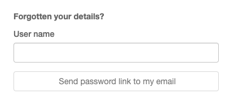

# User 'Forgot your password?' function {#user_forgot_password}

!!! note
    This function requires an email server configured. See [System configuration](../configuring-the-catalog/system-configuration.md#system-config-feedback).

This function allows users who have forgotten their password to request a new one. Go to the sign in page to access the form:

If a user takes this option they will receive an email inviting them to change their password as follows:

    You have requested to change your Greenhouse GeoNetwork Site password.

    You can change your password using the following link:

    http://localhost:8080/geonetwork/srv/en/password.change.form?username=dubya.shrub@greenhouse.gov&changeKey=635d6c84ddda782a9b6ca9dda0f568b011bb7733

    This link is valid for today only.

    Greenhouse GeoNetwork Site

The catalog has generated a changeKey from the forgotten password and the current date and emailed that to the user as part of a link to a change password form.

If you want to change the content of this email, you should modify `xslt/service/account/password-forgotten-email.xsl`.

When the user clicks on the link, a change password form is displayed in their browser and a new password can be entered. When that form is submitted, the changeKey is regenerated and checked with the changeKey supplied in the link, if they match then the password is changed to the new password supplied by the user.

The final step in this process is a verification email sent to the email address of the user confirming that a change of password has taken place:

    Your Greenhouse GeoNetwork Site password has been changed.

    If you did not change this password contact the Greenhouse GeoNetwork Site helpdesk

    The Greenhouse GeoNetwork Site team

If you want to change the content of this email, you should modify `xslt/service/account/password-changed-email.xsl`.
