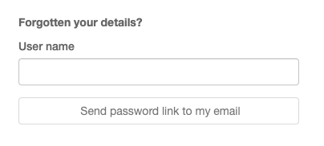

# User 'Forgot your password?' function {#user_forgot_password}

!!! note
    This function requires an email server configured. See [System configuration](../configuring-the-catalog/system-configuration.md#system-config-feedback).

This function allows users who have forgotten their password to request a new one. Go to the sign in page to access the form:



If a user takes this option, they will receive an email inviting them to change their password as follows:

    You have requested to change your Greenhouse GeoNetwork Site password.

    You can change your password using the following link:

    http://localhost:8080/geonetwork/srv/en/password.change.form?username=dubya.shrub@greenhouse.gov&changeKey=635d6c84ddda782a9b6ca9dda0f568b011bb7733

    This link is valid for today only.

    Greenhouse GeoNetwork Site

The catalog has generated a changeKey from the forgotten password and the current date and emailed that to the user as part of a link to a change password form.

If you want to change the content of this email, you should modify `xslt/service/account/password-forgotten-email.xsl`.

When the user clicks on the link, a change password form is displayed in their browser and a new password can be entered. When that form is submitted, the changeKey is regenerated and checked with the changeKey supplied in the link, if they match then the password is changed to the new password supplied by the user.

The final step in this process is a verification email sent to the email address of the user confirming that a change of password has taken place:

    Your Greenhouse GeoNetwork Site password has been changed.

    If you did not change this password contact the Greenhouse GeoNetwork Site helpdesk

    The Greenhouse GeoNetwork Site team

If you want to change the content of this email, you should modify `xslt/service/account/password-changed-email.xsl`.

## Administrator reset without old password {#admin_reset_password}

!!! warning
    The setting below is not created by default, and it cannot be turned on
    from the Admin Console or the settings API. It must be inserted directly
    into the `Settings` database table before it can be used.

An `Administrator` can reset another user's password without knowing that
user's current password. This is controlled by the setting
`system/security/password/allowAdminReset`, which does not exist in the
`Settings` table until it is added manually:

```sql
INSERT INTO Settings (name, value, datatype, position, internal)
VALUES ('system/security/password/allowAdminReset', 'true', 2, 12004, 'n');
```

**GeoNetwork must be restarted** after inserting the row.

Once enabled, log in as a user with the `Administrator` profile (`UserAdmin`
is not sufficient) and either:

-   In the Admin Console, go to **Users**, select the target user, and click
    **Reset password**. The current password field is no longer required.
-   Call the API directly, omitting `passwordOld`:

        POST /{portal}/api/users/{userIdentifier}/actions/forget-password
        {
          "password": "...",
          "password2": "..."
        }

Only enable this setting when no mail server is configured for the
[Forgot your password?](#user_forgot_password) flow described above, since it
lets an administrator take over any account without email verification.
