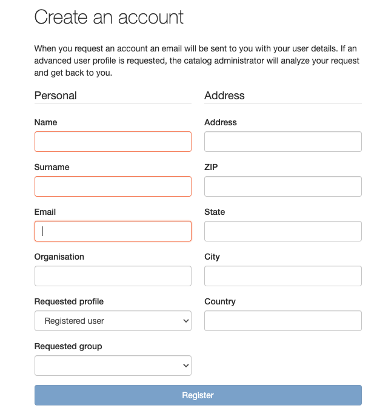

# User Self-Registration {#user_self_registration}

To enable the self-registration functions, see [System configuration](../configuring-the-catalog/system-configuration.md). When self-registration is enabled, for users that are not logged in, an additional link is shown on the login page:

Click the `Create an account` button and fill out the registration form:

The fields in this form are self-explanatory except for the following:

-   **Email**: The user's email address. This is mandatory and will be used as the username.
-   **Profile**: By default, self-registered users are given the `Registered User` profile (see previous section). If any other profile is selected:
    -   the user will still be given the `Registered User` profile
    -   an email will be sent to the Email address nominated in the Feedback section of the 'System Administration' menu, informing them of the request for a more privileged profile

## What happens when a user self-registers?

When a user self-registration occurs, the user receives an email with the new account details that looks something like the following:

    Dear User,

    Your registration at The Greenhouse GeoNetwork Site was successful.

    Your account is:
    username :    dubya.shrub@greenhouse.gov
    password :    0110O3
    usergroup:    GUEST
    usertype :    REGISTEREDUSER

    You've told us that you want to be "Editor", you will be contacted by our office soon.

    To log in and access your account, please click on the link below.
    http://greenhouse.gov/geonetwork

    Thanks for your registration.

    Yours sincerely,
    The team at The Greenhouse GeoNetwork Site

Notice that the user has requested an 'Editor' profile. As a result an email will be sent to the Email address nominated in the Feedback (see [Feedback](../configuring-the-catalog/system-configuration.md#system-config-feedback)) section of the `System Administration` menu which looks something like the following:

Notice also that the user has been added to the built-in user group 'GUEST'. This is a security restriction. An administrator/user-administrator can add the user to other groups if that is required later.

If you want to change the content of this email, you should modify `xslt/service/account/registration-pwd-email.xsl`.

    Dear Admin,

        Newly registered user dubya.shrub@greenhouse.gov has requested "Editor" access for:

        Instance:     The Greenhouse GeoNetwork Site
        Url:          http://greenhouse.gov/geonetwork

        User registration details:

        Name:         Dubya
        Surname:      Shrub
        Email:        dubya.shrub@greenhouse.gov
        Organisation: The Greenhouse
        Type:         gov
        Address:      146 Main Avenue, Creationville
        State:        Clerical
        Post Code:    92373
        Country:      Mythical

    Please action.

    The Greenhouse GeoNetwork Site

If you want to change the content of this email, you should modify `xslt/service/account/registration-prof-email.xsl`.

## The 'Forgot your password?' function

This function allows users who have forgotten their password to request a new one. Go to the sign in page to access the form:

For security reasons, only users that have the `Registered User` profile can request a new password.

If a user takes this option they will receive an email inviting them to change their password as follows:

    You have requested to change your Greenhouse GeoNetwork Site password.

    You can change your password using the following link:

    http://localhost:8080/geonetwork/srv/en/password.change.form?username=dubya.shrub@greenhouse.gov&changeKey=635d6c84ddda782a9b6ca9dda0f568b011bb7733

    This link is valid for today only.

    Greenhouse GeoNetwork Site

The catalog has generated a changeKey from the forgotten password and the current date and emailed that to the user as part of a link to a change password form.

If you want to change the content of this email, you should modify `xslt/service/account/password-forgotten-email.xsl`.

When the user clicks on the link, a change password form is displayed in their browser and a new password can be entered. When that form is submitted, the changeKey is regenerated and checked with the changeKey supplied in the link, if they match then the password is changed to the new password supplied by the user.

The final step in this process is a verification email sent to the email address of the user confirming that a change of password has taken place:

    Your Greenhouse GeoNetwork Site password has been changed.

    If you did not change this password contact the Greenhouse GeoNetwork Site helpdesk

    The Greenhouse GeoNetwork Site team

If you want to change the content of this email, you should modify `xslt/service/account/password-changed-email.xsl`.
