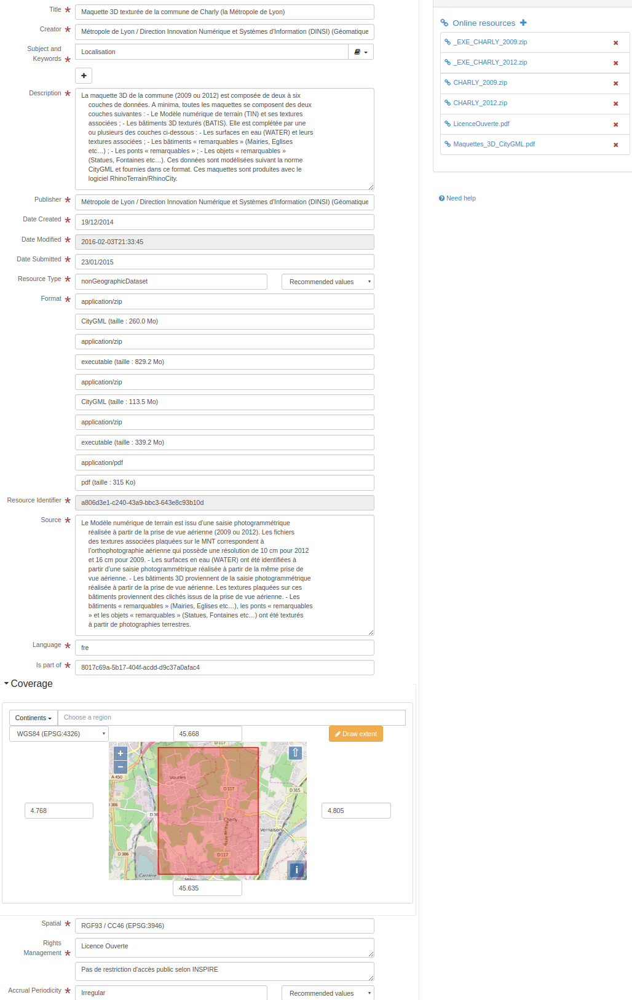

# Dublin core (dublin-core) {#dublin-core}

The Dublin Core Metadata Element Set is a vocabulary of fifteen properties for

:   use in resource description. The name "Dublin" is due to its origin at a 1995 invitational workshop in Dublin, Ohio; "core" because its elements are broad and generic, usable for describing a wide range of resources.

More details:<http://dublincore.org/documents/dces/>

## Metadata editor

This standard can be encoded using 3 view(s).

-   [View: Simple (default)](dublin-core.md#dublin-core-view-default)
-   [View: Full (advanced)](dublin-core.md#dublin-core-view-advanced)
-   [View: XML (xml)](dublin-core.md#dublin-core-view-xml)

### View: Simple (default) {#dublin-core-view-default}

This view is composed of1tab(s).

-   [Tab: Simple (default)](dublin-core.md#dublin-core-tab-default)

This view also allows to add the following element even if not in the current record:

-   Subject and Keywords (dc:subject)

#### Tab: Simple (default) {#dublin-core-tab-default}



This tab display elements from the XML metadata record.

##### Section: Metadata

See [Metadata](dublin-core.md#dublin-core-elem-simpledc-8506dd4a73872a53513368db419204a3)

### View: Full (advanced) {#dublin-core-view-advanced}

This view is composed of1tab(s).

-   [Tab: Full (advanced)](dublin-core.md#dublin-core-tab-advanced)

#### Tab: Full (advanced) {#dublin-core-tab-advanced}

This tab display elements from the XML metadata record and also provide controls to add all elements defined in the schema (XSD).

##### Section: Metadata

See [Metadata](dublin-core.md#dublin-core-elem-simpledc-8506dd4a73872a53513368db419204a3)

### View: XML (xml) {#dublin-core-view-xml}

This view is composed of1tab(s).

-   [Tab: XML (xml)](dublin-core.md#dublin-core-tab-xml)

#### Tab: XML (xml) {#dublin-core-tab-xml}

This tab display elements from the XML metadata record and also provide controls to add all elements defined in the schema (XSD).

## Schema technical details

Standard identifier

:   

> dublin-core

Version

:   

> 1.0

Schema location

:   

Schema namespaces

:   

-   <http://geonetwork-opensource.org/schemas/schema-ident>
-   <http://www.w3.org/2001/XMLSchema-instance>
-   <http://www.w3.org/XML/1998/namespace>

Schema detection mode

:   

> gns:elements (root)

Schema detection elements

:   

-   simpledc

## Standard elements

List of all elements available in the standard.

### Contributor {#dublin-core-elem-dc-contributor-0974cafd6cf5302fe8501874dbe3b3ac}

Name

:   

> dc:contributor

Description

:   

```{=html}
An entity responsible for making contributions to the content of the resource.
```
### Coverage {#dublin-core-elem-dc-coverage-8a3ad050a5c9949ad92271f646817e10}

Name

:   

> dc:coverage

Description

:   

```{=html}
The extent or scope of the content of the resource. Typically, Coverage will
      include spatial location (a place name or geographic coordinates), temporal period (a period
      label, date, or date range), or jurisdiction (such as a named administrative entity).
```
``` xml
<dc:coverage xmlns:dc="http://purl.org/dc/elements/1.1/" xmlns:dct="http://purl.org/dc/terms/"
             xmlns:xsi="http://www.w3.org/2001/XMLSchema-instance">
    North 45.668, South 45.635, East 4.805, West 4.768. CHARLY
  </dc:coverage>
```

### Creator {#dublin-core-elem-dc-creator-f6d71ca3a0b4e9aeb0e518f195f8256e}

Name

:   

> dc:creator

Description

:   

```{=html}
An entity primarily responsible for making the content of the resource.
```
``` xml
<dc:creator xmlns:dc="http://purl.org/dc/elements/1.1/" xmlns:dct="http://purl.org/dc/terms/"
            xmlns:xsi="http://www.w3.org/2001/XMLSchema-instance">
    Métropole de Lyon / Direction Innovation Numérique et Systèmes d'Information
    (DINSI) (Géomatique et données métropolitaines)
  </dc:creator>
```

### Date {#dublin-core-elem-dc-date-23c64254f66925f9eb6e3bd19c442233}

Name

:   

> dc:date

Description

:   

```{=html}
A date of an event in the lifecycle of the resource. Typically, Date will be
      associated with the creation or availability of the resource.
```
### Description {#dublin-core-elem-dc-description-8918d5eea5202286bfa9ceaac948b704}

Name

:   

> dc:description

Description

:   

```{=html}
An account of the content of the resource.
```
``` xml
<dc:description xmlns:dc="http://purl.org/dc/elements/1.1/" xmlns:dct="http://purl.org/dc/terms/"
                xmlns:xsi="http://www.w3.org/2001/XMLSchema-instance">
    La maquette 3D de la commune (2009 ou 2012) est composée de deux à six
    couches de données. A minima, toutes les maquettes se composent des deux
    couches suivantes : - Le Modèle numérique de terrain (TIN) et ses textures
    associées ; - Les bâtiments 3D texturés (BATIS). Elle est complétée par une
    ou plusieurs des couches ci-dessous : - Les surfaces en eau (WATER) et leurs
    textures associées ; - Les bâtiments « remarquables » (Mairies, Eglises
    etc…) ; - Les ponts « remarquables » ; - Les objets « remarquables »
    (Statues, Fontaines etc…). Ces données sont modélisées suivant la norme
    CityGML et fournies dans ce format. Ces maquettes sont produites avec le
    logiciel RhinoTerrain/RhinoCity.
  </dc:description>
```

### Format {#dublin-core-elem-dc-format-3842730cdb5c8559fe6f2737815429ea}

Name

:   

> dc:format

Description

:   

```{=html}
The physical or digital manifestation of the resource. Typically, Format will
      include the media-type or dimensions of the resource. Format may be used to identify the
      software, hardware, or other equipment needed to display or operate the resource.
```
### Resource Identifier {#dublin-core-elem-dc-identifier-7d64a0a5c40868491c49bf7df7574752}

Name

:   

> dc:identifier

Description

:   

```{=html}
An unambiguous reference to the resource within a given context.
```
``` xml
<dc:identifier xmlns:dc="http://purl.org/dc/elements/1.1/" xmlns:dct="http://purl.org/dc/terms/"
               xmlns:xsi="http://www.w3.org/2001/XMLSchema-instance">a806d3e1-c240-43a9-bbc3-643e8c93b10d</dc:identifier>
```

### Language {#dublin-core-elem-dc-language-74e0ef625be0b45d0e6c64d5f76e1895}

Name

:   

> dc:language

Description

:   

```{=html}
A language of the intellectual content of the resource. Recommended best practice
      is to use RFC 3066, which, in conjunction with ISO 639, defines two- and three-letter primary
      language tags with optional subtags.
```
``` xml
<dc:language xmlns:dc="http://purl.org/dc/elements/1.1/" xmlns:dct="http://purl.org/dc/terms/"
             xmlns:xsi="http://www.w3.org/2001/XMLSchema-instance">fre</dc:language>
```

### Publisher {#dublin-core-elem-dc-publisher-5534d3efaa13b75c3aa34c379dd91025}

Name

:   

> dc:publisher

Description

:   

```{=html}
An entity responsible for making the resource available.
```
``` xml
<dc:publisher xmlns:dc="http://purl.org/dc/elements/1.1/" xmlns:dct="http://purl.org/dc/terms/"
              xmlns:xsi="http://www.w3.org/2001/XMLSchema-instance">
    Métropole de Lyon / Direction Innovation Numérique et Systèmes d'Information
    (DINSI) (Géomatique et données métropolitaines)
  </dc:publisher>
```

### Relation {#dublin-core-elem-dc-relation-3772ef19f1f075e519d2d0a60ec6f05a}

Name

:   

> dc:relation

Description

:   

```{=html}
A reference to a related resource.
```
### Rights Management {#dublin-core-elem-dc-rights-32dce43ec1342a098287b03b6a5cb72f}

Name

:   

> dc:rights

Description

:   

```{=html}
Information about rights held in and over the resource.
```
### Source {#dublin-core-elem-dc-source-104607b158c41c5855de1ed62ae223dd}

Name

:   

> dc:source

Description

:   

```{=html}
A Reference to a resource from which the present resource is derived. The present
      resource may be derived from the Source resource in whole or in part.
```
``` xml
<dc:source xmlns:dc="http://purl.org/dc/elements/1.1/" xmlns:dct="http://purl.org/dc/terms/"
           xmlns:xsi="http://www.w3.org/2001/XMLSchema-instance">
    Le Modèle numérique de terrain est issu d’une saisie photogrammétrique
    réalisée à partir de la prise de vue aérienne (2009 ou 2012). Les fichiers
    des textures associées plaquées sur le MNT correspondent à
    l’orthophotographie aérienne qui possède une résolution de 10 cm pour 2012
    et 16 cm pour 2009. - Les surfaces en eau (WATER) ont été identifiées à
    partir d’une saisie photogrammétrique réalisée à partir de la même prise de
    vue aérienne. - Les bâtiments 3D proviennent de la saisie photogrammétrique
    réalisée à partir de la prise de vue aérienne. Les textures plaquées sur ces
    bâtiments proviennent des clichés issus de la prise de vue aérienne. - Les
    bâtiments « remarquables » (Mairies, Eglises etc…), les ponts « remarquables
    » et les objets « remarquables » (Statues, Fontaines etc…) ont été texturés
    à partir de photographies terrestres.
  </dc:source>
```

### Subject and Keywords {#dublin-core-elem-dc-subject-a88bd90b4991695f8c45fe01df3f64d6}

Name

:   

> dc:subject

Description

:   

```{=html}
A topic of the content of the resource. Typically, Subject will be expressed as
      keywords, key phrases, or classification codes that describe a topic of the resource.
```
``` xml
<dc:subject xmlns:dc="http://purl.org/dc/elements/1.1/" xmlns:dct="http://purl.org/dc/terms/"
            xmlns:xsi="http://www.w3.org/2001/XMLSchema-instance">Localisation</dc:subject>
```

### Title {#dublin-core-elem-dc-title-18e3be863c870257c8b70d577038ee5f}

Name

:   

> dc:title

Description

:   

```{=html}
A name given to the resource. Typically, Title will be a name by which the resource
      is formally known.
```
``` xml
<dc:title xmlns:dc="http://purl.org/dc/elements/1.1/" xmlns:dct="http://purl.org/dc/terms/"
          xmlns:xsi="http://www.w3.org/2001/XMLSchema-instance">
    Maquette 3D texturée de la commune de Charly (la Métropole de Lyon)
  </dc:title>
```

### Resource Type {#dublin-core-elem-dc-type-15bbc75f8dbe617d6ed609fcf1202ee1}

Name

:   

> dc:type

Description

:   

```{=html}
The nature or genre of the content of the resource. Type includes terms describing
      general categories, functions, genres, or aggregation levels for content.
```
Recommended values

| code    | label   |
|---------|---------|
| dataset | Dataset |
| service | Service |

``` xml
<dc:type xmlns:dc="http://purl.org/dc/elements/1.1/" xmlns:dct="http://purl.org/dc/terms/"
         xmlns:xsi="http://www.w3.org/2001/XMLSchema-instance">nonGeographicDataset</dc:type>
```

### URI {#dublin-core-elem-dc-URI-8f2cb1e27778e1b1977e670ca7e7a282}

Name

:   

> dc:URI

Description

:   

### Abstract {#dublin-core-elem-dct-abstract-a48c3a17636153c58749c5fc29d1bd28}

Name

:   

> dct:abstract

Description

:   

```{=html}
A summary of the content of the resource.
```
### Access Rights {#dublin-core-elem-dct-accessRights-972cd1c89a0274325b1a3b99e34c95be}

Name

:   

> dct:accessRights

Description

:   

```{=html}
Information about who can access the resource or an indication of its security
      status.
```
### Accrual Method {#dublin-core-elem-dct-accrualMethod-6fa8ea67638a1578c231025e31dd40e9}

Name

:   

> dct:accrualMethod

Description

:   

```{=html}
The method by which items are added to a collection.
```
### Accrual Periodicity {#dublin-core-elem-dct-accrualPeriodicity-2a4c9a8426dd588e960559174a3df263}

Name

:   

> dct:accrualPeriodicity

Description

:   

```{=html}
The frequency with which items are added to a collection.
```
Recommended values

| code        | label       |
|-------------|-------------|
| continual   | Continual   |
| daily       | Daily       |
| weekly      | Weekly      |
| fortnightly | Fortnightly |
| monthly     | Monthly     |
| quarterly   | Quarterly   |
| biannually  | Biannually  |
| annually    | Annually    |
| asNeeded    | As needed   |
| irregular   | Irregular   |
| notPlanned  | Not planned |
| unknown     | Unknown     |

``` xml
<dct:accrualPeriodicity xmlns:dc="http://purl.org/dc/elements/1.1/" xmlns:dct="http://purl.org/dc/terms/"
                        xmlns:xsi="http://www.w3.org/2001/XMLSchema-instance">Irregular</dct:accrualPeriodicity>
```

### Accrual Policy {#dublin-core-elem-dct-accrualPolicy-0ae937a1f9081db219a5dd04ed4610d4}

Name

:   

> dct:accrualPolicy

Description

:   

```{=html}
The policy governing the addition of items to a collection.
```
### Alternative Title {#dublin-core-elem-dct-alternative-2518e8fc9fa67f5a10348016aae8bb0f}

Name

:   

> dct:alternative

Description

:   

```{=html}
An alternative name for the resource.
```
### Audience {#dublin-core-elem-dct-audience-a610cbdc155d7cd9c87c8f22ef245521}

Name

:   

> dct:audience

Description

:   

```{=html}
A class of entity for whom the resource is intended or useful.
```
### Bibliographic Citation {#dublin-core-elem-dct-bibliographicCitation-0d3ba175bdb84be48dec71bdb6b318da}

Name

:   

> dct:bibliographicCitation

Description

:   

```{=html}
A bibliographic reference for the resource.
```
### Conforms To {#dublin-core-elem-dct-conformsTo-703d80b57bd6629b2bff3f57efd52dc5}

Name

:   

> dct:conformsTo

Description

:   

```{=html}
An established standard to which the described resource conforms.
```
### Date Created {#dublin-core-elem-dct-created-9aebe20151c1c962d66737fcb9b87c2c}

Name

:   

> dct:created

Description

:   

```{=html}
Date of creation of the resource.
```
``` xml
<dct:created xmlns:dc="http://purl.org/dc/elements/1.1/" xmlns:dct="http://purl.org/dc/terms/"
             xmlns:xsi="http://www.w3.org/2001/XMLSchema-instance">2014-12-19</dct:created>
```

### Date Accepted {#dublin-core-elem-dct-dateAccepted-9f6f7b46bae794b317c939c75170b0f1}

Name

:   

> dct:dateAccepted

Description

:   

```{=html}
Date of acceptance of the resource.
```
### Date Copyrighted {#dublin-core-elem-dct-dateCopyrighted-1a3940c001fd2db761829940957d8bf7}

Name

:   

> dct:dateCopyrighted

Description

:   

```{=html}
Date of copyright.
```
### Date Submitted {#dublin-core-elem-dct-dateSubmitted-0e038c3b8ac6daca57211a938eca6154}

Name

:   

> dct:dateSubmitted

Description

:   

```{=html}
Date of submission of the resource
```
``` xml
<dct:dateSubmitted xmlns:dc="http://purl.org/dc/elements/1.1/" xmlns:dct="http://purl.org/dc/terms/"
                   xmlns:xsi="http://www.w3.org/2001/XMLSchema-instance">2015-01-23</dct:dateSubmitted>
```

### Audience Education Level {#dublin-core-elem-dct-educationLevel-fa33466d34d56fb066753a6d97089631}

Name

:   

> dct:educationLevel

Description

:   

```{=html}
A class of entity, defined in terms of progression through an educational or
      training context, for which the described resource is intended.
```
### Extent {#dublin-core-elem-dct-extent-8a3a9adeaaac054e64dff722ad23c776}

Name

:   

> dct:extent

Description

:   

```{=html}
The size or duration of the resource.
```
### Has Format {#dublin-core-elem-dct-hasFormat-d136ed16dc44af39fdf1b98b9fb4bc33}

Name

:   

> dct:hasFormat

Description

:   

```{=html}
A related resource that is substantially the same as the pre-existing described
      resource, but in another format.
```
### Has Part {#dublin-core-elem-dct-hasPart-f251f156dd8774a81f44c13c7b4a9e7d}

Name

:   

> dct:hasPart

Description

:   

```{=html}
A related resource that is included either physically or logically in the described
      resource.
```
### Has Version {#dublin-core-elem-dct-hasVersion-b8dc08cd4fc15cf1df605c2905b0c5e3}

Name

:   

> dct:hasVersion

Description

:   

```{=html}
A related resource that is a version, edition, or adaptation of the described
      resource.
```
### Instructional Method {#dublin-core-elem-dct-instructionalMethod-d220d889250a4a0f7e3efe29fc0f0ada}

Name

:   

> dct:instructionalMethod

Description

:   

```{=html}
A process, used to engender knowledge, attitudes and skills, that the resource is
      designed to support.
```
### Is Format Of {#dublin-core-elem-dct-isFormatOf-8378903643254b5b83ae2acdc251b6a6}

Name

:   

> dct:isFormatOf

Description

:   

```{=html}
A related resource that is substantially the same as the described resource, but in
      another format.
```
### Is part of {#dublin-core-elem-dct-isPartOf-6697c98943756abf56d4c2a50f9dc9a2}

Name

:   

> dct:isPartOf

Description

:   

```{=html}
A related resource in which the described resource is physically or logically
      included.
```
``` xml
<dct:isPartOf xmlns:dc="http://purl.org/dc/elements/1.1/" xmlns:dct="http://purl.org/dc/terms/"
              xmlns:xsi="http://www.w3.org/2001/XMLSchema-instance">8017c69a-5b17-404f-acdd-d9c37a0afac4</dct:isPartOf>
```

### Is Referenced By {#dublin-core-elem-dct-isReferencedBy-4cf2c75a368a7773ec781eaa6f4a7c03}

Name

:   

> dct:isReferencedBy

Description

:   

```{=html}
A related resource that references, cites, or otherwise points to the described
      resource.
```
### Is Replaced By {#dublin-core-elem-dct-isReplacedBy-1e391e071c75e45dcf0a309285a642a0}

Name

:   

> dct:isReplacedBy

Description

:   

```{=html}
A related resource that supplants, displaces, or supersedes the described
      resource.
```
### Is Required By {#dublin-core-elem-dct-isRequiredBy-def534523d854e3440e36701bea47cc4}

Name

:   

> dct:isRequiredBy

Description

:   

```{=html}
A related resource that requires the described resource to support its function,
      delivery, or coherence.
```
### Date Issued {#dublin-core-elem-dct-issued-9f6ad8cb4b5e6225c1cb755489adb774}

Name

:   

> dct:issued

Description

:   

```{=html}
Date of formal issuance (e.g., publication) of the resource.
```
### Is Version Of {#dublin-core-elem-dct-isVersionOf-d1658a9e84f777d0a335528e82921417}

Name

:   

> dct:isVersionOf

Description

:   

```{=html}
A related resource of which the described resource is a version, edition, or
      adaptation.
```
### License {#dublin-core-elem-dct-license-865405c25292b886c12f7d056ebaabda}

Name

:   

> dct:license

Description

:   

```{=html}
A legal document giving official permission to do something with the resource.
```
### Mediator {#dublin-core-elem-dct-mediator-ab02c72730e6dbccbfb74b07e00edf10}

Name

:   

> dct:mediator

Description

:   

```{=html}
An entity that mediates access to the resource and for whom the resource is
      intended or useful.
```
### Medium {#dublin-core-elem-dct-medium-95f834fde8ee306293ebebcfd7a3aba5}

Name

:   

> dct:medium

Description

:   

```{=html}
The material or physical carrier of the resource.
```
### Date Modified {#dublin-core-elem-dct-modified-66ecff9b0ec74fad28c5babebc1eec7d}

Name

:   

> dct:modified

Description

:   

```{=html}
Data metadata was modified
```
``` xml
<dct:modified xmlns:dc="http://purl.org/dc/elements/1.1/" xmlns:dct="http://purl.org/dc/terms/"
              xmlns:xsi="http://www.w3.org/2001/XMLSchema-instance">2016-02-03T21:33:45</dct:modified>
```

### Provenance {#dublin-core-elem-dct-provenance-4ec9c18f260230d4455195d6a6f28c17}

Name

:   

> dct:provenance

Description

:   

```{=html}
A statement of any changes in ownership and custody of the resource since its
      creation that are significant for its authenticity, integrity and interpretation.
```
### Related resource {#dublin-core-elem-dct-references-3a44416fcd20eea0684aad2fd3228fdd}

Name

:   

> dct:references

Description

:   

```{=html}
A related resource that is referenced, cited, or otherwise pointed to by the
      described resource.
```
### Replaces {#dublin-core-elem-dct-replaces-c5b09017642a464af7a04db426f6d74f}

Name

:   

> dct:replaces

Description

:   

```{=html}
A related resource that is supplanted, displaced, or superseded by the described
      resource.
```
### Requires {#dublin-core-elem-dct-requires-2ad52ab491717dc624f79f92303f4679}

Name

:   

> dct:requires

Description

:   

```{=html}
A related resource that is required by the described resource to support its
      function, delivery, or coherence.
```
### Rights Holder {#dublin-core-elem-dct-rightsHolder-0f4304cc1135f8fc29f7a0ede8daa268}

Name

:   

> dct:rightsHolder

Description

:   

```{=html}
A person or organization owning or managing rights over the resource.
```
### Spatial {#dublin-core-elem-dct-spatial-5100d679492a6f79fd3e53db624bcab2}

Name

:   

> dct:spatial

Description

:   

```{=html}
Spatial characteristics of the intellectual content of the resource.
```
``` xml
<dct:spatial xmlns:dc="http://purl.org/dc/elements/1.1/" xmlns:dct="http://purl.org/dc/terms/"
             xmlns:xsi="http://www.w3.org/2001/XMLSchema-instance">RGF93 / CC46 (EPSG:3946)</dct:spatial>
```

### Table Of Contents {#dublin-core-elem-dct-tableOfContents-c20c496386cad7aa48ad05ca41a6340b}

Name

:   

> dct:tableOfContents

Description

:   

```{=html}
A list of subunits of the resource.
```
### Temporal Coverage {#dublin-core-elem-dct-temporal-0a2abb1d37421418cafeb48bd21e6854}

Name

:   

> dct:temporal

Description

:   

```{=html}
Temporal characteristics of the resource.
```
### Date Valid {#dublin-core-elem-dct-valid-343768fccc581bc0822c69e6ca19c70c}

Name

:   

> dct:valid

Description

:   

```{=html}
Date (often a range) of validity of a resource.
```
### Metadata {#dublin-core-elem-simpledc-8506dd4a73872a53513368db419204a3}

Name

:   

> simpledc

Description

:   

``` xml
<simpledc xmlns:dc="http://purl.org/dc/elements/1.1/" xmlns:dct="http://purl.org/dc/terms/"
          xsi:noNamespaceSchemaLocation="http://localhost/geonetwork/xml/schemas/dublin-core/schema.xsd">
   <dc:title>
    Maquette 3D texturée de la commune de Charly (la Métropole de Lyon)
  </dc:title>
   <dc:creator>
    Métropole de Lyon / Direction Innovation Numérique et Systèmes d'Information
    (DINSI) (Géomatique et données métropolitaines)
  </dc:creator>
   <dc:subject>Localisation</dc:subject>
   <dc:description>
    La maquette 3D de la commune (2009 ou 2012) est composée de deux à six
    couches de données. A minima, toutes les maquettes se composent des deux
    couches suivantes : - Le Modèle numérique de terrain (TIN) et ses textures
    associées ; - Les bâtiments 3D texturés (BATIS). Elle est complétée par une
    ou plusieurs des couches ci-dessous : - Les surfaces en eau (WATER) et leurs
    textures associées ; - Les bâtiments « remarquables » (Mairies, Eglises
    etc…) ; - Les ponts « remarquables » ; - Les objets « remarquables »
    (Statues, Fontaines etc…). Ces données sont modélisées suivant la norme
    CityGML et fournies dans ce format. Ces maquettes sont produites avec le
    logiciel RhinoTerrain/RhinoCity.
  </dc:description>
   <dc:publisher>
    Métropole de Lyon / Direction Innovation Numérique et Systèmes d'Information
    (DINSI) (Géomatique et données métropolitaines)
  </dc:publisher>
   <dc:type>nonGeographicDataset</dc:type>
   <dc:format>application/zip</dc:format>
   <dc:format>CityGML (taille : 260.0 Mo)</dc:format>
   <dc:format>application/zip</dc:format>
   <dc:format>executable (taille : 829.2 Mo)</dc:format>
   <dc:format>application/zip</dc:format>
   <dc:format>CityGML (taille : 113.5 Mo)</dc:format>
   <dc:format>application/zip</dc:format>
   <dc:format>executable (taille : 339.2 Mo)</dc:format>
   <dc:format>application/pdf</dc:format>
   <dc:format>pdf (taille : 315 Ko)</dc:format>
   <dc:source>
    Le Modèle numérique de terrain est issu d’une saisie photogrammétrique
    réalisée à partir de la prise de vue aérienne (2009 ou 2012). Les fichiers
    des textures associées plaquées sur le MNT correspondent à
    l’orthophotographie aérienne qui possède une résolution de 10 cm pour 2012
    et 16 cm pour 2009. - Les surfaces en eau (WATER) ont été identifiées à
    partir d’une saisie photogrammétrique réalisée à partir de la même prise de
    vue aérienne. - Les bâtiments 3D proviennent de la saisie photogrammétrique
    réalisée à partir de la prise de vue aérienne. Les textures plaquées sur ces
    bâtiments proviennent des clichés issus de la prise de vue aérienne. - Les
    bâtiments « remarquables » (Mairies, Eglises etc…), les ponts « remarquables
    » et les objets « remarquables » (Statues, Fontaines etc…) ont été texturés
    à partir de photographies terrestres.
  </dc:source>
   <dc:language>fre</dc:language>
   <dc:relation>
    https://download.data.grandlyon.com/files/grandlyon/localisation/bati3d/CHARLY_2012.zip
  </dc:relation>
   <dc:relation>
    https://download.data.grandlyon.com/files/grandlyon/localisation/bati3d/_EXE_CHARLY_2012.zip
  </dc:relation>
   <dc:relation>
    https://download.data.grandlyon.com/files/grandlyon/localisation/bati3d/CHARLY_2009.zip
  </dc:relation>
   <dc:relation>
    https://download.data.grandlyon.com/files/grandlyon/localisation/bati3d/_EXE_CHARLY_2009.zip
  </dc:relation>
   <dc:relation>
    https://download.data.grandlyon.com/files/grandlyon/localisation/bati3d/Maquettes_3D_CityGML.pdf
  </dc:relation>
   <dc:relation>
    https://download.data.grandlyon.com/files/grandlyon/LicenceOuverte.pdf
  </dc:relation>
   <dc:coverage>
    North 45.668, South 45.635, East 4.805, West 4.768. CHARLY
  </dc:coverage>
   <dc:rights>Licence Ouverte</dc:rights>
   <dc:rights>Pas de restriction d'accès public selon INSPIRE</dc:rights>
   <dct:created>2014-12-19</dct:created>
   <dct:dateSubmitted>2015-01-23</dct:dateSubmitted>
   <dct:isPartOf>8017c69a-5b17-404f-acdd-d9c37a0afac4</dct:isPartOf>
   <dct:spatial>RGF93 / CC46 (EPSG:3946)</dct:spatial>
   <dct:accrualPeriodicity>Irregular</dct:accrualPeriodicity>
   <dct:modified>2016-02-03T21:33:45</dct:modified>
   <dc:identifier>a806d3e1-c240-43a9-bbc3-643e8c93b10d</dc:identifier>
</simpledc>
```

## Standard codelists

List of all codelists available in the standard.

No codelist defined.
