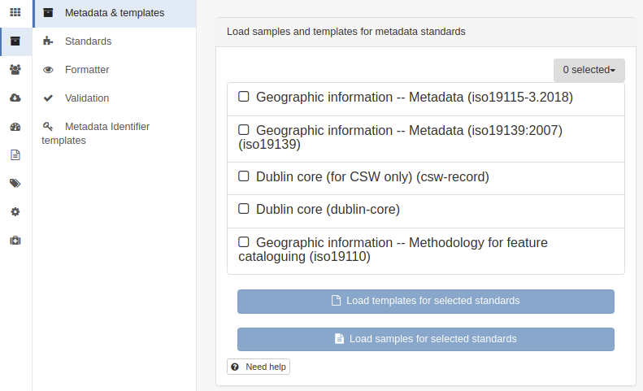

# Standards

The catalog support the following standards:

-   [Iso19115 3.2018](iso19115-3.2018.md)
-   [Iso19139](iso19139.md)
-   [Iso19110](iso19110.md)
-   [Dublin Core](dublin-core.md)

ISO19110 can be used to encode feature catalogue (but ISO19115-3 is recommended).

Dublin core (for CSW only) is only used to test OGC CSW testsuites.

Others standards and community profiles are available on <https://github.com/metadata101>.
