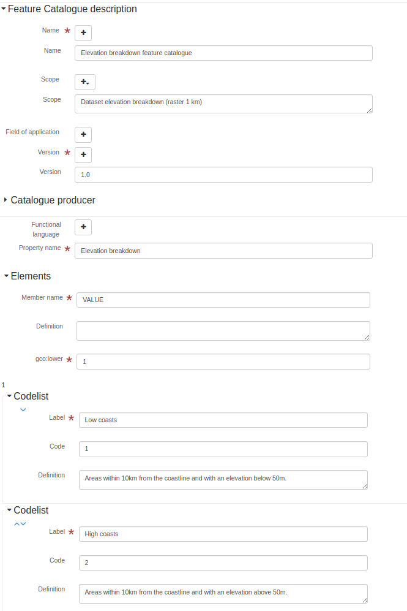

# Geographic information -- Methodology for feature cataloguing (Deprecated - use ISO19115-3) (iso19110) {#iso19110}

More details: <http://www.iso.org/iso/home/store/catalogue_tc/catalogue_detail.htm?csnumber=39965>

## Metadata editor

This standard can be encoded using 3 view(s).

-   [View: Simple (default)](iso19110.md#iso19110-view-default)
-   [View: Full (advanced)](iso19110.md#iso19110-view-advanced)
-   [View: XML (xml)](iso19110.md#iso19110-view-xml)

### View: Simple (default) {#iso19110-view-default}

This view is composed of1tab(s).

-   [Tab: Simple (default)](iso19110.md#iso19110-tab-default)

This view also allows to add the following element even if not in the current record:

-   Code (gfc:code)
-   Codelist (gfc:listedValue)

#### Tab: Simple (default) {#iso19110-tab-default}



This tab display elements from the XML metadata record.

##### Name

```{=html}
Feature catalogue name
```

XPath

:   

> /gfc:FC_FeatureCatalogue/gmx:name

See [Name](iso19110.md#iso19110-elem-gmx-name-5ec0c4442ad2b94944636103e556d401)

##### Name

```{=html}
Feature catalogue name
```

XPath

:   

> /gfc:FC_FeatureCatalogue/gfc:name

See [Name](iso19110.md#iso19110-elem-gfc-name-134285dc9b9a3268556039e2fe3f370e)

##### Scope

```{=html}
Scope definition
```

XPath

:   

> /gfc:FC_FeatureCatalogue/gmx:scope

See [Scope](iso19110.md#iso19110-elem-gmx-scope-14efac6982297b09ba1324e80138092f)

##### Scope

```{=html}
Scope definition
```

XPath

:   

> /gfc:FC_FeatureCatalogue/gfc:scope

See [Scope](iso19110.md#iso19110-elem-gfc-scope-4f044fce55b8e0b6dd0d77516ad9e66d)

##### Field of application

```{=html}
Field of application
```

XPath

:   

> /gfc:FC_FeatureCatalogue/gmx:fieldOfApplication

See [Field of application](iso19110.md#iso19110-elem-gmx-fieldOfApplication-66508d1f139317e01e1decd095915428)

##### Field of application

```{=html}
Field of application
```

XPath

:   

> /gfc:FC_FeatureCatalogue/gfc:fieldOfApplication

See [Field of application](iso19110.md#iso19110-elem-gfc-fieldOfApplication-548e0631e3ea92f7dd05ac533b6c14d2)

##### Version

```{=html}
Catalogue version
```

XPath

:   

> /gfc:FC_FeatureCatalogue/gmx:versionNumber

See [Version](iso19110.md#iso19110-elem-gmx-versionNumber-075201f18225aec432b46c75a93589a2)

##### Version

```{=html}
Catalogue version
```

XPath

:   

> /gfc:FC_FeatureCatalogue/gfc:versionNumber

See [Version](iso19110.md#iso19110-elem-gfc-versionNumber-d66ec9fd5c22c70a69dd2b759d66cc4f)

##### Date

```{=html}
Catalogue date
```

XPath

:   

> /gfc:FC_FeatureCatalogue/gmx:versionDate

See [Date](iso19110.md#iso19110-elem-gmx-versionDate-6c27e2ee0b2daa4ab1aea9ef374bc08f)

##### Catalogue producer

```{=html}
Catalogue responsible
```

XPath

:   

> /gfc:FC_FeatureCatalogue/gfc:producer

See [Catalogue producer](iso19110.md#iso19110-elem-gfc-producer-5a13bfab8b07441bc9f9f71dcfdf7f6c)

##### Functional language

XPath

:   

> /gfc:FC_FeatureCatalogue/gfc:functionalLanguage

See [Functional language](iso19110.md#iso19110-elem-gfc-functionalLanguage-7a21d9c35ed9c400c40959ede97b8d76)

##### Property description

```{=html}
Property description
```

XPath

:   

> /gfc:FC_FeatureCatalogue/gfc:featureType

See [Property description](iso19110.md#iso19110-elem-gfc-featureType-d6099a684b15337451388dd46048c48f)

Type

:   

> suggest

### View: Full (advanced) {#iso19110-view-advanced}

This view is composed of1tab(s).

-   [Tab: Full (advanced)](iso19110.md#iso19110-tab-advanced)

#### Tab: Full (advanced) {#iso19110-tab-advanced}

This tab display elements from the XML metadata record and also provide controls to add all elements defined in the schema (XSD).

##### Section: Feature Catalogue description

See [Feature Catalogue description](iso19110.md#iso19110-elem-gfc-FC_FeatureCatalogue-a4de444fdd9a6e86e8ba63bb96be363c)

### View: XML (xml) {#iso19110-view-xml}

This view is composed of1tab(s).

-   [Tab: XML (xml)](iso19110.md#iso19110-tab-xml)

#### Tab: XML (xml) {#iso19110-tab-xml}

This tab display elements from the XML metadata record and also provide controls to add all elements defined in the schema (XSD).

## Schema technical details

Standard identifier

:   

> iso19110

Version

:   

> 1.0

Schema location

:   

> <http://www.isotc211.org/2005/gfc> <http://www.isotc211.org/2005/gfc/gfc.xsd>

Schema namespaces

:   

-   <http://geonetwork-opensource.org/schemas/schema-ident>
-   <http://www.isotc211.org/2005/gfc>
-   <http://www.w3.org/2001/XMLSchema-instance>
-   <http://www.w3.org/XML/1998/namespace>

Schema detection mode

:   

> elements (root)

Schema detection elements

:   

-   gfc:FC_FeatureCatalogue
-   gfc:FC_FeatureType

## Standard elements

List of all elements available in the standard.

### Text {#iso19110-elem-gco-CharacterString-44f4a753bad9d1df04d0611f28f05110}

Name

:   

> gco:CharacterString

Description

:   

### Lower cardinality {#iso19110-elem-gco-lower-52bfcbb528e9aaefc2e33f4fdc55aa5f}

Name

:   

> gco:lower

Description

:   

```{=html}
Lower cardinality
```
``` xml
<gco:lower xmlns:gfc="http://www.isotc211.org/2005/gfc"
           xmlns:xsi="http://www.w3.org/2001/XMLSchema-instance">
   <gco:Integer>1</gco:Integer>
</gco:lower>
```

### Nil reason {#iso19110-elem-gco-nilReason-59d9c7937eb12ff82e61921ee335d062}

Name

:   

> gco:nilReason

Description

:   

### Range {#iso19110-elem-gco-range-6709132eada2bd317e3ad342849df5ef}

Name

:   

> gco:range

Description

:   

``` xml
<gco:range xmlns:gfc="http://www.isotc211.org/2005/gfc"
           xmlns:xsi="http://www.w3.org/2001/XMLSchema-instance">
   <gco:MultiplicityRange>
      <gco:lower>
         <gco:Integer>1</gco:Integer>
      </gco:lower>
      <gco:upper>
         <gco:UnlimitedInteger isInfinite="false" xsi:nil="false">1
                    </gco:UnlimitedInteger>
      </gco:upper>
   </gco:MultiplicityRange>
</gco:range>
```

### Upper cardinality {#iso19110-elem-gco-upper-a58d7645455b8f20c0d2608c5bc1b6ab}

Name

:   

> gco:upper

Description

:   

```{=html}
Upper cardinality
```
``` xml
<gco:upper xmlns:gfc="http://www.isotc211.org/2005/gfc"
           xmlns:xsi="http://www.w3.org/2001/XMLSchema-instance">
   <gco:UnlimitedInteger isInfinite="false" xsi:nil="false">1
                    </gco:UnlimitedInteger>
</gco:upper>
```

### Affects value of {#iso19110-elem-gfc-affectsValueOf-3cc26e7cd38219c7bb06fbe8e5438598}

Name

:   

> gfc:affectsValueOf

Description

:   

### Aliases {#iso19110-elem-gfc-aliases-7ec87797f5b619c461f2acf995b56b2e}

Name

:   

> gfc:aliases

Description

:   

### Cardinalities {#iso19110-elem-gfc-cardinality-36c218fd045f824ca4f9d1ceb6ffbcc2}

Name

:   

> gfc:cardinality

Description

:   

```{=html}
Cardinalities
```
``` xml
<gfc:cardinality xmlns:gfc="http://www.isotc211.org/2005/gfc"
                 xmlns:xsi="http://www.w3.org/2001/XMLSchema-instance">
   <gco:Multiplicity>
      <gco:range>
         <gco:MultiplicityRange>
            <gco:lower>
               <gco:Integer>1</gco:Integer>
            </gco:lower>
            <gco:upper>
               <gco:UnlimitedInteger isInfinite="false" xsi:nil="false">1
                    </gco:UnlimitedInteger>
            </gco:upper>
         </gco:MultiplicityRange>
      </gco:range>
   </gco:Multiplicity>
</gfc:cardinality>
```

### Elements {#iso19110-elem-gfc-carrierOfCharacteristics-c804ac9130fc47e8753b8d2e3776840b}

Name

:   

> gfc:carrierOfCharacteristics

Description

:   

```{=html}
Association, attribute, operation, ...
```
``` xml
<gfc:carrierOfCharacteristics xmlns:gfc="http://www.isotc211.org/2005/gfc"
                              xmlns:xsi="http://www.w3.org/2001/XMLSchema-instance">
   <gfc:FC_FeatureAttribute>
      <gfc:memberName>
         <gco:LocalName>VALUE</gco:LocalName>
      </gfc:memberName>
      <gfc:definition>
         <gco:CharacterString/>
      </gfc:definition>
      <gfc:cardinality>
         <gco:Multiplicity>
            <gco:range>
               <gco:MultiplicityRange>
                  <gco:lower>
                     <gco:Integer>1</gco:Integer>
                  </gco:lower>
                  <gco:upper>
                     <gco:UnlimitedInteger isInfinite="false" xsi:nil="false">1
                    </gco:UnlimitedInteger>
                  </gco:upper>
               </gco:MultiplicityRange>
            </gco:range>
         </gco:Multiplicity>
      </gfc:cardinality>
      <gfc:featureType/>
      <gfc:valueMeasurementUnit>
         <gml:UnitDefinition xmlns:gml="http://www.opengis.net/gml" gml:id="unknown">
            <gml:description/>
            <gml:identifier codeSpace="unknown"/>
         </gml:UnitDefinition>
      </gfc:valueMeasurementUnit>
      <gfc:listedValue>
         <gfc:FC_ListedValue>
            <gfc:label>
               <gco:CharacterString>Low coasts</gco:CharacterString>
            </gfc:label>
            <gfc:code>
               <gco:CharacterString>1</gco:CharacterString>
            </gfc:code>
            <gfc:definition>
               <gco:CharacterString>Areas within 10km from the coastline and with an elevation
                  below 50m.
                </gco:CharacterString>
            </gfc:definition>
         </gfc:FC_ListedValue>
      </gfc:listedValue>
      <gfc:listedValue>
         <gfc:FC_ListedValue>
            <gfc:label>
               <gco:CharacterString>High coasts</gco:CharacterString>
            </gfc:label>
            <gfc:code>
               <gco:CharacterString>2</gco:CharacterString>
            </gfc:code>
            <gfc:definition>
               <gco:CharacterString>Areas within 10km from the coastline and with an elevation
                  above 50m.
                </gco:CharacterString>
            </gfc:definition>
         </gfc:FC_ListedValue>
      </gfc:listedValue>
      <gfc:listedValue>
         <gfc:FC_ListedValue>
            <gfc:label>
               <gco:CharacterString>Inlands</gco:CharacterString>
            </gfc:label>
            <gfc:code>
               <gco:CharacterString>3</gco:CharacterString>
            </gfc:code>
            <gfc:definition>
               <gco:CharacterString>Areas between 0 and 200 m outside the coastal strip.
                </gco:CharacterString>
            </gfc:definition>
         </gfc:FC_ListedValue>
      </gfc:listedValue>
      <gfc:listedValue>
         <gfc:FC_ListedValue>
            <gfc:label>
               <gco:CharacterString>Uplands</gco:CharacterString>
            </gfc:label>
            <gfc:code>
               <gco:CharacterString>4</gco:CharacterString>
            </gfc:code>
            <gfc:definition>
               <gco:CharacterString>Zones between 200 and 500 m plus the flat areas between 500 and
                  1000m.
                </gco:CharacterString>
            </gfc:definition>
         </gfc:FC_ListedValue>
      </gfc:listedValue>
      <gfc:listedValue>
         <gfc:FC_ListedValue>
            <gfc:label>
               <gco:CharacterString>Mountains</gco:CharacterString>
            </gfc:label>
            <gfc:code>
               <gco:CharacterString>5</gco:CharacterString>
            </gfc:code>
            <gfc:definition>
               <gco:CharacterString>Slopy areas between 500 and 1000m and all the areas over
                  1000m.
                </gco:CharacterString>
            </gfc:definition>
         </gfc:FC_ListedValue>
      </gfc:listedValue>
      <gfc:valueType>
         <gco:TypeName>
            <gco:aName>
               <gco:CharacterString>INTEGER</gco:CharacterString>
            </gco:aName>
         </gco:TypeName>
      </gfc:valueType>
   </gfc:FC_FeatureAttribute>
</gfc:carrierOfCharacteristics>
```

### Code {#iso19110-elem-gfc-code-c62e74de82d004d4ec09d403e4b59c3b}

Name

:   

> gfc:code

Description

:   

### Constrained by {#iso19110-elem-gfc-constrainedBy-5e5ace57efe55c1890bec294427a780a}

Name

:   

> gfc:constrainedBy

Description

:   

### Definition {#iso19110-elem-gfc-definition-4bc2a8f5046951fa9e77311ef6d927f2}

Name

:   

> gfc:definition

Description

:   

```{=html}
Property definition
```
### Definition reference {#iso19110-elem-gfc-definitionReference-30806ed7d5bf82b19c877082a919216e}

Name

:   

> gfc:definitionReference

Description

:   

### Definition source {#iso19110-elem-gfc-definitionSource-7f9ab04b040daf81d7d761ea83101e88}

Name

:   

> gfc:definitionSource

Description

:   

### Description {#iso19110-elem-gfc-description-87db9aea10cf7281b199782a15b17015}

Name

:   

> gfc:description

Description

:   

### Association role {#iso19110-elem-gfc-FC_AssociationRole-48c91ffbc9251a3377010490882da453}

Name

:   

> gfc:FC_AssociationRole

Description

:   

### Constraint {#iso19110-elem-gfc-FC_Constraint-8b0503c998a5c3cfd079077286bcc18c}

Name

:   

> gfc:FC_Constraint

Description

:   

### Feature association {#iso19110-elem-gfc-FC_FeatureAssociation-7bfc562c6ffccb3dd540692bd8c0fda7}

Name

:   

> gfc:FC_FeatureAssociation

Description

:   

### Attribute {#iso19110-elem-gfc-FC_FeatureAttribute-f3f350a00639f88ab53dd23d5ad5724e}

Name

:   

> gfc:FC_FeatureAttribute

Description

:   

``` xml
<gfc:FC_FeatureAttribute xmlns:gfc="http://www.isotc211.org/2005/gfc"
                         xmlns:xsi="http://www.w3.org/2001/XMLSchema-instance">
   <gfc:memberName>
      <gco:LocalName>VALUE</gco:LocalName>
   </gfc:memberName>
   <gfc:definition>
      <gco:CharacterString/>
   </gfc:definition>
   <gfc:cardinality>
      <gco:Multiplicity>
         <gco:range>
            <gco:MultiplicityRange>
               <gco:lower>
                  <gco:Integer>1</gco:Integer>
               </gco:lower>
               <gco:upper>
                  <gco:UnlimitedInteger isInfinite="false" xsi:nil="false">1
                    </gco:UnlimitedInteger>
               </gco:upper>
            </gco:MultiplicityRange>
         </gco:range>
      </gco:Multiplicity>
   </gfc:cardinality>
   <gfc:featureType/>
   <gfc:valueMeasurementUnit>
      <gml:UnitDefinition xmlns:gml="http://www.opengis.net/gml" gml:id="unknown">
         <gml:description/>
         <gml:identifier codeSpace="unknown"/>
      </gml:UnitDefinition>
   </gfc:valueMeasurementUnit>
   <gfc:listedValue>
      <gfc:FC_ListedValue>
         <gfc:label>
            <gco:CharacterString>Low coasts</gco:CharacterString>
         </gfc:label>
         <gfc:code>
            <gco:CharacterString>1</gco:CharacterString>
         </gfc:code>
         <gfc:definition>
            <gco:CharacterString>Areas within 10km from the coastline and with an elevation
                  below 50m.
                </gco:CharacterString>
         </gfc:definition>
      </gfc:FC_ListedValue>
   </gfc:listedValue>
   <gfc:listedValue>
      <gfc:FC_ListedValue>
         <gfc:label>
            <gco:CharacterString>High coasts</gco:CharacterString>
         </gfc:label>
         <gfc:code>
            <gco:CharacterString>2</gco:CharacterString>
         </gfc:code>
         <gfc:definition>
            <gco:CharacterString>Areas within 10km from the coastline and with an elevation
                  above 50m.
                </gco:CharacterString>
         </gfc:definition>
      </gfc:FC_ListedValue>
   </gfc:listedValue>
   <gfc:listedValue>
      <gfc:FC_ListedValue>
         <gfc:label>
            <gco:CharacterString>Inlands</gco:CharacterString>
         </gfc:label>
         <gfc:code>
            <gco:CharacterString>3</gco:CharacterString>
         </gfc:code>
         <gfc:definition>
            <gco:CharacterString>Areas between 0 and 200 m outside the coastal strip.
                </gco:CharacterString>
         </gfc:definition>
      </gfc:FC_ListedValue>
   </gfc:listedValue>
   <gfc:listedValue>
      <gfc:FC_ListedValue>
         <gfc:label>
            <gco:CharacterString>Uplands</gco:CharacterString>
         </gfc:label>
         <gfc:code>
            <gco:CharacterString>4</gco:CharacterString>
         </gfc:code>
         <gfc:definition>
            <gco:CharacterString>Zones between 200 and 500 m plus the flat areas between 500 and
                  1000m.
                </gco:CharacterString>
         </gfc:definition>
      </gfc:FC_ListedValue>
   </gfc:listedValue>
   <gfc:listedValue>
      <gfc:FC_ListedValue>
         <gfc:label>
            <gco:CharacterString>Mountains</gco:CharacterString>
         </gfc:label>
         <gfc:code>
            <gco:CharacterString>5</gco:CharacterString>
         </gfc:code>
         <gfc:definition>
            <gco:CharacterString>Slopy areas between 500 and 1000m and all the areas over
                  1000m.
                </gco:CharacterString>
         </gfc:definition>
      </gfc:FC_ListedValue>
   </gfc:listedValue>
   <gfc:valueType>
      <gco:TypeName>
         <gco:aName>
            <gco:CharacterString>INTEGER</gco:CharacterString>
         </gco:aName>
      </gco:TypeName>
   </gfc:valueType>
</gfc:FC_FeatureAttribute>
```

### Feature Catalogue description {#iso19110-elem-gfc-FC_FeatureCatalogue-a4de444fdd9a6e86e8ba63bb96be363c}

Name

:   

> gfc:FC_FeatureCatalogue

Description

:   

``` xml
<gfc:FC_FeatureCatalogue xmlns:gfc="http://www.isotc211.org/2005/gfc"
                         uuid="411cd05b-9a79-45f2-b39f-0b344a9f35af"
                         xsi:schemaLocation="http://www.isotc211.org/2005/gfc http://www.isotc211.org/2005/gfc/gfc.xsd">
   <gfc:name>
      <gco:CharacterString>Elevation breakdown feature catalogue</gco:CharacterString>
   </gfc:name>
   <gfc:scope>
      <gco:CharacterString>Dataset elevation breakdown (raster 1 km)</gco:CharacterString>
   </gfc:scope>
   <gfc:versionNumber>
      <gco:CharacterString>1.0</gco:CharacterString>
   </gfc:versionNumber>
   <gfc:versionDate>
      <gco:DateTime>2012-11-05T10:56:11</gco:DateTime>
   </gfc:versionDate>
   <gfc:producer>
      <gmd:CI_ResponsibleParty>
         <gmd:individualName>
            <gco:CharacterString>European Environment Agency</gco:CharacterString>
         </gmd:individualName>
         <gmd:organisationName>
            <gco:CharacterString/>
         </gmd:organisationName>
         <gmd:positionName>
            <gco:CharacterString/>
         </gmd:positionName>
         <gmd:contactInfo>
            <gmd:CI_Contact>
               <gmd:address>
                  <gmd:CI_Address>
                     <gmd:deliveryPoint>
                        <gco:CharacterString>Kongens Nytorv 6</gco:CharacterString>
                     </gmd:deliveryPoint>
                     <gmd:city>
                        <gco:CharacterString>Copenhagen</gco:CharacterString>
                     </gmd:city>
                     <gmd:administrativeArea>
                        <gco:CharacterString>K</gco:CharacterString>
                     </gmd:administrativeArea>
                     <gmd:postalCode>
                        <gco:CharacterString>1050</gco:CharacterString>
                     </gmd:postalCode>
                     <gmd:country>
                        <gco:CharacterString>Denmark</gco:CharacterString>
                     </gmd:country>
                     <gmd:electronicMailAddress>
                        <gco:CharacterString>mauro.michielon@eea.europa.eu</gco:CharacterString>
                     </gmd:electronicMailAddress>
                  </gmd:CI_Address>
               </gmd:address>
            </gmd:CI_Contact>
         </gmd:contactInfo>
         <gmd:role>
            <gmd:CI_RoleCode codeListValue="pointOfContact" codeList="CI_RoleCode"/>
         </gmd:role>
      </gmd:CI_ResponsibleParty>
   </gfc:producer>
   <gfc:featureType>
      <gfc:FC_FeatureType>
         <gfc:typeName>
            <gco:LocalName>Elevation breakdown</gco:LocalName>
         </gfc:typeName>
         <gfc:definition>
            <gco:CharacterString>The Elevation breakdown is used to allocate Land cover changes into
          homogeneous areas as function of height, slope and distance to the sea.
        </gco:CharacterString>
         </gfc:definition>
         <gfc:isAbstract>
            <gco:Boolean>false</gco:Boolean>
         </gfc:isAbstract>
         <gfc:featureCatalogue/>
         <gfc:carrierOfCharacteristics>
            <gfc:FC_FeatureAttribute>
               <gfc:memberName>
                  <gco:LocalName>VALUE</gco:LocalName>
               </gfc:memberName>
               <gfc:definition>
                  <gco:CharacterString/>
               </gfc:definition>
               <gfc:cardinality>
                  <gco:Multiplicity>
                     <gco:range>
                        <gco:MultiplicityRange>
                           <gco:lower>
                              <gco:Integer>1</gco:Integer>
                           </gco:lower>
                           <gco:upper>
                              <gco:UnlimitedInteger isInfinite="false" xsi:nil="false">1
                    </gco:UnlimitedInteger>
                           </gco:upper>
                        </gco:MultiplicityRange>
                     </gco:range>
                  </gco:Multiplicity>
               </gfc:cardinality>
               <gfc:featureType/>
               <gfc:valueMeasurementUnit>
                  <gml:UnitDefinition xmlns:gml="http://www.opengis.net/gml" gml:id="unknown">
                     <gml:description/>
                     <gml:identifier codeSpace="unknown"/>
                  </gml:UnitDefinition>
               </gfc:valueMeasurementUnit>
               <gfc:listedValue>
                  <gfc:FC_ListedValue>
                     <gfc:label>
                        <gco:CharacterString>Low coasts</gco:CharacterString>
                     </gfc:label>
                     <gfc:code>
                        <gco:CharacterString>1</gco:CharacterString>
                     </gfc:code>
                     <gfc:definition>
                        <gco:CharacterString>Areas within 10km from the coastline and with an elevation
                  below 50m.
                </gco:CharacterString>
                     </gfc:definition>
                  </gfc:FC_ListedValue>
               </gfc:listedValue>
               <gfc:listedValue>
                  <gfc:FC_ListedValue>
                     <gfc:label>
                        <gco:CharacterString>High coasts</gco:CharacterString>
                     </gfc:label>
                     <gfc:code>
                        <gco:CharacterString>2</gco:CharacterString>
                     </gfc:code>
                     <gfc:definition>
                        <gco:CharacterString>Areas within 10km from the coastline and with an elevation
                  above 50m.
                </gco:CharacterString>
                     </gfc:definition>
                  </gfc:FC_ListedValue>
               </gfc:listedValue>
               <gfc:listedValue>
                  <gfc:FC_ListedValue>
                     <gfc:label>
                        <gco:CharacterString>Inlands</gco:CharacterString>
                     </gfc:label>
                     <gfc:code>
                        <gco:CharacterString>3</gco:CharacterString>
                     </gfc:code>
                     <gfc:definition>
                        <gco:CharacterString>Areas between 0 and 200 m outside the coastal strip.
                </gco:CharacterString>
                     </gfc:definition>
                  </gfc:FC_ListedValue>
               </gfc:listedValue>
               <gfc:listedValue>
                  <gfc:FC_ListedValue>
                     <gfc:label>
                        <gco:CharacterString>Uplands</gco:CharacterString>
                     </gfc:label>
                     <gfc:code>
                        <gco:CharacterString>4</gco:CharacterString>
                     </gfc:code>
                     <gfc:definition>
                        <gco:CharacterString>Zones between 200 and 500 m plus the flat areas between 500 and
                  1000m.
                </gco:CharacterString>
                     </gfc:definition>
                  </gfc:FC_ListedValue>
               </gfc:listedValue>
               <gfc:listedValue>
                  <gfc:FC_ListedValue>
                     <gfc:label>
                        <gco:CharacterString>Mountains</gco:CharacterString>
                     </gfc:label>
                     <gfc:code>
                        <gco:CharacterString>5</gco:CharacterString>
                     </gfc:code>
                     <gfc:definition>
                        <gco:CharacterString>Slopy areas between 500 and 1000m and all the areas over
                  1000m.
                </gco:CharacterString>
                     </gfc:definition>
                  </gfc:FC_ListedValue>
               </gfc:listedValue>
               <gfc:valueType>
                  <gco:TypeName>
                     <gco:aName>
                        <gco:CharacterString>INTEGER</gco:CharacterString>
                     </gco:aName>
                  </gco:TypeName>
               </gfc:valueType>
            </gfc:FC_FeatureAttribute>
         </gfc:carrierOfCharacteristics>
      </gfc:FC_FeatureType>
   </gfc:featureType>
</gfc:FC_FeatureCatalogue>
```

### Feature operation {#iso19110-elem-gfc-FC_FeatureOperation-637b82bc0e9951563005e479a9e1d152}

Name

:   

> gfc:FC_FeatureOperation

Description

:   

### Attribute table description {#iso19110-elem-gfc-FC_FeatureType-38ad06d5e87d9bf33d5f111e7bca0eb4}

Name

:   

> gfc:FC_FeatureType

Description

:   

```{=html}
Attribute table description
```
``` xml
<gfc:FC_FeatureType xmlns:gfc="http://www.isotc211.org/2005/gfc"
                    xmlns:xsi="http://www.w3.org/2001/XMLSchema-instance">
   <gfc:typeName>
      <gco:LocalName>Elevation breakdown</gco:LocalName>
   </gfc:typeName>
   <gfc:definition>
      <gco:CharacterString>The Elevation breakdown is used to allocate Land cover changes into
          homogeneous areas as function of height, slope and distance to the sea.
        </gco:CharacterString>
   </gfc:definition>
   <gfc:isAbstract>
      <gco:Boolean>false</gco:Boolean>
   </gfc:isAbstract>
   <gfc:featureCatalogue/>
   <gfc:carrierOfCharacteristics>
      <gfc:FC_FeatureAttribute>
         <gfc:memberName>
            <gco:LocalName>VALUE</gco:LocalName>
         </gfc:memberName>
         <gfc:definition>
            <gco:CharacterString/>
         </gfc:definition>
         <gfc:cardinality>
            <gco:Multiplicity>
               <gco:range>
                  <gco:MultiplicityRange>
                     <gco:lower>
                        <gco:Integer>1</gco:Integer>
                     </gco:lower>
                     <gco:upper>
                        <gco:UnlimitedInteger isInfinite="false" xsi:nil="false">1
                    </gco:UnlimitedInteger>
                     </gco:upper>
                  </gco:MultiplicityRange>
               </gco:range>
            </gco:Multiplicity>
         </gfc:cardinality>
         <gfc:featureType/>
         <gfc:valueMeasurementUnit>
            <gml:UnitDefinition xmlns:gml="http://www.opengis.net/gml" gml:id="unknown">
               <gml:description/>
               <gml:identifier codeSpace="unknown"/>
            </gml:UnitDefinition>
         </gfc:valueMeasurementUnit>
         <gfc:listedValue>
            <gfc:FC_ListedValue>
               <gfc:label>
                  <gco:CharacterString>Low coasts</gco:CharacterString>
               </gfc:label>
               <gfc:code>
                  <gco:CharacterString>1</gco:CharacterString>
               </gfc:code>
               <gfc:definition>
                  <gco:CharacterString>Areas within 10km from the coastline and with an elevation
                  below 50m.
                </gco:CharacterString>
               </gfc:definition>
            </gfc:FC_ListedValue>
         </gfc:listedValue>
         <gfc:listedValue>
            <gfc:FC_ListedValue>
               <gfc:label>
                  <gco:CharacterString>High coasts</gco:CharacterString>
               </gfc:label>
               <gfc:code>
                  <gco:CharacterString>2</gco:CharacterString>
               </gfc:code>
               <gfc:definition>
                  <gco:CharacterString>Areas within 10km from the coastline and with an elevation
                  above 50m.
                </gco:CharacterString>
               </gfc:definition>
            </gfc:FC_ListedValue>
         </gfc:listedValue>
         <gfc:listedValue>
            <gfc:FC_ListedValue>
               <gfc:label>
                  <gco:CharacterString>Inlands</gco:CharacterString>
               </gfc:label>
               <gfc:code>
                  <gco:CharacterString>3</gco:CharacterString>
               </gfc:code>
               <gfc:definition>
                  <gco:CharacterString>Areas between 0 and 200 m outside the coastal strip.
                </gco:CharacterString>
               </gfc:definition>
            </gfc:FC_ListedValue>
         </gfc:listedValue>
         <gfc:listedValue>
            <gfc:FC_ListedValue>
               <gfc:label>
                  <gco:CharacterString>Uplands</gco:CharacterString>
               </gfc:label>
               <gfc:code>
                  <gco:CharacterString>4</gco:CharacterString>
               </gfc:code>
               <gfc:definition>
                  <gco:CharacterString>Zones between 200 and 500 m plus the flat areas between 500 and
                  1000m.
                </gco:CharacterString>
               </gfc:definition>
            </gfc:FC_ListedValue>
         </gfc:listedValue>
         <gfc:listedValue>
            <gfc:FC_ListedValue>
               <gfc:label>
                  <gco:CharacterString>Mountains</gco:CharacterString>
               </gfc:label>
               <gfc:code>
                  <gco:CharacterString>5</gco:CharacterString>
               </gfc:code>
               <gfc:definition>
                  <gco:CharacterString>Slopy areas between 500 and 1000m and all the areas over
                  1000m.
                </gco:CharacterString>
               </gfc:definition>
            </gfc:FC_ListedValue>
         </gfc:listedValue>
         <gfc:valueType>
            <gco:TypeName>
               <gco:aName>
                  <gco:CharacterString>INTEGER</gco:CharacterString>
               </gco:aName>
            </gco:TypeName>
         </gfc:valueType>
      </gfc:FC_FeatureAttribute>
   </gfc:carrierOfCharacteristics>
</gfc:FC_FeatureType>
```

### Heritance relation {#iso19110-elem-gfc-FC_InheritanceRelation-fe8bfb4f25b16151bf7dc241c0bb800c}

Name

:   

> gfc:FC_InheritanceRelation

Description

:   

### Codelist {#iso19110-elem-gfc-FC_ListedValue-281cee06b2347acc7c485783eb4cf22f}

Name

:   

> gfc:FC_ListedValue

Description

:   

### Role type {#iso19110-elem-gfc-FC_RoleType-8f835d500036f8c773643298ee9a1287}

Name

:   

> gfc:FC_RoleType

Description

:   

### Feature catalogue {#iso19110-elem-gfc-featureCatalogue-747a0827bf295f6d27168cd2b274929b}

Name

:   

> gfc:featureCatalogue

Description

:   

``` xml
<gfc:featureCatalogue xmlns:gfc="http://www.isotc211.org/2005/gfc"
                      xmlns:xsi="http://www.w3.org/2001/XMLSchema-instance"/>
```

### Property description {#iso19110-elem-gfc-featureType-d6099a684b15337451388dd46048c48f}

Name

:   

> gfc:featureType

Description

:   

```{=html}
Property description
```
### Field of application {#iso19110-elem-gfc-fieldOfApplication-548e0631e3ea92f7dd05ac533b6c14d2}

Name

:   

> gfc:fieldOfApplication

Description

:   

```{=html}
Field of application
```
### Formal definition {#iso19110-elem-gfc-formalDefinition-61fbbceaf2b0eca25754ba29528ac201}

Name

:   

> gfc:formalDefinition

Description

:   

### Functional language {#iso19110-elem-gfc-functionalLanguage-7a21d9c35ed9c400c40959ede97b8d76}

Name

:   

> gfc:functionalLanguage

Description

:   

### Inherits from {#iso19110-elem-gfc-inheritsFrom-d48c2429ef37a9f7001c4c78b3185ad8}

Name

:   

> gfc:inheritsFrom

Description

:   

### Inherits to {#iso19110-elem-gfc-inheritsTo-21e907a9a6f03374cf39958e940d6c04}

Name

:   

> gfc:inheritsTo

Description

:   

### Abstract {#iso19110-elem-gfc-isAbstract-108adb5fd93bc80097796cf3e185145e}

Name

:   

> gfc:isAbstract

Description

:   

```{=html}
Is this element an abstract element ?
```
``` xml
<gfc:isAbstract xmlns:gfc="http://www.isotc211.org/2005/gfc"
                xmlns:xsi="http://www.w3.org/2001/XMLSchema-instance">
   <gco:Boolean>false</gco:Boolean>
</gfc:isAbstract>
```

### Is navigable {#iso19110-elem-gfc-isNavigable-ee77efa13eb047461f3d1b10eb057ad2}

Name

:   

> gfc:isNavigable

Description

:   

### Is ordered {#iso19110-elem-gfc-isOrdered-99dd774d6527b2e2a6714029b3d85562}

Name

:   

> gfc:isOrdered

Description

:   

### Label {#iso19110-elem-gfc-label-f039ffb9cb376d0473d7be6326b20fd7}

Name

:   

> gfc:label

Description

:   

### Codelist {#iso19110-elem-gfc-listedValue-10921452105d681cb7bcb8c2851416f9}

Name

:   

> gfc:listedValue

Description

:   

```{=html}
List of values for this element.
```
### Member name {#iso19110-elem-gfc-memberName-3bd14590c8d90557f5d48e886a3ebef7}

Name

:   

> gfc:memberName

Description

:   

``` xml
<gfc:memberName xmlns:gfc="http://www.isotc211.org/2005/gfc"
                xmlns:xsi="http://www.w3.org/2001/XMLSchema-instance">
   <gco:LocalName>VALUE</gco:LocalName>
</gfc:memberName>
```

### Name {#iso19110-elem-gfc-name-134285dc9b9a3268556039e2fe3f370e}

Name

:   

> gfc:name

Description

:   

```{=html}
Feature catalogue name
```
``` xml
<gfc:name xmlns:gfc="http://www.isotc211.org/2005/gfc"
          xmlns:xsi="http://www.w3.org/2001/XMLSchema-instance">
   <gco:CharacterString>Elevation breakdown feature catalogue</gco:CharacterString>
</gfc:name>
```

### Observes value of {#iso19110-elem-gfc-observesValueOf-b236ed68892a516373f72b89b397cde4}

Name

:   

> gfc:observesValueOf

Description

:   

### Catalogue producer {#iso19110-elem-gfc-producer-5a13bfab8b07441bc9f9f71dcfdf7f6c}

Name

:   

> gfc:producer

Description

:   

```{=html}
Catalogue responsible
```
``` xml
<gfc:producer xmlns:gfc="http://www.isotc211.org/2005/gfc"
              xmlns:xsi="http://www.w3.org/2001/XMLSchema-instance">
   <gmd:CI_ResponsibleParty>
      <gmd:individualName>
         <gco:CharacterString>European Environment Agency</gco:CharacterString>
      </gmd:individualName>
      <gmd:organisationName>
         <gco:CharacterString/>
      </gmd:organisationName>
      <gmd:positionName>
         <gco:CharacterString/>
      </gmd:positionName>
      <gmd:contactInfo>
         <gmd:CI_Contact>
            <gmd:address>
               <gmd:CI_Address>
                  <gmd:deliveryPoint>
                     <gco:CharacterString>Kongens Nytorv 6</gco:CharacterString>
                  </gmd:deliveryPoint>
                  <gmd:city>
                     <gco:CharacterString>Copenhagen</gco:CharacterString>
                  </gmd:city>
                  <gmd:administrativeArea>
                     <gco:CharacterString>K</gco:CharacterString>
                  </gmd:administrativeArea>
                  <gmd:postalCode>
                     <gco:CharacterString>1050</gco:CharacterString>
                  </gmd:postalCode>
                  <gmd:country>
                     <gco:CharacterString>Denmark</gco:CharacterString>
                  </gmd:country>
                  <gmd:electronicMailAddress>
                     <gco:CharacterString>mauro.michielon@eea.europa.eu</gco:CharacterString>
                  </gmd:electronicMailAddress>
               </gmd:CI_Address>
            </gmd:address>
         </gmd:CI_Contact>
      </gmd:contactInfo>
      <gmd:role>
         <gmd:CI_RoleCode codeListValue="pointOfContact" codeList="CI_RoleCode"/>
      </gmd:role>
   </gmd:CI_ResponsibleParty>
</gfc:producer>
```

### Relation {#iso19110-elem-gfc-relation-aacba568eb3b35bd7b8432488f11bf69}

Name

:   

> gfc:relation

Description

:   

### Role name {#iso19110-elem-gfc-roleName-75ef0d862fac206908f78b9ecd526c65}

Name

:   

> gfc:roleName

Description

:   

### Role type {#iso19110-elem-gfc-roleType-e11e8dd83ce112d38151e4c5d41f5e57}

Name

:   

> gfc:roleType

Description

:   

### Scope {#iso19110-elem-gfc-scope-4f044fce55b8e0b6dd0d77516ad9e66d}

Name

:   

> gfc:scope

Description

:   

```{=html}
Scope definition
```
``` xml
<gfc:scope xmlns:gfc="http://www.isotc211.org/2005/gfc"
           xmlns:xsi="http://www.w3.org/2001/XMLSchema-instance">
   <gco:CharacterString>Dataset elevation breakdown (raster 1 km)</gco:CharacterString>
</gfc:scope>
```

### Signature {#iso19110-elem-gfc-signature-a322fc9fc498999771ea25d75eeadb92}

Name

:   

> gfc:signature

Description

:   

### Triggered by value of {#iso19110-elem-gfc-triggeredByValueOf-f9c78e57b38ecbf17a07eae27ddceb25}

Name

:   

> gfc:triggeredByValueOf

Description

:   

### Type {#iso19110-elem-gfc-type-8d417215d65176688a81728103dee9d4}

Name

:   

> gfc:type

Description

:   

### Property name {#iso19110-elem-gfc-typeName-5eb6a83793b5f1865c0a10bc6d3cb399}

Name

:   

> gfc:typeName

Description

:   

``` xml
<gfc:typeName xmlns:gfc="http://www.isotc211.org/2005/gfc"
              xmlns:xsi="http://www.w3.org/2001/XMLSchema-instance">
   <gco:LocalName>Elevation breakdown</gco:LocalName>
</gfc:typeName>
```

### Unique instance {#iso19110-elem-gfc-uniqueInstance-b0b6a49f0189dc2499564de5cdfd25a0}

Name

:   

> gfc:uniqueInstance

Description

:   

### Value measurement unit {#iso19110-elem-gfc-valueMeasurementUnit-3722d826b1a00b71bfae6cd7eefff3cd}

Name

:   

> gfc:valueMeasurementUnit

Description

:   

``` xml
<gfc:valueMeasurementUnit xmlns:gfc="http://www.isotc211.org/2005/gfc"
                          xmlns:xsi="http://www.w3.org/2001/XMLSchema-instance">
   <gml:UnitDefinition xmlns:gml="http://www.opengis.net/gml" gml:id="unknown">
      <gml:description/>
      <gml:identifier codeSpace="unknown"/>
   </gml:UnitDefinition>
</gfc:valueMeasurementUnit>
```

### Value type {#iso19110-elem-gfc-valueType-faeb30b744a5e7aa19f43cb83bf2a9ab}

Name

:   

> gfc:valueType

Description

:   

``` xml
<gfc:valueType xmlns:gfc="http://www.isotc211.org/2005/gfc"
               xmlns:xsi="http://www.w3.org/2001/XMLSchema-instance">
   <gco:TypeName>
      <gco:aName>
         <gco:CharacterString>INTEGER</gco:CharacterString>
      </gco:aName>
   </gco:TypeName>
</gfc:valueType>
```

### Date {#iso19110-elem-gfc-versionDate-536720beffcbb11d9da8bd041ad7a762}

Name

:   

> gfc:versionDate

Description

:   

```{=html}
Catalogue date
```
``` xml
<gfc:versionDate xmlns:gfc="http://www.isotc211.org/2005/gfc"
                 xmlns:xsi="http://www.w3.org/2001/XMLSchema-instance">
   <gco:DateTime>2012-11-05T10:56:11</gco:DateTime>
</gfc:versionDate>
```

### Version {#iso19110-elem-gfc-versionNumber-d66ec9fd5c22c70a69dd2b759d66cc4f}

Name

:   

> gfc:versionNumber

Description

:   

```{=html}
Catalogue version
```
``` xml
<gfc:versionNumber xmlns:gfc="http://www.isotc211.org/2005/gfc"
                   xmlns:xsi="http://www.w3.org/2001/XMLSchema-instance">
   <gco:CharacterString>1.0</gco:CharacterString>
</gfc:versionNumber>
```

### Responsible party {#iso19110-elem-gmd-CI_ResponsibleParty-f8269ab6464cabb0bc5d4b5d8e2d410c}

Name

:   

> gmd:CI_ResponsibleParty

Description

:   

```{=html}
Responsible party
```
``` xml
<gmd:CI_ResponsibleParty xmlns:gfc="http://www.isotc211.org/2005/gfc"
                         xmlns:xsi="http://www.w3.org/2001/XMLSchema-instance">
   <gmd:individualName>
      <gco:CharacterString>European Environment Agency</gco:CharacterString>
   </gmd:individualName>
   <gmd:organisationName>
      <gco:CharacterString/>
   </gmd:organisationName>
   <gmd:positionName>
      <gco:CharacterString/>
   </gmd:positionName>
   <gmd:contactInfo>
      <gmd:CI_Contact>
         <gmd:address>
            <gmd:CI_Address>
               <gmd:deliveryPoint>
                  <gco:CharacterString>Kongens Nytorv 6</gco:CharacterString>
               </gmd:deliveryPoint>
               <gmd:city>
                  <gco:CharacterString>Copenhagen</gco:CharacterString>
               </gmd:city>
               <gmd:administrativeArea>
                  <gco:CharacterString>K</gco:CharacterString>
               </gmd:administrativeArea>
               <gmd:postalCode>
                  <gco:CharacterString>1050</gco:CharacterString>
               </gmd:postalCode>
               <gmd:country>
                  <gco:CharacterString>Denmark</gco:CharacterString>
               </gmd:country>
               <gmd:electronicMailAddress>
                  <gco:CharacterString>mauro.michielon@eea.europa.eu</gco:CharacterString>
               </gmd:electronicMailAddress>
            </gmd:CI_Address>
         </gmd:address>
      </gmd:CI_Contact>
   </gmd:contactInfo>
   <gmd:role>
      <gmd:CI_RoleCode codeListValue="pointOfContact" codeList="CI_RoleCode"/>
   </gmd:role>
</gmd:CI_ResponsibleParty>
```

### Responsible party {#iso19110-elem-gmd-responsibleParty-7352aaa3187b52425f19d3f567e8b88a}

Name

:   

> gmd:responsibleParty

Description

:   

```{=html}
Responsible party
```
### Anchor {#iso19110-elem-gmx-Anchor-4e506485badff59411e1cb2c1f5031e3}

Name

:   

> gmx:Anchor

Description

:   

### Field of application {#iso19110-elem-gmx-fieldOfApplication-66508d1f139317e01e1decd095915428}

Name

:   

> gmx:fieldOfApplication

Description

:   

```{=html}
Field of application
```
### File name {#iso19110-elem-gmx-FileName-2a19fe714b24f0a417598321882eef7f}

Name

:   

> gmx:FileName

Description

:   

### Name {#iso19110-elem-gmx-name-5ec0c4442ad2b94944636103e556d401}

Name

:   

> gmx:name

Description

:   

```{=html}
Feature catalogue name
```
### Scope {#iso19110-elem-gmx-scope-14efac6982297b09ba1324e80138092f}

Name

:   

> gmx:scope

Description

:   

```{=html}
Scope definition
```
### Date {#iso19110-elem-gmx-versionDate-6c27e2ee0b2daa4ab1aea9ef374bc08f}

Name

:   

> gmx:versionDate

Description

:   

```{=html}
Catalogue date
```
### Version {#iso19110-elem-gmx-versionNumber-075201f18225aec432b46c75a93589a2}

Name

:   

> gmx:versionNumber

Description

:   

```{=html}
Catalogue version
```
## Standard codelists

List of all codelists available in the standard.

### Standard codelists (gmd:CI_RoleCode) {#iso19110-cl-gmd-CI_RoleCode}

| code                  | label                  | description                                                                                                                    |
|-----------------------|------------------------|--------------------------------------------------------------------------------------------------------------------------------|
| resourceProvider      | Resource provider      | Party that supplies the resource                                                                                               |
| custodian             | Custodian              | Party that accepts accountability and responsibility for the data and ensures appropriate care and maintenance of the resource |
| owner                 | Owner                  | Party that owns the resource                                                                                                   |
| user                  | User                   | Party who uses the resource                                                                                                    |
| distributor           | Distributor            | Party who distributes the resource                                                                                             |
| originator            | Originator             | Party who created the resource                                                                                                 |
| pointOfContact        | Point of contact       | Party who can be contacted for acquiring knowledge about or acquisition of the resource                                        |
| principalInvestigator | Principal investigator | Key party responsible for gathering information and conducting research                                                        |
| processor             | Processor              | Party that has processed the data in a manner such that the resource has been modified                                         |
| publisher             | Publisher              | Party who published the resource                                                                                               |
| author                | Author                 | Party who authored the resource                                                                                                |
