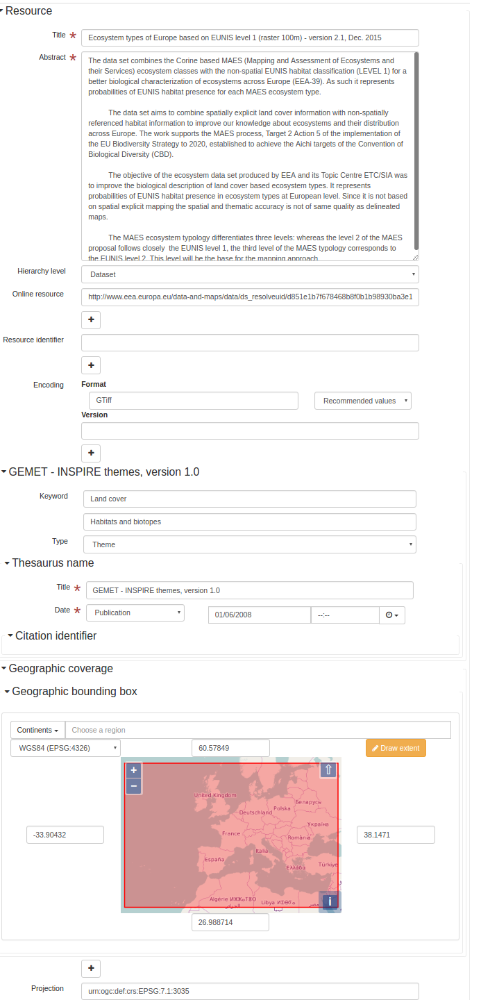
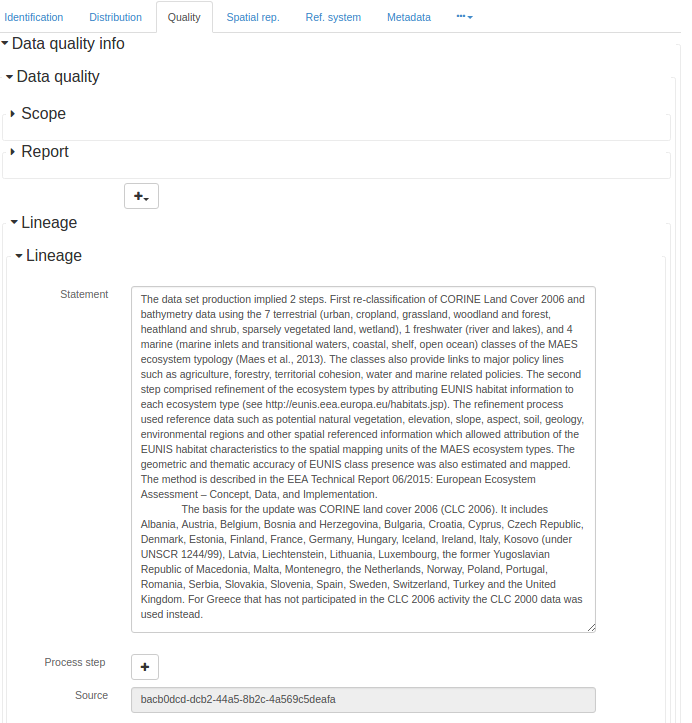

# Geographic information -- Metadata (iso19139:2007) (iso19139) {#iso19139}

ISO 19115 defines the schema required for describing geographic information and services by means of metadata. It provides information about the identification, the extent, the quality, the spatial and temporal aspects, the content, the spatial reference, the portrayal, distribution, and other properties of digital geographic data and services.

ISO 19115 is applicable to:

-   the cataloguing of all types of resources, clearinghouse activities, and the full description of datasets and services;
-   geographic services, geographic datasets, dataset series, and individual geographic features and feature properties.

ISO 19115 defines:

-   mandatory and conditional metadata sections, metadata entities, and metadata elements;
-   the minimum set of metadata required to serve most metadata applications (data discovery, determining data fitness for use, data access, data transfer, and use of digital data and services);
-   optional metadata elements to allow for a more extensive standard description of resources, if required;
-   a method for extending metadata to fit specialized needs.

Though ISO 19115 is applicable to digital data and services, its principles can be extended to many other types of resources such as maps, charts, and textual documents as well as non-geographic data. Certain conditional metadata elements might not apply to these other forms of data.

More details:<https://www.iso.org/iso/home/store/catalogue_tc/catalogue_detail.htm?csnumber=53798>

## Metadata editor

This standard can be encoded using 4 view(s).

-   [View: INSPIRE (inspire)](iso19139.md#iso19139-view-inspire)
-   [View: Simple (default)](iso19139.md#iso19139-view-default)
-   [View: Full (advanced)](iso19139.md#iso19139-view-advanced)
-   [View: XML (xml)](iso19139.md#iso19139-view-xml)

### View: INSPIRE (inspire) {#iso19139-view-inspire}

This view is composed of2tab(s).

-   [Tab: INSPIRE (inspire)](iso19139.md#iso19139-tab-inspire)
-   [Tab: SDS (inspire_sds)](iso19139.md#iso19139-tab-inspire_sds)

This view also allows to add the following element even if not in the current record:

-   Contains Operations (srv:containsOperations)
-   Operation (srv:SV_OperationMetadata)
-   Parameters (srv:parameters)

#### Tab: INSPIRE (inspire) {#iso19139-tab-inspire}



This tab display elements from the XML metadata record.

##### Section: Identification

##### File identifier

```{=html}
Unique identifier for this metadata file
```

XPath

:   

> /gmd:MD_Metadata/gmd:fileIdentifier

See [File identifier](iso19139.md#iso19139-elem-gmd-fileIdentifier-353be7794d17e5435ce2fe57d91966ba)

##### Title

```{=html}
Name by which the cited resource is known
```

XPath

:   

> /gmd:MD_Metadata/gmd:identificationInfo/*/gmd:citation/gmd:CI_Citation/gmd:title

See [Title](iso19139.md#iso19139-elem-gmd-title-cc3002a2d81bcdbc5bf4c8735faf6980)

##### Abstract

```{=html}
Brief narrative summary of the content of the resource(s)
```

XPath

:   

> /gmd:MD_Metadata/gmd:identificationInfo/gmd:MD_DataIdentification/gmd:abstract

See [Abstract](iso19139.md#iso19139-elem-gmd-abstract-cacfcd3bd6bbd44733f828dd2903ecd8)

##### Abstract

```{=html}
Brief narrative summary of the content of the resource(s)
```

XPath

:   

> /gmd:MD_Metadata/gmd:identificationInfo/srv:SV_ServiceIdentification/gmd:abstract

See [Abstract](iso19139.md#iso19139-elem-gmd-abstract-cacfcd3bd6bbd44733f828dd2903ecd8)

##### Hierarchy level

```{=html}
Scope to which the metadata applies (see annex H for more information about metadata hierarchy levels)
```

XPath

:   

> /gmd:MD_Metadata/gmd:hierarchyLevel

See [Hierarchy level](iso19139.md#iso19139-elem-gmd-hierarchyLevel-2b6d53b433d8f9c0cc58606d27eecc17)

Name

:   

> Hierarchy level

Name

:   

> Hierarchy level

Type

:   

> add

Displayed only if

:   

> count(gmd:MD_Metadata/gmd:identificationInfo/srv:SV_ServiceIdentification) = 0

``` xml
<gmd:hierarchyLevel xmlns:xsi="http://www.w3.org/2001/XMLSchema-instance"
                    xmlns:xlink="http://www.w3.org/1999/xlink">
   <gmd:MD_ScopeCode codeList="http://standards.iso.org/iso/19139/resources/gmxCodelists.xml#MD_ScopeCode"
                     codeListValue="dataset"/>
</gmd:hierarchyLevel>
```

Name

:   

> Hierarchy level

Name

:   

> Hierarchy level

Type

:   

> add

Displayed only if

:   

> count(gmd:MD_Metadata/gmd:identificationInfo/srv:SV_ServiceIdentification) > 0

``` xml
<gmd:hierarchyLevel xmlns:xsi="http://www.w3.org/2001/XMLSchema-instance"
                    xmlns:xlink="http://www.w3.org/1999/xlink">
   <gmd:MD_ScopeCode codeList="http://standards.iso.org/iso/19139/resources/gmxCodelists.xml#MD_ScopeCode"
                     codeListValue="service"/>
</gmd:hierarchyLevel>
```

##### Online resource

##### OnLine resource

```{=html}
Information about online sources from which the resource can be obtained
```

XPath

:   

> /gmd:MD_Metadata/gmd:distributionInfo/gmd:MD_Distribution/gmd:transferOptions /gmd:MD_DigitalTransferOptions/gmd:onLine

See [OnLine resource](iso19139.md#iso19139-elem-gmd-onLine-c0b191c96e7e4d7dfc2a4ba2fd8946f4)

Name

:   

> Online resource

Name

:   

> Online resource

Type

:   

> add

``` xml
<gmd:onLine xmlns:xsi="http://www.w3.org/2001/XMLSchema-instance"
            xmlns:xlink="http://www.w3.org/1999/xlink">
   <gmd:CI_OnlineResource>
      <gmd:linkage>
         <gmd:URL/>
      </gmd:linkage>
      <gmd:protocol>
         <gco:CharacterString/>
      </gmd:protocol>
   </gmd:CI_OnlineResource>
</gmd:onLine>
```

##### Resource identifier

##### Citation identifier

```{=html}
Identifier of the citation
```

XPath

:   

> /gmd:MD_Metadata/gmd:identificationInfo/gmd:MD_DataIdentification/gmd:citation/gmd:CI_Citation/gmd:identifier

See [Identifier](iso19139.md#iso19139-elem-gmd-identifier-c4f31fd808ee0eaa1e5525c5ff0edd23)

Name

:   

> Resource identifier

Name

:   

> Resource identifier

Type

:   

> add

``` xml
<gmd:identifier xmlns:xsi="http://www.w3.org/2001/XMLSchema-instance"
                xmlns:xlink="http://www.w3.org/1999/xlink">
   <gmd:MD_Identifier>
      <gmd:code>
         <gco:CharacterString/>
      </gmd:code>
   </gmd:MD_Identifier>
</gmd:identifier>
```

Type

:   

> process

Displayed only if

:   

> (count(gmd:MD_Metadata/gmd:identificationInfo/gmd:MD_DataIdentification) + count(gmd:MD_Metadata/gmd:identificationInfo/gmd:MD_DataIdentification/gmd:citation/gmd:CI_Citation/ gmd:identifier[ends-with(gmd:MD_Identifier/gmd:code/gco:CharacterString, //gmd:MD_Metadata/gmd:fileIdentifier/gco:CharacterString)])) = 1

##### Language

```{=html}
Language(s) used within the dataset
```
```{=html}
language(s) used within the dataset
```

XPath

:   

> /gmd:MD_Metadata/gmd:identificationInfo/gmd:MD_DataIdentification/gmd:language

See [Metadata language](iso19139.md#iso19139-elem-gmd-language-98a1fec5ea30c100ef63f1ca4bd6dbdb)

##### Spatial representation type

```{=html}
Method used to spatially represent geographic information
```

XPath

:   

> /gmd:MD_Metadata/gmd:identificationInfo/gmd:MD_DataIdentification/gmd:spatialRepresentationType

See [Spatial representation type](iso19139.md#iso19139-elem-gmd-spatialRepresentationType-1617a07231ac2246d0844778962d4ca0)

Name

:   

> Spatial representation type

Name

:   

> Spatial representation type

Type

:   

> add

``` xml
<gmd:spatialRepresentationType xmlns:xsi="http://www.w3.org/2001/XMLSchema-instance"
                               xmlns:xlink="http://www.w3.org/1999/xlink">
   <gmd:MD_SpatialRepresentationTypeCode codeList="http://standards.iso.org/iso/19139/resources/gmxCodelists.xml#MD_SpatialRepresentationTypeCode"
                                         codeListValue="vector"/>
</gmd:spatialRepresentationType>
```

##### Encoding

##### Distribution format

```{=html}
Provides a description of the format of the data to be distributed
```

XPath

:   

> /gmd:MD_Metadata/gmd:distributionInfo/gmd:MD_Distribution/gmd:distributionFormat

See [Distribution format](iso19139.md#iso19139-elem-gmd-distributionFormat-5cad81c9a7af3991db918a5e8fc0c596)

Name

:   

> Encoding

Name

:   

> Encoding

Type

:   

> add

Displayed only if

:   

> count(gmd:MD_Metadata/gmd:identificationInfo/srv:SV_ServiceIdentification) = 0

``` xml
<gmd:distributionFormat xmlns:xsi="http://www.w3.org/2001/XMLSchema-instance"
                        xmlns:xlink="http://www.w3.org/1999/xlink">
   <gmd:MD_Format>
      <gmd:name>
         <gco:CharacterString/>
      </gmd:name>
      <gmd:version>
         <gco:CharacterString/>
      </gmd:version>
      <gmd:specification>
         <gco:CharacterString/>
      </gmd:specification>
   </gmd:MD_Format>
</gmd:distributionFormat>
```

##### Projection

##### Reference system identifier

```{=html}
Name of reference system
```

XPath

:   

> /gmd:MD_Metadata/gmd:referenceSystemInfo/gmd:MD_ReferenceSystem/gmd:referenceSystemIdentifier

See [Reference system identifier](iso19139.md#iso19139-elem-gmd-referenceSystemIdentifier-5393a29789a4b6def1795d5a9e70f665)

Name

:   

> Projection

Name

:   

> Ref. system

Type

:   

> add

``` xml
<gmd:referenceSystemInfo xmlns:xsi="http://www.w3.org/2001/XMLSchema-instance"
                         xmlns:xlink="http://www.w3.org/1999/xlink">
   <gmd:MD_ReferenceSystem>
      <gmd:referenceSystemIdentifier>
         <gmd:RS_Identifier>
            <gmd:code>
               <gco:CharacterString>http://www.opengis.net/def/crs/EPSG/0/4936</gco:CharacterString>
            </gmd:code>
         </gmd:RS_Identifier>
      </gmd:referenceSystemIdentifier>
   </gmd:MD_ReferenceSystem>
</gmd:referenceSystemInfo>


<gmd:referenceSystemInfo xmlns:xsi="http://www.w3.org/2001/XMLSchema-instance"
                         xmlns:xlink="http://www.w3.org/1999/xlink">
   <gmd:MD_ReferenceSystem>
      <gmd:referenceSystemIdentifier>
         <gmd:RS_Identifier>
            <gmd:code>
               <gco:CharacterString>http://www.opengis.net/def/crs/EPSG/0/4937</gco:CharacterString>
            </gmd:code>
         </gmd:RS_Identifier>
      </gmd:referenceSystemIdentifier>
   </gmd:MD_ReferenceSystem>
</gmd:referenceSystemInfo>


<gmd:referenceSystemInfo xmlns:xsi="http://www.w3.org/2001/XMLSchema-instance"
                         xmlns:xlink="http://www.w3.org/1999/xlink">
   <gmd:MD_ReferenceSystem>
      <gmd:referenceSystemIdentifier>
         <gmd:RS_Identifier>
            <gmd:code>
               <gco:CharacterString>http://www.opengis.net/def/crs/EPSG/0/4258</gco:CharacterString>
            </gmd:code>
         </gmd:RS_Identifier>
      </gmd:referenceSystemIdentifier>
   </gmd:MD_ReferenceSystem>
</gmd:referenceSystemInfo>


<gmd:referenceSystemInfo xmlns:xsi="http://www.w3.org/2001/XMLSchema-instance"
                         xmlns:xlink="http://www.w3.org/1999/xlink">
   <gmd:MD_ReferenceSystem>
      <gmd:referenceSystemIdentifier>
         <gmd:RS_Identifier>
            <gmd:code>
               <gco:CharacterString>http://www.opengis.net/def/crs/EPSG/0/3035</gco:CharacterString>
            </gmd:code>
         </gmd:RS_Identifier>
      </gmd:referenceSystemIdentifier>
   </gmd:MD_ReferenceSystem>
</gmd:referenceSystemInfo>


<gmd:referenceSystemInfo xmlns:xsi="http://www.w3.org/2001/XMLSchema-instance"
                         xmlns:xlink="http://www.w3.org/1999/xlink">
   <gmd:MD_ReferenceSystem>
      <gmd:referenceSystemIdentifier>
         <gmd:RS_Identifier>
            <gmd:code>
               <gco:CharacterString>http://www.opengis.net/def/crs/EPSG/0/3034</gco:CharacterString>
            </gmd:code>
         </gmd:RS_Identifier>
      </gmd:referenceSystemIdentifier>
   </gmd:MD_ReferenceSystem>
</gmd:referenceSystemInfo>


<gmd:referenceSystemInfo xmlns:xsi="http://www.w3.org/2001/XMLSchema-instance"
                         xmlns:xlink="http://www.w3.org/1999/xlink">
   <gmd:MD_ReferenceSystem>
      <gmd:referenceSystemIdentifier>
         <gmd:RS_Identifier>
            <gmd:code>
               <gco:CharacterString>http://www.opengis.net/def/crs/EPSG/0/3038</gco:CharacterString>
            </gmd:code>
         </gmd:RS_Identifier>
      </gmd:referenceSystemIdentifier>
   </gmd:MD_ReferenceSystem>
</gmd:referenceSystemInfo>


<gmd:referenceSystemInfo xmlns:xsi="http://www.w3.org/2001/XMLSchema-instance"
                         xmlns:xlink="http://www.w3.org/1999/xlink">
   <gmd:MD_ReferenceSystem>
      <gmd:referenceSystemIdentifier>
         <gmd:RS_Identifier>
            <gmd:code>
               <gco:CharacterString>http://www.opengis.net/def/crs/EPSG/0/3039</gco:CharacterString>
            </gmd:code>
         </gmd:RS_Identifier>
      </gmd:referenceSystemIdentifier>
   </gmd:MD_ReferenceSystem>
</gmd:referenceSystemInfo>


<gmd:referenceSystemInfo xmlns:xsi="http://www.w3.org/2001/XMLSchema-instance"
                         xmlns:xlink="http://www.w3.org/1999/xlink">
   <gmd:MD_ReferenceSystem>
      <gmd:referenceSystemIdentifier>
         <gmd:RS_Identifier>
            <gmd:code>
               <gco:CharacterString>http://www.opengis.net/def/crs/EPSG/0/3040</gco:CharacterString>
            </gmd:code>
         </gmd:RS_Identifier>
      </gmd:referenceSystemIdentifier>
   </gmd:MD_ReferenceSystem>
</gmd:referenceSystemInfo>


<gmd:referenceSystemInfo xmlns:xsi="http://www.w3.org/2001/XMLSchema-instance"
                         xmlns:xlink="http://www.w3.org/1999/xlink">
   <gmd:MD_ReferenceSystem>
      <gmd:referenceSystemIdentifier>
         <gmd:RS_Identifier>
            <gmd:code>
               <gco:CharacterString>http://www.opengis.net/def/crs/EPSG/0/3041</gco:CharacterString>
            </gmd:code>
         </gmd:RS_Identifier>
      </gmd:referenceSystemIdentifier>
   </gmd:MD_ReferenceSystem>
</gmd:referenceSystemInfo>


<gmd:referenceSystemInfo xmlns:xsi="http://www.w3.org/2001/XMLSchema-instance"
                         xmlns:xlink="http://www.w3.org/1999/xlink">
   <gmd:MD_ReferenceSystem>
      <gmd:referenceSystemIdentifier>
         <gmd:RS_Identifier>
            <gmd:code>
               <gco:CharacterString>http://www.opengis.net/def/crs/EPSG/0/3042</gco:CharacterString>
            </gmd:code>
         </gmd:RS_Identifier>
      </gmd:referenceSystemIdentifier>
   </gmd:MD_ReferenceSystem>
</gmd:referenceSystemInfo>


<gmd:referenceSystemInfo xmlns:xsi="http://www.w3.org/2001/XMLSchema-instance"
                         xmlns:xlink="http://www.w3.org/1999/xlink">
   <gmd:MD_ReferenceSystem>
      <gmd:referenceSystemIdentifier>
         <gmd:RS_Identifier>
            <gmd:code>
               <gco:CharacterString>http://www.opengis.net/def/crs/EPSG/0/3043</gco:CharacterString>
            </gmd:code>
         </gmd:RS_Identifier>
      </gmd:referenceSystemIdentifier>
   </gmd:MD_ReferenceSystem>
</gmd:referenceSystemInfo>


<gmd:referenceSystemInfo xmlns:xsi="http://www.w3.org/2001/XMLSchema-instance"
                         xmlns:xlink="http://www.w3.org/1999/xlink">
   <gmd:MD_ReferenceSystem>
      <gmd:referenceSystemIdentifier>
         <gmd:RS_Identifier>
            <gmd:code>
               <gco:CharacterString>http://www.opengis.net/def/crs/EPSG/0/3044</gco:CharacterString>
            </gmd:code>
         </gmd:RS_Identifier>
      </gmd:referenceSystemIdentifier>
   </gmd:MD_ReferenceSystem>
</gmd:referenceSystemInfo>


<gmd:referenceSystemInfo xmlns:xsi="http://www.w3.org/2001/XMLSchema-instance"
                         xmlns:xlink="http://www.w3.org/1999/xlink">
   <gmd:MD_ReferenceSystem>
      <gmd:referenceSystemIdentifier>
         <gmd:RS_Identifier>
            <gmd:code>
               <gco:CharacterString>http://www.opengis.net/def/crs/EPSG/0/3045</gco:CharacterString>
            </gmd:code>
         </gmd:RS_Identifier>
      </gmd:referenceSystemIdentifier>
   </gmd:MD_ReferenceSystem>
</gmd:referenceSystemInfo>


<gmd:referenceSystemInfo xmlns:xsi="http://www.w3.org/2001/XMLSchema-instance"
                         xmlns:xlink="http://www.w3.org/1999/xlink">
   <gmd:MD_ReferenceSystem>
      <gmd:referenceSystemIdentifier>
         <gmd:RS_Identifier>
            <gmd:code>
               <gco:CharacterString>http://www.opengis.net/def/crs/EPSG/0/3046</gco:CharacterString>
            </gmd:code>
         </gmd:RS_Identifier>
      </gmd:referenceSystemIdentifier>
   </gmd:MD_ReferenceSystem>
</gmd:referenceSystemInfo>


<gmd:referenceSystemInfo xmlns:xsi="http://www.w3.org/2001/XMLSchema-instance"
                         xmlns:xlink="http://www.w3.org/1999/xlink">
   <gmd:MD_ReferenceSystem>
      <gmd:referenceSystemIdentifier>
         <gmd:RS_Identifier>
            <gmd:code>
               <gco:CharacterString>http://www.opengis.net/def/crs/EPSG/0/3047</gco:CharacterString>
            </gmd:code>
         </gmd:RS_Identifier>
      </gmd:referenceSystemIdentifier>
   </gmd:MD_ReferenceSystem>
</gmd:referenceSystemInfo>


<gmd:referenceSystemInfo xmlns:xsi="http://www.w3.org/2001/XMLSchema-instance"
                         xmlns:xlink="http://www.w3.org/1999/xlink">
   <gmd:MD_ReferenceSystem>
      <gmd:referenceSystemIdentifier>
         <gmd:RS_Identifier>
            <gmd:code>
               <gco:CharacterString>http://www.opengis.net/def/crs/EPSG/0/3048</gco:CharacterString>
            </gmd:code>
         </gmd:RS_Identifier>
      </gmd:referenceSystemIdentifier>
   </gmd:MD_ReferenceSystem>
</gmd:referenceSystemInfo>


<gmd:referenceSystemInfo xmlns:xsi="http://www.w3.org/2001/XMLSchema-instance"
                         xmlns:xlink="http://www.w3.org/1999/xlink">
   <gmd:MD_ReferenceSystem>
      <gmd:referenceSystemIdentifier>
         <gmd:RS_Identifier>
            <gmd:code>
               <gco:CharacterString>http://www.opengis.net/def/crs/EPSG/0/3049</gco:CharacterString>
            </gmd:code>
         </gmd:RS_Identifier>
      </gmd:referenceSystemIdentifier>
   </gmd:MD_ReferenceSystem>
</gmd:referenceSystemInfo>


<gmd:referenceSystemInfo xmlns:xsi="http://www.w3.org/2001/XMLSchema-instance"
                         xmlns:xlink="http://www.w3.org/1999/xlink">
   <gmd:MD_ReferenceSystem>
      <gmd:referenceSystemIdentifier>
         <gmd:RS_Identifier>
            <gmd:code>
               <gco:CharacterString>http://www.opengis.net/def/crs/EPSG/0/3050</gco:CharacterString>
            </gmd:code>
         </gmd:RS_Identifier>
      </gmd:referenceSystemIdentifier>
   </gmd:MD_ReferenceSystem>
</gmd:referenceSystemInfo>


<gmd:referenceSystemInfo xmlns:xsi="http://www.w3.org/2001/XMLSchema-instance"
                         xmlns:xlink="http://www.w3.org/1999/xlink">
   <gmd:MD_ReferenceSystem>
      <gmd:referenceSystemIdentifier>
         <gmd:RS_Identifier>
            <gmd:code>
               <gco:CharacterString>http://www.opengis.net/def/crs/EPSG/0/3051</gco:CharacterString>
            </gmd:code>
         </gmd:RS_Identifier>
      </gmd:referenceSystemIdentifier>
   </gmd:MD_ReferenceSystem>
</gmd:referenceSystemInfo>


<gmd:referenceSystemInfo xmlns:xsi="http://www.w3.org/2001/XMLSchema-instance"
                         xmlns:xlink="http://www.w3.org/1999/xlink">
   <gmd:MD_ReferenceSystem>
      <gmd:referenceSystemIdentifier>
         <gmd:RS_Identifier>
            <gmd:code>
               <gco:CharacterString>http://www.opengis.net/def/crs/EPSG/0/5730</gco:CharacterString>
            </gmd:code>
         </gmd:RS_Identifier>
      </gmd:referenceSystemIdentifier>
   </gmd:MD_ReferenceSystem>
</gmd:referenceSystemInfo>


<gmd:referenceSystemInfo xmlns:xsi="http://www.w3.org/2001/XMLSchema-instance"
                         xmlns:xlink="http://www.w3.org/1999/xlink">
   <gmd:MD_ReferenceSystem>
      <gmd:referenceSystemIdentifier>
         <gmd:RS_Identifier>
            <gmd:code>
               <gco:CharacterString>http://www.opengis.net/def/crs/EPSG/0/7409</gco:CharacterString>
            </gmd:code>
         </gmd:RS_Identifier>
      </gmd:referenceSystemIdentifier>
   </gmd:MD_ReferenceSystem>
</gmd:referenceSystemInfo>
```

##### Section: Classification of data and services

##### Topic category

```{=html}
Main theme(s) of the dataset
```

XPath

:   

> /gmd:MD_Metadata/gmd:identificationInfo/gmd:MD_DataIdentification/gmd:topicCategory

See [Topic category](iso19139.md#iso19139-elem-gmd-topicCategory-beb19f9aa38425d24bc8c438657fff74)

Name

:   

> Topic category code

Name

:   

> Topic category code

Type

:   

> add

``` xml
<gmd:topicCategory xmlns:xsi="http://www.w3.org/2001/XMLSchema-instance"
                   xmlns:xlink="http://www.w3.org/1999/xlink">
   <gmd:MD_TopicCategoryCode/>
</gmd:topicCategory>
```

##### Section: Classification of data and services

##### Service Type

```{=html}
Service type name from a registry of services. For example, the values of the nameSpace and name attributes of GeneralName may be 'OGC' and 'catalogue'
```
Recommended values

| code              | label                                           |
|-------------------|-------------------------------------------------|
| OGC:WMS           | OGC Web Map Service (OGC:WMS)                   |
| OGC:WFS           | OGC Web Feature Service (OGC:WFS)               |
| OGC:WCS           | OGC Web Coverage Service (OGC:WCS)              |
| W3C:HTML:DOWNLOAD | Download (W3C:HTML:DOWNLOAD)                    |
| W3C:HTML:LINK     | Information (W3C:HTML:LINK)                     |
| discovery         | INSPIRE Discovery Service (discovery)           |
| view              | INSPIRE View Service (view)                     |
| download          | INSPIRE Download Service (download)             |
| transformation    | INSPIRE Transformation Service (transformation) |
| other             | INSPIRE Other Services (other)                  |

XPath

:   

> /gmd:MD_Metadata/gmd:identificationInfo/srv:SV_ServiceIdentification/srv:serviceType

See [Service Type](iso19139.md#iso19139-elem-srv-serviceType-31230933e2a7436c80955195b74bc0a0)

##### Coupling Type

```{=html}
Type of Coupling
```

XPath

:   

> /gmd:MD_Metadata/gmd:identificationInfo/srv:SV_ServiceIdentification/srv:couplingType

See [Coupling Type](iso19139.md#iso19139-elem-srv-couplingType-bc1606dff717a83807e97a1a3789e30a)

##### Section: Coupled resource

##### Coupled resource

##### Operates On

```{=html}
Provides information on the datasets that the service operates on
```

XPath

:   

> /gmd:MD_Metadata/gmd:identificationInfo/srv:SV_ServiceIdentification/srv:operatesOn

See [Operates On](iso19139.md#iso19139-elem-srv-operatesOn-fc0165e60dcb452c05c9f1d95416b89a)

Name

:   

> Coupled resource

Type

:   

> add

Displayed only if

:   

> count(gmd:MD_Metadata/gmd:identificationInfo/srv:SV_ServiceIdentification) > 0

``` xml
<srv:operatesOn xmlns:xsi="http://www.w3.org/2001/XMLSchema-instance"
                xlink:href=""/>
```

##### Section: Coupled resource

##### Coupled resource

##### Operates On

```{=html}
Provides information on the datasets that the service operates on
```

XPath

:   

> /gmd:MD_Metadata/gmd:identificationInfo/srv:SV_ServiceIdentification/srv:operatesOn

See [Operates On](iso19139.md#iso19139-elem-srv-operatesOn-fc0165e60dcb452c05c9f1d95416b89a)

Name

:   

> Coupled resource

Type

:   

> add

Displayed only if

:   

> count(gmd:MD_Metadata/gmd:identificationInfo/srv:SV_ServiceIdentification) > 0

``` xml
<srv:operatesOn xmlns:xsi="http://www.w3.org/2001/XMLSchema-instance"
                xlink:href=""/>
```

##### Section: Classification of data and services

##### Service Type

```{=html}
Service type name from a registry of services. For example, the values of the nameSpace and name attributes of GeneralName may be 'OGC' and 'catalogue'
```
Recommended values

| code              | label                                           |
|-------------------|-------------------------------------------------|
| OGC:WMS           | OGC Web Map Service (OGC:WMS)                   |
| OGC:WFS           | OGC Web Feature Service (OGC:WFS)               |
| OGC:WCS           | OGC Web Coverage Service (OGC:WCS)              |
| W3C:HTML:DOWNLOAD | Download (W3C:HTML:DOWNLOAD)                    |
| W3C:HTML:LINK     | Information (W3C:HTML:LINK)                     |
| discovery         | INSPIRE Discovery Service (discovery)           |
| view              | INSPIRE View Service (view)                     |
| download          | INSPIRE Download Service (download)             |
| transformation    | INSPIRE Transformation Service (transformation) |
| other             | INSPIRE Other Services (other)                  |

XPath

:   

> /gmd:MD_Metadata/gmd:identificationInfo/srv:SV_ServiceIdentification/srv:serviceType

See [Service Type](iso19139.md#iso19139-elem-srv-serviceType-31230933e2a7436c80955195b74bc0a0)

##### Coupling Type

```{=html}
Type of Coupling
```

XPath

:   

> /gmd:MD_Metadata/gmd:identificationInfo/srv:SV_ServiceIdentification/srv:couplingType

See [Coupling Type](iso19139.md#iso19139-elem-srv-couplingType-bc1606dff717a83807e97a1a3789e30a)

##### Section: Coupled resource

##### Coupled resource

##### Operates On

```{=html}
Provides information on the datasets that the service operates on
```

XPath

:   

> /gmd:MD_Metadata/gmd:identificationInfo/srv:SV_ServiceIdentification/srv:operatesOn

See [Operates On](iso19139.md#iso19139-elem-srv-operatesOn-fc0165e60dcb452c05c9f1d95416b89a)

Name

:   

> Coupled resource

Type

:   

> add

Displayed only if

:   

> count(gmd:MD_Metadata/gmd:identificationInfo/srv:SV_ServiceIdentification) > 0

``` xml
<srv:operatesOn xmlns:xsi="http://www.w3.org/2001/XMLSchema-instance"
                xlink:href=""/>
```

##### Section: Coupled resource

##### Coupled resource

##### Operates On

```{=html}
Provides information on the datasets that the service operates on
```

XPath

:   

> /gmd:MD_Metadata/gmd:identificationInfo/srv:SV_ServiceIdentification/srv:operatesOn

See [Operates On](iso19139.md#iso19139-elem-srv-operatesOn-fc0165e60dcb452c05c9f1d95416b89a)

Name

:   

> Coupled resource

Type

:   

> add

Displayed only if

:   

> count(gmd:MD_Metadata/gmd:identificationInfo/srv:SV_ServiceIdentification) > 0

``` xml
<srv:operatesOn xmlns:xsi="http://www.w3.org/2001/XMLSchema-instance"
                xlink:href=""/>
```

##### Section: Keywords

XPath

:   

> /gmd:MD_Metadata/gmd:identificationInfo/srv:SV_ServiceIdentification/ gmd:descriptiveKeywords [gmd:MD_Keywords/gmd:thesaurusName/gmd:CI_Citation/gmd:title/gco:CharacterString = 'INSPIRE Service taxonomy']

See [Descriptive keywords](iso19139.md#iso19139-elem-gmd-descriptiveKeywords-d9044aa0856cf55d016da575dc037fa3)

Name

:   

> INSPIRE Service Taxonomy

Name

:   

> INSPIRE Service Taxonomy

Type

:   

> add

Displayed only if

:   

> (count(gmd:MD_Metadata/gmd:identificationInfo/srv:SV_ServiceIdentification/ gmd:descriptiveKeywords[ contains(gmd:MD_Keywords/gmd:thesaurusName/ gmd:CI_Citation/gmd:title/gco:CharacterString, 'INSPIRE Service taxonomy')]) + count(gmd:MD_Metadata/gmd:identificationInfo/srv:SV_ServiceIdentification)) = 1

``` xml
<gmd:descriptiveKeywords xmlns:xsi="http://www.w3.org/2001/XMLSchema-instance"
                         xmlns:xlink="http://www.w3.org/1999/xlink">
   <gmd:MD_Keywords>
      <gmd:keyword gco:nilReason="missing">
         <gco:CharacterString/>
      </gmd:keyword>
      <gmd:type>
         <gmd:MD_KeywordTypeCode codeList="http://www.isotc211.org/2005/resources/codeList.xml#MD_KeywordTypeCode"
                                 codeListValue="theme"/>
      </gmd:type>
      <gmd:thesaurusName>
         <gmd:CI_Citation>
            <gmd:title>
               <gco:CharacterString>INSPIRE Service taxonomy</gco:CharacterString>
            </gmd:title>
            <gmd:date>
               <gmd:CI_Date>
                  <gmd:date>
                     <gco:Date>2010-04-22</gco:Date>
                  </gmd:date>
                  <gmd:dateType>
                     <gmd:CI_DateTypeCode codeList="http://standards.iso.org/iso/19139/resources/gmxCodelists.xml#CI_DateTypeCode"
                                          codeListValue="publication"/>
                  </gmd:dateType>
               </gmd:CI_Date>
            </gmd:date>
            <gmd:identifier>
               <gmd:MD_Identifier>
                  <gmd:code>
                     <gmx:Anchor xlink:href="http://localhost:8080/geonetwork/srv/api/registries/vocabularies/external.theme.inspire-service-taxonomy">
                                geonetwork.thesaurus.external.theme.inspire-service-taxonomy</gmx:Anchor>
                  </gmd:code>
               </gmd:MD_Identifier>
            </gmd:identifier>
         </gmd:CI_Citation>
      </gmd:thesaurusName>
   </gmd:MD_Keywords>
</gmd:descriptiveKeywords>
```

XPath

:   

> /gmd:MD_Metadata/gmd:identificationInfo/*/ gmd:descriptiveKeywords [contains(gmd:MD_Keywords/gmd:thesaurusName/gmd:CI_Citation/gmd:title/*[name() = 'gco:CharacterString' or name() = 'gmx:Anchor']/text(), 'INSPIRE themes')]

See [Descriptive keywords](iso19139.md#iso19139-elem-gmd-descriptiveKeywords-d9044aa0856cf55d016da575dc037fa3)

Name

:   

> INSPIRE themes

Name

:   

> INSPIRE themes

Type

:   

> add

Displayed only if

:   

> count(gmd:MD_Metadata/gmd:identificationInfo/*/ gmd:descriptiveKeywords[ contains(gmd:MD_Keywords/gmd:thesaurusName/ gmd:CI_Citation/gmd:title/*[name() = 'gco:CharacterString' or name() = 'gmx:Anchor']/text(), 'INSPIRE themes')]) = 0

``` xml
<gmd:descriptiveKeywords xmlns:xsi="http://www.w3.org/2001/XMLSchema-instance"
                         xmlns:xlink="http://www.w3.org/1999/xlink">
   <gmd:MD_Keywords>
      <gmd:keyword>
         <gmx:Anchor xlink:href=""/>
      </gmd:keyword>
      <gmd:type>
         <gmd:MD_KeywordTypeCode codeList="http://standards.iso.org/iso/19139/resources/gmxCodelists.xml#MD_KeywordTypeCode"
                                 codeListValue="theme"/>
      </gmd:type>
      <gmd:thesaurusName>
         <gmd:CI_Citation>
            <gmd:title>
               <gmx:Anchor xlink:href="http://inspire.ec.europa.eu/theme">GEMET - INSPIRE themes, version 1.0</gmx:Anchor>
            </gmd:title>
            <gmd:date>
               <gmd:CI_Date>
                  <gmd:date>
                     <gco:Date>2008-06-01</gco:Date>
                  </gmd:date>
                  <gmd:dateType>
                     <gmd:CI_DateTypeCode codeList="http://standards.iso.org/iso/19139/resources/gmxCodelists.xml#CI_DateTypeCode"
                                          codeListValue="publication"/>
                  </gmd:dateType>
               </gmd:CI_Date>
            </gmd:date>
            <gmd:identifier>
               <gmd:MD_Identifier>
                  <gmd:code>
                     <gmx:Anchor xlink:href="http://localhost:8080/geonetwork/srv/api/registries/vocabularies/external.theme.httpinspireeceuropaeutheme-theme">
                                geonetwork.thesaurus.external.theme.httpinspireeceuropaeutheme-theme
                              </gmx:Anchor>
                  </gmd:code>
               </gmd:MD_Identifier>
            </gmd:identifier>
         </gmd:CI_Citation>
      </gmd:thesaurusName>
   </gmd:MD_Keywords>
</gmd:descriptiveKeywords>
```

XPath

:   

> /gmd:MD_Metadata/gmd:identificationInfo/*/ gmd:descriptiveKeywords [count(gmd:MD_Keywords/gmd:thesaurusName) > 0 and not(contains(gmd:MD_Keywords/gmd:thesaurusName/gmd:CI_Citation/gmd:title/*[name() = 'gco:CharacterString' or name() = 'gmx:Anchor']/text(), 'INSPIRE themes'))]

See [Descriptive keywords](iso19139.md#iso19139-elem-gmd-descriptiveKeywords-d9044aa0856cf55d016da575dc037fa3)

##### Section: Other keywords

XPath

:   

> /gmd:MD_Metadata/gmd:identificationInfo/srv:SV_ServiceIdentification/ gmd:descriptiveKeywords[not(gmd:MD_Keywords/gmd:thesaurusName)]

See [Descriptive keywords](iso19139.md#iso19139-elem-gmd-descriptiveKeywords-d9044aa0856cf55d016da575dc037fa3)

XPath

:   

> /gmd:MD_Metadata/gmd:identificationInfo/gmd:MD_DataIdentification/ gmd:descriptiveKeywords[not(gmd:MD_Keywords/gmd:thesaurusName)]

See [Descriptive keywords](iso19139.md#iso19139-elem-gmd-descriptiveKeywords-d9044aa0856cf55d016da575dc037fa3)

##### Section: Other keywords

XPath

:   

> /gmd:MD_Metadata/gmd:identificationInfo/srv:SV_ServiceIdentification/ gmd:descriptiveKeywords[not(gmd:MD_Keywords/gmd:thesaurusName)]

See [Descriptive keywords](iso19139.md#iso19139-elem-gmd-descriptiveKeywords-d9044aa0856cf55d016da575dc037fa3)

XPath

:   

> /gmd:MD_Metadata/gmd:identificationInfo/gmd:MD_DataIdentification/ gmd:descriptiveKeywords[not(gmd:MD_Keywords/gmd:thesaurusName)]

See [Descriptive keywords](iso19139.md#iso19139-elem-gmd-descriptiveKeywords-d9044aa0856cf55d016da575dc037fa3)

##### Section: Geographic coverage

##### Geographic bounding box

```{=html}
Geographic position of the dataset
```

XPath

:   

> /gmd:MD_Metadata/gmd:identificationInfo/srv:SV_ServiceIdentification/ srv:extent/gmd:EX_Extent/gmd:geographicElement/gmd:EX_GeographicBoundingBox

See [Geographic bounding box](iso19139.md#iso19139-elem-gmd-EX_GeographicBoundingBox-317fd5425b55f40c235ada8a89ee0519)

##### Geographic bounding box

```{=html}
Geographic position of the dataset
```

XPath

:   

> /gmd:MD_Metadata/gmd:identificationInfo/gmd:MD_DataIdentification/ gmd:extent/gmd:EX_Extent/gmd:geographicElement/gmd:EX_GeographicBoundingBox

See [Geographic bounding box](iso19139.md#iso19139-elem-gmd-EX_GeographicBoundingBox-317fd5425b55f40c235ada8a89ee0519)

Name

:   

> Geographic bounding box

Name

:   

> Geographic bounding box

Type

:   

> add

``` xml
<gmd:extent xmlns:xsi="http://www.w3.org/2001/XMLSchema-instance"
            xmlns:xlink="http://www.w3.org/1999/xlink">
   <gmd:EX_Extent>
      <gmd:geographicElement>
         <gmd:EX_GeographicBoundingBox>
            <gmd:westBoundLongitude>
               <gco:Decimal/>
            </gmd:westBoundLongitude>
            <gmd:eastBoundLongitude>
               <gco:Decimal/>
            </gmd:eastBoundLongitude>
            <gmd:southBoundLatitude>
               <gco:Decimal/>
            </gmd:southBoundLatitude>
            <gmd:northBoundLatitude>
               <gco:Decimal/>
            </gmd:northBoundLatitude>
         </gmd:EX_GeographicBoundingBox>
      </gmd:geographicElement>
   </gmd:EX_Extent>
</gmd:extent>
```

Name

:   

> Geographic bounding box

Name

:   

> Geographic bounding box

Type

:   

> add

``` xml
<srv:extent xmlns:xsi="http://www.w3.org/2001/XMLSchema-instance"
            xmlns:xlink="http://www.w3.org/1999/xlink">
   <gmd:EX_Extent>
      <gmd:geographicElement>
         <gmd:EX_GeographicBoundingBox>
            <gmd:westBoundLongitude>
               <gco:Decimal/>
            </gmd:westBoundLongitude>
            <gmd:eastBoundLongitude>
               <gco:Decimal/>
            </gmd:eastBoundLongitude>
            <gmd:southBoundLatitude>
               <gco:Decimal/>
            </gmd:southBoundLatitude>
            <gmd:northBoundLatitude>
               <gco:Decimal/>
            </gmd:northBoundLatitude>
         </gmd:EX_GeographicBoundingBox>
      </gmd:geographicElement>
   </gmd:EX_Extent>
</srv:extent>
```

##### Section: Temporal reference

##### Temporal extent

##### Temporal element

```{=html}
Provides temporal component of the extent of the referring object
```

XPath

:   

> /gmd:MD_Metadata/gmd:identificationInfo/gmd:MD_DataIdentification/gmd:extent/gmd:EX_Extent/gmd:temporalElement

See [Temporal element](iso19139.md#iso19139-elem-gmd-temporalElement-98c13f1732cd7f7c06320d907eec27ce)

Name

:   

> Geographic bounding box

Name

:   

> Temporal extent

Type

:   

> add

Displayed only if

:   

> count(gmd:MD_Metadata/gmd:identificationInfo/gmd:MD_DataIdentification/gmd:extent/gmd:EX_Extent/gmd:temporalElement) = 0

``` xml
<gmd:extent xmlns:xsi="http://www.w3.org/2001/XMLSchema-instance"
            xmlns:xlink="http://www.w3.org/1999/xlink">
   <gmd:EX_Extent>
      <gmd:temporalElement>
         <gmd:EX_TemporalExtent>
            <gmd:extent>
               <gml:TimePeriod gml:id="">
                  <gml:beginPosition/>
                  <gml:endPosition/>
               </gml:TimePeriod>
            </gmd:extent>
         </gmd:EX_TemporalExtent>
      </gmd:temporalElement>
   </gmd:EX_Extent>
</gmd:extent>
```

##### Temporal extent

##### Temporal element

```{=html}
Provides temporal component of the extent of the referring object
```

XPath

:   

> /gmd:MD_Metadata/gmd:identificationInfo/srv:SV_ServiceIdentification/srv:extent/gmd:EX_Extent/gmd:temporalElement

See [Temporal element](iso19139.md#iso19139-elem-gmd-temporalElement-98c13f1732cd7f7c06320d907eec27ce)

Name

:   

> Geographic bounding box

Name

:   

> Temporal extent

Type

:   

> add

Displayed only if

:   

> count(gmd:MD_Metadata/gmd:identificationInfo/srv:SV_ServiceIdentification/srv:extent/gmd:EX_Extent/gmd:temporalElement) = 0

``` xml
<srv:extent xmlns:xsi="http://www.w3.org/2001/XMLSchema-instance"
            xmlns:xlink="http://www.w3.org/1999/xlink">
   <gmd:EX_Extent>
      <gmd:temporalElement>
         <gmd:EX_TemporalExtent>
            <gmd:extent>
               <gml:TimePeriod gml:id="">
                  <gml:beginPosition/>
                  <gml:endPosition/>
               </gml:TimePeriod>
            </gmd:extent>
         </gmd:EX_TemporalExtent>
      </gmd:temporalElement>
   </gmd:EX_Extent>
</srv:extent>
```

XPath

:   

> /gmd:MD_Metadata/gmd:identificationInfo/*/gmd:citation/gmd:CI_Citation/ gmd:date

See [Date](iso19139.md#iso19139-elem-gmd-date-ebb509445b6cf496cbf813a8b01a2362)

Name

:   

> Temporal information

Name

:   

> Temporal information

Type

:   

> add

``` xml
<gmd:date xmlns:xsi="http://www.w3.org/2001/XMLSchema-instance"
          xmlns:xlink="http://www.w3.org/1999/xlink">
   <gmd:CI_Date>
      <gmd:date>
         <gco:Date/>
      </gmd:date>
      <gmd:dateType>
         <gmd:CI_DateTypeCode codeList="http://www.isotc211.org/2005/resources/codeList.xml#CI_DateTypeCode"
                              codeListValue="revision"/>
      </gmd:dateType>
   </gmd:CI_Date>
</gmd:date>
```

##### Section: Quality and validity

##### Lineage

##### Statement

```{=html}
General explanation of the data producer_s knowledge about the lineage of a dataset
```

XPath

:   

> /gmd:MD_Metadata/gmd:dataQualityInfo/gmd:DQ_DataQuality/gmd:lineage/gmd:LI_Lineage/gmd:statement

See [Statement](iso19139.md#iso19139-elem-gmd-statement-593ac58687a7831e3112879ec00a306e)

Name

:   

> Lineage

Name

:   

> Lineage

Type

:   

> add

``` xml
<gmd:statement xmlns:xsi="http://www.w3.org/2001/XMLSchema-instance"
               xmlns:xlink="http://www.w3.org/1999/xlink">
   <gco:CharacterString/>
</gmd:statement>
```

Name

:   

> Lineage

Name

:   

> Lineage

Type

:   

> add

``` xml
<gmd:lineage xmlns:xsi="http://www.w3.org/2001/XMLSchema-instance"
             xmlns:xlink="http://www.w3.org/1999/xlink">
   <gmd:LI_Lineage>
      <gmd:statement>
         <gco:CharacterString/>
      </gmd:statement>
   </gmd:LI_Lineage>
</gmd:lineage>
```

##### Denominator

```{=html}
The number below the line in a vulgar fraction
```
Recommended values

| code    | label       |
|---------|-------------|
| 5000    | 1:5´000     |
| 10000   | 1:10´000    |
| 25000   | 1:25´000    |
| 50000   | 1:50´000    |
| 100000  | 1:100´000   |
| 200000  | 1:200´000   |
| 300000  | 1:300´000   |
| 500000  | 1:500´000   |
| 1000000 | 1:1´000´000 |

XPath

:   

> /gmd:MD_Metadata/gmd:identificationInfo/ */gmd:spatialResolution/ */gmd:equivalentScale/*/gmd:denominator

See [Denominator](iso19139.md#iso19139-elem-gmd-denominator-e807028ba183b3decd6aa631d0ca1ca3)

Name

:   

> Spatial resolution (scale)

Type

:   

> add

``` xml
<gmd:spatialResolution xmlns:xsi="http://www.w3.org/2001/XMLSchema-instance"
                       xmlns:xlink="http://www.w3.org/1999/xlink">
   <gmd:MD_Resolution>
      <gmd:equivalentScale>
         <gmd:MD_RepresentativeFraction>
            <gmd:denominator>
               <gco:Integer/>
            </gmd:denominator>
         </gmd:MD_RepresentativeFraction>
      </gmd:equivalentScale>
   </gmd:MD_Resolution>
</gmd:spatialResolution>
```

##### Distance

```{=html}
Ground sample distance
```
Recommended values

| code | label |
|------|-------|
| 0.10 | 10 cm |
| 0.25 | 25 cm |
| 0.50 | 50 cm |
| 1    | 1 m   |
| 30   | 30 m  |
| 100  | 100 m |

XPath

:   

> /gmd:MD_Metadata/gmd:identificationInfo/ */gmd:spatialResolution/*/gmd:distance

See [Distance](iso19139.md#iso19139-elem-gmd-distance-7b7fc9e19c5ebb9644dc51880d95a12d)

Name

:   

> Spatial resolution (distance)

Type

:   

> add

``` xml
<gmd:spatialResolution xmlns:xsi="http://www.w3.org/2001/XMLSchema-instance"
                       xmlns:xlink="http://www.w3.org/1999/xlink">
   <gmd:MD_Resolution>
      <gmd:distance>
         <gco:Distance uom="m"/>
      </gmd:distance>
   </gmd:MD_Resolution>
</gmd:spatialResolution>
```

##### Section: Conformity

##### Conformity

##### Result

```{=html}
Value (or set of values) obtained from applying a data quality measure or the out come of evaluating the obtained value (or set of values) against a specified acceptable conformance quality level
```

XPath

:   

> /gmd:MD_Metadata/gmd:dataQualityInfo/gmd:DQ_DataQuality/ gmd:report/gmd:DQ_DomainConsistency/gmd:result[count(gmd:DQ_ConformanceResult/gmd:specification/ gmd:CI_Citation/gmd:title/gmx:Anchor) > 0]

See [Result](iso19139.md#iso19139-elem-gmd-result-83539788e54d2fc7d166ac779dc43f0b)

##### Conformity

##### Result

```{=html}
Value (or set of values) obtained from applying a data quality measure or the out come of evaluating the obtained value (or set of values) against a specified acceptable conformance quality level
```

XPath

:   

> /gmd:MD_Metadata/gmd:dataQualityInfo/gmd:DQ_DataQuality/ gmd:report/gmd:DQ_DomainConsistency/gmd:result[count(gmd:DQ_ConformanceResult/gmd:specification/ gmd:CI_Citation/gmd:title/gco:CharacterString) > 0]

See [Result](iso19139.md#iso19139-elem-gmd-result-83539788e54d2fc7d166ac779dc43f0b)

Name

:   

> Conformity

Name

:   

> Conformity

Type

:   

> add

``` xml
<gmd:report xmlns:xsi="http://www.w3.org/2001/XMLSchema-instance"
            xmlns:xlink="http://www.w3.org/1999/xlink">
   <gmd:DQ_DomainConsistency>
      <gmd:result>
         <gmd:DQ_ConformanceResult>
            <gmd:specification>
               <gmd:CI_Citation>
                  <gmd:title>
                     <gco:CharacterString/>
                  </gmd:title>
                  <gmd:date>
                     <gmd:CI_Date>
                        <gmd:date>
                           <gco:Date/>
                        </gmd:date>
                        <gmd:dateType>
                           <gmd:CI_DateTypeCode codeList="http://standards.iso.org/iso/19139/resources/gmxCodelists.xml#CI_DateTypeCode"
                                                codeListValue="publication"/>
                        </gmd:dateType>
                     </gmd:CI_Date>
                  </gmd:date>
               </gmd:CI_Citation>
            </gmd:specification>
            <gmd:explanation>
               <gco:CharacterString/>
            </gmd:explanation>
            <gmd:pass>
               <gco:Boolean>true</gco:Boolean>
            </gmd:pass>
         </gmd:DQ_ConformanceResult>
      </gmd:result>
   </gmd:DQ_DomainConsistency>
</gmd:report>
```

##### Section: Conformity

##### Conformity

##### Result

```{=html}
Value (or set of values) obtained from applying a data quality measure or the out come of evaluating the obtained value (or set of values) against a specified acceptable conformance quality level
```

XPath

:   

> /gmd:MD_Metadata/gmd:dataQualityInfo/gmd:DQ_DataQuality/ gmd:report/gmd:DQ_DomainConsistency/gmd:result[count(gmd:DQ_ConformanceResult/gmd:specification/ gmd:CI_Citation/gmd:title/gmx:Anchor) > 0]

See [Result](iso19139.md#iso19139-elem-gmd-result-83539788e54d2fc7d166ac779dc43f0b)

##### Conformity

##### Result

```{=html}
Value (or set of values) obtained from applying a data quality measure or the out come of evaluating the obtained value (or set of values) against a specified acceptable conformance quality level
```

XPath

:   

> /gmd:MD_Metadata/gmd:dataQualityInfo/gmd:DQ_DataQuality/ gmd:report/gmd:DQ_DomainConsistency/gmd:result[count(gmd:DQ_ConformanceResult/gmd:specification/ gmd:CI_Citation/gmd:title/gco:CharacterString) > 0]

See [Result](iso19139.md#iso19139-elem-gmd-result-83539788e54d2fc7d166ac779dc43f0b)

Name

:   

> Conformity

Name

:   

> Conformity

Type

:   

> add

``` xml
<gmd:report xmlns:xsi="http://www.w3.org/2001/XMLSchema-instance"
            xmlns:xlink="http://www.w3.org/1999/xlink">
   <gmd:DQ_DomainConsistency>
      <gmd:result>
         <gmd:DQ_ConformanceResult>
            <gmd:specification>
               <gmd:CI_Citation>
                  <gmd:title>
                     <gco:CharacterString/>
                  </gmd:title>
                  <gmd:date>
                     <gmd:CI_Date>
                        <gmd:date>
                           <gco:Date/>
                        </gmd:date>
                        <gmd:dateType>
                           <gmd:CI_DateTypeCode codeList="http://standards.iso.org/iso/19139/resources/gmxCodelists.xml#CI_DateTypeCode"
                                                codeListValue="publication"/>
                        </gmd:dateType>
                     </gmd:CI_Date>
                  </gmd:date>
               </gmd:CI_Citation>
            </gmd:specification>
            <gmd:explanation>
               <gco:CharacterString/>
            </gmd:explanation>
            <gmd:pass>
               <gco:Boolean>true</gco:Boolean>
            </gmd:pass>
         </gmd:DQ_ConformanceResult>
      </gmd:result>
   </gmd:DQ_DomainConsistency>
</gmd:report>
```

##### Section: Restrictions on access and use

##### Use limitation

```{=html}
Limitation affecting the fitness for use of the resource. Example, _not to be used for navigation_
```

XPath

:   

> /gmd:MD_Metadata/gmd:identificationInfo/gmd:MD_DataIdentification/ gmd:resourceConstraints/gmd:MD_Constraints/gmd:useLimitation

See [Use limitation](iso19139.md#iso19139-elem-gmd-useLimitation-07252e81be8d86aea4553aa3df807d8b)

Name

:   

> Use limitation

Name

:   

> Use limitation

Type

:   

> add

Displayed only if

:   

> count(gmd:MD_Metadata/gmd:identificationInfo/gmd:MD_DataIdentification) > 0

``` xml
<gmd:resourceConstraints xmlns:xsi="http://www.w3.org/2001/XMLSchema-instance"
                         xmlns:xlink="http://www.w3.org/1999/xlink">
   <gmd:MD_Constraints>
      <gmd:useLimitation>
         <gco:CharacterString/>
      </gmd:useLimitation>
   </gmd:MD_Constraints>
</gmd:resourceConstraints>
```

##### Access constraints

##### Other constraints

```{=html}
Other restrictions and legal prerequisites for accessing and using the resource
```

XPath

:   

> /gmd:MD_Metadata/gmd:identificationInfo/gmd:MD_DataIdentification/ gmd:resourceConstraints/gmd:MD_LegalConstraints/gmd:otherConstraints

See [Other constraints](iso19139.md#iso19139-elem-gmd-otherConstraints-696de5ef421a230cf560f7566a3c5028)

Name

:   

> Access constraints

Name

:   

> Access constraints

Type

:   

> add

Displayed only if

:   

> count(gmd:MD_Metadata/gmd:identificationInfo/gmd:MD_DataIdentification) > 0

``` xml
<gmd:resourceConstraints xmlns:xsi="http://www.w3.org/2001/XMLSchema-instance"
                         xmlns:xlink="http://www.w3.org/1999/xlink">
   <gmd:MD_LegalConstraints>
      <gmd:accessConstraints>
         <gmd:MD_RestrictionCode codeList="http://standards.iso.org/iso/19139/resources/gmxCodelists.xml#MD_RestrictionCode"
                                 codeListValue="otherRestrictions"/>
      </gmd:accessConstraints>
      <gmd:useConstraints/>
      <gmd:otherConstraints gco:nilReason="missing">
         <gco:CharacterString/>
      </gmd:otherConstraints>
   </gmd:MD_LegalConstraints>
</gmd:resourceConstraints>
```

##### Section: Restrictions on access and use

##### Use limitation

```{=html}
Limitation affecting the fitness for use of the resource. Example, _not to be used for navigation_
```

XPath

:   

> /gmd:MD_Metadata/gmd:identificationInfo/srv:SV_ServiceIdentification/ gmd:resourceConstraints/gmd:MD_Constraints/gmd:useLimitation

See [Use limitation](iso19139.md#iso19139-elem-gmd-useLimitation-07252e81be8d86aea4553aa3df807d8b)

Name

:   

> Use limitation

Name

:   

> Use limitation

Type

:   

> add

Displayed only if

:   

> count(gmd:MD_Metadata/gmd:identificationInfo/srv:SV_ServiceIdentification) > 0

``` xml
<gmd:resourceConstraints xmlns:xsi="http://www.w3.org/2001/XMLSchema-instance"
                         xmlns:xlink="http://www.w3.org/1999/xlink">
   <gmd:MD_Constraints>
      <gmd:useLimitation>
         <gco:CharacterString/>
      </gmd:useLimitation>
   </gmd:MD_Constraints>
</gmd:resourceConstraints>
```

##### Access constraints

##### Other constraints

```{=html}
Other restrictions and legal prerequisites for accessing and using the resource
```

XPath

:   

> /gmd:MD_Metadata/gmd:identificationInfo/srv:SV_ServiceIdentification/ gmd:resourceConstraints/gmd:MD_LegalConstraints/gmd:otherConstraints

See [Other constraints](iso19139.md#iso19139-elem-gmd-otherConstraints-696de5ef421a230cf560f7566a3c5028)

Name

:   

> Other constraints

Name

:   

> Access constraints

Type

:   

> add

Displayed only if

:   

> count(gmd:MD_Metadata/gmd:identificationInfo/srv:SV_ServiceIdentification) > 0

``` xml
<gmd:resourceConstraints xmlns:xsi="http://www.w3.org/2001/XMLSchema-instance"
                         xmlns:xlink="http://www.w3.org/1999/xlink">
   <gmd:MD_LegalConstraints>
      <gmd:accessConstraints>
         <gmd:MD_RestrictionCode codeList="http://standards.iso.org/iso/19139/resources/gmxCodelists.xml#MD_RestrictionCode"
                                 codeListValue="otherRestrictions"/>
      </gmd:accessConstraints>
      <gmd:useConstraints/>
      <gmd:otherConstraints gco:nilReason="missing">
         <gco:CharacterString/>
      </gmd:otherConstraints>
   </gmd:MD_LegalConstraints>
</gmd:resourceConstraints>
```

##### Section: Responsible organization (s)

##### Contact for the resource

##### Point of contact

```{=html}
Identification of, and means of communication with, person(s) and organizations(s) associated with the resource(s)
```

XPath

:   

> /gmd:MD_Metadata/gmd:identificationInfo/*/gmd:pointOfContact

See [Point of contact](iso19139.md#iso19139-elem-gmd-pointOfContact-2a38035f4c8b63a35a4e6c44e6f4b624)

Name

:   

> Contact for the resource

Type

:   

> add

``` xml
<gmd:pointOfContact xmlns:xsi="http://www.w3.org/2001/XMLSchema-instance"
                    xmlns:xlink="http://www.w3.org/1999/xlink">
   <gmd:CI_ResponsibleParty>
      <gmd:organisationName gco:nilReason="missing">
         <gco:CharacterString/>
      </gmd:organisationName>
      <gmd:contactInfo>
         <gmd:CI_Contact>
            <gmd:address>
               <gmd:CI_Address>
                  <gmd:electronicMailAddress gco:nilReason="missing">
                     <gco:CharacterString/>
                  </gmd:electronicMailAddress>
               </gmd:CI_Address>
            </gmd:address>
         </gmd:CI_Contact>
      </gmd:contactInfo>
      <gmd:role>
         <gmd:CI_RoleCode codeList="http://standards.iso.org/iso/19139/resources/gmxCodelists.xml#CI_RoleCode"
                          codeListValue="resourceProvider"/>
      </gmd:role>
   </gmd:CI_ResponsibleParty>
</gmd:pointOfContact>
```

##### Section: Responsible organization (s)

##### Contact for the resource

##### Point of contact

```{=html}
Identification of, and means of communication with, person(s) and organizations(s) associated with the resource(s)
```

XPath

:   

> /gmd:MD_Metadata/gmd:identificationInfo/*/gmd:pointOfContact

See [Point of contact](iso19139.md#iso19139-elem-gmd-pointOfContact-2a38035f4c8b63a35a4e6c44e6f4b624)

Name

:   

> Contact for the resource

Type

:   

> add

``` xml
<gmd:pointOfContact xmlns:xsi="http://www.w3.org/2001/XMLSchema-instance"
                    xmlns:xlink="http://www.w3.org/1999/xlink">
   <gmd:CI_ResponsibleParty>
      <gmd:organisationName gco:nilReason="missing">
         <gco:CharacterString/>
      </gmd:organisationName>
      <gmd:contactInfo>
         <gmd:CI_Contact>
            <gmd:address>
               <gmd:CI_Address>
                  <gmd:electronicMailAddress gco:nilReason="missing">
                     <gco:CharacterString/>
                  </gmd:electronicMailAddress>
               </gmd:CI_Address>
            </gmd:address>
         </gmd:CI_Contact>
      </gmd:contactInfo>
      <gmd:role>
         <gmd:CI_RoleCode codeList="http://standards.iso.org/iso/19139/resources/gmxCodelists.xml#CI_RoleCode"
                          codeListValue="resourceProvider"/>
      </gmd:role>
   </gmd:CI_ResponsibleParty>
</gmd:pointOfContact>
```

##### Section: Metadata information

##### Contact for the metadata

##### Contact

```{=html}
Party responsible for the metadata information
```

XPath

:   

> /gmd:MD_Metadata/gmd:contact

See [Metadata author](iso19139.md#iso19139-elem-gmd-contact-1a17bee429a4ae3c87f4026bd2da8005)

Name

:   

> Contact for the metadata

Type

:   

> add

``` xml
<gmd:contact xmlns:xsi="http://www.w3.org/2001/XMLSchema-instance"
             xmlns:xlink="http://www.w3.org/1999/xlink">
   <gmd:CI_ResponsibleParty>
      <gmd:organisationName gco:nilReason="missing">
         <gco:CharacterString/>
      </gmd:organisationName>
      <gmd:contactInfo>
         <gmd:CI_Contact>
            <gmd:address>
               <gmd:CI_Address>
                  <gmd:electronicMailAddress gco:nilReason="missing">
                     <gco:CharacterString/>
                  </gmd:electronicMailAddress>
               </gmd:CI_Address>
            </gmd:address>
         </gmd:CI_Contact>
      </gmd:contactInfo>
      <gmd:role>
         <gmd:CI_RoleCode codeList="http://standards.iso.org/iso/19139/resources/gmxCodelists.xml#CI_RoleCode"
                          codeListValue="pointOfContact"/>
      </gmd:role>
   </gmd:CI_ResponsibleParty>
</gmd:contact>
```

##### Date stamp

```{=html}
Date that the metadata was created (YYYY-MM-DDThh:mm:ss)
```

XPath

:   

> /gmd:MD_Metadata/gmd:dateStamp

See [Date stamp](iso19139.md#iso19139-elem-gmd-dateStamp-ee89eb65741d89aef14d153887f60948)

##### Metadata language

```{=html}
Language used for documenting metadata
```

XPath

:   

> /gmd:MD_Metadata/gmd:language

See [Metadata language](iso19139.md#iso19139-elem-gmd-language-98a1fec5ea30c100ef63f1ca4bd6dbdb)

Name

:   

> Metadata language

Name

:   

Type

:   

> add

``` xml
<gmd:language xmlns:xsi="http://www.w3.org/2001/XMLSchema-instance"
              xmlns:xlink="http://www.w3.org/1999/xlink">
   <gmd:LanguageCode codeList="http://www.loc.gov/standards/iso639-2/" codeListValue="eng"/>
</gmd:language>
```

##### Character set

```{=html}
Full name of the character coding standard used for the dataset
```

XPath

:   

> /gmd:MD_Metadata/gmd:identificationInfo/gmd:MD_DataIdentification/gmd:characterSet

See [Character set](iso19139.md#iso19139-elem-gmd-characterSet-351330c9787387f916fed1143727215b)

#### Tab: SDS (inspire_sds) {#iso19139-tab-inspire_sds}

This tab display elements from the XML metadata record.

##### Section: Conformance class 1: invocable

Type

:   

> process

Displayed only if

:   

> count(gmd:MD_Metadata/gmd:dataQualityInfo/gmd:DQ_DataQuality[gmd:scope/gmd:DQ_Scope/gmd:level/gmd:<MD_ScopeCode/@codeListValue>='service'])=0

Type

:   

> process

Displayed only if

:   

> count(gmd:MD_Metadata/gmd:dataQualityInfo/gmd:DQ_DataQuality[gmd:scope/gmd:DQ_Scope/gmd:level/gmd:<MD_ScopeCode/@codeListValue>='service']/gmd:report/gmd:DQ_DomainConsistency/gmd:result/gmd:DQ_ConformanceResult/gmd:specification/gmd:CI_Citation/gmd:title/gco:CharacterString)>0

##### Category

##### Data quality

```{=html}
Quality information for the data specified by a data quality scope
```

XPath

:   

> /gmd:MD_Metadata/gmd:dataQualityInfo/gmd:DQ_DataQuality[gmd:scope/gmd:DQ_Scope/gmd:level/gmd:<MD_ScopeCode/@codeListValue>='service']/gmd:report/gmd:DQ_DomainConsistency/gmd:result/gmd:DQ_ConformanceResult/gmd:specification/gmd:CI_Citation/gmd:title

See [Data quality](iso19139.md#iso19139-elem-gmd-DQ_DataQuality-16d17a37284f157b42d492a5960b5171)

##### Data quality

```{=html}
Quality information for the data specified by a data quality scope
```

XPath

:   

> /gmd:MD_Metadata/gmd:dataQualityInfo/gmd:DQ_DataQuality[gmd:scope/gmd:DQ_Scope/gmd:level/gmd:<MD_ScopeCode/@codeListValue>='service']/gmd:report/gmd:DQ_DomainConsistency/gmd:result/gmd:DQ_ConformanceResult/gmd:pass

See [Data quality](iso19139.md#iso19139-elem-gmd-DQ_DataQuality-16d17a37284f157b42d492a5960b5171)

Name

:   

> Add pass element

Type

:   

> add

``` xml
<gmd:pass xmlns:xsi="http://www.w3.org/2001/XMLSchema-instance"
          xmlns:xlink="http://www.w3.org/1999/xlink">
   <gco:Boolean>true</gco:Boolean>
</gmd:pass>
```

##### Access Point URL

##### OnLine resource

```{=html}
Information about online sources from which the resource can be obtained
```

XPath

:   

> /gmd:MD_Metadata/gmd:distributionInfo/gmd:MD_Distribution//gmd:transferOptions/gmd:MD_DigitalTransferOptions/gmd:onLine[gmd:CI_OnlineResource/gmd:description/gmx:Anchor/text() = 'accessPoint']

See [OnLine resource](iso19139.md#iso19139-elem-gmd-onLine-c0b191c96e7e4d7dfc2a4ba2fd8946f4)

Name

:   

> Add Access Point

Type

:   

> add

``` xml
<gmd:onLine xmlns:xsi="http://www.w3.org/2001/XMLSchema-instance"
            xmlns:xlink="http://www.w3.org/1999/xlink">
   <gmd:CI_OnlineResource>
      <gmd:linkage>
         <gmd:URL>http://accesspoint.url</gmd:URL>
      </gmd:linkage>
      <gmd:description>
         <gmx:Anchor xlink:href="http://inspire.ec.europa.eu/registry/metadata-codelist/ResourceLocatorDescription/accessPoint">
                        accessPoint
                      </gmx:Anchor>
      </gmd:description>
      <gmd:function>
         <gmd:CI_OnLineFunctionCode codeList="http://www.isotc211.org/2005/resources/Codelist/gmxCodelists.xml#CI_OnLineFunctionCode"
                                    codeListValue="information"/>
      </gmd:function>
   </gmd:CI_OnlineResource>
</gmd:onLine>
```

##### Endpoint URL

##### OnLine resource

```{=html}
Information about online sources from which the resource can be obtained
```

XPath

:   

> /gmd:MD_Metadata/gmd:distributionInfo/gmd:MD_Distribution//gmd:transferOptions/gmd:MD_DigitalTransferOptions/gmd:onLine[gmd:CI_OnlineResource/gmd:description/gmx:Anchor/text() = 'endPoint']

See [OnLine resource](iso19139.md#iso19139-elem-gmd-onLine-c0b191c96e7e4d7dfc2a4ba2fd8946f4)

Name

:   

> Add Endpoint

Type

:   

> add

``` xml
<gmd:onLine xmlns:xsi="http://www.w3.org/2001/XMLSchema-instance"
            xmlns:xlink="http://www.w3.org/1999/xlink">
   <gmd:CI_OnlineResource>
      <gmd:linkage>
         <gmd:URL>http://endpoint.url</gmd:URL>
      </gmd:linkage>
      <gmd:description>
         <gmx:Anchor xlink:href="http://inspire.ec.europa.eu/registry/metadata-codelist/ResourceLocatorDescription/endPoint">
                        endPoint
                      </gmx:Anchor>
      </gmd:description>
      <gmd:function>
         <gmd:CI_OnLineFunctionCode codeList="http://www.isotc211.org/2005/resources/Codelist/gmxCodelists.xml#CI_OnLineFunctionCode"
                                    codeListValue="information"/>
      </gmd:function>
   </gmd:CI_OnlineResource>
</gmd:onLine>
```

##### Technical specification

##### Data quality

```{=html}
Quality information for the data specified by a data quality scope
```

XPath

:   

> /gmd:MD_Metadata/gmd:dataQualityInfo/gmd:DQ_DataQuality[gmd:scope/gmd:DQ_Scope/gmd:level/gmd:<MD_ScopeCode/@codeListValue>='service']/gmd:report/gmd:DQ_DomainConsistency/gmd:result

See [Data quality](iso19139.md#iso19139-elem-gmd-DQ_DataQuality-16d17a37284f157b42d492a5960b5171)

Name

:   

> Add a technical specification

Type

:   

> add

``` xml
<gmd:report xmlns:xsi="http://www.w3.org/2001/XMLSchema-instance"
            xmlns:xlink="http://www.w3.org/1999/xlink">
   <gmd:DQ_FormatConsistency>
      <gmd:result>
         <gmd:DQ_ConformanceResult>
            <gmd:specification>
               <gmd:CI_Citation>
                  <gmd:title>
                     <gmx:Anchor xlink:href=" http://link,to/the.technical.specification">
                                Description of technical specification
                              </gmx:Anchor>
                  </gmd:title>
                  <gmd:date>
                     <gmd:CI_Date>
                        <gmd:date>
                           <gco:Date>2014-12-11</gco:Date>
                        </gmd:date>
                        <gmd:dateType>
                           <gmd:CI_DateTypeCode codeList="http://www.isotc211.org/2005/resources/Codelist/gmxCodelists.xml#CI_DateTypeCode"
                                                codeListValue="publication"/>
                        </gmd:dateType>
                     </gmd:CI_Date>
                  </gmd:date>
               </gmd:CI_Citation>
            </gmd:specification>
            <gmd:explanation>
               <gco:CharacterString>Conformant to the cited specifications.
                          </gco:CharacterString>
            </gmd:explanation>
            <gmd:pass>
               <gco:Boolean>true</gco:Boolean>
            </gmd:pass>
         </gmd:DQ_ConformanceResult>
      </gmd:result>
   </gmd:DQ_FormatConsistency>
</gmd:report>
```

##### Section: Conformance class 2: interoperable

##### Section: Coordinate reference system

##### Anchor

```{=html}
Supports hyper-linking capabilities and ensures a web-like implementation of CharacterStrings
```

XPath

:   

> gmd:MD_Metadata/gmd:referenceSystemInfo/gmd:MD_ReferenceSystem/gmd:referenceSystemIdentifier/gmd:RS_Identifier/gmd:code/gmx:Anchor

See [Anchor](iso19139.md#iso19139-elem-gmx-Anchor-d0ccf7ef89bd129a31fe766fae38f1df)

Name

:   

> Projection

Type

:   

> add

``` xml
<gmd:referenceSystemInfo xmlns:xsi="http://www.w3.org/2001/XMLSchema-instance"
                         xmlns:xlink="http://www.w3.org/1999/xlink">
   <gmd:MD_ReferenceSystem>
      <gmd:referenceSystemIdentifier>
         <gmd:RS_Identifier>
            <gmd:code>
               <gmx:Anchor xlink:href="http://www.opengis.net/def/crs/EPSG/0/{{code}}"
                           xlink:title="{{description}}">{{code}}
                            </gmx:Anchor>
            </gmd:code>
         </gmd:RS_Identifier>
      </gmd:referenceSystemIdentifier>
   </gmd:MD_ReferenceSystem>
</gmd:referenceSystemInfo>
```

##### Section: Quality of Service

Type

:   

> process

Displayed only if

:   

> (count(gmd:MD_Metadata/gmd:dataQualityInfo/gmd:DQ_DataQuality[gmd:scope/gmd:DQ_Scope/gmd:level/gmd:<MD_ScopeCode/@codeListValue>='service'])>0 and (count(gmd:MD_Metadata/gmd:dataQualityInfo/gmd:DQ_DataQuality[gmd:scope/gmd:DQ_Scope/gmd:level/gmd:<MD_ScopeCode/@codeListValue>='service']/gmd:report/gmd:DQ_ConceptualConsistency/gmd:nameOfMeasure/gmx:Anchor[text()='availability'])=0 or count(gmd:MD_Metadata/gmd:dataQualityInfo/gmd:DQ_DataQuality[gmd:scope/gmd:DQ_Scope/gmd:level/gmd:<MD_ScopeCode/@codeListValue>='service']/gmd:report/gmd:DQ_ConceptualConsistency/gmd:nameOfMeasure/gmx:Anchor[text()='performance'])=0 or count(gmd:MD_Metadata/gmd:dataQualityInfo/gmd:DQ_DataQuality[gmd:scope/gmd:DQ_Scope/gmd:level/gmd:<MD_ScopeCode/@codeListValue>='service']/gmd:report/gmd:DQ_ConceptualConsistency/gmd:nameOfMeasure/gmx:Anchor[text()='capacity'])=0 ))

##### Conceptual consistency

```{=html}
Adherence to rules of the conceptual schema
```

XPath

:   

> /gmd:MD_Metadata/gmd:dataQualityInfo/gmd:DQ_DataQuality/gmd:report/gmd:DQ_ConceptualConsistency

See [Conceptual consistency](iso19139.md#iso19139-elem-gmd-DQ_ConceptualConsistency-d42ad4a3a30578c7431606e8c1df4df8)

##### Section: Access constraints

##### Resource constraints

```{=html}
Provides information about constraints which apply to the resource(s)
```

XPath

:   

> /gmd:MD_Metadata/gmd:identificationInfo/srv:SV_ServiceIdentification/gmd:resourceConstraints[gmd:MD_LegalConstraints[gmd:accessConstraints]/gmd:otherConstraints/gmx:Anchor]

See [Resource constraints](iso19139.md#iso19139-elem-gmd-resourceConstraints-3ce815f506c31e6b5ef8e4e7022eefad)

##### Limitation

##### Resource constraints

```{=html}
Provides information about constraints which apply to the resource(s)
```

XPath

:   

> /gmd:MD_Metadata/gmd:identificationInfo/srv:SV_ServiceIdentification/gmd:resourceConstraints[gmd:MD_LegalConstraints[gmd:accessConstraints]/gmd:otherConstraints[gco:CharacterString]]

See [Resource constraints](iso19139.md#iso19139-elem-gmd-resourceConstraints-3ce815f506c31e6b5ef8e4e7022eefad)

Name

:   

> No Limitation

Type

:   

> add

Displayed only if

:   

> count(gmd:MD_Metadata/gmd:identificationInfo/srv:SV_ServiceIdentification/gmd:resourceConstraints/gmd:MD_LegalConstraints[gmd:accessConstraints]) = 0

``` xml
<gmd:resourceConstraints xmlns:xsi="http://www.w3.org/2001/XMLSchema-instance"
                         xmlns:xlink="http://www.w3.org/1999/xlink">
   <gmd:MD_LegalConstraints>
      <gmd:accessConstraints>
         <gmd:MD_RestrictionCode codeList="http://standards.iso.org/iso/19139/resources/gmxCodelists.xml#MD_RestrictionCode"
                                 codeListValue="otherRestrictions"/>
      </gmd:accessConstraints>
      <gmd:otherConstraints>
         <gmx:Anchor xlink:href="http://inspire.ec.europa.eu/registry/metadata-codelist/ConditionsApplyingToAccessAndUse/noConditionsApply">
                          No Conditions Apply
                        </gmx:Anchor>
      </gmd:otherConstraints>
   </gmd:MD_LegalConstraints>
</gmd:resourceConstraints>
```

Name

:   

> Unknown Limitation

Type

:   

> add

Displayed only if

:   

> count(gmd:MD_Metadata/gmd:identificationInfo/srv:SV_ServiceIdentification/gmd:resourceConstraints/gmd:MD_LegalConstraints[gmd:accessConstraints]) = 0

``` xml
<gmd:resourceConstraints xmlns:xsi="http://www.w3.org/2001/XMLSchema-instance"
                         xmlns:xlink="http://www.w3.org/1999/xlink">
   <gmd:MD_LegalConstraints>
      <gmd:accessConstraints>
         <gmd:MD_RestrictionCode codeList="http://standards.iso.org/iso/19139/resources/gmxCodelists.xml#MD_RestrictionCode"
                                 codeListValue="otherRestrictions"/>
      </gmd:accessConstraints>
      <gmd:otherConstraints>
         <gmx:Anchor xlink:href="http://inspire.ec.europa.eu/registry/metadata-codelist/ConditionsApplyingToAccessAndUse/conditionsUnknown">
                          Conditions Unknown
                        </gmx:Anchor>
      </gmd:otherConstraints>
   </gmd:MD_LegalConstraints>
</gmd:resourceConstraints>
```

Name

:   

> Customizable constraints

Type

:   

> add

Displayed only if

:   

> count(gmd:MD_Metadata/gmd:identificationInfo/srv:SV_ServiceIdentification/gmd:resourceConstraints/gmd:MD_LegalConstraints[gmd:accessConstraints]) = 0

``` xml
<gmd:resourceConstraints xmlns:xsi="http://www.w3.org/2001/XMLSchema-instance"
                         xmlns:xlink="http://www.w3.org/1999/xlink">
   <gmd:MD_LegalConstraints>
      <gmd:accessConstraints>
         <gmd:MD_RestrictionCode codeList="http://standards.iso.org/iso/19139/resources/gmxCodelists.xml#MD_RestrictionCode"
                                 codeListValue="otherRestrictions"/>
      </gmd:accessConstraints>
      <gmd:otherConstraints gco:nilReason="missing">
         <gco:CharacterString/>
      </gmd:otherConstraints>
   </gmd:MD_LegalConstraints>
</gmd:resourceConstraints>
```

##### Section: Use constraints

##### Resource constraints

```{=html}
Provides information about constraints which apply to the resource(s)
```

XPath

:   

> /gmd:MD_Metadata/gmd:identificationInfo/srv:SV_ServiceIdentification/gmd:resourceConstraints[gmd:MD_LegalConstraints[gmd:useConstraints]/gmd:otherConstraints/gmx:Anchor]

See [Resource constraints](iso19139.md#iso19139-elem-gmd-resourceConstraints-3ce815f506c31e6b5ef8e4e7022eefad)

##### Limitation

##### Resource constraints

```{=html}
Provides information about constraints which apply to the resource(s)
```

XPath

:   

> /gmd:MD_Metadata/gmd:identificationInfo/srv:SV_ServiceIdentification/gmd:resourceConstraints[gmd:MD_LegalConstraints[gmd:useConstraints]/gmd:otherConstraints[gco:CharacterString]]

See [Resource constraints](iso19139.md#iso19139-elem-gmd-resourceConstraints-3ce815f506c31e6b5ef8e4e7022eefad)

Name

:   

> No Limitation

Type

:   

> add

Displayed only if

:   

> count(gmd:MD_Metadata/gmd:identificationInfo/srv:SV_ServiceIdentification/gmd:resourceConstraints/gmd:MD_LegalConstraints[gmd:useConstraints]) = 0

``` xml
<gmd:resourceConstraints xmlns:xsi="http://www.w3.org/2001/XMLSchema-instance"
                         xmlns:xlink="http://www.w3.org/1999/xlink">
   <gmd:MD_LegalConstraints>
      <gmd:useConstraints>
         <gmd:MD_RestrictionCode codeList="http://standards.iso.org/iso/19139/resources/gmxCodelists.xml#MD_RestrictionCode"
                                 codeListValue="otherRestrictions"/>
      </gmd:useConstraints>
      <gmd:otherConstraints>
         <gmx:Anchor xlink:href="http://inspire.ec.europa.eu/registry/metadata-codelist/ConditionsApplyingToAccessAndUse/noConditionsApply">
                          No Conditions Apply
                        </gmx:Anchor>
      </gmd:otherConstraints>
   </gmd:MD_LegalConstraints>
</gmd:resourceConstraints>
```

Name

:   

> Unknown Limitation

Type

:   

> add

Displayed only if

:   

> count(gmd:MD_Metadata/gmd:identificationInfo/srv:SV_ServiceIdentification/gmd:resourceConstraints/gmd:MD_LegalConstraints[gmd:useConstraints]) = 0

``` xml
<gmd:resourceConstraints xmlns:xsi="http://www.w3.org/2001/XMLSchema-instance"
                         xmlns:xlink="http://www.w3.org/1999/xlink">
   <gmd:MD_LegalConstraints>
      <gmd:useConstraints>
         <gmd:MD_RestrictionCode codeList="http://standards.iso.org/iso/19139/resources/gmxCodelists.xml#MD_RestrictionCode"
                                 codeListValue="otherRestrictions"/>
      </gmd:useConstraints>
      <gmd:otherConstraints>
         <gmx:Anchor xlink:href="http://inspire.ec.europa.eu/registry/metadata-codelist/ConditionsApplyingToAccessAndUse/conditionsUnknown">
                          Conditions Unknown
                        </gmx:Anchor>
      </gmd:otherConstraints>
   </gmd:MD_LegalConstraints>
</gmd:resourceConstraints>
```

Name

:   

> Customizable constraints

Type

:   

> add

Displayed only if

:   

> count(gmd:MD_Metadata/gmd:identificationInfo/srv:SV_ServiceIdentification/gmd:resourceConstraints/gmd:MD_LegalConstraints[gmd:useConstraints]) = 0

``` xml
<gmd:resourceConstraints xmlns:xsi="http://www.w3.org/2001/XMLSchema-instance"
                         xmlns:xlink="http://www.w3.org/1999/xlink">
   <gmd:MD_LegalConstraints>
      <gmd:useConstraints>
         <gmd:MD_RestrictionCode codeList="http://standards.iso.org/iso/19139/resources/gmxCodelists.xml#MD_RestrictionCode"
                                 codeListValue="otherRestrictions"/>
      </gmd:useConstraints>
      <gmd:otherConstraints gco:nilReason="missing">
         <gco:CharacterString/>
      </gmd:otherConstraints>
   </gmd:MD_LegalConstraints>
</gmd:resourceConstraints>
```

##### Section: Responsible custodian

##### Contact for the resource

##### Point of contact

```{=html}
Identification of, and means of communication with, person(s) and organizations(s) associated with the resource(s)
```

XPath

:   

> /gmd:MD_Metadata/gmd:identificationInfo/srv:SV_ServiceIdentification/gmd:pointOfContact[gmd:CI_ResponsibleParty/gmd:role/gmd:<CI_RoleCode/@codeListValue>='custodian']

See [Point of contact](iso19139.md#iso19139-elem-gmd-pointOfContact-2a38035f4c8b63a35a4e6c44e6f4b624)

Name

:   

> Contact for the resource

Type

:   

> add

##### Section: Coordinate reference system

##### Anchor

```{=html}
Supports hyper-linking capabilities and ensures a web-like implementation of CharacterStrings
```

XPath

:   

> gmd:MD_Metadata/gmd:referenceSystemInfo/gmd:MD_ReferenceSystem/gmd:referenceSystemIdentifier/gmd:RS_Identifier/gmd:code/gmx:Anchor

See [Anchor](iso19139.md#iso19139-elem-gmx-Anchor-d0ccf7ef89bd129a31fe766fae38f1df)

Name

:   

> Projection

Type

:   

> add

``` xml
<gmd:referenceSystemInfo xmlns:xsi="http://www.w3.org/2001/XMLSchema-instance"
                         xmlns:xlink="http://www.w3.org/1999/xlink">
   <gmd:MD_ReferenceSystem>
      <gmd:referenceSystemIdentifier>
         <gmd:RS_Identifier>
            <gmd:code>
               <gmx:Anchor xlink:href="http://www.opengis.net/def/crs/EPSG/0/{{code}}"
                           xlink:title="{{description}}">{{code}}
                            </gmx:Anchor>
            </gmd:code>
         </gmd:RS_Identifier>
      </gmd:referenceSystemIdentifier>
   </gmd:MD_ReferenceSystem>
</gmd:referenceSystemInfo>
```

##### Section: Quality of Service

Type

:   

> process

Displayed only if

:   

> (count(gmd:MD_Metadata/gmd:dataQualityInfo/gmd:DQ_DataQuality[gmd:scope/gmd:DQ_Scope/gmd:level/gmd:<MD_ScopeCode/@codeListValue>='service'])>0 and (count(gmd:MD_Metadata/gmd:dataQualityInfo/gmd:DQ_DataQuality[gmd:scope/gmd:DQ_Scope/gmd:level/gmd:<MD_ScopeCode/@codeListValue>='service']/gmd:report/gmd:DQ_ConceptualConsistency/gmd:nameOfMeasure/gmx:Anchor[text()='availability'])=0 or count(gmd:MD_Metadata/gmd:dataQualityInfo/gmd:DQ_DataQuality[gmd:scope/gmd:DQ_Scope/gmd:level/gmd:<MD_ScopeCode/@codeListValue>='service']/gmd:report/gmd:DQ_ConceptualConsistency/gmd:nameOfMeasure/gmx:Anchor[text()='performance'])=0 or count(gmd:MD_Metadata/gmd:dataQualityInfo/gmd:DQ_DataQuality[gmd:scope/gmd:DQ_Scope/gmd:level/gmd:<MD_ScopeCode/@codeListValue>='service']/gmd:report/gmd:DQ_ConceptualConsistency/gmd:nameOfMeasure/gmx:Anchor[text()='capacity'])=0 ))

##### Conceptual consistency

```{=html}
Adherence to rules of the conceptual schema
```

XPath

:   

> /gmd:MD_Metadata/gmd:dataQualityInfo/gmd:DQ_DataQuality/gmd:report/gmd:DQ_ConceptualConsistency

See [Conceptual consistency](iso19139.md#iso19139-elem-gmd-DQ_ConceptualConsistency-d42ad4a3a30578c7431606e8c1df4df8)

##### Section: Access constraints

##### Resource constraints

```{=html}
Provides information about constraints which apply to the resource(s)
```

XPath

:   

> /gmd:MD_Metadata/gmd:identificationInfo/srv:SV_ServiceIdentification/gmd:resourceConstraints[gmd:MD_LegalConstraints[gmd:accessConstraints]/gmd:otherConstraints/gmx:Anchor]

See [Resource constraints](iso19139.md#iso19139-elem-gmd-resourceConstraints-3ce815f506c31e6b5ef8e4e7022eefad)

##### Limitation

##### Resource constraints

```{=html}
Provides information about constraints which apply to the resource(s)
```

XPath

:   

> /gmd:MD_Metadata/gmd:identificationInfo/srv:SV_ServiceIdentification/gmd:resourceConstraints[gmd:MD_LegalConstraints[gmd:accessConstraints]/gmd:otherConstraints[gco:CharacterString]]

See [Resource constraints](iso19139.md#iso19139-elem-gmd-resourceConstraints-3ce815f506c31e6b5ef8e4e7022eefad)

Name

:   

> No Limitation

Type

:   

> add

Displayed only if

:   

> count(gmd:MD_Metadata/gmd:identificationInfo/srv:SV_ServiceIdentification/gmd:resourceConstraints/gmd:MD_LegalConstraints[gmd:accessConstraints]) = 0

``` xml
<gmd:resourceConstraints xmlns:xsi="http://www.w3.org/2001/XMLSchema-instance"
                         xmlns:xlink="http://www.w3.org/1999/xlink">
   <gmd:MD_LegalConstraints>
      <gmd:accessConstraints>
         <gmd:MD_RestrictionCode codeList="http://standards.iso.org/iso/19139/resources/gmxCodelists.xml#MD_RestrictionCode"
                                 codeListValue="otherRestrictions"/>
      </gmd:accessConstraints>
      <gmd:otherConstraints>
         <gmx:Anchor xlink:href="http://inspire.ec.europa.eu/registry/metadata-codelist/ConditionsApplyingToAccessAndUse/noConditionsApply">
                          No Conditions Apply
                        </gmx:Anchor>
      </gmd:otherConstraints>
   </gmd:MD_LegalConstraints>
</gmd:resourceConstraints>
```

Name

:   

> Unknown Limitation

Type

:   

> add

Displayed only if

:   

> count(gmd:MD_Metadata/gmd:identificationInfo/srv:SV_ServiceIdentification/gmd:resourceConstraints/gmd:MD_LegalConstraints[gmd:accessConstraints]) = 0

``` xml
<gmd:resourceConstraints xmlns:xsi="http://www.w3.org/2001/XMLSchema-instance"
                         xmlns:xlink="http://www.w3.org/1999/xlink">
   <gmd:MD_LegalConstraints>
      <gmd:accessConstraints>
         <gmd:MD_RestrictionCode codeList="http://standards.iso.org/iso/19139/resources/gmxCodelists.xml#MD_RestrictionCode"
                                 codeListValue="otherRestrictions"/>
      </gmd:accessConstraints>
      <gmd:otherConstraints>
         <gmx:Anchor xlink:href="http://inspire.ec.europa.eu/registry/metadata-codelist/ConditionsApplyingToAccessAndUse/conditionsUnknown">
                          Conditions Unknown
                        </gmx:Anchor>
      </gmd:otherConstraints>
   </gmd:MD_LegalConstraints>
</gmd:resourceConstraints>
```

Name

:   

> Customizable constraints

Type

:   

> add

Displayed only if

:   

> count(gmd:MD_Metadata/gmd:identificationInfo/srv:SV_ServiceIdentification/gmd:resourceConstraints/gmd:MD_LegalConstraints[gmd:accessConstraints]) = 0

``` xml
<gmd:resourceConstraints xmlns:xsi="http://www.w3.org/2001/XMLSchema-instance"
                         xmlns:xlink="http://www.w3.org/1999/xlink">
   <gmd:MD_LegalConstraints>
      <gmd:accessConstraints>
         <gmd:MD_RestrictionCode codeList="http://standards.iso.org/iso/19139/resources/gmxCodelists.xml#MD_RestrictionCode"
                                 codeListValue="otherRestrictions"/>
      </gmd:accessConstraints>
      <gmd:otherConstraints gco:nilReason="missing">
         <gco:CharacterString/>
      </gmd:otherConstraints>
   </gmd:MD_LegalConstraints>
</gmd:resourceConstraints>
```

##### Section: Use constraints

##### Resource constraints

```{=html}
Provides information about constraints which apply to the resource(s)
```

XPath

:   

> /gmd:MD_Metadata/gmd:identificationInfo/srv:SV_ServiceIdentification/gmd:resourceConstraints[gmd:MD_LegalConstraints[gmd:useConstraints]/gmd:otherConstraints/gmx:Anchor]

See [Resource constraints](iso19139.md#iso19139-elem-gmd-resourceConstraints-3ce815f506c31e6b5ef8e4e7022eefad)

##### Limitation

##### Resource constraints

```{=html}
Provides information about constraints which apply to the resource(s)
```

XPath

:   

> /gmd:MD_Metadata/gmd:identificationInfo/srv:SV_ServiceIdentification/gmd:resourceConstraints[gmd:MD_LegalConstraints[gmd:useConstraints]/gmd:otherConstraints[gco:CharacterString]]

See [Resource constraints](iso19139.md#iso19139-elem-gmd-resourceConstraints-3ce815f506c31e6b5ef8e4e7022eefad)

Name

:   

> No Limitation

Type

:   

> add

Displayed only if

:   

> count(gmd:MD_Metadata/gmd:identificationInfo/srv:SV_ServiceIdentification/gmd:resourceConstraints/gmd:MD_LegalConstraints[gmd:useConstraints]) = 0

``` xml
<gmd:resourceConstraints xmlns:xsi="http://www.w3.org/2001/XMLSchema-instance"
                         xmlns:xlink="http://www.w3.org/1999/xlink">
   <gmd:MD_LegalConstraints>
      <gmd:useConstraints>
         <gmd:MD_RestrictionCode codeList="http://standards.iso.org/iso/19139/resources/gmxCodelists.xml#MD_RestrictionCode"
                                 codeListValue="otherRestrictions"/>
      </gmd:useConstraints>
      <gmd:otherConstraints>
         <gmx:Anchor xlink:href="http://inspire.ec.europa.eu/registry/metadata-codelist/ConditionsApplyingToAccessAndUse/noConditionsApply">
                          No Conditions Apply
                        </gmx:Anchor>
      </gmd:otherConstraints>
   </gmd:MD_LegalConstraints>
</gmd:resourceConstraints>
```

Name

:   

> Unknown Limitation

Type

:   

> add

Displayed only if

:   

> count(gmd:MD_Metadata/gmd:identificationInfo/srv:SV_ServiceIdentification/gmd:resourceConstraints/gmd:MD_LegalConstraints[gmd:useConstraints]) = 0

``` xml
<gmd:resourceConstraints xmlns:xsi="http://www.w3.org/2001/XMLSchema-instance"
                         xmlns:xlink="http://www.w3.org/1999/xlink">
   <gmd:MD_LegalConstraints>
      <gmd:useConstraints>
         <gmd:MD_RestrictionCode codeList="http://standards.iso.org/iso/19139/resources/gmxCodelists.xml#MD_RestrictionCode"
                                 codeListValue="otherRestrictions"/>
      </gmd:useConstraints>
      <gmd:otherConstraints>
         <gmx:Anchor xlink:href="http://inspire.ec.europa.eu/registry/metadata-codelist/ConditionsApplyingToAccessAndUse/conditionsUnknown">
                          Conditions Unknown
                        </gmx:Anchor>
      </gmd:otherConstraints>
   </gmd:MD_LegalConstraints>
</gmd:resourceConstraints>
```

Name

:   

> Customizable constraints

Type

:   

> add

Displayed only if

:   

> count(gmd:MD_Metadata/gmd:identificationInfo/srv:SV_ServiceIdentification/gmd:resourceConstraints/gmd:MD_LegalConstraints[gmd:useConstraints]) = 0

``` xml
<gmd:resourceConstraints xmlns:xsi="http://www.w3.org/2001/XMLSchema-instance"
                         xmlns:xlink="http://www.w3.org/1999/xlink">
   <gmd:MD_LegalConstraints>
      <gmd:useConstraints>
         <gmd:MD_RestrictionCode codeList="http://standards.iso.org/iso/19139/resources/gmxCodelists.xml#MD_RestrictionCode"
                                 codeListValue="otherRestrictions"/>
      </gmd:useConstraints>
      <gmd:otherConstraints gco:nilReason="missing">
         <gco:CharacterString/>
      </gmd:otherConstraints>
   </gmd:MD_LegalConstraints>
</gmd:resourceConstraints>
```

##### Section: Responsible custodian

##### Contact for the resource

##### Point of contact

```{=html}
Identification of, and means of communication with, person(s) and organizations(s) associated with the resource(s)
```

XPath

:   

> /gmd:MD_Metadata/gmd:identificationInfo/srv:SV_ServiceIdentification/gmd:pointOfContact[gmd:CI_ResponsibleParty/gmd:role/gmd:<CI_RoleCode/@codeListValue>='custodian']

See [Point of contact](iso19139.md#iso19139-elem-gmd-pointOfContact-2a38035f4c8b63a35a4e6c44e6f4b624)

Name

:   

> Contact for the resource

Type

:   

> add

##### Section: Conformance class 3: harmonized

##### Contains Operations

```{=html}
Provides information about the operations that comprise the service
```

XPath

:   

> /gmd:MD_Metadata/gmd:identificationInfo/srv:SV_ServiceIdentification/srv:containsOperations

See [Contains Operations](iso19139.md#iso19139-elem-srv-containsOperations-5765a967aadd33b5ba92cde03c9ce30e)

Name

:   

> Add Operation

Type

:   

> add

Displayed only if

:   

> count(gmd:MD_Metadata/gmd:identificationInfo/srv:SV_ServiceIdentification) > 0

``` xml
<srv:containsOperations xmlns:xsi="http://www.w3.org/2001/XMLSchema-instance"
                        xmlns:xlink="http://www.w3.org/1999/xlink">
   <srv:SV_OperationMetadata>
      <srv:operationName>
         <gco:CharacterString/>
      </srv:operationName>
      <srv:DCP>
         <srv:DCPList codeList="http://inspire.ec.europa.eu/metadata-codelist/DCPList"
                      codeListValue="webServices">Web services
                      </srv:DCPList>
      </srv:DCP>
      <srv:connectPoint>
         <gmd:CI_OnlineResource>
            <gmd:linkage>
               <gmd:URL>http://</gmd:URL>
            </gmd:linkage>
         </gmd:CI_OnlineResource>
      </srv:connectPoint>
   </srv:SV_OperationMetadata>
</srv:containsOperations>
```

### View: Simple (default) {#iso19139-view-default}

This view is composed of1tab(s).

-   [Tab: Simple (default)](iso19139.md#iso19139-tab-default)

This view also allows to add the following element even if not in the current record:

-   Descriptive keywords (gmd:descriptiveKeywords)
-   Keyword (gmd:keyword)
-   Name (gmd:name)
-   Spatial resolution (gmd:spatialResolution)
-   Point of contact (gmd:pointOfContact)
-   Distributor (gmd:distributor)
-   Distribution format (gmd:distributionFormat)
-   Contact (gmd:contact)
-   Processor (gmd:processor)
-   Topic category (gmd:topicCategory)
-   Parameters (srv:parameters)

#### Tab: Simple (default) {#iso19139-tab-default}


This tab display elements from the XML metadata record.

Instruction

:   

##### Linkage

```{=html}
Location (address) for on-line access using a Uniform Resource Locator address or similar addressing scheme such as http://www.statkart.no/isotc211
```

XPath

:   

> */gmd:linkage

See [Linkage](iso19139.md#iso19139-elem-gmd-linkage-ddec55285da8318007d8ba8df6febcb5)

##### Name

XPath

:   

> */gmd:name

See [Name](iso19139.md#iso19139-elem-gmd-name-9796db4d1cab411f64fa97871fd1dd7e)

Instruction

:   

##### Linkage

```{=html}
Location (address) for on-line access using a Uniform Resource Locator address or similar addressing scheme such as http://www.statkart.no/isotc211
```

XPath

:   

> */gmd:linkage

See [Linkage](iso19139.md#iso19139-elem-gmd-linkage-ddec55285da8318007d8ba8df6febcb5)

##### Name

XPath

:   

> */gmd:name

See [Name](iso19139.md#iso19139-elem-gmd-name-9796db4d1cab411f64fa97871fd1dd7e)

##### Section: Content Information

```{=html}
Provides information about the feature catalogue and describes the coverage and image data characteristics
```
See [Content Information](iso19139.md#iso19139-elem-gmd-contentInfo-da18cd6a5e91bae67187adc15ff47622)

##### Included with dataset

```{=html}
Indication of whether or not the feature catalogue is included with the dataset
```

XPath

:   

> gmd:MD_FeatureCatalogueDescription/gmd:includedWithDataset

See [Included with dataset](iso19139.md#iso19139-elem-gmd-includedWithDataset-0148507e25f25653e843ec66cf6cb878)

##### Feature catalogue citation

```{=html}
Complete bibliographic reference to one or more external feature catalogues
```
See [Feature catalogue citation](iso19139.md#iso19139-elem-gmd-featureCatalogueCitation-0d490aca236a02c867c265dc0656143b)

XPath

:   

> .

##### Feature catalogue citation

```{=html}
Complete bibliographic reference to one or more external feature catalogues
```
See [Feature catalogue citation](iso19139.md#iso19139-elem-gmd-featureCatalogueCitation-0d490aca236a02c867c265dc0656143b)

XPath

:   

> .

Name

:   

Type

:   

> add

``` xml
<gmd:contentInfo xmlns:xsi="http://www.w3.org/2001/XMLSchema-instance"
                 xmlns:xlink="http://www.w3.org/1999/xlink">
   <gmd:MD_FeatureCatalogueDescription>
      <gmd:includedWithDataset>
         <gco:Boolean>true</gco:Boolean>
      </gmd:includedWithDataset>
      <gmd:featureCatalogueCitation uuidref=""/>
   </gmd:MD_FeatureCatalogueDescription>
</gmd:contentInfo>
```

### View: Full (advanced) {#iso19139-view-advanced}

This view is composed of11tab(s).

-   [Tab: Identification (identificationInfo)](iso19139.md#iso19139-tab-identificationInfo)
-   [Tab: Distribution (distributionInfo)](iso19139.md#iso19139-tab-distributionInfo)
-   [Tab: Quality (dataQualityInfo)](iso19139.md#iso19139-tab-dataQualityInfo)
-   [Tab: Spatial rep. (spatialRepresentationInfo)](iso19139.md#iso19139-tab-spatialRepresentationInfo)
-   [Tab: Ref. system (referenceSystemInfo)](iso19139.md#iso19139-tab-referenceSystemInfo)
-   [Tab: Content (contentInfo)](iso19139.md#iso19139-tab-contentInfo)
-   [Tab: Portrayal (portrayalCatalogueInfo)](iso19139.md#iso19139-tab-portrayalCatalogueInfo)
-   [Tab: Metadata (metadata)](iso19139.md#iso19139-tab-metadata)
-   [Tab: Md. constraints (metadataConstraints)](iso19139.md#iso19139-tab-metadataConstraints)
-   [Tab: Md. maintenance (metadataMaintenance)](iso19139.md#iso19139-tab-metadataMaintenance)
-   [Tab: Schema info (applicationSchemaInfo)](iso19139.md#iso19139-tab-applicationSchemaInfo)

#### Tab: Identification (identificationInfo) {#iso19139-tab-identificationInfo}


This tab display elements from the XML metadata record and also provide controls to add all elements defined in the schema (XSD).

##### Section: Identification info

```{=html}
Basic information about the resource(s) to which the metadata applies
```
See [Identification info](iso19139.md#iso19139-elem-gmd-identificationInfo-4fe68a205ff13feeccf0b58e08f39472)

#### Tab: Distribution (distributionInfo) {#iso19139-tab-distributionInfo}

This tab display elements from the XML metadata record and also provide controls to add all elements defined in the schema (XSD).

##### Section: Distribution Information

```{=html}
Provides information about the distributor of and options for obtaining the resource(s)
```
See [Distribution Information](iso19139.md#iso19139-elem-gmd-distributionInfo-3bddab6fda29c9ebd6f0ece68843fcff)

#### Tab: Quality (dataQualityInfo) {#iso19139-tab-dataQualityInfo}



This tab display elements from the XML metadata record and also provide controls to add all elements defined in the schema (XSD).

##### Section: Data quality info

```{=html}
Provides overall assessment of quality of a resource(s)
```
See [Data quality info](iso19139.md#iso19139-elem-gmd-dataQualityInfo-9a53c25e2dacf5a7ab0aa1d155efc3dc)

#### Tab: Spatial rep. (spatialRepresentationInfo) {#iso19139-tab-spatialRepresentationInfo}

This tab display elements from the XML metadata record and also provide controls to add all elements defined in the schema (XSD).

##### Section: Spatial representation info

```{=html}
Digital representation of spatial information in the dataset
```
See [Spatial representation info](iso19139.md#iso19139-elem-gmd-spatialRepresentationInfo-f93705d4877ccd4c41819cc79677d6f2)

#### Tab: Ref. system (referenceSystemInfo) {#iso19139-tab-referenceSystemInfo}


This tab display elements from the XML metadata record and also provide controls to add all elements defined in the schema (XSD).

##### Section: Reference System Information

```{=html}
Description of the spatial and temporal reference systems used in the dataset
```
See [Reference System Information](iso19139.md#iso19139-elem-gmd-referenceSystemInfo-c7702a2e8ac03097e306ab3a02406765)

#### Tab: Content (contentInfo) {#iso19139-tab-contentInfo}

This tab display elements from the XML metadata record and also provide controls to add all elements defined in the schema (XSD).

##### Section: Content Information

```{=html}
Provides information about the feature catalogue and describes the coverage and image data characteristics
```
See [Content Information](iso19139.md#iso19139-elem-gmd-contentInfo-da18cd6a5e91bae67187adc15ff47622)

#### Tab: Portrayal (portrayalCatalogueInfo) {#iso19139-tab-portrayalCatalogueInfo}

This tab display elements from the XML metadata record and also provide controls to add all elements defined in the schema (XSD).

##### Section: Portrayal catalogue info

```{=html}
Provides information about the catalogue of rules defined for the portrayal of a resource(s)
```
See [Portrayal catalogue info](iso19139.md#iso19139-elem-gmd-portrayalCatalogueInfo-0a09defe8c7ca8431460b5690da9a52d)

#### Tab: Metadata (metadata) {#iso19139-tab-metadata}

This tab display elements from the XML metadata record and also provide controls to add all elements defined in the schema (XSD).

##### Section: Metadata

##### File identifier

```{=html}
Unique identifier for this metadata file
```

XPath

:   

> /gmd:MD_Metadata/gmd:fileIdentifier

See [File identifier](iso19139.md#iso19139-elem-gmd-fileIdentifier-353be7794d17e5435ce2fe57d91966ba)

##### Metadata language

```{=html}
Language used for documenting metadata
```

XPath

:   

> /gmd:MD_Metadata/gmd:language

See [Metadata language](iso19139.md#iso19139-elem-gmd-language-98a1fec5ea30c100ef63f1ca4bd6dbdb)

##### Other language

```{=html}
Use this section to define other metadata language (multilingual metadata).
```

XPath

:   

> /gmd:MD_Metadata/gmd:locale

See [Other language](iso19139.md#iso19139-elem-gmd-locale-826113f1d130f65f95c78f6b16227c4b)

##### Character set

```{=html}
Full name of the character coding standard used for the metadata set
```

XPath

:   

> /gmd:MD_Metadata/gmd:characterSet

See [Character set](iso19139.md#iso19139-elem-gmd-characterSet-351330c9787387f916fed1143727215b)

##### Parent identifier

```{=html}
File identifier of the metadata to which this metadata is a subset (child)
```

XPath

:   

> /gmd:MD_Metadata/gmd:parentIdentifier

See [Parent identifier](iso19139.md#iso19139-elem-gmd-parentIdentifier-e660d48fcd79782e330d99a6eee272bc)

##### Hierarchy level

```{=html}
Scope to which the metadata applies (see annex H for more information about metadata hierarchy levels)
```

XPath

:   

> /gmd:MD_Metadata/gmd:hierarchyLevel

See [Hierarchy level](iso19139.md#iso19139-elem-gmd-hierarchyLevel-2b6d53b433d8f9c0cc58606d27eecc17)

##### Hierarchy level name

```{=html}
Name of the hierarchy levels for which the metadata is provided
```

XPath

:   

> /gmd:MD_Metadata/gmd:hierarchyLevelName

See [Hierarchy level name](iso19139.md#iso19139-elem-gmd-hierarchyLevelName-1c79276b0501d07055d7480b292899f0)

##### Date stamp

```{=html}
Date that the metadata was created (YYYY-MM-DDThh:mm:ss)
```

XPath

:   

> /gmd:MD_Metadata/gmd:dateStamp

See [Date stamp](iso19139.md#iso19139-elem-gmd-dateStamp-ee89eb65741d89aef14d153887f60948)

##### Metadata standard name

```{=html}
Name of the metadata standard (including profile name) used
```

XPath

:   

> /gmd:MD_Metadata/gmd:metadataStandardName

See [Metadata standard name](iso19139.md#iso19139-elem-gmd-metadataStandardName-1e8d324f913f2da08b656d26e73e994d)

##### Metadata standard version

```{=html}
Version (profile) of the metadata standard used
```

XPath

:   

> /gmd:MD_Metadata/gmd:metadataStandardVersion

See [Metadata standard version](iso19139.md#iso19139-elem-gmd-metadataStandardVersion-ab0dd515a6ca9c890bc32d3615cd427f)

##### Contact

```{=html}
Party responsible for the metadata information
```

XPath

:   

> /gmd:MD_Metadata/gmd:contact

See [Metadata author](iso19139.md#iso19139-elem-gmd-contact-1a17bee429a4ae3c87f4026bd2da8005)

##### Dataset URI

```{=html}
Uniformed Resource Identifier (URI) of the dataset to which the metadata applies
```
```{=html}
Uniformed Resource Identifier (URI) of the dataset to which the metadata applies. This link refers direct to the machine-readable dataset.
```

XPath

:   

> /gmd:MD_Metadata/gmd:dataSetURI

See [Dataset URI](iso19139.md#iso19139-elem-gmd-dataSetURI-8e14b3e6d98f92a9356ba2f3ba1ee982)

##### Series

```{=html}
Information about the series, or aggregate dataset, of which the dataset is a part
```

XPath

:   

> /gmd:MD_Metadata/gmd:series

See [Series](iso19139.md#iso19139-elem-gmd-series-98524248b047e1a31966f4fc05c765fb)

##### Describes

```{=html}
Describes
```

XPath

:   

> /gmd:MD_Metadata/gmd:describes

See [Describes](iso19139.md#iso19139-elem-gmd-describes-ea7ef755fceda2ec8b1bf4486f5572bf)

##### PropertyType

```{=html}
PropertyType
```

XPath

:   

> /gmd:MD_Metadata/gmd:propertyType

See [PropertyType](iso19139.md#iso19139-elem-gmd-propertyType-12fff0b8b43529f0300c32a5e13c9f89)

##### Feature type

```{=html}
Subset of feature types from cited feature catalogue occurring in data
```

XPath

:   

> /gmd:MD_Metadata/gmd:featureType

See [Feature type](iso19139.md#iso19139-elem-gmd-featureType-1a7ddaf6d70b2bca513bbb097769f7a5)

##### Feature attribute

XPath

:   

> /gmd:MD_Metadata/gmd:featureAttribute

See [Feature attribute](iso19139.md#iso19139-elem-gmd-featureAttribute-ed65880b0d966b5862d0d434b26fd36b)

#### Tab: Md. constraints (metadataConstraints) {#iso19139-tab-metadataConstraints}

This tab display elements from the XML metadata record and also provide controls to add all elements defined in the schema (XSD).

##### Section: Metadata constraints

```{=html}
Provides restrictions on the access and use of metadata
```
See [Metadata constraints](iso19139.md#iso19139-elem-gmd-metadataConstraints-0547cb4265a8d2f9663d558a9ac72d43)

#### Tab: Md. maintenance (metadataMaintenance) {#iso19139-tab-metadataMaintenance}

This tab display elements from the XML metadata record and also provide controls to add all elements defined in the schema (XSD).

##### Section: Metadata maintenance

```{=html}
Provides information about the frequency of metadata updates, and the scope of those updates
```
See [Metadata maintenance](iso19139.md#iso19139-elem-gmd-metadataMaintenance-2af9bf1fc8f71819e7361e5d6987358c)

#### Tab: Schema info (applicationSchemaInfo) {#iso19139-tab-applicationSchemaInfo}

This tab display elements from the XML metadata record and also provide controls to add all elements defined in the schema (XSD).

##### Section: Application schema info

```{=html}
Provides information about the conceptual schema of a dataset
```
See [Application schema info](iso19139.md#iso19139-elem-gmd-applicationSchemaInfo-45e55618bc13cc73f4ede49af591b9cb)

### View: XML (xml) {#iso19139-view-xml}

This view is composed of1tab(s).

-   [Tab: XML (xml)](iso19139.md#iso19139-tab-xml)

#### Tab: XML (xml) {#iso19139-tab-xml}

This tab display elements from the XML metadata record and also provide controls to add all elements defined in the schema (XSD).

## Schema technical details

Standard identifier

:   

> iso19139

Version

:   

> 1.0

Schema location

:   

> <http://www.isotc211.org/2005/gmd> <http://schemas.opengis.net/csw/2.0.2/profiles/apiso/1.0.0/apiso.xsd>

Schema namespaces

:   

-   <http://geonetwork-opensource.org/schemas/schema-ident>
-   <http://www.isotc211.org/2005/gco>
-   <http://www.isotc211.org/2005/gmd>
-   <http://www.w3.org/2001/XMLSchema-instance>
-   <http://www.w3.org/XML/1998/namespace>

Schema detection mode

:   

> elements (root)

Schema detection elements

:   

-   gmd:CI_ResponsibleParty
-   gmd:DQ_DomainConsistency
-   gmd:EX_Extent
-   gmd:MD_Format
-   gmd:MD_Metadata

## Standard elements

List of all elements available in the standard.

### Name of the calendar era {#iso19139-elem-calendarEraName-f6992f57e0b42d0d298ceab6163baa24}

Name

:   

> calendarEraName

Description

:   

### Code {#iso19139-elem-code-gmd-MD_Identifier-b9e23155977b220811ee241a27dec71c}

Name

:   

> code

Context

:   

> gmd:MD_Identifier

Description

:   

```{=html}
Alphanumeric value identifying an instance in the namespace
```
```{=html}
alphanumeric value identifying an instance in the namespace
```
### System code {#iso19139-elem-code-34002ba7723581d2ef06d2611cab31af}

Name

:   

> code

Description

:   

```{=html}
Code. i.e. EPSG code.
```
### Code {#iso19139-elem-code-gmd-MD_CodeValue-1315454a3efd07503687cfc5628f2cf1}

Name

:   

> code

Context

:   

> gmd:MD_CodeValue

Description

:   

```{=html}
Value code
```
```{=html}
Value code (i.e. numeric)
```
### Reference Authority {#iso19139-elem-codeSpace-0e8f09aab4d7c2a27305e0cc2a489acc}

Name

:   

> codeSpace

Description

:   

```{=html}
Authority responsible for codification. i.e. EPSG
```
### Direct projection system (for geographical resources) {#iso19139-elem-DirectReferenceSystem-d28cd37e0c2b9a86305c20c194bf5f79}

Name

:   

> DirectReferenceSystem

Description

:   

```{=html}
ReferenceSystem derived / specify that it is a direct
      reference
```
### Factor {#iso19139-elem-factor-7e34666ca11658e04e31d3a614685b15}

Name

:   

> factor

Description

:   

### Frame {#iso19139-elem-frame-4aefbf304b03d93af57daba6b7c1fa8d}

Name

:   

> frame

Description

:   

```{=html}
Frame attribute provides a URI reference that identifies a description of the
      reference system
```
### Name {#iso19139-elem-gco-aName-39d38a0515ba733c328d5bd1c57e7e5e}

Name

:   

> gco:aName

Description

:   

### Type name {#iso19139-elem-gco-aName-gco-TypeName-b5751c296623f4c8529273aaf3caa587}

Name

:   

> gco:aName

Context

:   

> gco:TypeName

Description

:   

Recommended values

| code      | label     |
|-----------|-----------|
| BOOLEAN   | BOOLEAN   |
| BYTE      | BYTE      |
| CHARACTER | CHARACTER |
| DATE      | DATE      |
| DATETIME  | DATETIME  |
| DOUBLE    | DOUBLE    |
| FLOAT     | FLOAT     |
| INTEGER   | INTEGER   |
| NUMERIC   | NUMERIC   |
| REAL      | REAL      |
| SERIAL    | SERIAL    |
| VARCHAR   | VARCHAR   |
| TEXT      | TEXT      |

### Angle {#iso19139-elem-gco-Angle-3593960aae71b8b1bdfe5ebf0f35d2c9}

Name

:   

> gco:Angle

Description

:   

### Attribute type {#iso19139-elem-gco-attributeType-0b903ede9f187704365df4f997921127}

Name

:   

> gco:attributeType

Description

:   

### Binary {#iso19139-elem-gco-Binary-a22b5d55570c2130700e110981a19fc0}

Name

:   

> gco:Binary

Description

:   

### Text {#iso19139-elem-gco-CharacterString-3c4a83cea72b8088a49c2cdafdcaf1c1}

Name

:   

> gco:CharacterString

Description

:   

### Edition Date {#iso19139-elem-gco-Date-gmd-CI_Citation-ca5259e4b2838d1c0558671de588f0df}

Name

:   

> gco:Date

Context

:   

> gmd:CI_Citation

Description

:   

```{=html}
Date of the edition
```
### Date {#iso19139-elem-gco-Date-c5ab2c208539dd2f12e12861e602dc91}

Name

:   

> gco:Date

Description

:   

```{=html}
Formatted as 2007-09-12 (YYYY-MM-DD)
```
```{=html}
reference date and event used to describe it
```
### Usage Date / Time {#iso19139-elem-gco-DateTime-gmd-MD_Usage-5932999d2f9d3461e5820eade7175b5b}

Name

:   

> gco:DateTime

Context

:   

> gmd:MD_Usage

Description

:   

```{=html}
Formatted as 2007-09-12T15:00:00 (YYYY-MM-DDTHH:mm:ss)
```
```{=html}
date and time of the first use or range of uses of the resource and/or resource
      series
```
``` xml
<gco:DateTime xmlns:gmd="http://www.isotc211.org/2005/gmd" xmlns:gml="http://www.opengis.net/gml"
              xmlns:xlink="http://www.w3.org/1999/xlink">2016-01-15T16:57:35</gco:DateTime>
```

### Planned Available Date / Time {#iso19139-elem-gco-DateTime-gmd-MD_StandardOrderProcess-c7c418ca6afb419b0c0f7978f0f70bd5}

Name

:   

> gco:DateTime

Context

:   

> gmd:MD_StandardOrderProcess

Description

:   

```{=html}
Formatted as 2007-09-12T15:00:00 (YYYY-MM-DDTHH:mm:ss)
```
```{=html}
date and time when theresource will be available
```
``` xml
<gco:DateTime xmlns:gmd="http://www.isotc211.org/2005/gmd" xmlns:gml="http://www.opengis.net/gml"
              xmlns:xlink="http://www.w3.org/1999/xlink">2016-01-15T16:57:35</gco:DateTime>
```

### Date and time {#iso19139-elem-gco-DateTime-32c0a3056194945a06e26342a31c4abe}

Name

:   

> gco:DateTime

Description

:   

```{=html}
Date and time or range of date and time on or over which the process step occurred
      (YYYY-MM-DDThh:mm:ss)
```
``` xml
<gco:DateTime xmlns:gmd="http://www.isotc211.org/2005/gmd" xmlns:gml="http://www.opengis.net/gml"
              xmlns:xlink="http://www.w3.org/1999/xlink">2016-01-15T16:57:35</gco:DateTime>
```

### Distance {#iso19139-elem-gco-Distance-97e7c5e41f65464cfde4bdcbd0987611}

Name

:   

> gco:Distance

Description

:   

``` xml
<gco:Distance xmlns:gmd="http://www.isotc211.org/2005/gmd" xmlns:gml="http://www.opengis.net/gml"
              uom="m">100</gco:Distance>
```

### Length {#iso19139-elem-gco-Length-caf3c113efd04589ae6f255714b3cfb5}

Name

:   

> gco:Length

Description

:   

### Name {#iso19139-elem-gco-localName-d5d8fd10758516aba7e3e61dca6a3d06}

Name

:   

> gco:localName

Description

:   

### Local name {#iso19139-elem-gco-LocalName-eab12ae644d752a8b1eff54b0477039a}

Name

:   

> gco:LocalName

Description

:   

### Lower cardinality {#iso19139-elem-gco-lower-2cae58bb16663bb430a5756705195313}

Name

:   

> gco:lower

Description

:   

```{=html}
Lower cardinality
```
### Name of Measure {#iso19139-elem-gco-Measure-gmd-DQ_Element-6560606f315eea7246848f93ddc3d967}

Name

:   

> gco:Measure

Context

:   

> gmd:DQ_Element

Description

:   

```{=html}
Name of the test applied to the data
```
### Unit of Measure {#iso19139-elem-gco-Measure-gmd-EX_VerticalExtent-89983ecdbd1cba38f291e34bee6c223f}

Name

:   

> gco:Measure

Context

:   

> gmd:EX_VerticalExtent

Description

:   

```{=html}
Vertical units used for vertical extent information Examples: metres, feet,
      millimetres, hectopascals
```
### Measure {#iso19139-elem-gco-Measure-462aeec614da812d758659486be00b47}

Name

:   

> gco:Measure

Description

:   

### Member name {#iso19139-elem-gco-MemberName-b60b50f5b87b148b6615393b823e6a3b}

Name

:   

> gco:MemberName

Description

:   

### Nil reason {#iso19139-elem-gco-nilReason-fab8a57f0e69d3ca1699fa818c483698}

Name

:   

> gco:nilReason

Description

:   

### Standard codelists Nil reason (gco:nilReason)

| code         | label        |
|--------------|--------------|
| missing      | Missing      |
| inapplicable | Inapplicable |
| template     | Template     |
| unknown      | Unknown      |
| withheld     | Withheld     |

### Record {#iso19139-elem-gco-Record-6d9e28990789e830931b4d2ba9766597}

Name

:   

> gco:Record

Description

:   

### Scale {#iso19139-elem-gco-Scale-be644ab22ff8340a59eb1ea346d70bae}

Name

:   

> gco:Scale

Description

:   

### Scoped name {#iso19139-elem-gco-ScopedName-fa518f7fd322d0dc580364a3bdd0d0ba}

Name

:   

> gco:ScopedName

Description

:   

### Type name {#iso19139-elem-gco-TypeName-ca6ce43198031eafc2870fd56a3cca80}

Name

:   

> gco:TypeName

Description

:   

### Upper cardinality {#iso19139-elem-gco-upper-bb37e0d692d0d0dd4557b3b31c16d35c}

Name

:   

> gco:upper

Description

:   

```{=html}
Upper cardinality
```
### Abstract {#iso19139-elem-gmd-abstract-cacfcd3bd6bbd44733f828dd2903ecd8}

Name

:   

> gmd:abstract

Description

:   

```{=html}
Brief narrative summary of the content of the resource(s)
```

Condition

:   

> mandatory

``` xml
<gmd:abstract xmlns:gmd="http://www.isotc211.org/2005/gmd" xmlns:gml="http://www.opengis.net/gml"
              xmlns:xlink="http://www.w3.org/1999/xlink">
   <gco:CharacterString>The data set combines the Corine based MAES (Mapping and Assessment of
          Ecosystems and their Services) ecosystem classes with the non-spatial EUNIS habitat
          classification (LEVEL 1) for a better biological characterization of ecosystems across
          Europe (EEA-39). As such it represents probabilities of EUNIS habitat presence for each
          MAES ecosystem type.

          The data set aims to combine spatially explicit land cover information with non-spatially
          referenced habitat information to improve our knowledge about ecosystems and their
          distribution across Europe. The work supports the MAES process, Target 2 Action 5 of the
          implementation of the EU Biodiversity Strategy to 2020, established to achieve the Aichi
          targets of the Convention of Biological Diversity (CBD).

          The objective of the ecosystem data set produced by EEA and its Topic Centre ETC/SIA was
          to improve the biological description of land cover based ecosystem types. It represents
          probabilities of EUNIS habitat presence in ecosystem types at European level. Since it is
          not based on spatial explicit mapping the spatial and thematic accuracy is not of same
          quality as delineated maps.

          The MAES ecosystem typology differentiates three levels: whereas the level 2 of the MAES
          proposal follows closely the EUNIS level 1, the third level of the MAES typology
          corresponds to the EUNIS level 2. This level will be the base for the mapping approach.
        </gco:CharacterString>
</gmd:abstract>
```

### Access constraints {#iso19139-elem-gmd-accessConstraints-37a2c49e23691aae70811fa8493a9501}

Name

:   

> gmd:accessConstraints

Description

:   

```{=html}
Access constraints applied to assure the protection of privacy or intellectual
      property, and any special restrictions or limitations on obtaining the
      resource
```
``` xml
<gmd:accessConstraints xmlns:gmd="http://www.isotc211.org/2005/gmd" xmlns:gml="http://www.opengis.net/gml"
                       xmlns:xlink="http://www.w3.org/1999/xlink">
   <gmd:MD_RestrictionCode codeList="http://standards.iso.org/ittf/PubliclyAvailableStandards/ISO_19139_Schemas/resources/codelist/ML_gmxCodelists.xml#MD_RestrictionCode"
                           codeListValue="otherRestrictions"/>
</gmd:accessConstraints>
```

### Address {#iso19139-elem-gmd-address-gmd-CI_ResponsibleParty-f03654d869b99fc91ee4abcff33fd45a}

Name

:   

> gmd:address

Context

:   

> gmd:CI_ResponsibleParty

Description

:   

```{=html}
Address of the responsible party
```
### Address {#iso19139-elem-gmd-address-7526bc750039dec29eb9d0d886b5b895}

Name

:   

> gmd:address

Description

:   

```{=html}
Physical and email address at which the organization or individual may be
      contacted
```
### Administrative area {#iso19139-elem-gmd-administrativeArea-7e04a671c8b9220833d4bf8cbdc92040}

Name

:   

> gmd:administrativeArea

Description

:   

```{=html}
State, province of the location
```
### Aggregate Datasetindentifier {#iso19139-elem-gmd-aggregateDataSetIdentifier-f9f0932f51fb5f976d14dc7a9b9d27eb}

Name

:   

> gmd:aggregateDataSetIdentifier

Description

:   

```{=html}
Identification information about aggregate dataset
```
### Aggregate Datasetname {#iso19139-elem-gmd-aggregateDataSetName-59f3c71bb683851f84e8495e4cbf6753}

Name

:   

> gmd:aggregateDataSetName

Description

:   

```{=html}
Citation information about the aggregate dataset
```
### Aggregation Information {#iso19139-elem-gmd-aggregationInfo-5f7895f7021de881e9a8eeb5f3cf954f}

Name

:   

> gmd:aggregationInfo

Description

:   

```{=html}
Provides aggregate dataset information
```
### Alternate title {#iso19139-elem-gmd-alternateTitle-a6ad7cbd770ba390dd40d40adc3767f7}

Name

:   

> gmd:alternateTitle

Description

:   

```{=html}
Short name or other language name by which the cited information is known.
      Example: "DCW" as an alternative title for "Digital Chart of the World
```
### Amendment number {#iso19139-elem-gmd-amendmentNumber-9baa9c155f39c7359de9d01c15841366}

Name

:   

> gmd:amendmentNumber

Description

:   

```{=html}
Amendment number of the format version
```
### Application profile {#iso19139-elem-gmd-applicationProfile-5705b47df6b8e82c11958958b15914a1}

Name

:   

> gmd:applicationProfile

Description

:   

```{=html}
Name of an application profile that can be used with the online
      resource
```
### Application schema info {#iso19139-elem-gmd-applicationSchemaInfo-45e55618bc13cc73f4ede49af591b9cb}

Name

:   

> gmd:applicationSchemaInfo

Description

:   

```{=html}
Provides information about the conceptual schema of a dataset
```
### Association Type {#iso19139-elem-gmd-associationType-e943c0b17dfbb55713da9617c4b8f82d}

Name

:   

> gmd:associationType

Description

:   

```{=html}
Association type of the aggregate dataset
```

Condition

:   

> mandatory

### Attribute description {#iso19139-elem-gmd-attributeDescription-00769a0e138b43e364425bc2024f59a7}

Name

:   

> gmd:attributeDescription

Description

:   

```{=html}
Description of the attribute described by the measurement value
```

Condition

:   

> mandatory

### Attribute instances {#iso19139-elem-gmd-attributeInstances-d2471a047af6b59087ff645bd19192cf}

Name

:   

> gmd:attributeInstances

Description

:   

```{=html}
Attribute instances to which the information applies
```
### Attributes {#iso19139-elem-gmd-attributes-649c8af5decae1033a93a033cc949221}

Name

:   

> gmd:attributes

Description

:   

```{=html}
Attributes to which the information applies
```
### Authority {#iso19139-elem-gmd-authority-8906bfad81e05c31f72e1ea5fc426c79}

Name

:   

> gmd:authority

Description

:   

```{=html}
Person or party responsible for maintenance of the namespace
```
### Axis Dimensions Properties {#iso19139-elem-gmd-axisDimensionProperties-0bb4895a894113bc668ea60ab4d65b7b}

Name

:   

> gmd:axisDimensionProperties

Description

:   

```{=html}
Information about spatial-temporal axis properties
```
### Bits per value {#iso19139-elem-gmd-bitsPerValue-c821e4cbb21edf31325b2502030f1b4a}

Name

:   

> gmd:bitsPerValue

Description

:   

```{=html}
Maximum number of significant bits in the uncompressed representation for the
      value in each band of each pixel
```
### Camera calibration information availability {#iso19139-elem-gmd-cameraCalibrationInformationAvailability-a7b5dfec3c788d338536cb889d5a9aea}

Name

:   

> gmd:cameraCalibrationInformationAvailability

Description

:   

```{=html}
Indication of whether or not constants are available which allow for camera
      calibration corrections
```
### Cell geometry {#iso19139-elem-gmd-cellGeometry-890a25e7df81597ba59f0485b15e434f}

Name

:   

> gmd:cellGeometry

Description

:   

```{=html}
Identification of grid data as point or cell
```

Condition

:   

> mandatory

### Center point {#iso19139-elem-gmd-centerPoint-c69510c5e9aaea576a6ec9a4d2216a1d}

Name

:   

> gmd:centerPoint

Description

:   

```{=html}
Earth location in the coordinate system defined by the Spatial Reference System
      and the grid coordinate of the cell halfway between opposite ends of the grid in the
      spatial dimensions
```
### Character encoding {#iso19139-elem-gmd-characterEncoding-7c26199d236a428b73baf1a730615e56}

Name

:   

> gmd:characterEncoding

Description

:   

```{=html}
CharacterEncoding
```
### Character set {#iso19139-elem-gmd-characterSet-gmd-MD_Metadata-754de1196395a6e9833e813ecf4adaa3}

Name

:   

> gmd:characterSet

Context

:   

> gmd:MD_Metadata

Description

:   

```{=html}
Full name of the character coding standard used for the metadata
      set
```

Condition

:   

> conditional

``` xml
<gmd:characterSet xmlns:gmd="http://www.isotc211.org/2005/gmd" xmlns:gml="http://www.opengis.net/gml"
                  xmlns:xlink="http://www.w3.org/1999/xlink">
   <gmd:MD_CharacterSetCode codeList="http://standards.iso.org/ittf/PubliclyAvailableStandards/ISO_19139_Schemas/resources/codelist/ML_gmxCodelists.xml#MD_CharacterSetCode"
                            codeListValue="utf8"/>
</gmd:characterSet>
```

### Character set {#iso19139-elem-gmd-characterSet-gmd-MD_DataIdentification-bcb6931cff8dcf767968cfa67fd83a88}

Name

:   

> gmd:characterSet

Context

:   

> gmd:MD_DataIdentification

Description

:   

```{=html}
Full name of the character coding standard used for the dataset
```
``` xml
<gmd:characterSet xmlns:gmd="http://www.isotc211.org/2005/gmd" xmlns:gml="http://www.opengis.net/gml"
                  xmlns:xlink="http://www.w3.org/1999/xlink">
   <gmd:MD_CharacterSetCode codeList="http://standards.iso.org/ittf/PubliclyAvailableStandards/ISO_19139_Schemas/resources/codelist/ML_gmxCodelists.xml#MD_CharacterSetCode"
                            codeListValue="utf8"/>
</gmd:characterSet>
```

### Character set {#iso19139-elem-gmd-characterSet-351330c9787387f916fed1143727215b}

Name

:   

> gmd:characterSet

Description

:   

```{=html}
Full name of the character coding standard used for the metadata
      set
```

Condition

:   

> conditional

``` xml
<gmd:characterSet xmlns:gmd="http://www.isotc211.org/2005/gmd" xmlns:gml="http://www.opengis.net/gml"
                  xmlns:xlink="http://www.w3.org/1999/xlink">
   <gmd:MD_CharacterSetCode codeList="http://standards.iso.org/ittf/PubliclyAvailableStandards/ISO_19139_Schemas/resources/codelist/ML_gmxCodelists.xml#MD_CharacterSetCode"
                            codeListValue="utf8"/>
</gmd:characterSet>
```

### Checkpoint Availability {#iso19139-elem-gmd-checkPointAvailability-72ce5f12e30b81e5dc63f0585a98bd8a}

Name

:   

> gmd:checkPointAvailability

Description

:   

```{=html}
Indication of whether or not geographic position points are available to test
      the accuracy of the georeferenced grid data
```

Condition

:   

> mandatory

### Checkpoint Description {#iso19139-elem-gmd-checkPointDescription-cdfe4f08433f7ba8c78498f65aec1099}

Name

:   

> gmd:checkPointDescription

Description

:   

```{=html}
Description of geographic position points used to test the accuracy of the
      georeferenced grid data
```

Condition

:   

> conditional

### Address {#iso19139-elem-gmd-CI_Address-1d6106250b28fc5d97a0cf1a34c00ef8}

Name

:   

> gmd:CI_Address

Description

:   

```{=html}
Location of the responsible individual or organization
```
### Citation {#iso19139-elem-gmd-CI_Citation-1b27899fdd70634298035b26812c0e67}

Name

:   

> gmd:CI_Citation

Description

:   

```{=html}
Standardised resource reference
```
### Contact {#iso19139-elem-gmd-CI_Contact-087be944cc5050234e102c0d8eb3cc3d}

Name

:   

> gmd:CI_Contact

Description

:   

```{=html}
Information required to enable contact with the responsible person and/or
      organization
```
### Date {#iso19139-elem-gmd-CI_Date-7703f686b3d66a527500403e9e888c5d}

Name

:   

> gmd:CI_Date

Description

:   

```{=html}
Reference date and event used to describe it (YYYY-MM-DD)
```
### Date type code {#iso19139-elem-gmd-CI_DateTypeCode-beb19798d5fb72e1e08905a0196a7d1a}

Name

:   

> gmd:CI_DateTypeCode

Description

:   

### Standard codelists Date type code (gmd:CI_DateTypeCode)

| code        | label       | description                                                                           |
|-------------|-------------|---------------------------------------------------------------------------------------|
| creation    | Creation    | Date identifies when the resource was brought into existence                          |
| publication | Publication | Date identifies when the resource was issued                                          |
| revision    | Revision    | Date identifies when the resource was examined or re-examined and improved or amended |

### OnLine function code {#iso19139-elem-gmd-CI_OnLineFunctionCode-6fe7732b8773444ae385d33f3e3e7ce0}

Name

:   

> gmd:CI_OnLineFunctionCode

Description

:   

### Standard codelists OnLine function code (gmd:CI_OnLineFunctionCode)

| code          | label          | description                                                                            |
|---------------|----------------|----------------------------------------------------------------------------------------|
| download      | Download       | Online instructions for transferring data from one storage device or system to another |
| information   | Information    | Online information about the resource                                                  |
| offlineAccess | Offline access | Online instructions for requesting the resource from the provider                      |
| order         | Order          | Online order process for obtening the resource                                         |
| search        | Search         | Online search interface for seeking out information about the resource                 |

### OnLine resource {#iso19139-elem-gmd-CI_OnlineResource-213bee17108ab0feab5f62eb0cb7d7ae}

Name

:   

> gmd:CI_OnlineResource

Description

:   

```{=html}
Information about on-line sources from which the dataset, specification, or
      community profile name and extended metadata elements can be obtained
```
### Presentatiewijze code {#iso19139-elem-gmd-CI_PresentationFormCode-65627a7048d5ce0c224f1836c65ea95f}

Name

:   

> gmd:CI_PresentationFormCode

Description

:   

### Standard codelists Presentatiewijze code (gmd:CI_PresentationFormCode)

| code             | label             | description                                                                                                                                                                                                                                                                                                                     |
|------------------|-------------------|---------------------------------------------------------------------------------------------------------------------------------------------------------------------------------------------------------------------------------------------------------------------------------------------------------------------------------|
| documentDigital  | Digital document  | Digital representation of a primarily textual item (can contain illustrations also)                                                                                                                                                                                                                                             |
| imageDigital     | Digital image     | Likeness of natural or man-made features, objects, and activities acquired through the sensing of visual or any other segment of the electromagnetic spectrum by sensors, such as thermal infrared, and high resolution radar and stored in digital format                                                                      |
| documentHardcopy | Hardcopy document | Representation of a primarily textual item (can contain illustrations also) on paper, photographic material, or other media                                                                                                                                                                                                     |
| imageHardcopy    | Hardcopy image    | Likeness of natural or man-made features, objects, and activities acquired through the sensing of visual or any other segment of the electromagnetic spectrum by sensors, such as thermal infrared, and high resolution radar and reproduced on paper, photographic material, or other media for use directly by the human user |
| mapDigital       | Digital map       | Map represented in raster or vector form                                                                                                                                                                                                                                                                                        |
| mapHardcopy      | Hardcopy map      | Map printed on paper, photographic material, or other media for use directly by the human user                                                                                                                                                                                                                                  |
| modelDigital     | Digital model     | Multi-dimensional digital representation of a feature, process, etc.                                                                                                                                                                                                                                                            |
| modelHardcopy    | Hardcopy model    | 3-dimensional, physical model                                                                                                                                                                                                                                                                                                   |
| profileDigital   | Digital profile   | Vertical cross-section in digital form                                                                                                                                                                                                                                                                                          |
| profileHardcopy  | Hardcopy profile  | Vertical cross-section printed on paper, etc.                                                                                                                                                                                                                                                                                   |
| tableDigital     | Digital table     | Digital representation of facts or figures systematically displayed, especially in columns                                                                                                                                                                                                                                      |
| tableHardcopy    | Hardcopy table    | Representation of facts or figures systematically displayed, especially in columns, printed onpapers, photographic material, or other media                                                                                                                                                                                     |
| videoDigital     | Digital video     | Digital video recording                                                                                                                                                                                                                                                                                                         |
| videoHardcopy    | Hardcopy video    | Video recording on film                                                                                                                                                                                                                                                                                                         |

### Responsible party {#iso19139-elem-gmd-CI_ResponsibleParty-3c64649ce322328d00e5c999aeceef06}

Name

:   

> gmd:CI_ResponsibleParty

Description

:   

```{=html}
Identification of, and means of communication with, person(s) and organizations
      associated with the dataset
```
### Role code {#iso19139-elem-gmd-CI_RoleCode-5979017c743ab287cf7d4188dc561d4e}

Name

:   

> gmd:CI_RoleCode

Description

:   

### Standard codelists Role code (gmd:CI_RoleCode)

| code                  | label                  | description                                                                                                                    |
|-----------------------|------------------------|--------------------------------------------------------------------------------------------------------------------------------|
| resourceProvider      | Resource provider      | Party that supplies the resource                                                                                               |
| custodian             | Custodian              | Party that accepts accountability and responsibility for the data and ensures appropriate care and maintenance of the resource |
| owner                 | Owner                  | Party that owns the resource                                                                                                   |
| user                  | User                   | Party who uses the resource                                                                                                    |
| distributor           | Distributor            | Party who distributes the resource                                                                                             |
| originator            | Originator             | Party who created the resource                                                                                                 |
| pointOfContact        | Point of contact       | Party who can be contacted for acquiring knowledge about or acquisition of the resource                                        |
| principalInvestigator | Principal investigator | Key party responsible for gathering information and conducting research                                                        |
| processor             | Processor              | Party that has processed the data in a manner such that the resource has been modified                                         |
| publisher             | Publisher              | Party who published the resource                                                                                               |
| author                | Author                 | Party who authored the resource                                                                                                |

### Series {#iso19139-elem-gmd-CI_Series-ceedc6d470330f24379e7dd4263132c9}

Name

:   

> gmd:CI_Series

Description

:   

```{=html}
Information about the series, or aggregate dataset, to which a dataset
      belongs
```
### Telephone {#iso19139-elem-gmd-CI_Telephone-a8a5286743a9be34bb502ffd91756c35}

Name

:   

> gmd:CI_Telephone

Description

:   

```{=html}
Telephone numbers for contacting the responsible individual or
      organization
```
### Citation {#iso19139-elem-gmd-citation-gmd-MD_Identification-4d43482062eba4f4d96d8c274ebd935c}

Name

:   

> gmd:citation

Context

:   

> gmd:MD_Identification

Description

:   

```{=html}
Citation data for the resource(s)
```
``` xml
<gmd:citation xmlns:gmd="http://www.isotc211.org/2005/gmd" xmlns:gml="http://www.opengis.net/gml"
              xmlns:xlink="http://www.w3.org/1999/xlink">
   <gmd:CI_Citation>
      <gmd:title>
         <gco:CharacterString>Ecosystem types of Europe based on EUNIS level 1 (raster 100m) -
              version 2.1, Dec. 2015
            </gco:CharacterString>
      </gmd:title>
      <gmd:date>
         <gmd:CI_Date>
            <gmd:date>
               <gco:Date>2015-12-08</gco:Date>
            </gmd:date>
            <gmd:dateType>
               <gmd:CI_DateTypeCode codeList="http://standards.iso.org/ittf/PubliclyAvailableStandards/ISO_19139_Schemas/resources/codelist/ML_gmxCodelists.xml#CI_DateTypeCode"
                                    codeListValue="publication"/>
            </gmd:dateType>
         </gmd:CI_Date>
      </gmd:date>
      <gmd:date>
         <gmd:CI_Date>
            <gmd:date>
               <gco:Date>2015-12-08</gco:Date>
            </gmd:date>
            <gmd:dateType>
               <gmd:CI_DateTypeCode codeList="http://standards.iso.org/ittf/PubliclyAvailableStandards/ISO_19139_Schemas/resources/codelist/ML_gmxCodelists.xml#CI_DateTypeCode"
                                    codeListValue="creation"/>
            </gmd:dateType>
         </gmd:CI_Date>
      </gmd:date>
      <gmd:edition>
         <gco:CharacterString>2.1</gco:CharacterString>
      </gmd:edition>
      <gmd:identifier>
         <gmd:RS_Identifier>
            <gmd:code>
               <gco:CharacterString>eea_r_3035_100_m_ecosystem-types-l1_2006_rev2-1
                </gco:CharacterString>
            </gmd:code>
         </gmd:RS_Identifier>
      </gmd:identifier>
   </gmd:CI_Citation>
</gmd:citation>
```

### Citation {#iso19139-elem-gmd-citation-gmd-MD_Authority-c23fa4c41db4a321e376f2625a5b0bf9}

Name

:   

> gmd:citation

Context

:   

> gmd:MD_Authority

Description

:   

```{=html}
Citation which belongs to the authority
```
``` xml
<gmd:citation xmlns:gmd="http://www.isotc211.org/2005/gmd" xmlns:gml="http://www.opengis.net/gml"
              xmlns:xlink="http://www.w3.org/1999/xlink">
   <gmd:CI_Citation>
      <gmd:title>
         <gco:CharacterString>Ecosystem types of Europe based on EUNIS level 1 (raster 100m) -
              version 2.1, Dec. 2015
            </gco:CharacterString>
      </gmd:title>
      <gmd:date>
         <gmd:CI_Date>
            <gmd:date>
               <gco:Date>2015-12-08</gco:Date>
            </gmd:date>
            <gmd:dateType>
               <gmd:CI_DateTypeCode codeList="http://standards.iso.org/ittf/PubliclyAvailableStandards/ISO_19139_Schemas/resources/codelist/ML_gmxCodelists.xml#CI_DateTypeCode"
                                    codeListValue="publication"/>
            </gmd:dateType>
         </gmd:CI_Date>
      </gmd:date>
      <gmd:date>
         <gmd:CI_Date>
            <gmd:date>
               <gco:Date>2015-12-08</gco:Date>
            </gmd:date>
            <gmd:dateType>
               <gmd:CI_DateTypeCode codeList="http://standards.iso.org/ittf/PubliclyAvailableStandards/ISO_19139_Schemas/resources/codelist/ML_gmxCodelists.xml#CI_DateTypeCode"
                                    codeListValue="creation"/>
            </gmd:dateType>
         </gmd:CI_Date>
      </gmd:date>
      <gmd:edition>
         <gco:CharacterString>2.1</gco:CharacterString>
      </gmd:edition>
      <gmd:identifier>
         <gmd:RS_Identifier>
            <gmd:code>
               <gco:CharacterString>eea_r_3035_100_m_ecosystem-types-l1_2006_rev2-1
                </gco:CharacterString>
            </gmd:code>
         </gmd:RS_Identifier>
      </gmd:identifier>
   </gmd:CI_Citation>
</gmd:citation>
```

### Citation {#iso19139-elem-gmd-citation-gmd-MD_Thesaurus-2de9a1c0b4ce344cc8452dceb1eb1f6d}

Name

:   

> gmd:citation

Context

:   

> gmd:MD_Thesaurus

Description

:   

```{=html}
Citation of the thesaurus
```
``` xml
<gmd:citation xmlns:gmd="http://www.isotc211.org/2005/gmd" xmlns:gml="http://www.opengis.net/gml"
              xmlns:xlink="http://www.w3.org/1999/xlink">
   <gmd:CI_Citation>
      <gmd:title>
         <gco:CharacterString>Ecosystem types of Europe based on EUNIS level 1 (raster 100m) -
              version 2.1, Dec. 2015
            </gco:CharacterString>
      </gmd:title>
      <gmd:date>
         <gmd:CI_Date>
            <gmd:date>
               <gco:Date>2015-12-08</gco:Date>
            </gmd:date>
            <gmd:dateType>
               <gmd:CI_DateTypeCode codeList="http://standards.iso.org/ittf/PubliclyAvailableStandards/ISO_19139_Schemas/resources/codelist/ML_gmxCodelists.xml#CI_DateTypeCode"
                                    codeListValue="publication"/>
            </gmd:dateType>
         </gmd:CI_Date>
      </gmd:date>
      <gmd:date>
         <gmd:CI_Date>
            <gmd:date>
               <gco:Date>2015-12-08</gco:Date>
            </gmd:date>
            <gmd:dateType>
               <gmd:CI_DateTypeCode codeList="http://standards.iso.org/ittf/PubliclyAvailableStandards/ISO_19139_Schemas/resources/codelist/ML_gmxCodelists.xml#CI_DateTypeCode"
                                    codeListValue="creation"/>
            </gmd:dateType>
         </gmd:CI_Date>
      </gmd:date>
      <gmd:edition>
         <gco:CharacterString>2.1</gco:CharacterString>
      </gmd:edition>
      <gmd:identifier>
         <gmd:RS_Identifier>
            <gmd:code>
               <gco:CharacterString>eea_r_3035_100_m_ecosystem-types-l1_2006_rev2-1
                </gco:CharacterString>
            </gmd:code>
         </gmd:RS_Identifier>
      </gmd:identifier>
   </gmd:CI_Citation>
</gmd:citation>
```

### Citation {#iso19139-elem-gmd-citation-db812fc78bb9e3e6e756d4aeeed129fa}

Name

:   

> gmd:citation

Description

:   

```{=html}
Citation data for the resource(s)
```
``` xml
<gmd:citation xmlns:gmd="http://www.isotc211.org/2005/gmd" xmlns:gml="http://www.opengis.net/gml"
              xmlns:xlink="http://www.w3.org/1999/xlink">
   <gmd:CI_Citation>
      <gmd:title>
         <gco:CharacterString>Ecosystem types of Europe based on EUNIS level 1 (raster 100m) -
              version 2.1, Dec. 2015
            </gco:CharacterString>
      </gmd:title>
      <gmd:date>
         <gmd:CI_Date>
            <gmd:date>
               <gco:Date>2015-12-08</gco:Date>
            </gmd:date>
            <gmd:dateType>
               <gmd:CI_DateTypeCode codeList="http://standards.iso.org/ittf/PubliclyAvailableStandards/ISO_19139_Schemas/resources/codelist/ML_gmxCodelists.xml#CI_DateTypeCode"
                                    codeListValue="publication"/>
            </gmd:dateType>
         </gmd:CI_Date>
      </gmd:date>
      <gmd:date>
         <gmd:CI_Date>
            <gmd:date>
               <gco:Date>2015-12-08</gco:Date>
            </gmd:date>
            <gmd:dateType>
               <gmd:CI_DateTypeCode codeList="http://standards.iso.org/ittf/PubliclyAvailableStandards/ISO_19139_Schemas/resources/codelist/ML_gmxCodelists.xml#CI_DateTypeCode"
                                    codeListValue="creation"/>
            </gmd:dateType>
         </gmd:CI_Date>
      </gmd:date>
      <gmd:edition>
         <gco:CharacterString>2.1</gco:CharacterString>
      </gmd:edition>
      <gmd:identifier>
         <gmd:RS_Identifier>
            <gmd:code>
               <gco:CharacterString>eea_r_3035_100_m_ecosystem-types-l1_2006_rev2-1
                </gco:CharacterString>
            </gmd:code>
         </gmd:RS_Identifier>
      </gmd:identifier>
   </gmd:CI_Citation>
</gmd:citation>
```

### Cited responsible party {#iso19139-elem-gmd-citedResponsibleParty-4995fda6b735448d4aaae3ba4568cd90}

Name

:   

> gmd:citedResponsibleParty

Description

:   

```{=html}
Name and position information for an individual or organization that is
      responsible for the resource
```
### City {#iso19139-elem-gmd-city-f40cb44555bb1278990e5f3799435366}

Name

:   

> gmd:city

Description

:   

```{=html}
City of the location
```
### Classification {#iso19139-elem-gmd-classification-6718026907e4b1aead3cfd241f9b4d50}

Name

:   

> gmd:classification

Description

:   

```{=html}
Name of the handling restrictions on the resource or metadata
```

Condition

:   

> mandatory

### Classification system {#iso19139-elem-gmd-classificationSystem-010b22c4ad8a62f8521acbbbe6ff3398}

Name

:   

> gmd:classificationSystem

Description

:   

```{=html}
Name of the classification system
```
### Cloud cover percentage {#iso19139-elem-gmd-cloudCoverPercentage-413e7fc75782e9add871c76f54773c87}

Name

:   

> gmd:cloudCoverPercentage

Description

:   

```{=html}
Area of the dataset obscured by clouds, expressed as a percentage of the
      spatial extent
```
### Unique resource identifier {#iso19139-elem-gmd-code-gmd-RS_Identifier-02da3b1f8d1566c861440d9a19132ad6}

Name

:   

> gmd:code

Context

:   

> gmd:RS_Identifier

Description

:   

```{=html}
Alphanumeric value identifying an instance in the namespace
```

Condition

:   

> mandatory

### Code {#iso19139-elem-gmd-code-gmd-MD_Identifier-41ff66cafe2cad1503b9d38a2447d249}

Name

:   

> gmd:code

Context

:   

> gmd:MD_Identifier

Description

:   

```{=html}
Alphanumeric value identifying an instance in the namespace
```

Condition

:   

> mandatory

### Code {#iso19139-elem-gmd-code-gmd-MD_CodeValue-d16c67ed008c738facc264888ac97356}

Name

:   

> gmd:code

Context

:   

> gmd:MD_CodeValue

Description

:   

```{=html}
Value code
```
```{=html}
Value code (i.e. numeric)
```
### Codespace {#iso19139-elem-gmd-codeSpace-02f6245083ede2af10bb3e9028ca4a7c}

Name

:   

> gmd:codeSpace

Description

:   

```{=html}
Name or identifier of the person or organization responsible for
      namespace
```
Recommended values

| code | label |
|------|-------|
| EPSG | EPSG  |

``` xml
<gmd:codeSpace xmlns:gmd="http://www.isotc211.org/2005/gmd" xmlns:gml="http://www.opengis.net/gml"
               xmlns:xlink="http://www.w3.org/1999/xlink">
   <gco:CharacterString>OGP Surveying &amp; Positioning Committee</gco:CharacterString>
</gmd:codeSpace>
```

### Collective title {#iso19139-elem-gmd-collectiveTitle-0bc5974850084906d55ce76bb6787867}

Name

:   

> gmd:collectiveTitle

Description

:   

```{=html}
Common title with holdings note. NOTE title identifies elements of a series
      collectively, combined with information about what volumes are available at the source
      cited
```
```{=html}
This field is used to name the Basic Geodata as defined in the GeoIV Annex I, as it is
      possible that there are more than 1 "physical" datasets assigned to 1 legal entry. E.g.: Entry
      no. 47 "Geophysikalisches Kartenwerk" consists of 3 datasets "Geophysikalische Karten
      1:500000", "Geophysikalische Spezialkarten" and "Gravimetrischer Atlas 1:100000"
```
### Compliance code {#iso19139-elem-gmd-complianceCode-b796c3767c8744c392e3f2313329b30b}

Name

:   

> gmd:complianceCode

Description

:   

```{=html}
Indication of whether or not the cited feature catalogue complies with ISO
      19110
```
### ComposedOf {#iso19139-elem-gmd-composedOf-6f05d3ac23259e9892032b2da31de58c}

Name

:   

> gmd:composedOf

Description

:   

```{=html}
ComposedOf
```
### Compression generation quantity {#iso19139-elem-gmd-compressionGenerationQuantity-8848b37883d12c673e2e9b280c7991ce}

Name

:   

> gmd:compressionGenerationQuantity

Description

:   

```{=html}
Count of the number of lossy compression cycles performed on the
      image
```
### Condition {#iso19139-elem-gmd-condition-9eb82cddebe8042afaa4010e913d0c79}

Name

:   

> gmd:condition

Description

:   

```{=html}
Condition under which the extended element is mandatory
```
### Constraint language {#iso19139-elem-gmd-constraintLanguage-b9baafd989bb2bd8772ac36dc55e333d}

Name

:   

> gmd:constraintLanguage

Description

:   

```{=html}
Formal language used in Application Schema
```

Condition

:   

> mandatory

### Contact {#iso19139-elem-gmd-contact-gmd-MD_Metadata-2294585374798aea84d2876a5e8e7ade}

Name

:   

> gmd:contact

Context

:   

> gmd:MD_Metadata

Description

:   

```{=html}
Party responsible for the metadata information
```

Condition

:   

> mandatory

``` xml
<gmd:contact xmlns:gmd="http://www.isotc211.org/2005/gmd" xmlns:gml="http://www.opengis.net/gml"
             xmlns:xlink="http://www.w3.org/1999/xlink">
   <gmd:CI_ResponsibleParty>
      <gmd:organisationName>
         <gco:CharacterString>European Environment Agency</gco:CharacterString>
      </gmd:organisationName>
      <gmd:contactInfo>
         <gmd:CI_Contact>
            <gmd:address>
               <gmd:CI_Address>
                  <gmd:deliveryPoint>
                     <gco:CharacterString>Kongens Nytorv 6</gco:CharacterString>
                  </gmd:deliveryPoint>
                  <gmd:city>
                     <gco:CharacterString>Copenhagen</gco:CharacterString>
                  </gmd:city>
                  <gmd:administrativeArea>
                     <gco:CharacterString>K</gco:CharacterString>
                  </gmd:administrativeArea>
                  <gmd:postalCode>
                     <gco:CharacterString>1050</gco:CharacterString>
                  </gmd:postalCode>
                  <gmd:country>
                     <gco:CharacterString>Denmark</gco:CharacterString>
                  </gmd:country>
                  <gmd:electronicMailAddress>
                     <gco:CharacterString>eea.enquiries@eea.europa.eu</gco:CharacterString>
                  </gmd:electronicMailAddress>
               </gmd:CI_Address>
            </gmd:address>
         </gmd:CI_Contact>
      </gmd:contactInfo>
      <gmd:role>
         <gmd:CI_RoleCode codeList="http://standards.iso.org/ittf/PubliclyAvailableStandards/ISO_19139_Schemas/resources/codelist/ML_gmxCodelists.xml#CI_RoleCode"
                          codeListValue="pointOfContact"/>
      </gmd:role>
   </gmd:CI_ResponsibleParty>
</gmd:contact>
```

### Contact {#iso19139-elem-gmd-contact-gmd-MD_MaintenanceInformation-0e2bd3597e71a41f1f85eed23ebb2005}

Name

:   

> gmd:contact

Context

:   

> gmd:MD_MaintenanceInformation

Description

:   

```{=html}
Identification of, and means of communication with, person(s) and
      organization(s) with responsibility for maintaining the metadata
```
``` xml
<gmd:contact xmlns:gmd="http://www.isotc211.org/2005/gmd" xmlns:gml="http://www.opengis.net/gml"
             xmlns:xlink="http://www.w3.org/1999/xlink">
   <gmd:CI_ResponsibleParty>
      <gmd:organisationName>
         <gco:CharacterString>European Environment Agency</gco:CharacterString>
      </gmd:organisationName>
      <gmd:contactInfo>
         <gmd:CI_Contact>
            <gmd:address>
               <gmd:CI_Address>
                  <gmd:deliveryPoint>
                     <gco:CharacterString>Kongens Nytorv 6</gco:CharacterString>
                  </gmd:deliveryPoint>
                  <gmd:city>
                     <gco:CharacterString>Copenhagen</gco:CharacterString>
                  </gmd:city>
                  <gmd:administrativeArea>
                     <gco:CharacterString>K</gco:CharacterString>
                  </gmd:administrativeArea>
                  <gmd:postalCode>
                     <gco:CharacterString>1050</gco:CharacterString>
                  </gmd:postalCode>
                  <gmd:country>
                     <gco:CharacterString>Denmark</gco:CharacterString>
                  </gmd:country>
                  <gmd:electronicMailAddress>
                     <gco:CharacterString>eea.enquiries@eea.europa.eu</gco:CharacterString>
                  </gmd:electronicMailAddress>
               </gmd:CI_Address>
            </gmd:address>
         </gmd:CI_Contact>
      </gmd:contactInfo>
      <gmd:role>
         <gmd:CI_RoleCode codeList="http://standards.iso.org/ittf/PubliclyAvailableStandards/ISO_19139_Schemas/resources/codelist/ML_gmxCodelists.xml#CI_RoleCode"
                          codeListValue="pointOfContact"/>
      </gmd:role>
   </gmd:CI_ResponsibleParty>
</gmd:contact>
```

### Metadata author {#iso19139-elem-gmd-contact-1a17bee429a4ae3c87f4026bd2da8005}

Name

:   

> gmd:contact

Description

:   

```{=html}
Party responsible for the metadata information
```

Condition

:   

> mandatory

``` xml
<gmd:contact xmlns:gmd="http://www.isotc211.org/2005/gmd" xmlns:gml="http://www.opengis.net/gml"
             xmlns:xlink="http://www.w3.org/1999/xlink">
   <gmd:CI_ResponsibleParty>
      <gmd:organisationName>
         <gco:CharacterString>European Environment Agency</gco:CharacterString>
      </gmd:organisationName>
      <gmd:contactInfo>
         <gmd:CI_Contact>
            <gmd:address>
               <gmd:CI_Address>
                  <gmd:deliveryPoint>
                     <gco:CharacterString>Kongens Nytorv 6</gco:CharacterString>
                  </gmd:deliveryPoint>
                  <gmd:city>
                     <gco:CharacterString>Copenhagen</gco:CharacterString>
                  </gmd:city>
                  <gmd:administrativeArea>
                     <gco:CharacterString>K</gco:CharacterString>
                  </gmd:administrativeArea>
                  <gmd:postalCode>
                     <gco:CharacterString>1050</gco:CharacterString>
                  </gmd:postalCode>
                  <gmd:country>
                     <gco:CharacterString>Denmark</gco:CharacterString>
                  </gmd:country>
                  <gmd:electronicMailAddress>
                     <gco:CharacterString>eea.enquiries@eea.europa.eu</gco:CharacterString>
                  </gmd:electronicMailAddress>
               </gmd:CI_Address>
            </gmd:address>
         </gmd:CI_Contact>
      </gmd:contactInfo>
      <gmd:role>
         <gmd:CI_RoleCode codeList="http://standards.iso.org/ittf/PubliclyAvailableStandards/ISO_19139_Schemas/resources/codelist/ML_gmxCodelists.xml#CI_RoleCode"
                          codeListValue="pointOfContact"/>
      </gmd:role>
   </gmd:CI_ResponsibleParty>
</gmd:contact>
```

### Contact Information {#iso19139-elem-gmd-contactInfo-3ae0765a28247f062c63bdc8eb973f50}

Name

:   

> gmd:contactInfo

Description

:   

```{=html}
Address of the responsible party
```
### Contact instructions {#iso19139-elem-gmd-contactInstructions-794f3bd38398fc8ae39cce7c984087f0}

Name

:   

> gmd:contactInstructions

Description

:   

```{=html}
Supplemental instructions on how or when to contact the individual or
      organization
```
### Content Information {#iso19139-elem-gmd-contentInfo-da18cd6a5e91bae67187adc15ff47622}

Name

:   

> gmd:contentInfo

Description

:   

```{=html}
Provides information about the feature catalogue and describes the coverage and
      image data characteristics
```
``` xml
<gmd:contentInfo xmlns:gmd="http://www.isotc211.org/2005/gmd" xmlns:gml="http://www.opengis.net/gml"
                 xmlns:xlink="http://www.w3.org/1999/xlink">
   <gmd:MD_FeatureCatalogueDescription>
      <gmd:includedWithDataset>
         <gco:Boolean>false</gco:Boolean>
      </gmd:includedWithDataset>
      <gmd:featureCatalogueCitation uuidref="e38815ec-a386-45e5-9d1c-b13e0f6ca9e0"
                                    xlink:href="http://sdi.eea.europa.eu/internal-catalogue/srv/eng/csw?service=CSW&amp;request=GetRecordById&amp;version=2.0.2&amp;outputSchema=http://www.isotc211.org/2005/gmd&amp;elementSetName=full&amp;id=e38815ec-a386-45e5-9d1c-b13e0f6ca9e0"/>
   </gmd:MD_FeatureCatalogueDescription>
</gmd:contentInfo>
```

### Content type {#iso19139-elem-gmd-contentType-f9d07b4b0ceec04f18bce420c5291a5e}

Name

:   

> gmd:contentType

Description

:   

```{=html}
Type of information represented by the cell value
```

Condition

:   

> mandatory

### Controlpoint Availability {#iso19139-elem-gmd-controlPointAvailability-f87c554dde9c2a5bc1413de637c47e2d}

Name

:   

> gmd:controlPointAvailability

Description

:   

```{=html}
Indication of whether or not control point(s) exists
```

Condition

:   

> mandatory

### Corner points {#iso19139-elem-gmd-cornerPoints-b92ddc8c05fd3950d850515164e26c5c}

Name

:   

> gmd:cornerPoints

Description

:   

```{=html}
Earth location in the coordinate system defined by the Spatial Reference System
      and the grid coordinate of the cells at opposite ends of grid coverage along two
      diagonals in the grid spatial dimensions. There are four corner points in a georectified
      grid; at least two corner points along one diagonal are required
```

Condition

:   

> mandatory

### Country {#iso19139-elem-gmd-country-7819215af574621eb7dd1e63f32e1e19}

Name

:   

> gmd:country

Description

:   

```{=html}
Country of the physical address
```
### Country {#iso19139-elem-gmd-country-gmd-MD_Legislation-84c810ce3efbda031bc28f55683d23a5}

Name

:   

> gmd:country

Context

:   

> gmd:MD_Legislation

Description

:   

```{=html}
Country in which the law was issued
```
### Country {#iso19139-elem-gmd-country-PT_Group-c87df35752363f7e2f20c8a68953c0a6}

Name

:   

> gmd:country

Context

:   

> PT_Group

Description

:   

```{=html}
Country of language used for documenting a plain text
```
### Credit {#iso19139-elem-gmd-credit-0b272311ef39699d6c413fe246ea5326}

Name

:   

> gmd:credit

Description

:   

```{=html}
Recognition of those who contributed to the resource(s)
```
### Data quality info {#iso19139-elem-gmd-dataQualityInfo-9a53c25e2dacf5a7ab0aa1d155efc3dc}

Name

:   

> gmd:dataQualityInfo

Description

:   

```{=html}
Provides overall assessment of quality of a resource(s)
```
``` xml
<gmd:dataQualityInfo xmlns:gmd="http://www.isotc211.org/2005/gmd" xmlns:gml="http://www.opengis.net/gml"
                     xmlns:xlink="http://www.w3.org/1999/xlink">
   <gmd:DQ_DataQuality>
      <gmd:scope>
         <gmd:DQ_Scope>
            <gmd:level>
               <gmd:MD_ScopeCode codeListValue="dataset"
                                 codeList="http://standards.iso.org/ittf/PubliclyAvailableStandards/ISO_19139_Schemas/resources/codelist/ML_gmxCodelists.xml#MD_ScopeCode"/>
            </gmd:level>
         </gmd:DQ_Scope>
      </gmd:scope>
      <gmd:lineage>
         <gmd:LI_Lineage>
            <gmd:statement>
               <gco:CharacterString>The data set production implied 2 steps. First re-classification of
              CORINE Land Cover 2006 and bathymetry data using the 7 terrestrial (urban, cropland,
              grassland, woodland and forest, heathland and shrub, sparsely vegetated land,
              wetland), 1 freshwater (river and lakes), and 4 marine (marine inlets and transitional
              waters, coastal, shelf, open ocean) classes of the MAES ecosystem typology (Maes et
              al., 2013). The classes also provide links to major policy lines such as agriculture,
              forestry, territorial cohesion, water and marine related policies. The second step
              comprised refinement of the ecosystem types by attributing EUNIS habitat information
              to each ecosystem type (see http://eunis.eea.europa.eu/habitats.jsp). The refinement
              process used reference data such as potential natural vegetation, elevation, slope,
              aspect, soil, geology, environmental regions and other spatial referenced information
              which allowed attribution of the EUNIS habitat characteristics to the spatial mapping
              units of the MAES ecosystem types. The geometric and thematic accuracy of EUNIS class
              presence was also estimated and mapped. The method is described in the EEA Technical
              Report 06/2015: European Ecosystem Assessment – Concept, Data, and Implementation.
              The basis for the update was CORINE land cover 2006 (CLC 2006). It includes Albania,
              Austria, Belgium, Bosnia and Herzegovina, Bulgaria, Croatia, Cyprus, Czech Republic,
              Denmark, Estonia, Finland, France, Germany, Hungary, Iceland, Ireland, Italy, Kosovo
              (under UNSCR 1244/99), Latvia, Liechtenstein, Lithuania, Luxembourg, the former
              Yugoslavian Republic of Macedonia, Malta, Montenegro, the Netherlands, Norway, Poland,
              Portugal, Romania, Serbia, Slovakia, Slovenia, Spain, Sweden, Switzerland, Turkey and
              the United Kingdom. For Greece that has not participated in the CLC 2006 activity the
              CLC 2000 data was used instead.
            </gco:CharacterString>
            </gmd:statement>
            <gmd:source uuidref="bacb0dcd-dcb2-44a5-8b2c-4a569c5deafa"/>
         </gmd:LI_Lineage>
      </gmd:lineage>
   </gmd:DQ_DataQuality>
</gmd:dataQualityInfo>
```

### Dataset {#iso19139-elem-gmd-dataset-5262692d36cca930e0c50a2ae131301a}

Name

:   

> gmd:dataset

Description

:   

```{=html}
Dataset to which the information applies
```
### Dataset URI {#iso19139-elem-gmd-dataSetURI-8e14b3e6d98f92a9356ba2f3ba1ee982}

Name

:   

> gmd:dataSetURI

Description

:   

```{=html}
Uniformed Resource Identifier (URI) of the dataset to which the metadata
      applies
```
```{=html}
Uniformed Resource Identifier (URI) of the dataset to which the metadata applies. This
      link refers direct to the machine-readable dataset.
```
### Data type {#iso19139-elem-gmd-dataType-8e2f4cdbb24b536e5df6aaee70047601}

Name

:   

> gmd:dataType

Description

:   

```{=html}
Code which identifies the kind of valueprovidedeprovided in the extended
      element
```

Condition

:   

> mandatory

### Date {#iso19139-elem-gmd-date-ebb509445b6cf496cbf813a8b01a2362}

Name

:   

> gmd:date

Description

:   

```{=html}
Reference date for the cited resource (YYYY-MM-DD)
```

Condition

:   

> mandatory

### Date of last update {#iso19139-elem-gmd-date-gmd-MD_Revision-285564fda444a3437d34594df33c890e}

Name

:   

> gmd:date

Context

:   

> gmd:MD_Revision

Description

:   

```{=html}
Date of last update
```
### Date of next update {#iso19139-elem-gmd-date-gmd-MD_MaintenanceInformation-9a98fdd70f046e77f1556ed865f56d0b}

Name

:   

> gmd:date

Context

:   

> gmd:MD_MaintenanceInformation

Description

:   

```{=html}
Scheduled revision date for resource
```
### Date {#iso19139-elem-gmd-date-gmd-CI_Citation-478aeda64d149a8df6810bf35c93f39f}

Name

:   

> gmd:date

Context

:   

> gmd:CI_Citation

Description

:   

```{=html}
Reference date for the cited resource
```

Condition

:   

> mandatory

### Date {#iso19139-elem-gmd-date-gmd-CI_Date-6c9c8f825ef4f9c73ed94df2741d9ff5}

Name

:   

> gmd:date

Context

:   

> gmd:CI_Date

Description

:   

```{=html}
Reference date for the cited resource
```

Condition

:   

> mandatory

### Date of next update {#iso19139-elem-gmd-dateOfNextUpdate-efa132e2522617da74a9f2b6cac7f884}

Name

:   

> gmd:dateOfNextUpdate

Description

:   

```{=html}
Scheduled revision date for resource (YYYY-MM-DD)
```
### Date stamp {#iso19139-elem-gmd-dateStamp-ee89eb65741d89aef14d153887f60948}

Name

:   

> gmd:dateStamp

Description

:   

```{=html}
Date that the metadata was created (YYYY-MM-DDThh:mm:ss)
```

Condition

:   

> mandatory

``` xml
<gmd:dateStamp xmlns:gmd="http://www.isotc211.org/2005/gmd" xmlns:gml="http://www.opengis.net/gml"
               xmlns:xlink="http://www.w3.org/1999/xlink">
   <gco:DateTime>2016-01-15T16:57:35</gco:DateTime>
</gmd:dateStamp>
```

### Date / Time {#iso19139-elem-gmd-dateTime-f2e7c016069fc9e8b93cacb30bc5c30f}

Name

:   

> gmd:dateTime

Description

:   

```{=html}
Date and time or range of date and time on or over which the process step
      occurred (YYYY-MM-DDThh:mm:ss)
```
### Date / Time {#iso19139-elem-gmd-dateTime-LI_ProcessStep-0aea67a7cf3150b81bec5e552be93a4e}

Name

:   

> gmd:dateTime

Context

:   

> LI_ProcessStep

Description

:   

```{=html}
Date and time or range of date and time on or over which the process step
      occurred (YYYY-MM-DDThh:mm:ss)
```
### Date / Time {#iso19139-elem-gmd-dateTime-gmd-DQ_Element-a5f46c00ce539dddadc06ba486322a5b}

Name

:   

> gmd:dateTime

Context

:   

> gmd:DQ_Element

Description

:   

```{=html}
Date or range of dates on which a data quality measure was
      applied
```
### Date type {#iso19139-elem-gmd-dateType-7d228e2ac6b4932f0e011cc2521acccb}

Name

:   

> gmd:dateType

Description

:   

```{=html}
Event used for reference date
```

Condition

:   

> mandatory

### Definition {#iso19139-elem-gmd-definition-f8069fba68fd297eeca2c4a772339bab}

Name

:   

> gmd:definition

Description

:   

```{=html}
Definition of the extended element
```

Condition

:   

> mandatory

### Delivery point {#iso19139-elem-gmd-deliveryPoint-4d1627af441e956ac873875949365c46}

Name

:   

> gmd:deliveryPoint

Description

:   

```{=html}
Address line for the location (as described in ISO 11180, annex
      A)
```
### Denominator {#iso19139-elem-gmd-denominator-e807028ba183b3decd6aa631d0ca1ca3}

Name

:   

> gmd:denominator

Description

:   

```{=html}
The number below the line in a vulgar fraction
```

Condition

:   

> add either a denominator or a distance

Recommended values

| code    | label       |
|---------|-------------|
| 5000    | 1:5´000     |
| 10000   | 1:10´000    |
| 25000   | 1:25´000    |
| 50000   | 1:50´000    |
| 100000  | 1:100´000   |
| 200000  | 1:200´000   |
| 300000  | 1:300´000   |
| 500000  | 1:500´000   |
| 1000000 | 1:1´000´000 |

### Density {#iso19139-elem-gmd-density-91b875707b7dd43cd669efc4974331e4}

Name

:   

> gmd:density

Description

:   

```{=html}
Density at which the data is recorded
```
### Density units {#iso19139-elem-gmd-densityUnits-8ce9ed433e80ccefc11d3af968194b20}

Name

:   

> gmd:densityUnits

Description

:   

```{=html}
Units of measure for the recording density
```

Condition

:   

> conditional

### Describes {#iso19139-elem-gmd-describes-ea7ef755fceda2ec8b1bf4486f5572bf}

Name

:   

> gmd:describes

Description

:   

```{=html}
Describes
```
### Description {#iso19139-elem-gmd-description-eaa9ebfedd88eeab4424b4a0ede4ce7d}

Name

:   

> gmd:description

Description

:   

```{=html}
Description of the event, including related parameters or
      tolerances
```
### Description {#iso19139-elem-gmd-description-gmd-MD_AbstractClass-34fc68cb0bdaee5b3d63b2326c7869b3}

Name

:   

> gmd:description

Context

:   

> gmd:MD_AbstractClass

Description

:   

```{=html}
Description
```
### Description {#iso19139-elem-gmd-description-LI_ProcessStep-f1b053819d7813cf9bd105eadd7570bf}

Name

:   

> gmd:description

Context

:   

> LI_ProcessStep

Description

:   

```{=html}
Description of the event, including related parameters or
      tolerances
```

Condition

:   

> mandatory

### Description {#iso19139-elem-gmd-description-LI_Source-3e33abacd589d6d2d76d05d70e90613b}

Name

:   

> gmd:description

Context

:   

> LI_Source

Description

:   

```{=html}
Detailed description of the level of the source data
```
### Description {#iso19139-elem-gmd-description-gmd-EX_Extent-5b2d427d98a833b825066fc5d95dbcb9}

Name

:   

> gmd:description

Context

:   

> gmd:EX_Extent

Description

:   

```{=html}
Spatial and temporal extent for the referring object
```
### Description {#iso19139-elem-gmd-description-gmd-CI_OnlineResource-7b3dd389b32eff7af6fc0ce939edd2f7}

Name

:   

> gmd:description

Context

:   

> gmd:CI_OnlineResource

Description

:   

```{=html}
Detailed text description of what the online resource is/does
```
Recommended values

| code                                          | label                                                                           |
|-----------------------------------------------|---------------------------------------------------------------------------------|
| <http://www.opengis.net/def/crs/EPSG/0/3035>  | ETRS89 / LAEA Europe                                                            |
| <http://www.opengis.net/def/crs/EPSG/0/31370> | Belge 1972 / Belgian Lambert 72                                                 |
| <http://www.opengis.net/def/crs/EPSG/0/4936>  | ETRS89-XYZ: 3D Cartesian in ETRS89                                              |
| <http://www.opengis.net/def/crs/EPSG/0/4937>  | ETRS89-GRS80h: 3D geodetic in ETRS89 on GRS80                                   |
| <http://www.opengis.net/def/crs/EPSG/0/4258>  | ETRS89-GRS802D: geodetic in ETRS89 on GRS80                                     |
| <http://www.opengis.net/def/crs/EPSG/0/3035>  | ETRS89-LAEA2D: LAEA projection in ETRS89 on GRS80                               |
| <http://www.opengis.net/def/crs/EPSG/0/3034>  | ETRS89-LCC2D: LCC projection in ETRS89 on GRS80                                 |
| <http://www.opengis.net/def/crs/EPSG/0/3038>  | ETRS89-TM26N2D: TM projection in ETRS89 on GRS80, zone 26N (30°W to 24°W)       |
| <http://www.opengis.net/def/crs/EPSG/0/3039>  | ETRS89-TM27N2D: TM projection in ETRS89 on GRS80, zone 27N (24°W to 18°W)       |
| <http://www.opengis.net/def/crs/EPSG/0/3040>  | ETRS89-TM28N: 2D TM projection in ETRS89 on GRS80, zone 28N (18°W to 12°W)      |
| <http://www.opengis.net/def/crs/EPSG/0/3041>  | ETRS89-TM29N: 2D TM projection in ETRS89 on GRS80, zone 29N (12°W to 6°W)       |
| <http://www.opengis.net/def/crs/EPSG/0/3042>  | ETRS89-TM30N: 2D TM projection in ETRS89 on GRS80, zone 30N (6°W to 0°)         |
| <http://www.opengis.net/def/crs/EPSG/0/3043>  | ETRS89-TM31N: 2D TM projection in ETRS89 on GRS80, zone 31N (0° to 6°E)         |
| <http://www.opengis.net/def/crs/EPSG/0/3044>  | ETRS89-TM32N: 2D TM projection in ETRS89 on GRS80, zone 32N (6°E to 12°E)       |
| <http://www.opengis.net/def/crs/EPSG/0/3045>  | ETRS89-TM33N: 2D TM projection in ETRS89 on GRS80, zone 33N (12°E to 18°E)      |
| <http://www.opengis.net/def/crs/EPSG/0/3046>  | ETRS89-TM34N: 2D TM projection in ETRS89 on GRS80, zone 34N (18°E to 24°E)      |
| <http://www.opengis.net/def/crs/EPSG/0/3047>  | ETRS89-TM35N: 2D TM projection in ETRS89 on GRS80, zone 35N (24°E to 30°E)      |
| <http://www.opengis.net/def/crs/EPSG/0/3048>  | ETRS89-TM36N: 2D TM projection in ETRS89 on GRS80, zone 36N (30°E to 36°E)      |
| <http://www.opengis.net/def/crs/EPSG/0/3049>  | ETRS89-TM37N: 2D TM projection in ETRS89 on GRS80, zone 37N (36°E to 42°E)      |
| <http://www.opengis.net/def/crs/EPSG/0/3050>  | ETRS89-TM38N: 2D TM projection in ETRS89 on GRS80, zone 38N (42°E to 48°E)      |
| <http://www.opengis.net/def/crs/EPSG/0/3051>  | ETRS89-TM39N: 2D TM projection in ETRS89 on GRS80, zone 39N (48°E to 54°E)      |
| <http://www.opengis.net/def/crs/EPSG/0/5730>  | EVRS: Height in EVRS                                                            |
| <http://www.opengis.net/def/crs/EPSG/0/7409>  | ETRS89-GRS80-EVRS: 3D compound: 2D geodetic in ETRS89 on GRS80, and EVRS height |
| <http://www.opengis.net/def/crs/EPSG/0/2154>  | RGF93 / Lambert-93                                                              |
| <http://www.opengis.net/def/crs/EPSG/0/32620> | WGS 84 / UTM zone 20N                                                           |
| <http://www.opengis.net/def/crs/EPSG/0/2972>  | RGFG95 / UTM zone 22N                                                           |
| <http://www.opengis.net/def/crs/EPSG/0/2975>  | RGR92 / UTM zone 40S                                                            |
| <http://www.opengis.net/def/crs/EPSG/0/4467>  | RGSPM06 / UTM zone 21N                                                          |
| <http://www.opengis.net/def/crs/EPSG/0/4471>  | RGM04 / UTM zone 38S                                                            |

### Description {#iso19139-elem-gmd-description-gmd-MD_CodeDomain-8103324c89de45c11315a8d351053359}

Name

:   

> gmd:description

Context

:   

> gmd:MD_CodeDomain

Description

:   

```{=html}
Description of the code domain
```
### Value description {#iso19139-elem-gmd-description-gmd-MD_CodeValue-77dfb024af10e6d862075b803cc20dbf}

Name

:   

> gmd:description

Context

:   

> gmd:MD_CodeValue

Description

:   

```{=html}
Description of the value
```
### Description {#iso19139-elem-gmd-description-gmd-MD_Attribute-75d5033891a8a34341d31ef9309f59b4}

Name

:   

> gmd:description

Context

:   

> gmd:MD_Attribute

Description

:   

```{=html}
Attribute description
```
### Description {#iso19139-elem-gmd-description-gmd-MD_Role-c9f409ac11c4188ce914585f8c21e5c9}

Name

:   

> gmd:description

Context

:   

> gmd:MD_Role

Description

:   

```{=html}
Role description
```
### Descriptive keywords {#iso19139-elem-gmd-descriptiveKeywords-d9044aa0856cf55d016da575dc037fa3}

Name

:   

> gmd:descriptiveKeywords

Description

:   

```{=html}
Provides category keywords, their type, and reference source
```
### Descriptor {#iso19139-elem-gmd-descriptor-3b92c037212e359ee64699ddc5187d64}

Name

:   

> gmd:descriptor

Description

:   

```{=html}
Description of the range of a cell measurement value
```
### Dimension {#iso19139-elem-gmd-dimension-21ead8c88a2cce69c91c967de032bb13}

Name

:   

> gmd:dimension

Description

:   

```{=html}
Information on the dimensions of the cell measurement value
```
### Dimension name {#iso19139-elem-gmd-dimensionName-db894579835c31371c0bf5b98ec194dc}

Name

:   

> gmd:dimensionName

Description

:   

```{=html}
Name of the axis
```

Condition

:   

> mandatory

### Dimension size {#iso19139-elem-gmd-dimensionSize-6d8bbb1333af97b4020cd56044998ea9}

Name

:   

> gmd:dimensionSize

Description

:   

```{=html}
Number of elements along the axis
```

Condition

:   

> mandatory

### Distance {#iso19139-elem-gmd-distance-7b7fc9e19c5ebb9644dc51880d95a12d}

Name

:   

> gmd:distance

Description

:   

```{=html}
Ground sample distance
```

Condition

:   

> Provide a distance if no equivalent Scale is documented

Recommended values

| code | label |
|------|-------|
| 0.10 | 10 cm |
| 0.25 | 25 cm |
| 0.50 | 50 cm |
| 1    | 1 m   |
| 30   | 30 m  |
| 100  | 100 m |

``` xml
<gmd:distance xmlns:gmd="http://www.isotc211.org/2005/gmd" xmlns:gml="http://www.opengis.net/gml"
              xmlns:xlink="http://www.w3.org/1999/xlink">
   <gco:Distance uom="m">100</gco:Distance>
</gmd:distance>
```

### Distribution format {#iso19139-elem-gmd-distributionFormat-5cad81c9a7af3991db918a5e8fc0c596}

Name

:   

> gmd:distributionFormat

Description

:   

```{=html}
Provides a description of the format of the data to be
      distributed
```

Condition

:   

> mandatory

``` xml
<gmd:distributionFormat xmlns:gmd="http://www.isotc211.org/2005/gmd" xmlns:gml="http://www.opengis.net/gml"
                        xmlns:xlink="http://www.w3.org/1999/xlink">
   <gmd:MD_Format>
      <gmd:name>
         <gco:CharacterString>GTiff</gco:CharacterString>
      </gmd:name>
      <gmd:version gco:nilReason="missing">
         <gco:CharacterString/>
      </gmd:version>
   </gmd:MD_Format>
</gmd:distributionFormat>
```

### Distribution Information {#iso19139-elem-gmd-distributionInfo-3bddab6fda29c9ebd6f0ece68843fcff}

Name

:   

> gmd:distributionInfo

Description

:   

```{=html}
Provides information about the distributor of and options for obtaining the
      resource(s)
```
``` xml
<gmd:distributionInfo xmlns:gmd="http://www.isotc211.org/2005/gmd" xmlns:gml="http://www.opengis.net/gml"
                      xmlns:xlink="http://www.w3.org/1999/xlink">
   <gmd:MD_Distribution>
      <gmd:distributionFormat>
         <gmd:MD_Format>
            <gmd:name>
               <gco:CharacterString>GTiff</gco:CharacterString>
            </gmd:name>
            <gmd:version gco:nilReason="missing">
               <gco:CharacterString/>
            </gmd:version>
         </gmd:MD_Format>
      </gmd:distributionFormat>
      <gmd:transferOptions>
         <gmd:MD_DigitalTransferOptions>
            <gmd:onLine>
               <gmd:CI_OnlineResource>
                  <gmd:linkage>
                     <gmd:URL>
                  http://www.eea.europa.eu/data-and-maps/data/ds_resolveuid/d851e1b7f678468b8f0b1b98930ba3e1
                </gmd:URL>
                  </gmd:linkage>
                  <gmd:protocol>
                     <gco:CharacterString>WWW:LINK-1.0-http--link</gco:CharacterString>
                  </gmd:protocol>
                  <gmd:function>
                     <gmd:CI_OnLineFunctionCode codeList="http://standards.iso.org/ittf/PubliclyAvailableStandards/ISO_19139_Schemas/resources/codelist/ML_gmxCodelists.xml#CI_OnLineFunctionCode"
                                                codeListValue="download"/>
                  </gmd:function>
               </gmd:CI_OnlineResource>
            </gmd:onLine>
         </gmd:MD_DigitalTransferOptions>
      </gmd:transferOptions>
   </gmd:MD_Distribution>
</gmd:distributionInfo>
```

### Distribution / Order Process {#iso19139-elem-gmd-distributionOrderProcess-621478a21f4e3c305dc87af00248e875}

Name

:   

> gmd:distributionOrderProcess

Description

:   

```{=html}
Provides information about how the resource may be obtained, and related
      instructions and fee information
```
### Distributor {#iso19139-elem-gmd-distributor-b64067d4aecef8f15cc5a182fd00b195}

Name

:   

> gmd:distributor

Description

:   

```{=html}
Provides information about the distributor
```
### Distributor contact {#iso19139-elem-gmd-distributorContact-57afbc495ed57e4d90c77442277e6961}

Name

:   

> gmd:distributorContact

Description

:   

```{=html}
Party from whom the resource may be obtained. This list need not be
      exhaustive
```

Condition

:   

> mandatory

### Distributor format {#iso19139-elem-gmd-distributorFormat-d5712aab561d34322dd8328ad9362df6}

Name

:   

> gmd:distributorFormat

Description

:   

```{=html}
Provides information about the format used by the distributor
```

Condition

:   

> conditional

### Distributor transfer options {#iso19139-elem-gmd-distributorTransferOptions-6149d8c29d10ec5cf30b596582015a41}

Name

:   

> gmd:distributorTransferOptions

Description

:   

```{=html}
Provides information about the technical means and media used by the
      distributor
```
### Domain code {#iso19139-elem-gmd-domainCode-7ab4da558ea7aa9973cc9bb4514b14fe}

Name

:   

> gmd:domainCode

Description

:   

```{=html}
Three digit code assigned to the extended element
```
### Domain of validity {#iso19139-elem-gmd-domainOfValidity-3b8814768dfd794c8bf6114e32bd5464}

Name

:   

> gmd:domainOfValidity

Description

:   

```{=html}
Range which is valid for the referencesystem
```
### Domain value {#iso19139-elem-gmd-domainValue-d43089dafdacd9f762bfcebf7d39f850}

Name

:   

> gmd:domainValue

Description

:   

```{=html}
Valid values that can be assigned to the extended element
```
### Absolute external positional accuracy {#iso19139-elem-gmd-DQ_AbsoluteExternalPositionalAccuracy-2d3004ba04cb5440553a71f72784b835}

Name

:   

> gmd:DQ_AbsoluteExternalPositionalAccuracy

Description

:   

```{=html}
Closeness of reported coordinate values to values accepted as or being
      true
```
### Accuracy of time measurement {#iso19139-elem-gmd-DQ_AccuracyOfATimeMeasurement-350c5e543ca98de6c417b2dfcec11ad2}

Name

:   

> gmd:DQ_AccuracyOfATimeMeasurement

Description

:   

```{=html}
Correctness of the temporal references of an item (reporting of error in time
      measurement)
```
### Completeness commission {#iso19139-elem-gmd-DQ_CompletenessCommission-3eb2187eca9bc68201978727eda4d550}

Name

:   

> gmd:DQ_CompletenessCommission

Description

:   

```{=html}
Excess data present in the dataset, as described by the scope
```
### Completeness omission {#iso19139-elem-gmd-DQ_CompletenessOmission-0a19919745deecaf08e057f9d745bf9a}

Name

:   

> gmd:DQ_CompletenessOmission

Description

:   

```{=html}
Data absent from the dataset, as described by the scope
```
### Conceptual consistency {#iso19139-elem-gmd-DQ_ConceptualConsistency-d42ad4a3a30578c7431606e8c1df4df8}

Name

:   

> gmd:DQ_ConceptualConsistency

Description

:   

```{=html}
Adherence to rules of the conceptual schema
```
### Conformance result {#iso19139-elem-gmd-DQ_ConformanceResult-58ea50589a06c432ba3c0c1fc40caaf7}

Name

:   

> gmd:DQ_ConformanceResult

Description

:   

```{=html}
Information about the outcome of evaluating the obtained value (or set of
      values) against a specified acceptable conformance quality level
```
### Data quality {#iso19139-elem-gmd-DQ_DataQuality-16d17a37284f157b42d492a5960b5171}

Name

:   

> gmd:DQ_DataQuality

Description

:   

```{=html}
Quality information for the data specified by a data quality
      scope
```
``` xml
<gmd:DQ_DataQuality xmlns:gmd="http://www.isotc211.org/2005/gmd" xmlns:gml="http://www.opengis.net/gml"
                    xmlns:xlink="http://www.w3.org/1999/xlink">
   <gmd:scope>
      <gmd:DQ_Scope>
         <gmd:level>
            <gmd:MD_ScopeCode codeListValue="dataset"
                              codeList="http://standards.iso.org/ittf/PubliclyAvailableStandards/ISO_19139_Schemas/resources/codelist/ML_gmxCodelists.xml#MD_ScopeCode"/>
         </gmd:level>
      </gmd:DQ_Scope>
   </gmd:scope>
   <gmd:lineage>
      <gmd:LI_Lineage>
         <gmd:statement>
            <gco:CharacterString>The data set production implied 2 steps. First re-classification of
              CORINE Land Cover 2006 and bathymetry data using the 7 terrestrial (urban, cropland,
              grassland, woodland and forest, heathland and shrub, sparsely vegetated land,
              wetland), 1 freshwater (river and lakes), and 4 marine (marine inlets and transitional
              waters, coastal, shelf, open ocean) classes of the MAES ecosystem typology (Maes et
              al., 2013). The classes also provide links to major policy lines such as agriculture,
              forestry, territorial cohesion, water and marine related policies. The second step
              comprised refinement of the ecosystem types by attributing EUNIS habitat information
              to each ecosystem type (see http://eunis.eea.europa.eu/habitats.jsp). The refinement
              process used reference data such as potential natural vegetation, elevation, slope,
              aspect, soil, geology, environmental regions and other spatial referenced information
              which allowed attribution of the EUNIS habitat characteristics to the spatial mapping
              units of the MAES ecosystem types. The geometric and thematic accuracy of EUNIS class
              presence was also estimated and mapped. The method is described in the EEA Technical
              Report 06/2015: European Ecosystem Assessment – Concept, Data, and Implementation.
              The basis for the update was CORINE land cover 2006 (CLC 2006). It includes Albania,
              Austria, Belgium, Bosnia and Herzegovina, Bulgaria, Croatia, Cyprus, Czech Republic,
              Denmark, Estonia, Finland, France, Germany, Hungary, Iceland, Ireland, Italy, Kosovo
              (under UNSCR 1244/99), Latvia, Liechtenstein, Lithuania, Luxembourg, the former
              Yugoslavian Republic of Macedonia, Malta, Montenegro, the Netherlands, Norway, Poland,
              Portugal, Romania, Serbia, Slovakia, Slovenia, Spain, Sweden, Switzerland, Turkey and
              the United Kingdom. For Greece that has not participated in the CLC 2006 activity the
              CLC 2000 data was used instead.
            </gco:CharacterString>
         </gmd:statement>
         <gmd:source uuidref="bacb0dcd-dcb2-44a5-8b2c-4a569c5deafa"/>
      </gmd:LI_Lineage>
   </gmd:lineage>
</gmd:DQ_DataQuality>
```

### Domain consistency {#iso19139-elem-gmd-DQ_DomainConsistency-b77b3e42dfbc1799faaf486b19f37274}

Name

:   

> gmd:DQ_DomainConsistency

Description

:   

```{=html}
Adherence of values to the value domains
```
### Evaluation method type code {#iso19139-elem-gmd-DQ_EvaluationMethodTypeCode-ef1611d0cbbf6e1995668d2724dee5d0}

Name

:   

> gmd:DQ_EvaluationMethodTypeCode

Description

:   

```{=html}
type of method for evaluating an identified data quality
      measure
```
### Standard codelists Evaluation method type code (gmd:DQ_EvaluationMethodTypeCode)

| code           | label           | description                                                                                                                                                             |
|----------------|-----------------|-------------------------------------------------------------------------------------------------------------------------------------------------------------------------|
| directInternal | Direct internal | Method of evaluating the quality of a dataset based on inspection of items within the dataset, where all data required is internal to the dataset being evaluated       |
| directExternal | Direct external | Method of evaluating the quality of a dataset based on inspection of items within the dataset, where reference data external to the dataset being evaluated is required |
| indirect       | Indirect        | Method of evaluating the quality of a dataset based on external knowledge                                                                                               |

### Format consistency {#iso19139-elem-gmd-DQ_FormatConsistency-19459f698decb189aed186574d4e433e}

Name

:   

> gmd:DQ_FormatConsistency

Description

:   

```{=html}
Degree to which data is stored in accordance with the physical structure of the
      dataset, as described by the scope
```
### Gridded data positional accuracy {#iso19139-elem-gmd-DQ_GriddedDataPositionalAccuracy-fc226f8ad8fedced9779bffe9d4b6db5}

Name

:   

> gmd:DQ_GriddedDataPositionalAccuracy

Description

:   

```{=html}
Closeness of gridded data position values to values accepted as or being
      true
```
### Non quantitative attribute accuracy {#iso19139-elem-gmd-DQ_NonQuantitativeAttributeAccuracy-6dd0c58c687f85dca3f14390846b4519}

Name

:   

> gmd:DQ_NonQuantitativeAttributeAccuracy

Description

:   

```{=html}
Correctness of non-quantitative attributes
```
### Quantitative attribute accuracy {#iso19139-elem-gmd-DQ_QuantitativeAttributeAccuracy-318f4688c57ecac2edb9e81237c188f7}

Name

:   

> gmd:DQ_QuantitativeAttributeAccuracy

Description

:   

```{=html}
Accuracy of quantitative attributes
```
### Quantitative result {#iso19139-elem-gmd-DQ_QuantitativeResult-9ff68c61fe2bfe850ba1c5da5f0475f8}

Name

:   

> gmd:DQ_QuantitativeResult

Description

:   

```{=html}
The values or information about the value(s) (or set of values) obtained from
      applying a data quality measure
```
### Relative internal positional accuracy {#iso19139-elem-gmd-DQ_RelativeInternalPositionalAccuracy-9d1661d32093ae34be463172ee4171b4}

Name

:   

> gmd:DQ_RelativeInternalPositionalAccuracy

Description

:   

```{=html}
Closeness of the relative positions of features in the scope to their
      respective relative positions accepted as or being true
```
### Scope {#iso19139-elem-gmd-DQ_Scope-bd775cb6e23ca10fa168f6837f60f149}

Name

:   

> gmd:DQ_Scope

Description

:   

```{=html}
Description of the data specified by the scope
```
```{=html}
extent of characteristic(s) of the data for which quality information is
      reported
```
``` xml
<gmd:DQ_Scope xmlns:gmd="http://www.isotc211.org/2005/gmd" xmlns:gml="http://www.opengis.net/gml"
              xmlns:xlink="http://www.w3.org/1999/xlink">
   <gmd:level>
      <gmd:MD_ScopeCode codeListValue="dataset"
                        codeList="http://standards.iso.org/ittf/PubliclyAvailableStandards/ISO_19139_Schemas/resources/codelist/ML_gmxCodelists.xml#MD_ScopeCode"/>
   </gmd:level>
</gmd:DQ_Scope>
```

### Temporal consistency {#iso19139-elem-gmd-DQ_TemporalConsistency-cb9d4597a464c61d15952962479895d0}

Name

:   

> gmd:DQ_TemporalConsistency

Description

:   

```{=html}
Correctness of ordered events or sequences, if reported
```
### Temporal validity {#iso19139-elem-gmd-DQ_TemporalValidity-fc6776c73908af8274103023abfb106c}

Name

:   

> gmd:DQ_TemporalValidity

Description

:   

```{=html}
Validity of data specified by the scope with respect to time
```
### Thematic classification correctness {#iso19139-elem-gmd-DQ_ThematicClassificationCorrectness-bacc4f5d13c268c61ce4aaad44eacb00}

Name

:   

> gmd:DQ_ThematicClassificationCorrectness

Description

:   

```{=html}
Comparison of the classes assigned to features or their attributes to a
      universe of discourse
```
### Topological consistency {#iso19139-elem-gmd-DQ_TopologicalConsistency-14d0182e0c62de72433c7f3440489d0b}

Name

:   

> gmd:DQ_TopologicalConsistency

Description

:   

```{=html}
Correctness of the explicitly encoded topological characteristics of the
      dataset as described by the scope
```
### DS_Association {#iso19139-elem-gmd-DS_Association-ae4acbd2f543a91f8514b07a7f469222}

Name

:   

> gmd:DS_Association

Description

:   

```{=html}
DS_Association
```
### Association Type {#iso19139-elem-gmd-DS_AssociationTypeCode-7cea96a5925a25c140f30c8577eb6813}

Name

:   

> gmd:DS_AssociationTypeCode

Description

:   

### Standard codelists Association Type (gmd:DS_AssociationTypeCode)

| code                   | label                     | description                                                                         |
|------------------------|---------------------------|-------------------------------------------------------------------------------------|
| crossReference         | Cross reference           | Reference from one dataset to another                                               |
| largerWorkCitation     | Larger work citation      | Reference to a master dataset of which this one is a part                           |
| partOfSeamlessDatabase | Part of seamless database | Part of the same structured set of data held in a computer                          |
| source                 | Source                    | Mapping and charting information from which the dataset content originates          |
| stereoMate             | Stereo mate               | Part of a set of imagery that when used together, provides three-dimensional images |

### DS_DataSet {#iso19139-elem-gmd-DS_DataSet-197a02789f4acc67db14bbc70bdae13d}

Name

:   

> gmd:DS_DataSet

Description

:   

```{=html}
DS_DataSet
```
### DS_Initiative {#iso19139-elem-gmd-DS_Initiative-99177f56cdac30c8bf8ae08807759c1e}

Name

:   

> gmd:DS_Initiative

Description

:   

```{=html}
DS_Initiative
```
### Initiative Type {#iso19139-elem-gmd-DS_InitiativeTypeCode-1c08946c9359924c4e0560505d6ed92d}

Name

:   

> gmd:DS_InitiativeTypeCode

Description

:   

### Standard codelists Initiative Type (gmd:DS_InitiativeTypeCode)

| code          | label         | description                                                 |
|---------------|---------------|-------------------------------------------------------------|
| campaign      | Campaign      | Series of organized planned actions                         |
| collection    | Collection    | Accumulation of datasets assembled for a specific purpose   |
| exercise      | Exercise      | Specific performance of a function or group of functions    |
| experiment    | Experiment    | Process designed to find if something is effective or valid |
| investigation | Investigation | Search or systematic inquiry                                |
| mission       | Mission       | Specific operation of a data collection system              |
| sensor        | Sensor        | Device or piece of equipment which detects or records       |
| operation     | Operation     | Action that is part of a series of actions                  |
| platform      | Platform      | Vehicle or other support base that holds a sensor           |
| process       | Process       | Method of doing something involving a number of steps       |
| program       | Program       | Specific planned activity                                   |
| project       | Project       | Organized undertaking, research, or development             |
| study         | Study         | Examination or investigation                                |
| task          | Task          | Piece of work                                               |
| trial         | Trial         | Process of testing to discover or demonstrate something     |

### DS_OtherAggregate {#iso19139-elem-gmd-DS_OtherAggregate-d75f31e38b2c903fb77bee700fd67738}

Name

:   

> gmd:DS_OtherAggregate

Description

:   

```{=html}
DS_OtherAggregate
```
### DS_Platform {#iso19139-elem-gmd-DS_Platform-1578fc8a9a6c1b3b001447d56dbf3be4}

Name

:   

> gmd:DS_Platform

Description

:   

```{=html}
DS_Platform
```
### DS_ProductionSeries {#iso19139-elem-gmd-DS_ProductionSeries-dae0ba6d7c6e0c0774507987df27eddd}

Name

:   

> gmd:DS_ProductionSeries

Description

:   

```{=html}
DS_ProductionSeries
```
### DS_Sensor {#iso19139-elem-gmd-DS_Sensor-99d8fff6c363ece657f8304d6114ae39}

Name

:   

> gmd:DS_Sensor

Description

:   

```{=html}
DS_Sensor
```
### DS_Series {#iso19139-elem-gmd-DS_Series-fbba19e3982149ccdcca9e862ff983d3}

Name

:   

> gmd:DS_Series

Description

:   

```{=html}
DS_Series
```
### DS_StereoMate {#iso19139-elem-gmd-DS_StereoMate-8034b71fd81debf0bc765b669a03d0d9}

Name

:   

> gmd:DS_StereoMate

Description

:   

```{=html}
DS_StereoMate
```
### East bound {#iso19139-elem-gmd-eastBoundLongitude-d587a010e363b83d226fd0035e83d760}

Name

:   

> gmd:eastBoundLongitude

Description

:   

```{=html}
Eastern-most coordinate of the limit of the dataset extent, expressed in
      longitude in decimal degrees (positive east)
```

Condition

:   

> mandatory

``` xml
<gmd:eastBoundLongitude xmlns:gmd="http://www.isotc211.org/2005/gmd" xmlns:gml="http://www.opengis.net/gml"
                        xmlns:xlink="http://www.w3.org/1999/xlink">
   <gco:Decimal>38.1471</gco:Decimal>
</gmd:eastBoundLongitude>
```

### Edition {#iso19139-elem-gmd-edition-b997ad6c7eb67deed33915d4691b4059}

Name

:   

> gmd:edition

Description

:   

```{=html}
Version of the cited resource
```
``` xml
<gmd:edition xmlns:gmd="http://www.isotc211.org/2005/gmd" xmlns:gml="http://www.opengis.net/gml"
             xmlns:xlink="http://www.w3.org/1999/xlink">
   <gco:CharacterString>2.1</gco:CharacterString>
</gmd:edition>
```

### Edition date {#iso19139-elem-gmd-editionDate-13359f87b19a72433b15f218e4026ee3}

Name

:   

> gmd:editionDate

Description

:   

```{=html}
Date of the edition (YYYY-MM-DD)
```
### Electronic mail address {#iso19139-elem-gmd-electronicMailAddress-85d2f0b6b81c17b627c0640f7f49e872}

Name

:   

> gmd:electronicMailAddress

Description

:   

```{=html}
Address of the electronic mailbox of the responsible organization or
      individual
```
### Environment description {#iso19139-elem-gmd-environmentDescription-f09bfec0427a8a244e444ee494298c90}

Name

:   

> gmd:environmentDescription

Description

:   

```{=html}
Description of the dataset in the producer_s processing environment, including
      items such as the software, the computer operating system, file name, and the dataset
      size
```
### Equivalent scale {#iso19139-elem-gmd-equivalentScale-450afb02a588e99273c4926c53620fb1}

Name

:   

> gmd:equivalentScale

Description

:   

```{=html}
Level of detail expressed as the scale of a comparable hardcopy map or
      chart
```
### Error statistic {#iso19139-elem-gmd-errorStatistic-29cd4bc20d224f1b99cd4cdc5f2afbc6}

Name

:   

> gmd:errorStatistic

Description

:   

```{=html}
Statistical method used to determine the value
```
### Evaluation method description {#iso19139-elem-gmd-evaluationMethodDescription-cf7b77da8217834dc7e28ec9988dd6f7}

Name

:   

> gmd:evaluationMethodDescription

Description

:   

```{=html}
Description of the evaluation method
```
### Evaluation Method {#iso19139-elem-gmd-evaluationMethodType-76b556cae8d468e563c04da4e16eaca8}

Name

:   

> gmd:evaluationMethodType

Description

:   

```{=html}
Type of method used to evaluate quality of the dataset
```
### Evaluation procedure {#iso19139-elem-gmd-evaluationProcedure-2ca21440f6d62173cfe90752b85d2873}

Name

:   

> gmd:evaluationProcedure

Description

:   

```{=html}
Reference to the procedure information
```
### Bounding Polygon {#iso19139-elem-gmd-EX_BoundingPolygon-59e3cbfd7fafe44aacd4370c5c9abf59}

Name

:   

> gmd:EX_BoundingPolygon

Description

:   

```{=html}
Boundary enclosing the dataset, expressed as the closed set of (x,y)
      coordinates of the polygon (last point replicates first point)
```
### Extent {#iso19139-elem-gmd-EX_Extent-d972ff3928d3ae0eb52e4853850e7484}

Name

:   

> gmd:EX_Extent

Description

:   

```{=html}
Information about spatial, vertical, and temporal extent
```
### Geographic bounding box {#iso19139-elem-gmd-EX_GeographicBoundingBox-317fd5425b55f40c235ada8a89ee0519}

Name

:   

> gmd:EX_GeographicBoundingBox

Description

:   

```{=html}
Geographic position of the dataset
```
``` xml
<gmd:EX_GeographicBoundingBox xmlns:gmd="http://www.isotc211.org/2005/gmd" xmlns:gml="http://www.opengis.net/gml"
                              xmlns:xlink="http://www.w3.org/1999/xlink">
   <gmd:westBoundLongitude>
      <gco:Decimal>-33.90432</gco:Decimal>
   </gmd:westBoundLongitude>
   <gmd:eastBoundLongitude>
      <gco:Decimal>38.1471</gco:Decimal>
   </gmd:eastBoundLongitude>
   <gmd:southBoundLatitude>
      <gco:Decimal>26.988714</gco:Decimal>
   </gmd:southBoundLatitude>
   <gmd:northBoundLatitude>
      <gco:Decimal>60.57849</gco:Decimal>
   </gmd:northBoundLatitude>
</gmd:EX_GeographicBoundingBox>
```

### Geographic description {#iso19139-elem-gmd-EX_GeographicDescription-edd6465b6e6b6a804db315a4f05303fb}

Name

:   

> gmd:EX_GeographicDescription

Description

:   

```{=html}
Description of the geographic area using identifiers
```
### Spatial Temporal Extent {#iso19139-elem-gmd-EX_SpatialTemporalExtent-fb6c94e1d77ff12c5a4c7eefcca03fd0}

Name

:   

> gmd:EX_SpatialTemporalExtent

Description

:   

```{=html}
Extent with respect to date/time and spatial boundaries
```
### Temporal Extent {#iso19139-elem-gmd-EX_TemporalExtent-49952a3862db59a39b01a7ad01337eab}

Name

:   

> gmd:EX_TemporalExtent

Description

:   

```{=html}
Time period covered by the content of the dataset
```
``` xml
<gmd:EX_TemporalExtent xmlns:gmd="http://www.isotc211.org/2005/gmd" xmlns:gml="http://www.opengis.net/gml"
                       xmlns:xlink="http://www.w3.org/1999/xlink">
   <gmd:extent>
      <gml:TimePeriod gml:id="d28e322a1049886">
         <gml:beginPosition>2006-01-01</gml:beginPosition>
         <gml:endPosition>2006-12-31</gml:endPosition>
      </gml:TimePeriod>
   </gmd:extent>
</gmd:EX_TemporalExtent>
```

### Vertical extent {#iso19139-elem-gmd-EX_VerticalExtent-03de82207a2d25d3d8106293de357342}

Name

:   

> gmd:EX_VerticalExtent

Description

:   

```{=html}
Vertical domain of dataset
```
### Explanation {#iso19139-elem-gmd-explanation-a2ff7a210f7f4e385b3f4bc09536eb0b}

Name

:   

> gmd:explanation

Description

:   

```{=html}
Explanation of the meaning of conformance for this result
```

Condition

:   

> mandatory

### Extended element information {#iso19139-elem-gmd-extendedElementInformation-df23e4d221faf1125b8d660000cc942d}

Name

:   

> gmd:extendedElementInformation

Description

:   

```{=html}
Provides information about a new metadata element, not found in ISO 19115,
      which is required to describe geographic data
```
### Extension Online resource {#iso19139-elem-gmd-extensionOnLineResource-f12177f44a4f70bde032489efa83c4d5}

Name

:   

> gmd:extensionOnLineResource

Description

:   

```{=html}
Information about on-line sources containing the community profile name and the
      extended metadata elements. Information for all new metadata elements
```
### Extent {#iso19139-elem-gmd-extent-gmd-MD_DataIdentification-ef6cafbbcf83a9c5f548fc0e2a6e4a67}

Name

:   

> gmd:extent

Context

:   

> gmd:MD_DataIdentification

Description

:   

```{=html}
Extent information including the bounding polygon, vertical, and temporal
      extent of the dataset
```
### Extent {#iso19139-elem-gmd-extent-gmd-DQ_Scope-cf877c587ba9ea326503a5f7f10db5b4}

Name

:   

> gmd:extent

Context

:   

> gmd:DQ_Scope

Description

:   

```{=html}
Information about the horizontal, vertical and temporal extent of the data
      specified by the scope
```
### Extent {#iso19139-elem-gmd-extent-gmd-EX_TemporalExtent-47e5bb94d809c840b870705288059fa9}

Name

:   

> gmd:extent

Context

:   

> gmd:EX_TemporalExtent

Description

:   

```{=html}
Date and time for the content of the dataset
```
### Extent type code {#iso19139-elem-gmd-extentTypeCode-3ff35ceb2d2f687d2c8ce3d323884d96}

Name

:   

> gmd:extentTypeCode

Description

:   

```{=html}
Indication of whether the bounding polygon encompasses an area covered by the
      data or an area where data is not present. Possible values: '1' for inclusion or '0' for
      exclusion
```
### Facsimile {#iso19139-elem-gmd-facsimile-b648543ae1d0726685e437bf567ad655}

Name

:   

> gmd:facsimile

Description

:   

```{=html}
Telephone number of a facsimile machine for the responsible organization or
      individual
```
### Feature attribute {#iso19139-elem-gmd-featureAttribute-ed65880b0d966b5862d0d434b26fd36b}

Name

:   

> gmd:featureAttribute

Description

:   

### Feature catalogue citation {#iso19139-elem-gmd-featureCatalogueCitation-0d490aca236a02c867c265dc0656143b}

Name

:   

> gmd:featureCatalogueCitation

Description

:   

```{=html}
Complete bibliographic reference to one or more external feature
      catalogues
```

Condition

:   

> mandatory

``` xml
<gmd:featureCatalogueCitation xmlns:gmd="http://www.isotc211.org/2005/gmd" xmlns:gml="http://www.opengis.net/gml"
                              uuidref="e38815ec-a386-45e5-9d1c-b13e0f6ca9e0"
                              xlink:href="http://sdi.eea.europa.eu/internal-catalogue/srv/eng/csw?service=CSW&amp;request=GetRecordById&amp;version=2.0.2&amp;outputSchema=http://www.isotc211.org/2005/gmd&amp;elementSetName=full&amp;id=e38815ec-a386-45e5-9d1c-b13e0f6ca9e0"/>
```

### Feature instances {#iso19139-elem-gmd-featureInstances-2ec1ea3d86d2e7b1a0438f31d90abe5a}

Name

:   

> gmd:featureInstances

Description

:   

```{=html}
Feature instances to which the information applies
```
### Features {#iso19139-elem-gmd-features-0649c9efc070f5cf773f06bf959cf517}

Name

:   

> gmd:features

Description

:   

```{=html}
Features to which the information applies
```
### Feature type {#iso19139-elem-gmd-featureType-1a7ddaf6d70b2bca513bbb097769f7a5}

Name

:   

> gmd:featureType

Description

:   

```{=html}
Subset of feature types from cited feature catalogue occurring in
      data
```
### Feature types {#iso19139-elem-gmd-featureTypes-57cc98cc1ff094047cfff115a60c96e3}

Name

:   

> gmd:featureTypes

Description

:   

```{=html}
Subset of feature types from cited feature catalogue occurring in
      data
```
### Fees {#iso19139-elem-gmd-fees-f12184afc6c48c767b43b36d9044e1c9}

Name

:   

> gmd:fees

Description

:   

```{=html}
Fees and terms for retrieving the resource. Include monetary units (as
      specified in ISO 4217)
```
### File decompression technique {#iso19139-elem-gmd-fileDecompressionTechnique-e3c08caebc6eb48277ca074c5e8e547a}

Name

:   

> gmd:fileDecompressionTechnique

Description

:   

```{=html}
Recommendations of algorithms or processes that can be applied to read or
      expand resources to which compression techniques have been applied
```
### File description {#iso19139-elem-gmd-fileDescription-146f4502c53733e708c1bd8a795522d7}

Name

:   

> gmd:fileDescription

Description

:   

```{=html}
Text description of the illustration
```
### File identifier {#iso19139-elem-gmd-fileIdentifier-353be7794d17e5435ce2fe57d91966ba}

Name

:   

> gmd:fileIdentifier

Description

:   

```{=html}
Unique identifier for this metadata file
```
``` xml
<gmd:fileIdentifier xmlns:gmd="http://www.isotc211.org/2005/gmd" xmlns:gml="http://www.opengis.net/gml"
                    xmlns:xlink="http://www.w3.org/1999/xlink">
   <gco:CharacterString>e8a366b7-0029-44d7-ae33-7578253179c0</gco:CharacterString>
</gmd:fileIdentifier>
```

### File name {#iso19139-elem-gmd-fileName-22a500ee0f0599f36ee1e97aff0fe087}

Name

:   

> gmd:fileName

Description

:   

```{=html}
Name of the file that contains a graphic that provides an illustration of the
      dataset. It could be a public image document URL.
```

Condition

:   

> mandatory

``` xml
<gmd:fileName xmlns:gmd="http://www.isotc211.org/2005/gmd" xmlns:gml="http://www.opengis.net/gml"
              xmlns:xlink="http://www.w3.org/1999/xlink">
   <gco:CharacterString>
              http://sdi.eea.europa.eu/public/catalogue-graphic-overview/e8a366b7-0029-44d7-ae33-7578253179c0.png
            </gco:CharacterString>
</gmd:fileName>
```

### File type {#iso19139-elem-gmd-fileType-b4c84bb6fe0143438998bfddb778200c}

Name

:   

> gmd:fileType

Description

:   

```{=html}
Format in which the illustration is encoded
```
```{=html}
format in which the illustration is encoded Examples: CGM, EPS, GIF, JPEG, PBM, PS,
      TIFF, XWD
```
### Film distortion information availability {#iso19139-elem-gmd-filmDistortionInformationAvailability-a778dce0bc8a88cdba2c1315d18d0e28}

Name

:   

> gmd:filmDistortionInformationAvailability

Description

:   

```{=html}
Indication of whether or not Calibration Reseau information is
      available
```
### Format distributor {#iso19139-elem-gmd-formatDistributor-36ea0561d2f735b297700bf79e7dbe09}

Name

:   

> gmd:formatDistributor

Description

:   

```{=html}
Provides information about the distributor’s format
```
### Function {#iso19139-elem-gmd-function-c66a8adca4499131f846c360fca82678}

Name

:   

> gmd:function

Description

:   

```{=html}
Code for function performed by the online resource
```
### Geographic element {#iso19139-elem-gmd-geographicElement-4b7f68f3310760569dbdba10bad944c2}

Name

:   

> gmd:geographicElement

Description

:   

```{=html}
Provides geographic component of the extent of the referring
      object
```
``` xml
<gmd:geographicElement xmlns:gmd="http://www.isotc211.org/2005/gmd" xmlns:gml="http://www.opengis.net/gml"
                       xmlns:xlink="http://www.w3.org/1999/xlink">
   <gmd:EX_GeographicBoundingBox>
      <gmd:westBoundLongitude>
         <gco:Decimal>-33.90432</gco:Decimal>
      </gmd:westBoundLongitude>
      <gmd:eastBoundLongitude>
         <gco:Decimal>38.1471</gco:Decimal>
      </gmd:eastBoundLongitude>
      <gmd:southBoundLatitude>
         <gco:Decimal>26.988714</gco:Decimal>
      </gmd:southBoundLatitude>
      <gmd:northBoundLatitude>
         <gco:Decimal>60.57849</gco:Decimal>
      </gmd:northBoundLatitude>
   </gmd:EX_GeographicBoundingBox>
</gmd:geographicElement>
```

### Geographic identifier {#iso19139-elem-gmd-geographicIdentifier-6e21f053992dfa6b4eb02d6b91cbbe44}

Name

:   

> gmd:geographicIdentifier

Description

:   

```{=html}
Identifier used to represent a geographic area
```

Condition

:   

> mandatory

### Geometric object count {#iso19139-elem-gmd-geometricObjectCount-465f480e8e30a8c083af02492722eefc}

Name

:   

> gmd:geometricObjectCount

Description

:   

```{=html}
Total number of the point or vector object type occurring in the
      dataset
```
### Geometric objects {#iso19139-elem-gmd-geometricObjects-e10321f246589a7ed91638fa939b766b}

Name

:   

> gmd:geometricObjects

Description

:   

```{=html}
Information about the geometric objects used in the dataset
```
### Geometric object type {#iso19139-elem-gmd-geometricObjectType-bf17aa906a7cd305707e10d6acd0e62d}

Name

:   

> gmd:geometricObjectType

Description

:   

```{=html}
Name of point and vector spatial objects used to locate zero-, one-, and
      two-dimensional spatial locations in the dataset
```

Condition

:   

> mandatory

### GeoreferencedParameters {#iso19139-elem-gmd-georeferencedParameters-252d097ee7c185a35fde200a066e1c51}

Name

:   

> gmd:georeferencedParameters

Description

:   

```{=html}
GeoreferencedParameters
```
### Graphic overview {#iso19139-elem-gmd-graphicOverview-f08bb356ded2aa6be5b6e67f15770173}

Name

:   

> gmd:graphicOverview

Description

:   

```{=html}
Provides a graphic that illustrates the resource(s) (should include a legend
      for the graphic)
```
``` xml
<gmd:graphicOverview xmlns:gmd="http://www.isotc211.org/2005/gmd" xmlns:gml="http://www.opengis.net/gml"
                     xmlns:xlink="http://www.w3.org/1999/xlink">
   <gmd:MD_BrowseGraphic>
      <gmd:fileName>
         <gco:CharacterString>
              http://sdi.eea.europa.eu/public/catalogue-graphic-overview/e8a366b7-0029-44d7-ae33-7578253179c0.png
            </gco:CharacterString>
      </gmd:fileName>
   </gmd:MD_BrowseGraphic>
</gmd:graphicOverview>
```

### Graphics file {#iso19139-elem-gmd-graphicsFile-e812a025f08ccad44b6f3a37fcc7d6c5}

Name

:   

> gmd:graphicsFile

Description

:   

```{=html}
Full application schema given as a graphics file
```
### Handling description {#iso19139-elem-gmd-handlingDescription-0c88196efd7b0ce89bc76138514281ff}

Name

:   

> gmd:handlingDescription

Description

:   

```{=html}
Additional information about the restrictions on handling the
      resource
```
### Has {#iso19139-elem-gmd-has-f3ff1915df87b300aba1f0a17c387f0f}

Name

:   

> gmd:has

Description

:   

```{=html}
Has
```
### Hierarchy level {#iso19139-elem-gmd-hierarchyLevel-2b6d53b433d8f9c0cc58606d27eecc17}

Name

:   

> gmd:hierarchyLevel

Description

:   

```{=html}
Scope to which the metadata applies (see annex H for more information about
      metadata hierarchy levels)
```
``` xml
<gmd:hierarchyLevel xmlns:gmd="http://www.isotc211.org/2005/gmd" xmlns:gml="http://www.opengis.net/gml"
                    xmlns:xlink="http://www.w3.org/1999/xlink">
   <gmd:MD_ScopeCode codeList="http://standards.iso.org/ittf/PubliclyAvailableStandards/ISO_19139_Schemas/resources/codelist/ML_gmxCodelists.xml#MD_ScopeCode"
                     codeListValue="dataset"/>
</gmd:hierarchyLevel>
```

### Hierarchy level name {#iso19139-elem-gmd-hierarchyLevelName-1c79276b0501d07055d7480b292899f0}

Name

:   

> gmd:hierarchyLevelName

Description

:   

```{=html}
Name of the hierarchy levels for which the metadata is provided
```
### Hours of service {#iso19139-elem-gmd-hoursOfService-52bbcc8182a0293962afd16ee768c579}

Name

:   

> gmd:hoursOfService

Description

:   

```{=html}
Time period (including time zone) when individuals can contact the organization
      or individual
```
### Identification info {#iso19139-elem-gmd-identificationInfo-4fe68a205ff13feeccf0b58e08f39472}

Name

:   

> gmd:identificationInfo

Description

:   

```{=html}
Basic information about the resource(s) to which the metadata
      applies
```

Condition

:   

> mandatory

``` xml
<gmd:identificationInfo xmlns:gmd="http://www.isotc211.org/2005/gmd" xmlns:gml="http://www.opengis.net/gml"
                        xmlns:xlink="http://www.w3.org/1999/xlink">
   <gmd:MD_DataIdentification>
      <gmd:citation>
         <gmd:CI_Citation>
            <gmd:title>
               <gco:CharacterString>Ecosystem types of Europe based on EUNIS level 1 (raster 100m) -
              version 2.1, Dec. 2015
            </gco:CharacterString>
            </gmd:title>
            <gmd:date>
               <gmd:CI_Date>
                  <gmd:date>
                     <gco:Date>2015-12-08</gco:Date>
                  </gmd:date>
                  <gmd:dateType>
                     <gmd:CI_DateTypeCode codeList="http://standards.iso.org/ittf/PubliclyAvailableStandards/ISO_19139_Schemas/resources/codelist/ML_gmxCodelists.xml#CI_DateTypeCode"
                                          codeListValue="publication"/>
                  </gmd:dateType>
               </gmd:CI_Date>
            </gmd:date>
            <gmd:date>
               <gmd:CI_Date>
                  <gmd:date>
                     <gco:Date>2015-12-08</gco:Date>
                  </gmd:date>
                  <gmd:dateType>
                     <gmd:CI_DateTypeCode codeList="http://standards.iso.org/ittf/PubliclyAvailableStandards/ISO_19139_Schemas/resources/codelist/ML_gmxCodelists.xml#CI_DateTypeCode"
                                          codeListValue="creation"/>
                  </gmd:dateType>
               </gmd:CI_Date>
            </gmd:date>
            <gmd:edition>
               <gco:CharacterString>2.1</gco:CharacterString>
            </gmd:edition>
            <gmd:identifier>
               <gmd:RS_Identifier>
                  <gmd:code>
                     <gco:CharacterString>eea_r_3035_100_m_ecosystem-types-l1_2006_rev2-1
                </gco:CharacterString>
                  </gmd:code>
               </gmd:RS_Identifier>
            </gmd:identifier>
         </gmd:CI_Citation>
      </gmd:citation>
      <gmd:abstract>
         <gco:CharacterString>The data set combines the Corine based MAES (Mapping and Assessment of
          Ecosystems and their Services) ecosystem classes with the non-spatial EUNIS habitat
          classification (LEVEL 1) for a better biological characterization of ecosystems across
          Europe (EEA-39). As such it represents probabilities of EUNIS habitat presence for each
          MAES ecosystem type.

          The data set aims to combine spatially explicit land cover information with non-spatially
          referenced habitat information to improve our knowledge about ecosystems and their
          distribution across Europe. The work supports the MAES process, Target 2 Action 5 of the
          implementation of the EU Biodiversity Strategy to 2020, established to achieve the Aichi
          targets of the Convention of Biological Diversity (CBD).

          The objective of the ecosystem data set produced by EEA and its Topic Centre ETC/SIA was
          to improve the biological description of land cover based ecosystem types. It represents
          probabilities of EUNIS habitat presence in ecosystem types at European level. Since it is
          not based on spatial explicit mapping the spatial and thematic accuracy is not of same
          quality as delineated maps.

          The MAES ecosystem typology differentiates three levels: whereas the level 2 of the MAES
          proposal follows closely the EUNIS level 1, the third level of the MAES typology
          corresponds to the EUNIS level 2. This level will be the base for the mapping approach.
        </gco:CharacterString>
      </gmd:abstract>
      <gmd:pointOfContact>
         <gmd:CI_ResponsibleParty>
            <gmd:organisationName>
               <gco:CharacterString>European Environment Agency</gco:CharacterString>
            </gmd:organisationName>
            <gmd:contactInfo>
               <gmd:CI_Contact>
                  <gmd:address>
                     <gmd:CI_Address>
                        <gmd:deliveryPoint>
                           <gco:CharacterString>Kongens Nytorv 6</gco:CharacterString>
                        </gmd:deliveryPoint>
                        <gmd:city>
                           <gco:CharacterString>Copenhagen</gco:CharacterString>
                        </gmd:city>
                        <gmd:administrativeArea>
                           <gco:CharacterString>K</gco:CharacterString>
                        </gmd:administrativeArea>
                        <gmd:postalCode>
                           <gco:CharacterString>1050</gco:CharacterString>
                        </gmd:postalCode>
                        <gmd:country>
                           <gco:CharacterString>Denmark</gco:CharacterString>
                        </gmd:country>
                        <gmd:electronicMailAddress>
                           <gco:CharacterString>eea.enquiries@eea.europa.eu</gco:CharacterString>
                        </gmd:electronicMailAddress>
                     </gmd:CI_Address>
                  </gmd:address>
                  <gmd:onlineResource>
                     <gmd:CI_OnlineResource>
                        <gmd:linkage>
                           <gmd:URL>http://www.eea.europa.eu</gmd:URL>
                        </gmd:linkage>
                        <gmd:protocol>
                           <gco:CharacterString>WWW:LINK-1.0-http--link</gco:CharacterString>
                        </gmd:protocol>
                        <gmd:name>
                           <gco:CharacterString>Europen Environment Agency public website
                    </gco:CharacterString>
                        </gmd:name>
                        <gmd:function>
                           <gmd:CI_OnLineFunctionCode codeList="http://standards.iso.org/ittf/PubliclyAvailableStandards/ISO_19139_Schemas/resources/codelist/ML_gmxCodelists.xml#CI_OnLineFunctionCode"
                                                      codeListValue="information"/>
                        </gmd:function>
                     </gmd:CI_OnlineResource>
                  </gmd:onlineResource>
               </gmd:CI_Contact>
            </gmd:contactInfo>
            <gmd:role>
               <gmd:CI_RoleCode codeList="http://standards.iso.org/ittf/PubliclyAvailableStandards/ISO_19139_Schemas/resources/codelist/ML_gmxCodelists.xml#CI_RoleCode"
                                codeListValue="pointOfContact"/>
            </gmd:role>
         </gmd:CI_ResponsibleParty>
      </gmd:pointOfContact>
      <gmd:resourceMaintenance>
         <gmd:MD_MaintenanceInformation>
            <gmd:maintenanceAndUpdateFrequency>
               <gmd:MD_MaintenanceFrequencyCode codeList="http://standards.iso.org/ittf/PubliclyAvailableStandards/ISO_19139_Schemas/resources/codelist/ML_gmxCodelists.xml#MD_MaintenanceFrequencyCode"
                                                codeListValue="asNeeded"/>
            </gmd:maintenanceAndUpdateFrequency>
         </gmd:MD_MaintenanceInformation>
      </gmd:resourceMaintenance>
      <gmd:graphicOverview>
         <gmd:MD_BrowseGraphic>
            <gmd:fileName>
               <gco:CharacterString>
              http://sdi.eea.europa.eu/public/catalogue-graphic-overview/e8a366b7-0029-44d7-ae33-7578253179c0.png
            </gco:CharacterString>
            </gmd:fileName>
         </gmd:MD_BrowseGraphic>
      </gmd:graphicOverview>
      <gmd:descriptiveKeywords>
         <gmd:MD_Keywords>
            <gmd:keyword>
               <gco:CharacterString>Land cover</gco:CharacterString>
            </gmd:keyword>
            <gmd:keyword>
               <gco:CharacterString>Habitats and biotopes</gco:CharacterString>
            </gmd:keyword>
            <gmd:type>
               <gmd:MD_KeywordTypeCode codeList="http://www.isotc211.org/2005/resources/codeList.xml#MD_KeywordTypeCode"
                                       codeListValue="theme"/>
            </gmd:type>
            <gmd:thesaurusName>
               <gmd:CI_Citation>
                  <gmd:title>
                     <gco:CharacterString>GEMET - INSPIRE themes, version 1.0</gco:CharacterString>
                  </gmd:title>
                  <gmd:date>
                     <gmd:CI_Date>
                        <gmd:date>
                           <gco:Date>2008-06-01</gco:Date>
                        </gmd:date>
                        <gmd:dateType>
                           <gmd:CI_DateTypeCode codeList="http://standards.iso.org/ittf/PubliclyAvailableStandards/ISO_19139_Schemas/resources/codelist/ML_gmxCodelists.xml#CI_DateTypeCode"
                                                codeListValue="publication"/>
                        </gmd:dateType>
                     </gmd:CI_Date>
                  </gmd:date>
                  <gmd:identifier>
                     <gmd:MD_Identifier>
                        <gmd:code>
                           <gmx:Anchor xmlns:gmx="http://www.isotc211.org/2005/gmx"
                                       xlink:href="http://sdi.eea.europa.eu/internal-catalogue/srv/api/registries/vocabularies/external.theme.httpinspireeceuropaeutheme-theme">
                      geonetwork.thesaurus.external.theme.httpinspireeceuropaeutheme-theme
                    </gmx:Anchor>
                        </gmd:code>
                     </gmd:MD_Identifier>
                  </gmd:identifier>
               </gmd:CI_Citation>
            </gmd:thesaurusName>
         </gmd:MD_Keywords>
      </gmd:descriptiveKeywords>
      <gmd:descriptiveKeywords>
         <gmd:MD_Keywords>
            <gmd:keyword>
               <gco:CharacterString>ecosystem</gco:CharacterString>
            </gmd:keyword>
            <gmd:keyword>
               <gco:CharacterString>ecosystem type</gco:CharacterString>
            </gmd:keyword>
            <gmd:keyword>
               <gco:CharacterString>land cover</gco:CharacterString>
            </gmd:keyword>
            <gmd:keyword>
               <gco:CharacterString>environmental assessment</gco:CharacterString>
            </gmd:keyword>
            <gmd:keyword>
               <gco:CharacterString>habitat</gco:CharacterString>
            </gmd:keyword>
            <gmd:type>
               <gmd:MD_KeywordTypeCode codeList="http://www.isotc211.org/2005/resources/codeList.xml#MD_KeywordTypeCode"
                                       codeListValue="theme"/>
            </gmd:type>
            <gmd:thesaurusName>
               <gmd:CI_Citation>
                  <gmd:title>
                     <gco:CharacterString>GEMET - Concepts, version 2.4</gco:CharacterString>
                  </gmd:title>
                  <gmd:date>
                     <gmd:CI_Date>
                        <gmd:date>
                           <gco:Date>2010-01-13</gco:Date>
                        </gmd:date>
                        <gmd:dateType>
                           <gmd:CI_DateTypeCode codeList="http://standards.iso.org/ittf/PubliclyAvailableStandards/ISO_19139_Schemas/resources/codelist/ML_gmxCodelists.xml#CI_DateTypeCode"
                                                codeListValue="publication"/>
                        </gmd:dateType>
                     </gmd:CI_Date>
                  </gmd:date>
                  <gmd:identifier>
                     <gmd:MD_Identifier>
                        <gmd:code>
                           <gmx:Anchor xmlns:gmx="http://www.isotc211.org/2005/gmx"
                                       xlink:href="http://sdi.eea.europa.eu/internal-catalogue/srv/api/registries/vocabularies/external.theme.gemet">
                      geonetwork.thesaurus.external.theme.gemet
                    </gmx:Anchor>
                        </gmd:code>
                     </gmd:MD_Identifier>
                  </gmd:identifier>
               </gmd:CI_Citation>
            </gmd:thesaurusName>
         </gmd:MD_Keywords>
      </gmd:descriptiveKeywords>
      <gmd:resourceConstraints>
         <gmd:MD_Constraints>
            <gmd:useLimitation>
               <gco:CharacterString>Unless otherwise indicated, re-use of content on the EEA website
              for commercial or non-commercial purposes is permitted free of charge, provided that
              the source is acknowledged. The EEA re-use policy follows Directive 2003/98/EC of the
              European Parliament and the Council on the re-use of public sector information
              throughout the European Union and Commission Decision 2006/291/EC, Euratom on the
              re-use of Commission information. The EEA accepts no responsibility or liability
              whatsoever for the re-use of content accessible on its website. Any inquiries about
              re-use of content on the EEA website should be addressed to Ove Caspersen, EEA,
              Kongens Nytorv 6, DK-1050 Copenhagen K, Tel +45 33 36 71 00, Fax +45 33 36 71 99,
              e-mail copyrights at eea.europa.eu
            </gco:CharacterString>
            </gmd:useLimitation>
         </gmd:MD_Constraints>
      </gmd:resourceConstraints>
      <gmd:resourceConstraints>
         <gmd:MD_LegalConstraints>
            <gmd:accessConstraints>
               <gmd:MD_RestrictionCode codeList="http://standards.iso.org/ittf/PubliclyAvailableStandards/ISO_19139_Schemas/resources/codelist/ML_gmxCodelists.xml#MD_RestrictionCode"
                                       codeListValue="otherRestrictions"/>
            </gmd:accessConstraints>
            <gmd:otherConstraints>
               <gco:CharacterString>no limitations</gco:CharacterString>
            </gmd:otherConstraints>
         </gmd:MD_LegalConstraints>
      </gmd:resourceConstraints>
      <gmd:spatialRepresentationType>
         <gmd:MD_SpatialRepresentationTypeCode codeList="http://standards.iso.org/ittf/PubliclyAvailableStandards/ISO_19139_Schemas/resources/codelist/ML_gmxCodelists.xml#MD_SpatialRepresentationTypeCode"
                                               codeListValue="grid"/>
      </gmd:spatialRepresentationType>
      <gmd:spatialResolution>
         <gmd:MD_Resolution>
            <gmd:distance>
               <gco:Distance uom="m">100</gco:Distance>
            </gmd:distance>
         </gmd:MD_Resolution>
      </gmd:spatialResolution>
      <gmd:language>
         <gmd:LanguageCode codeList="http://www.loc.gov/standards/iso639-2/" codeListValue="eng"/>
      </gmd:language>
      <gmd:topicCategory>
         <gmd:MD_TopicCategoryCode>biota</gmd:MD_TopicCategoryCode>
      </gmd:topicCategory>
      <gmd:topicCategory>
         <gmd:MD_TopicCategoryCode>environment</gmd:MD_TopicCategoryCode>
      </gmd:topicCategory>
      <gmd:extent>
         <gmd:EX_Extent>
            <gmd:geographicElement>
               <gmd:EX_GeographicBoundingBox>
                  <gmd:westBoundLongitude>
                     <gco:Decimal>-33.90432</gco:Decimal>
                  </gmd:westBoundLongitude>
                  <gmd:eastBoundLongitude>
                     <gco:Decimal>38.1471</gco:Decimal>
                  </gmd:eastBoundLongitude>
                  <gmd:southBoundLatitude>
                     <gco:Decimal>26.988714</gco:Decimal>
                  </gmd:southBoundLatitude>
                  <gmd:northBoundLatitude>
                     <gco:Decimal>60.57849</gco:Decimal>
                  </gmd:northBoundLatitude>
               </gmd:EX_GeographicBoundingBox>
            </gmd:geographicElement>
         </gmd:EX_Extent>
      </gmd:extent>
      <gmd:extent>
         <gmd:EX_Extent>
            <gmd:temporalElement>
               <gmd:EX_TemporalExtent>
                  <gmd:extent>
                     <gml:TimePeriod gml:id="d28e322a1049886">
                        <gml:beginPosition>2006-01-01</gml:beginPosition>
                        <gml:endPosition>2006-12-31</gml:endPosition>
                     </gml:TimePeriod>
                  </gmd:extent>
               </gmd:EX_TemporalExtent>
            </gmd:temporalElement>
         </gmd:EX_Extent>
      </gmd:extent>
   </gmd:MD_DataIdentification>
</gmd:identificationInfo>
```

### Identifier {#iso19139-elem-gmd-identifier-c4f31fd808ee0eaa1e5525c5ff0edd23}

Name

:   

> gmd:identifier

Description

:   

```{=html}
Unique identifier for the resource. EXAMPLE: Universal Product Code (UPC),
      National Stock Number (NSN)
```
### Citation identifier {#iso19139-elem-gmd-identifier-gmd-CI_Citation-20221b6aedbb9cb4a515e5d396ea859e}

Name

:   

> gmd:identifier

Context

:   

> gmd:CI_Citation

Description

:   

```{=html}
Identifier of the citation
```
### Identifier {#iso19139-elem-gmd-identifier-gmd-MD_Authority-85169d0c6f948867bbf79c0907e0fdfe}

Name

:   

> gmd:identifier

Context

:   

> gmd:MD_Authority

Description

:   

```{=html}
Identifier which belongs to the authority
```
### Illumination azimuth angle {#iso19139-elem-gmd-illuminationAzimuthAngle-9c67704111e2bddeebc608da99ff3d92}

Name

:   

> gmd:illuminationAzimuthAngle

Description

:   

```{=html}
Illumination azimuth measured in degrees clockwise from true north at the time
      the image is taken. For images from a scanning device, refer to the centre pixel of the
      image
```
### Illumination elevation angle {#iso19139-elem-gmd-illuminationElevationAngle-fadd6e99799d86a8d2817d3154e4c615}

Name

:   

> gmd:illuminationElevationAngle

Description

:   

```{=html}
Illumination elevation measured in degrees clockwise from the target plane at
      intersection of the optical line of sight with the Earth_s surface. For images from a
      scanning device, refer to the centre pixel of the image
```
### Image quality code {#iso19139-elem-gmd-imageQualityCode-fc1f077f8b9f3893a031f8b27beaac71}

Name

:   

> gmd:imageQualityCode

Description

:   

```{=html}
Specifies the image quality
```
```{=html}
specifies the image quality
```
### Imaging condition {#iso19139-elem-gmd-imagingCondition-e9c7d7a924d3b3e2c92c646337c793d1}

Name

:   

> gmd:imagingCondition

Description

:   

```{=html}
Conditions affected the image
```
### Included with dataset {#iso19139-elem-gmd-includedWithDataset-0148507e25f25653e843ec66cf6cb878}

Name

:   

> gmd:includedWithDataset

Description

:   

```{=html}
Indication of whether or not the feature catalogue is included with the
      dataset
```

Condition

:   

> mandatory

``` xml
<gmd:includedWithDataset xmlns:gmd="http://www.isotc211.org/2005/gmd" xmlns:gml="http://www.opengis.net/gml"
                         xmlns:xlink="http://www.w3.org/1999/xlink">
   <gco:Boolean>false</gco:Boolean>
</gmd:includedWithDataset>
```

### Individual name {#iso19139-elem-gmd-individualName-60930dbb71e453e392be49149226d811}

Name

:   

> gmd:individualName

Description

:   

```{=html}
Name of the responsible person- surname, given name, title separated by a
      delimiter
```
### Initiative Type {#iso19139-elem-gmd-initiativeType-94726ec412440a3e8b82802d3ebffa3e}

Name

:   

> gmd:initiativeType

Description

:   

```{=html}
Type of initiative under which the aggregate dataset was produced
```
### ISBN {#iso19139-elem-gmd-ISBN-a7253d49f82ee6bb2b5a531fb70a3820}

Name

:   

> gmd:ISBN

Description

:   

```{=html}
International Standard Book Number
```
### ISSN {#iso19139-elem-gmd-ISSN-9bed905bb20090904f7fc371e411169b}

Name

:   

> gmd:ISSN

Description

:   

```{=html}
International Standard Serial Number
```
### Issue identification {#iso19139-elem-gmd-issueIdentification-4722b88dd305fc8ebd00fbf712853119}

Name

:   

> gmd:issueIdentification

Description

:   

```{=html}
Information identifying the issue of the series
```
### Keyword {#iso19139-elem-gmd-keyword-9589bb538b9fd1c10931fcfb09274b90}

Name

:   

> gmd:keyword

Description

:   

```{=html}
Commonly used word(s) or formalised word(s) or phrase(s) used to describe the
      subject
```
### Metadata language {#iso19139-elem-gmd-language-98a1fec5ea30c100ef63f1ca4bd6dbdb}

Name

:   

> gmd:language

Description

:   

```{=html}
Language used for documenting metadata
```

Condition

:   

> conditional

### Language {#iso19139-elem-gmd-language-gmd-MD_DataIdentification-beb634f41383e04b84205a263a51618b}

Name

:   

> gmd:language

Context

:   

> gmd:MD_DataIdentification

Description

:   

```{=html}
Language(s) used within the dataset
```
```{=html}
language(s) used within the dataset
```
### Language {#iso19139-elem-gmd-language-gmd-MD_FeatureCatalogueDescription-71920ebc293a169b2af5b096755545eb}

Name

:   

> gmd:language

Context

:   

> gmd:MD_FeatureCatalogueDescription

Description

:   

```{=html}
Language(s) used within the catalogue
```
### Language {#iso19139-elem-gmd-languageCode-09e902b21da745d04364587ce8c4b5de}

Name

:   

> gmd:languageCode

Description

:   

```{=html}
Language code
```
### ISO Language code {#iso19139-elem-gmd-LanguageCode-c2d8944958443fe48234c4019a990643}

Name

:   

> gmd:LanguageCode

Description

:   

```{=html}
Language code
```
### Lens distortion information availability {#iso19139-elem-gmd-lensDistortionInformationAvailability-16305ddb1c7fe831e1d0bd2856b18441}

Name

:   

> gmd:lensDistortionInformationAvailability

Description

:   

```{=html}
Indication of whether or not lens aberration correction information is
      available
```
### Hierarchy level {#iso19139-elem-gmd-level-cb01720c4e97d12d16a28aea6ce52f8a}

Name

:   

> gmd:level

Description

:   

```{=html}
Hierarchical level of the data specified by the scope
```

Condition

:   

> mandatory

``` xml
<gmd:level xmlns:gmd="http://www.isotc211.org/2005/gmd" xmlns:gml="http://www.opengis.net/gml"
           xmlns:xlink="http://www.w3.org/1999/xlink">
   <gmd:MD_ScopeCode codeListValue="dataset"
                     codeList="http://standards.iso.org/ittf/PubliclyAvailableStandards/ISO_19139_Schemas/resources/codelist/ML_gmxCodelists.xml#MD_ScopeCode"/>
</gmd:level>
```

### Level description {#iso19139-elem-gmd-levelDescription-a2ac63be295342f5027433592380cbe8}

Name

:   

> gmd:levelDescription

Description

:   

```{=html}
Detailed description about the level of the data specified by the
      scope
```
### Lineage {#iso19139-elem-gmd-LI_Lineage-d8883febc8ab15d913eae9f7582b776d}

Name

:   

> gmd:LI_Lineage

Description

:   

```{=html}
Information about the events or source data used in constructing the data
      specified by the scope or lack of knowledge about lineage
```
``` xml
<gmd:LI_Lineage xmlns:gmd="http://www.isotc211.org/2005/gmd" xmlns:gml="http://www.opengis.net/gml"
                xmlns:xlink="http://www.w3.org/1999/xlink">
   <gmd:statement>
      <gco:CharacterString>The data set production implied 2 steps. First re-classification of
              CORINE Land Cover 2006 and bathymetry data using the 7 terrestrial (urban, cropland,
              grassland, woodland and forest, heathland and shrub, sparsely vegetated land,
              wetland), 1 freshwater (river and lakes), and 4 marine (marine inlets and transitional
              waters, coastal, shelf, open ocean) classes of the MAES ecosystem typology (Maes et
              al., 2013). The classes also provide links to major policy lines such as agriculture,
              forestry, territorial cohesion, water and marine related policies. The second step
              comprised refinement of the ecosystem types by attributing EUNIS habitat information
              to each ecosystem type (see http://eunis.eea.europa.eu/habitats.jsp). The refinement
              process used reference data such as potential natural vegetation, elevation, slope,
              aspect, soil, geology, environmental regions and other spatial referenced information
              which allowed attribution of the EUNIS habitat characteristics to the spatial mapping
              units of the MAES ecosystem types. The geometric and thematic accuracy of EUNIS class
              presence was also estimated and mapped. The method is described in the EEA Technical
              Report 06/2015: European Ecosystem Assessment – Concept, Data, and Implementation.
              The basis for the update was CORINE land cover 2006 (CLC 2006). It includes Albania,
              Austria, Belgium, Bosnia and Herzegovina, Bulgaria, Croatia, Cyprus, Czech Republic,
              Denmark, Estonia, Finland, France, Germany, Hungary, Iceland, Ireland, Italy, Kosovo
              (under UNSCR 1244/99), Latvia, Liechtenstein, Lithuania, Luxembourg, the former
              Yugoslavian Republic of Macedonia, Malta, Montenegro, the Netherlands, Norway, Poland,
              Portugal, Romania, Serbia, Slovakia, Slovenia, Spain, Sweden, Switzerland, Turkey and
              the United Kingdom. For Greece that has not participated in the CLC 2006 activity the
              CLC 2000 data was used instead.
            </gco:CharacterString>
   </gmd:statement>
   <gmd:source uuidref="bacb0dcd-dcb2-44a5-8b2c-4a569c5deafa"/>
</gmd:LI_Lineage>
```

### Process step {#iso19139-elem-gmd-LI_ProcessStep-df37dc21ccbd656f4dd53e1e6e4aa42e}

Name

:   

> gmd:LI_ProcessStep

Description

:   

```{=html}
Information about an event in the creation process for the data specified by
      the scope
```
```{=html}
information about an event or transformation in the life of a dataset including the
      process used to maintain the dataset
```
### Source {#iso19139-elem-gmd-LI_Source-29725376e7b2367004e7834b84786158}

Name

:   

> gmd:LI_Source

Description

:   

```{=html}
Information about the source data used in creating the data specified by the
      scope
```
### Lineage {#iso19139-elem-gmd-lineage-7ec1911d2050ab2ba82079b8fa118182}

Name

:   

> gmd:lineage

Description

:   

```{=html}
Non-quantitative quality information about the lineage of the data specified by
      the scope
```
``` xml
<gmd:lineage xmlns:gmd="http://www.isotc211.org/2005/gmd" xmlns:gml="http://www.opengis.net/gml"
             xmlns:xlink="http://www.w3.org/1999/xlink">
   <gmd:LI_Lineage>
      <gmd:statement>
         <gco:CharacterString>The data set production implied 2 steps. First re-classification of
              CORINE Land Cover 2006 and bathymetry data using the 7 terrestrial (urban, cropland,
              grassland, woodland and forest, heathland and shrub, sparsely vegetated land,
              wetland), 1 freshwater (river and lakes), and 4 marine (marine inlets and transitional
              waters, coastal, shelf, open ocean) classes of the MAES ecosystem typology (Maes et
              al., 2013). The classes also provide links to major policy lines such as agriculture,
              forestry, territorial cohesion, water and marine related policies. The second step
              comprised refinement of the ecosystem types by attributing EUNIS habitat information
              to each ecosystem type (see http://eunis.eea.europa.eu/habitats.jsp). The refinement
              process used reference data such as potential natural vegetation, elevation, slope,
              aspect, soil, geology, environmental regions and other spatial referenced information
              which allowed attribution of the EUNIS habitat characteristics to the spatial mapping
              units of the MAES ecosystem types. The geometric and thematic accuracy of EUNIS class
              presence was also estimated and mapped. The method is described in the EEA Technical
              Report 06/2015: European Ecosystem Assessment – Concept, Data, and Implementation.
              The basis for the update was CORINE land cover 2006 (CLC 2006). It includes Albania,
              Austria, Belgium, Bosnia and Herzegovina, Bulgaria, Croatia, Cyprus, Czech Republic,
              Denmark, Estonia, Finland, France, Germany, Hungary, Iceland, Ireland, Italy, Kosovo
              (under UNSCR 1244/99), Latvia, Liechtenstein, Lithuania, Luxembourg, the former
              Yugoslavian Republic of Macedonia, Malta, Montenegro, the Netherlands, Norway, Poland,
              Portugal, Romania, Serbia, Slovakia, Slovenia, Spain, Sweden, Switzerland, Turkey and
              the United Kingdom. For Greece that has not participated in the CLC 2006 activity the
              CLC 2000 data was used instead.
            </gco:CharacterString>
      </gmd:statement>
      <gmd:source uuidref="bacb0dcd-dcb2-44a5-8b2c-4a569c5deafa"/>
   </gmd:LI_Lineage>
</gmd:lineage>
```

### Linkage {#iso19139-elem-gmd-linkage-ddec55285da8318007d8ba8df6febcb5}

Name

:   

> gmd:linkage

Description

:   

```{=html}
Location (address) for on-line access using a Uniform Resource Locator address
      or similar addressing scheme such as http://www.statkart.no/isotc211
```

Condition

:   

> mandatory

### Other language {#iso19139-elem-gmd-locale-826113f1d130f65f95c78f6b16227c4b}

Name

:   

> gmd:locale

Description

:   

```{=html}
Use this section to define other metadata language (multilingual metadata).
```
### Localised string {#iso19139-elem-gmd-LocalisedCharacterString-9fd46342f3b1b7c5b63898df1b997f3a}

Name

:   

> gmd:LocalisedCharacterString

Description

:   

### Localised string {#iso19139-elem-gmd-localisedString-56cb8674dae4c0ea7855baaf3d864ff3}

Name

:   

> gmd:localisedString

Description

:   

### Maintenance and update frequency {#iso19139-elem-gmd-maintenanceAndUpdateFrequency-a1048fe8ad8a58b19b4a8d93d9276069}

Name

:   

> gmd:maintenanceAndUpdateFrequency

Description

:   

```{=html}
Frequency with which changes and additions are made to the resource after the
      initial resource is completed
```

Condition

:   

> mandatory

``` xml
<gmd:maintenanceAndUpdateFrequency xmlns:gmd="http://www.isotc211.org/2005/gmd" xmlns:gml="http://www.opengis.net/gml"
                                   xmlns:xlink="http://www.w3.org/1999/xlink">
   <gmd:MD_MaintenanceFrequencyCode codeList="http://standards.iso.org/ittf/PubliclyAvailableStandards/ISO_19139_Schemas/resources/codelist/ML_gmxCodelists.xml#MD_MaintenanceFrequencyCode"
                                    codeListValue="asNeeded"/>
</gmd:maintenanceAndUpdateFrequency>
```

### Maintenance note {#iso19139-elem-gmd-maintenanceNote-9d819b6669d1940c147b60f1d769a43e}

Name

:   

> gmd:maintenanceNote

Description

:   

```{=html}
Information regarding specific requirements for maintaining the
      resource
```
### Maximum occurrence {#iso19139-elem-gmd-maximumOccurrence-586bc521966d29003dc6cea416d0cc02}

Name

:   

> gmd:maximumOccurrence

Description

:   

```{=html}
Maximum occurrence of the extended element
```
### Maximum value {#iso19139-elem-gmd-maximumValue-46bb37dbbb47d975b9c88ee47687a50a}

Name

:   

> gmd:maximumValue

Description

:   

```{=html}
Highest vertical extent contained in the dataset
```

Condition

:   

> mandatory

### Maximum value {#iso19139-elem-gmd-maxValue-c5b953b90711bd9c01bc5efaeeeb51e1}

Name

:   

> gmd:maxValue

Description

:   

```{=html}
Longest wavelength that the sensor is capable of collecting within a designated
      band
```
### Aggregate Information {#iso19139-elem-gmd-MD_AggregateInformation-878370a145c71919312573e325a5657a}

Name

:   

> gmd:MD_AggregateInformation

Description

:   

```{=html}
Aggregate dataset information
```
### Application Schema Information {#iso19139-elem-gmd-MD_ApplicationSchemaInformation-bdc5888debf009cc4d4e8527e7a46bc3}

Name

:   

> gmd:MD_ApplicationSchemaInformation

Description

:   

```{=html}
Information about the application schema used to build the
      dataset
```
### Band {#iso19139-elem-gmd-MD_Band-3997e9a8c1d5b8a25690a55dd55c107b}

Name

:   

> gmd:MD_Band

Description

:   

```{=html}
Range of wavelengths in the electromagnetic spectrum
```
```{=html}
range of wavelengths in the electromagnetic spectrum
```
### Browse Graphic {#iso19139-elem-gmd-MD_BrowseGraphic-bdf4d487d1e389d01ed977eb34d5fc1b}

Name

:   

> gmd:MD_BrowseGraphic

Description

:   

```{=html}
Graphic that provides an illustration of the dataset (should include a legend
      for the graphic)
```
``` xml
<gmd:MD_BrowseGraphic xmlns:gmd="http://www.isotc211.org/2005/gmd" xmlns:gml="http://www.opengis.net/gml"
                      xmlns:xlink="http://www.w3.org/1999/xlink">
   <gmd:fileName>
      <gco:CharacterString>
              http://sdi.eea.europa.eu/public/catalogue-graphic-overview/e8a366b7-0029-44d7-ae33-7578253179c0.png
            </gco:CharacterString>
   </gmd:fileName>
</gmd:MD_BrowseGraphic>
```

### Cell geometry code {#iso19139-elem-gmd-MD_CellGeometryCode-35ad1470fb7f4d2e62f3fe43080d5f6a}

Name

:   

> gmd:MD_CellGeometryCode

Description

:   

```{=html}
code indicating whether grid data is point or area
```
### Standard codelists Cell geometry code (gmd:MD_CellGeometryCode)

| code  | label | description                  |
|-------|-------|------------------------------|
| point | Point | Each cell represents a point |
| area  | Area  | Each cell represents an area |

### Characterset code {#iso19139-elem-gmd-MD_CharacterSetCode-d8a4713835858ceca74003ca966d0a21}

Name

:   

> gmd:MD_CharacterSetCode

Description

:   

```{=html}
name of the character coding standard used for the
      resource
```
### Standard codelists Characterset code (gmd:MD_CharacterSetCode)

| code       | label        | description                                                                                                                       |
|------------|--------------|-----------------------------------------------------------------------------------------------------------------------------------|
| ucs2       | UCS2         | 16-bit fixed size Universal Character Set, based on ISO/IEC 10646                                                                 |
| ucs4       | UCS4         | 32-bit fixed size Universal Character Set, based on ISO/IEC 10646                                                                 |
| utf7       | UTF7         | 7-bit variable size UCS Transfer Format, based on ISO/IEC 10646                                                                   |
| utf8       | UTF8         | 8-bit variable size UCS Transfer Format, based on ISO/IEC 10646                                                                   |
| utf16      | UTF16        | 16-bit variable size UCS Transfer Format, based on ISO/IEC 10646                                                                  |
| 8859part1  | 8859 Part 1  | ISO/IEC 8859-1, Information technology - 8-bit single byte coded graphic character sets - Part 1 : Latin alphabet No.1            |
| 8859part2  | 8859 Part 2  | ISO/IEC 8859-2, Information technology - 8-bit single byte coded graphic character sets - Part 2 : Latin alphabet No.2            |
| 8859part3  | 8859 Part 3  | ISO/IEC 8859-3, Information technology - 8-bit single byte coded graphic character sets - Part 3 : Latin alphabet No.3            |
| 8859part4  | 8859 Part 4  | ISO/IEC 8859-4, Information technology - 8-bit single byte coded graphic character sets - Part 4 : Latin alphabet No.4            |
| 8859part5  | 8859 Part 5  | ISO/IEC 8859-5, Information technology - 8-bit single byte coded graphic character sets - Part 5 : Latin/Cyrillic alphabet        |
| 8859part6  | 8859 Part 6  | ISO/IEC 8859-6, Information technology - 8-bit single byte coded graphic character sets - Part 6 : Latin/Arabic alphabet          |
| 8859part7  | 8859 Part 7  | ISO/IEC 8859-7, Information technology - 8-bit single byte coded graphic character sets - Part 7 : Latin/Greek alphabet           |
| 8859part8  | 8859 Part 8  | ISO/IEC 8859-8, Information technology - 8-bit single byte coded graphic character sets - Part 8 : Latin/Hebrew alphabet          |
| 8859part9  | 8859 Part 9  | ISO/IEC 8859-9, Information technology - 8-bit single byte coded graphic character sets - Part 9 : Latin alphabet No.5            |
| 8859part10 | 8859 Part 10 | ISO/IEC 8859-10, Information technology - 8-bit single byte coded graphic character sets - Part 10 : Latin alphabet No.6          |
| 8859part11 | 8859 Part 11 | ISO/IEC 8859-11, Information technology - 8-bit single byte coded graphic character sets - Part 11 : Latin/Thai alphabet          |
| 8859part13 | 8859 Part 13 | ISO/IEC 8859-13, Information technology - 8-bit single byte coded graphic character sets - Part 13 : Latin alphabet No.7          |
| 8859part14 | 8859 Part 14 | ISO/IEC 8859-14, Information technology - 8-bit single byte coded graphic character sets - Part 14 : Latin alphabet No.8 (Celtic) |
| 8859part15 | 8859 Part 15 | ISO/IEC 8859-15, Information technology - 8-bit single byte coded graphic character sets - Part 15 : Latin alphabet No.9          |
| 8859part16 | 8859 Part 16 | ISO/IEC 8859-16, Information technology - 8-bit single byte coded graphic character sets - Part 16 : Latin alphabet No.10         |
| jis        | JIS          | Japanese code set used for electronic transmission                                                                                |
| shiftJIS   | Shift JIS    | Japanese code set used on MS-DOS machines                                                                                         |
| eucJP      | EUC JP       | Japanese code set used on UNIX based machines                                                                                     |
| usAscii    | US ASCII     | United States ASCII code set (ISO 646 US)                                                                                         |
| ebcdic     | EBCDIC       | IBM mainframe code set                                                                                                            |
| eucKR      | EUC KR       | Korean code set                                                                                                                   |
| big5       | Big 5        | Traditional Chinese code set used in Taiwan, Hong Kong of China and other areas                                                   |
| GB2312     | GB2312       | Simplified Chinese code set                                                                                                       |

``` xml
<gmd:MD_CharacterSetCode xmlns:gmd="http://www.isotc211.org/2005/gmd" xmlns:gml="http://www.opengis.net/gml"
                         codeList="http://standards.iso.org/ittf/PubliclyAvailableStandards/ISO_19139_Schemas/resources/codelist/ML_gmxCodelists.xml#MD_CharacterSetCode"
                         codeListValue="utf8"/>
```

### Classification code {#iso19139-elem-gmd-MD_ClassificationCode-f8c03303f33489e96e1e8063a4468c46}

Name

:   

> gmd:MD_ClassificationCode

Description

:   

```{=html}
Name of the handling restrictions on the dataset
```
### Standard codelists Classification code (gmd:MD_ClassificationCode)

| code         | label        | description                                                                                |
|--------------|--------------|--------------------------------------------------------------------------------------------|
| unclassified | Unclassified | Available for general disclosure                                                           |
| restricted   | Restricted   | Not for general disclosure                                                                 |
| confidential | Confidential | Available for someone who can be entrusted with information                                |
| secret       | Secret       | Kept or meant to be kept private, unknown, or hidden from all but a select group of people |
| topSecret    | Top secret   | Of the highest secrecy                                                                     |

### Constraints {#iso19139-elem-gmd-MD_Constraints-324782b12272766c3ea9027e10fb6b8a}

Name

:   

> gmd:MD_Constraints

Description

:   

``` xml
<gmd:MD_Constraints xmlns:gmd="http://www.isotc211.org/2005/gmd" xmlns:gml="http://www.opengis.net/gml"
                    xmlns:xlink="http://www.w3.org/1999/xlink">
   <gmd:useLimitation>
      <gco:CharacterString>Unless otherwise indicated, re-use of content on the EEA website
              for commercial or non-commercial purposes is permitted free of charge, provided that
              the source is acknowledged. The EEA re-use policy follows Directive 2003/98/EC of the
              European Parliament and the Council on the re-use of public sector information
              throughout the European Union and Commission Decision 2006/291/EC, Euratom on the
              re-use of Commission information. The EEA accepts no responsibility or liability
              whatsoever for the re-use of content accessible on its website. Any inquiries about
              re-use of content on the EEA website should be addressed to Ove Caspersen, EEA,
              Kongens Nytorv 6, DK-1050 Copenhagen K, Tel +45 33 36 71 00, Fax +45 33 36 71 99,
              e-mail copyrights at eea.europa.eu
            </gco:CharacterString>
   </gmd:useLimitation>
</gmd:MD_Constraints>
```

### Content type code {#iso19139-elem-gmd-MD_CoverageContentTypeCode-3a8fb87615b97ed59c74b013dfebf5fe}

Name

:   

> gmd:MD_CoverageContentTypeCode

Description

:   

```{=html}
specific type of information represented in the cell
```
### Standard codelists Content type code (gmd:MD_CoverageContentTypeCode)

| code                   | label                   | description                                                                                                        |
|------------------------|-------------------------|--------------------------------------------------------------------------------------------------------------------|
| image                  | Image                   | Meaningful numerical representation of a physical parameter that is not the actual value of the physical parameter |
| thematicClassification | Thematic classification | Code value with no quantitative meaning, used to represent a physical quantity                                     |
| physicalMeasurement    | Physical measurement    | Value in physical units of the quantity being measured                                                             |

### Coverage Description {#iso19139-elem-gmd-MD_CoverageDescription-1f81296a593d08ad1a336c34877d7307}

Name

:   

> gmd:MD_CoverageDescription

Description

:   

```{=html}
information about the content of a grid data cell
```
### Data identification {#iso19139-elem-gmd-MD_DataIdentification-f23816274b5af937b7fc035607866193}

Name

:   

> gmd:MD_DataIdentification

Description

:   

```{=html}
Information required to identify a dataset
```
``` xml
<gmd:MD_DataIdentification xmlns:gmd="http://www.isotc211.org/2005/gmd" xmlns:gml="http://www.opengis.net/gml"
                           xmlns:xlink="http://www.w3.org/1999/xlink">
   <gmd:citation>
      <gmd:CI_Citation>
         <gmd:title>
            <gco:CharacterString>Ecosystem types of Europe based on EUNIS level 1 (raster 100m) -
              version 2.1, Dec. 2015
            </gco:CharacterString>
         </gmd:title>
         <gmd:date>
            <gmd:CI_Date>
               <gmd:date>
                  <gco:Date>2015-12-08</gco:Date>
               </gmd:date>
               <gmd:dateType>
                  <gmd:CI_DateTypeCode codeList="http://standards.iso.org/ittf/PubliclyAvailableStandards/ISO_19139_Schemas/resources/codelist/ML_gmxCodelists.xml#CI_DateTypeCode"
                                       codeListValue="publication"/>
               </gmd:dateType>
            </gmd:CI_Date>
         </gmd:date>
         <gmd:date>
            <gmd:CI_Date>
               <gmd:date>
                  <gco:Date>2015-12-08</gco:Date>
               </gmd:date>
               <gmd:dateType>
                  <gmd:CI_DateTypeCode codeList="http://standards.iso.org/ittf/PubliclyAvailableStandards/ISO_19139_Schemas/resources/codelist/ML_gmxCodelists.xml#CI_DateTypeCode"
                                       codeListValue="creation"/>
               </gmd:dateType>
            </gmd:CI_Date>
         </gmd:date>
         <gmd:edition>
            <gco:CharacterString>2.1</gco:CharacterString>
         </gmd:edition>
         <gmd:identifier>
            <gmd:RS_Identifier>
               <gmd:code>
                  <gco:CharacterString>eea_r_3035_100_m_ecosystem-types-l1_2006_rev2-1
                </gco:CharacterString>
               </gmd:code>
            </gmd:RS_Identifier>
         </gmd:identifier>
      </gmd:CI_Citation>
   </gmd:citation>
   <gmd:abstract>
      <gco:CharacterString>The data set combines the Corine based MAES (Mapping and Assessment of
          Ecosystems and their Services) ecosystem classes with the non-spatial EUNIS habitat
          classification (LEVEL 1) for a better biological characterization of ecosystems across
          Europe (EEA-39). As such it represents probabilities of EUNIS habitat presence for each
          MAES ecosystem type.

          The data set aims to combine spatially explicit land cover information with non-spatially
          referenced habitat information to improve our knowledge about ecosystems and their
          distribution across Europe. The work supports the MAES process, Target 2 Action 5 of the
          implementation of the EU Biodiversity Strategy to 2020, established to achieve the Aichi
          targets of the Convention of Biological Diversity (CBD).

          The objective of the ecosystem data set produced by EEA and its Topic Centre ETC/SIA was
          to improve the biological description of land cover based ecosystem types. It represents
          probabilities of EUNIS habitat presence in ecosystem types at European level. Since it is
          not based on spatial explicit mapping the spatial and thematic accuracy is not of same
          quality as delineated maps.

          The MAES ecosystem typology differentiates three levels: whereas the level 2 of the MAES
          proposal follows closely the EUNIS level 1, the third level of the MAES typology
          corresponds to the EUNIS level 2. This level will be the base for the mapping approach.
        </gco:CharacterString>
   </gmd:abstract>
   <gmd:pointOfContact>
      <gmd:CI_ResponsibleParty>
         <gmd:organisationName>
            <gco:CharacterString>European Environment Agency</gco:CharacterString>
         </gmd:organisationName>
         <gmd:contactInfo>
            <gmd:CI_Contact>
               <gmd:address>
                  <gmd:CI_Address>
                     <gmd:deliveryPoint>
                        <gco:CharacterString>Kongens Nytorv 6</gco:CharacterString>
                     </gmd:deliveryPoint>
                     <gmd:city>
                        <gco:CharacterString>Copenhagen</gco:CharacterString>
                     </gmd:city>
                     <gmd:administrativeArea>
                        <gco:CharacterString>K</gco:CharacterString>
                     </gmd:administrativeArea>
                     <gmd:postalCode>
                        <gco:CharacterString>1050</gco:CharacterString>
                     </gmd:postalCode>
                     <gmd:country>
                        <gco:CharacterString>Denmark</gco:CharacterString>
                     </gmd:country>
                     <gmd:electronicMailAddress>
                        <gco:CharacterString>eea.enquiries@eea.europa.eu</gco:CharacterString>
                     </gmd:electronicMailAddress>
                  </gmd:CI_Address>
               </gmd:address>
               <gmd:onlineResource>
                  <gmd:CI_OnlineResource>
                     <gmd:linkage>
                        <gmd:URL>http://www.eea.europa.eu</gmd:URL>
                     </gmd:linkage>
                     <gmd:protocol>
                        <gco:CharacterString>WWW:LINK-1.0-http--link</gco:CharacterString>
                     </gmd:protocol>
                     <gmd:name>
                        <gco:CharacterString>Europen Environment Agency public website
                    </gco:CharacterString>
                     </gmd:name>
                     <gmd:function>
                        <gmd:CI_OnLineFunctionCode codeList="http://standards.iso.org/ittf/PubliclyAvailableStandards/ISO_19139_Schemas/resources/codelist/ML_gmxCodelists.xml#CI_OnLineFunctionCode"
                                                   codeListValue="information"/>
                     </gmd:function>
                  </gmd:CI_OnlineResource>
               </gmd:onlineResource>
            </gmd:CI_Contact>
         </gmd:contactInfo>
         <gmd:role>
            <gmd:CI_RoleCode codeList="http://standards.iso.org/ittf/PubliclyAvailableStandards/ISO_19139_Schemas/resources/codelist/ML_gmxCodelists.xml#CI_RoleCode"
                             codeListValue="pointOfContact"/>
         </gmd:role>
      </gmd:CI_ResponsibleParty>
   </gmd:pointOfContact>
   <gmd:resourceMaintenance>
      <gmd:MD_MaintenanceInformation>
         <gmd:maintenanceAndUpdateFrequency>
            <gmd:MD_MaintenanceFrequencyCode codeList="http://standards.iso.org/ittf/PubliclyAvailableStandards/ISO_19139_Schemas/resources/codelist/ML_gmxCodelists.xml#MD_MaintenanceFrequencyCode"
                                             codeListValue="asNeeded"/>
         </gmd:maintenanceAndUpdateFrequency>
      </gmd:MD_MaintenanceInformation>
   </gmd:resourceMaintenance>
   <gmd:graphicOverview>
      <gmd:MD_BrowseGraphic>
         <gmd:fileName>
            <gco:CharacterString>
              http://sdi.eea.europa.eu/public/catalogue-graphic-overview/e8a366b7-0029-44d7-ae33-7578253179c0.png
            </gco:CharacterString>
         </gmd:fileName>
      </gmd:MD_BrowseGraphic>
   </gmd:graphicOverview>
   <gmd:descriptiveKeywords>
      <gmd:MD_Keywords>
         <gmd:keyword>
            <gco:CharacterString>Land cover</gco:CharacterString>
         </gmd:keyword>
         <gmd:keyword>
            <gco:CharacterString>Habitats and biotopes</gco:CharacterString>
         </gmd:keyword>
         <gmd:type>
            <gmd:MD_KeywordTypeCode codeList="http://www.isotc211.org/2005/resources/codeList.xml#MD_KeywordTypeCode"
                                    codeListValue="theme"/>
         </gmd:type>
         <gmd:thesaurusName>
            <gmd:CI_Citation>
               <gmd:title>
                  <gco:CharacterString>GEMET - INSPIRE themes, version 1.0</gco:CharacterString>
               </gmd:title>
               <gmd:date>
                  <gmd:CI_Date>
                     <gmd:date>
                        <gco:Date>2008-06-01</gco:Date>
                     </gmd:date>
                     <gmd:dateType>
                        <gmd:CI_DateTypeCode codeList="http://standards.iso.org/ittf/PubliclyAvailableStandards/ISO_19139_Schemas/resources/codelist/ML_gmxCodelists.xml#CI_DateTypeCode"
                                             codeListValue="publication"/>
                     </gmd:dateType>
                  </gmd:CI_Date>
               </gmd:date>
               <gmd:identifier>
                  <gmd:MD_Identifier>
                     <gmd:code>
                        <gmx:Anchor xmlns:gmx="http://www.isotc211.org/2005/gmx"
                                    xlink:href="http://sdi.eea.europa.eu/internal-catalogue/srv/api/registries/vocabularies/external.theme.httpinspireeceuropaeutheme-theme">
                      geonetwork.thesaurus.external.theme.httpinspireeceuropaeutheme-theme
                    </gmx:Anchor>
                     </gmd:code>
                  </gmd:MD_Identifier>
               </gmd:identifier>
            </gmd:CI_Citation>
         </gmd:thesaurusName>
      </gmd:MD_Keywords>
   </gmd:descriptiveKeywords>
   <gmd:descriptiveKeywords>
      <gmd:MD_Keywords>
         <gmd:keyword>
            <gco:CharacterString>ecosystem</gco:CharacterString>
         </gmd:keyword>
         <gmd:keyword>
            <gco:CharacterString>ecosystem type</gco:CharacterString>
         </gmd:keyword>
         <gmd:keyword>
            <gco:CharacterString>land cover</gco:CharacterString>
         </gmd:keyword>
         <gmd:keyword>
            <gco:CharacterString>environmental assessment</gco:CharacterString>
         </gmd:keyword>
         <gmd:keyword>
            <gco:CharacterString>habitat</gco:CharacterString>
         </gmd:keyword>
         <gmd:type>
            <gmd:MD_KeywordTypeCode codeList="http://www.isotc211.org/2005/resources/codeList.xml#MD_KeywordTypeCode"
                                    codeListValue="theme"/>
         </gmd:type>
         <gmd:thesaurusName>
            <gmd:CI_Citation>
               <gmd:title>
                  <gco:CharacterString>GEMET - Concepts, version 2.4</gco:CharacterString>
               </gmd:title>
               <gmd:date>
                  <gmd:CI_Date>
                     <gmd:date>
                        <gco:Date>2010-01-13</gco:Date>
                     </gmd:date>
                     <gmd:dateType>
                        <gmd:CI_DateTypeCode codeList="http://standards.iso.org/ittf/PubliclyAvailableStandards/ISO_19139_Schemas/resources/codelist/ML_gmxCodelists.xml#CI_DateTypeCode"
                                             codeListValue="publication"/>
                     </gmd:dateType>
                  </gmd:CI_Date>
               </gmd:date>
               <gmd:identifier>
                  <gmd:MD_Identifier>
                     <gmd:code>
                        <gmx:Anchor xmlns:gmx="http://www.isotc211.org/2005/gmx"
                                    xlink:href="http://sdi.eea.europa.eu/internal-catalogue/srv/api/registries/vocabularies/external.theme.gemet">
                      geonetwork.thesaurus.external.theme.gemet
                    </gmx:Anchor>
                     </gmd:code>
                  </gmd:MD_Identifier>
               </gmd:identifier>
            </gmd:CI_Citation>
         </gmd:thesaurusName>
      </gmd:MD_Keywords>
   </gmd:descriptiveKeywords>
   <gmd:resourceConstraints>
      <gmd:MD_Constraints>
         <gmd:useLimitation>
            <gco:CharacterString>Unless otherwise indicated, re-use of content on the EEA website
              for commercial or non-commercial purposes is permitted free of charge, provided that
              the source is acknowledged. The EEA re-use policy follows Directive 2003/98/EC of the
              European Parliament and the Council on the re-use of public sector information
              throughout the European Union and Commission Decision 2006/291/EC, Euratom on the
              re-use of Commission information. The EEA accepts no responsibility or liability
              whatsoever for the re-use of content accessible on its website. Any inquiries about
              re-use of content on the EEA website should be addressed to Ove Caspersen, EEA,
              Kongens Nytorv 6, DK-1050 Copenhagen K, Tel +45 33 36 71 00, Fax +45 33 36 71 99,
              e-mail copyrights at eea.europa.eu
            </gco:CharacterString>
         </gmd:useLimitation>
      </gmd:MD_Constraints>
   </gmd:resourceConstraints>
   <gmd:resourceConstraints>
      <gmd:MD_LegalConstraints>
         <gmd:accessConstraints>
            <gmd:MD_RestrictionCode codeList="http://standards.iso.org/ittf/PubliclyAvailableStandards/ISO_19139_Schemas/resources/codelist/ML_gmxCodelists.xml#MD_RestrictionCode"
                                    codeListValue="otherRestrictions"/>
         </gmd:accessConstraints>
         <gmd:otherConstraints>
            <gco:CharacterString>no limitations</gco:CharacterString>
         </gmd:otherConstraints>
      </gmd:MD_LegalConstraints>
   </gmd:resourceConstraints>
   <gmd:spatialRepresentationType>
      <gmd:MD_SpatialRepresentationTypeCode codeList="http://standards.iso.org/ittf/PubliclyAvailableStandards/ISO_19139_Schemas/resources/codelist/ML_gmxCodelists.xml#MD_SpatialRepresentationTypeCode"
                                            codeListValue="grid"/>
   </gmd:spatialRepresentationType>
   <gmd:spatialResolution>
      <gmd:MD_Resolution>
         <gmd:distance>
            <gco:Distance uom="m">100</gco:Distance>
         </gmd:distance>
      </gmd:MD_Resolution>
   </gmd:spatialResolution>
   <gmd:language>
      <gmd:LanguageCode codeList="http://www.loc.gov/standards/iso639-2/" codeListValue="eng"/>
   </gmd:language>
   <gmd:topicCategory>
      <gmd:MD_TopicCategoryCode>biota</gmd:MD_TopicCategoryCode>
   </gmd:topicCategory>
   <gmd:topicCategory>
      <gmd:MD_TopicCategoryCode>environment</gmd:MD_TopicCategoryCode>
   </gmd:topicCategory>
   <gmd:extent>
      <gmd:EX_Extent>
         <gmd:geographicElement>
            <gmd:EX_GeographicBoundingBox>
               <gmd:westBoundLongitude>
                  <gco:Decimal>-33.90432</gco:Decimal>
               </gmd:westBoundLongitude>
               <gmd:eastBoundLongitude>
                  <gco:Decimal>38.1471</gco:Decimal>
               </gmd:eastBoundLongitude>
               <gmd:southBoundLatitude>
                  <gco:Decimal>26.988714</gco:Decimal>
               </gmd:southBoundLatitude>
               <gmd:northBoundLatitude>
                  <gco:Decimal>60.57849</gco:Decimal>
               </gmd:northBoundLatitude>
            </gmd:EX_GeographicBoundingBox>
         </gmd:geographicElement>
      </gmd:EX_Extent>
   </gmd:extent>
   <gmd:extent>
      <gmd:EX_Extent>
         <gmd:temporalElement>
            <gmd:EX_TemporalExtent>
               <gmd:extent>
                  <gml:TimePeriod gml:id="d28e322a1049886">
                     <gml:beginPosition>2006-01-01</gml:beginPosition>
                     <gml:endPosition>2006-12-31</gml:endPosition>
                  </gml:TimePeriod>
               </gmd:extent>
            </gmd:EX_TemporalExtent>
         </gmd:temporalElement>
      </gmd:EX_Extent>
   </gmd:extent>
</gmd:MD_DataIdentification>
```

### Data type code {#iso19139-elem-gmd-MD_DatatypeCode-0bba106513fd53d5cba911355f212732}

Name

:   

> gmd:MD_DatatypeCode

Description

:   

```{=html}
datatype of element or entity
```
### Standard codelists Data type code (gmd:MD_DatatypeCode)

| code            | label            | description                                                                                                                                                          |
|-----------------|------------------|----------------------------------------------------------------------------------------------------------------------------------------------------------------------|
| class           | Class            | Descriptor of a set of objects that share the same attributes, operations, methods, relationships, and behavior                                                      |
| codelist        | Codelist         | Descriptor of a set of objects that share the same attributes, operations, methods, relationships, and behavior                                                      |
| enumeration     | Enumeration      | Data type whose instances form a list of named literal values, not extendable                                                                                        |
| codelistElement | Codelist element | Permissible value for a codelist or enumeration                                                                                                                      |
| abstractClass   | Abstract class   | Class that cannot be directly instantiated                                                                                                                           |
| aggregateClass  | Aggregate class  | Class that is composed of classes it is connected to by an aggregate relationship                                                                                    |
| specifiedClass  | Specified class  | Subclass that may be substituted for its superclass                                                                                                                  |
| datatypeClass   | Datatype class   | Class with few or no operations whose primary purpose is to hold the abstract state of another class for transmittal, storage, encoding or persistent storage        |
| interfaceClass  | Interface class  | Named set of operations that characterize the behavior of an element                                                                                                 |
| unionClass      | Union class      | Class describing a selection of one of the specified types                                                                                                           |
| metaClass       | Meta class       | Class whose instances are classes                                                                                                                                    |
| typeClass       | Type class       | Class used for specification of a domain of instances (objects), together with the operations applicable to the objects. A type may have attributes and associations |
| characterString | Character string | Free text field                                                                                                                                                      |
| integer         | Integer          | Numerical field                                                                                                                                                      |
| association     | Association      | Semantic relationship between two classes that involves connections among their instances                                                                            |

### Digital transfer options {#iso19139-elem-gmd-MD_DigitalTransferOptions-2c4f72aed0a9f9f5330a03d767a19e18}

Name

:   

> gmd:MD_DigitalTransferOptions

Description

:   

```{=html}
Technical means and media by which a resource is obtained from the
      distributor
```
``` xml
<gmd:MD_DigitalTransferOptions xmlns:gmd="http://www.isotc211.org/2005/gmd" xmlns:gml="http://www.opengis.net/gml"
                               xmlns:xlink="http://www.w3.org/1999/xlink">
   <gmd:onLine>
      <gmd:CI_OnlineResource>
         <gmd:linkage>
            <gmd:URL>
                  http://www.eea.europa.eu/data-and-maps/data/ds_resolveuid/d851e1b7f678468b8f0b1b98930ba3e1
                </gmd:URL>
         </gmd:linkage>
         <gmd:protocol>
            <gco:CharacterString>WWW:LINK-1.0-http--link</gco:CharacterString>
         </gmd:protocol>
         <gmd:function>
            <gmd:CI_OnLineFunctionCode codeList="http://standards.iso.org/ittf/PubliclyAvailableStandards/ISO_19139_Schemas/resources/codelist/ML_gmxCodelists.xml#CI_OnLineFunctionCode"
                                       codeListValue="download"/>
         </gmd:function>
      </gmd:CI_OnlineResource>
   </gmd:onLine>
</gmd:MD_DigitalTransferOptions>
```

### Dimension {#iso19139-elem-gmd-MD_Dimension-bc1cce714363bca430f062ece77911bb}

Name

:   

> gmd:MD_Dimension

Description

:   

```{=html}
Axis properties
```
### Dimension type code {#iso19139-elem-gmd-MD_DimensionNameTypeCode-18f3e8f68c2b8cfbaed2e3f76dbfa8c7}

Name

:   

> gmd:MD_DimensionNameTypeCode

Description

:   

```{=html}
name of the dimension
```
### Standard codelists Dimension type code (gmd:MD_DimensionNameTypeCode)

| code       | label       | description                                                |
|------------|-------------|------------------------------------------------------------|
| row        | Row         | Ordinate (y) axis                                          |
| column     | Column      | Abscissa (x) axis                                          |
| vertical   | Vertical    | Vertical (z) axis                                          |
| track      | Track       | Along the direction of motion of the scan point            |
| crossTrack | Cross track | Perpendicular to the direction of motion of the scan point |
| line       | Line        | Scan line of a sensor                                      |
| sample     | Sample      | Element along a scan line                                  |
| time       | Time        | Duration                                                   |

### Distribution {#iso19139-elem-gmd-MD_Distribution-54490632933db13de8c9b59dfa70abe1}

Name

:   

> gmd:MD_Distribution

Description

:   

```{=html}
Information about the distributor of and options for obtaining the
      resource
```
``` xml
<gmd:MD_Distribution xmlns:gmd="http://www.isotc211.org/2005/gmd" xmlns:gml="http://www.opengis.net/gml"
                     xmlns:xlink="http://www.w3.org/1999/xlink">
   <gmd:distributionFormat>
      <gmd:MD_Format>
         <gmd:name>
            <gco:CharacterString>GTiff</gco:CharacterString>
         </gmd:name>
         <gmd:version gco:nilReason="missing">
            <gco:CharacterString/>
         </gmd:version>
      </gmd:MD_Format>
   </gmd:distributionFormat>
   <gmd:transferOptions>
      <gmd:MD_DigitalTransferOptions>
         <gmd:onLine>
            <gmd:CI_OnlineResource>
               <gmd:linkage>
                  <gmd:URL>
                  http://www.eea.europa.eu/data-and-maps/data/ds_resolveuid/d851e1b7f678468b8f0b1b98930ba3e1
                </gmd:URL>
               </gmd:linkage>
               <gmd:protocol>
                  <gco:CharacterString>WWW:LINK-1.0-http--link</gco:CharacterString>
               </gmd:protocol>
               <gmd:function>
                  <gmd:CI_OnLineFunctionCode codeList="http://standards.iso.org/ittf/PubliclyAvailableStandards/ISO_19139_Schemas/resources/codelist/ML_gmxCodelists.xml#CI_OnLineFunctionCode"
                                             codeListValue="download"/>
               </gmd:function>
            </gmd:CI_OnlineResource>
         </gmd:onLine>
      </gmd:MD_DigitalTransferOptions>
   </gmd:transferOptions>
</gmd:MD_Distribution>
```

### Distribution Units {#iso19139-elem-gmd-MD_DistributionUnits-ec18c729b051ecf4cbef23146d4c6b51}

Name

:   

> gmd:MD_DistributionUnits

Description

:   

### Distributor {#iso19139-elem-gmd-MD_Distributor-d6824c3ac5e1b658b17c1547ded49dba}

Name

:   

> gmd:MD_Distributor

Description

:   

```{=html}
Information about the distributor
```
### Extended Element Information {#iso19139-elem-gmd-MD_ExtendedElementInformation-42b92809323020ccb9cb0def9d6ba040}

Name

:   

> gmd:MD_ExtendedElementInformation

Description

:   

```{=html}
New metadata element, not found in ISO 19115, which is required to describe
      geographic data
```
### Feature catalogue description {#iso19139-elem-gmd-MD_FeatureCatalogueDescription-1b529353783b4f3bb4f593e052f37339}

Name

:   

> gmd:MD_FeatureCatalogueDescription

Description

:   

```{=html}
Information identifying the feature catalogue or the conceptual
      schema
```
``` xml
<gmd:MD_FeatureCatalogueDescription xmlns:gmd="http://www.isotc211.org/2005/gmd" xmlns:gml="http://www.opengis.net/gml"
                                    xmlns:xlink="http://www.w3.org/1999/xlink">
   <gmd:includedWithDataset>
      <gco:Boolean>false</gco:Boolean>
   </gmd:includedWithDataset>
   <gmd:featureCatalogueCitation uuidref="e38815ec-a386-45e5-9d1c-b13e0f6ca9e0"
                                 xlink:href="http://sdi.eea.europa.eu/internal-catalogue/srv/eng/csw?service=CSW&amp;request=GetRecordById&amp;version=2.0.2&amp;outputSchema=http://www.isotc211.org/2005/gmd&amp;elementSetName=full&amp;id=e38815ec-a386-45e5-9d1c-b13e0f6ca9e0"/>
</gmd:MD_FeatureCatalogueDescription>
```

### Format {#iso19139-elem-gmd-MD_Format-de100d011b7723caf6cfed1dfd2d521e}

Name

:   

> gmd:MD_Format

Description

:   

```{=html}
Description of the computer language construct that specifies the
      representation of data objects in a record, file, message, storage device or
      transmission channel
```
``` xml
<gmd:MD_Format xmlns:gmd="http://www.isotc211.org/2005/gmd" xmlns:gml="http://www.opengis.net/gml"
               xmlns:xlink="http://www.w3.org/1999/xlink">
   <gmd:name>
      <gco:CharacterString>GTiff</gco:CharacterString>
   </gmd:name>
   <gmd:version gco:nilReason="missing">
      <gco:CharacterString/>
   </gmd:version>
</gmd:MD_Format>
```

### Geometric objects {#iso19139-elem-gmd-MD_GeometricObjects-194ec1e062c0a1e8a95764b03ba61b2c}

Name

:   

> gmd:MD_GeometricObjects

Description

:   

```{=html}
Number of objects, listed by geometric object type, used in the
      dataset
```
### Geometric Object Type {#iso19139-elem-gmd-MD_GeometricObjectTypeCode-0343e1ce72823eeb2e13f5c1c7d8a362}

Name

:   

> gmd:MD_GeometricObjectTypeCode

Description

:   

### Standard codelists Geometric Object Type (gmd:MD_GeometricObjectTypeCode)

| code      | label     | description                                                                                                    |
|-----------|-----------|----------------------------------------------------------------------------------------------------------------|
| complex   | Complex   | Set of geometric primitives such that their boundaries can be represented as a union of other primitives       |
| composite | Composite | Connected set of curves, solids or surfaces                                                                    |
| curve     | Curve     | Bounded, 1-dimensional geometric primitive, representing the continuous image of a line                        |
| point     | Point     | Zero-dimensional geometric primitive, representing a position but not having an extent                         |
| solid     | Solid     | Bounded, connected 3-dimensional geometric primitive, representing the continuous image of a region of space   |
| surface   | Surface   | Bounded, connected 2-dimensional geometric primitive, representing the continuous image of a region of a plane |

### Georectified {#iso19139-elem-gmd-MD_Georectified-a0093e969409fbdfa09e2fbbd2d856c2}

Name

:   

> gmd:MD_Georectified

Description

:   

```{=html}
Grid whose cells are regularly spaced in a geographic (i.e., lat / long) or map
      coordinate system defined in the Spatial Referencing System (SRS) so that any cell in
      the grid can be geolocated given its grid coordinate and the grid origin, cell spacing,
      and orientation
```
### Georeferenceable {#iso19139-elem-gmd-MD_Georeferenceable-758d9a268ea6785de91ddd68102f643b}

Name

:   

> gmd:MD_Georeferenceable

Description

:   

```{=html}
Grid with cells irregularly spaced in any given geographic/map projection
      coordinate system, whose individual cells can be geolocated using geolocation
      information supplied with the data but cannot be geolocated from the grid properties
      alone
```
### Grid spatial representation {#iso19139-elem-gmd-MD_GridSpatialRepresentation-f6383abd79082f30ad3d9e0e6d582ae4}

Name

:   

> gmd:MD_GridSpatialRepresentation

Description

:   

```{=html}
Information about grid spatial objects in the dataset
```
### Identifier {#iso19139-elem-gmd-MD_Identifier-a8075d9fcf78f296408f5a47a15f72e3}

Name

:   

> gmd:MD_Identifier

Description

:   

```{=html}
Value uniquely identifying an object within a namespace
```
### Image description {#iso19139-elem-gmd-MD_ImageDescription-36a3b51ff28072d6b260523149eeb9bd}

Name

:   

> gmd:MD_ImageDescription

Description

:   

```{=html}
Information about an image's suitability for use
```
### Imaging Condition Code {#iso19139-elem-gmd-MD_ImagingConditionCode-606883a4bccc60f4019ebc03e22ec7e9}

Name

:   

> gmd:MD_ImagingConditionCode

Description

:   

```{=html}
code which indicates conditions which may affect the
      image
```
### Standard codelists Imaging Condition Code (gmd:MD_ImagingConditionCode)

| code               | label               | description                                                                                                                                                                                                |
|--------------------|---------------------|------------------------------------------------------------------------------------------------------------------------------------------------------------------------------------------------------------|
| blurredImage       | Blurred image       | Portion of the image is blurred                                                                                                                                                                            |
| cloud              | Cloud               | Portion of the image is partially obscured by cloud cover                                                                                                                                                  |
| degradingObliquity | Degrading obliquity | Acute angle between the plane of the ecliptic (the plane of the Earth s orbit) and the plane of the celestial equator                                                                                      |
| fog                | Fog                 | Portion of the image is partially obscured by fog                                                                                                                                                          |
| heavySmokeOrDust   | Heavy smoke or dust | Portion of the image is partially obscured by heavy smoke or dust                                                                                                                                          |
| night              | Night               | Image was taken at night                                                                                                                                                                                   |
| rain               | Rain                | Image was taken during rainfall                                                                                                                                                                            |
| semiDarkness       | Semi darkness       | Image was taken during semi-dark conditions -- twilight conditions                                                                                                                                        |
| shadow             | Shadow              | Portion of the image is obscured by shadow                                                                                                                                                                 |
| snow               | Snow                | Portion of the image is obscured by snow                                                                                                                                                                   |
| terrainMasking     | Terrain masking     | The absence of collection data of a given point or area caused by the relative location of topographic features which obstruct the collection path between the collector(s) and the subject(s) of interest |

### Keywords {#iso19139-elem-gmd-MD_Keywords-aa987246245f8ec027b557d023a95fc4}

Name

:   

> gmd:MD_Keywords

Description

:   

```{=html}
Keywords, their type and reference source
```
### Keyword Type Code {#iso19139-elem-gmd-MD_KeywordTypeCode-2f0c82ed31f17b806c452ec469485a6a}

Name

:   

> gmd:MD_KeywordTypeCode

Description

:   

```{=html}
methods used to group similar keywords
```
### Standard codelists Keyword Type Code (gmd:MD_KeywordTypeCode)

| code       | label      | description                                                        |
|------------|------------|--------------------------------------------------------------------|
| discipline | Discipline | Keyword identifies a branch of instruction or specialized learning |
| place      | Place      | Keyword identifies a location                                      |
| stratum    | Stratum    | Keyword identifies the layer(s) of any deposited substance         |
| temporal   | Temporal   | Keyword identifies a time period related to the dataset            |
| theme      | Theme      | Keyword identifies a particular subject or topic                   |

### Legal constraints {#iso19139-elem-gmd-MD_LegalConstraints-6ed172b96e894f417fd71106ceb3e0f7}

Name

:   

> gmd:MD_LegalConstraints

Description

:   

```{=html}
Restrictions and legal prerequisites for accessing and using the resource or
      metadata
```
``` xml
<gmd:MD_LegalConstraints xmlns:gmd="http://www.isotc211.org/2005/gmd" xmlns:gml="http://www.opengis.net/gml"
                         xmlns:xlink="http://www.w3.org/1999/xlink">
   <gmd:accessConstraints>
      <gmd:MD_RestrictionCode codeList="http://standards.iso.org/ittf/PubliclyAvailableStandards/ISO_19139_Schemas/resources/codelist/ML_gmxCodelists.xml#MD_RestrictionCode"
                              codeListValue="otherRestrictions"/>
   </gmd:accessConstraints>
   <gmd:otherConstraints>
      <gco:CharacterString>no limitations</gco:CharacterString>
   </gmd:otherConstraints>
</gmd:MD_LegalConstraints>
```

### Maintenance Frequency {#iso19139-elem-gmd-MD_MaintenanceFrequencyCode-2338217a3e7f51c06e6f18cca73afb6c}

Name

:   

> gmd:MD_MaintenanceFrequencyCode

Description

:   

### Standard codelists Maintenance Frequency (gmd:MD_MaintenanceFrequencyCode)

| code        | label       | description                                              |
|-------------|-------------|----------------------------------------------------------|
| continual   | Continual   | Data is repeatedly and frequently updated                |
| daily       | Daily       | Data is updated each day                                 |
| weekly      | Weekly      | Data is updated on a weekly basis                        |
| fortnightly | Fortnightly | Data is updated every two weeks                          |
| monthly     | Monthly     | Data is updated each month                               |
| quarterly   | Quarterly   | Data is updated every three months                       |
| biannually  | Biannually  | Data is updated twice each year                          |
| annually    | Annually    | Data is updated every year                               |
| asNeeded    | As needed   | Data is updated as deemed necessary                      |
| irregular   | Irregular   | Data is updated in intervals that are uneven in duration |
| notPlanned  | Not planned | There are no plans to update the data                    |
| unknown     | Unknown     | Frequency of maintenance for the data is not known       |

``` xml
<gmd:MD_MaintenanceFrequencyCode xmlns:gmd="http://www.isotc211.org/2005/gmd" xmlns:gml="http://www.opengis.net/gml"
                                 codeList="http://standards.iso.org/ittf/PubliclyAvailableStandards/ISO_19139_Schemas/resources/codelist/ML_gmxCodelists.xml#MD_MaintenanceFrequencyCode"
                                 codeListValue="asNeeded"/>
```

### Maintenance information {#iso19139-elem-gmd-MD_MaintenanceInformation-c8cc0a8f25b6943b1df7d5a1b46f915d}

Name

:   

> gmd:MD_MaintenanceInformation

Description

:   

```{=html}
Information about the scope and frequency of updating
```
``` xml
<gmd:MD_MaintenanceInformation xmlns:gmd="http://www.isotc211.org/2005/gmd" xmlns:gml="http://www.opengis.net/gml"
                               xmlns:xlink="http://www.w3.org/1999/xlink">
   <gmd:maintenanceAndUpdateFrequency>
      <gmd:MD_MaintenanceFrequencyCode codeList="http://standards.iso.org/ittf/PubliclyAvailableStandards/ISO_19139_Schemas/resources/codelist/ML_gmxCodelists.xml#MD_MaintenanceFrequencyCode"
                                       codeListValue="asNeeded"/>
   </gmd:maintenanceAndUpdateFrequency>
</gmd:MD_MaintenanceInformation>
```

### Medium {#iso19139-elem-gmd-MD_Medium-e532adb6d35b09f1dd8cc793984c3723}

Name

:   

> gmd:MD_Medium

Description

:   

```{=html}
Information about the media on which the resource can be
      distributed
```
### Medium format {#iso19139-elem-gmd-MD_MediumFormatCode-25bd3e7951957655817e6b930a2923fd}

Name

:   

> gmd:MD_MediumFormatCode

Description

:   

```{=html}
method used to write to the medium
```
### Standard codelists Medium format (gmd:MD_MediumFormatCode)

| code             | label              | description                                                |
|------------------|--------------------|------------------------------------------------------------|
| cpio             | CPIO               | CoPy In / Out (UNIX file format and command)               |
| tar              | TAR                | Tape ARchive                                               |
| highSierra       | High sierra        | High sierra file system                                    |
| iso9660          | ISO9660            | Information processing volume and file structure of CD-ROM |
| iso9660RockRidge | ISO9660 Rock Ridge | Rock ridge interchange protocol (UNIX)                     |
| iso9660AppleHFS  | ISO9660 Apple HFS  | Hierarchical file system (Macintosh)                       |

### Medium name code {#iso19139-elem-gmd-MD_MediumNameCode-a9abbe36f3dcf64d224bef1bfea190e7}

Name

:   

> gmd:MD_MediumNameCode

Description

:   

```{=html}
name of the medium
```
### Standard codelists Medium name code (gmd:MD_MediumNameCode)

| code                      | label                         | description                                        |
|---------------------------|-------------------------------|----------------------------------------------------|
| cdRom                     | CDROM                         | Read-only optical disk                             |
| dvd                       | DVD                           | Digital versatile disk                             |
| dvdRom                    | DVDROM                        | Digital versatile disk, read only                  |
| 3halfInchFloppy           | 3 Half Inch Floppy            | 3,5 inch magnetic disk                             |
| 5quarterInchFloppy        | 5 Quarter Inch Floppy         | 5,25 inch magnetic disk                            |
| 7trackTape                | 7 Track tape                  | 7 track magnetic tape                              |
| 9trackTape                | 9 track tape                  | 9 track magnetic tape                              |
| 3480Cartridge             | 3480 Cartridge                | 3480 cartridge tape drive                          |
| 3490Cartridge             | 3490 Cartridge                | 3490 cartridge tape drive                          |
| 3580Cartridge             | 3580 Cartridge                | 3580 cartridge tape drive                          |
| 4mmCartridgeTape          | 4 mm Cartridge tape           | 4 millimetre magnetic tape                         |
| 8mmCartridgeTape          | 8 mm Cartridge tape           | 8 millimetre magnetic tape                         |
| 1quarterInchCartridgeTape | 1 Quarter inch cartridge tape | 0,25 inch magnetic tape                            |
| digitalLinearTap          | Digital linear tape           | Half inch cartridge streaming tape drive           |
| onLine                    | Online                        | Direct computer linkage                            |
| satellite                 | Satellite                     | Linkage through a satellite communication system   |
| telephoneLink             | Telephone link                | Communication through a telephone network          |
| hardcopy                  | Hardcopy                      | Pamphlet or leaflet giving descriptive information |

### Metadata {#iso19139-elem-gmd-MD_Metadata-c2690d5de6984085623477c3bdc3275b}

Name

:   

> gmd:MD_Metadata

Description

:   

```{=html}
Root entity which defines metadata about a resource or resources
```
``` xml
<gmd:MD_Metadata xmlns:gmd="http://www.isotc211.org/2005/gmd" xmlns:gml="http://www.opengis.net/gml"
                 xsi:schemaLocation="http://www.isotc211.org/2005/gmd http://www.isotc211.org/2005/gmd/gmd.xsd">
   <gmd:fileIdentifier>
      <gco:CharacterString>e8a366b7-0029-44d7-ae33-7578253179c0</gco:CharacterString>
   </gmd:fileIdentifier>
   <gmd:language>
      <gmd:LanguageCode codeList="http://www.loc.gov/standards/iso639-2/" codeListValue="eng"/>
   </gmd:language>
   <gmd:characterSet>
      <gmd:MD_CharacterSetCode codeList="http://standards.iso.org/ittf/PubliclyAvailableStandards/ISO_19139_Schemas/resources/codelist/ML_gmxCodelists.xml#MD_CharacterSetCode"
                               codeListValue="utf8"/>
   </gmd:characterSet>
   <gmd:parentIdentifier>
      <gco:CharacterString>df69de7e-3af1-4b4d-94d4-8bebe84c80b0</gco:CharacterString>
   </gmd:parentIdentifier>
   <gmd:hierarchyLevel>
      <gmd:MD_ScopeCode codeList="http://standards.iso.org/ittf/PubliclyAvailableStandards/ISO_19139_Schemas/resources/codelist/ML_gmxCodelists.xml#MD_ScopeCode"
                        codeListValue="dataset"/>
   </gmd:hierarchyLevel>
   <gmd:contact>
      <gmd:CI_ResponsibleParty>
         <gmd:organisationName>
            <gco:CharacterString>European Environment Agency</gco:CharacterString>
         </gmd:organisationName>
         <gmd:contactInfo>
            <gmd:CI_Contact>
               <gmd:address>
                  <gmd:CI_Address>
                     <gmd:deliveryPoint>
                        <gco:CharacterString>Kongens Nytorv 6</gco:CharacterString>
                     </gmd:deliveryPoint>
                     <gmd:city>
                        <gco:CharacterString>Copenhagen</gco:CharacterString>
                     </gmd:city>
                     <gmd:administrativeArea>
                        <gco:CharacterString>K</gco:CharacterString>
                     </gmd:administrativeArea>
                     <gmd:postalCode>
                        <gco:CharacterString>1050</gco:CharacterString>
                     </gmd:postalCode>
                     <gmd:country>
                        <gco:CharacterString>Denmark</gco:CharacterString>
                     </gmd:country>
                     <gmd:electronicMailAddress>
                        <gco:CharacterString>eea.enquiries@eea.europa.eu</gco:CharacterString>
                     </gmd:electronicMailAddress>
                  </gmd:CI_Address>
               </gmd:address>
            </gmd:CI_Contact>
         </gmd:contactInfo>
         <gmd:role>
            <gmd:CI_RoleCode codeList="http://standards.iso.org/ittf/PubliclyAvailableStandards/ISO_19139_Schemas/resources/codelist/ML_gmxCodelists.xml#CI_RoleCode"
                             codeListValue="pointOfContact"/>
         </gmd:role>
      </gmd:CI_ResponsibleParty>
   </gmd:contact>
   <gmd:dateStamp>
      <gco:DateTime>2016-01-15T16:57:35</gco:DateTime>
   </gmd:dateStamp>
   <gmd:metadataStandardName>
      <gco:CharacterString xmlns:gmx="http://www.isotc211.org/2005/gmx">ISO 19115:2003/19139
    </gco:CharacterString>
   </gmd:metadataStandardName>
   <gmd:metadataStandardVersion>
      <gco:CharacterString xmlns:gmx="http://www.isotc211.org/2005/gmx">1.0
    </gco:CharacterString>
   </gmd:metadataStandardVersion>
   <gmd:referenceSystemInfo>
      <gmd:MD_ReferenceSystem>
         <gmd:referenceSystemIdentifier>
            <gmd:RS_Identifier>
               <gmd:code>
                  <gco:CharacterString>urn:ogc:def:crs:EPSG:7.1:3035</gco:CharacterString>
               </gmd:code>
               <gmd:codeSpace>
                  <gco:CharacterString>OGP Surveying &amp; Positioning Committee</gco:CharacterString>
               </gmd:codeSpace>
            </gmd:RS_Identifier>
         </gmd:referenceSystemIdentifier>
      </gmd:MD_ReferenceSystem>
   </gmd:referenceSystemInfo>
   <gmd:identificationInfo>
      <gmd:MD_DataIdentification>
         <gmd:citation>
            <gmd:CI_Citation>
               <gmd:title>
                  <gco:CharacterString>Ecosystem types of Europe based on EUNIS level 1 (raster 100m) -
              version 2.1, Dec. 2015
            </gco:CharacterString>
               </gmd:title>
               <gmd:date>
                  <gmd:CI_Date>
                     <gmd:date>
                        <gco:Date>2015-12-08</gco:Date>
                     </gmd:date>
                     <gmd:dateType>
                        <gmd:CI_DateTypeCode codeList="http://standards.iso.org/ittf/PubliclyAvailableStandards/ISO_19139_Schemas/resources/codelist/ML_gmxCodelists.xml#CI_DateTypeCode"
                                             codeListValue="publication"/>
                     </gmd:dateType>
                  </gmd:CI_Date>
               </gmd:date>
               <gmd:date>
                  <gmd:CI_Date>
                     <gmd:date>
                        <gco:Date>2015-12-08</gco:Date>
                     </gmd:date>
                     <gmd:dateType>
                        <gmd:CI_DateTypeCode codeList="http://standards.iso.org/ittf/PubliclyAvailableStandards/ISO_19139_Schemas/resources/codelist/ML_gmxCodelists.xml#CI_DateTypeCode"
                                             codeListValue="creation"/>
                     </gmd:dateType>
                  </gmd:CI_Date>
               </gmd:date>
               <gmd:edition>
                  <gco:CharacterString>2.1</gco:CharacterString>
               </gmd:edition>
               <gmd:identifier>
                  <gmd:RS_Identifier>
                     <gmd:code>
                        <gco:CharacterString>eea_r_3035_100_m_ecosystem-types-l1_2006_rev2-1
                </gco:CharacterString>
                     </gmd:code>
                  </gmd:RS_Identifier>
               </gmd:identifier>
            </gmd:CI_Citation>
         </gmd:citation>
         <gmd:abstract>
            <gco:CharacterString>The data set combines the Corine based MAES (Mapping and Assessment of
          Ecosystems and their Services) ecosystem classes with the non-spatial EUNIS habitat
          classification (LEVEL 1) for a better biological characterization of ecosystems across
          Europe (EEA-39). As such it represents probabilities of EUNIS habitat presence for each
          MAES ecosystem type.

          The data set aims to combine spatially explicit land cover information with non-spatially
          referenced habitat information to improve our knowledge about ecosystems and their
          distribution across Europe. The work supports the MAES process, Target 2 Action 5 of the
          implementation of the EU Biodiversity Strategy to 2020, established to achieve the Aichi
          targets of the Convention of Biological Diversity (CBD).

          The objective of the ecosystem data set produced by EEA and its Topic Centre ETC/SIA was
          to improve the biological description of land cover based ecosystem types. It represents
          probabilities of EUNIS habitat presence in ecosystem types at European level. Since it is
          not based on spatial explicit mapping the spatial and thematic accuracy is not of same
          quality as delineated maps.

          The MAES ecosystem typology differentiates three levels: whereas the level 2 of the MAES
          proposal follows closely the EUNIS level 1, the third level of the MAES typology
          corresponds to the EUNIS level 2. This level will be the base for the mapping approach.
        </gco:CharacterString>
         </gmd:abstract>
         <gmd:pointOfContact>
            <gmd:CI_ResponsibleParty>
               <gmd:organisationName>
                  <gco:CharacterString>European Environment Agency</gco:CharacterString>
               </gmd:organisationName>
               <gmd:contactInfo>
                  <gmd:CI_Contact>
                     <gmd:address>
                        <gmd:CI_Address>
                           <gmd:deliveryPoint>
                              <gco:CharacterString>Kongens Nytorv 6</gco:CharacterString>
                           </gmd:deliveryPoint>
                           <gmd:city>
                              <gco:CharacterString>Copenhagen</gco:CharacterString>
                           </gmd:city>
                           <gmd:administrativeArea>
                              <gco:CharacterString>K</gco:CharacterString>
                           </gmd:administrativeArea>
                           <gmd:postalCode>
                              <gco:CharacterString>1050</gco:CharacterString>
                           </gmd:postalCode>
                           <gmd:country>
                              <gco:CharacterString>Denmark</gco:CharacterString>
                           </gmd:country>
                           <gmd:electronicMailAddress>
                              <gco:CharacterString>eea.enquiries@eea.europa.eu</gco:CharacterString>
                           </gmd:electronicMailAddress>
                        </gmd:CI_Address>
                     </gmd:address>
                     <gmd:onlineResource>
                        <gmd:CI_OnlineResource>
                           <gmd:linkage>
                              <gmd:URL>http://www.eea.europa.eu</gmd:URL>
                           </gmd:linkage>
                           <gmd:protocol>
                              <gco:CharacterString>WWW:LINK-1.0-http--link</gco:CharacterString>
                           </gmd:protocol>
                           <gmd:name>
                              <gco:CharacterString>Europen Environment Agency public website
                    </gco:CharacterString>
                           </gmd:name>
                           <gmd:function>
                              <gmd:CI_OnLineFunctionCode codeList="http://standards.iso.org/ittf/PubliclyAvailableStandards/ISO_19139_Schemas/resources/codelist/ML_gmxCodelists.xml#CI_OnLineFunctionCode"
                                                         codeListValue="information"/>
                           </gmd:function>
                        </gmd:CI_OnlineResource>
                     </gmd:onlineResource>
                  </gmd:CI_Contact>
               </gmd:contactInfo>
               <gmd:role>
                  <gmd:CI_RoleCode codeList="http://standards.iso.org/ittf/PubliclyAvailableStandards/ISO_19139_Schemas/resources/codelist/ML_gmxCodelists.xml#CI_RoleCode"
                                   codeListValue="pointOfContact"/>
               </gmd:role>
            </gmd:CI_ResponsibleParty>
         </gmd:pointOfContact>
         <gmd:resourceMaintenance>
            <gmd:MD_MaintenanceInformation>
               <gmd:maintenanceAndUpdateFrequency>
                  <gmd:MD_MaintenanceFrequencyCode codeList="http://standards.iso.org/ittf/PubliclyAvailableStandards/ISO_19139_Schemas/resources/codelist/ML_gmxCodelists.xml#MD_MaintenanceFrequencyCode"
                                                   codeListValue="asNeeded"/>
               </gmd:maintenanceAndUpdateFrequency>
            </gmd:MD_MaintenanceInformation>
         </gmd:resourceMaintenance>
         <gmd:graphicOverview>
            <gmd:MD_BrowseGraphic>
               <gmd:fileName>
                  <gco:CharacterString>
              http://sdi.eea.europa.eu/public/catalogue-graphic-overview/e8a366b7-0029-44d7-ae33-7578253179c0.png
            </gco:CharacterString>
               </gmd:fileName>
            </gmd:MD_BrowseGraphic>
         </gmd:graphicOverview>
         <gmd:descriptiveKeywords>
            <gmd:MD_Keywords>
               <gmd:keyword>
                  <gco:CharacterString>Land cover</gco:CharacterString>
               </gmd:keyword>
               <gmd:keyword>
                  <gco:CharacterString>Habitats and biotopes</gco:CharacterString>
               </gmd:keyword>
               <gmd:type>
                  <gmd:MD_KeywordTypeCode codeList="http://www.isotc211.org/2005/resources/codeList.xml#MD_KeywordTypeCode"
                                          codeListValue="theme"/>
               </gmd:type>
               <gmd:thesaurusName>
                  <gmd:CI_Citation>
                     <gmd:title>
                        <gco:CharacterString>GEMET - INSPIRE themes, version 1.0</gco:CharacterString>
                     </gmd:title>
                     <gmd:date>
                        <gmd:CI_Date>
                           <gmd:date>
                              <gco:Date>2008-06-01</gco:Date>
                           </gmd:date>
                           <gmd:dateType>
                              <gmd:CI_DateTypeCode codeList="http://standards.iso.org/ittf/PubliclyAvailableStandards/ISO_19139_Schemas/resources/codelist/ML_gmxCodelists.xml#CI_DateTypeCode"
                                                   codeListValue="publication"/>
                           </gmd:dateType>
                        </gmd:CI_Date>
                     </gmd:date>
                     <gmd:identifier>
                        <gmd:MD_Identifier>
                           <gmd:code>
                              <gmx:Anchor xmlns:gmx="http://www.isotc211.org/2005/gmx"
                                          xlink:href="http://sdi.eea.europa.eu/internal-catalogue/srv/api/registries/vocabularies/external.theme.httpinspireeceuropaeutheme-theme">
                      geonetwork.thesaurus.external.theme.httpinspireeceuropaeutheme-theme
                    </gmx:Anchor>
                           </gmd:code>
                        </gmd:MD_Identifier>
                     </gmd:identifier>
                  </gmd:CI_Citation>
               </gmd:thesaurusName>
            </gmd:MD_Keywords>
         </gmd:descriptiveKeywords>
         <gmd:descriptiveKeywords>
            <gmd:MD_Keywords>
               <gmd:keyword>
                  <gco:CharacterString>ecosystem</gco:CharacterString>
               </gmd:keyword>
               <gmd:keyword>
                  <gco:CharacterString>ecosystem type</gco:CharacterString>
               </gmd:keyword>
               <gmd:keyword>
                  <gco:CharacterString>land cover</gco:CharacterString>
               </gmd:keyword>
               <gmd:keyword>
                  <gco:CharacterString>environmental assessment</gco:CharacterString>
               </gmd:keyword>
               <gmd:keyword>
                  <gco:CharacterString>habitat</gco:CharacterString>
               </gmd:keyword>
               <gmd:type>
                  <gmd:MD_KeywordTypeCode codeList="http://www.isotc211.org/2005/resources/codeList.xml#MD_KeywordTypeCode"
                                          codeListValue="theme"/>
               </gmd:type>
               <gmd:thesaurusName>
                  <gmd:CI_Citation>
                     <gmd:title>
                        <gco:CharacterString>GEMET - Concepts, version 2.4</gco:CharacterString>
                     </gmd:title>
                     <gmd:date>
                        <gmd:CI_Date>
                           <gmd:date>
                              <gco:Date>2010-01-13</gco:Date>
                           </gmd:date>
                           <gmd:dateType>
                              <gmd:CI_DateTypeCode codeList="http://standards.iso.org/ittf/PubliclyAvailableStandards/ISO_19139_Schemas/resources/codelist/ML_gmxCodelists.xml#CI_DateTypeCode"
                                                   codeListValue="publication"/>
                           </gmd:dateType>
                        </gmd:CI_Date>
                     </gmd:date>
                     <gmd:identifier>
                        <gmd:MD_Identifier>
                           <gmd:code>
                              <gmx:Anchor xmlns:gmx="http://www.isotc211.org/2005/gmx"
                                          xlink:href="http://sdi.eea.europa.eu/internal-catalogue/srv/api/registries/vocabularies/external.theme.gemet">
                      geonetwork.thesaurus.external.theme.gemet
                    </gmx:Anchor>
                           </gmd:code>
                        </gmd:MD_Identifier>
                     </gmd:identifier>
                  </gmd:CI_Citation>
               </gmd:thesaurusName>
            </gmd:MD_Keywords>
         </gmd:descriptiveKeywords>
         <gmd:resourceConstraints>
            <gmd:MD_Constraints>
               <gmd:useLimitation>
                  <gco:CharacterString>Unless otherwise indicated, re-use of content on the EEA website
              for commercial or non-commercial purposes is permitted free of charge, provided that
              the source is acknowledged. The EEA re-use policy follows Directive 2003/98/EC of the
              European Parliament and the Council on the re-use of public sector information
              throughout the European Union and Commission Decision 2006/291/EC, Euratom on the
              re-use of Commission information. The EEA accepts no responsibility or liability
              whatsoever for the re-use of content accessible on its website. Any inquiries about
              re-use of content on the EEA website should be addressed to Ove Caspersen, EEA,
              Kongens Nytorv 6, DK-1050 Copenhagen K, Tel +45 33 36 71 00, Fax +45 33 36 71 99,
              e-mail copyrights at eea.europa.eu
            </gco:CharacterString>
               </gmd:useLimitation>
            </gmd:MD_Constraints>
         </gmd:resourceConstraints>
         <gmd:resourceConstraints>
            <gmd:MD_LegalConstraints>
               <gmd:accessConstraints>
                  <gmd:MD_RestrictionCode codeList="http://standards.iso.org/ittf/PubliclyAvailableStandards/ISO_19139_Schemas/resources/codelist/ML_gmxCodelists.xml#MD_RestrictionCode"
                                          codeListValue="otherRestrictions"/>
               </gmd:accessConstraints>
               <gmd:otherConstraints>
                  <gco:CharacterString>no limitations</gco:CharacterString>
               </gmd:otherConstraints>
            </gmd:MD_LegalConstraints>
         </gmd:resourceConstraints>
         <gmd:spatialRepresentationType>
            <gmd:MD_SpatialRepresentationTypeCode codeList="http://standards.iso.org/ittf/PubliclyAvailableStandards/ISO_19139_Schemas/resources/codelist/ML_gmxCodelists.xml#MD_SpatialRepresentationTypeCode"
                                                  codeListValue="grid"/>
         </gmd:spatialRepresentationType>
         <gmd:spatialResolution>
            <gmd:MD_Resolution>
               <gmd:distance>
                  <gco:Distance uom="m">100</gco:Distance>
               </gmd:distance>
            </gmd:MD_Resolution>
         </gmd:spatialResolution>
         <gmd:language>
            <gmd:LanguageCode codeList="http://www.loc.gov/standards/iso639-2/" codeListValue="eng"/>
         </gmd:language>
         <gmd:topicCategory>
            <gmd:MD_TopicCategoryCode>biota</gmd:MD_TopicCategoryCode>
         </gmd:topicCategory>
         <gmd:topicCategory>
            <gmd:MD_TopicCategoryCode>environment</gmd:MD_TopicCategoryCode>
         </gmd:topicCategory>
         <gmd:extent>
            <gmd:EX_Extent>
               <gmd:geographicElement>
                  <gmd:EX_GeographicBoundingBox>
                     <gmd:westBoundLongitude>
                        <gco:Decimal>-33.90432</gco:Decimal>
                     </gmd:westBoundLongitude>
                     <gmd:eastBoundLongitude>
                        <gco:Decimal>38.1471</gco:Decimal>
                     </gmd:eastBoundLongitude>
                     <gmd:southBoundLatitude>
                        <gco:Decimal>26.988714</gco:Decimal>
                     </gmd:southBoundLatitude>
                     <gmd:northBoundLatitude>
                        <gco:Decimal>60.57849</gco:Decimal>
                     </gmd:northBoundLatitude>
                  </gmd:EX_GeographicBoundingBox>
               </gmd:geographicElement>
            </gmd:EX_Extent>
         </gmd:extent>
         <gmd:extent>
            <gmd:EX_Extent>
               <gmd:temporalElement>
                  <gmd:EX_TemporalExtent>
                     <gmd:extent>
                        <gml:TimePeriod gml:id="d28e322a1049886">
                           <gml:beginPosition>2006-01-01</gml:beginPosition>
                           <gml:endPosition>2006-12-31</gml:endPosition>
                        </gml:TimePeriod>
                     </gmd:extent>
                  </gmd:EX_TemporalExtent>
               </gmd:temporalElement>
            </gmd:EX_Extent>
         </gmd:extent>
      </gmd:MD_DataIdentification>
   </gmd:identificationInfo>
   <gmd:contentInfo>
      <gmd:MD_FeatureCatalogueDescription>
         <gmd:includedWithDataset>
            <gco:Boolean>false</gco:Boolean>
         </gmd:includedWithDataset>
         <gmd:featureCatalogueCitation uuidref="e38815ec-a386-45e5-9d1c-b13e0f6ca9e0"
                                       xlink:href="http://sdi.eea.europa.eu/internal-catalogue/srv/eng/csw?service=CSW&amp;request=GetRecordById&amp;version=2.0.2&amp;outputSchema=http://www.isotc211.org/2005/gmd&amp;elementSetName=full&amp;id=e38815ec-a386-45e5-9d1c-b13e0f6ca9e0"/>
      </gmd:MD_FeatureCatalogueDescription>
   </gmd:contentInfo>
   <gmd:distributionInfo>
      <gmd:MD_Distribution>
         <gmd:distributionFormat>
            <gmd:MD_Format>
               <gmd:name>
                  <gco:CharacterString>GTiff</gco:CharacterString>
               </gmd:name>
               <gmd:version gco:nilReason="missing">
                  <gco:CharacterString/>
               </gmd:version>
            </gmd:MD_Format>
         </gmd:distributionFormat>
         <gmd:transferOptions>
            <gmd:MD_DigitalTransferOptions>
               <gmd:onLine>
                  <gmd:CI_OnlineResource>
                     <gmd:linkage>
                        <gmd:URL>
                  http://www.eea.europa.eu/data-and-maps/data/ds_resolveuid/d851e1b7f678468b8f0b1b98930ba3e1
                </gmd:URL>
                     </gmd:linkage>
                     <gmd:protocol>
                        <gco:CharacterString>WWW:LINK-1.0-http--link</gco:CharacterString>
                     </gmd:protocol>
                     <gmd:function>
                        <gmd:CI_OnLineFunctionCode codeList="http://standards.iso.org/ittf/PubliclyAvailableStandards/ISO_19139_Schemas/resources/codelist/ML_gmxCodelists.xml#CI_OnLineFunctionCode"
                                                   codeListValue="download"/>
                     </gmd:function>
                  </gmd:CI_OnlineResource>
               </gmd:onLine>
            </gmd:MD_DigitalTransferOptions>
         </gmd:transferOptions>
      </gmd:MD_Distribution>
   </gmd:distributionInfo>
   <gmd:dataQualityInfo>
      <gmd:DQ_DataQuality>
         <gmd:scope>
            <gmd:DQ_Scope>
               <gmd:level>
                  <gmd:MD_ScopeCode codeListValue="dataset"
                                    codeList="http://standards.iso.org/ittf/PubliclyAvailableStandards/ISO_19139_Schemas/resources/codelist/ML_gmxCodelists.xml#MD_ScopeCode"/>
               </gmd:level>
            </gmd:DQ_Scope>
         </gmd:scope>
         <gmd:lineage>
            <gmd:LI_Lineage>
               <gmd:statement>
                  <gco:CharacterString>The data set production implied 2 steps. First re-classification of
              CORINE Land Cover 2006 and bathymetry data using the 7 terrestrial (urban, cropland,
              grassland, woodland and forest, heathland and shrub, sparsely vegetated land,
              wetland), 1 freshwater (river and lakes), and 4 marine (marine inlets and transitional
              waters, coastal, shelf, open ocean) classes of the MAES ecosystem typology (Maes et
              al., 2013). The classes also provide links to major policy lines such as agriculture,
              forestry, territorial cohesion, water and marine related policies. The second step
              comprised refinement of the ecosystem types by attributing EUNIS habitat information
              to each ecosystem type (see http://eunis.eea.europa.eu/habitats.jsp). The refinement
              process used reference data such as potential natural vegetation, elevation, slope,
              aspect, soil, geology, environmental regions and other spatial referenced information
              which allowed attribution of the EUNIS habitat characteristics to the spatial mapping
              units of the MAES ecosystem types. The geometric and thematic accuracy of EUNIS class
              presence was also estimated and mapped. The method is described in the EEA Technical
              Report 06/2015: European Ecosystem Assessment – Concept, Data, and Implementation.
              The basis for the update was CORINE land cover 2006 (CLC 2006). It includes Albania,
              Austria, Belgium, Bosnia and Herzegovina, Bulgaria, Croatia, Cyprus, Czech Republic,
              Denmark, Estonia, Finland, France, Germany, Hungary, Iceland, Ireland, Italy, Kosovo
              (under UNSCR 1244/99), Latvia, Liechtenstein, Lithuania, Luxembourg, the former
              Yugoslavian Republic of Macedonia, Malta, Montenegro, the Netherlands, Norway, Poland,
              Portugal, Romania, Serbia, Slovakia, Slovenia, Spain, Sweden, Switzerland, Turkey and
              the United Kingdom. For Greece that has not participated in the CLC 2006 activity the
              CLC 2000 data was used instead.
            </gco:CharacterString>
               </gmd:statement>
               <gmd:source uuidref="bacb0dcd-dcb2-44a5-8b2c-4a569c5deafa"/>
            </gmd:LI_Lineage>
         </gmd:lineage>
      </gmd:DQ_DataQuality>
   </gmd:dataQualityInfo>
</gmd:MD_Metadata>
```

### Metadata Extension Information {#iso19139-elem-gmd-MD_MetadataExtensionInformation-646aa4503013cf2231a72dc4403c14e3}

Name

:   

> gmd:MD_MetadataExtensionInformation

Description

:   

```{=html}
Information describing metadata extensions
```
### Obligation code {#iso19139-elem-gmd-MD_ObligationCode-50bf58bf346f8ea1982cbebde314ed79}

Name

:   

> gmd:MD_ObligationCode

Description

:   

```{=html}
Obligation of the element or entity
```
### Standard codelists Obligation code (gmd:MD_ObligationCode)

| code        | label       | description                                          |
|-------------|-------------|------------------------------------------------------|
| mandatory   | Mandatory   | Element is always required                           |
| optional    | Optional    | Element is not required                              |
| conditional | Conditional | Element is required when a specific condition is met |

### Pixel orientation code {#iso19139-elem-gmd-MD_PixelOrientationCode-7517f9a6da0ddf97e3a3edafceff4fc9}

Name

:   

> gmd:MD_PixelOrientationCode

Description

:   

```{=html}
Point in a pixel corresponding to the Earth location of the pixel
```
### Standard codelists Pixel orientation code (gmd:MD_PixelOrientationCode)

| code       | label       | description                                                                                                                                  |
|------------|-------------|----------------------------------------------------------------------------------------------------------------------------------------------|
| center     | Center      | Point halfway between the lower left and the upper right of the pixel                                                                        |
| lowerLeft  | Lower left  | The corner in the pixel closest to the origin of the SRS; if two are at the same distance from the origin, the one with the smallest x-value |
| lowerRight | Lower right | Next corner counterclockwise from the lower left                                                                                             |
| upperRight | Upper right | Next corner counterclockwise from the lower right                                                                                            |
| upperLeft  | Upper left  | Next corner counterclockwise from the upper right                                                                                            |

### Portrayal catalogue reference {#iso19139-elem-gmd-MD_PortrayalCatalogueReference-1de6d80081f48afcf87141f495b14382}

Name

:   

> gmd:MD_PortrayalCatalogueReference

Description

:   

```{=html}
Information identifying the portrayal catalogue used
```
### Progress {#iso19139-elem-gmd-MD_ProgressCode-a705251bfb6aa840b2ddcdcb475e82ae}

Name

:   

> gmd:MD_ProgressCode

Description

:   

### Standard codelists Progress (gmd:MD_ProgressCode)

| code              | label              | description                                                                          |
|-------------------|--------------------|--------------------------------------------------------------------------------------|
| completed         | Completed          | Production of the data has been completed                                            |
| historicalArchive | Historical archive | Data has been stored in an offline storage facility                                  |
| obsolete          | Obsolete           | Data is no longer relevant                                                           |
| onGoing           | On going           | Data is continually being updated                                                    |
| planned           | Planned            | Fixed date has been established upon or by which the data will be created or updated |
| required          | Required           | Data needs to be generated or updated                                                |
| underDevelopment  | Under development  | Data is currently in the process of being created                                    |

Those values are defined in the standard but hidden when editing.

| code        | label        | description |
|-------------|--------------|-------------|
| notobsolete | Not obsolete |             |

### Range dimension {#iso19139-elem-gmd-MD_RangeDimension-6788b233d4b9866fff4fea73bb016784}

Name

:   

> gmd:MD_RangeDimension

Description

:   

```{=html}
Information on the range of each dimension of a cell measurement
      value
```
### Reference system {#iso19139-elem-gmd-MD_ReferenceSystem-2700a53ffd47f02aee2059e4520f399f}

Name

:   

> gmd:MD_ReferenceSystem

Description

:   

```{=html}
Information about the reference system.
```
```{=html}
information about the reference system
```
``` xml
<gmd:MD_ReferenceSystem xmlns:gmd="http://www.isotc211.org/2005/gmd" xmlns:gml="http://www.opengis.net/gml"
                        xmlns:xlink="http://www.w3.org/1999/xlink">
   <gmd:referenceSystemIdentifier>
      <gmd:RS_Identifier>
         <gmd:code>
            <gco:CharacterString>urn:ogc:def:crs:EPSG:7.1:3035</gco:CharacterString>
         </gmd:code>
         <gmd:codeSpace>
            <gco:CharacterString>OGP Surveying &amp; Positioning Committee</gco:CharacterString>
         </gmd:codeSpace>
      </gmd:RS_Identifier>
   </gmd:referenceSystemIdentifier>
</gmd:MD_ReferenceSystem>
```

### Representative fraction {#iso19139-elem-gmd-MD_RepresentativeFraction-66b5d251e519833e03ebd5b5b0f2d075}

Name

:   

> gmd:MD_RepresentativeFraction

Description

:   

```{=html}
Derived from Scale where MD_RepresentativeFraction.denominator = 1 /
      Scale.measure And Scale.targetUnits = Scale.sourceUnits
```
### Resolution {#iso19139-elem-gmd-MD_Resolution-b305b6f73606a0b11af969489ef2b5ac}

Name

:   

> gmd:MD_Resolution

Description

:   

```{=html}
Level of detail expressed as a scale factor or a ground distance
```
``` xml
<gmd:MD_Resolution xmlns:gmd="http://www.isotc211.org/2005/gmd" xmlns:gml="http://www.opengis.net/gml"
                   xmlns:xlink="http://www.w3.org/1999/xlink">
   <gmd:distance>
      <gco:Distance uom="m">100</gco:Distance>
   </gmd:distance>
</gmd:MD_Resolution>
```

### Access Restriction {#iso19139-elem-gmd-MD_RestrictionCode-gmd-accessConstraints-12f24e671b178093fc3c8cf32539ce44}

Name

:   

> gmd:MD_RestrictionCode

Context

:   

> gmd:accessConstraints

Description

:   

### Standard codelists Access Restriction (gmd:MD_RestrictionCode)

| code                       | label                        | description                                                                                                                                                                                                                                                       |
|----------------------------|------------------------------|-------------------------------------------------------------------------------------------------------------------------------------------------------------------------------------------------------------------------------------------------------------------|
| copyright                  | Copyright                    | Exclusive right to the publication, production, or sale of the rights to a literary, dramatic, musical, or artistic work, or to the use of a commercial print or label, granted by law for a specified period of time to an author, composer, artist, distributor |
| patent                     | Patent                       | Government has granted exclusive right to make, sell, use or license an invention or discovery                                                                                                                                                                    |
| patentPending              | Pending patent               | Produced or sold information awaiting a patent                                                                                                                                                                                                                    |
| trademark                  | Trademark                    | A name, symbol, or other device identifying a product, officially registered and legally restricted to the use of the owner or manufacturer                                                                                                                       |
| license                    | License                      | Formal permission to do something                                                                                                                                                                                                                                 |
| intellectualPropertyRights | Intellectual property rights | Rights to financial benefit from and control of distribution of non-tangible property that is a result of creativity                                                                                                                                              |
| restricted                 | Restricted                   | Withheld from general circulation or disclosure                                                                                                                                                                                                                   |
| otherRestrictions          | Other restrictions           | Limitation not listed                                                                                                                                                                                                                                             |

``` xml
<gmd:MD_RestrictionCode xmlns:gmd="http://www.isotc211.org/2005/gmd" xmlns:gml="http://www.opengis.net/gml"
                        codeList="http://standards.iso.org/ittf/PubliclyAvailableStandards/ISO_19139_Schemas/resources/codelist/ML_gmxCodelists.xml#MD_RestrictionCode"
                        codeListValue="otherRestrictions"/>
```

### Use Restriction {#iso19139-elem-gmd-MD_RestrictionCode-gmd-useConstraints-56f57edb2ffb57e63fc7166ee5ae8350}

Name

:   

> gmd:MD_RestrictionCode

Context

:   

> gmd:useConstraints

Description

:   

### Standard codelists Access Restriction (gmd:MD_RestrictionCode)

| code                       | label                        | description                                                                                                                                                                                                                                                       |
|----------------------------|------------------------------|-------------------------------------------------------------------------------------------------------------------------------------------------------------------------------------------------------------------------------------------------------------------|
| copyright                  | Copyright                    | Exclusive right to the publication, production, or sale of the rights to a literary, dramatic, musical, or artistic work, or to the use of a commercial print or label, granted by law for a specified period of time to an author, composer, artist, distributor |
| patent                     | Patent                       | Government has granted exclusive right to make, sell, use or license an invention or discovery                                                                                                                                                                    |
| patentPending              | Pending patent               | Produced or sold information awaiting a patent                                                                                                                                                                                                                    |
| trademark                  | Trademark                    | A name, symbol, or other device identifying a product, officially registered and legally restricted to the use of the owner or manufacturer                                                                                                                       |
| license                    | License                      | Formal permission to do something                                                                                                                                                                                                                                 |
| intellectualPropertyRights | Intellectual property rights | Rights to financial benefit from and control of distribution of non-tangible property that is a result of creativity                                                                                                                                              |
| restricted                 | Restricted                   | Withheld from general circulation or disclosure                                                                                                                                                                                                                   |
| otherRestrictions          | Other restrictions           | Limitation not listed                                                                                                                                                                                                                                             |

``` xml
<gmd:MD_RestrictionCode xmlns:gmd="http://www.isotc211.org/2005/gmd" xmlns:gml="http://www.opengis.net/gml"
                        codeList="http://standards.iso.org/ittf/PubliclyAvailableStandards/ISO_19139_Schemas/resources/codelist/ML_gmxCodelists.xml#MD_RestrictionCode"
                        codeListValue="otherRestrictions"/>
```

### Scope code {#iso19139-elem-gmd-MD_ScopeCode-9ffd6fc05da3527f72a3dcae95dd221e}

Name

:   

> gmd:MD_ScopeCode

Description

:   

```{=html}
Class of information to which the referencing entity applies
```
### Standard codelists Scope code (gmd:MD_ScopeCode)

| code                 | label                  | description                                                                                                                                                                          |
|----------------------|------------------------|--------------------------------------------------------------------------------------------------------------------------------------------------------------------------------------|
| attribute            | Attribute              | Information applies to the attribute class                                                                                                                                           |
| attributeType        | Attribute type         | Information applies to the characteristic of a feature                                                                                                                               |
| collectionHardware   | Collection hardware    | Information applies to the collection hardware class                                                                                                                                 |
| collectionSession    | Collection session     | Information applies to the collection session                                                                                                                                        |
| dataset              | Dataset                | Information applies to the dataset                                                                                                                                                   |
| series               | Series                 | Information applies to the series                                                                                                                                                    |
| nonGeographicDataset | Non geographic dataset | Information applies to non-geographic data                                                                                                                                           |
| dimensionGroup       | Dimension group        | Information applies to a dimension group                                                                                                                                             |
| feature              | Feature                | Information applies to a feature                                                                                                                                                     |
| featureType          | Feature type           | Information applies to a feature type                                                                                                                                                |
| propertyType         | Property type          | Information applies to a property type                                                                                                                                               |
| fieldSession         | Field session          | Information applies to a field session                                                                                                                                               |
| software             | Software               | Information applies to a computer program or routine                                                                                                                                 |
| service              | Service                | Information applies to a capability which a service provider entity makes available to a service user entity through a set of interfaces that define a behaviour, such as a use case |
| model                | Model                  | Information applies to a copy or imitation of an existing or hypothetical object                                                                                                     |
| tile                 | Tile                   | Information applies to a tile, a spatial subset of geographic data                                                                                                                   |

Those values are defined in the standard but hidden when editing.

| code                                        | label                                          | description |
|---------------------------------------------|------------------------------------------------|-------------|
| map staticMap interactiveMap featureCatalog | Map Static map Interactive map Feature catalog |             |

Displayed only if

:   

> /ancestor::node()[name()='gmd:MD_Metadata']/gmd:identificationInfo/srv:SV_ServiceIdentification

### Standard codelists Scope code (gmd:MD_ScopeCode)

| code    | label   | description                                                                                                                                                                          |
|---------|---------|--------------------------------------------------------------------------------------------------------------------------------------------------------------------------------------|
| service | Service | Information applies to a capability which a service provider entity makes available to a service user entity through a set of interfaces that define a behaviour, such as a use case |

### Scope description {#iso19139-elem-gmd-MD_ScopeDescription-8c0d8bbef826207eed5daeb5852c1538}

Name

:   

> gmd:MD_ScopeDescription

Description

:   

```{=html}
Description of the class of information covered by the
      information
```

Condition

:   

> Either attributes, features, featureInstances, attributeInstnaces, dataset or other must be provided

### Security constraints {#iso19139-elem-gmd-MD_SecurityConstraints-50cffe217644bdac6008fbf9f8b569c5}

Name

:   

> gmd:MD_SecurityConstraints

Description

:   

```{=html}
Handling restrictions imposed on the resource or metadata for national security
      or similar security concerns
```
### Service Identification {#iso19139-elem-gmd-MD_ServiceIdentification-fa001e116566fc975db65c9f5847bf42}

Name

:   

> gmd:MD_ServiceIdentification

Description

:   

```{=html}
Identification of capabilities which a service provider makes available to a
      service user through a set of interfaces that define a behaviour - See ISO 19119 -
      Services for further information
```
### Spatial Representation Type {#iso19139-elem-gmd-MD_SpatialRepresentationTypeCode-7f5f469869ef3a8a1951b287a3494e69}

Name

:   

> gmd:MD_SpatialRepresentationTypeCode

Description

:   

### Standard codelists Spatial Representation Type (gmd:MD_SpatialRepresentationTypeCode)

| code        | label        | description                                                                                        |
|-------------|--------------|----------------------------------------------------------------------------------------------------|
| vector      | Vector       | Vector data is used to represent geographic data                                                   |
| grid        | Grid         | Grid data is used to represent geographic data                                                     |
| textTable   | Text, table  | Textual or tabular data is used to represent geographic data                                       |
| tin         | TIN          | Triangulated irregular network                                                                     |
| stereoModel | Stereo model | Three-dimensional view formed by the intersecting homologous rays of an overlapping pair of images |
| video       | Video        | Scene from a video recording                                                                       |

``` xml
<gmd:MD_SpatialRepresentationTypeCode xmlns:gmd="http://www.isotc211.org/2005/gmd" xmlns:gml="http://www.opengis.net/gml"
                                      codeList="http://standards.iso.org/ittf/PubliclyAvailableStandards/ISO_19139_Schemas/resources/codelist/ML_gmxCodelists.xml#MD_SpatialRepresentationTypeCode"
                                      codeListValue="grid"/>
```

### Standard order process {#iso19139-elem-gmd-MD_StandardOrderProcess-3d3f736b3cad83dea0c4232e97bb7af4}

Name

:   

> gmd:MD_StandardOrderProcess

Description

:   

```{=html}
Common ways in which the resource may be obtained or received, and related
      instructions and fee information
```
### Topic category code {#iso19139-elem-gmd-MD_TopicCategoryCode-cb06862958376a6cf77f91294821ba48}

Name

:   

> gmd:MD_TopicCategoryCode

Description

:   

```{=html}
High-level geographic data thematic classification to assist in the grouping
      and search of available geographic data sets. Can be used to group keywords as well.
      Listed examples are not exhaustive. NOTE It is understood there are overlaps between
      general categories and the user is encouraged to select the one most
      appropriate.
```
### Standard codelists Topic category code (gmd:MD_TopicCategoryCode)

| code                             | label                                | description                                                                                                                                                                                                                                                                                                                              |
|----------------------------------|--------------------------------------|------------------------------------------------------------------------------------------------------------------------------------------------------------------------------------------------------------------------------------------------------------------------------------------------------------------------------------------|
| farming                          | Farming                              | Rearing of animals and/or cultivation of plants. Examples: agriculture, irrigation, aquaculture, plantations, herding, pests and diseases affecting crops and livestock                                                                                                                                                                  |
| biota                            | Biota                                | Flora and/or fauna in natural environment. Examples: wildlife, vegetation, biological sciences, ecology, wilderness, sealife, wetlands, habitat                                                                                                                                                                                          |
| boundaries                       | Boundaries                           | Legal land descriptions. Examples: political and administrative boundaries                                                                                                                                                                                                                                                               |
| climatologyMeteorologyAtmosphere | Climatology, meteorology, atmosphere | Processes and phenomena of the atmosphere. Examples: cloud cover, weather, climate, atmospheric conditions, climate change, precipitation                                                                                                                                                                                                |
| economy                          | Economy                              | Economic activities, conditions and employment. Examples: production, labour, revenue, commerce, industry, tourism and ecotourism, forestry, fisheries, commercial or subsistence hunting, exploration and exploitation of resources such as minerals, oil and gas                                                                       |
| elevation                        | Elevation                            | Height above or below sea level. Examples: altitude, bathymetry, digital elevation models, slope, derived products                                                                                                                                                                                                                       |
| environment                      | Environment                          | Environmental resources, protection and conservation. Examples: environmental pollution, waste storage and treatment, environmental impact assessment, monitoring environmental risk, nature reserves, landscape                                                                                                                         |
| geoscientificInformation         | Geoscientific information            | Information pertaining to earth sciences. Examples: geophysical features and processes, geology, minerals, sciences dealing with the composition, structure and origin of the earth s rocks, risks of earthquakes, volcanic activity, landslides, gravity information, soils, permafrost, hydrogeology, erosion                          |
| health                           | Health                               | Health, health services, human ecology, and safety. Examples: disease and illness, factors affecting health, hygiene, substance abuse, mental and physical health, health services                                                                                                                                                       |
| imageryBaseMapsEarthCover        | Imagery base maps earth cover        | Base maps. Examples: land cover, topographic maps, imagery, unclassified images, annotations                                                                                                                                                                                                                                             |
| intelligenceMilitary             | Intelligence military                | Military bases, structures, activities. Examples: barracks, training grounds, military transportation, information collection                                                                                                                                                                                                            |
| inlandWaters                     | Inland waters                        | Inland water features, drainage systems and their characteristics. Examples: rivers and glaciers, salt lakes, water utilization plans, dams, currents, floods, water quality, hydrographic charts                                                                                                                                        |
| location                         | Location                             | Positional information and services. Examples: addresses, geodetic networks, control points, postal zones and services, place names                                                                                                                                                                                                      |
| oceans                           | Oceans                               | Features and characteristics of salt water bodies (excluding inland waters). Examples: tides, tidal waves, coastal information, reefs                                                                                                                                                                                                    |
| planningCadastre                 | Planning cadastre                    | Information used for appropriate actions for future use of the land. Examples: land use maps, zoning maps, cadastral surveys, land ownership                                                                                                                                                                                             |
| society                          | Society                              | Characteristics of society and cultures. Examples: settlements, anthropology, archaeology, education, traditional beliefs, manners and customs, demographic data, recreational areas and activities, social impact assessments, crime and justice, census information                                                                    |
| structure                        | Structure                            | Man-made construction. Examples: buildings, museums, churches, factories, housing, monuments, shops, towers                                                                                                                                                                                                                              |
| transportation                   | Transportation                       | Means and aids for conveying persons and/or goods. Examples: roads, airports/airstrips, shipping routes, tunnels, nautical charts, vehicle or vessel location, aeronautical charts, railways                                                                                                                                             |
| utilitiesCommunication           | Utilities communication              | Energy, water and waste systems and communications infrastructure and services. Examples: hydroelectricity, geothermal, solar and nuclear sources of energy, water purification and distribution, sewage collection and disposal, electricity and gas distribution, data communication, telecommunication, radio, communication networks |

### Topology Level {#iso19139-elem-gmd-MD_TopologyLevelCode-3b51519b669d9d171a75a1fd49e8f9c0}

Name

:   

> gmd:MD_TopologyLevelCode

Description

:   

### Standard codelists Topology Level (gmd:MD_TopologyLevelCode)

| code             | label              | description                                                                                                                                                                                                                                          |
|------------------|--------------------|------------------------------------------------------------------------------------------------------------------------------------------------------------------------------------------------------------------------------------------------------|
| geometryOnly     | Geometry only      | Geometry objects without any additional structure which describes topology                                                                                                                                                                           |
| topology1D       | Topology 1D        | 1-dimensional topological complex -- commonly called chain-node topology                                                                                                                                                                            |
| planarGraph      | Planar graph       | 1-dimensional topological complex that is planar. (A planar graph is a graph that can be drawn in a plane in such a way that no two edges intersect except at a vertex.)                                                                             |
| fullPlanarGraph  | Full planar graph  | 2-dimensional topological complex that is planar. (A 2-dimensional topological complex is commonly called full topology in a cartographic 2D environment.)                                                                                           |
| surfaceGraph     | Surface graph      | 1-dimensional topological complex that is isomorphic to a subset of a surface. (A geometric complex is isomorphic to a topological complex if their elements are in a one-to-one, dimensional-and boundry-preserving correspondence to one another.) |
| fullSurfaceGraph | Full surface graph | 2-dimensional topological complex that is isomorphic to a subset of a surface                                                                                                                                                                        |
| topology3D       | Topology 3D        | 3-dimensional topological complex. (A topological complex is a collection of topological primitives that are closed under the boundary operations.)                                                                                                  |
| fullTopology3D   | Full topology 3D   | Complete coverage of a 3D Euclidean coordinate space                                                                                                                                                                                                 |
| abstract         | Abstract           | Topological complex without any specified geometric realisation                                                                                                                                                                                      |

### Usage {#iso19139-elem-gmd-MD_Usage-44b9e97d1ee076443e0f48c0f7d40819}

Name

:   

> gmd:MD_Usage

Description

:   

```{=html}
Brief description of ways in which the resource(s) is/are currently
      used
```
### Vector spatial representation {#iso19139-elem-gmd-MD_VectorSpatialRepresentation-080252d44368083a0c7b0d9d9560f519}

Name

:   

> gmd:MD_VectorSpatialRepresentation

Description

:   

```{=html}
Information about the vector spatial objects in the dataset
```
### Measure description {#iso19139-elem-gmd-measureDescription-15e866aef3e37fc22a1e5777bbf435b1}

Name

:   

> gmd:measureDescription

Description

:   

```{=html}
Description of the measure being determined
```
### Measure identification {#iso19139-elem-gmd-measureIdentification-d039c0be36450237d6b0e484e65d9330}

Name

:   

> gmd:measureIdentification

Description

:   

```{=html}
Code identifying a registered standard procedure
```
### Medium format {#iso19139-elem-gmd-mediumFormat-2b3a955cfb7c1a5ab43b7ce1341888be}

Name

:   

> gmd:mediumFormat

Description

:   

```{=html}
Method used to write to the medium
```
### Medium note {#iso19139-elem-gmd-mediumNote-668533707740bae1759a882d1db591a5}

Name

:   

> gmd:mediumNote

Description

:   

```{=html}
Description of other limitations or requirements for using the
      medium
```
### Metadata constraints {#iso19139-elem-gmd-metadataConstraints-gmd-MD_Metadata-130ad5b9aa5c191c31ca2a97d2ad629b}

Name

:   

> gmd:metadataConstraints

Context

:   

> gmd:MD_Metadata

Description

:   

```{=html}
Provides restrictions on the access and use of metadata
```
### Metadata constraints {#iso19139-elem-gmd-metadataConstraints-0547cb4265a8d2f9663d558a9ac72d43}

Name

:   

> gmd:metadataConstraints

Description

:   

```{=html}
Provides restrictions on the access and use of data
```
### Metadata Extension Information {#iso19139-elem-gmd-metadataExtensionInfo-4819d91b9727143a6c12cdb9ffeef2da}

Name

:   

> gmd:metadataExtensionInfo

Description

:   

```{=html}
Information describing metadata extensions
```
### Metadata maintenance {#iso19139-elem-gmd-metadataMaintenance-2af9bf1fc8f71819e7361e5d6987358c}

Name

:   

> gmd:metadataMaintenance

Description

:   

```{=html}
Provides information about the frequency of metadata updates, and the scope of
      those updates
```
### Metadata standard name {#iso19139-elem-gmd-metadataStandardName-1e8d324f913f2da08b656d26e73e994d}

Name

:   

> gmd:metadataStandardName

Description

:   

```{=html}
Name of the metadata standard (including profile name) used
```
``` xml
<gmd:metadataStandardName xmlns:gmd="http://www.isotc211.org/2005/gmd" xmlns:gml="http://www.opengis.net/gml"
                          xmlns:xlink="http://www.w3.org/1999/xlink">
   <gco:CharacterString xmlns:gmx="http://www.isotc211.org/2005/gmx">ISO 19115:2003/19139
    </gco:CharacterString>
</gmd:metadataStandardName>
```

### Metadata standard version {#iso19139-elem-gmd-metadataStandardVersion-ab0dd515a6ca9c890bc32d3615cd427f}

Name

:   

> gmd:metadataStandardVersion

Description

:   

```{=html}
Version (profile) of the metadata standard used
```
``` xml
<gmd:metadataStandardVersion xmlns:gmd="http://www.isotc211.org/2005/gmd" xmlns:gml="http://www.opengis.net/gml"
                             xmlns:xlink="http://www.w3.org/1999/xlink">
   <gco:CharacterString xmlns:gmx="http://www.isotc211.org/2005/gmx">1.0
    </gco:CharacterString>
</gmd:metadataStandardVersion>
```

### Minimum value {#iso19139-elem-gmd-minimumValue-d7415ce6a0445916b518cbced9bf748d}

Name

:   

> gmd:minimumValue

Description

:   

```{=html}
Lowest vertical extent contained in the dataset
```

Condition

:   

> mandatory

### Minimum value {#iso19139-elem-gmd-minValue-ca30535d2283f60660d6cb8c3e06264a}

Name

:   

> gmd:minValue

Description

:   

```{=html}
Shortest wavelength that the sensor is capable of collecting within a
      designated band
```
### Name {#iso19139-elem-gmd-name-gmd-MD_AbstractClass-55c76e5e1d36308ca08192f0f34145ef}

Name

:   

> gmd:name

Context

:   

> gmd:MD_AbstractClass

Description

:   

```{=html}
Name
```
### Name {#iso19139-elem-gmd-name-gmd-MD_Medium-5e756c272348337b91b38d9f904b491a}

Name

:   

> gmd:name

Context

:   

> gmd:MD_Medium

Description

:   

```{=html}
Name of the medium on which the resource can be received
```
### Name {#iso19139-elem-gmd-name-gmd-RS_ReferenceSystem-02b2a8b0e707e9507d341c5d67eaaa0d}

Name

:   

> gmd:name

Context

:   

> gmd:RS_ReferenceSystem

Description

:   

```{=html}
Name of reference system used
```

Condition

:   

> mandatory

### Name {#iso19139-elem-gmd-name-gmd-MD_Format-6a971c2939bcf530ff1ef0496661407f}

Name

:   

> gmd:name

Context

:   

> gmd:MD_Format

Description

:   

```{=html}
Name of the data transfer format(s)
```
```{=html}
name of the data transfer format(s)
```

Condition

:   

> mandatory

Recommended values

| code            | label           |
|-----------------|-----------------|
| Text            | Text            |
| ESRI Shapefile  | ESRI Shapefile  |
| Mapinfo MIF/MID | Mapinfo MIF/MID |
| Mapinfo TAB     | Mapinfo TAB     |
| KML             | KML             |
| GML             | GML             |
| GeoTIFF         | GeoTIFF         |
| TIFF            | TIFF            |
| ECW             | ECW             |
| JPEG2000        | JPEG2000        |
| ZIP             | ZIP             |
| PDF             | PDF             |
| PNG             | PNG             |
| JPEG            | JPEG            |
| OGC:WMC         | OGC:WMC         |
| OGC:OWS-C       | OGC OWS Context |

### Name {#iso19139-elem-gmd-name-gmd-MD_ExtendedElementInformation-6f3a3922c51040816e19474d667dfae0}

Name

:   

> gmd:name

Context

:   

> gmd:MD_ExtendedElementInformation

Description

:   

```{=html}
Name of the extended metadata element
```

Condition

:   

> mandatory

### Name {#iso19139-elem-gmd-name-gmd-MD_ApplicationSchemaInformation-8d1b515ce0e50b245935cd51d2c69e76}

Name

:   

> gmd:name

Context

:   

> gmd:MD_ApplicationSchemaInformation

Description

:   

```{=html}
Name of the application schema used
```

Condition

:   

> mandatory

### Name of the resource {#iso19139-elem-gmd-name-gmd-CI_OnlineResource-440837e17f2a3bf02e6188d6cf477809}

Name

:   

> gmd:name

Context

:   

> gmd:CI_OnlineResource

Description

:   

```{=html}
Name of the online resource
```
### Name {#iso19139-elem-gmd-name-gmd-CI_Series-d8b38970368c2e8adf6a26f354b4e4a9}

Name

:   

> gmd:name

Context

:   

> gmd:CI_Series

Description

:   

```{=html}
Name of the series, or aggregate dataset, of which the dataset is a
      part
```
### Name {#iso19139-elem-gmd-name-gmd-MD_CodeDomain-8f86c5309156f1cc30b5d6f56f08e8ad}

Name

:   

> gmd:name

Context

:   

> gmd:MD_CodeDomain

Description

:   

```{=html}
Name of the code domain
```
### Name {#iso19139-elem-gmd-name-gmd-MD_CodeValue-870d040c56a98b1502ead34afc6ff2c6}

Name

:   

> gmd:name

Context

:   

> gmd:MD_CodeValue

Description

:   

```{=html}
Value name
```
### Name {#iso19139-elem-gmd-name-gmd-MD_Attribute-5c723d5a648b525de45efddc22615249}

Name

:   

> gmd:name

Context

:   

> gmd:MD_Attribute

Description

:   

```{=html}
Attribute name
```
### Name {#iso19139-elem-gmd-name-gmd-MD_Role-5a5e776d6bb1ee8d8cb7a5d518314bef}

Name

:   

> gmd:name

Context

:   

> gmd:MD_Role

Description

:   

```{=html}
Role name
```
### Name {#iso19139-elem-gmd-name-9796db4d1cab411f64fa97871fd1dd7e}

Name

:   

> gmd:name

Description

:   

### Name of measure {#iso19139-elem-gmd-nameOfMeasure-9f6986c5c2ab012a799560402287fc82}

Name

:   

> gmd:nameOfMeasure

Description

:   

```{=html}
Name of the test applied to the data
```
Recommended values

| code                                                                                    | label                                                                                                                                            |
|-----------------------------------------------------------------------------------------|--------------------------------------------------------------------------------------------------------------------------------------------------|
|                                                                                         | -- Completeness --                                                                                                                             |
| Excess item                                                                             | Excess item                                                                                                                                      |
| Number of excess items                                                                  | Number of excess items                                                                                                                           |
| Rate of excess items                                                                    | Rate of excess items                                                                                                                             |
| Number of duplicate feature instances                                                   | Number of duplicate feature instances                                                                                                            |
| Missing item                                                                            | Missing item                                                                                                                                     |
| Number of missing items                                                                 | Number of missing items                                                                                                                          |
| Rate of missing items                                                                   | Rate of missing items -- Logical consistency / Conceptual consistency --                                                                       |
| Conceptual schema noncompliance                                                         | Conceptual schema noncompliance                                                                                                                  |
| Conceptual schema compliance                                                            | Conceptual schema compliance                                                                                                                     |
| Number of items noncompliant to the rules of the conceptual schema                      | Number of items noncompliant to the rules of the conceptual schema                                                                               |
| Number of invalid overlaps of surfaces                                                  | Number of invalid overlaps of surfaces                                                                                                           |
| Non-compliance rate with respect to the rules of the conceptual schema                  | Non-compliance rate with respect to the rules of the conceptual schema                                                                           |
| Compliance rate with the rules of the conceptual schema                                 | Compliance rate with the rules of the conceptual schema -- Logical consistency / Domain consistency --                                         |
| Value domain non-conformance                                                            | Value domain non-conformance                                                                                                                     |
| Value domain conformance                                                                | Value domain conformance                                                                                                                         |
| Number of items not in conformance with their value domain                              | Number of items not in conformance with their value domain                                                                                       |
| Value domain conformance rate                                                           | Value domain conformance rate                                                                                                                    |
| Value domain non-conformance rate                                                       | Value domain non-conformance rate                                                                                                                |
| Physical structure conflicts                                                            | Physical structure conflicts                                                                                                                     |
| Physical structure conflict rate                                                        | Physical structure conflict rate -- Logical consistency / Topological consistency --                                                           |
| Number of faulty point-curve connections                                                | Number of faulty point-curve connections                                                                                                         |
| Rate of faulty point-curve connections                                                  | Rate of faulty point-curve connections                                                                                                           |
| Number of missing connection due to undershoots                                         | Number of missing connection due to undershoots                                                                                                  |
| Number of missing connections due to overshoots                                         | Number of missing connections due to overshoots                                                                                                  |
| Number of invalid slivers                                                               | Number of invalid slivers                                                                                                                        |
| Number of invalid self intersect errors                                                 | Number of invalid self intersect errors                                                                                                          |
| Number of invalid self overlap errors                                                   | Number of invalid self overlap errors -- Positional accuracy / Absolute or external accuracy / General measures --                             |
| Mean value of positional uncertainties                                                  | Mean value of positional uncertainties                                                                                                           |
| Mean value of positional uncertainties excluding outliers                               | Mean value of positional uncertainties excluding outliers                                                                                        |
| Number of positional uncertainties above a given threshold                              | Number of positional uncertainties above a given threshold                                                                                       |
| Rate of positional errors above a given threshold                                       | Rate of positional errors above a given threshold                                                                                                |
| Covariance matrix                                                                       | Covariance matrix -- Positional accuracy / Absolute or external accuracy / Vertical --                                                         |
| Linear error probable                                                                   | Linear error probable                                                                                                                            |
| Standard linear error                                                                   | Standard linear error                                                                                                                            |
| Linear map accuracy at 90% significance level                                           | Linear map accuracy at 90% significance level                                                                                                    |
| Linear map accuracy at 95% significance level                                           | Linear map accuracy at 95% significance level                                                                                                    |
| Linear map accuracy at 99% significance level                                           | Linear map accuracy at 99% significance level                                                                                                    |
| Near certainty linear error                                                             | Near certainty linear error                                                                                                                      |
| Root mean square error                                                                  | Root mean square error                                                                                                                           |
| Absolute linear error at 90% significance level of biased vertical data (Alternative 1) | Absolute linear error at 90% significance level of biased vertical data (Alternative 1)                                                          |
| Absolute linear error at 90% significance level of biased vertical data                 | Absolute linear error at 90% significance level of biased vertical data -- Positional accuracy / Absolute or external accuracy / Horizontal -- |
| Circular standard deviation                                                             | Circular standard deviation                                                                                                                      |
| Circular error probable                                                                 | Circular error probable                                                                                                                          |
| Circular map accuracy standard                                                          | Circular map accuracy standard                                                                                                                   |
| Circular error at 95% significance level                                                | Circular error at 95% significance level                                                                                                         |
| Circular near certainty error                                                           | Circular near certainty error                                                                                                                    |
| Root mean square error of planimetry                                                    | Root mean square error of planimetry                                                                                                             |
| Absolute circular error at 90% significance level of biased data (Alternative 2)        | Absolute circular error at 90% significance level of biased data (Alternative 2)                                                                 |
| Absolute circular error at 90% significance level of biased data                        | Absolute circular error at 90% significance level of biased data                                                                                 |
| Uncertainty ellipse                                                                     | Uncertainty ellipse                                                                                                                              |
| Confidence ellipse                                                                      | Confidence ellipse -- Positional accuracy / Relative or internal accuracy --                                                                   |
| Relative vertical error                                                                 | Relative vertical error                                                                                                                          |
| Relative horizontal error                                                               | Relative horizontal error -- Temporal accuracy / Accuracy of a time measurement --                                                             |
| Time accuracy at 68.3% significance level                                               | Time accuracy at 68.3% significance level                                                                                                        |
| Time accuracy at 50% significance level                                                 | Time accuracy at 50% significance level                                                                                                          |
| Time accuracy at 90% significance level                                                 | Time accuracy at 90% significance level                                                                                                          |
| Time accuracy at 95% significance level                                                 | Time accuracy at 95% significance level                                                                                                          |
| Time accuracy at 99% significance level                                                 | Time accuracy at 99% significance level                                                                                                          |
| Time accuracy at 99.8% significance level                                               | Time accuracy at 99.8% significance level -- Thematic accuracy / Classification correctness --                                                 |
| Number of incorrectly classified features                                               | Number of incorrectly classified features                                                                                                        |
| Misclassification rate                                                                  | Misclassification rate                                                                                                                           |
| Misclassification matrix                                                                | Misclassification matrix                                                                                                                         |
| Relative misclassification matrix                                                       | Relative misclassification matrix                                                                                                                |
| Kappa coefficient                                                                       | Kappa coefficient -- Thematic accuracy / Non-quantitative attribute correctness --                                                             |
| Number of incorrect attribute values                                                    | Number of incorrect attribute values                                                                                                             |
| Rate of correct attribute values                                                        | Rate of correct attribute values                                                                                                                 |
| Rate of incorrect attribute values                                                      | Rate of incorrect attribute values -- Thematic accuracy / Quantitative attribute accuracy --                                                   |
| Attribute value uncertainty at 68.3% significance level                                 | Attribute value uncertainty at 68.3% significance level                                                                                          |
| Attribute value uncertainty at 50% significance level                                   | Attribute value uncertainty at 50% significance level                                                                                            |
| Attribute value uncertainty at 90% significance level                                   | Attribute value uncertainty at 90% significance level                                                                                            |
| Attribute value uncertainty at 95% significance level                                   | Attribute value uncertainty at 95% significance level                                                                                            |
| Attribute value uncertainty at 99% significance level                                   | Attribute value uncertainty at 99% significance level                                                                                            |
| Attribute value uncertainty at 99.8% significance level                                 | Attribute value uncertainty at 99.8% significance level                                                                                          |

### North bound {#iso19139-elem-gmd-northBoundLatitude-7f5fd77fbea072c35f6d4c938f74dee5}

Name

:   

> gmd:northBoundLatitude

Description

:   

```{=html}
Northern-most, coordinate of the limit of the dataset extent expressed in
      latitude in decimal degrees (positive north)
```

Condition

:   

> mandatory

``` xml
<gmd:northBoundLatitude xmlns:gmd="http://www.isotc211.org/2005/gmd" xmlns:gml="http://www.opengis.net/gml"
                        xmlns:xlink="http://www.w3.org/1999/xlink">
   <gco:Decimal>60.57849</gco:Decimal>
</gmd:northBoundLatitude>
```

### Number of dimensions {#iso19139-elem-gmd-numberOfDimensions-be36128610852a3a86fe52230c125ae8}

Name

:   

> gmd:numberOfDimensions

Description

:   

```{=html}
Number of independent spatial-temporal axes
```

Condition

:   

> mandatory

### Obligation {#iso19139-elem-gmd-obligation-bd4d5c2002cbae677396f4195cfad3a6}

Name

:   

> gmd:obligation

Description

:   

```{=html}
Obligation of the extended element
```
### Offline {#iso19139-elem-gmd-offLine-74ad66cbe02f22813b168bb80273d2fe}

Name

:   

> gmd:offLine

Description

:   

```{=html}
Information about offline media on which the resource can be
      obtained
```
### Offset {#iso19139-elem-gmd-offset-4d077570ef50ba2b1ea4f00396f1bb0a}

Name

:   

> gmd:offset

Description

:   

```{=html}
The physical value corresponding to a cell value of zero
```
### OnLine resource {#iso19139-elem-gmd-onLine-c0b191c96e7e4d7dfc2a4ba2fd8946f4}

Name

:   

> gmd:onLine

Description

:   

```{=html}
Information about online sources from which the resource can be
      obtained
```
``` xml
<gmd:onLine xmlns:gmd="http://www.isotc211.org/2005/gmd" xmlns:gml="http://www.opengis.net/gml"
            xmlns:xlink="http://www.w3.org/1999/xlink">
   <gmd:CI_OnlineResource>
      <gmd:linkage>
         <gmd:URL>
                  http://www.eea.europa.eu/data-and-maps/data/ds_resolveuid/d851e1b7f678468b8f0b1b98930ba3e1
                </gmd:URL>
      </gmd:linkage>
      <gmd:protocol>
         <gco:CharacterString>WWW:LINK-1.0-http--link</gco:CharacterString>
      </gmd:protocol>
      <gmd:function>
         <gmd:CI_OnLineFunctionCode codeList="http://standards.iso.org/ittf/PubliclyAvailableStandards/ISO_19139_Schemas/resources/codelist/ML_gmxCodelists.xml#CI_OnLineFunctionCode"
                                    codeListValue="download"/>
      </gmd:function>
   </gmd:CI_OnlineResource>
</gmd:onLine>
```

### Website {#iso19139-elem-gmd-onlineResource-8df8ae9d58f947d5aac1e7f95e5b7d59}

Name

:   

> gmd:onlineResource

Description

:   

```{=html}
Define URL to access the website
```
```{=html}
On-line information that can be used to contact the individual or
      organisation
```
``` xml
<gmd:onlineResource xmlns:gmd="http://www.isotc211.org/2005/gmd" xmlns:gml="http://www.opengis.net/gml"
                    xmlns:xlink="http://www.w3.org/1999/xlink">
   <gmd:CI_OnlineResource>
      <gmd:linkage>
         <gmd:URL>http://www.eea.europa.eu</gmd:URL>
      </gmd:linkage>
      <gmd:protocol>
         <gco:CharacterString>WWW:LINK-1.0-http--link</gco:CharacterString>
      </gmd:protocol>
      <gmd:name>
         <gco:CharacterString>Europen Environment Agency public website
                    </gco:CharacterString>
      </gmd:name>
      <gmd:function>
         <gmd:CI_OnLineFunctionCode codeList="http://standards.iso.org/ittf/PubliclyAvailableStandards/ISO_19139_Schemas/resources/codelist/ML_gmxCodelists.xml#CI_OnLineFunctionCode"
                                    codeListValue="information"/>
      </gmd:function>
   </gmd:CI_OnlineResource>
</gmd:onlineResource>
```

### Ordering instructions {#iso19139-elem-gmd-orderingInstructions-c6c68523c931c7138263c7d7895d9a16}

Name

:   

> gmd:orderingInstructions

Description

:   

```{=html}
General instructions, terms and services provided by the
      distributor
```
### Organisation name {#iso19139-elem-gmd-organisationName-d57c55f60d4bce260583a0e176106a31}

Name

:   

> gmd:organisationName

Description

:   

```{=html}
Name of the responsible organization
```

Condition

:   

> conditional

### Orientation parameter availability {#iso19139-elem-gmd-orientationParameterAvailability-f4f1451cd1e6fada4b70115d7a0db4de}

Name

:   

> gmd:orientationParameterAvailability

Description

:   

```{=html}
Indication of whether or not orientation parameters are available
```

Condition

:   

> mandatory

### Orientation parameter description {#iso19139-elem-gmd-orientationParameterDescription-871dba0b5e91443d58af60139e3483f0}

Name

:   

> gmd:orientationParameterDescription

Description

:   

```{=html}
Description of parameters used to describe sensor orientation
```
### Other {#iso19139-elem-gmd-other-351c20974743a02b7c727421fd10411e}

Name

:   

> gmd:other

Description

:   

```{=html}
Class of information that does not fall into the other categories to which the
      information applies
```
### Other citation details {#iso19139-elem-gmd-otherCitationDetails-6045d0424a57c57988ec6627e728189a}

Name

:   

> gmd:otherCitationDetails

Description

:   

```{=html}
Other information required to complete the citation that is not recorded
      elsewhere
```
### Other constraints {#iso19139-elem-gmd-otherConstraints-696de5ef421a230cf560f7566a3c5028}

Name

:   

> gmd:otherConstraints

Description

:   

```{=html}
Other restrictions and legal prerequisites for accessing and using the
      resource
```

Condition

:   

> conditional

``` xml
<gmd:otherConstraints xmlns:gmd="http://www.isotc211.org/2005/gmd" xmlns:gml="http://www.opengis.net/gml"
                      xmlns:xlink="http://www.w3.org/1999/xlink">
   <gco:CharacterString>no limitations</gco:CharacterString>
</gmd:otherConstraints>
```

### Page {#iso19139-elem-gmd-page-7e8d6e17c5fe0179acfb038d3475d5dd}

Name

:   

> gmd:page

Description

:   

```{=html}
Details on which pages of the publication the article was
      published
```
### Parameter citation {#iso19139-elem-gmd-parameterCitation-6b75cc829b57fd174fa3d5f26ff52591}

Name

:   

> gmd:parameterCitation

Description

:   

```{=html}
Reference providing description of the parameters
```
### Parent entity {#iso19139-elem-gmd-parentEntity-b8e88cd3a75905b5911d9c84d25a79c6}

Name

:   

> gmd:parentEntity

Description

:   

```{=html}
Name of the metadata entity(s) under which this extended metadata element may
      appear. The name(s) may be standard metadata element(s) or other extended metadata
      element(s).
```

Condition

:   

> mandatory

### Parent identifier {#iso19139-elem-gmd-parentIdentifier-e660d48fcd79782e330d99a6eee272bc}

Name

:   

> gmd:parentIdentifier

Description

:   

```{=html}
File identifier of the metadata to which this metadata is a subset
      (child)
```
``` xml
<gmd:parentIdentifier xmlns:gmd="http://www.isotc211.org/2005/gmd" xmlns:gml="http://www.opengis.net/gml"
                      xmlns:xlink="http://www.w3.org/1999/xlink">
   <gco:CharacterString>df69de7e-3af1-4b4d-94d4-8bebe84c80b0</gco:CharacterString>
</gmd:parentIdentifier>
```

### PartOf {#iso19139-elem-gmd-partOf-9ede50dac93d135983484fd0d7e44495}

Name

:   

> gmd:partOf

Description

:   

```{=html}
PartOf
```
### Pass {#iso19139-elem-gmd-pass-bcbea9f82051424feefdcaa4953655c4}

Name

:   

> gmd:pass

Description

:   

```{=html}
Indication of the conformance result where 0 = fail and 1 = pass
```

Condition

:   

> mandatory

### Peak response {#iso19139-elem-gmd-peakResponse-47e14bef5b9ed8cac08540f6b2ebb11a}

Name

:   

> gmd:peakResponse

Description

:   

```{=html}
Wavelength at which the response is the highest
```
### Phone {#iso19139-elem-gmd-phone-7bed516b088bd0d9ab349b4eaf477328}

Name

:   

> gmd:phone

Description

:   

```{=html}
Telephone numbers at which the organization or individual may be
      contacted
```
### Planned available datetime {#iso19139-elem-gmd-plannedAvailableDateTime-79d43570482162c903674e901789147c}

Name

:   

> gmd:plannedAvailableDateTime

Description

:   

```{=html}
Date and time when the dataset will be available
      (CCYY-MM-DDThh:mm:ss)
```
### Point in Pixel {#iso19139-elem-gmd-pointInPixel-39b5630aab74d9327175514d0b64f427}

Name

:   

> gmd:pointInPixel

Description

:   

```{=html}
Point in a pixel corresponding to the Earth location of the pixel
```

Condition

:   

> mandatory

### Point of contact {#iso19139-elem-gmd-pointOfContact-2a38035f4c8b63a35a4e6c44e6f4b624}

Name

:   

> gmd:pointOfContact

Description

:   

```{=html}
Identification of, and means of communication with, person(s) and
      organizations(s) associated with the resource(s)
```
``` xml
<gmd:pointOfContact xmlns:gmd="http://www.isotc211.org/2005/gmd" xmlns:gml="http://www.opengis.net/gml"
                    xmlns:xlink="http://www.w3.org/1999/xlink">
   <gmd:CI_ResponsibleParty>
      <gmd:organisationName>
         <gco:CharacterString>European Environment Agency</gco:CharacterString>
      </gmd:organisationName>
      <gmd:contactInfo>
         <gmd:CI_Contact>
            <gmd:address>
               <gmd:CI_Address>
                  <gmd:deliveryPoint>
                     <gco:CharacterString>Kongens Nytorv 6</gco:CharacterString>
                  </gmd:deliveryPoint>
                  <gmd:city>
                     <gco:CharacterString>Copenhagen</gco:CharacterString>
                  </gmd:city>
                  <gmd:administrativeArea>
                     <gco:CharacterString>K</gco:CharacterString>
                  </gmd:administrativeArea>
                  <gmd:postalCode>
                     <gco:CharacterString>1050</gco:CharacterString>
                  </gmd:postalCode>
                  <gmd:country>
                     <gco:CharacterString>Denmark</gco:CharacterString>
                  </gmd:country>
                  <gmd:electronicMailAddress>
                     <gco:CharacterString>eea.enquiries@eea.europa.eu</gco:CharacterString>
                  </gmd:electronicMailAddress>
               </gmd:CI_Address>
            </gmd:address>
            <gmd:onlineResource>
               <gmd:CI_OnlineResource>
                  <gmd:linkage>
                     <gmd:URL>http://www.eea.europa.eu</gmd:URL>
                  </gmd:linkage>
                  <gmd:protocol>
                     <gco:CharacterString>WWW:LINK-1.0-http--link</gco:CharacterString>
                  </gmd:protocol>
                  <gmd:name>
                     <gco:CharacterString>Europen Environment Agency public website
                    </gco:CharacterString>
                  </gmd:name>
                  <gmd:function>
                     <gmd:CI_OnLineFunctionCode codeList="http://standards.iso.org/ittf/PubliclyAvailableStandards/ISO_19139_Schemas/resources/codelist/ML_gmxCodelists.xml#CI_OnLineFunctionCode"
                                                codeListValue="information"/>
                  </gmd:function>
               </gmd:CI_OnlineResource>
            </gmd:onlineResource>
         </gmd:CI_Contact>
      </gmd:contactInfo>
      <gmd:role>
         <gmd:CI_RoleCode codeList="http://standards.iso.org/ittf/PubliclyAvailableStandards/ISO_19139_Schemas/resources/codelist/ML_gmxCodelists.xml#CI_RoleCode"
                          codeListValue="pointOfContact"/>
      </gmd:role>
   </gmd:CI_ResponsibleParty>
</gmd:pointOfContact>
```

### Polygon {#iso19139-elem-gmd-polygon-136906da71badd3d1d6c10c5e703e952}

Name

:   

> gmd:polygon

Description

:   

```{=html}
Sets of points defining the bounding polygon
```

Condition

:   

> mandatory

### Portrayal catalogue citation {#iso19139-elem-gmd-portrayalCatalogueCitation-7d46a0799fd5dc5455fa1122c5e45608}

Name

:   

> gmd:portrayalCatalogueCitation

Description

:   

```{=html}
Bibliographic reference to the portrayal catalogue cited
```

Condition

:   

> mandatory

### Portrayal catalogue info {#iso19139-elem-gmd-portrayalCatalogueInfo-0a09defe8c7ca8431460b5690da9a52d}

Name

:   

> gmd:portrayalCatalogueInfo

Description

:   

```{=html}
Provides information about the catalogue of rules defined for the portrayal of
      a resource(s)
```
### Position name {#iso19139-elem-gmd-positionName-9d7a0dfd5bc41e337c9deae85d95b272}

Name

:   

> gmd:positionName

Description

:   

```{=html}
Role or position of the responsible person
```

Condition

:   

> conditional

### Postal code {#iso19139-elem-gmd-postalCode-c108b19cdeff41b0d6c4c3cc2dde38c9}

Name

:   

> gmd:postalCode

Description

:   

```{=html}
ZIP or other postal code
```
### Presentation form {#iso19139-elem-gmd-presentationForm-98bab46932258a48a69ea02060e41909}

Name

:   

> gmd:presentationForm

Description

:   

```{=html}
Mode in which the resource is represented
```
### Processing level code {#iso19139-elem-gmd-processingLevelCode-9e2c3bf1cbd69b356f1c4f854ece6474}

Name

:   

> gmd:processingLevelCode

Description

:   

```{=html}
Image distributor_s code that identifies the level of radiometric and geometric
      processing that has been applied
```
### Processor {#iso19139-elem-gmd-processor-9ef327f7c0d24ccd64eb52cbc0dc76fe}

Name

:   

> gmd:processor

Description

:   

```{=html}
Identification of, and means of communication with, person(s) and
      organization(s) associated with the process step
```
### Process step {#iso19139-elem-gmd-processStep-e129334e8e68357571622aba3880e659}

Name

:   

> gmd:processStep

Description

:   

```{=html}
Information about an event in the creation process for the data specified by
      the scope
```

Condition

:   

> conditional

### PropertyType {#iso19139-elem-gmd-propertyType-12fff0b8b43529f0300c32a5e13c9f89}

Name

:   

> gmd:propertyType

Description

:   

```{=html}
PropertyType
```
### Protocol {#iso19139-elem-gmd-protocol-447dfb15f197f008cd2326a7dab836e8}

Name

:   

> gmd:protocol

Description

:   

```{=html}
Connection protocol to be used
```
Recommended values

| code                                 | label                                          |
|--------------------------------------|------------------------------------------------|
| ESRI:REST                            | ArcGIS REST Services                           |
| GLG:KML-2.0-http-get-map             | Google Earth KML service (ver 2.0)             |
| OGC API - Coverages                  | OGC API - Coverages                            |
| OGC API - Features                   | OGC API - Features                             |
| OGC API - Maps                       | OGC API - Maps                                 |
| OGC API - Records                    | OGC API - Records                              |
| OGC:CSW                              | OGC-CSW Catalogue Service for the Web          |
| OGC:KML                              | OGC-KML Keyhole Markup Language                |
| OGC:GML                              | OGC-GML Geography Markup Language              |
| OGC:ODS                              | OGC-ODS OpenLS Directory Service               |
| OGC:OGS                              | OGC-ODS OpenLS Gateway Service                 |
| OGC:OUS                              | OGC-ODS OpenLS Utility Service                 |
| OGC:OPS                              | OGC-ODS OpenLS Presentation Service            |
| OGC:ORS                              | OGC-ODS OpenLS Route Service                   |
| OGC:SOS                              | OGC-SOS Sensor Observation Service             |
| OGC:SPS                              | OGC-SPS Sensor Planning Service                |
| OGC:SAS                              | OGC-SAS Sensor Alert Service                   |
| OGC:WCS                              | OGC-WCS Web Coverage Service                   |
| OGC:WCS-1.1.0-http-get-capabilities  | OGC-WCS Web Coverage Service (ver 1.1.0)       |
| OGC:WCTS                             | OGC-WCTS Web Coordinate Transformation Service |
| OGC:WFS                              | OGC-WFS Web Feature Service                    |
| INSPIRE Atom                         | INSPIRE Atom                                   |
| OGC:WFS-1.0.0-http-get-capabilities  | OGC-WFS Web Feature Service (ver 1.0.0)        |
| OGC:WFS-G                            | OGC-WFS-G Gazzetteer Service                   |
| OGC:WMC                              | OGC-WMC Web Map Context                        |
| OGC:WMS                              | OGC-WMS Web Map Service                        |
| OGC:WMS-1.1.1-http-get-capabilities  | OGC-WMS Capabilities service (ver 1.1.1)       |
| OGC:WMS-1.3.0-http-get-capabilities  | OGC-WMS Capabilities service (ver 1.3.0)       |
| OGC:WMS-1.1.1-http-get-map           | OGC Web Map Service (ver 1.1.1)                |
| OGC:WMS-1.3.0-http-get-map           | OGC Web Map Service (ver 1.3.0)                |
| OGC:WMTS                             | OGC-WMTS Web Map Tiled Service                 |
| OGC:WMTS-1.0.0-http-get-capabilities | OGC-WMTS Capabilities service (ver 1.0.0)      |
| OGC:SOS-1.0.0-http-get-observation   | OGC-SOS Get Observation (ver 1.0.0)            |
| OGC:SOS-1.0.0-http-post-observation  | OGC-SOS Get Observation (POST) (ver 1.0.0)     |
| OGC:WNS                              | OGC-WNS Web Notification Service               |
| OGC:WPS                              | OGC-WPS Web Processing Service                 |
| OGC:OWS-C                            | OGC OWS Context                                |
| TMS                                  | Tiled Map Service                              |
| WWW:DOWNLOAD-1.0-ftp--download      | File for download through FTP                  |
| WWW:DOWNLOAD-1.0-http--download     | File for download                              |
| <FILE:GEO>                           | GIS file                                       |
| <FILE:RASTER>                        | GIS RASTER file                                |
| WWW:LINK-1.0-http--ical             | iCalendar (URL)                                |
| WWW:LINK-1.0-http--link             | Web address (URL)                              |
| DOI                                  | Digital Object Identifier (DOI)                |
| WWW:LINK-1.0-http--partners         | Partner web address (URL)                      |
| WWW:LINK-1.0-http--related          | Related link (URL)                             |
| WWW:LINK-1.0-http--rss              | RSS News feed (URL)                            |
| WWW:LINK-1.0-http--samples          | Showcase product (URL)                         |
| DB:POSTGIS                           | PostGIS database table                         |
| DB:ORACLE                            | ORACLE database table                          |
| WWW:LINK-1.0-http--opendap          | OPeNDAP URL                                    |
| RBNB:DATATURBINE                     | Data Turbine                                   |
| UKST                                 | Unknown Service Type                           |

### Free text {#iso19139-elem-gmd-PT_FreeText-00c48876cdf6707df460773d91476446}

Name

:   

> gmd:PT_FreeText

Description

:   

```{=html}
Description of a multi-language free text metadata element
```
### Locale {#iso19139-elem-gmd-PT_Locale-8114a4813936b84f0e6b123bb5e3018b}

Name

:   

> gmd:PT_Locale

Description

:   

```{=html}
Locale
```
### PT_LocaleContainer {#iso19139-elem-gmd-PT_LocaleContainer-ec355086fbe079f5ebbbc4857c6eb002}

Name

:   

> gmd:PT_LocaleContainer

Description

:   

```{=html}
PT_LocaleContainer
```
### Purpose {#iso19139-elem-gmd-purpose-b905736188713702d2a05d889f970ffa}

Name

:   

> gmd:purpose

Description

:   

```{=html}
Summary of the intentions with which the resource(s) was
      developed
```
### Radiometric calibration data availability {#iso19139-elem-gmd-radiometricCalibrationDataAvailability-92db9f55cf1ae86606dbd3b7ed2d0b3e}

Name

:   

> gmd:radiometricCalibrationDataAvailability

Description

:   

```{=html}
Indication of whether or not the radiometric calibration information for
      generating the radiometrically calibrated standard data product is
      available
```
### Rationale {#iso19139-elem-gmd-rationale-a89f98c606cd39bd67cf29f996518913}

Name

:   

> gmd:rationale

Description

:   

```{=html}
Requirement or purpose for the process step
```
### Rationale {#iso19139-elem-gmd-rationale-gmd-MD_ExtendedElementInformation-64a2e17ba633ec3f5d97e33b725e8f57}

Name

:   

> gmd:rationale

Context

:   

> gmd:MD_ExtendedElementInformation

Description

:   

```{=html}
Reason for creating the extended element
```
### Reference system identifier {#iso19139-elem-gmd-referenceSystemIdentifier-5393a29789a4b6def1795d5a9e70f665}

Name

:   

> gmd:referenceSystemIdentifier

Description

:   

```{=html}
Name of reference system
```

Condition

:   

> conditional

``` xml
<gmd:referenceSystemIdentifier xmlns:gmd="http://www.isotc211.org/2005/gmd" xmlns:gml="http://www.opengis.net/gml"
                               xmlns:xlink="http://www.w3.org/1999/xlink">
   <gmd:RS_Identifier>
      <gmd:code>
         <gco:CharacterString>urn:ogc:def:crs:EPSG:7.1:3035</gco:CharacterString>
      </gmd:code>
      <gmd:codeSpace>
         <gco:CharacterString>OGP Surveying &amp; Positioning Committee</gco:CharacterString>
      </gmd:codeSpace>
   </gmd:RS_Identifier>
</gmd:referenceSystemIdentifier>
```

### Reference System Information {#iso19139-elem-gmd-referenceSystemInfo-c7702a2e8ac03097e306ab3a02406765}

Name

:   

> gmd:referenceSystemInfo

Description

:   

```{=html}
Description of the spatial and temporal reference systems used in the
      dataset
```
``` xml
<gmd:referenceSystemInfo xmlns:gmd="http://www.isotc211.org/2005/gmd" xmlns:gml="http://www.opengis.net/gml"
                         xmlns:xlink="http://www.w3.org/1999/xlink">
   <gmd:MD_ReferenceSystem>
      <gmd:referenceSystemIdentifier>
         <gmd:RS_Identifier>
            <gmd:code>
               <gco:CharacterString>urn:ogc:def:crs:EPSG:7.1:3035</gco:CharacterString>
            </gmd:code>
            <gmd:codeSpace>
               <gco:CharacterString>OGP Surveying &amp; Positioning Committee</gco:CharacterString>
            </gmd:codeSpace>
         </gmd:RS_Identifier>
      </gmd:referenceSystemIdentifier>
   </gmd:MD_ReferenceSystem>
</gmd:referenceSystemInfo>
```

### Report {#iso19139-elem-gmd-report-b06b527383afbca245b4712f3bf3ae44}

Name

:   

> gmd:report

Description

:   

```{=html}
Quantitative quality information for the data specified by the
      scope
```

Condition

:   

> conditional

### Resolution {#iso19139-elem-gmd-resolution-0e9dc8264836da5a43380f555c0b608a}

Name

:   

> gmd:resolution

Description

:   

```{=html}
Degree of detail in the grid dataset
```
### Resource constraints {#iso19139-elem-gmd-resourceConstraints-3ce815f506c31e6b5ef8e4e7022eefad}

Name

:   

> gmd:resourceConstraints

Description

:   

```{=html}
Provides information about constraints which apply to the
      resource(s)
```
### Resource format {#iso19139-elem-gmd-resourceFormat-0c19b5193142c6b6f0aac987fffe8f20}

Name

:   

> gmd:resourceFormat

Description

:   

```{=html}
Provides a description of the format of the resource(s)
```
### Resource maintenance {#iso19139-elem-gmd-resourceMaintenance-a3c2f1eb185aa1d3e7d475c40a1ff637}

Name

:   

> gmd:resourceMaintenance

Description

:   

```{=html}
Provides information about the frequency of resource updates, and the scope of
      those updates
```
``` xml
<gmd:resourceMaintenance xmlns:gmd="http://www.isotc211.org/2005/gmd" xmlns:gml="http://www.opengis.net/gml"
                         xmlns:xlink="http://www.w3.org/1999/xlink">
   <gmd:MD_MaintenanceInformation>
      <gmd:maintenanceAndUpdateFrequency>
         <gmd:MD_MaintenanceFrequencyCode codeList="http://standards.iso.org/ittf/PubliclyAvailableStandards/ISO_19139_Schemas/resources/codelist/ML_gmxCodelists.xml#MD_MaintenanceFrequencyCode"
                                          codeListValue="asNeeded"/>
      </gmd:maintenanceAndUpdateFrequency>
   </gmd:MD_MaintenanceInformation>
</gmd:resourceMaintenance>
```

### Resource specific usage {#iso19139-elem-gmd-resourceSpecificUsage-c0f6662f0924e6ebd022b685a53e20ea}

Name

:   

> gmd:resourceSpecificUsage

Description

:   

```{=html}
Provides basic information about specific application(s) for which the
      resource(s) has/have been or is being used by different users
```
### Responsible Party {#iso19139-elem-gmd-responsibleParty-b189af81ab93bbbf28bf2b083d6872fd}

Name

:   

> gmd:responsibleParty

Description

:   

### Result {#iso19139-elem-gmd-result-83539788e54d2fc7d166ac779dc43f0b}

Name

:   

> gmd:result

Description

:   

```{=html}
Value (or set of values) obtained from applying a data quality measure or the
      out come of evaluating the obtained value (or set of values) against a specified
      acceptable conformance quality level
```

Condition

:   

> mandatory

### Role {#iso19139-elem-gmd-role-gmd-MD_Association-55ee20aa2f0f637012d7953158864d2a}

Name

:   

> gmd:role

Context

:   

> gmd:MD_Association

Description

:   

```{=html}
Reference to the ends (roles) of a concrete association
```
### Role {#iso19139-elem-gmd-role-9b10bc0f5a8317c592877c27ad3012a4}

Name

:   

> gmd:role

Description

:   

```{=html}
Function performed by the responsible party
```

Condition

:   

> mandatory

### Identifier {#iso19139-elem-gmd-RS_Identifier-025635f516171e942cfaac8bbf43e014}

Name

:   

> gmd:RS_Identifier

Description

:   

```{=html}
Identifier used for reference systems
```
### Rule {#iso19139-elem-gmd-rule-887b5f15d45db38bcc0ee11f1a6ca843}

Name

:   

> gmd:rule

Description

:   

```{=html}
Specifies how the extended element relates to other existing elements and
      entities
```

Condition

:   

> mandatory

### Scale Denominator {#iso19139-elem-gmd-scaleDenominator-973704798e0501bf6ac83bd85b435b61}

Name

:   

> gmd:scaleDenominator

Description

:   

```{=html}
Denominator of the representative fraction on a source map
```
### Scale factor {#iso19139-elem-gmd-scaleFactor-398805b3fa36127ee65a6de3b4f55118}

Name

:   

> gmd:scaleFactor

Description

:   

```{=html}
Scale factor which has been applied to the cell value
```
### Schema ASCII {#iso19139-elem-gmd-schemaAscii-385bafc95d8b97ba2389183fd84d899e}

Name

:   

> gmd:schemaAscii

Description

:   

```{=html}
Full application schema given as an ASCII file
```
### Schema language {#iso19139-elem-gmd-schemaLanguage-f8c161d4db9348a3a2305531704febf0}

Name

:   

> gmd:schemaLanguage

Description

:   

```{=html}
Identification of the schema language used
```

Condition

:   

> mandatory

### Scope {#iso19139-elem-gmd-scope-66b29437893946bbaf08cabb26cdabbd}

Name

:   

> gmd:scope

Description

:   

```{=html}
The specific data to which the data quality information applies
```
``` xml
<gmd:scope xmlns:gmd="http://www.isotc211.org/2005/gmd" xmlns:gml="http://www.opengis.net/gml"
           xmlns:xlink="http://www.w3.org/1999/xlink">
   <gmd:DQ_Scope>
      <gmd:level>
         <gmd:MD_ScopeCode codeListValue="dataset"
                           codeList="http://standards.iso.org/ittf/PubliclyAvailableStandards/ISO_19139_Schemas/resources/codelist/ML_gmxCodelists.xml#MD_ScopeCode"/>
      </gmd:level>
   </gmd:DQ_Scope>
</gmd:scope>
```

### Sequence identifier {#iso19139-elem-gmd-sequenceIdentifier-eba100dcb9223d7b7564306d0df388fb}

Name

:   

> gmd:sequenceIdentifier

Description

:   

```{=html}
Number that uniquely identifies instances of bands of wavelengths on which a
      sensor operates
```
### Series {#iso19139-elem-gmd-series-98524248b047e1a31966f4fc05c765fb}

Name

:   

> gmd:series

Description

:   

```{=html}
Information about the series, or aggregate dataset, of which the dataset is a
      part
```
### SeriesMetadata {#iso19139-elem-gmd-seriesMetadata-4c8e5c0d23156817b1195ca9ab10846d}

Name

:   

> gmd:seriesMetadata

Description

:   

```{=html}
SeriesMetadata
```
### Short name {#iso19139-elem-gmd-shortName-917a52683f1b7433b4aed3ffc10fc6b3}

Name

:   

> gmd:shortName

Description

:   

```{=html}
Short form suitable for use in an implementation method such as XML or SGML.
      NOTE other methods may be used
```
### Software development file {#iso19139-elem-gmd-softwareDevelopmentFile-7a4e9679561964e460d50c3c6584e9e7}

Name

:   

> gmd:softwareDevelopmentFile

Description

:   

```{=html}
Full application schema given as a software development file
```
### Software development file format {#iso19139-elem-gmd-softwareDevelopmentFileFormat-4dc69820e56575d743271b86b05dea17}

Name

:   

> gmd:softwareDevelopmentFileFormat

Description

:   

```{=html}
Software dependent format used for the application schema software dependent
      file
```
### Source {#iso19139-elem-gmd-source-056931601d7cb713381cbf1eea87f599}

Name

:   

> gmd:source

Description

:   

```{=html}
Information about the source data used in creating the data specified by the
      scope
```

Condition

:   

> mandatory

``` xml
<gmd:source xmlns:gmd="http://www.isotc211.org/2005/gmd" xmlns:gml="http://www.opengis.net/gml"
            uuidref="bacb0dcd-dcb2-44a5-8b2c-4a569c5deafa"/>
```

### Source {#iso19139-elem-gmd-source-gmd-MD_ExtendedElementInformation-459f928a9ea29688b69af501b0fc033e}

Name

:   

> gmd:source

Context

:   

> gmd:MD_ExtendedElementInformation

Description

:   

```{=html}
Name of the person or organization creating the extended element
```

Condition

:   

> mandatory

``` xml
<gmd:source xmlns:gmd="http://www.isotc211.org/2005/gmd" xmlns:gml="http://www.opengis.net/gml"
            uuidref="bacb0dcd-dcb2-44a5-8b2c-4a569c5deafa"/>
```

### Source citation {#iso19139-elem-gmd-sourceCitation-4988d0a64d3bd85bdf52c9faa14103de}

Name

:   

> gmd:sourceCitation

Description

:   

```{=html}
Recommended reference to be used for the source data
```
### Source extent {#iso19139-elem-gmd-sourceExtent-51d5c1b2516371920a3f12b76a38f48b}

Name

:   

> gmd:sourceExtent

Description

:   

```{=html}
Information about the spatial, vertical and temporal extent of the source
      data
```

Condition

:   

> conditional

### Source reference system {#iso19139-elem-gmd-sourceReferenceSystem-fb3e6e3ecd849e31bc89d8f8aeae43a6}

Name

:   

> gmd:sourceReferenceSystem

Description

:   

```{=html}
Spatial reference system used by the source data
```
### Source step {#iso19139-elem-gmd-sourceStep-d6d84c09e8e8991a68956351c1398122}

Name

:   

> gmd:sourceStep

Description

:   

```{=html}
Information about an event in the creation process for the source
      data
```
### South bound {#iso19139-elem-gmd-southBoundLatitude-894a6499ac85eb19180f3fa2a4582263}

Name

:   

> gmd:southBoundLatitude

Description

:   

```{=html}
Southern-most coordinate of the limit of the dataset extent, expressed in
      latitude in decimal degrees (positive north)
```

Condition

:   

> mandatory

``` xml
<gmd:southBoundLatitude xmlns:gmd="http://www.isotc211.org/2005/gmd" xmlns:gml="http://www.opengis.net/gml"
                        xmlns:xlink="http://www.w3.org/1999/xlink">
   <gco:Decimal>26.988714</gco:Decimal>
</gmd:southBoundLatitude>
```

### Spatial extent {#iso19139-elem-gmd-spatialExtent-7e0ee4e6812d3469ab8b3853903d1b34}

Name

:   

> gmd:spatialExtent

Description

:   

```{=html}
Spatial extent component of composite spatial and temporal extent
```

Condition

:   

> mandatory

### Spatial representation info {#iso19139-elem-gmd-spatialRepresentationInfo-f93705d4877ccd4c41819cc79677d6f2}

Name

:   

> gmd:spatialRepresentationInfo

Description

:   

```{=html}
Digital representation of spatial information in the dataset
```
### Spatial representation type {#iso19139-elem-gmd-spatialRepresentationType-1617a07231ac2246d0844778962d4ca0}

Name

:   

> gmd:spatialRepresentationType

Description

:   

```{=html}
Method used to spatially represent geographic information
```
``` xml
<gmd:spatialRepresentationType xmlns:gmd="http://www.isotc211.org/2005/gmd" xmlns:gml="http://www.opengis.net/gml"
                               xmlns:xlink="http://www.w3.org/1999/xlink">
   <gmd:MD_SpatialRepresentationTypeCode codeList="http://standards.iso.org/ittf/PubliclyAvailableStandards/ISO_19139_Schemas/resources/codelist/ML_gmxCodelists.xml#MD_SpatialRepresentationTypeCode"
                                         codeListValue="grid"/>
</gmd:spatialRepresentationType>
```

### Spatial resolution {#iso19139-elem-gmd-spatialResolution-c248e07cdd5b0b6d769bd187d279535a}

Name

:   

> gmd:spatialResolution

Description

:   

```{=html}
Factor which provides a general understanding of the density of spatial data in
      the dataset
```
``` xml
<gmd:spatialResolution xmlns:gmd="http://www.isotc211.org/2005/gmd" xmlns:gml="http://www.opengis.net/gml"
                       xmlns:xlink="http://www.w3.org/1999/xlink">
   <gmd:MD_Resolution>
      <gmd:distance>
         <gco:Distance uom="m">100</gco:Distance>
      </gmd:distance>
   </gmd:MD_Resolution>
</gmd:spatialResolution>
```

### Specification {#iso19139-elem-gmd-specification-gmd-DQ_ConformanceResult-a820ababbd31f20c7492dd90785ec10b}

Name

:   

> gmd:specification

Context

:   

> gmd:DQ_ConformanceResult

Description

:   

```{=html}
Citation of product specification or user requirement against which data is
      being evaluated
```

Condition

:   

> mandatory

### Specification {#iso19139-elem-gmd-specification-gmd-MD_Format-1888e6a22d633ee827c05b7f0bcd948c}

Name

:   

> gmd:specification

Context

:   

> gmd:MD_Format

Description

:   

```{=html}
Name of a subset, profile, or product specification of the format
```
### Specification {#iso19139-elem-gmd-specification-4e210a94d2d6b382f34228d46d514e0f}

Name

:   

> gmd:specification

Description

:   

### Specific usage {#iso19139-elem-gmd-specificUsage-4791e1ef0814b94a33276de9cc4e28d7}

Name

:   

> gmd:specificUsage

Description

:   

```{=html}
Brief description of the resource and/or resource series usage
```

Condition

:   

> mandatory

### Statement {#iso19139-elem-gmd-statement-593ac58687a7831e3112879ec00a306e}

Name

:   

> gmd:statement

Description

:   

```{=html}
General explanation of the data producer_s knowledge about the lineage of a
      dataset
```

Condition

:   

> conditional

``` xml
<gmd:statement xmlns:gmd="http://www.isotc211.org/2005/gmd" xmlns:gml="http://www.opengis.net/gml"
               xmlns:xlink="http://www.w3.org/1999/xlink">
   <gco:CharacterString>The data set production implied 2 steps. First re-classification of
              CORINE Land Cover 2006 and bathymetry data using the 7 terrestrial (urban, cropland,
              grassland, woodland and forest, heathland and shrub, sparsely vegetated land,
              wetland), 1 freshwater (river and lakes), and 4 marine (marine inlets and transitional
              waters, coastal, shelf, open ocean) classes of the MAES ecosystem typology (Maes et
              al., 2013). The classes also provide links to major policy lines such as agriculture,
              forestry, territorial cohesion, water and marine related policies. The second step
              comprised refinement of the ecosystem types by attributing EUNIS habitat information
              to each ecosystem type (see http://eunis.eea.europa.eu/habitats.jsp). The refinement
              process used reference data such as potential natural vegetation, elevation, slope,
              aspect, soil, geology, environmental regions and other spatial referenced information
              which allowed attribution of the EUNIS habitat characteristics to the spatial mapping
              units of the MAES ecosystem types. The geometric and thematic accuracy of EUNIS class
              presence was also estimated and mapped. The method is described in the EEA Technical
              Report 06/2015: European Ecosystem Assessment – Concept, Data, and Implementation.
              The basis for the update was CORINE land cover 2006 (CLC 2006). It includes Albania,
              Austria, Belgium, Bosnia and Herzegovina, Bulgaria, Croatia, Cyprus, Czech Republic,
              Denmark, Estonia, Finland, France, Germany, Hungary, Iceland, Ireland, Italy, Kosovo
              (under UNSCR 1244/99), Latvia, Liechtenstein, Lithuania, Luxembourg, the former
              Yugoslavian Republic of Macedonia, Malta, Montenegro, the Netherlands, Norway, Poland,
              Portugal, Romania, Serbia, Slovakia, Slovenia, Spain, Sweden, Switzerland, Turkey and
              the United Kingdom. For Greece that has not participated in the CLC 2006 activity the
              CLC 2000 data was used instead.
            </gco:CharacterString>
</gmd:statement>
```

### Status {#iso19139-elem-gmd-status-d9744a135669d7e6915b63168cf07b27}

Name

:   

> gmd:status

Description

:   

```{=html}
Status of the resource(s)
```
### Subset {#iso19139-elem-gmd-subset-0bdb2733b084445c24aa766c936bbbf1}

Name

:   

> gmd:subset

Description

:   

```{=html}
Subset
```
### Superset {#iso19139-elem-gmd-superset-5bde61a529de9ae44e7fdda16a962a52}

Name

:   

> gmd:superset

Description

:   

```{=html}
Superset
```
### Supplemental Information {#iso19139-elem-gmd-supplementalInformation-70bc533abfda351b79e707eb88576e9a}

Name

:   

> gmd:supplementalInformation

Description

:   

```{=html}
Any other descriptive information about the dataset
```
### Temporal element {#iso19139-elem-gmd-temporalElement-98c13f1732cd7f7c06320d907eec27ce}

Name

:   

> gmd:temporalElement

Description

:   

```{=html}
Provides temporal component of the extent of the referring object
```

Condition

:   

> conditional

``` xml
<gmd:temporalElement xmlns:gmd="http://www.isotc211.org/2005/gmd" xmlns:gml="http://www.opengis.net/gml"
                     xmlns:xlink="http://www.w3.org/1999/xlink">
   <gmd:EX_TemporalExtent>
      <gmd:extent>
         <gml:TimePeriod gml:id="d28e322a1049886">
            <gml:beginPosition>2006-01-01</gml:beginPosition>
            <gml:endPosition>2006-12-31</gml:endPosition>
         </gml:TimePeriod>
      </gmd:extent>
   </gmd:EX_TemporalExtent>
</gmd:temporalElement>
```

### TextGroup {#iso19139-elem-gmd-textGroup-a4c4555fd1e21193bfead46ef919ddb2}

Name

:   

> gmd:textGroup

Description

:   

```{=html}
TextGroup
```
### Thesaurus name {#iso19139-elem-gmd-thesaurusName-9b47e5bba6e4b04eb489a597f7052fa7}

Name

:   

> gmd:thesaurusName

Description

:   

```{=html}
Name of the formally registered thesaurus or a similar authoritative source of
      keywords
```
### Title {#iso19139-elem-gmd-title-cc3002a2d81bcdbc5bf4c8735faf6980}

Name

:   

> gmd:title

Description

:   

```{=html}
Name by which the cited resource is known
```

Condition

:   

> mandatory

### Title {#iso19139-elem-gmd-title-gmd-MD_Legislation-8081549b6348e976f57d3e1e1649febd}

Name

:   

> gmd:title

Context

:   

> gmd:MD_Legislation

Description

:   

```{=html}
Reference to legal title
```
### Tone gradation {#iso19139-elem-gmd-toneGradation-428708b5612bd1414b331fed6f3006a3}

Name

:   

> gmd:toneGradation

Description

:   

```{=html}
Number of discrete numerical values in the grid data
```
### Topic category {#iso19139-elem-gmd-topicCategory-beb19f9aa38425d24bc8c438657fff74}

Name

:   

> gmd:topicCategory

Description

:   

```{=html}
Main theme(s) of the dataset
```

Condition

:   

> mandatory

### Topology level {#iso19139-elem-gmd-topologyLevel-329db7737da48376e857292bb39d799a}

Name

:   

> gmd:topologyLevel

Description

:   

```{=html}
Code which identifies the degree of complexity of the spatial
      relationships
```
### Transfer options {#iso19139-elem-gmd-transferOptions-5d585a7834225f656f9b59b8a350324f}

Name

:   

> gmd:transferOptions

Description

:   

```{=html}
Provides information about technical means and media by which a resource is
      obtained from the distributor
```
``` xml
<gmd:transferOptions xmlns:gmd="http://www.isotc211.org/2005/gmd" xmlns:gml="http://www.opengis.net/gml"
                     xmlns:xlink="http://www.w3.org/1999/xlink">
   <gmd:MD_DigitalTransferOptions>
      <gmd:onLine>
         <gmd:CI_OnlineResource>
            <gmd:linkage>
               <gmd:URL>
                  http://www.eea.europa.eu/data-and-maps/data/ds_resolveuid/d851e1b7f678468b8f0b1b98930ba3e1
                </gmd:URL>
            </gmd:linkage>
            <gmd:protocol>
               <gco:CharacterString>WWW:LINK-1.0-http--link</gco:CharacterString>
            </gmd:protocol>
            <gmd:function>
               <gmd:CI_OnLineFunctionCode codeList="http://standards.iso.org/ittf/PubliclyAvailableStandards/ISO_19139_Schemas/resources/codelist/ML_gmxCodelists.xml#CI_OnLineFunctionCode"
                                          codeListValue="download"/>
            </gmd:function>
         </gmd:CI_OnlineResource>
      </gmd:onLine>
   </gmd:MD_DigitalTransferOptions>
</gmd:transferOptions>
```

### Transfer size {#iso19139-elem-gmd-transferSize-6fb8cca7a1c7bf60b84b95ffc22c87d1}

Name

:   

> gmd:transferSize

Description

:   

```{=html}
Estimated size of a unit in the specified transfer format, expressed in
      megabytes. The transfer size is > 0.0
```
### Transformation dimension description {#iso19139-elem-gmd-transformationDimensionDescription-fecd0ea824eac2e867a85d80ba80807f}

Name

:   

> gmd:transformationDimensionDescription

Description

:   

```{=html}
Description of the information about which grid dimensions are the spatial
      dimensions
```
### Transformation dimension mapping {#iso19139-elem-gmd-transformationDimensionMapping-38cf0a9e5888085e44c75c1dd91663d0}

Name

:   

> gmd:transformationDimensionMapping

Description

:   

```{=html}
Information about which grid dimensions are the spatial
      dimensions
```
### Transformation parameter availability {#iso19139-elem-gmd-transformationParameterAvailability-11c9a0d6d9a25e8cf235b1e22c31f83e}

Name

:   

> gmd:transformationParameterAvailability

Description

:   

```{=html}
Indication of whether or not parameters for transformation between image
      coordinates and geographic or map coordinates exist (are available)
```

Condition

:   

> mandatory

### Triangulation indicator {#iso19139-elem-gmd-triangulationIndicator-823a9f2b26c8ebb297aad2682939cee2}

Name

:   

> gmd:triangulationIndicator

Description

:   

```{=html}
Indication of whether or not triangulation has been performed upon the
      image
```
### Turnaround {#iso19139-elem-gmd-turnaround-b28170fffa4b93f27be7f98c1f5277d9}

Name

:   

> gmd:turnaround

Description

:   

```{=html}
Typical turnaround time for the filling of an order
```
### Type {#iso19139-elem-gmd-type-3fcd7fe79fb12bc2f3687ac760ab3896}

Name

:   

> gmd:type

Description

:   

```{=html}
Subject matter used to group similar keywords
```
### Type {#iso19139-elem-gmd-type-gmd-MD_CodeDomain-136dd2846e6d50fe2afe1fbee0b111e1}

Name

:   

> gmd:type

Context

:   

> gmd:MD_CodeDomain

Description

:   

```{=html}
Datatype of the code domain
```
### Type definition {#iso19139-elem-gmd-type-gmd-MD_Type-4a34cb5da02cab9e18a0ece8b743a12e}

Name

:   

> gmd:type

Context

:   

> gmd:MD_Type

Description

:   

```{=html}
Data type definition
```
```{=html}
Data type definition, formal of informal (i.e. Text12, Line)
```
### Value unit {#iso19139-elem-gmd-units-b4d317a2179c6ac4d27f23f2e44414c4}

Name

:   

> gmd:units

Description

:   

```{=html}
Units in which sensor wavelengths are expressed
```
### Units of distribution {#iso19139-elem-gmd-unitsOfDistribution-fba1dcd6123d4448a543ca1b292783c8}

Name

:   

> gmd:unitsOfDistribution

Description

:   

```{=html}
Tiles, layers, geographic areas, etc., in which data is available
```
### Update scope {#iso19139-elem-gmd-updateScope-789803d91659dcd11b3b3393c90922f2}

Name

:   

> gmd:updateScope

Description

:   

```{=html}
Scope of data to which maintenance is applied
```
### Update scope description {#iso19139-elem-gmd-updateScopeDescription-998eb6c6cec2e3f5f61934d06123ad2c}

Name

:   

> gmd:updateScopeDescription

Description

:   

```{=html}
Additional information about the range or extent of the resource
```
### URL {#iso19139-elem-gmd-URL-1926834a548a71264f070931031c7163}

Name

:   

> gmd:URL

Description

:   

```{=html}
URL
```
### Usage datetime {#iso19139-elem-gmd-usageDateTime-eb4261bf01930ac70a65c335557a0ffa}

Name

:   

> gmd:usageDateTime

Description

:   

```{=html}
Date and time of the first use or range of uses of the resource and/or resource
      series (YYYY-MM-DDThh:mm:ss)
```
### Use constraints {#iso19139-elem-gmd-useConstraints-9f5825b49b04c7539ccf1b67d89cae3a}

Name

:   

> gmd:useConstraints

Description

:   

```{=html}
Constraints applied to assure the protection of privacy or intellectual
      property, and any special restrictions or limitations or warnings on using the
      resource
```
### Use limitation {#iso19139-elem-gmd-useLimitation-07252e81be8d86aea4553aa3df807d8b}

Name

:   

> gmd:useLimitation

Description

:   

```{=html}
Limitation affecting the fitness for use of the resource. Example, _not to be
      used for navigation_
```
``` xml
<gmd:useLimitation xmlns:gmd="http://www.isotc211.org/2005/gmd" xmlns:gml="http://www.opengis.net/gml"
                   xmlns:xlink="http://www.w3.org/1999/xlink">
   <gco:CharacterString>Unless otherwise indicated, re-use of content on the EEA website
              for commercial or non-commercial purposes is permitted free of charge, provided that
              the source is acknowledged. The EEA re-use policy follows Directive 2003/98/EC of the
              European Parliament and the Council on the re-use of public sector information
              throughout the European Union and Commission Decision 2006/291/EC, Euratom on the
              re-use of Commission information. The EEA accepts no responsibility or liability
              whatsoever for the re-use of content accessible on its website. Any inquiries about
              re-use of content on the EEA website should be addressed to Ove Caspersen, EEA,
              Kongens Nytorv 6, DK-1050 Copenhagen K, Tel +45 33 36 71 00, Fax +45 33 36 71 99,
              e-mail copyrights at eea.europa.eu
            </gco:CharacterString>
</gmd:useLimitation>
```

### User contact info {#iso19139-elem-gmd-userContactInfo-441ca49469790a846c9fd368696c77f8}

Name

:   

> gmd:userContactInfo

Description

:   

```{=html}
Identification of and means of communicating with person(s) and organization(s)
      using the resource(s)
```

Condition

:   

> mandatory

### User defined maintenance frequency {#iso19139-elem-gmd-userDefinedMaintenanceFrequency-ad78ef111593b28eb264caef44637052}

Name

:   

> gmd:userDefinedMaintenanceFrequency

Description

:   

```{=html}
Maintenance period other than those defined
```
### User determined limitations {#iso19139-elem-gmd-userDeterminedLimitations-7298d0a46cbf569447e0db1962896136}

Name

:   

> gmd:userDeterminedLimitations

Description

:   

```{=html}
Applications, determined by the user for which the resource and/or resource
      series is not suitable
```
### User note {#iso19139-elem-gmd-userNote-c06ef82acaa22bad47a878213d4a8dea}

Name

:   

> gmd:userNote

Description

:   

```{=html}
Explanation of the application of the legal constraints or other restrictions
      and legal prerequisites for obtaining and using the resource or metadata
```
### Value {#iso19139-elem-gmd-value-gmd-DQ_QuantitativeResult-4da008be3457344e7b9b220bd613e546}

Name

:   

> gmd:value

Context

:   

> gmd:DQ_QuantitativeResult

Description

:   

```{=html}
Quantitative value or values, content determined by the evaluation procedure
      used
```

Condition

:   

> mandatory

### Value {#iso19139-elem-gmd-value-00279de566515e1bf93ae185e5ffe42f}

Name

:   

> gmd:value

Description

:   

### Value {#iso19139-elem-gmd-value-gmd-MD_Type-41077608c8230790f00082e7545295d2}

Name

:   

> gmd:value

Context

:   

> gmd:MD_Type

Description

:   

```{=html}
Data type value
```
### Value type {#iso19139-elem-gmd-valueType-3f097375c7a73b4f120433e3774ef780}

Name

:   

> gmd:valueType

Description

:   

```{=html}
Quantitative conformance quality level value or range of values
```
Recommended values

| code                            | label                           |
|---------------------------------|---------------------------------|
| Boolean                         | Boolean                         |
| Real                            | Real                            |
| Integer                         | Integer                         |
| Ratio                           | Ratio                           |
| Percentage                      | Percentage                      |
| Measure(s) (value(s) + unit(s)) | Measure(s) (value(s) + unit(s)) |

### Value unit {#iso19139-elem-gmd-valueUnit-65c0838f9052c0ff77f2372033ae87d2}

Name

:   

> gmd:valueUnit

Description

:   

```{=html}
Value unit for reporting a data quality result
```

Condition

:   

> mandatory

### Version {#iso19139-elem-gmd-version-gmd-RS_Identifier-d861feedf8dd2aef87eb06aeb0e4a2eb}

Name

:   

> gmd:version

Context

:   

> gmd:RS_Identifier

Description

:   

```{=html}
Version identifier for the namespace
```
``` xml
<gmd:version xmlns:gmd="http://www.isotc211.org/2005/gmd" xmlns:gml="http://www.opengis.net/gml"
             gco:nilReason="missing">
   <gco:CharacterString/>
</gmd:version>
```

### Version {#iso19139-elem-gmd-version-30c3096d796063300c4dd7a64593e2aa}

Name

:   

> gmd:version

Description

:   

```{=html}
Version of the format (date, number, etc.)
```

Condition

:   

> mandatory

``` xml
<gmd:version xmlns:gmd="http://www.isotc211.org/2005/gmd" xmlns:gml="http://www.opengis.net/gml"
             gco:nilReason="missing">
   <gco:CharacterString/>
</gmd:version>
```

### Vertical CRS {#iso19139-elem-gmd-verticalCRS-34034733808b1ab00927f9445d415259}

Name

:   

> gmd:verticalCRS

Description

:   

```{=html}
Provides information about the origin from which the maximum and minimum elevation
      values are measured
```
### Vertical element {#iso19139-elem-gmd-verticalElement-28aa2675a263f8317e4046addeeae416}

Name

:   

> gmd:verticalElement

Description

:   

```{=html}
Provides vertical component of the extent of the referring object
```

Condition

:   

> conditional

### Voice {#iso19139-elem-gmd-voice-4387e4ef043bc3002639aee8885c0a96}

Name

:   

> gmd:voice

Description

:   

```{=html}
Telephone number by which individuals can speak to the responsible organization
      or individual
```
### Volumes {#iso19139-elem-gmd-volumes-546112edbc2350b220b2ac0a3b22cf80}

Name

:   

> gmd:volumes

Description

:   

```{=html}
Number of items in the media identified
```
### West bound {#iso19139-elem-gmd-westBoundLongitude-e24eb3c341fa09426f2c5f733a9151f0}

Name

:   

> gmd:westBoundLongitude

Description

:   

```{=html}
Western-most coordinate of the limit of the dataset extent, expressed in
      longitude in decimal degrees (positive east)
```

Condition

:   

> mandatory

``` xml
<gmd:westBoundLongitude xmlns:gmd="http://www.isotc211.org/2005/gmd" xmlns:gml="http://www.opengis.net/gml"
                        xmlns:xlink="http://www.w3.org/1999/xlink">
   <gco:Decimal>-33.90432</gco:Decimal>
</gmd:westBoundLongitude>
```

### Axis {#iso19139-elem-gml-axis-3fefc5dac3952c40be7017bc2a26f9b7}

Name

:   

> gml:axis

Description

:   

### Axis abbreviation {#iso19139-elem-gml-axisAbbrev-df25e0618e0c705cdc907bc2965b6239}

Name

:   

> gml:axisAbbrev

Description

:   

### Axis direction {#iso19139-elem-gml-axisDirection-7c5e69d4b1a66ecd9567ae9529e20da9}

Name

:   

> gml:axisDirection

Description

:   

### Begin {#iso19139-elem-gml-begin-fcd7703f3e5afd04b33646f5b0d6ea36}

Name

:   

> gml:begin

Description

:   

### Begin date {#iso19139-elem-gml-beginPosition-1d6323a4d959ef33b6f719047ae9a25d}

Name

:   

> gml:beginPosition

Description

:   

```{=html}
Formatted as 2007-09-12T15:00:00 (YYYY-MM-DDTHH:mm:ss)
```
``` xml
<gml:beginPosition xmlns:gmd="http://www.isotc211.org/2005/gmd" xmlns:gml="http://www.opengis.net/gml"
                   xmlns:xlink="http://www.w3.org/1999/xlink">2006-01-01</gml:beginPosition>
```

### Catalogue symbol {#iso19139-elem-gml-catalogSymbol-8f175b4e3cadb1e37646c4c134f9bcc5}

Name

:   

> gml:catalogSymbol

Description

:   

### Coordinates {#iso19139-elem-gml-coordinates-d446715f3936aafc2075e980669135bd}

Name

:   

> gml:coordinates

Description

:   

```{=html}
Used to record an array of tuples or coordinates.
```
### Coordinate system axis {#iso19139-elem-gml-CoordinateSystemAxis-50e3c608cbb8fb6d07159798b299a8b3}

Name

:   

> gml:CoordinateSystemAxis

Description

:   

### Description {#iso19139-elem-gml-description-473b14977bb5684339b11d3ad6ab4630}

Name

:   

> gml:description

Description

:   

```{=html}
Text description of the element
```
### Description reference {#iso19139-elem-gml-descriptionReference-0e8fc63ab0aeb3d807a818fad310d15c}

Name

:   

> gml:descriptionReference

Description

:   

### Domain of validity {#iso19139-elem-gml-domainOfValidity-8c497852e8c983accd03d26668bf6fc4}

Name

:   

> gml:domainOfValidity

Description

:   

### Duration {#iso19139-elem-gml-duration-6f1b3e01444852276db9d1615edb9cd2}

Name

:   

> gml:duration

Description

:   

```{=html}
Conforms to the ISO 8601 syntax for temporal length as implemented by the XML
      Schema duration type.
```
### End {#iso19139-elem-gml-end-b99c9d3cc2fa4edcdc69ee20ca1b674e}

Name

:   

> gml:end

Description

:   

### End date {#iso19139-elem-gml-endPosition-466dd41e369b5b90bb57a53dcf488685}

Name

:   

> gml:endPosition

Description

:   

```{=html}
Formatted as 2007-09-12T15:00:00 (YYYY-MM-DDTHH:mm:ss)
```
``` xml
<gml:endPosition xmlns:gmd="http://www.isotc211.org/2005/gmd" xmlns:gml="http://www.opengis.net/gml"
                 xmlns:xlink="http://www.w3.org/1999/xlink">2006-12-31</gml:endPosition>
```

### Outer boundary {#iso19139-elem-gml-exterior-49870353f6025fcb331e0d0e87168e54}

Name

:   

> gml:exterior

Description

:   

```{=html}
The outer boundary of a solid.
```
### Identifier {#iso19139-elem-gml-id-e8faeae0ab7c5bebeb5cba50387cfd35}

Name

:   

> gml:id

Description

:   

```{=html}
Unique identifier
```
### Ellipsoid {#iso19139-elem-gml-id-gmd-MD_CRS-e2a3e87e63c806772242ecb35ff81500}

Name

:   

> gml:id

Context

:   

> gmd:MD_CRS

Description

:   

```{=html}
Identity of the ellipsoid used
```
```{=html}
identity of the ellipsoid used
```
### Identifier {#iso19139-elem-gml-identifier-d7806b0981ddec95743cf0e85ac8d36f}

Name

:   

> gml:identifier

Description

:   

### Inner boundary {#iso19139-elem-gml-interior-6ddebd0b5c7dc0777295fc86afb4313c}

Name

:   

> gml:interior

Description

:   

```{=html}
The inner boundary of a solid
```
### Linear ring {#iso19139-elem-gml-LinearRing-1bc0cfb7a90a767379f93b111300ac0e}

Name

:   

> gml:LinearRing

Description

:   

```{=html}
A gml:LinearRing is defined by four or more coordinate tuples, with linear
      interpolation between them; the first and last coordinates shall be
      coincident.
```
### Line {#iso19139-elem-gml-LineString-b166d0e353c3e73518b724843023efa3}

Name

:   

> gml:LineString

Description

:   

```{=html}
A gml:LineString is a special curve that consists of a single segment with
      linear interpolation. It is defined by two or more coordinate tuples, with linear
      interpolation between them.
```
### Maximum value {#iso19139-elem-gml-maximumValue-68f16f3f15cbadbf4b0c79c0de6f6d66}

Name

:   

> gml:maximumValue

Description

:   

### Metadata property {#iso19139-elem-gml-metaDataProperty-af33b267cd577920546a32c08acec8c5}

Name

:   

> gml:metaDataProperty

Description

:   

### Minimum value {#iso19139-elem-gml-minimumValue-6223553305a9824c34b3609d668a341e}

Name

:   

> gml:minimumValue

Description

:   

### Name {#iso19139-elem-gml-name-14e682acf85693b8dfb78d998145cf51}

Name

:   

> gml:name

Description

:   

### Point {#iso19139-elem-gml-Point-236f5581e92c5dfacd954d5bed8a1b5c}

Name

:   

> gml:Point

Description

:   

```{=html}
A gml:Point is defined by a single coordinate tuple.
```
### Polygon {#iso19139-elem-gml-Polygon-b82b498d78a2b6eec8fe7f45ea7211f7}

Name

:   

> gml:Polygon

Description

:   

```{=html}
A gml:Polygon is a special surface that is defined by a single surface patch.
      The boundary of this patch is coplanar and the polygon uses planar interpolation in its
      interior.
```
### Projected CRS {#iso19139-elem-gml-ProjectedCRS-f948bfb32d6ed749c86a752010533ba7}

Name

:   

> gml:ProjectedCRS

Description

:   

### Quantity Type {#iso19139-elem-gml-quantityType-d7b9caf379c87262ea3f4942b6ce87a0}

Name

:   

> gml:quantityType

Description

:   

### Quantity Type Reference {#iso19139-elem-gml-quantityTypeReference-2cfae888d8691872634683ab688ee495}

Name

:   

> gml:quantityTypeReference

Description

:   

### Range meaning {#iso19139-elem-gml-rangeMeaning-49f4157213948e7780595134a0b92110}

Name

:   

> gml:rangeMeaning

Description

:   

### Realization epoch {#iso19139-elem-gml-realizationEpoch-e4489082a0b01cdc199d2888a25a963f}

Name

:   

> gml:realizationEpoch

Description

:   

### Related time {#iso19139-elem-gml-relatedTime-505f65f26a66aa61f3d6646b84b1013b}

Name

:   

> gml:relatedTime

Description

:   

```{=html}
Defines the relation of a given time to the object.
```
### Remarks {#iso19139-elem-gml-remarks-f62f842081ee60b9c42dd65a57b7f45d}

Name

:   

> gml:remarks

Description

:   

### Scope {#iso19139-elem-gml-scope-8a0aa936cc32e5ee6b5973381fe80db5}

Name

:   

> gml:scope

Description

:   

### Time edge {#iso19139-elem-gml-TimeEdge-2b29e2f8f85c4fc53a553674e4277644}

Name

:   

> gml:TimeEdge

Description

:   

### Time instant {#iso19139-elem-gml-TimeInstant-e042092aa87a5391fc360ec34e412e96}

Name

:   

> gml:TimeInstant

Description

:   

### Time interval {#iso19139-elem-gml-timeInterval-b6f129024d67efd7c0614e30e6564f32}

Name

:   

> gml:timeInterval

Description

:   

```{=html}
conforms to ISO 11404 which is based on floating point values for temporal length.
      ISO 11404 syntax specifies the use of a positiveInteger together with appropriate values for
      radix and factor. The resolution of the time interval is to one radix ^(-factor) of the
      specified time unit.
      The value of the unit is either selected from the units for time intervals from ISO 31-1:1992,
      or is another suitable unit. The encoding is defined for GML in gml:TimeUnitType. The second
      component of this union type provides a method for indicating time units other than the six
      standard units given in the enumeration.
```
### Time node {#iso19139-elem-gml-TimeNode-c03fe80fbd29824670ed95a8a519b5c6}

Name

:   

> gml:TimeNode

Description

:   

### Time period {#iso19139-elem-gml-TimePeriod-a5053bd95c76a6e191ffaa0b8e83f68c}

Name

:   

> gml:TimePeriod

Description

:   

``` xml
<gml:TimePeriod xmlns:gmd="http://www.isotc211.org/2005/gmd" xmlns:gml="http://www.opengis.net/gml"
                gml:id="d28e322a1049886">
   <gml:beginPosition>2006-01-01</gml:beginPosition>
   <gml:endPosition>2006-12-31</gml:endPosition>
</gml:TimePeriod>
```

### Time position {#iso19139-elem-gml-timePosition-659967113b43569d7fc2280efe5729b3}

Name

:   

> gml:timePosition

Description

:   

### Time position {#iso19139-elem-gml-TimePosition-68b54fb54b86e8c5a00afe7d12b835c5}

Name

:   

> gml:TimePosition

Description

:   

### unitsSystem {#iso19139-elem-gml-unitsSystem-0206dd6fb8b96985f94443d14d675927}

Name

:   

> gml:unitsSystem

Description

:   

### Unit of measure {#iso19139-elem-gml-uom-d45a808198fd4d356dcf4684218aed03}

Name

:   

> gml:uom

Description

:   

### Vertical CRS {#iso19139-elem-gml-VerticalCRS-a414c00efb0426d91a8c140471c7a36d}

Name

:   

> gml:VerticalCRS

Description

:   

### Vertical CS {#iso19139-elem-gml-verticalCS-e44a286116a042cd66d8c9a185537785}

Name

:   

> gml:verticalCS

Description

:   

### Vertical CS {#iso19139-elem-gml-VerticalCS-e37f66628a9000cd0b4e612a1112becf}

Name

:   

> gml:VerticalCS

Description

:   

### Vertical datum {#iso19139-elem-gml-verticalDatum-8b0192217f46b813d6fbd5d5cbe6ff87}

Name

:   

> gml:verticalDatum

Description

:   

### Vertical datum {#iso19139-elem-gml-VerticalDatum-31b851524264ca4dd621e6d16600b4d4}

Name

:   

> gml:VerticalDatum

Description

:   

### Anchor {#iso19139-elem-gmx-Anchor-d0ccf7ef89bd129a31fe766fae38f1df}

Name

:   

> gmx:Anchor

Description

:   

```{=html}
Supports hyper-linking capabilities and ensures a web-like implementation of
      CharacterStrings
```
### Field of application {#iso19139-elem-gmx-fieldOfApplication-f2323295efe7d63cdd639724e044b20b}

Name

:   

> gmx:fieldOfApplication

Description

:   

```{=html}
Field of application
```
### File name {#iso19139-elem-gmx-FileName-37df0ee2c2072b5a1f6088f3a8d1b023}

Name

:   

> gmx:FileName

Description

:   

```{=html}
File name and source URL.
```
### Name {#iso19139-elem-gmx-name-c095560004def24f75abbb05e2d62079}

Name

:   

> gmx:name

Description

:   

```{=html}
Feature catalogue name
```
### Scope {#iso19139-elem-gmx-scope-d18924953739105e2d01daf31cf284e0}

Name

:   

> gmx:scope

Description

:   

```{=html}
Scope definition
```
### Date {#iso19139-elem-gmx-versionDate-3f4501418cb1164a3da629e121552ecd}

Name

:   

> gmx:versionDate

Description

:   

```{=html}
Catalogue date
```
### Version {#iso19139-elem-gmx-versionNumber-45d0e848e304b12f16f75be3f780c97c}

Name

:   

> gmx:versionNumber

Description

:   

```{=html}
Catalogue version
```
### Period duration {#iso19139-elem-gts-TM_PeriodDuration-e6be5bc9a1ef33b78246171f9d092eb5}

Name

:   

> gts:TM_PeriodDuration

Description

:   

```{=html}
The duration data type is used to specify a time interval.

The time interval is specified in the following form "PnYnMnDTnHnMnS" where:

* P indicates the period (required)
* nY indicates the number of years
* nM indicates the number of months
* nD indicates the number of days
* T indicates the start of a time section (required if you are going to specify hours,
minutes, or seconds)
* nH indicates the number of hours
* nM indicates the number of minutes
* nS indicates the number of seconds
```
### Hidden Elements {#iso19139-elem-hidden-elements-3fcbdb1b81d4fa9c9694a3e7fa33ae88}

Name

:   

> hidden-elements

Description

:   

```{=html}
Child elements and attributes have been hidden because you do no have access to
      view those elements
```
### Identifier {#iso19139-elem-id-0dd23b8448c65513bc5df360f10d9f80}

Name

:   

> id

Description

:   

```{=html}
Unique identifier
```
### Indeterminate position {#iso19139-elem-indeterminatePosition-260a886b2a2f47a9172910d795854c9c}

Name

:   

> indeterminatePosition

Description

:   

### Standard codelists Indeterminate position (indeterminatePosition)

| code    | label   |
|---------|---------|
| after   | After   |
| before  | Before  |
| now     | Now     |
| unknown | Unknown |

### Indirect projection system (for non geographical resources) {#iso19139-elem-InDirectReferenceSystem-0267274a7311c04c19a066850b7c34da}

Name

:   

> InDirectReferenceSystem

Description

:   

```{=html}
ReferenceSystem derived / specify that it is an indirect
      reference
```
### Radix {#iso19139-elem-radix-f013f1c6757bf6c47831308d9161bdc0}

Name

:   

> radix

Description

:   

### Source URL {#iso19139-elem-src-45b17fa1ca5386cd5f963342f4af3e0d}

Name

:   

> src

Description

:   

```{=html}
URL of the document.
```
### Spatial Reference System Name {#iso19139-elem-srsName-b8afc1ab5f5b09552205c4795ccadeaa}

Name

:   

> srsName

Description

:   

```{=html}
Name of the Spatial Reference System. By default set to
      geographic (epsg:4326)
```
### Access Properties {#iso19139-elem-srv-accessProperties-0b17bae21a9a08a66679b18470ccc23e}

Name

:   

> srv:accessProperties

Description

:   

```{=html}
Information about the availability of the service eg. fees, availability,
      oredering instructions
```
### Connect Point {#iso19139-elem-srv-connectPoint-7982557d282f2f8e26ce6349f893e18f}

Name

:   

> srv:connectPoint

Description

:   

```{=html}
Handle for accessing the service interface
```
### Contains Operations {#iso19139-elem-srv-containsOperations-5765a967aadd33b5ba92cde03c9ce30e}

Name

:   

> srv:containsOperations

Description

:   

```{=html}
Provides information about the operations that comprise the
      service
```
### Coupled Resource {#iso19139-elem-srv-coupledResource-09de21d33ee8e6c814d675f23350d40e}

Name

:   

> srv:coupledResource

Description

:   

```{=html}
Details of services coupled with this one
```
### Coupling Type {#iso19139-elem-srv-couplingType-bc1606dff717a83807e97a1a3789e30a}

Name

:   

> srv:couplingType

Description

:   

```{=html}
Type of Coupling
```
### Distributed Computing Platforms {#iso19139-elem-srv-DCP-4da4ef80cec961d437cc5191b256fb0f}

Name

:   

> srv:DCP

Description

:   

```{=html}
Distributed computing platforms on which the operation has been
      implemented
```
### Distributed Computing Platforms list {#iso19139-elem-srv-DCPList-dbbe623a769e6242e8fc2c6cb1ab4a6e}

Name

:   

> srv:DCPList

Description

:   

### Standard codelists Distributed Computing Platforms list (srv:DCPList)

| description        | code        | label        |
|--------------------|-------------|--------------|
| DCP is XML         | XML         | XML          |
| DCP is CORBA       | CORBA       | CORBA        |
| DCP is JAVA        | JAVA        | JAVA         |
| DCP is COM         | COM         | COM          |
| DCP is SQL         | SQL         | SQL          |
| DCP is WebServices | WebServices | Web services |

### Depends On {#iso19139-elem-srv-dependsOn-f4d4b9fc1640b60874e70642ab2280be}

Name

:   

> srv:dependsOn

Description

:   

```{=html}
List of operations that must be completed immediately before current operation
      is invoked, structured as a list for capturing alternate predecessor paths and sets for
      capturing parallel predecessor paths
```
### Description {#iso19139-elem-srv-description-5b9e6dc049d103b7b405144a4b2ddc54}

Name

:   

> srv:description

Description

:   

```{=html}
Narrative explanation of the services in the chain and resulting output or role
      of the parameter
```
### Direction {#iso19139-elem-srv-direction-6554a8cbde610419936242537ba0f647}

Name

:   

> srv:direction

Description

:   

### Extent {#iso19139-elem-srv-extent-64a5e3a1fb91876497dd5bad40e89e49}

Name

:   

> srv:extent

Description

:   

```{=html}
Geographic/Temporal Extent of Service
```
### Identifier {#iso19139-elem-srv-identifier-c2dabee10730bbcfc96d13572c1cec92}

Name

:   

> srv:identifier

Description

:   

```{=html}
Identifier of resource to which the operation applies
```
### Invocation Name {#iso19139-elem-srv-invocationName-ff1507450b257e37f591b7f95addbdad}

Name

:   

> srv:invocationName

Description

:   

```{=html}
The name used to invoke this interface within the context of the DCP. The name
      is identical for all DCPs
```
### Keywords {#iso19139-elem-srv-keywords-f46cb2bd1f2e70ef2e62eb2edb510123}

Name

:   

> srv:keywords

Description

:   

```{=html}
Keywords describing service
```
### Name {#iso19139-elem-srv-name-9889811abcd6d2d0bc76dc5467a06f7e}

Name

:   

> srv:name

Description

:   

```{=html}
The name, as used by the service for this chain or parameter
```
### Operates On {#iso19139-elem-srv-operatesOn-fc0165e60dcb452c05c9f1d95416b89a}

Name

:   

> srv:operatesOn

Description

:   

```{=html}
Provides information on the datasets that the service operates on
```
### Operation Description {#iso19139-elem-srv-operationDescription-61305b5372e54d3cdd60a8dc8b1587c7}

Name

:   

> srv:operationDescription

Description

:   

```{=html}
Free text description of the intent of the operation and the results of the
      operation
```
### Operation Name {#iso19139-elem-srv-operationName-33abdef7fb8954ae3842f74904326896}

Name

:   

> srv:operationName

Description

:   

```{=html}
A unique identifier for this interface
```
### Optionality {#iso19139-elem-srv-optionality-32be37d11746cc993b5b447b15480f70}

Name

:   

> srv:optionality

Description

:   

```{=html}
Indication if the parameter is required
```
### Parameters {#iso19139-elem-srv-parameters-c842f4d88772de0790d36a4789c54b0c}

Name

:   

> srv:parameters

Description

:   

```{=html}
The parameters that are required for this interface
```
### Provider Name {#iso19139-elem-srv-providerName-67c5eeff01e2702cdca4d5543566b572}

Name

:   

> srv:providerName

Description

:   

```{=html}
A unique identifier for this organization
```
### Repeatability {#iso19139-elem-srv-repeatability-20aecf37a789cf6d34f906ca151e6cfb}

Name

:   

> srv:repeatability

Description

:   

```{=html}
Indication if more than one value of the parameter may be
      provided
```
### Restrictions {#iso19139-elem-srv-restrictions-eddcbda30442882032776be29da19b00}

Name

:   

> srv:restrictions

Description

:   

```{=html}
Legal and security constraints on accessing the service and distributing data
      generated by the service
```
### Service Contact {#iso19139-elem-srv-serviceContact-ecd84df84bea000426f14d1faaf78266}

Name

:   

> srv:serviceContact

Description

:   

```{=html}
Information for contacting the service provider
```
### Service Type {#iso19139-elem-srv-serviceType-31230933e2a7436c80955195b74bc0a0}

Name

:   

> srv:serviceType

Description

:   

```{=html}
Service type name from a registry of services. For example, the values of the
      nameSpace and name attributes of GeneralName may be 'OGC' and 'catalogue'
```
Recommended values

| code              | label                                           |
|-------------------|-------------------------------------------------|
| OGC:WMS           | OGC Web Map Service (OGC:WMS)                   |
| OGC:WFS           | OGC Web Feature Service (OGC:WFS)               |
| OGC:WCS           | OGC Web Coverage Service (OGC:WCS)              |
| W3C:HTML:DOWNLOAD | Download (W3C:HTML:DOWNLOAD)                    |
| W3C:HTML:LINK     | Information (W3C:HTML:LINK)                     |
| discovery         | INSPIRE Discovery Service (discovery)           |
| view              | INSPIRE View Service (view)                     |
| download          | INSPIRE Download Service (download)             |
| transformation    | INSPIRE Transformation Service (transformation) |
| other             | INSPIRE Other Services (other)                  |

### Service Version {#iso19139-elem-srv-serviceTypeVersion-4187a8061f591f97903093667295daa0}

Name

:   

> srv:serviceTypeVersion

Description

:   

```{=html}
Provides for searching based on the version of serviceType. For example, we may
      only be interested in OGC Catalogue V1.1 services. If version is maintained as a
      separate attribute, users can easily search for all services of a type regardless of the
      version
```
### Coupled Resource {#iso19139-elem-srv-SV_CoupledResource-2d85cb6b044791b72116ba2a107bf03e}

Name

:   

> srv:SV_CoupledResource

Description

:   

```{=html}
Details of services coupled with this one
```
### Coupling Type {#iso19139-elem-srv-SV_CouplingType-0ccd187bb4e974353b2967aeda26bb4f}

Name

:   

> srv:SV_CouplingType

Description

:   

```{=html}
Type of Coupling
```
### Standard codelists Coupling Type (srv:SV_CouplingType)

| code  | label | description                                                                   |
|-------|-------|-------------------------------------------------------------------------------|
| tight | Tight | Tightly coupled: data associated                                              |
| mixed | Mixed | Mixed coupled: data associated; in addition, external data might be processed |
| loose | Loose | Loosely coupled: no data associated                                           |

### Operation {#iso19139-elem-srv-SV_OperationMetadata-360f31d3dfaf07269e52a98bdfd0782a}

Name

:   

> srv:SV_OperationMetadata

Description

:   

```{=html}
Operation Metadata
```
### Parameter {#iso19139-elem-srv-SV_Parameter-614c824c473c037ce821444bc369929f}

Name

:   

> srv:SV_Parameter

Description

:   

```{=html}
The parameters that are required for this interface
```
### Parameter direction {#iso19139-elem-srv-SV_ParameterDirection-fb7b80e085fc9d52b922e6ff63de2c0a}

Name

:   

> srv:SV_ParameterDirection

Description

:   

### Standard codelists Parameter direction (srv:SV_ParameterDirection)

| code   | label        |
|--------|--------------|
| in     | Input        |
| out    | Output       |
| in/out | Input/output |

### Service Identification (19119) {#iso19139-elem-srv-SV_ServiceIdentification-a03600ef3a3f59be9f022c9137a72deb}

Name

:   

> srv:SV_ServiceIdentification

Description

:   

```{=html}
ISO 19119-2005 Service Identification
```
### Value type {#iso19139-elem-srv-valueType-5760ec25a3f9d6ee283d5fb5c6248c7c}

Name

:   

> srv:valueType

Description

:   

### Unit {#iso19139-elem-unit-945d85b3b91c6edfaa79c28f5354e396}

Name

:   

> unit

Description

:   

### Units of measure {#iso19139-elem-uom-deee964fae8827c5a9435a07abe4ceea}

Name

:   

> uom

Description

:   

Recommended values

| code | label  |
|------|--------|
| m    | meters |

### Metadata uuid {#iso19139-elem-uuidref-6f0ce82fb9f437e7a80804c85857a44a}

Name

:   

> uuidref

Description

:   

```{=html}
Unique identifier
```
### URL {#iso19139-elem-xlink-href-24b46a26bc2f93ddbf7ff3a48bed324f}

Name

:   

> xlink:href

Description

:   

```{=html}
Supplies the data that allows an XLink application to find a remote resource (or
      resource fragment) [W3C XLINK]
```
### URL title {#iso19139-elem-xlink-title-83b73e889fe529eac02adecd853aa587}

Name

:   

> xlink:title

Description

:   

### Link {#iso19139-elem-xlink-type-2f3d5b15ae49cb486c0f798f25eb6ca0}

Name

:   

> xlink:type

Description

:   

```{=html}
Link type
```
### Years {#iso19139-elem-years-b93df09e5de0ac46f913523035856630}

Name

:   

> years

Description

:   

### Zone {#iso19139-elem-zone-30b632c8b09244100577dcf6c0ddf419}

Name

:   

> zone

Description

:   

```{=html}
Unique identifier for 100,000 metre grid zone
```
## Standard codelists

List of all codelists available in the standard.

### Standard codelists Date type code (gmd:CI_DateTypeCode) {#iso19139-cl-gmd-CI_DateTypeCode}

| code        | label       | description                                                                           |
|-------------|-------------|---------------------------------------------------------------------------------------|
| creation    | Creation    | Date identifies when the resource was brought into existence                          |
| publication | Publication | Date identifies when the resource was issued                                          |
| revision    | Revision    | Date identifies when the resource was examined or re-examined and improved or amended |

### Standard codelists OnLine function code (gmd:CI_OnLineFunctionCode) {#iso19139-cl-gmd-CI_OnLineFunctionCode}

| code          | label          | description                                                                            |
|---------------|----------------|----------------------------------------------------------------------------------------|
| download      | Download       | Online instructions for transferring data from one storage device or system to another |
| information   | Information    | Online information about the resource                                                  |
| offlineAccess | Offline access | Online instructions for requesting the resource from the provider                      |
| order         | Order          | Online order process for obtening the resource                                         |
| search        | Search         | Online search interface for seeking out information about the resource                 |

### Standard codelists Presentatiewijze code (gmd:CI_PresentationFormCode) {#iso19139-cl-gmd-CI_PresentationFormCode}

| code             | label             | description                                                                                                                                                                                                                                                                                                                     |
|------------------|-------------------|---------------------------------------------------------------------------------------------------------------------------------------------------------------------------------------------------------------------------------------------------------------------------------------------------------------------------------|
| documentDigital  | Digital document  | Digital representation of a primarily textual item (can contain illustrations also)                                                                                                                                                                                                                                             |
| imageDigital     | Digital image     | Likeness of natural or man-made features, objects, and activities acquired through the sensing of visual or any other segment of the electromagnetic spectrum by sensors, such as thermal infrared, and high resolution radar and stored in digital format                                                                      |
| documentHardcopy | Hardcopy document | Representation of a primarily textual item (can contain illustrations also) on paper, photographic material, or other media                                                                                                                                                                                                     |
| imageHardcopy    | Hardcopy image    | Likeness of natural or man-made features, objects, and activities acquired through the sensing of visual or any other segment of the electromagnetic spectrum by sensors, such as thermal infrared, and high resolution radar and reproduced on paper, photographic material, or other media for use directly by the human user |
| mapDigital       | Digital map       | Map represented in raster or vector form                                                                                                                                                                                                                                                                                        |
| mapHardcopy      | Hardcopy map      | Map printed on paper, photographic material, or other media for use directly by the human user                                                                                                                                                                                                                                  |
| modelDigital     | Digital model     | Multi-dimensional digital representation of a feature, process, etc.                                                                                                                                                                                                                                                            |
| modelHardcopy    | Hardcopy model    | 3-dimensional, physical model                                                                                                                                                                                                                                                                                                   |
| profileDigital   | Digital profile   | Vertical cross-section in digital form                                                                                                                                                                                                                                                                                          |
| profileHardcopy  | Hardcopy profile  | Vertical cross-section printed on paper, etc.                                                                                                                                                                                                                                                                                   |
| tableDigital     | Digital table     | Digital representation of facts or figures systematically displayed, especially in columns                                                                                                                                                                                                                                      |
| tableHardcopy    | Hardcopy table    | Representation of facts or figures systematically displayed, especially in columns, printed onpapers, photographic material, or other media                                                                                                                                                                                     |
| videoDigital     | Digital video     | Digital video recording                                                                                                                                                                                                                                                                                                         |
| videoHardcopy    | Hardcopy video    | Video recording on film                                                                                                                                                                                                                                                                                                         |

### Standard codelists Role code (gmd:CI_RoleCode) {#iso19139-cl-gmd-CI_RoleCode}

| code                  | label                  | description                                                                                                                    |
|-----------------------|------------------------|--------------------------------------------------------------------------------------------------------------------------------|
| resourceProvider      | Resource provider      | Party that supplies the resource                                                                                               |
| custodian             | Custodian              | Party that accepts accountability and responsibility for the data and ensures appropriate care and maintenance of the resource |
| owner                 | Owner                  | Party that owns the resource                                                                                                   |
| user                  | User                   | Party who uses the resource                                                                                                    |
| distributor           | Distributor            | Party who distributes the resource                                                                                             |
| originator            | Originator             | Party who created the resource                                                                                                 |
| pointOfContact        | Point of contact       | Party who can be contacted for acquiring knowledge about or acquisition of the resource                                        |
| principalInvestigator | Principal investigator | Key party responsible for gathering information and conducting research                                                        |
| processor             | Processor              | Party that has processed the data in a manner such that the resource has been modified                                         |
| publisher             | Publisher              | Party who published the resource                                                                                               |
| author                | Author                 | Party who authored the resource                                                                                                |

### Standard codelists Evaluation method type code (gmd:DQ_EvaluationMethodTypeCode) {#iso19139-cl-gmd-DQ_EvaluationMethodTypeCode}

| code           | label           | description                                                                                                                                                             |
|----------------|-----------------|-------------------------------------------------------------------------------------------------------------------------------------------------------------------------|
| directInternal | Direct internal | Method of evaluating the quality of a dataset based on inspection of items within the dataset, where all data required is internal to the dataset being evaluated       |
| directExternal | Direct external | Method of evaluating the quality of a dataset based on inspection of items within the dataset, where reference data external to the dataset being evaluated is required |
| indirect       | Indirect        | Method of evaluating the quality of a dataset based on external knowledge                                                                                               |

### Standard codelists Association Type (gmd:DS_AssociationTypeCode) {#iso19139-cl-gmd-DS_AssociationTypeCode}

| code                   | label                     | description                                                                         |
|------------------------|---------------------------|-------------------------------------------------------------------------------------|
| crossReference         | Cross reference           | Reference from one dataset to another                                               |
| largerWorkCitation     | Larger work citation      | Reference to a master dataset of which this one is a part                           |
| partOfSeamlessDatabase | Part of seamless database | Part of the same structured set of data held in a computer                          |
| source                 | Source                    | Mapping and charting information from which the dataset content originates          |
| stereoMate             | Stereo mate               | Part of a set of imagery that when used together, provides three-dimensional images |

### Standard codelists Initiative Type (gmd:DS_InitiativeTypeCode) {#iso19139-cl-gmd-DS_InitiativeTypeCode}

| code          | label         | description                                                 |
|---------------|---------------|-------------------------------------------------------------|
| campaign      | Campaign      | Series of organized planned actions                         |
| collection    | Collection    | Accumulation of datasets assembled for a specific purpose   |
| exercise      | Exercise      | Specific performance of a function or group of functions    |
| experiment    | Experiment    | Process designed to find if something is effective or valid |
| investigation | Investigation | Search or systematic inquiry                                |
| mission       | Mission       | Specific operation of a data collection system              |
| sensor        | Sensor        | Device or piece of equipment which detects or records       |
| operation     | Operation     | Action that is part of a series of actions                  |
| platform      | Platform      | Vehicle or other support base that holds a sensor           |
| process       | Process       | Method of doing something involving a number of steps       |
| program       | Program       | Specific planned activity                                   |
| project       | Project       | Organized undertaking, research, or development             |
| study         | Study         | Examination or investigation                                |
| task          | Task          | Piece of work                                               |
| trial         | Trial         | Process of testing to discover or demonstrate something     |

### Standard codelists Cell geometry code (gmd:MD_CellGeometryCode) {#iso19139-cl-gmd-MD_CellGeometryCode}

| code  | label | description                  |
|-------|-------|------------------------------|
| point | Point | Each cell represents a point |
| area  | Area  | Each cell represents an area |

### Standard codelists Characterset code (gmd:MD_CharacterSetCode) {#iso19139-cl-gmd-MD_CharacterSetCode}

| code       | label        | description                                                                                                                       |
|------------|--------------|-----------------------------------------------------------------------------------------------------------------------------------|
| ucs2       | UCS2         | 16-bit fixed size Universal Character Set, based on ISO/IEC 10646                                                                 |
| ucs4       | UCS4         | 32-bit fixed size Universal Character Set, based on ISO/IEC 10646                                                                 |
| utf7       | UTF7         | 7-bit variable size UCS Transfer Format, based on ISO/IEC 10646                                                                   |
| utf8       | UTF8         | 8-bit variable size UCS Transfer Format, based on ISO/IEC 10646                                                                   |
| utf16      | UTF16        | 16-bit variable size UCS Transfer Format, based on ISO/IEC 10646                                                                  |
| 8859part1  | 8859 Part 1  | ISO/IEC 8859-1, Information technology - 8-bit single byte coded graphic character sets - Part 1 : Latin alphabet No.1            |
| 8859part2  | 8859 Part 2  | ISO/IEC 8859-2, Information technology - 8-bit single byte coded graphic character sets - Part 2 : Latin alphabet No.2            |
| 8859part3  | 8859 Part 3  | ISO/IEC 8859-3, Information technology - 8-bit single byte coded graphic character sets - Part 3 : Latin alphabet No.3            |
| 8859part4  | 8859 Part 4  | ISO/IEC 8859-4, Information technology - 8-bit single byte coded graphic character sets - Part 4 : Latin alphabet No.4            |
| 8859part5  | 8859 Part 5  | ISO/IEC 8859-5, Information technology - 8-bit single byte coded graphic character sets - Part 5 : Latin/Cyrillic alphabet        |
| 8859part6  | 8859 Part 6  | ISO/IEC 8859-6, Information technology - 8-bit single byte coded graphic character sets - Part 6 : Latin/Arabic alphabet          |
| 8859part7  | 8859 Part 7  | ISO/IEC 8859-7, Information technology - 8-bit single byte coded graphic character sets - Part 7 : Latin/Greek alphabet           |
| 8859part8  | 8859 Part 8  | ISO/IEC 8859-8, Information technology - 8-bit single byte coded graphic character sets - Part 8 : Latin/Hebrew alphabet          |
| 8859part9  | 8859 Part 9  | ISO/IEC 8859-9, Information technology - 8-bit single byte coded graphic character sets - Part 9 : Latin alphabet No.5            |
| 8859part10 | 8859 Part 10 | ISO/IEC 8859-10, Information technology - 8-bit single byte coded graphic character sets - Part 10 : Latin alphabet No.6          |
| 8859part11 | 8859 Part 11 | ISO/IEC 8859-11, Information technology - 8-bit single byte coded graphic character sets - Part 11 : Latin/Thai alphabet          |
| 8859part13 | 8859 Part 13 | ISO/IEC 8859-13, Information technology - 8-bit single byte coded graphic character sets - Part 13 : Latin alphabet No.7          |
| 8859part14 | 8859 Part 14 | ISO/IEC 8859-14, Information technology - 8-bit single byte coded graphic character sets - Part 14 : Latin alphabet No.8 (Celtic) |
| 8859part15 | 8859 Part 15 | ISO/IEC 8859-15, Information technology - 8-bit single byte coded graphic character sets - Part 15 : Latin alphabet No.9          |
| 8859part16 | 8859 Part 16 | ISO/IEC 8859-16, Information technology - 8-bit single byte coded graphic character sets - Part 16 : Latin alphabet No.10         |
| jis        | JIS          | Japanese code set used for electronic transmission                                                                                |
| shiftJIS   | Shift JIS    | Japanese code set used on MS-DOS machines                                                                                         |
| eucJP      | EUC JP       | Japanese code set used on UNIX based machines                                                                                     |
| usAscii    | US ASCII     | United States ASCII code set (ISO 646 US)                                                                                         |
| ebcdic     | EBCDIC       | IBM mainframe code set                                                                                                            |
| eucKR      | EUC KR       | Korean code set                                                                                                                   |
| big5       | Big 5        | Traditional Chinese code set used in Taiwan, Hong Kong of China and other areas                                                   |
| GB2312     | GB2312       | Simplified Chinese code set                                                                                                       |

### Standard codelists Classification code (gmd:MD_ClassificationCode) {#iso19139-cl-gmd-MD_ClassificationCode}

| code         | label        | description                                                                                |
|--------------|--------------|--------------------------------------------------------------------------------------------|
| unclassified | Unclassified | Available for general disclosure                                                           |
| restricted   | Restricted   | Not for general disclosure                                                                 |
| confidential | Confidential | Available for someone who can be entrusted with information                                |
| secret       | Secret       | Kept or meant to be kept private, unknown, or hidden from all but a select group of people |
| topSecret    | Top secret   | Of the highest secrecy                                                                     |

### Standard codelists Content type code (gmd:MD_CoverageContentTypeCode) {#iso19139-cl-gmd-MD_CoverageContentTypeCode}

| code                   | label                   | description                                                                                                        |
|------------------------|-------------------------|--------------------------------------------------------------------------------------------------------------------|
| image                  | Image                   | Meaningful numerical representation of a physical parameter that is not the actual value of the physical parameter |
| thematicClassification | Thematic classification | Code value with no quantitative meaning, used to represent a physical quantity                                     |
| physicalMeasurement    | Physical measurement    | Value in physical units of the quantity being measured                                                             |

### Standard codelists Data type code (gmd:MD_DatatypeCode) {#iso19139-cl-gmd-MD_DatatypeCode}

| code            | label            | description                                                                                                                                                          |
|-----------------|------------------|----------------------------------------------------------------------------------------------------------------------------------------------------------------------|
| class           | Class            | Descriptor of a set of objects that share the same attributes, operations, methods, relationships, and behavior                                                      |
| codelist        | Codelist         | Descriptor of a set of objects that share the same attributes, operations, methods, relationships, and behavior                                                      |
| enumeration     | Enumeration      | Data type whose instances form a list of named literal values, not extendable                                                                                        |
| codelistElement | Codelist element | Permissible value for a codelist or enumeration                                                                                                                      |
| abstractClass   | Abstract class   | Class that cannot be directly instantiated                                                                                                                           |
| aggregateClass  | Aggregate class  | Class that is composed of classes it is connected to by an aggregate relationship                                                                                    |
| specifiedClass  | Specified class  | Subclass that may be substituted for its superclass                                                                                                                  |
| datatypeClass   | Datatype class   | Class with few or no operations whose primary purpose is to hold the abstract state of another class for transmittal, storage, encoding or persistent storage        |
| interfaceClass  | Interface class  | Named set of operations that characterize the behavior of an element                                                                                                 |
| unionClass      | Union class      | Class describing a selection of one of the specified types                                                                                                           |
| metaClass       | Meta class       | Class whose instances are classes                                                                                                                                    |
| typeClass       | Type class       | Class used for specification of a domain of instances (objects), together with the operations applicable to the objects. A type may have attributes and associations |
| characterString | Character string | Free text field                                                                                                                                                      |
| integer         | Integer          | Numerical field                                                                                                                                                      |
| association     | Association      | Semantic relationship between two classes that involves connections among their instances                                                                            |

### Standard codelists Dimension type code (gmd:MD_DimensionNameTypeCode) {#iso19139-cl-gmd-MD_DimensionNameTypeCode}

| code       | label       | description                                                |
|------------|-------------|------------------------------------------------------------|
| row        | Row         | Ordinate (y) axis                                          |
| column     | Column      | Abscissa (x) axis                                          |
| vertical   | Vertical    | Vertical (z) axis                                          |
| track      | Track       | Along the direction of motion of the scan point            |
| crossTrack | Cross track | Perpendicular to the direction of motion of the scan point |
| line       | Line        | Scan line of a sensor                                      |
| sample     | Sample      | Element along a scan line                                  |
| time       | Time        | Duration                                                   |

### Standard codelists Geometric Object Type (gmd:MD_GeometricObjectTypeCode) {#iso19139-cl-gmd-MD_GeometricObjectTypeCode}

| code      | label     | description                                                                                                    |
|-----------|-----------|----------------------------------------------------------------------------------------------------------------|
| complex   | Complex   | Set of geometric primitives such that their boundaries can be represented as a union of other primitives       |
| composite | Composite | Connected set of curves, solids or surfaces                                                                    |
| curve     | Curve     | Bounded, 1-dimensional geometric primitive, representing the continuous image of a line                        |
| point     | Point     | Zero-dimensional geometric primitive, representing a position but not having an extent                         |
| solid     | Solid     | Bounded, connected 3-dimensional geometric primitive, representing the continuous image of a region of space   |
| surface   | Surface   | Bounded, connected 2-dimensional geometric primitive, representing the continuous image of a region of a plane |

### Standard codelists Imaging Condition Code (gmd:MD_ImagingConditionCode) {#iso19139-cl-gmd-MD_ImagingConditionCode}

| code               | label               | description                                                                                                                                                                                                |
|--------------------|---------------------|------------------------------------------------------------------------------------------------------------------------------------------------------------------------------------------------------------|
| blurredImage       | Blurred image       | Portion of the image is blurred                                                                                                                                                                            |
| cloud              | Cloud               | Portion of the image is partially obscured by cloud cover                                                                                                                                                  |
| degradingObliquity | Degrading obliquity | Acute angle between the plane of the ecliptic (the plane of the Earth s orbit) and the plane of the celestial equator                                                                                      |
| fog                | Fog                 | Portion of the image is partially obscured by fog                                                                                                                                                          |
| heavySmokeOrDust   | Heavy smoke or dust | Portion of the image is partially obscured by heavy smoke or dust                                                                                                                                          |
| night              | Night               | Image was taken at night                                                                                                                                                                                   |
| rain               | Rain                | Image was taken during rainfall                                                                                                                                                                            |
| semiDarkness       | Semi darkness       | Image was taken during semi-dark conditions -- twilight conditions                                                                                                                                        |
| shadow             | Shadow              | Portion of the image is obscured by shadow                                                                                                                                                                 |
| snow               | Snow                | Portion of the image is obscured by snow                                                                                                                                                                   |
| terrainMasking     | Terrain masking     | The absence of collection data of a given point or area caused by the relative location of topographic features which obstruct the collection path between the collector(s) and the subject(s) of interest |

### Standard codelists Keyword Type Code (gmd:MD_KeywordTypeCode) {#iso19139-cl-gmd-MD_KeywordTypeCode}

| code       | label      | description                                                        |
|------------|------------|--------------------------------------------------------------------|
| discipline | Discipline | Keyword identifies a branch of instruction or specialized learning |
| place      | Place      | Keyword identifies a location                                      |
| stratum    | Stratum    | Keyword identifies the layer(s) of any deposited substance         |
| temporal   | Temporal   | Keyword identifies a time period related to the dataset            |
| theme      | Theme      | Keyword identifies a particular subject or topic                   |

### Standard codelists Maintenance Frequency (gmd:MD_MaintenanceFrequencyCode) {#iso19139-cl-gmd-MD_MaintenanceFrequencyCode}

| code        | label       | description                                              |
|-------------|-------------|----------------------------------------------------------|
| continual   | Continual   | Data is repeatedly and frequently updated                |
| daily       | Daily       | Data is updated each day                                 |
| weekly      | Weekly      | Data is updated on a weekly basis                        |
| fortnightly | Fortnightly | Data is updated every two weeks                          |
| monthly     | Monthly     | Data is updated each month                               |
| quarterly   | Quarterly   | Data is updated every three months                       |
| biannually  | Biannually  | Data is updated twice each year                          |
| annually    | Annually    | Data is updated every year                               |
| asNeeded    | As needed   | Data is updated as deemed necessary                      |
| irregular   | Irregular   | Data is updated in intervals that are uneven in duration |
| notPlanned  | Not planned | There are no plans to update the data                    |
| unknown     | Unknown     | Frequency of maintenance for the data is not known       |

### Standard codelists Medium format (gmd:MD_MediumFormatCode) {#iso19139-cl-gmd-MD_MediumFormatCode}

| code             | label              | description                                                |
|------------------|--------------------|------------------------------------------------------------|
| cpio             | CPIO               | CoPy In / Out (UNIX file format and command)               |
| tar              | TAR                | Tape ARchive                                               |
| highSierra       | High sierra        | High sierra file system                                    |
| iso9660          | ISO9660            | Information processing volume and file structure of CD-ROM |
| iso9660RockRidge | ISO9660 Rock Ridge | Rock ridge interchange protocol (UNIX)                     |
| iso9660AppleHFS  | ISO9660 Apple HFS  | Hierarchical file system (Macintosh)                       |

### Standard codelists Medium name code (gmd:MD_MediumNameCode) {#iso19139-cl-gmd-MD_MediumNameCode}

| code                      | label                         | description                                        |
|---------------------------|-------------------------------|----------------------------------------------------|
| cdRom                     | CDROM                         | Read-only optical disk                             |
| dvd                       | DVD                           | Digital versatile disk                             |
| dvdRom                    | DVDROM                        | Digital versatile disk, read only                  |
| 3halfInchFloppy           | 3 Half Inch Floppy            | 3,5 inch magnetic disk                             |
| 5quarterInchFloppy        | 5 Quarter Inch Floppy         | 5,25 inch magnetic disk                            |
| 7trackTape                | 7 Track tape                  | 7 track magnetic tape                              |
| 9trackTape                | 9 track tape                  | 9 track magnetic tape                              |
| 3480Cartridge             | 3480 Cartridge                | 3480 cartridge tape drive                          |
| 3490Cartridge             | 3490 Cartridge                | 3490 cartridge tape drive                          |
| 3580Cartridge             | 3580 Cartridge                | 3580 cartridge tape drive                          |
| 4mmCartridgeTape          | 4 mm Cartridge tape           | 4 millimetre magnetic tape                         |
| 8mmCartridgeTape          | 8 mm Cartridge tape           | 8 millimetre magnetic tape                         |
| 1quarterInchCartridgeTape | 1 Quarter inch cartridge tape | 0,25 inch magnetic tape                            |
| digitalLinearTap          | Digital linear tape           | Half inch cartridge streaming tape drive           |
| onLine                    | Online                        | Direct computer linkage                            |
| satellite                 | Satellite                     | Linkage through a satellite communication system   |
| telephoneLink             | Telephone link                | Communication through a telephone network          |
| hardcopy                  | Hardcopy                      | Pamphlet or leaflet giving descriptive information |

### Standard codelists Obligation code (gmd:MD_ObligationCode) {#iso19139-cl-gmd-MD_ObligationCode}

| code        | label       | description                                          |
|-------------|-------------|------------------------------------------------------|
| mandatory   | Mandatory   | Element is always required                           |
| optional    | Optional    | Element is not required                              |
| conditional | Conditional | Element is required when a specific condition is met |

### Standard codelists Pixel orientation code (gmd:MD_PixelOrientationCode) {#iso19139-cl-gmd-MD_PixelOrientationCode}

| code       | label       | description                                                                                                                                  |
|------------|-------------|----------------------------------------------------------------------------------------------------------------------------------------------|
| center     | Center      | Point halfway between the lower left and the upper right of the pixel                                                                        |
| lowerLeft  | Lower left  | The corner in the pixel closest to the origin of the SRS; if two are at the same distance from the origin, the one with the smallest x-value |
| lowerRight | Lower right | Next corner counterclockwise from the lower left                                                                                             |
| upperRight | Upper right | Next corner counterclockwise from the lower right                                                                                            |
| upperLeft  | Upper left  | Next corner counterclockwise from the upper right                                                                                            |

### Standard codelists Progress (gmd:MD_ProgressCode) {#iso19139-cl-gmd-MD_ProgressCode}

| code              | label              | description                                                                          |
|-------------------|--------------------|--------------------------------------------------------------------------------------|
| completed         | Completed          | Production of the data has been completed                                            |
| historicalArchive | Historical archive | Data has been stored in an offline storage facility                                  |
| obsolete          | Obsolete           | Data is no longer relevant                                                           |
| onGoing           | On going           | Data is continually being updated                                                    |
| planned           | Planned            | Fixed date has been established upon or by which the data will be created or updated |
| required          | Required           | Data needs to be generated or updated                                                |
| underDevelopment  | Under development  | Data is currently in the process of being created                                    |

Those values are defined in the standard but hidden when editing.

| code        | label        | description |
|-------------|--------------|-------------|
| notobsolete | Not obsolete |             |

### Standard codelists Access Restriction (gmd:MD_RestrictionCode) {#iso19139-cl-gmd-MD_RestrictionCode}

| code                       | label                        | description                                                                                                                                                                                                                                                       |
|----------------------------|------------------------------|-------------------------------------------------------------------------------------------------------------------------------------------------------------------------------------------------------------------------------------------------------------------|
| copyright                  | Copyright                    | Exclusive right to the publication, production, or sale of the rights to a literary, dramatic, musical, or artistic work, or to the use of a commercial print or label, granted by law for a specified period of time to an author, composer, artist, distributor |
| patent                     | Patent                       | Government has granted exclusive right to make, sell, use or license an invention or discovery                                                                                                                                                                    |
| patentPending              | Pending patent               | Produced or sold information awaiting a patent                                                                                                                                                                                                                    |
| trademark                  | Trademark                    | A name, symbol, or other device identifying a product, officially registered and legally restricted to the use of the owner or manufacturer                                                                                                                       |
| license                    | License                      | Formal permission to do something                                                                                                                                                                                                                                 |
| intellectualPropertyRights | Intellectual property rights | Rights to financial benefit from and control of distribution of non-tangible property that is a result of creativity                                                                                                                                              |
| restricted                 | Restricted                   | Withheld from general circulation or disclosure                                                                                                                                                                                                                   |
| otherRestrictions          | Other restrictions           | Limitation not listed                                                                                                                                                                                                                                             |

### Standard codelists Scope code (gmd:MD_ScopeCode) {#iso19139-cl-gmd-MD_ScopeCode}

| code                 | label                  | description                                                                                                                                                                          |
|----------------------|------------------------|--------------------------------------------------------------------------------------------------------------------------------------------------------------------------------------|
| attribute            | Attribute              | Information applies to the attribute class                                                                                                                                           |
| attributeType        | Attribute type         | Information applies to the characteristic of a feature                                                                                                                               |
| collectionHardware   | Collection hardware    | Information applies to the collection hardware class                                                                                                                                 |
| collectionSession    | Collection session     | Information applies to the collection session                                                                                                                                        |
| dataset              | Dataset                | Information applies to the dataset                                                                                                                                                   |
| series               | Series                 | Information applies to the series                                                                                                                                                    |
| nonGeographicDataset | Non geographic dataset | Information applies to non-geographic data                                                                                                                                           |
| dimensionGroup       | Dimension group        | Information applies to a dimension group                                                                                                                                             |
| feature              | Feature                | Information applies to a feature                                                                                                                                                     |
| featureType          | Feature type           | Information applies to a feature type                                                                                                                                                |
| propertyType         | Property type          | Information applies to a property type                                                                                                                                               |
| fieldSession         | Field session          | Information applies to a field session                                                                                                                                               |
| software             | Software               | Information applies to a computer program or routine                                                                                                                                 |
| service              | Service                | Information applies to a capability which a service provider entity makes available to a service user entity through a set of interfaces that define a behaviour, such as a use case |
| model                | Model                  | Information applies to a copy or imitation of an existing or hypothetical object                                                                                                     |
| tile                 | Tile                   | Information applies to a tile, a spatial subset of geographic data                                                                                                                   |

Those values are defined in the standard but hidden when editing.

| code                                        | label                                          | description |
|---------------------------------------------|------------------------------------------------|-------------|
| map staticMap interactiveMap featureCatalog | Map Static map Interactive map Feature catalog |             |

Displayed only if

:   

> /ancestor::node()[name()='gmd:MD_Metadata']/gmd:identificationInfo/srv:SV_ServiceIdentification

### Standard codelists Scope code (gmd:MD_ScopeCode)

| code    | label   | description                                                                                                                                                                          |
|---------|---------|--------------------------------------------------------------------------------------------------------------------------------------------------------------------------------------|
| service | Service | Information applies to a capability which a service provider entity makes available to a service user entity through a set of interfaces that define a behaviour, such as a use case |

### Standard codelists Spatial Representation Type (gmd:MD_SpatialRepresentationTypeCode) {#iso19139-cl-gmd-MD_SpatialRepresentationTypeCode}

| code        | label        | description                                                                                        |
|-------------|--------------|----------------------------------------------------------------------------------------------------|
| vector      | Vector       | Vector data is used to represent geographic data                                                   |
| grid        | Grid         | Grid data is used to represent geographic data                                                     |
| textTable   | Text, table  | Textual or tabular data is used to represent geographic data                                       |
| tin         | TIN          | Triangulated irregular network                                                                     |
| stereoModel | Stereo model | Three-dimensional view formed by the intersecting homologous rays of an overlapping pair of images |
| video       | Video        | Scene from a video recording                                                                       |

### Standard codelists Topic category code (gmd:MD_TopicCategoryCode) {#iso19139-cl-gmd-MD_TopicCategoryCode}

| code                             | label                                | description                                                                                                                                                                                                                                                                                                                              |
|----------------------------------|--------------------------------------|------------------------------------------------------------------------------------------------------------------------------------------------------------------------------------------------------------------------------------------------------------------------------------------------------------------------------------------|
| farming                          | Farming                              | Rearing of animals and/or cultivation of plants. Examples: agriculture, irrigation, aquaculture, plantations, herding, pests and diseases affecting crops and livestock                                                                                                                                                                  |
| biota                            | Biota                                | Flora and/or fauna in natural environment. Examples: wildlife, vegetation, biological sciences, ecology, wilderness, sealife, wetlands, habitat                                                                                                                                                                                          |
| boundaries                       | Boundaries                           | Legal land descriptions. Examples: political and administrative boundaries                                                                                                                                                                                                                                                               |
| climatologyMeteorologyAtmosphere | Climatology, meteorology, atmosphere | Processes and phenomena of the atmosphere. Examples: cloud cover, weather, climate, atmospheric conditions, climate change, precipitation                                                                                                                                                                                                |
| economy                          | Economy                              | Economic activities, conditions and employment. Examples: production, labour, revenue, commerce, industry, tourism and ecotourism, forestry, fisheries, commercial or subsistence hunting, exploration and exploitation of resources such as minerals, oil and gas                                                                       |
| elevation                        | Elevation                            | Height above or below sea level. Examples: altitude, bathymetry, digital elevation models, slope, derived products                                                                                                                                                                                                                       |
| environment                      | Environment                          | Environmental resources, protection and conservation. Examples: environmental pollution, waste storage and treatment, environmental impact assessment, monitoring environmental risk, nature reserves, landscape                                                                                                                         |
| geoscientificInformation         | Geoscientific information            | Information pertaining to earth sciences. Examples: geophysical features and processes, geology, minerals, sciences dealing with the composition, structure and origin of the earth s rocks, risks of earthquakes, volcanic activity, landslides, gravity information, soils, permafrost, hydrogeology, erosion                          |
| health                           | Health                               | Health, health services, human ecology, and safety. Examples: disease and illness, factors affecting health, hygiene, substance abuse, mental and physical health, health services                                                                                                                                                       |
| imageryBaseMapsEarthCover        | Imagery base maps earth cover        | Base maps. Examples: land cover, topographic maps, imagery, unclassified images, annotations                                                                                                                                                                                                                                             |
| intelligenceMilitary             | Intelligence military                | Military bases, structures, activities. Examples: barracks, training grounds, military transportation, information collection                                                                                                                                                                                                            |
| inlandWaters                     | Inland waters                        | Inland water features, drainage systems and their characteristics. Examples: rivers and glaciers, salt lakes, water utilization plans, dams, currents, floods, water quality, hydrographic charts                                                                                                                                        |
| location                         | Location                             | Positional information and services. Examples: addresses, geodetic networks, control points, postal zones and services, place names                                                                                                                                                                                                      |
| oceans                           | Oceans                               | Features and characteristics of salt water bodies (excluding inland waters). Examples: tides, tidal waves, coastal information, reefs                                                                                                                                                                                                    |
| planningCadastre                 | Planning cadastre                    | Information used for appropriate actions for future use of the land. Examples: land use maps, zoning maps, cadastral surveys, land ownership                                                                                                                                                                                             |
| society                          | Society                              | Characteristics of society and cultures. Examples: settlements, anthropology, archaeology, education, traditional beliefs, manners and customs, demographic data, recreational areas and activities, social impact assessments, crime and justice, census information                                                                    |
| structure                        | Structure                            | Man-made construction. Examples: buildings, museums, churches, factories, housing, monuments, shops, towers                                                                                                                                                                                                                              |
| transportation                   | Transportation                       | Means and aids for conveying persons and/or goods. Examples: roads, airports/airstrips, shipping routes, tunnels, nautical charts, vehicle or vessel location, aeronautical charts, railways                                                                                                                                             |
| utilitiesCommunication           | Utilities communication              | Energy, water and waste systems and communications infrastructure and services. Examples: hydroelectricity, geothermal, solar and nuclear sources of energy, water purification and distribution, sewage collection and disposal, electricity and gas distribution, data communication, telecommunication, radio, communication networks |

### Standard codelists Topology Level (gmd:MD_TopologyLevelCode) {#iso19139-cl-gmd-MD_TopologyLevelCode}

| code             | label              | description                                                                                                                                                                                                                                          |
|------------------|--------------------|------------------------------------------------------------------------------------------------------------------------------------------------------------------------------------------------------------------------------------------------------|
| geometryOnly     | Geometry only      | Geometry objects without any additional structure which describes topology                                                                                                                                                                           |
| topology1D       | Topology 1D        | 1-dimensional topological complex -- commonly called chain-node topology                                                                                                                                                                            |
| planarGraph      | Planar graph       | 1-dimensional topological complex that is planar. (A planar graph is a graph that can be drawn in a plane in such a way that no two edges intersect except at a vertex.)                                                                             |
| fullPlanarGraph  | Full planar graph  | 2-dimensional topological complex that is planar. (A 2-dimensional topological complex is commonly called full topology in a cartographic 2D environment.)                                                                                           |
| surfaceGraph     | Surface graph      | 1-dimensional topological complex that is isomorphic to a subset of a surface. (A geometric complex is isomorphic to a topological complex if their elements are in a one-to-one, dimensional-and boundry-preserving correspondence to one another.) |
| fullSurfaceGraph | Full surface graph | 2-dimensional topological complex that is isomorphic to a subset of a surface                                                                                                                                                                        |
| topology3D       | Topology 3D        | 3-dimensional topological complex. (A topological complex is a collection of topological primitives that are closed under the boundary operations.)                                                                                                  |
| fullTopology3D   | Full topology 3D   | Complete coverage of a 3D Euclidean coordinate space                                                                                                                                                                                                 |
| abstract         | Abstract           | Topological complex without any specified geometric realisation                                                                                                                                                                                      |

### Standard codelists (gmd:MX_ScopeCode) {#iso19139-cl-gmd-MX_ScopeCode}

| code                 | label                  | description                                                                                                                                                                          |
|----------------------|------------------------|--------------------------------------------------------------------------------------------------------------------------------------------------------------------------------------|
| attribute            | Attribute              | Information applies to the attribute class                                                                                                                                           |
| attributeType        | Attribute type         | Information applies to the characteristic of a feature                                                                                                                               |
| collectionHardware   | Collection hardware    | Information applies to the collection hardware class                                                                                                                                 |
| collectionSession    | Collection session     | Information applies to the collection session                                                                                                                                        |
| dataset              | Dataset                | Information applies to the dataset                                                                                                                                                   |
| series               | Series                 | Information applies to the series                                                                                                                                                    |
| nonGeographicDataset | Non geographic dataset | Information applies to non-geographic data                                                                                                                                           |
| dimensionGroup       | Dimension group        | Information applies to a dimension group                                                                                                                                             |
| feature              | Feature                | Information applies to a feature                                                                                                                                                     |
| featureType          | Feature type           | Information applies to a feature type                                                                                                                                                |
| propertyType         | Property type          | Information applies to a property type                                                                                                                                               |
| fieldSession         | Field session          | Information applies to a field session                                                                                                                                               |
| software             | Software               | Information applies to a computer program or routine                                                                                                                                 |
| service              | Service                | Information applies to a capability which a service provider entity makes available to a service user entity through a set of interfaces that define a behaviour, such as a use case |
| model                | Model                  | Information applies to a copy or imitation of an existing or hypothetical object                                                                                                     |
| tile                 | Tile                   | Information applies to a tile, a spatial subset of geographic data                                                                                                                   |
| initiative           | Initiative             | The referencing entity applies to a transfer aggregate which was originally identified as an initiative (DS_Initiative)                                                              |
| stereomate           | Stereo mate            | The referencing entity applies to a transfer aggregate which was originally identified as a stereo mate (DS_StereoMate)                                                              |
| sensor               | Sensor                 | The referencing entity applies to a transfer aggregate which was originally identified as a sensor (DS_Sensor)                                                                       |
| platformSeries       | Platform series        | The referencing entity applies to a transfer aggregate which was originally identified as a platform series (DS_PlatformSeries)                                                      |
| sensorSeries         | Sensor series          | The referencing entity applies to a transfer aggregate which was originally identified as a sensor series (DS_SensorSeries)                                                          |
| productionSeries     | Production series      | The referencing entity applies to a transfer aggregate which was originally identified as a production series (DS_ProductionSeries)                                                  |
| transferAggregate    | Transfer aggregate     | The referencing entity applies to a transfer aggregate which has no existence outside of the transfer context                                                                        |
| otherAggregate       | Other aggregate        | The referencing entity applies to a transfer aggregate which has an existence outside of the transfer context, but which does not pertains to a specific aggregate type.             |

### Standard codelists Distributed Computing Platforms list (srv:DCPList) {#iso19139-cl-srv-DCPList}

| description        | code        | label        |
|--------------------|-------------|--------------|
| DCP is XML         | XML         | XML          |
| DCP is CORBA       | CORBA       | CORBA        |
| DCP is JAVA        | JAVA        | JAVA         |
| DCP is COM         | COM         | COM          |
| DCP is SQL         | SQL         | SQL          |
| DCP is WebServices | WebServices | Web services |

### Standard codelists Coupling Type (srv:SV_CouplingType) {#iso19139-cl-srv-SV_CouplingType}

| code  | label | description                                                                   |
|-------|-------|-------------------------------------------------------------------------------|
| tight | Tight | Tightly coupled: data associated                                              |
| mixed | Mixed | Mixed coupled: data associated; in addition, external data might be processed |
| loose | Loose | Loosely coupled: no data associated                                           |

### Standard codelists Parameter direction (srv:SV_ParameterDirection) {#iso19139-cl-srv-SV_ParameterDirection}

| code   | label        |
|--------|--------------|
| in     | Input        |
| out    | Output       |
| in/out | Input/output |

### Standard codelists (SDS_category) {#iso19139-cl-SDS_category}

| code                                                                   | label         | description   |
|------------------------------------------------------------------------|---------------|---------------|
| <http://inspire.ec.europa.eu/metadata-codelist/Category/harmonised>    | harmonised    | Harmonised    |
| <http://inspire.ec.europa.eu/metadata-codelist/Category/interoperable> | interoperable | Interoperable |
| <http://inspire.ec.europa.eu/metadata-codelist/Category/invocable>     | invocable     | Invocable     |

### Standard codelists (SDS_DCP) {#iso19139-cl-SDS_DCP}

| code        | label        | description  |
|-------------|--------------|--------------|
| xml         | XML          | XML          |
| corba       | CORBA        | CORBA        |
| java        | JAVA         | JAVA         |
| com         | COM          | COM          |
| sql         | SQL          | SQL          |
| webServices | Web Services | Web Services |

### Standard codelists Nil reason (gco:nilReason) {#iso19139-cl-gco-nilReason}

| code         | label        |
|--------------|--------------|
| missing      | Missing      |
| inapplicable | Inapplicable |
| template     | Template     |
| unknown      | Unknown      |
| withheld     | Withheld     |

### Standard codelists Indeterminate position (indeterminatePosition) {#iso19139-cl-indeterminatePosition}

| code    | label   |
|---------|---------|
| after   | After   |
| before  | Before  |
| now     | Now     |
| unknown | Unknown |
