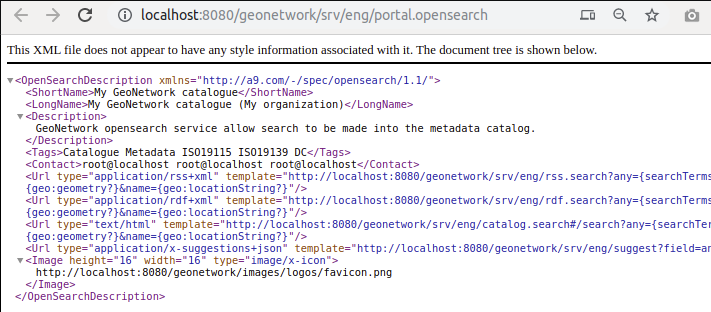

# OpenSearch and INSPIRE ATOM {#opensearch-and-atom}

!!! warning

    Not yet available in version 4.


## OpenSearch

The catalog provides an opensearch entry point at <http://localhost:8080/geonetwork/srv/eng/portal.opensearch>. This service is advertised in the HTML.



Browsers detect the availability of opensearch by checking the index page at the root of the (sub)domain. If you install geonetwork in a subfolder, consider to set up a rewrite rule forwarding the index request to the subfolder.

An example of such a rewrite rule in Apache:

``` text
RewriteEngine on
RewriteRule   "^/$"  "/geonetwork/"  [R]
```

Verify in a browser if opensearch is detected by typing the url and then a space. The url bar should then give an indication that you're searching within the site.

{width="300px"}

## INSPIRE ATOM

The INSPIRE technical guideline for download services facilitates an option to set up a download service based on OpenSearch and Atom. A separate OpenSearch endpoint is created for every Atom-based download service.

!!! note

    Only records based on the ISO19139 standard can be used with Atom. ISO19115-3 records are not.


A remote ATOM feed can be registered in a metadata record (see [Linking data using ATOM feeds](../user-guide/associating-resources/linking-online-resources.md#linking-data-using-atom-feed)), but the catalog can also create ATOM feeds from records describing datasets and services.

For a service metadata record, the corresponding ATOM feed is accessed at: `http://localhost:8080/geonetwork/srv/atom/describe/service?uuid=8b719ebd-646e-4963-b9e0-16b3c2a6d94e`. If the service is attached to one or more datasets (see [Linking a dataset with a service](../user-guide/associating-resources/linking-dataset-or-service.md)), then the feed will also expose each dataset as an `entry` in the feed. Check that the service type is set to `download` (if not, the dataset feed will return an exception).

The dataset feed is accessible at: `http://localhost:8080/geonetwork/srv/atom/describe/dataset?spatial_dataset_identifier_code=b795de68-726c-4bdf-a62a-a42686aa5b6f`. Links will be created for each online resource flagged with a `function` set to `download`.

Examples:

-   <https://catalog.inspire.geoportail.lu/geonetwork>
