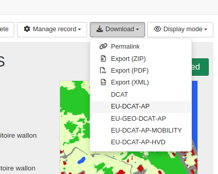

# DCAT {#rdf-dcat}

The catalogue has the capability to convert ISO to DCAT format in various API endpoint. 

## Supported DCAT profiles

A base conversion is provided with complementary extensions for various profiles of DCAT:

| Profile                     | Version | Description                                                                                                         | URL  | Conversion from* |
|-----------------------------|---------|---------------------------------------------------------------------------------------------------------------------|------|------------------|
| W3C DCAT                    | 3       | Default W3C standard                                                                                                | https://www.w3.org/TR/vocab-dcat-3/  | ISO19115-3       |
| European DCAT-AP            | 3.0.0 | DCAT profile for sharing information about Catalogues containing Datasets and Data Services descriptions in Europe  | https://semiceu.github.io/DCAT-AP/releases/3.0.0/  | ISO19115-3       |
| European DCAT-AP-Mobility   | 1.0.1   | mobilityDCAT-AP is a mobility-related extension of the DCAT-AP                                                      | https://mobilitydcat-ap.github.io/mobilityDCAT-AP/releases/  | ISO19115-3       |
| European DCAT-AP-HVD        | 2.2.0   | DCAT-AP for a dataset that is subject to the requirements imposed by the High-Value Dataset implementing regulation | https://semiceu.github.io/DCAT-AP/releases/2.2.0-hvd/  | ISO19115-3       |
| European GeoDCAT-AP         | 3.0.0   |                                                                                                                     | https://semiceu.github.io/GeoDCAT-AP/releases/3.0.0/  | ISO19115-3       |
| European GeoDCAT-AP (SEMIC) | 3.0.0   | [XSLT conversion maintained by SEMIC](https://github.com/SEMICeu/iso-19139-to-dcat-ap/blob/main/iso-19139-to-dcat-ap.xsl)                                                                             | https://semiceu.github.io/GeoDCAT-AP/releases/3.0.0/  | ISO19139         |


\*: 
* The mapping is done from ISO19115-3 to DCAT* except for the SEMIC conversion which converts ISO19139 to GeoDCAT-AP. 
* When needed, an ISO19139 to or from ISO19115-3 conversion is applied (eg. a CSW request querying a catalog in ISO19115-3 using the SEMIC conversion).
* DCAT output are not available for ISO19110 or Dublin core standards.

## Past implementation

[The first implementation of DCAT output was done in 2012](https://trac.osgeo.org/geonetwork/wiki/proposals/DCATandRDFServices) and was targeting interaction with semantic service and semantic sitemap support. DCAT output was available using a service named `rdf.search`. This service was deprecated in version 4.0.0 in favor of producing DCAT output in the [Catalog Service for the Web (CSW)](csw.md) or using the formatters API.


## Usage in the formatters API

Each DCAT formats are available using a formatter eg. http://localhost:8080/geonetwork/srv/api/records/be44fe5a-65ca-4b70-9d29-ac5bf1f0ebc5/formatters/eu-dcat-ap

To add the formatter in the record view download list, the user interface configuration can be updated:




User interface configuration: 

```json
{
  "mods": {
    "search": {
      "downloadFormatter": [
        {
          "label": "exportMEF",
          "url": "/formatters/zip?withRelated=false",
          "class": "fa-file-zip-o"
        },
        {
          "label": "exportPDF",
          "url": "/formatters/xsl-view?output=pdf&language=${lang}",
          "class": "fa-file-pdf-o"
        },
        {
          "label": "exportXML",
          "url": "/formatters/xml",
          "class": "fa-file-code-o"
        },
        {
          "label": "W3C-DCAT",
          "url": "/formatters/dcat"
        },
        {
          "label": "EU-DCAT-AP",
          "url": "/formatters/eu-dcat-ap"
        },
        {
          "label": "EU-GEO-DCAT-AP",
          "url": "/formatters/eu-geodcat-ap"
        },
        {
          "label": "EU-DCAT-AP-MOBILITY",
          "url": "/formatters/eu-dcat-ap-mobility"
        },
        {
          "label": "EU-DCAT-AP-HVD",
          "url": "/formatters/eu-dcat-ap-hvd"
        }
      ]
```


## Usage in the CSW service

All DCAT profiles are also accessible using CSW protocol.

A `GetRecordById` operation can be used: http://localhost:8080/geonetwork/srv/eng/csw?SERVICE=CSW&VERSION=2.0.2&REQUEST=GetRecordById&ID=da165110-88fd-11da-a88f-000d939bc5d8&outputSchema=https://semiceu.github.io/DCAT-AP/releases/2.2.0-hvd/ and is equivalent to the API http://localhost:8080/geonetwork/srv/api/records/da165110-88fd-11da-a88f-000d939bc5d8/formatters/eu-dcat-ap-hvd?output=xml.

A `GetRecords` operation can be used to retrieve a set of records: http://localhost:8080/geonetwork/srv/fre/csw?SERVICE=CSW&VERSION=2.0.2&REQUEST=GetRecords&outputSchema=http://data.europa.eu/930/&elementSetName=full&resultType=results&maxRecords=300

Use the `outputSchema` parameter to select the DCAT profile to use. The following values are supported:


| Profile                                 | Output schema parameter                               |
|-----------------------------------------|-------------------------------------------------------|
| CSW                                     | http://www.opengis.net/cat/csw/2.0.2                  | 
| ISO19115-3                              | http://standards.iso.org/iso/19115/-3/mdb/2.0         | 
| ISO19110                                | http://www.isotc211.org/2005/gfc                      | 
| ISO19139                                | http://www.isotc211.org/2005/gmd                      | 
| W3C DCAT                                | http://www.w3.org/ns/dcat#core                        | 
| EU-DCAT-AP                                 | http://data.europa.eu/r5r/                            | 
| EU-GeoDCAT-AP                              | http://data.europa.eu/930/                            | 
| EU-GeoDCAT-AP (SEMIC)                      | http://data.europa.eu/930/#semiceu                    | 
| DCAT (past implementation - deprecated) | http://www.w3.org/ns/dcat#                            | 
| EU-DCAT-AP-HVD                             | https://semiceu.github.io/DCAT-AP/releases/2.2.0-hvd/ | 
| EU-DCAT-AP-Mobility                     | https://w3id.org/mobilitydcat-ap                      | 

When using GET request, it is recommended to encode URL characters in parameters (eg. `#` as `%23`) to avoid issues with the URL.

Those values are listed in the `GetCapabilities` operation http://localhost:8080/geonetwork/srv/eng/csw?SERVICE=CSW&VERSION=2.0.2&REQUEST=GetCapabilities.

```xml
<ows:Parameter name="outputSchema">
  <ows:Value>http://www.opengis.net/cat/csw/2.0.2</ows:Value>
  <ows:Value>http://standards.iso.org/iso/19115/-3/mdb/2.0</ows:Value>
  <ows:Value>http://www.isotc211.org/2005/gfc</ows:Value>
  <ows:Value>http://www.isotc211.org/2005/gmd</ows:Value>
  <ows:Value>http://data.europa.eu/930/</ows:Value>
  <ows:Value>http://data.europa.eu/930/#semiceu</ows:Value>
  <ows:Value>http://data.europa.eu/r5r/</ows:Value>
  <ows:Value>http://www.w3.org/ns/dcat#</ows:Value>
  <ows:Value>http://www.w3.org/ns/dcat#core</ows:Value>
  <ows:Value>https://semiceu.github.io/DCAT-AP/releases/2.2.0-hvd/</ows:Value>
  <ows:Value>https://w3id.org/mobilitydcat-ap</ows:Value>
```

## Usage in OGC API Records

For the time being, OGC API Records provides a simplified DCAT output (based on the index document). 

## DCAT validation

The DCAT validation can be done using online validation tool:
* https://www.itb.ec.europa.eu/shacl/dcat-ap/upload

Depending on the target DCAT profile to use, it may be required to build proper ISO template and metadata record containing all required fields. Usually profiles are adding constraints for usage of specific vocabularies and fields (eg. [for High Value datasets, specific vocabularies are defined for categories, license, applicable legislations, ...](https://semiceu.github.io/DCAT-AP/releases/2.2.0-hvd/#controlled-vocabularies-to-be-used)).


## Mapping considerations

### Items under discussion


The mapping is done from ISO19115-3 to DCAT. The mapping may not cover all usages and may be adapted. This can be done in the `iso19115-3.2018` schema plugin in the `formatter/dcat*` XSLT files.

Some points under discussion are:

#### Object vs Reference: 

* Should we use object or reference for some fields (eg. contact, organisation, ...)?
* What should be the reference URI?
* Where is defined the reference URI in ISO?

eg.
* for the CatalogRecord reference URI is the `metadataLinkage` or the `metadataIdentifier`.
* for the Resource reference URI is the first resource identifier or the CatalogRecord reference URI with `#resource` suffix.
* for an organisation, the URI will be the first value in the following sequence:
```xml
(cit:partyIdentifier/*/mcc:code/*/text(),
cit:contactInfo/*/cit:onlineResource/*/cit:linkage/gco:CharacterString/text(),
cit:name/gcx:Anchor/@xlink:href,
@uuid)[1]
```

#### Distribution model in DCAT and ISO

In DCAT, a number of properties from the dataset are also defined in the distribution elements.
In ISO, an option could be to use multiple transfer options element to create multiple distribution elements with more detailed information in DCAT (eg. transfer size).

In the mapping, should we repeat all the information about the dataset? Should we recommend to use multiple transfer options element in ISO?

#### No equivalent field in ISO

eg. Where to store `spdx:checksum` in ISO? Could be considered as an online resource id attribute as the checksum uniquely identify the resource.


#### Associated resources

Links between resources are not always bidirectional so using the associated API would allow to populate more relations.
This is also mitigated when the complete RDF graph of the catalogue is retrieved as it will provide relations from all records.


### EU DCAT AP High Value Datasets

When encoding in ISO datasets in the context of DCAT HVD, consider encoding the following properties:

* Add a keyword pointing to the legislation http://data.europa.eu/eli/reg_impl/2023/138/oj
* Add at least one keyword for the `dcatap:hvdCategory` from the [High-value dataset categories vocabulary](https://op.europa.eu/en/web/eu-vocabularies/dataset/-/resource?uri=http://publications.europa.eu/resource/dataset/high-value-dataset-category)

See [DCAT AP HVD specification](https://semiceu.github.io/DCAT-AP/releases/2.2.0-hvd/) for other requirements.

### EU DCAT mobility 

When encoding in ISO datasets in the context of DCAT Mobility, consider encoding the following properties:

* `mobilitydcatap:mobilityTheme` (mandatory) is encoded as a keyword from the [mobility theme vocabulary](https://w3id.org/mobilitydcat-ap/mobility-theme)
* `mobilitydcatap:georeferencingMethod` (recommended) is encoded as a keyword from the [mobility georeferencing method vocabulary](https://w3id.org/mobilitydcat-ap/georeferencing-method/)
* `mobilitydcatap:networkCoverage` (recommended) is encoded as a keyword from the [mobility network coverage vocabulary](https://w3id.org/mobilitydcat-ap/network-coverage)
* `mobilitydcatap:transportMode` (recommended) is encoded as a keyword from the [mobility transport mode vocabulary](https://w3id.org/mobilitydcat-ap/transport-mode)

See [DCAT AP Mobility specification](https://mobilitydcat-ap.github.io/mobilityDCAT-AP/releases/) for other requirements.


### SEMIC conversion compared to GeoNetwork conversion

The main differences between the 2 conversions is that the GeoNetwork conversion **starts from ISO19115-3 instead of ISO19139** (to better support additional information provided in ISO19115-3 eg. date lifecycle, party identifiers and citation in data quality, feature catalogue, additional documentation, portrayal sections).  **The conversion to GeoDCAT-AP is done as an extension of DCAT-AP which extends the core W3C DCAT** for easier customization and extension. This allows non EU countries to also use the base DCAT conversion. The conversion is less linear and easier to extend or customize.

SEMIC conversion parameters `core`, `extended`, `include-deprecated` are not available in the GeoNetwork conversion which focus on version 3 of GeoDCAT-AP.

Some of the differences in the GeoNetwork conversion are:
* CatalogRecord / `dct:identifier` is prefixed with the code space if defined.
* CatalogRecord / `dct:title` and `dct:description` are set at CatalogRecord level and at the Resource level
* Resource / First resource identifier is used for `dct:identifer` (MobilityDCAT restrict it to 0..1), then additional ones are encoded in `adms:identifier`
* Resource / `dct:spatial` is only encoded using a `dcat:bbox` in GeoJSON (instead of WKT and GML and GeoJson and the `locn:geometry` which was kept for backward compatibility with GeoDCAT-AP v1.*)
* Resource / `dct:temporal` is only encoded using a `dcat:startDate` and `dcat:endDate` (and do not add same information in `schemas:startDate` and `schemas:endDate` which was kept for backward compatibility with GeoDCAT-AP v1.*)
* Portrayal, specification, report online link are encoded using `foaf:page` instead of `foaf:landingPage`
* `prov:qualifiedAttribution` element are not created because `dcat:creator|publisher|contactPoint|..` already provide the same information.
* Keyword / When encoded with `Anchor`, `dcat:theme` encoded with only a reference in SEMIC conversion and using `skos:Concept` in the GeoNetwork conversion (see discussion point above)

```xml
<dcat:theme rdf:resource="https://metawal.wallonie.be/thesaurus/theme-geoportail-wallon#SubThemesGeoportailWallon/5099"/>
vs
<dcat:theme>
  <skos:Concept rdf:about="https://metawal.wallonie.be/thesaurus/theme-geoportail-wallon#SubThemesGeoportailWallon/5099">
    <skos:prefLabel xml:lang="fre">Données de base (autre)</skos:prefLabel>
  </skos:Concept>
</dcat:theme>
```

Additional properties supported:
* CatalogRecord / `dct:issued` is added if exists in the metadata (added in ISO19115-3) 
* CatalogRecord / `dct:language` is added if exists 
* CatalogRecord / `cnt:characterEncoding` is added if exists
* Resource / `graphicOverview` is encoded as `foaf:page`
* Resource / Associated resources
  * Source dataset are encoded using `dct:source`
  * Associated resource are encoded using `dct:relation` and subtypes (eg. `isPartOf`) 
* Party identifier (added in ISO19115-3) are used for `rdf:about` attribute for individual or organization

Technical differences:
* `normalize-space` is not applied to `abstract` or `lineage` (which lose the line breaks and basic formatting) 


