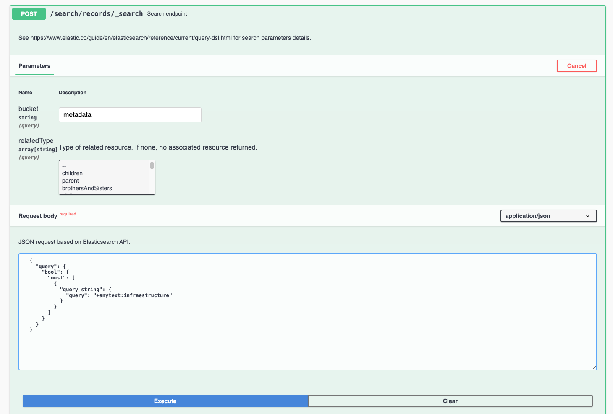

# Search Service

## Elasticsearch 

GeoNetwork provides a full Elasticsearch end-point: `/srv/api/search/records/_search` that requires http `POST`, 
accepting a payload with an Elasticsearch query.

Reference

-   [Search API](https://www.elastic.co/guide/en/elasticsearch/reference/current/search-search.html) (Elasticsearch)

### Query examples

This section provides some query examples. To test them a `POST` request should be sent to the search end-point `/srv/api/search/records/_search` :

  


- Query with any field for metadata containing the string `infrastructure`, using a query with Lucene syntax and excluding metadata templates:

  ```json
  {
    "query": {
      "bool": {
        "must": [
          {
            "query_string": {
              "query": "+anytext: infraestructure "
            }
          }
        ],
        "filter": [
          {
            "term": {
              "isTemplate": {
                "value": "n"
              }
            }
          }
        ]
      }
    }
  }
  ```

- Query with any field for metadata containing the string `infrastructure`, using a query with Lucene syntax and excluding metadata templates, returning a subset of the information:

  ```json
  {
    "query": {
      "bool": {
        "must": [
          {
            "query_string": {
              "query": "+anytext: infraestructure "
            }
          }
        ],
        "filter": [
          {
            "term": {
              "isTemplate": {
                "value": "n"
              }
            }
          }
        ]
      }
    },
    "_source": {
      "includes": [
        "uuid",
        "id",
        "resourceType",
        "resourceTitle*",
        "resourceAbstract*"
      ]
    }
  }
  ```


- Query datasets with title containing the string `infrastructure`, using a query with Lucene syntax and excluding metadata templates:

  ```json
  {
    "query": {
      "bool": {
        "must": [
          {
            "query_string": {
              "query": "+anytext: infraestructure +resourceType:dataset"
            }
          }
        ],
        "filter": [
          {
            "term": {
              "isTemplate": {
                "value": "n"
              }
            }
          }
        ]
      }
    }
  }
  ```

- Query datasets with a revision date in June 2019 and excluding metadata templates:

```json
{
  "query": {
    "bool": {
      "must": [
        {
          "term": {
            "resourceType": {
              "value": "dataset"
            }
          }
        },
        {
          "range": {
            "resourceTemporalDateRange": {
              "gte": "2019-06-01",
              "lte": "2019-06-30",
              "relation": "intersects"
            }
          }
        }
      ],
      "filter": [
        {
          "term": {
            "isTemplate": {
              "value": "n"
            }
          }
        }
      ]
    }
  }
}
```
