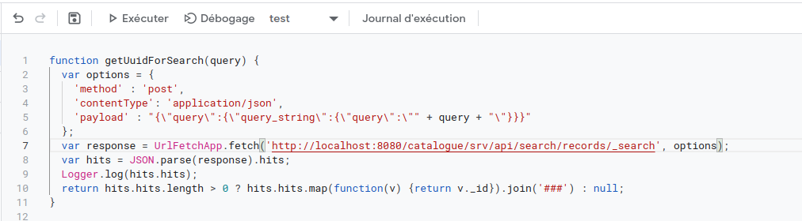
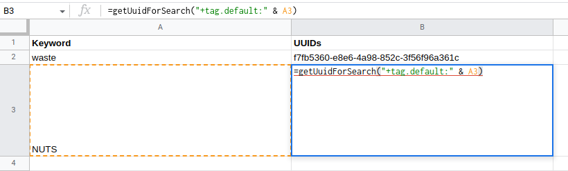

# GeoNetwork API

The REST API and documentation are available in your catalog at page <http://localhost:8080/geonetwork/doc/api/> and linked from the footer on the home page.

In version 4, the API description is using OpenAPI specification. Old path to the API including the version ``/srv/api/0.1/\...`` is replaced by ``/srv/api/\...``. The version of the API correspond to the version of the GeoNetwork instance.

## Using the API to apply an XSL process

This is an example to trigger an XSL process on a set of records. It illustrates how to make a set of actions using the API:

``` shell
CATALOG=http://localhost:8080/geonetwork
CATALOGUSER=admin
CATALOGPASS=admin
PROCESS=migrate-201904

rm -f /tmp/cookie;
curl -s -c /tmp/cookie -o /dev/null \
  -X GET \
  -H "Accept: application/json" \
  "$CATALOG/srv/api/me";
TOKEN=`grep XSRF-TOKEN /tmp/cookie | cut -f 7`;
curl \
  -X GET \
  -H "Accept: application/json" \
  -H "X-XSRF-TOKEN: $TOKEN" --user $CATALOGUSER:$CATALOGPASS -b /tmp/cookie \
  "$CATALOG/srv/api/me"

# MUST return user details

curl -X POST "$CATALOG/srv/api/search/records/_search?bucket=111" \
    -H 'Accept: application/json' \
    -H 'Content-Type: application/json;charset=utf-8' \
    -H "X-XSRF-TOKEN: $TOKEN" -c /tmp/cookie -b /tmp/cookie --user $CATALOGUSER:$CATALOGPASS \
    -d '{"from":0,"size":0,"query":{"query_string":{"query":"+linkUrl:*data-and-maps*"}}}'


curl -X PUT "$CATALOG/srv/api/selections/111" -H "accept: application/json" \
  -H "X-XSRF-TOKEN: $TOKEN" -c /tmp/cookie -b /tmp/cookie --user $CATALOGUSER:$CATALOGPASS
#Body response = number of selected records

curl -X GET "$CATALOG/srv/api/selections/111" -H "accept: application/json" \
  -H "X-XSRF-TOKEN: $TOKEN" -c /tmp/cookie -b /tmp/cookie --user $CATALOGUSER:$CATALOGPASS
#Body returns an array of selected records

curl -X POST "$CATALOG/srv/api/processes/$PROCESS?bucket=111&index=false" \
  -H "accept: application/json" -H "X-XSRF-TOKEN: $TOKEN" -c /tmp/cookie -b /tmp/cookie --user $CATALOGUSER:$CATALOGPASS
```

## Loop on search results and apply changes (processing and batch editing)

This is an example to highlight how to loop over specific search results (here only series) and apply various changes:

``` shell
SERVER=http://localhost:8080/geonetwork
CATALOGUSER=admin
CATALOGPASS=admin

type=series
from=0
size=1000

rm results.json
rm -f /tmp/cookie;

curl -s -c /tmp/cookie -o /dev/null \
  -X GET \
  --user $CATALOGUSER:$CATALOGPASS \
  -H "Accept: application/json" \
  "$SERVER/srv/api/me";

TOKEN=`grep XSRF-TOKEN /tmp/cookie | cut -f 7`;
JSESSIONID=`grep JSESSIONID /tmp/cookie | cut -f 7`;

curl "$SERVER/srv/api/search/records/_search" \
    -X 'POST' \
    -H 'Accept: application/json, text/plain, */*' \
    -H 'Content-Type: application/json;charset=UTF-8' \
    --data-raw "{\"query\":{\"query_string\":{\"query\": \"+isHarvested:false +resourceType: $type\"}},\"from\":$from, \"size\":$size, \"_source\": {\"include\": [\"resourceTitleObject.default\"]}, \"sort\": [{\"resourceTitleObject.default.keyword\": \"asc\"}]}" \
    -H "X-XSRF-TOKEN: $TOKEN" -H "Cookie: XSRF-TOKEN=$TOKEN; JSESSIONID=$JSESSIONID" \
    --compressed \
    -o results.json

for hit in $(jq -r '.hits.hits[] | @base64' results.json); do
   _jq() {
     echo "${hit}" | base64 --decode | jq -r "${1}"
    }

  title=$(_jq '._source.resourceTitleObject.default')
  uuid=$(_jq '._id')
  echo "__________"
  echo "### $uuid"

  # Update series from its members using XSL process
  curl $AUTH "$SERVER/srv/api/records/$uuid/processes/collection-updater" \
    -X 'POST' \
    -H 'Accept: application/json, text/plain, */*' \
    -H "X-XSRF-TOKEN: $TOKEN" \
    -H "Cookie: XSRF-TOKEN=$TOKEN; JSESSIONID=$JSESSIONID" \
    --compressed

  curl $AUTH "$SERVER/srv/api/selections/s101" \
    -X 'DELETE' \
    -H 'Accept: application/json, text/javascript, */*; q=0.01' \
    -H "X-XSRF-TOKEN: $TOKEN" \
    -H "Cookie: XSRF-TOKEN=$TOKEN; JSESSIONID=$JSESSIONID" \
    --compressed

  curl $AUTH "$SERVER/srv/api/selections/s101?uuid=$uuid" \
    -X 'PUT' \
    -H 'Accept: application/json, text/javascript, */*; q=0.01' \
    -H "X-XSRF-TOKEN: $TOKEN" \
    -H "Cookie: XSRF-TOKEN=$TOKEN; JSESSIONID=$JSESSIONID" \
    --compressed

  # Keep only the first 2 resource identifiers using batch editing
  curl $AUTH "$SERVER/srv/api/records/batchediting?bucket=s101" \
    -X 'PUT' \
    -H 'Accept: application/json, text/plain, */*' \
    -H 'Content-Type: application/json;charset=UTF-8' \
    -H "X-XSRF-TOKEN: $TOKEN" \
    -H "Cookie: XSRF-TOKEN=$TOKEN; JSESSIONID=$JSESSIONID" \
    --data-raw "[{\"xpath\":\"/gmd:identificationInfo/*/gmd:citation/*/gmd:identifier[position() > 2]\",\"value\":\"<gn_delete/>\"}]" \
    --compressed
done;
```

## Using the search API in Google sheet

In Extensions --> App script create a new function. Here we create a function which run a search and return a list of matching UUIDs:



``` js
function getUuidForSearch(query) {
  var options = {
    'method' : 'post',
    'contentType': 'application/json',
    'payload' : "{\"query\":{\"query_string\":{\"query\":\"" + query + "\"}}}"
  };
  var response = UrlFetchApp.fetch('http://localhost:8080/catalogue/srv/api/search/records/_search', options);
  var hits = JSON.parse(response).hits;
  Logger.log(hits.hits);
  return hits.hits.length > 0 ? hits.hits.map(function(v) {return v._id}).join('###') : null;
}
```

Then use the function in formula. Here we search for records matching particular keywords:



## Building client for the API using codegen

The API is described using the open API specification. [Codegen](https://swagger.io/swagger-codegen/) is a tool to build an API client based on the specification. To build a Java client use the following procedure.

First, create a configuration file apiconfig.json for the API:

``` json
{
  "groupId":"org.geonetwork-opensource",
  "artifactId":"OpenApiClient",
  "artifactVersion":"0.0.1",
  "library":"okhttp-gson",
  "apiPackage":"org.fao.geonet.openapi",
  "modelPackage":"org.fao.geonet.openapi.model"
}
```

``` shell
java -jar swagger-codegen-cli.jar generate \
     -i http://localhost:8080/geonetwork/srv/v2/api-docs \
     -l java \
     -c apiconfig.json \
     -o /tmp/gn-openapi-java-client

cd /tmp/gn-openapi-java-client

mvn clean install
```

Once compiled, the Java client can be used as a dependency; eg. for Maven:

``` xml
<dependency>
  <groupId>org.geonetwork-opensource</groupId>
  <artifactId>OpenApiClient</artifactId>
  <version>0.0.1</version>
</dependency>
```

Then the client API can be used in your Java application:

``` java
import com.squareup.okhttp.Interceptor;
import com.squareup.okhttp.Request;
import com.squareup.okhttp.Response;
import org.fao.geonet.ApiClient;
import org.fao.geonet.ApiException;
import org.fao.geonet.Configuration;
import org.fao.geonet.openapi.MeApi;
import org.fao.geonet.openapi.RecordsApi;
import org.fao.geonet.openapi.model.MeResponse;
import org.fao.geonet.openapi.model.SimpleMetadataProcessingReport;
import org.junit.jupiter.api.BeforeAll;
import org.junit.jupiter.api.Test;
import org.junit.jupiter.api.TestInstance;

import java.io.IOException;
import java.util.Arrays;
import java.util.Base64;

import static org.junit.jupiter.api.Assertions.assertEquals;
import static org.junit.jupiter.api.Assertions.assertNotNull;

@TestInstance(TestInstance.Lifecycle.PER_CLASS)
public class GnJavaApiClientTest {

    private static final String CATALOGUE_URL = "http://localhost:8080/geonetwork";

    ApiClient client;

    private static final String USERNAME = "admin";
    private static final String PASSWORD = "admin";


    @BeforeAll
    private void initConfiguration() {
        client
            = Configuration.getDefaultApiClient();
        client.setBasePath(CATALOGUE_URL);
    }

    /**
     * Get user information when anonymous or connected.
     */
    @Test
    public void getMeInfoTest() {
        try {
            client.getHttpClient().networkInterceptors().clear();

            MeApi meApi = new MeApi();
            MeResponse meResponse = meApi.getMe();
            // User is not authenticated
            assertEquals(null, meResponse);

            // Configure HTTP basic authorization: basicAuth
            client.getHttpClient().networkInterceptors().add(new BasicAuthInterceptor(USERNAME, PASSWORD));

            meResponse = meApi.getMe();
            // User is authenticated
            assertEquals(USERNAME, meResponse.getName());

        } catch (ApiException e) {
            e.printStackTrace();
        }
    }


    /**
     * Insert and delete a record.
     */
    @Test
    public void insertAndDeleteRecord() {

        // Configure HTTP basic authorization: basicAuth
        client.getHttpClient().networkInterceptors().add(new BasicAuthInterceptor(USERNAME, PASSWORD));


        try {
            final RecordsApi api = new RecordsApi();

            SimpleMetadataProcessingReport report = api.insert("METADATA",
                null,
                Arrays.asList(new String[]{"http://sextant.ifremer.fr/geonetwork/srv/fre/xml.metadata.get?uuid=ec41b8b2-c184-46e7-86c6-a24f0ac295ad"}),
                null, null,
                true, "NOTHING",
                null,
                null,
                false,
                null,
                null,
                null);

            int nbOfRecordInserted = report.getMetadataInfos().size();


            // One record MUST be inserted
            assertEquals(1, nbOfRecordInserted);

            if (nbOfRecordInserted == 1) {
                Object[] list = report.getMetadataInfos().keySet().toArray();
                String metadataId = (String) list[0];
                String record = api.getRecord(metadataId, "application/xml");
                assertNotNull(record);

                api.deleteRecord(metadataId, false);

                try {
                    api.getRecord(metadataId, "application/xml");
                } catch (ApiException e) {
                    assertEquals(404, e.getCode());
                }
            }
        } catch (ApiException e) {
            e.printStackTrace();
        }
    }


    /**
     * Interceptor to add basic authentication header on each request.
     * <p>
     * TODO: How-to make generated client taking care of setting BA from swagger config.
     * TODO: Add support for CSRF token.
     */
    public class BasicAuthInterceptor implements Interceptor {
        String username;
        String password;

        public BasicAuthInterceptor(String username, String password) {
            this.username = username;
            this.password = password;
        }

        @Override
        public Response intercept(Interceptor.Chain chain) throws IOException {
            byte[] auth = Base64.getEncoder()
                .encode((username + ":" + password).getBytes());

            Request compressedRequest = chain.request().newBuilder()
                .header("Authorization", "Basic " + new String(auth))
                .build();

            return chain.proceed(compressedRequest);
        }
    }
}
```

## Connecting to the API with python

This is an example of how to use requests in python to authenticate to the API and generate an XRSF token.

``` python
import requests

# Set up your username and password:
username = 'username'
password = 'password'

# Set up your server and the authentication URL:
server = "http://localhost:8080"
authenticate_url = server + '/geonetwork/srv/eng/info?type=me'

# To generate the XRSF token, send a post request to the following URL: http://localhost:8080/geonetwork/srv/eng/info?type=me
session = requests.Session()
response = session.post(authenticate_url)

# Extract XRSF token
xsrf_token = response.cookies.get("XSRF-TOKEN")
if xsrf_token:
    print ("The XSRF Token is:", xsrf_token)
else:
    print("Unable to find the XSRF token")

# You can now use the username and password, along with the XRSF token to send requests to the API.

# This example will add an online resource to a specified UUID using the http://localhost:8080/geonetwork/srv/api/records/batchediting endpoint

# Set header for connection
headers = {'Accept': 'application/json',
'X-XSRF-TOKEN': xsrf_token
}

# Set the parameters
params = {'uuids': 'the uuid to be updated',
'bucket': 'bucketname',
'updateDateStamp': 'true',
}

# Set the JSON data: note that the value must have one of <gn_add>, <gn_create>, <gn_replace> or <gn_delete>
json_data = [{'condition': '',
'value': '<gn_add><gmd:onLine xmlns:gmd="http://www.isotc211.org/2005/gmd" xmlns:gco="http://www.isotc211.org/2005/gco"><gmd:CI_OnlineResource><gmd:linkage><gmd:URL>https://localhost</gmd:URL></gmd:linkage><gmd:protocol><gco:CharacterString>WWW:LINK-1.0-http--link</gco:CharacterString></gmd:protocol><gmd:name><gco:CharacterString>The Title of the URL</gco:CharacterString></gmd:name><gmd:description><gco:CharacterString>The description of the resource</gco:CharacterString></gmd:description><gmd:function></gmd:function></gmd:CI_OnlineResource></gmd:onLine></gn_add>',
'xpath': '/gmd:MD_Metadata/gmd:distributionInfo/gmd:MD_Distribution/gmd:transferOptions/gmd:MD_DigitalTransferOptions',
},
]

# Send a put request to the endpoint
response = session.put(server + 'geonetwork/srv/api/records/batchediting',
params=params,
auth = (username, password),
headers=headers,
json=json_data,
)

print(response.text)
```
