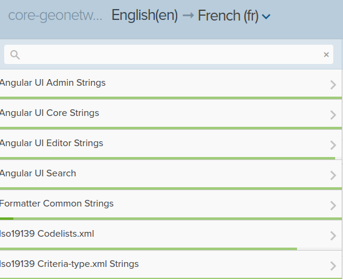

# Translating the application {#translating}

To translate the client interface, go on [GeoNetwork on Transifex](https://www.transifex.com/geonetwork/core-geonetwork/). Only the reference language (ie. en) MUST be updated on github. All other translations MUST be on Transifex.

Main files to translate are the `Angular UI` ones:



Once translated, the new language needs to be added to the application.

-   Add the files to the client application in `web-ui/src/main/resources/catalog/locales`
-   Register the new lang in `web-ui/src/main/resources/catalog/js/CatController.js`

``` js
// Add the language here
module.constant('gnLangs', {
  langs: {
    'eng': 'en',
    'dut': 'du',
    'fre': 'fr',
    'ger': 'ge',
    'kor': 'ko',
    'spa': 'es',
    'cze': 'cz'
  },


// Lang names to be displayed in language selector
$scope.langLabels = {'eng': 'English', 'dut': 'Nederlands',
  'fre': 'Français', 'ger': 'Deutsch', 'kor': '한국의',
  'spa': 'Español', 'cze': 'Czech'};
```

To automatically retrieve and update translations files, the script `web-ui/download-from-transifex.sh` can be used. To use the script you have to join the translation team on Transifex.

Register the new lang in the l variable of the transifex synchronization file:

``` shell
SRC_DIR=src/main/resources/catalog/locales

l=(
    'es::es'
    'fr::fr'
    'cz::cz'
```

and run the script

``` shell
cd web-ui
./download-from-transifex.sh
```

Then on the Java application, register the new language in `src/main/webResources/WEB-INF/config-spring-geonetwork.xml`:

``` xml
<util:set id="languages">
  <value>ara</value>
  <value>cze</value>
```

Add a new SQL file for the database initialization in `src/main/webapp/WEB-INF/classes/setup/sql/data/loc-cze-default.sql` and update translations. This file is used to register the new language for database entity translations (eg. groups, status).


# Translating a standard

To translate a standard, see the schema folder (`schemas/iso19139/src/main/plugin/iso19139/loc`). Those files are used in the editor and formatters to translate standard elements, to provide help text, recommended values list, \...
