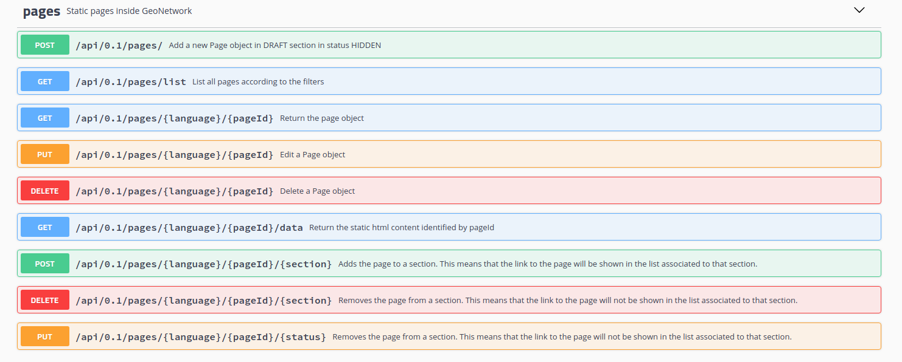

# Adding static pages

This feature allows to store the HTML content for static pages and show the links to these pages in specific sections of the user interface:

-   The HTML content is stored in a new table of the GN's database.

-   The link to pages can be showed in different points of the GN's GUI according to a list of "sections" associated to each page. In this PR is introduced the support to show the links for the top toolbar and the footer.

-   Each page can be in 3 states:

    -   `HIDDEN`: visible to administrator.
    -   `PRIVATE`: visible to logged users.
    -   `PUBLIC`: visible to everyone.

-   Pages can be added to different page sections. Currently the sections implemented are `TOP` (top menu of the main page) and `FOOTER` (footer of the main page).

-   Only the administrator can edit the pages and see the pages in `HIDDEN` status.

-   The creation and the management of the content is done via the API.

    

Some restrictions:

-   It is not possible to apply custom CSS to the page.
-   Any external image must be loaded externally.

## Examples of API usage

Before executing the following examples, see [Example of CSRF call using curl](misc.md#example-csrf-curl) for details on the usage of the CSRF token (instead of the value `"X-XSRF-TOKEN: e934f557-17a3-47f2-8e6b-bdf1a3c90a97"` used in the examples) and cookies in the requests.

### Load a page in the top menu bar

In this example we're going to upload a file ``contactus.html`` and link it in the top menu:

1.  Load the content by using the method POST `/api/pages/`, the mandatory fields are:

    -   language (3 letters like 'eng', 'ita', 'fra' \...)
    -   pageId (the identifier/link description of the page)
    -   format (must be LINK if a link is associated to the page)
    -   the content: data (a file with the page content) or a link (URL to another page). Define both is not possible.

    ``` bash
    $ curl -X POST "http://localhost:8080/geonetwork/srv/api/pages/?language=eng&pageId=contactus&format=HTML" -H "accept: */*" -H "Content-Type: multipart/form-data" -H "X-XSRF-TOKEN: e934f557-17a3-47f2-8e6b-bdf1a3c90a97" -d contactus.html
    ```

    At this point the page is created but not visible because is in status HIDDEN and is not loaded explicitly in any section of the page, except DRAFT that is not visible (in the future could be added to a page with an editor interface). Similar requests should be done for each UI language supported.

2.  To associate the link to the top bar is necessary to use the method POST `/api/pages/{language}/{pageId}/{section}` with the `TOP` value for the section.

    ``` bash
    $ curl -X POST "http://localhost:8080/geonetwork/srv/api/pages/eng/contactus/TOP" -H "accept: */*" -H "X-XSRF-TOKEN: 7cfa1a0d-3335-4846-8061-a5bf176687b5"  --user admin:admin -b /tmp/cookie
    ```

### Load a link in the footer bar

In this example we're going to add a link to an external resource <http://myorganisation/contactus.html> and link it in the footer:

1.  Add the link by using the method POST `/api/pages/` with the `link` parameter in the request:

    ``` bash
    $ curl -X POST "http://localhost:8080/geonetwork/srv/api/pages/?language=eng&pageId=contactus&format=LINK&link=http://myorganisation/contactus.html" -H "accept: */*" -H "X-XSRF-TOKEN: e934f557-17a3-47f2-8e6b-bdf1a3c90a97"
    ```

2.  To associate the link to the footer is necessary to use the method POST `/api/pages/{language}/{pageId}/{section}` with the `FOOTER` value for the section.

    ``` bash
    $ curl -X POST "http://localhost:8080/geonetwork/srv/api/pages/eng/contactus/FOOTER" -H "accept: */*" -H "X-XSRF-TOKEN: 7cfa1a0d-3335-4846-8061-a5bf176687b5"  --user admin:admin -b /tmp/cookie
    ```

### Remove a page from a section

To remove a page from a section DELETE `/api/pages/{language}/{pageId}/{section}`

``` bash
curl -X DELETE "http://localhost:8080/geonetwork/srv/api/pages/eng/contactus?format=LINK" -H "accept: */*" -H "X-XSRF-TOKEN: 7cfa1a0d-3335-4846-8061-a5bf176687b5"  --user admin:admin -b /tmp/cookie
```

### Change the page status

The status of the page can be changed with the method PUT `/api/pages/{language}/{pageId}/{status}` where status could assume these values:

-   `PUBLIC` - Visible to every user
-   `PUBLIC_ONLY` - Visible to not logged users
-   `PRIVATE` - Visible to logged users
-   `HIDDEN` - Hidden to anyone

Other methods in the API are to change/delete a page and to GET the list of the pages or the info of a specific one.

### Change the menu order in the top toolbar

Pages can be inserted in between catalogue default menu which are:

``` json
["gn-site-name-menu",
 "gn-portal-switcher",
 "gn-search-menu",
 "gn-map-menu",
 "gn-contribute-menu",
 "gn-admin-menu"]
```

Insert a page as a simple menu using its id or as a submenu using an object:

``` json
["gn-site-name-menu",
 "gn-portal-switcher",
 "gn-search-menu",
 {"Quick search": [
   "searchForAfrica",
   "forReview"
 ]},
 "gn-map-menu",
 "gn-contribute-menu",
 "gn-admin-menu",
 "documentation"]
```
