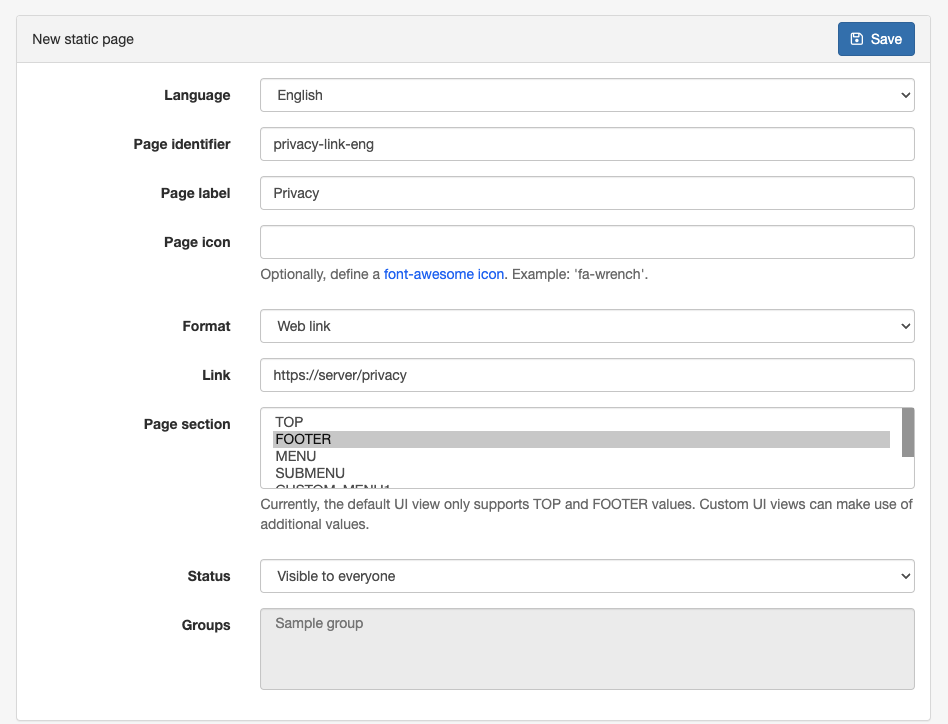
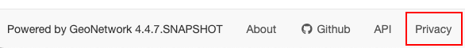

# Adding static pages

This function allows storing the HTML content of static pages and displaying links to these pages in specific sections of the user interface. 

To add new static pages go to **Admin Console** -->  **Settings** -->  **Static Pages** and select the **+ New Static Page** option, providing the following information:

- **Language**: User interface language in which the static page will be displayed.
- **Page identifier**: A unique text identifier for the page.
- **Page label**: Label to display on the link.
- **Page icon**: (Optional) Icon to display next to the link label.
- **Format**: Format of the static page:

    - **Web link**: Link to a web page.
    - **HTML content displayed embedded in the app**
    - **HTML content displayed in a new browser tab**
    - **Plain text content**
    - **Email link**: Email address. Opens the system's mail client to send mail to the configured address.

- **Link**: Available for **Web link** / **Email link** formats.

    - For **Web link** the link to a web page.
    - For **Email link**, the email address to which the email will be sent.

- **Page content file**: For formats other than **Web link** or **Email link**, allows uploading a file with the HTML content / text to be displayed.

- **Page content**: For formats other than **Web link** or **Email link**, allows editing the HTML / text content to display.

- **Page section**: Section of the page to display the link. Currently implemented sections are `TOP` (top menu of the main page) and `FOOTER` (footer of the main page).

- **Status**: Defines which users can see the link.

    - **Visible only to the administrator**
    - **Visible to logged users**
    - **Visible to users belonging to groups**
    - **Visible to every one**

  


  


Some restrictions:

-   It is not possible to apply custom CSS to the page.
-   Any external image must be loaded externally.

## Change the menu order in the top toolbar

In the top bar, pages can be inserted between the default menu of the catalogue. This can be configured in **Admin Console** -->  **Settings** -->  **User interface**, in the **Header custom menu items** section.

By default, the order of the items in the top bar is as follows:

``` json
["gn-site-name-menu",
 "gn-portal-switcher",
 "gn-search-menu",
 "gn-map-menu",
 "gn-contribute-menu",
 "gn-admin-menu"]
```

Insert a page as a simple menu using the page identifier or as a submenu using an object:

``` json
["gn-site-name-menu",
 "gn-portal-switcher",
 "gn-search-menu",
 {"Quick search": [
   "searchForAfrica",
   "forReview"
 ]},
 "gn-map-menu",
 "gn-contribute-menu",
 "gn-admin-menu",
 "documentation"]
```

## Change the static pages order in the footer

The order of the footer pages can be configured in **Admin Console** -->  **Settings** -->  **User interface**, in the **Footer custom menu items** section.

