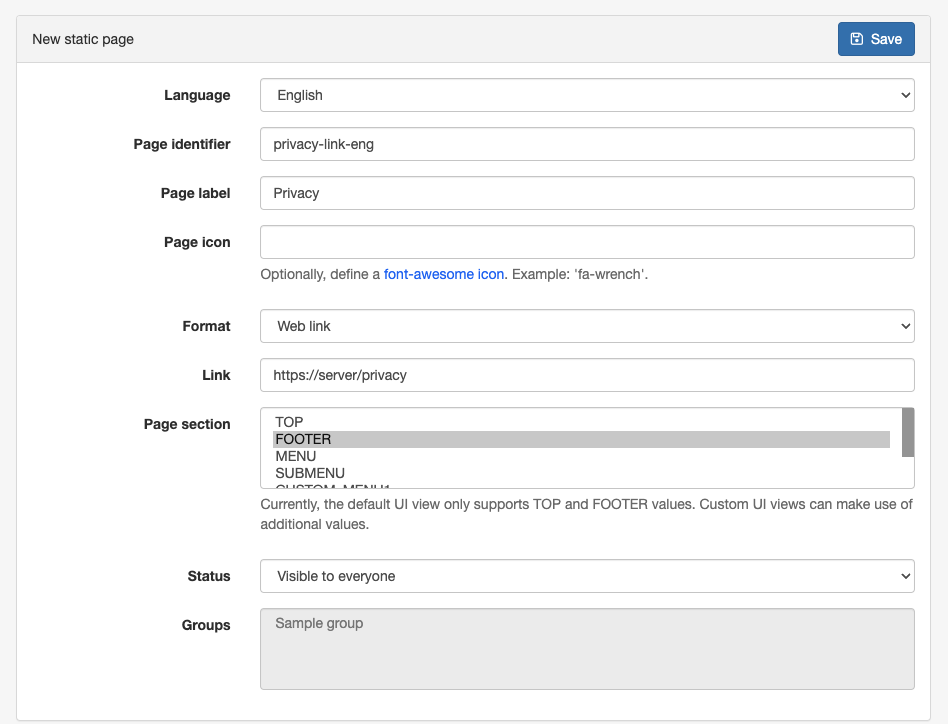
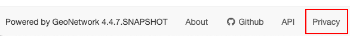

# Adding static pages

This function allows storing the HTML content of static pages and displaying links to these pages in specific sections of the user interface. 

To add new static pages go to **Admin Console** -->  **Settings** -->  **Static Pages** and select the **+ New Static Page** option, providing the following information:

- **Language**: User interface language in which the static page will be displayed.  
  (3 letters like 'eng', 'ita', 'fra' ...)
- **Page identifier**: A unique text identifier for the page.  
  This value should be encoded
- **Page label**: Label to display on the link.
- **Page icon**: (Optional) Icon to display next to the link label.
- **Format**: Format of the static page:

    - **Web link**: Link to a web page.
    - **HTML content displayed embedded in the app**
    - **HTML content displayed in a new browser tab**
    - **Plain text content**
    - **Email link**: Email address. Opens the system's mail client to send mail to the configured address.

- **Link**: Available for **Web link** / **Email link** formats.

    - For **Web link** the URL link to another web page.  The URL should be encoded.
    - For **Email link**, the email address to which the email will be sent.

- **Page content file**: For formats other than **Web link** or **Email link**, allows uploading a file with the HTML content / text to be displayed.

- **Page content**: For formats other than **Web link** or **Email link**, allows editing the HTML / text content to display.

- **Page section**: Section of the page to display the link. Currently implemented sections are `TOP` (top menu of the main page), `FOOTER` (footer of the main page), and `RECORD_VIEW_MENU` (toolbar shown on the record view page).

- **Status**: Defines which users can see the link.

    - **Visible only to the administrator**
    - **Visible to logged users**
    - **Visible to users belonging to groups**
    - **Visible to users belonging to groups and to administrators**
    - **Visible to every one**

  When using one of the group-based visibility options, select one or more values in the **Groups** field.
  Administrators can still see all configured static pages in the administration screen so they can manage pages even when a page is not publicly visible.

  


  


Some restrictions:

-   It is not possible to apply custom CSS to the page.
-   Any external image must be loaded externally.

## Change the menu order in the top toolbar

In the top bar, pages can be inserted between the default menu of the catalogue. This can be configured in **Admin Console** -->  **Settings** -->  **User interface**, in the **Header custom menu items** section.

By default, the order of the items in the top bar is as follows:

``` json
["gn-site-name-menu",
 "gn-portal-switcher",
 "gn-search-menu",
 "gn-map-menu",
 "gn-contribute-menu",
 "gn-admin-menu"]
```

Insert a page as a simple menu using the page identifier or as a submenu using an object. In the submenu case, the object key defines the top-level label. That label can be a translation key, or literal text if the text is not defined in the translations.

``` json
["gn-site-name-menu",
 "gn-portal-switcher",
 "gn-search-menu",
 {"quickSearch": {
   "icon": "fa-search",
   "items": [
     "searchForAfrica",
     "forReview"
   ]
 }},
 "gn-map-menu",
 "gn-contribute-menu",
 "gn-admin-menu",
 "documentation"]
```

For example, if a translation is defined for `quickSearch`, the submenu label is translated automatically for each language.

## Change the menu order in the record view toolbar

On the record view page, static pages can also be inserted between the default record actions. This can be configured in **Admin Console** --> **Settings** --> **User interface**, in the **Record View custom menu items** section.

To add a static page to this area, create it first with the **Page section** set to `RECORD_VIEW_MENU`.

By default, the record view toolbar uses the following menu order:

``` json
["gn-recordview-edit-menu",
 "gn-recordview-delete-menu",
 "gn-recordview-manage-menu",
 "gn-recordview-download-menu",
 "gn-recordview-display-menu"]
```

As with the top toolbar, insert a page as a simple menu using the page identifier or as a submenu using an object:

``` json
["gn-recordview-edit-menu",
 {"quickSearch": {
   "icon": "fa-search",
   "items": [
     "documentation",
     "forReview"
   ]
 }},
 "gn-recordview-delete-menu",
 "gn-recordview-manage-menu",
 "gn-recordview-download-menu",
 "gn-recordview-display-menu"]
```

## Change the static pages order in the footer

The order of the footer pages can be configured in **Admin Console** -->  **Settings** -->  **User interface**, in the **Footer custom menu items** section.

