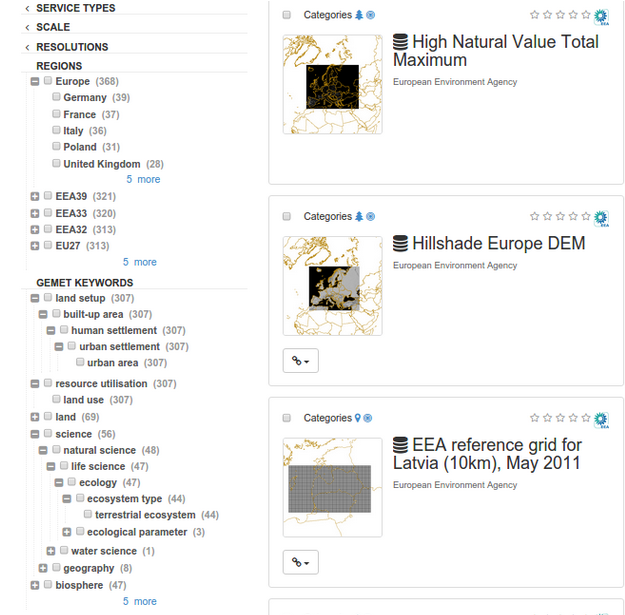

# Configuring faceted search

## Facet principle
Faceted search provides a way to easily filter search.



2 types of facets exist:

- simple facet (only a list of value).

- hierarchical facet (a category tree of value) requiring a thesaurus with relations.

## Facet response when searching

When running a search a `resultType` parameter define a set of facet to return.

A facet response looks like the following:

``` xml
<response from="1" to="20" selected="0">
  <summary count="134" type="local">
    <dimension name="type" label="types">
      <category value="dataset" label="Dataset" count="86"/>
      <category value="series" label="Series" count="41"/>
      <category value="service" label="Service" count="7"/>
    </dimension>
    <dimension name="denominator" label="denominators">
      <category value="200000" label="200000" count="1"/>
      <category value="50000" label="50000" count="1"/>
      <category value="25000" label="25000" count="1"/>
      <category value="15000" label="15000" count="4"/>
      <category value="10000" label="10000" count="1"/>
      <category value="5000" label="5000" count="3"/>
      <category value="2000" label="2000" count="12"/>
    </dimension>
    <dimension name="resolution" label="resolutions">
      <category value="5 m" label="5 m" count="10"/>
      <category value="1 m" label="1 m" count="3"/>
      <category value="0.20 m" label="0.20 m" count="1"/>
    </dimension>
  </summary>
```

User can retrieve a JSON response by adding `_content_type=json` in the parameter list.

## Configuration

The facet configuration is done manually in `WEB-INF/config-summary.xml`. After change,
stop the application, drop the index and start the application to fully rebuild the index.


A facet is based on a field in the index (see :ref:`configuring-search-fields`).

Each facet to be indexed is defined in the `facets` element. The facets element
lists the facets to index and how they should be indexed using attributes
on facet elements as follows:

- name: the name of the facet

- indexKey: the name of the indexing field to be used for the facet

- label: the label to use for the facet in returned summaries

- (optional) classifier: a reference to a spring bean that should be used to
  determine facet values for the indexing field. Used for hierarchical facets.
  The bean must implement the org.fao.kernel.search.classifier.Classifier interface
  Defaults to a classifier which uses the value of the field to be indexed

- localized: todo documentation

eg. for a simple facet

``` xml
<facet name="denominator"
       indexKey="denominator"
       label="denominators"/>
```

eg. for a hierarchical facet based on a thesaurus.

1. Define the facet

   ``` xml
   <facet name="gemetKeyword"
          label="gemetKeywords"
          indexKey="keyword"
          classifier="gemetKeywordClassifier"/>
   ```

2. Register the classifier in `WEB-INF/config-spring-geonetwork.xml`

   ``` xml
   <bean id="gemetKeywordClassifier"
         class="org.fao.geonet.kernel.search.classifier.TermLabel" lazy-init="true">
     <constructor-arg name="finder" ref="ThesaurusManager"/>
     <constructor-arg name="conceptScheme" value="http://geonetwork-opensource.org/gemet"/>
     <constructor-arg name="langCode" value="eng"/>
   </bean>
   ```

3. Add the facet to a summary type (see below)

   How facet summaries should be built and formatted for each summary type is defined  in the `summaryTypes` element. Create a new facet sets using:

   ``` xml
   <summaryTypes>
     <summaryType name="details" format="DIMENSION">
   ```

   The format attribute set to `DIMENSION` is the preferred format with a top level dimension tag and category tags for sub-categories which is more suitable for hierarchical facets. It also supports one level facets.
 
   Warning: the format `FACET_NAME` (still the default) was used for generating facet summary elements using one level only. This mode is not recommended.


   The `summaryTypes` element contains a number of `summaryType` elements each of which define a facet summary that can be configured for a service.

   Each `summaryType` element contains a list of facets (`item`) to be returned and how they should be formatted as follows:

   - facet: the name of a facet defined above

   - (optional) sortBy: the ordering for the facet. Defaults to by count.

   - (optional) sortOrder: asc or desc. Defaults is descendant.

   - (optional) max: the number of values to be returned for the facet. Defaults to 10.

   - (optional) depth: the depth to which hierarchical facets should be summarised. Defaults to 1.

   - (optional) translator: Define a DB translator to retrieve label from description tables (e.g. categories) or codelist translator to retrieve label from schema codelists files.

     eg. for category

     ``` xml
     <item dimension="category"
           plural="categories"
           indexKey="_cat"
           max="45"
           translator="db:org.fao.geonet.repository.MetadataCategoryRepository:findOneByName"/>
     ```

     or for group

     ``` xml
     <item dimension="groupOwner"
           plural="groupOwners"
           indexKey="_groupOwner"
           max="99"
           sortBy="value"
           translator="db:org.fao.geonet.repository.GroupRepository:findOne:int"/>
     ```
