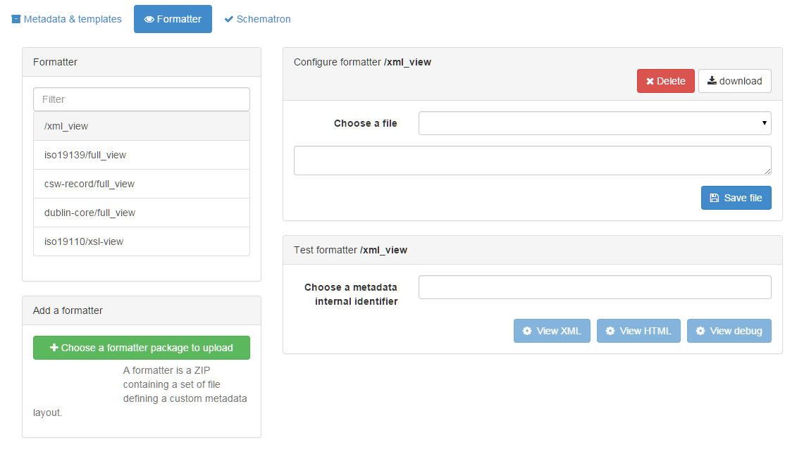

# Customizing metadata views {#creating-custom-view}

GeoNetwork facilitates developers to easily change or add a metadata view. A User can change the view to his/her needs.

By default the initial view is an AngularJS view on the results returned from the search service. Therefore the view can only contain the fields from the Lucene Index. If you require more fields, you can either add fields to the index or don't use the AngularJS view. This view is defined in `web-ui/src/main/resources/catalog/views/default/templates/recordView.html`.

Metadata views are called 'formatters'. They are located in the schema-plugin related to the metadata that you are formatting. Formatters use either XSLT or Groovy to transform the XML to the required format (html, xml, pdf, json).

A formatter can be updated from the web interface in the `admin console`, `metadata and templates`, tab 'formatters'. On this page you can upload, change and preview formatters.

After having created a new formatter you will have to update your application code, so the new formatter-output can be visualised from your application. If the goal of the formatter is to introduce a new html view on metadata, then you can add a reference to it in `web-ui/src/main/resources/catalog/views/default/config.js` (searchSettings.formatter.list).
