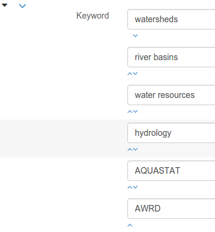

# Customizing editor {#creating-custom-editor}

!!! warning

    This file is produced automatically from the geonetwork-core repository. To make any suggestions to the content of the page please add your changes to [core-geonetwork/schemas/config.editor.xsd](https://github.com/geonetwork/core-geonetwork/blob/main/schemas/config-editor.xsd).


## Creating custom editor

A metadata editor configuration is defined for a specific schema plugin standard (see [Implementing schema plugins](../implementing-a-schema-plugin.md)).

The editor configuration defines the navigation menu for the editor (i.e. list of views and tabs), the list of fields and the type of control to use. Controls can be HTML-type (e.g. text, date) or more advanced controls built using [AngularJS directives](https://docs.angularjs.org/guide/directive).

To build such an editor configuration, the user needs to know the XSD of the standard to properly build views, tabs and fields according to the element names (see `schemas/config-editor.xsd`). Create an editor root element and attach:

-   the schema and
-   namespaces for the standards

``` xml
<editor xmlns:xsi="http://www.w3.org/2001/XMLSchema-instance"
  xmlns:gn="http://www.fao.org/geonetwork"
  xmlns:gco="http://www.isotc211.org/2005/gco"
  xmlns:gmd="http://www.isotc211.org/2005/gmd"
  xmlns:gmx="http://www.isotc211.org/2005/gmx"
  xmlns:srv="http://www.isotc211.org/2005/srv"
  xmlns:gml="http://www.opengis.net/gml"
  xmlns:xlink="http://www.w3.org/1999/xlink"
  xsi:noNamespaceSchemaLocation="../../../../../../config-editor.xsd">
```

An editor configuration should first define some general element descriptions and then a set of views with at least one defined view.

Child elements:

-   **fields**, Optional element (see [Defining field type](creating-custom-editor.md#creating-custom-editor-fields))
-   **fieldsWithFieldset**, Optional element (see [Grouping element from the standards](creating-custom-editor.md#creating-custom-editor-fieldsWithFieldset))
-   **multilingualFields**, Optional element (see [Defining multilingual fields](creating-custom-editor.md#creating-custom-editor-multilingualFields))
-   **views**, Mandatory element (see [Configuring views](creating-custom-editor.md#creating-custom-editor-views))

## Defining field type {#creating-custom-editor-fields}

Define the form fields type configuration. The default is simple text input. This list contains a list of fields which do not use a simple text input. The list of possible values are:

-   all HTML5 input type or
-   an AngularJS directive name. MUST start with `data-` and could end with `-textarea` to create a textarea element or with `-div` if the directive does not apply to the input or textarea but to the div element containing it.

An element can only have one type defined.

``` xml
<editor>
 <fields>
   <for name="gmd:abstract" use="textarea"/>
   <for name="gco:Real" use="number"/>
   <for name="gco:Boolean" use="checkbox"/>
   <for name="gco:Date" use="data-gn-date-picker"/>
```

The other option to define a more advanced field type is to catch the element using and XSL template. This approach is used for keywords in ISO19139 (see for example `schemas/iso19139/src/main/plugin/iso19139/layout/layout-custom-fields-keywords.xsl`).

## Grouping element from the standards {#creating-custom-editor-fieldsWithFieldset}

List of elements to be displayed in a fieldset (i.e. boxed element). Those elements usually contain children elements and define major sections in the standard. For example, in ISO19139, `identification` and `distribution` are major sections and should usually be displayed as a group of `information`.

``` xml
<editor>
   <fields>...</fields>
   <fieldsWithFieldset>
    <name>gmd:identificationInfo</name>
    <name>gmd:distributionInfo</name>
```

## Defining multilingual fields {#creating-custom-editor-multilingualFields}

Configure here the list of multilingual fields for a standard.

By default, if the standard has multilingual support like ISO19139, all fields will be displayed as multilingual fields. Define in the exclude section the exceptions (e.g. ``gmd:identifier`` in ISO19139).

Then this section also allows to define how multilingual fields are displayed using the expanded elements. If expanded, then one field per language is displayed with no need to click on the language switcher.


``` xml
<editor>
   <fields>...</fields>
   <fieldsWithFieldset>...</fieldsWithFieldset>
    <multilingualFields>
      <expanded>
        <name>gmd:title</name>
        <name>gmd:abstract</name>
      </expanded>
      <exclude>
        <name>gmd:identifier</name>
        <name>gmd:metadataStandardName</name>
```

## Configuring views {#creating-custom-editor-views}

At least one view MUST be defined, but more view modes can be defined depending on the needs.

By default ISO19139 defines 3 views (i.e. default, advanced, xml) and has one disabled view (i.e. INSPIRE). See `schemas/iso19139/src/main/plugin/iso19139/layout/config-editor.xml` for the configuration.


Another basic example is the Dublin Core view (see `schemas/dublin-core/src/main/plugin/dublin-core/layout/config-editor.xml`).

To create a new view, use the following:

``` xml
<views>
    <view name="viewNameInLocalizationFile">
      ...
    </view>
```

Child elements:

-   **view**, One or more (see [Defining a view](creating-custom-editor.md#creating-custom-editor-view))

## Defining a view {#creating-custom-editor-view}

A view has a label and defines a specific rendering of the metadata records. A view is composed of one or more tabs.

``` xml
<views>
  <view name="custom-view">
      ....
  </view>
```

The view could be displayed or not according to the metadata record content or the current user session using the `displayIfRecord` and `displayIfServiceInfo` attributes.

Attributes:

-   **name** (Mandatory)

The key of the view name stored in `{schema}/loc/{lang}/strings.xml` or the element name with namespace prefix.

``` xml
<strings>
  <default>Simple</default>
  <inspire>INSPIRE</inspire>
  <custom-view>My view</custom-view>
```

-   **disabled** (Optional) Fixed value: **true**

Hide the view from the menu if the attribute is defined. Allows to easily disable a view.

-   **class** (Optional)

Define custom CSS class to be set on the form element. This is mainly used to set the type of indent:

-   gn-label-above-input: to put label above form input
-   gn-indent-colored: colored left border on each fieldset
-   gn-indent-bluescale: blue scale colored left border on each fieldset

See ``catalog/views/default/less/gn_editor_default.less`` to add your custom editor styles.

-   **upAndDownControlHidden** (Optional) Fixed value: **true**

Define if up and down control should be displayed in that view. If not defined, controls are displayed. Hide those controls in a view to make it easier with less controls for the end-user.



-   **displayAttributes** (Optional) Fixed value: **true**

Display attributes by default when loading the view.

-   **displayTooltips** (Optional) Fixed value: **true**

Display help documentation for all elements by default when loading the view.

-   **displayTooltipsMode** (Optional)

Display help documentation onhover elements (default) or by clicking on an icon.

-   **hideTimeInCalendar** (Optional) Fixed value: **true**

Define if calendar control should allow users to set date only or datetime. If the attribute is not set, then date and datetime can be set. This is controlled at the view level, switching to another view may allow more control over the dates.

-   **displayIfRecord** (Optional)

XPath expression returning boolean value which will be evaluated against the metadata record. if true the view will be displayed. eg. Display custom-view if metadata standard name contains Medsea:

``` xml
<view name="custom-view"
      displayIfRecord="contains(gmd:MD_Metadata/
                                  gmd:metadataStandardName/gco:CharacterString,
                                'MedSea')"
```

-   **displayIfServiceInfo** (Optional)

XPath expression returning boolean value which will be evaluate against the service information tree (Jeeves /root/gui element). if true the view will be displayed.

eg. Display custom view if user is Administrator:

``` xml
<view name="custom-view"
      displayIfServiceInfo="count(session[profile = 'Administrator']) = 1"
```

displayIfRecord and displayIfServiceInfo could be combined. An AND operator is used. Both condition MUST returned true for the view to be displayed.

Child elements:

-   **tab**, One or more (see [Defining a tab](creating-custom-editor.md#creating-custom-editor-tab))
-   **sidePanel**, (See [Configuring the side panel](creating-custom-editor.md#creating-custom-editor-sidePanel))
-   **flatModeExceptions**, Optional element (see [Configuring complex element display](creating-custom-editor.md#creating-custom-editor-flatModeExceptions))
-   **thesaurusList**, Optional element (see [Customizing thesaurus](creating-custom-editor.md#creating-custom-editor-thesaurusList))

## Defining a tab {#creating-custom-editor-tab}

A view contains at least one tab. In that case it will be the default tab to display and no top toolbar will be displayed to switch from one tab to another.


Add custom view with one default tab and a field for the title:

``` xml
<views>
  <view name="custom-view">
    <tab id="custom-tab" default="true">
      <section>
        <field xpath="/gmd:MD_Metadata/gmd:identificationInfo/*/gmd:citation/*/gmd:title"/>
      </section>
    </tab>
  </view>
```

Attributes:

-   **id** (Mandatory)

The tab key used in URL parameter to activate that tab. The key is also use for the tab label as defined in `{schema}/loc/{lang}/strings.xml`.

-   **default** (Optional) Fixed value: **true**

Define if this tab is the default one for the view. Only one tab should be the default in a view.

-   **hideIfNotDisplayed** (Optional) Fixed value: **true**

Define if the tab should be hidden (and not disabled only) if not displayed based on display rules.

-   **toggle** (Optional) Fixed value: **true**

Define if the tab should be displayed as a dropdown menu instead of a tab. This is used for advanced section, which is not used often by the end-user. More than one tab could be grouped in that dropdown tab menu.

-   **formatter-order** (Optional)

Define the ordering index of this tab in the XSLT formatter (Note used for editor).

-   **mode** (Optional) Fixed value: **flat**

The "flat" mode is an important concept to understand for the editor. It controls the way:

-   complex elements are displayed (i.e. elements having children) and
-   non-existing elements are displayed (i.e. elements in the standard, not in the current document).

When a tab is in flat mode, this tab will not display elements which are not in the current metadata document and it will display complex elements as a group only if defined in the list of elements with fieldset (see [Grouping element from the standards](creating-custom-editor.md#creating-custom-editor-fieldsWithFieldset)).

Example for a contact in ""non-flat" mode:


Example for a contact in "flat" mode:


This mode makes the layout simpler, but does not provide all controls to remove some of the usually boxed elements. End-users can still change to the advanced view mode to access those hidden elements in flat mode.

It's recommended to preserve at least one view in ""non-flat" mode for Reviewers or Administrators in order to be able:

-   to build proper templates based on the standards
-   to fix any type of errors.
-   **mode** (Mandatory)
-   **displayIfRecord** (Optional)

XPath expression returning boolean value which will be evaluated against the metadata record. if true the view will be displayed. eg. Display custom-view if metadata standard name contains Medsea:

``` xml
<view name="custom-view"
      displayIfRecord="contains(gmd:MD_Metadata/
                                  gmd:metadataStandardName/gco:CharacterString,
                                'MedSea')"
```

-   **displayIfServiceInfo** (Optional)

XPath expression returning boolean value which will be evaluate against the service information tree (Jeeves /root/gui element). if true the view will be displayed.

eg. Display custom view if user is Administrator:

``` xml
<view name="custom-view"
      displayIfServiceInfo="count(session[profile = 'Administrator']) = 1"
```

displayIfRecord and displayIfServiceInfo could be combined. An AND operator is used. Both condition MUST returned true for the view to be displayed.

### Configuring complex element display {#creating-custom-editor-flatModeExceptions}

Elements to apply "flat" mode exceptions. By default, "flat" mode does not display elements containing only children and no values.

Use `or` and `in` attributes to display non-existing elements. To display the ``gmd:descriptiveKeywords`` element even if it does not exist in the metadata record, or if the field should be displayed to enable the user to add new occurrences:

``` xml
<field
      xpath="/gmd:MD_Metadata/gmd:identificationInfo/*/gmd:descriptiveKeywords/*/gmd:keyword"
      or="keyword"
      in="/gmd:MD_Metadata/gmd:identificationInfo/*/gmd:descriptiveKeywords/*"/>
</tab>

<!-* Elements that should not use the "flat" mode -->
<flatModeExceptions>
<for name="gmd:descriptiveKeywords" />
</flatModeExceptions>
</view>
```

### Customizing thesaurus {#creating-custom-editor-thesaurusList}

To configure the type of transformations, or the number of keywords allowed, or if the widget has to be displayed in a fieldset, or as simple field for a thesaurus define a specific configuration:

e.g. only 2 INSPIRE themes:

``` xml
<thesaurusList>
  <thesaurus key="external.theme.httpinspireeceuropaeutheme-theme"
             maxtags="2"
             fieldset="false"
             transformations=""/>
</thesaurusList>
```

## Configuring the side panel {#creating-custom-editor-sidePanel}

The side panel is configured by adding `<text>` elements or `<directive>` elements to the `<sidePanel>` element within a `<view>`.

A good default config with all directives is:
```XML
<sidePanel>
  <directive gn-geo-publisher=""
             data-ng-if="gnCurrentEdit.geoPublisherConfig"
             data-config="{{gnCurrentEdit.geoPublisherConfig}}"
             data-lang="lang"/>
  <directive data-gn-validation-report=""/>
  <directive data-gn-index-report=""/>
  <directive data-gn-suggestion-list=""/>
  <directive data-gn-need-help="creating-metadata"/>
  <directive data-gn-onlinesrc-list="" types="thumbnail|onlinesrc|parent|dataset|service|source|sibling|associated|fcats"/>
</sidePanel>
```

To include a text block use the following:

```XML
    <text ref="defaultviewdesc"></text>
```
There are several directives that can be added to the side panel:

### Validation Report

#### Directive: `gnValidationReport`

#### Attributes:
-   **initial-show-errors** (Optional) Fixed value: **true**
  Show errors by default when the validation report is loaded.
-  **initial-show-successes** (Optional) Fixed value: **true**
  Show successes by default when the validation report is loaded.
-  **initial-section-states** (Optional)
  Initial state of the sections in the validation report. Possible values are `closed` or `open`. Default is `closed`.

#### Sample:
```XML
<directive data-gn-validation-report="" data-initial-show-errors="true" data-initial-show-successes="true" data-initial-section-states="closed"/>
```

### Index Report

#### Directive: `gnIndexReport`

#### Attributes:
-   **initial-section-states** (Optional)
  Initial state of the sections in the index report. Possible values are `closed` or `open`. Default is `closed`.

#### Sample:
```XML
  <directive data-gn-index-report="" data-initial-section-states="closed"/>
```

### Online Resource List

#### Directive: `gnOnlinesrcList`

#### Attributes:
-   **types** (Optional)
  A pipe-separated list of types to display in the online source list. Possible values are `thumbnail`, `onlinesrc`, `parent`, `dataset`, `service`, `source`, `sibling`, `associated`, and `fcats`. Default is all types.

#### Sample:
```XML
<directive data-gn-onlinesrc-list="" data-types="thumbnail|onlinesrc|parent|dataset|source|sibling|associated"/>
```

## Adding a section to a tab {#creating-custom-editor-section}

A section is a group of fields. If a `name` attribute is provided, then it will create an HTML fieldset which is collapsible. If no `name` attribute is provided, then it will just render the inner elements. For example, if you need a tab without a root fieldset, just create the mandatory section with no name and then the inner elements.

Attributes:

-   **name** (Optional)

An optional name to override the default one base on field name for the

:   section. The name must be defined in `{schema}/loc/{lang}/strings.xml`.

-   **xpath** (Optional)

The XPath of the element to match. If an XPath is set for a section, it

:   should not contain any fields.

-   **collapsed** (Optional) Fixed value: **true**

An optional attribute to collapse the section. If not set the section is expanded.

-   **collapsible** (Optional) Fixed value: **false**

An optional attribute to not allow collapse for the section. If not set the section is expandable.

-   **mode** (Optional) Fixed value: **flat**

The "flat" mode is an important concept to understand for the editor. It controls the way:

-   complex elements are displayed (i.e. elements having children) and
-   non-existing elements are displayed (i.e. elements in the standard, not in the current document).

When a tab is in flat mode, this tab will not display elements which are not in the current metadata document and it will display complex elements as a group only if defined in the list of elements with fieldset (see [Grouping element from the standards](creating-custom-editor.md#creating-custom-editor-fieldsWithFieldset)).

Example for a contact in ""non-flat" mode:


Example for a contact in "flat" mode:


This mode makes the layout simpler, but does not provide all controls to remove some of the usually boxed elements. End-users can still change to the advanced view mode to access those hidden elements in flat mode.

It's recommended to preserve at least one view in ""non-flat" mode for Reviewers or Administrators in order to be able:

-   to build proper templates based on the standards
-   to fix any type of errors.
-   **mode** (Mandatory)
-   **or** (Optional)

Local name to match if the element does not exist.

-   **or** (Optional)

The local name of the geonet child (i.e. non-existing element) to match.

``` xml
<field xpath="/gmd:MD_Metadata/gmd:language"
        or="language"
        in="/gmd:MD_Metadata"/>
```

-   **or** (Optional)
-   **in** (Optional)

XPath of the geonet:child element with the or name to look for. Usually

:   points to the parent of last element of the XPath attribute.

-   **in** (Optional)

The element to search in for the geonet child.

-   **displayIfRecord** (Optional)

XPath expression returning boolean value which will be evaluated against the metadata record. if true the view will be displayed. eg. Display custom-view if metadata standard name contains Medsea:

``` xml
<view name="custom-view"
      displayIfRecord="contains(gmd:MD_Metadata/
                                  gmd:metadataStandardName/gco:CharacterString,
                                'MedSea')"
```

-   **displayIfServiceInfo** (Optional)

XPath expression returning boolean value which will be evaluate against the service information tree (Jeeves /root/gui element). if true the view will be displayed.

eg. Display custom view if user is Administrator:

``` xml
<view name="custom-view"
      displayIfServiceInfo="count(session[profile = 'Administrator']) = 1"
```

displayIfRecord and displayIfServiceInfo could be combined. An AND operator is used. Both condition MUST returned true for the view to be displayed.

## Adding a field {#creating-custom-editor-field}

To display a simple element use the `xpath` attribute to point to the element to display:

``` xml
<field xpath="/gmd:MD_Metadata/gmd:identificationInfo/*/gmd:citation/*/gmd:title"/>
```

To override a field label use the `name` attribute and define that new label in `{schema}/loc/{lang}/strings.xml`:

``` xml
<field name="myTitle"
       xpath="/gmd:MD_Metadata/gmd:identificationInfo/*/gmd:citation/*/gmd:title"/>
```

To display a complex element which exists in the metadata document:

``` xml
<field name="pointOfContact"
       xpath="/gmd:MD_Metadata/gmd:identificationInfo/*/gmd:pointOfContact"/>
```

In this case all children elements are also displayed.

To display a field if it exists in the metadata document or to provide an `add` button in case it does not exist (specify `in` and `or` attributes):

``` xml
<field name="pointOfContact"
       xpath="/gmd:MD_Metadata/gmd:identificationInfo/*/gmd:pointOfContact"
       or="pointOfContact"
       in="/gmd:MD_Metadata/gmd:identificationInfo/*"
       del="."/>
```

Activate the "flat" mode at the tab level to make the form display only existing elements:

``` xml
<view name="custom-view">
    <tab id="custom-tab" default="true" mode="flat">
      <section>
        <field
                xpath="/gmd:MD_Metadata/gmd:identificationInfo/*/gmd:citation/*/gmd:title"/>
        <field name="pointOfContact"
               xpath="/gmd:MD_Metadata/gmd:identificationInfo/*/gmd:pointOfContact"
               or="pointOfContact"
               in="/gmd:MD_Metadata/gmd:identificationInfo/*"
               del="."/>
      </section>
    </tab>
  </view>
```

Attributes:

-   **xpath** (Mandatory)

The xpath of the element to match.

-   **if** (Optional)

An optional XPath expression to evaluate to define if the element should be displayed only in some situation (e.g. only for service metadata records). e.g.

``` xml
<field
  xpath="/gmd:MD_Metadata/gmd:identificationInfo/srv:SV_ServiceIdentification/
  gmd:resourceConstraints/gmd:MD_LegalConstraints/gmd:otherConstraints"
  if="count(gmd:MD_Metadata/gmd:identificationInfo/srv:SV_ServiceIdentification) > 0"/>
```

-   **name** (Optional)

A field name to override the default name.

-   **isMissingLabel** (Optional)

The label to display if the element does not exist in the metadata record. It indicates that the element is missing in the current record. It could be used for a conformity section saying that the element is "not evaluated". **EXPERIMENTAL**

-   **or** (Optional)

The local name of the geonet child (i.e. non-existing element) to match.

``` xml
<field xpath="/gmd:MD_Metadata/gmd:language"
        or="language"
        in="/gmd:MD_Metadata"/>
```

-   **in** (Optional)

The element to search in for the geonet child.

-   **del** (Optional)

Relative XPath of the element to remove when the `remove` button is clicked.

e.g. If a template field match linkage and allows editing of field URL, the remove control should remove the parent element gmd:onLine.

``` xml
<field name="url"
  xpath="/gmd:MD_Metadata/gmd:distributionInfo/gmd:MD_Distribution/gmd:transferOptions
            /gmd:MD_DigitalTransferOptions/gmd:onLine/gmd:CI_OnlineResource/gmd:linkage"
  del="../..">
  <template>
```

`del` attribute can be used in template mode or not. Example to remove `spatialResolution` while only editing `denominator` or `distance`. `denominator` or `distance` are mandatory, but as the `del` element points to the `spatialResolution` ancestor, there is no mandatory flag displayed and the remove control removes the `spatialResolution` element.

``` xml
<field xpath="/gmd:MD_Metadata/gmd:identificationInfo/
                */gmd:spatialResolution/*/gmd:distance"
        del="../.."/>
<field xpath="/gmd:MD_Metadata/gmd:identificationInfo/
                */gmd:spatialResolution/
                  */gmd:equivalentScale/*/gmd:denominator"
        del="../../../.."/>
```

-   **templateModeOnly** (Optional) Fixed value: **true**

Define if the template mode should be the only mode used. In that case, the field is always displayed based on the XML template snippet field configuration. Default is false.

-   **notDisplayedIfMissing** (Optional) Fixed value: **true**

If the field is found and a geonet child also, the geonet child to add a

:   new one is not displayed.

-   **displayIfServiceInfo** (Optional)

XPath expression returning boolean value which will be evaluate against the service information tree (Jeeves /root/gui element). if true the view will be displayed.

eg. Display custom view if user is Administrator:

``` xml
<view name="custom-view"
      displayIfServiceInfo="count(session[profile = 'Administrator']) = 1"
```

displayIfRecord and displayIfServiceInfo could be combined. An AND operator is used. Both condition MUST returned true for the view to be displayed.

-   **use** (Optional)
-   **use** (Optional)

The form field type to use (one of the HTML5 type) or an AngularJS directive to use. This list is defined as an open enumeration. For directive, the value will be set in a simple text input by default. If the directive needs to deal with cariage return character, the directive name MUST contains "-textarea" in order to set the value in a textarea instead of the text input.

-   **use** (Optional)

Field type. Register here any Angular directive to be used on the client side. Default is simple text field.

Child elements:

-   **template**, Optional element (see [Adding a template based field](creating-custom-editor.md#creating-custom-editor-template))

## Adding a template based field {#creating-custom-editor-template}

A template configuration for an XML snippet to edit.

A template field is composed of an XML snippet corresponding to the element to edit where values to be edited are identified using {{fields}} notation. Each fields needs to be defined as values from which one input field will be created.

This mode is used to hide the complexity of the XML element to edit. eg.

``` xml
<field name="url"
       templateModeOnly="true"
       xpath="/gmd:MD_Metadata/gmd:distributionInfo/g.../gmd:linkage">
   <template>
     <values>
       <key label="url"
            xpath="gmd:URL"
            tooltip="gmd:linkage"/>
     </values>
     <snippet>t
       <gmd:linkage>
         <gmd:URL>{{url}}</gmd:URL>
       </gmd:linkage>
     </snippet>
   </template>
```

The template field mode will only provide editing of part of the snippet element. In some case the snippet may contains more elements than the one edited. In such case, the snippet MUST identified the list of potential elements in order to not to loose information when using this mode. Use the gn:copy element to properly combined the template with the current document.

eg. The gmd:MD_Identifier may contain a gmd:authority node which needs to be preserved.

``` xml
<snippet>
  <gmd:identifier>
    <gmd:MD_Identifier>
      <gn:copy select="gmd:authority"/>
      <gmd:code>
        <gco:CharacterString>{{code}}</gco:CharacterString>
      </gmd:code>
    </gmd:MD_Identifier>
  </gmd:identifier>
</snippet>
```

Warning: Template based field does not support multilingual editing for ISO standards (ie. only the main language is edited - therefore, multilingual elements will be preserved).

## Adding documentation or help {#creating-custom-editor-text}

Insert an HTML fragment in the editor.

``` xml
<field name="edmerpName"
       xpath="/gmd:MD_Metadata/gmd:identificationInfo/*/
                gmd:pointOfContact[*/gmd:role/*/@codeListValue='edmerp']"
       del=".">

<text ref="edmerp-help"/>
```

The fragment is defined in localization file strings.xml:

``` xml
<edmerp-help>
  <div class="row">
    <div class="col-xs-offset-2 col-xs-8">
      <p class="help-block">The European Directory for Marine Environment
          Research Project (EDMERP) contains descriptions of many projects.
          This catalogue is maintained ...</p>
      </div>
  </div>
</edmerp-help>
```

Attributes:

-   **ref** (Optional)

The tag name of the element to insert in the localization file.

-   **if** (Optional)

An XPath expression to evaluate. If true, the text is displayed.

-   **displayIfServiceInfo** (Optional)

XPath expression returning boolean value which will be evaluate against the service information tree (Jeeves /root/gui element). if true the view will be displayed.

eg. Display custom view if user is Administrator:

``` xml
<view name="custom-view"
      displayIfServiceInfo="count(session[profile = 'Administrator']) = 1"
```

displayIfRecord and displayIfServiceInfo could be combined. An AND operator is used. Both condition MUST returned true for the view to be displayed.

## Adding a button {#creating-custom-editor-action}

A button which trigger an action (usually a process or a add button).

Example of a button adding an extent:

``` xml
<action type="add"
        name="extent"
        or="extent"
        in="/gmd:MD_Metadata/gmd:identificationInfo/gmd:MD_DataIdentification">
    <template>
      <snippet>
        <gmd:extent>
          <gmd:EX_Extent>
            <gmd:geographicElement>
              <gmd:EX_GeographicBoundingBox>
                <gmd:westBoundLongitude>
                  <gco:Decimal/>
                </gmd:westBoundLongitude>
                <gmd:eastBoundLongitude>
                  <gco:Decimal/>
                </gmd:eastBoundLongitude>
                <gmd:southBoundLatitude>
                  <gco:Decimal/>
                </gmd:southBoundLatitude>
                <gmd:northBoundLatitude>
                  <gco:Decimal/>
                </gmd:northBoundLatitude>
              </gmd:EX_GeographicBoundingBox>
            </gmd:geographicElement>
          </gmd:EX_Extent>
        </gmd:extent>
      </snippet>
    </template>
  </action>
```

Example of a button displayed only if there is no resource identifier ending with the metadata record identifier (ie. `if` attribute) and running the process with `add-resource-id` identifier:

``` xml
<action type="process"
        process="add-resource-id"
        if="count(gmd:MD_Metadata/gmd:identificationInfo/*/
                      gmd:citation/*/gmd:identifier[
                        ends-with(gmd:MD_Identifier/gmd:code/gco:CharacterString,
                                  //gmd:MD_Metadata/gmd:fileIdentifier/gco:CharacterString)]) = 0"/>
```

Example of a button based on custom directive with some directive attributes set by XPath:

``` xml
<action type="add"
        btnLabel="checkpoint-tdp-add-component"
        name="dataQualityInfo" or="dataQualityInfo"
        in="/mdb:MD_Metadata"
        addDirective="data-gn-record-fragment-selector">
  <directiveAttributes data-source-records="xpath::string-join(
    //mri:associatedResource/*[mri:initiativeType/*/@codeListValue = 'specification']
      /mri:metadataReference/@uuidref, ',')"/>
</action>
```

Example of a drowdown button with 3 coordinates system to choose from:

``` xml
<!-- Display CRS description only,
        customize label
        and drop the refSysInfo element if removed -->
 <field xpath="/mdb:MD_Metadata/mdb:referenceSystemInfo/*/
                  mrs:referenceSystemIdentifier/*/mcc:description"
        name="referenceSystemInfo"
        del="../../../.."/>

 <!-- Add one of the 3 CRS proposed using the dropdown -->
 <action type="add"
         btnLabel="addCrs"
         name="referenceSystemInfo" or="referenceSystemInfo"
         in="/mdb:MD_Metadata">
   <template>
     <snippet label="addCrs4326">
       <mdb:referenceSystemInfo>
         <mrs:MD_ReferenceSystem>
           <mrs:referenceSystemIdentifier>
             <mcc:MD_Identifier>
               <mcc:code>
                 <gco:CharacterString>http://www.opengis.net/def/crs/EPSG/0/4326</gco:CharacterString>
               </mcc:code>
               <mcc:description>
                 <gco:CharacterString>WGS 84 (EPSG:4326)</gco:CharacterString>
               </mcc:description>
             </mcc:MD_Identifier>
           </mrs:referenceSystemIdentifier>
         </mrs:MD_ReferenceSystem>
       </mdb:referenceSystemInfo>
     </snippet>
     <snippet label="addCrs4258">
       <mdb:referenceSystemInfo>
         <mrs:MD_ReferenceSystem>
           <mrs:referenceSystemIdentifier>
             <mcc:MD_Identifier>
               <mcc:code>
                 <gco:CharacterString>http://www.opengis.net/def/crs/EPSG/0/4258</gco:CharacterString>
               </mcc:code>
               <mcc:description>
                 <gco:CharacterString>ETRS89 (EPSG:4258)</gco:CharacterString>
               </mcc:description>
             </mcc:MD_Identifier>
           </mrs:referenceSystemIdentifier>
         </mrs:MD_ReferenceSystem>
       </mdb:referenceSystemInfo>
     </snippet>
     <snippet label="addCrs3035">
       <mdb:referenceSystemInfo>
         <mrs:MD_ReferenceSystem>
           <mrs:referenceSystemIdentifier>
             <mcc:MD_Identifier>
               <mcc:code>
                 <gco:CharacterString>http://www.opengis.net/def/crs/EPSG/0/3035</gco:CharacterString>
               </mcc:code>
               <mcc:description>
                 <gco:CharacterString>ETRS89 / LAEA Europe (EPSG:3035)</gco:CharacterString>
               </mcc:description>
             </mcc:MD_Identifier>
           </mrs:referenceSystemIdentifier>
         </mrs:MD_ReferenceSystem>
       </mdb:referenceSystemInfo>
     </snippet>
   </template>
 </action>
```

Example of a button to display a suggestion form:

``` xml
<action type="suggest"
        process="add-columns-from-csv"/>
```

Attributes:

-   **name** (Optional)

TODO

-   **type** (Optional)

The type of control

-   **process** (Optional)

The process identifier (eg. add-resource-id) or the associated resource

:   type to open (eg. onlinesrc, fcats, parent, source, sibling, service, dataset, thumbnail) See onlinesrc directive.

-   **forceLabel** (Optional)

Force the label to be displayed for this action even if the action is not the first element of its kind. Label with always be displayed.

-   **if** (Optional)

An XPath expression to evaluate. If true, the control is displayed. eg.

``` xml
count(gmd:MD_Metadata/gmd:identificationInfo/*/gmd:citation/gmd:CI_Citation/
gmd:identifier[ends-with(gmd:MD_Identifier/gmd:code/gco:CharacterString,
//gmd:MD_Metadata/gmd:fileIdentifier/gco:CharacterString)]) = 0
```

will only displayed the action control if the resource identifier does not end with the metadata identifier.

-   **class** (Optional)

Optional CSS class to add to the parent div element. eg. gn-required to show a *****.

-   **btnLabel** (Optional)

Optional label to be addded to the button.

-   **btnClass** (Optional)

Optional CSS class to be added to the button.

-   **or** (Optional)

Local name to match if the element does not exist.

-   **or** (Optional)

The local name of the geonet child (i.e. non-existing element) to match.

``` xml
<field xpath="/gmd:MD_Metadata/gmd:language"
        or="language"
        in="/gmd:MD_Metadata"/>
```

-   **or** (Optional)
-   **in** (Optional)

XPath of the geonet:child element with the or name to look for. Usually

:   points to the parent of last element of the XPath attribute.

-   **in** (Optional)

The element to search in for the geonet child.

-   **addDirective** (Optional)

The directive to use for the add control for this field.

-   **displayIfServiceInfo** (Optional)

XPath expression returning boolean value which will be evaluate against the service information tree (Jeeves /root/gui element). if true the view will be displayed.

eg. Display custom view if user is Administrator:

``` xml
<view name="custom-view"
      displayIfServiceInfo="count(session[profile = 'Administrator']) = 1"
```

displayIfRecord and displayIfServiceInfo could be combined. An AND operator is used. Both condition MUST returned true for the view to be displayed.

Child elements:

-   **template**, Optional element (see [Adding a template based field](creating-custom-editor.md#creating-custom-editor-template))
