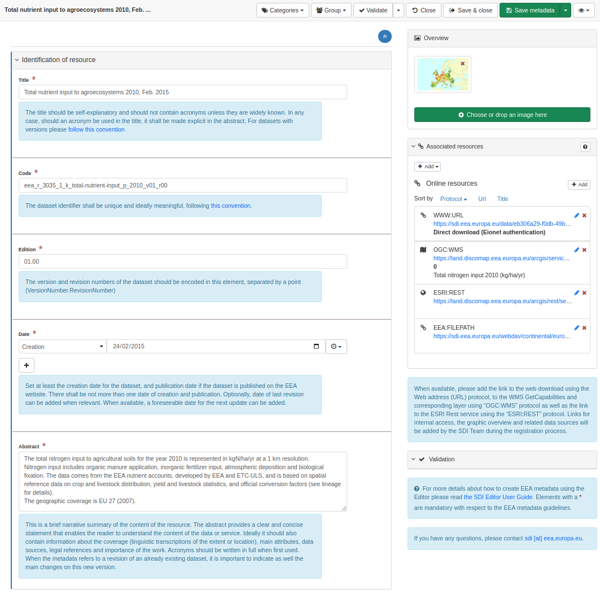
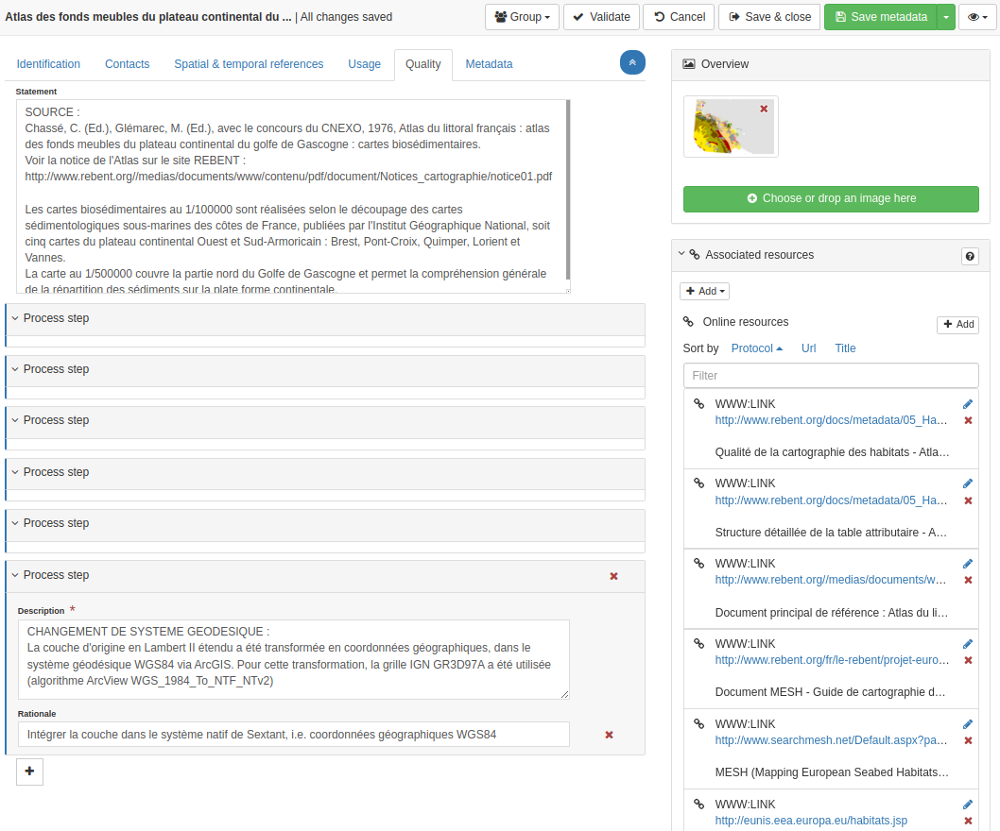
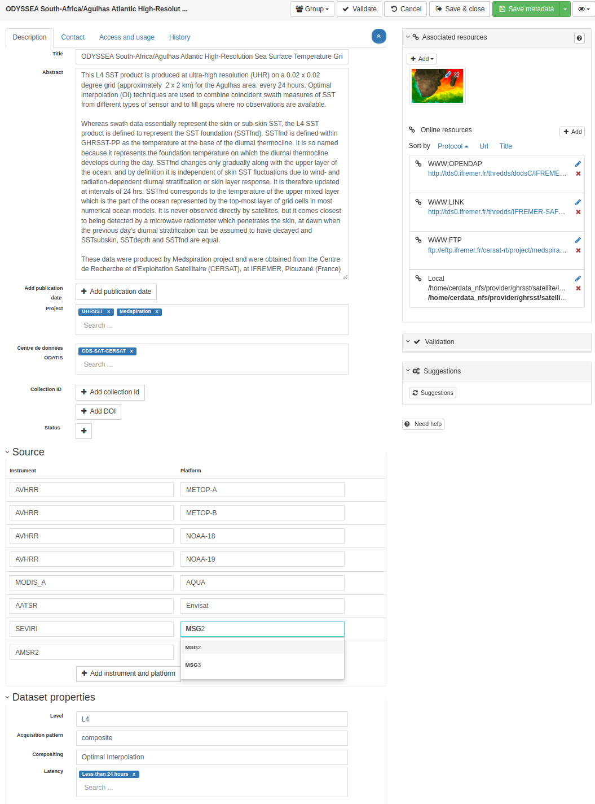
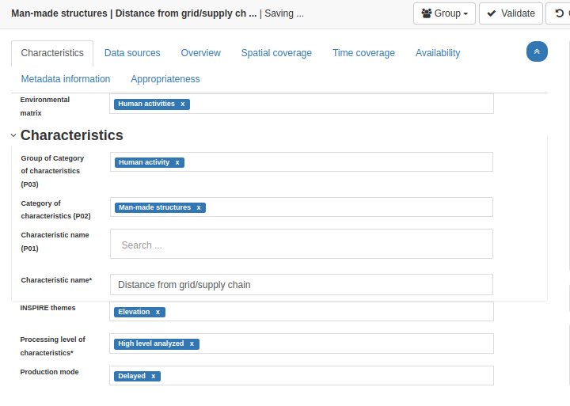
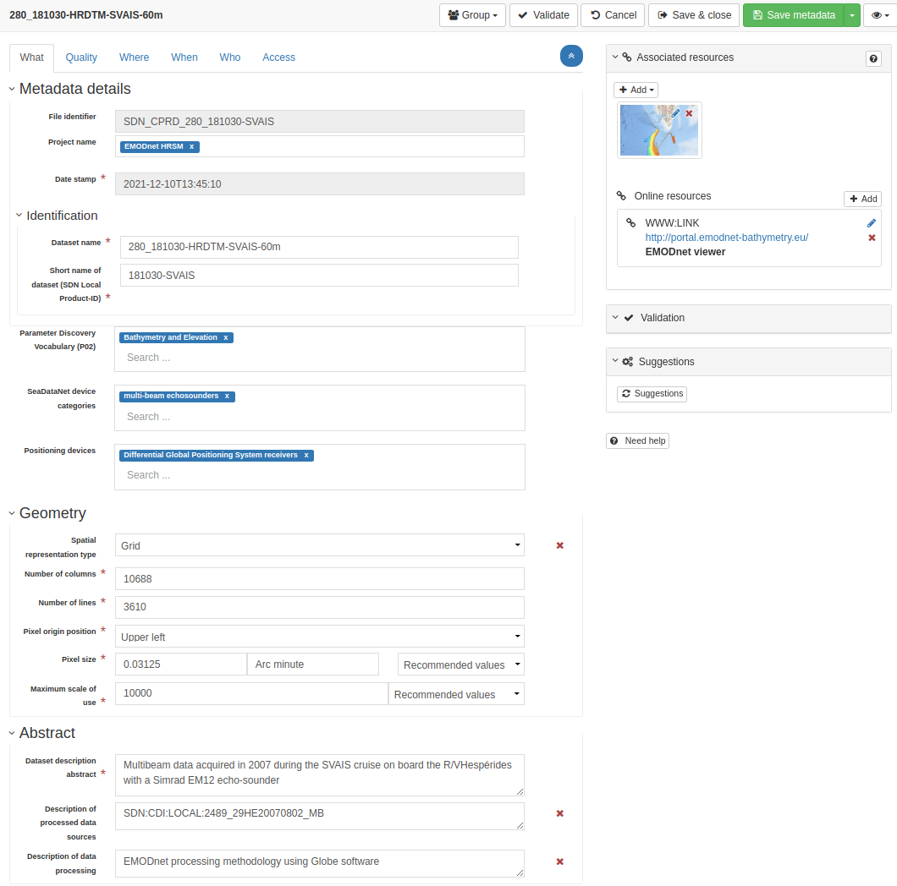
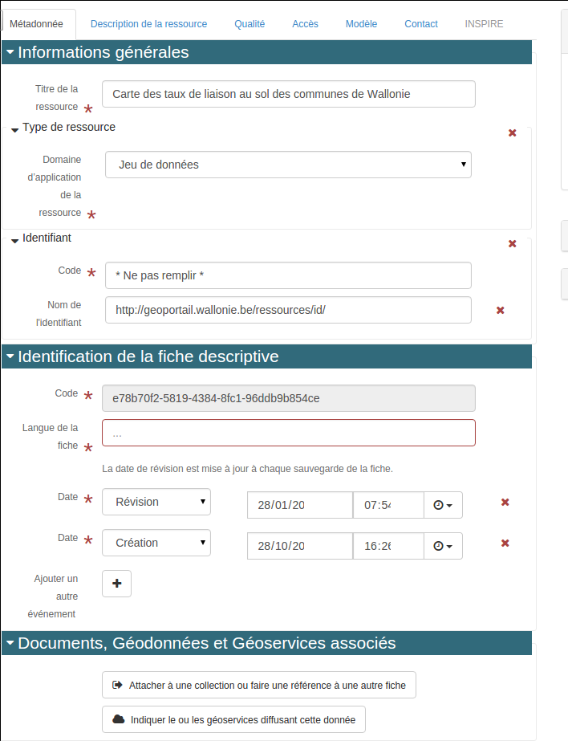
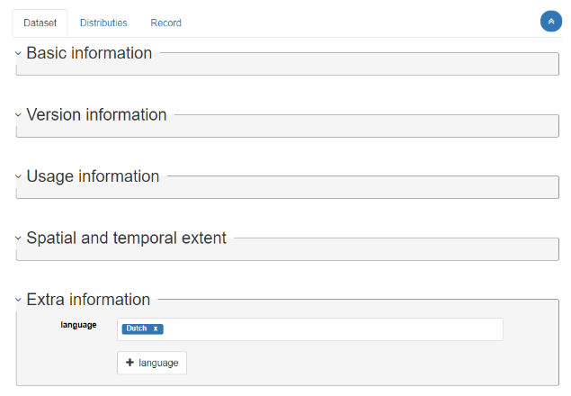
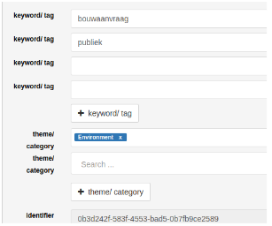

# Custom editor examples

## EEA spatial datasets editor

EEA spatial dataset editor is based on EEA metadata profile based on INSPIRE requirements with additional details about EEA encoding rules (eg. title, resource identifier convention).

It illustrates:

-   Simple form with 2 levels only
-   Place label above input
-   Each fields have a clear description with links to EEA metadata profile documentation
-   Right panel link to helpdesk team

[See configuration file](https://github.com/eea/geonetwork-eea/blob/eea-4.1.0/schemas/iso19139/src/main/plugin/iso19139/layout/config-editor.xml#L512).

## Ifremer editors

Sextant catalog contains a large variety of spatial information described in french and/or english. Those datasets collected/created in various projects which have different needs adapt encoding forms to match projects requirements:

### Sextant default editor

It illustrates:

-   Custom button triggering process

And then specific editors are created depending on projects:

### CERSAT projects

It illustrates:

-   Custom tabs
-   Using table mode for rendering sensor instrument and platforms
-   Using custom buttons to add information when missing

### Checkpoint projects

It illustrates:

-   Heavy use of keywords for classification and description
-   Use project terminology

### EMODNET projects

### Metawal - SPW editor

[See configuration file](https://github.com/SPW-DIG/metawal-core-geonetwork/blob/metawal-4.1.0/schemas/iso19115-3.2018/src/main/plugin/iso19115-3.2018/layout/config-editor.xml#L414).

It illustrates:

-   Using custom buttons to add associated resources

### DCAT-AP plugin - Informatie Vlaanderen

[See DCAT-AP Schema Plugin](https://github.com/metadata101/dcat-ap1.1).

## Other plugins

Check also the [plugin repository](https://github.com/metadata101/) which contains other examples.
