# Building a custom form step by step {#editor-tutorial}

First of all, create a good template with all the default values required which are common to your organization (eg. default contact for the record, for the resources, coordinate system, type of resource). See [Managing templates](../../user-guide/describing-information/managing-templates.md).

The editor form configuration depends on the standard used. In this tutorial, we use ISO19115-3 (see `schemas/iso19115-3.2018/src/main/plugin/iso19115-3.2018/layout/config-editor.xml`).

## Step 1: Create a new form

Before adding new fields, create a new editor form first. An editor form is named a `view`:

``` xml
<views>
  <view name="Tutorial"
        class="gn-label-above-input gn-indent-bluescale">

  </view>
```

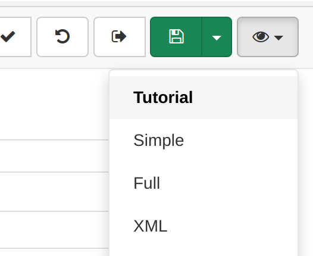

The view can define custom CSS classes in order to customize the look of the form. To learn more about the default style options, check [Defining a view](creating-custom-editor.md#creating-custom-editor-view).

To update the form, building the schema plugin is usually necessary. But updating only the XML configuration file of the form is quicker while in the process of creation of the form:

``` shell
cp schemas/iso19115-3.2018/src/main/plugin/iso19115-3.2018/layout/config-editor.xml web/src/main/webapp/WEB-INF/data/config/schema_plugins/iso19115-3.2018/layout/config-editor.xml
```

A more general approach is to update all plugins using a simple script ``copySchema.sh`` to run from the root of the source tree (the script also touch some core XSL file in order to invalidate the XSL cache if it is enabled):

``` shell
current=`pwd`
echo "Copy schemas in $current"
cd schemas
for d in *; do
 if [ -d "$d/src/main/plugin/$d" ]; then
   echo $d
   rm -fr ../web/src/main/webapp/WEB-INF/data/config/schema_plugins/$d
   cp -fr $d/src/main/plugin/$d ../web/src/main/webapp/WEB-INF/data/config/schema_plugins/.
 fi
done
cd ..
touch web/src/main/webapp/xslt/ui-metadata/edit/edit.xsl
touch web/src/main/webapp/xslt/services/thesaurus/convert.xsl
touch web/src/main/webapp/xslt/services/subtemplate/convert.xsl
```

## Step 2: Main fields

The resource is described first by a title and an abstract:

``` xml
<view name="Tutorial"
      class="gn-label-above-input gn-indent-bluescale">
  <tab id="main" default="true">
    <section>
      <field xpath="/*/mdb:identificationInfo/*/mri:citation/*/cit:title"/>
      <field xpath="/*/mdb:identificationInfo/*/mri:abstract"/>
    </section>
  </tab>
</view>
```

If those fields are in the base template, the configuration above works fine.

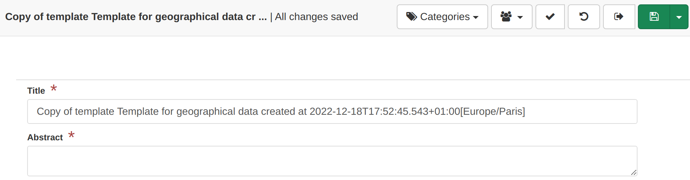

## Step 3: Adding optional fields

The supplemental information element is an optional field which is not in the template. The following configuration will not work:

``` xml
<view name="Tutorial"
      class="gn-label-above-input gn-indent-bluescale">
  <tab id="main" default="true">
    <section>
      <field xpath="/*/mdb:identificationInfo/*/mri:citation/*/cit:title"/>
      <field xpath="/*/mdb:identificationInfo/*/mri:abstract"/>
      <field xpath="/*/mdb:identificationInfo/*/mri:supplementalInformation"/>
    </section>
  </tab>
</view>
```

The configuration has to explain to the editor builder that the optional element `supplementalInformation` of `identificationInfo` can be added.

``` xml
<view name="Tutorial"
      class="gn-label-above-input gn-indent-bluescale">
  <tab id="main" default="true">
    <section>
      <field xpath="/*/mdb:identificationInfo/*/mri:citation/*/cit:title"/>
      <field xpath="/*/mdb:identificationInfo/*/mri:abstract"/>
      <field xpath="/*/mdb:identificationInfo/*/mri:supplementalInformation"
             or="supplementalInformation" in="/*/mdb:identificationInfo/*"/>
    </section>
  </tab>
</view>
```

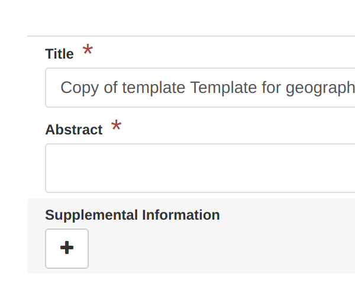

Clicking the `+` add the element:

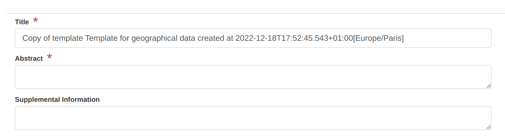

## Step 4: Adding complex fields

The same approach can be used to add complex element eg. the resource identifier defined in the citation is an `identifier` composed of a code, an authority, a codespace, \...

``` xml
<view name="Tutorial"
      class="gn-label-above-input gn-indent-bluescale">
  <tab id="main" default="true">
    <section>
      <field xpath="/*/mdb:identificationInfo/*/mri:citation/*/cit:title"/>
      <field xpath="/*/mdb:identificationInfo/*/mri:abstract"/>
      <field xpath="/*/mdb:identificationInfo/*/mri:supplementalInformation"
             or="supplementalInformation" in="/*/mdb:identificationInfo/*"/>
      <field xpath="/*/mdb:identificationInfo/*/mri:citation/*/cit:identifier"
             or="identifier" in="/*/mdb:identificationInfo/*/mri:citation"/>
    </section>
  </tab>
</view>
```

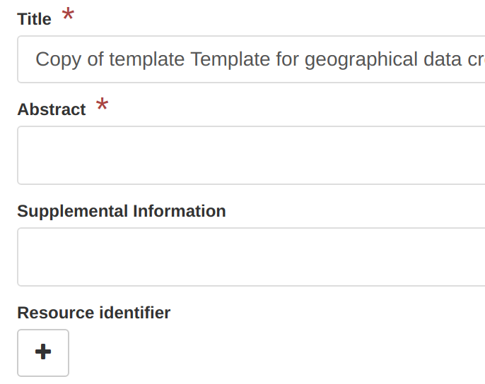

Clicking the `+` add the element:

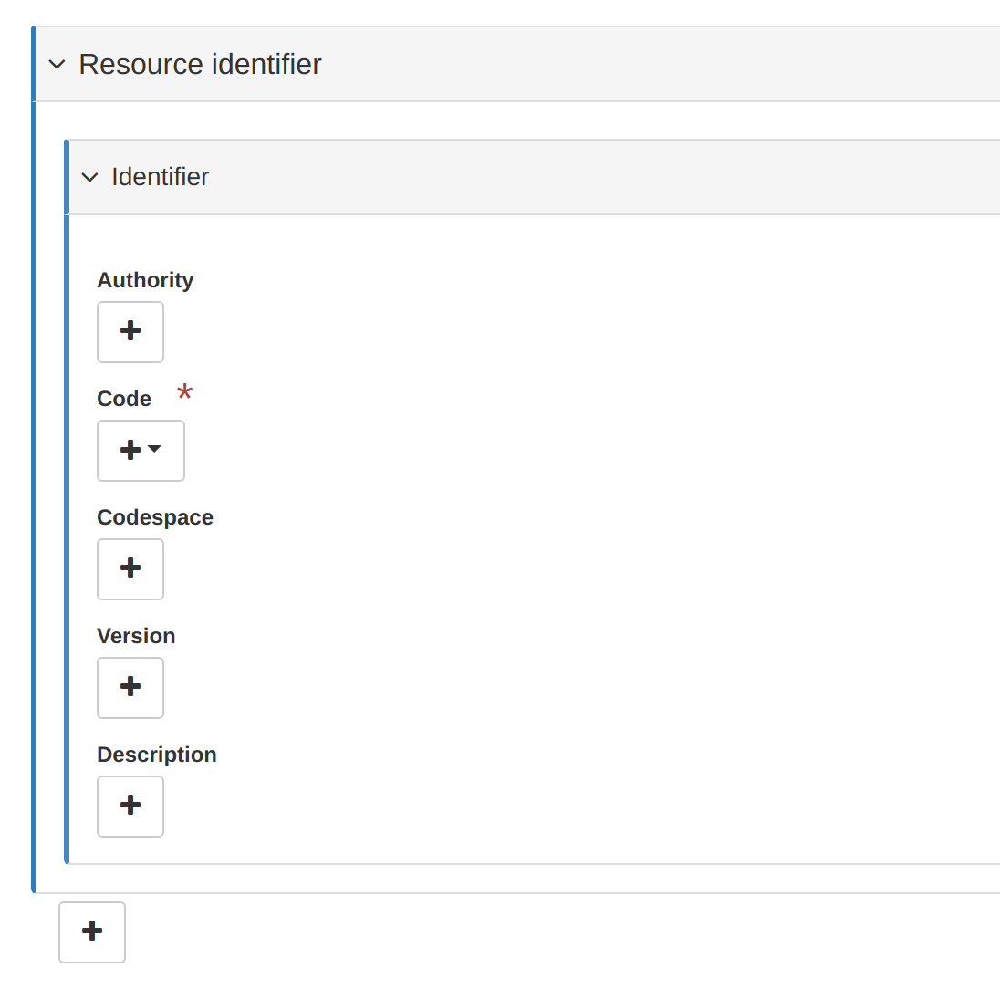

But in most cases, the idea is to build a simple form. In that case, only the code is necessary. Use an action to add the complex element with the fields needed. Here the action is created using a button with a custom label which is displayed only if there is no identifier. The XML snippet to add is defined with empty element or predefined values like in templates:

``` xml
<action type="add" name=" " btnLabel="Add the resource identifier"
        if="count(*/mdb:identificationInfo/*/mri:citation/*/cit:identifier) = 0"
        in="/*/mdb:identificationInfo/*/mri:citation/*">
  <template>
    <snippet>
      <cit:identifier>
        <mcc:MD_Identifier>
          <mcc:code>
            <gco:CharacterString>https://data.organisation.net/geo/code-year-edition</gco:CharacterString>
          </mcc:code>
        </mcc:MD_Identifier>
      </cit:identifier>
    </snippet>
  </template>
</action>

<field xpath="/*/mdb:identificationInfo/*/mri:citation/*/cit:identifier/*/mcc:code"
       name="Resource identifier"
       del="../.."/>
```

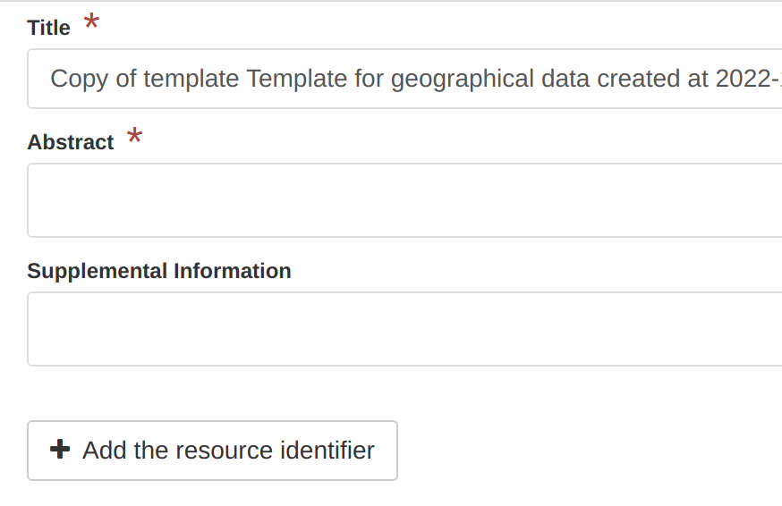

The field focus only on the resource identifier (ie. `mcc:code`) with a custom label. When removing this element, the action will trigger removal of the complex element, so use the `del` attribute to target the parent `cit:identifier`.

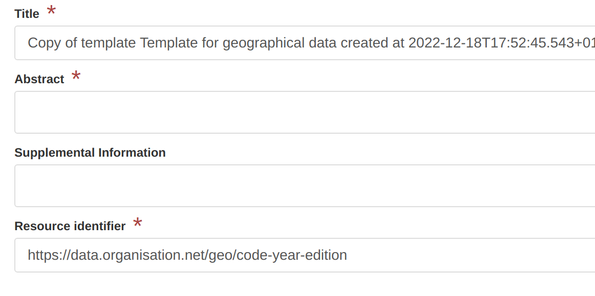

## Step 5: Adding text

Adding guidelines in the editor is as simple as the following:

``` xml
<text>
  <div>
    The dataset identifier shall be unique and ideally meaningful, following
    <a href="https://taskman.eionet.europa.eu/projects/public-docs/wiki/Naming_conventions" target="_blank">this convention</a>.
  </div>
</text>
```

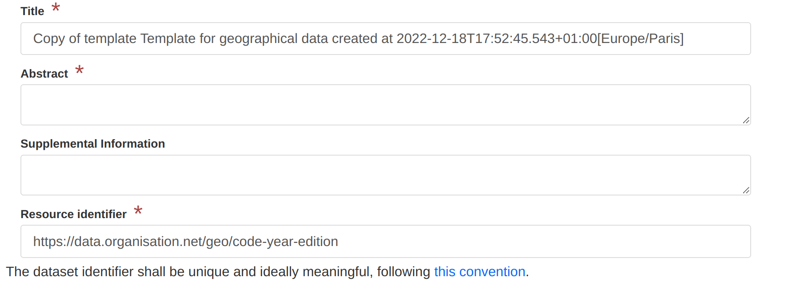

The text needs to be contained in one root HTML element. It can also contains more complex layout and be displayed on condition (eg. only display it if the is a resource identifier):

``` xml
<text if="count(*/mdb:identificationInfo/*/mri:citation/*/cit:identifier) > 0">
  <div class="row">
    <div class="col-sm-2"/>
    <div class="col-sm-10">
      <div class="alert alert-info">
        The dataset identifier shall be unique and ideally meaningful, following
        <a href="https://taskman.eionet.europa.eu/projects/public-docs/wiki/Naming_conventions" target="_blank">this convention</a>.
      </div>
    </div>
  </div>
  <hr/>
</text>
```

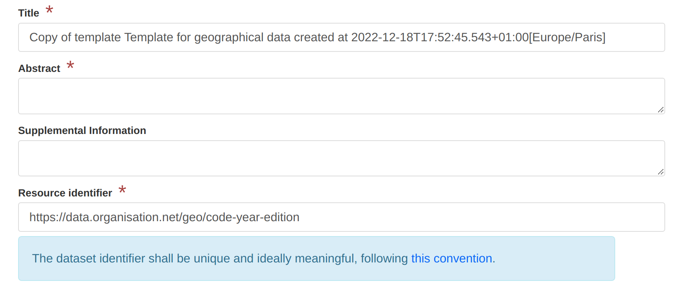

## Step 6: Translation

If working with a multilingual interface, configure the form using references to translation file content.

``` xml
<text ref="resource-identifier-help"
      if="count(*/mdb:identificationInfo/*/mri:citation/*/cit:identifier) > 0">
```

Translation are stored in the `loc/language_code/strings.xml` file (see `schemas/iso19115-3.2018/src/main/plugin/iso19115-3.2018/loc/eng/strings.xml`).

``` xml
<strings>
  <resource-identifier-help>
    <div class="row">
      <div class="col-sm-2"/>
      <div class="col-sm-10">
        <div class="alert alert-info">
          The dataset identifier shall be unique and ideally meaningful, following
          <a href="https://taskman.eionet.europa.eu/projects/public-docs/wiki/Naming_conventions" target="_blank">this convention</a>.
        </div>
      </div>
    </div>
    <hr/>
  </resource-identifier-help>
```

Same kind of references can be used for field, section and action labels:

``` xml
<field xpath="/*/mdb:identificationInfo/*/mri:citation/*/cit:identifier/*/mcc:code"
       name="resource-identifier"
       del="../.."/>
```

``` xml
<strings>
  <resource-identifier>
    Identifiant de la ressource
  </resource-identifier>
```

## Step 7: File upload

To upload data, additional documents to the record, a component (also named `directive` from an AngularJS perspective) can be used:

``` xml
<text ref="resource-identifier-help"
      if="count(*/mdb:identificationInfo/*/mri:citation/*/cit:identifier) > 0"/>
</section>


<directive data-gn-file-uploader=""
         data-type="onlines"/>
</tab>
</view>
```

It allows to easily add files which will be referenced in the distribution section of the record:

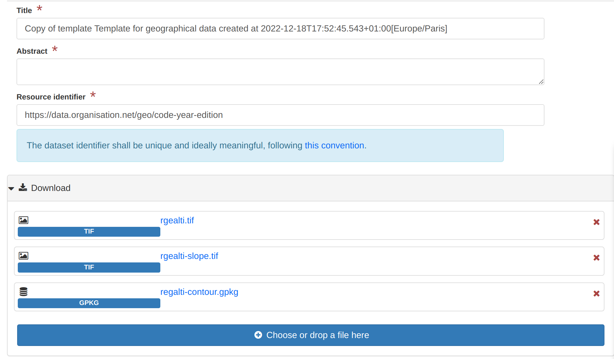

Instead of keeping the upload form in the main part of the editor, the section can be moved to a side panel (ie. outside the `tab`):

``` xml
</tab>
<sidePanel>
  <directive data-gn-file-uploader=""
             data-type="onlines"/>
</sidePanel>
</view>
```

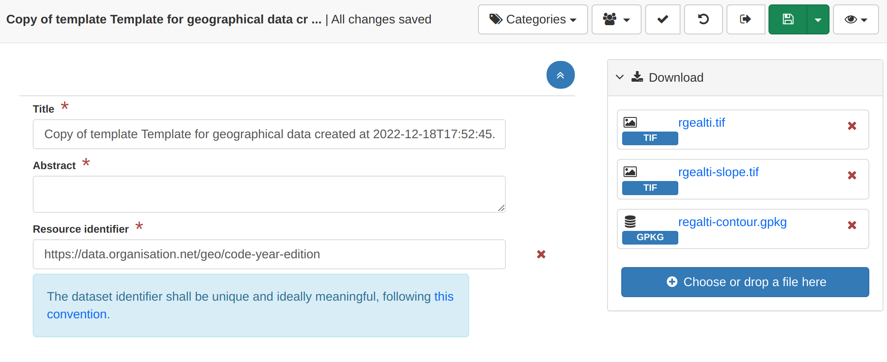

## Step 8: Set overview

``` xml
</tab>
<sidePanel>
  <directive data-gn-overview-manager=""
             data-file-types=".png,.gif,.jpeg,.jpg"/>
  <directive data-gn-file-uploader=""
             data-type="onlines"/>
</sidePanel>
</view>
```

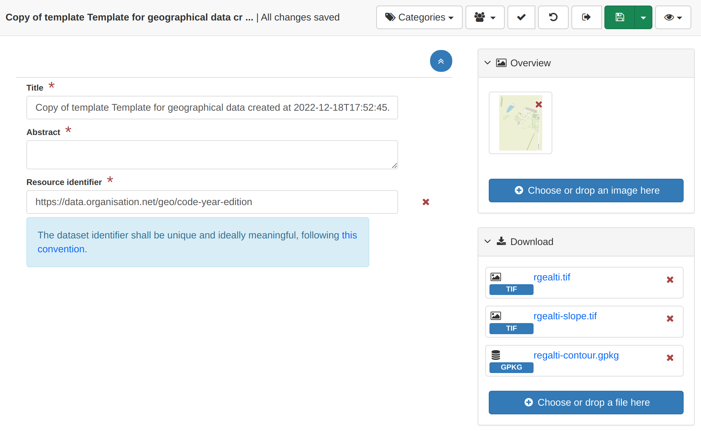

## Step 9: Classification

To add keywords, add a field first but also explain how to encode keywords using a thesaurus configuration:

``` xml
<section name="Classification">
  <field name="INSPIRE keyword"
         xpath="/*/mdb:identificationInfo/*/mri:descriptiveKeywords[
                  */mri:thesaurusName/*/cit:title/*/text()
                  = 'GEMET - INSPIRE themes, version 1.0']"/>

</section>
</tab>
<thesaurusList>
<thesaurus key="external.theme.httpinspireeceuropaeutheme-theme"
           fieldset="false"
           transformations="to-iso19115-3.2018-keyword-with-anchor"/>
</thesaurusList>
</view>
```

If the thesaurus is loaded in the admin console, the keyword picker looks like:

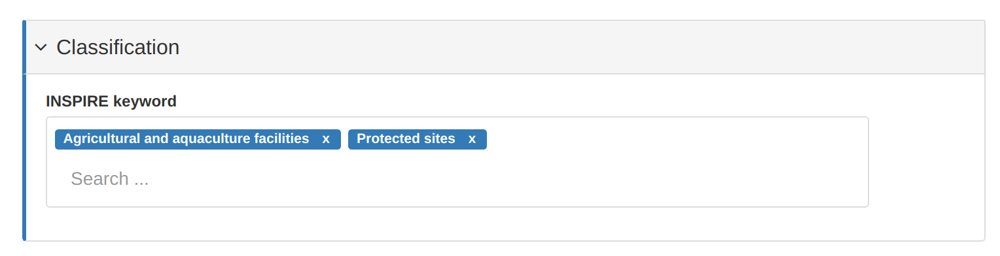

## Step 10: Understanding the "flat" mode

ISO Standards are known to be able to describe the details and provides many elements and descriptors but as we've seen before for the resource identifier, we sometimes want to focus on a specific descriptor.

For example, adding a new section with the spatial resolution:

``` xml
<section name="Spatial information">
  <field xpath="/*/mdb:identificationInfo/*/mri:spatialResolution"
         or="spatialResolution" in="/*/mdb:identificationInfo/*"/>
</section>
```

The spatial resolution as defined in ISO can be various things: a scale, a resolution, a LOD, an angular or vertical sampling measure. Each types have specific encoding and the default form mechanism is using the standard definition (ie. the XML schema or XSD) and as such can create complex form:

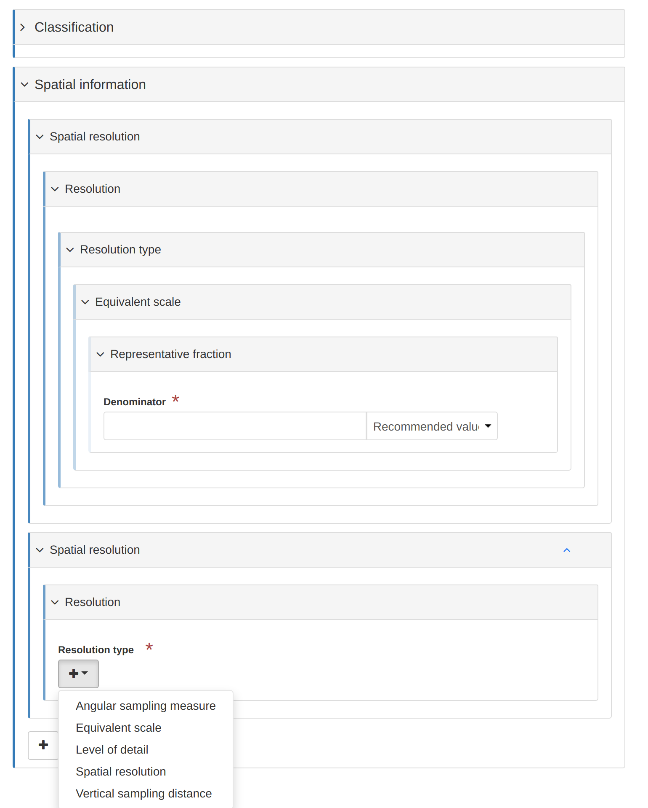

To improve that situation, a `flat` mode can be used at the tab level:

``` xml
<view name="Tutorial"
      class="gn-label-above-input gn-indent-bluescale">
  <tab id="main" default="true" mode="flat">
```

When using the `flat`, the same field is displayed as:

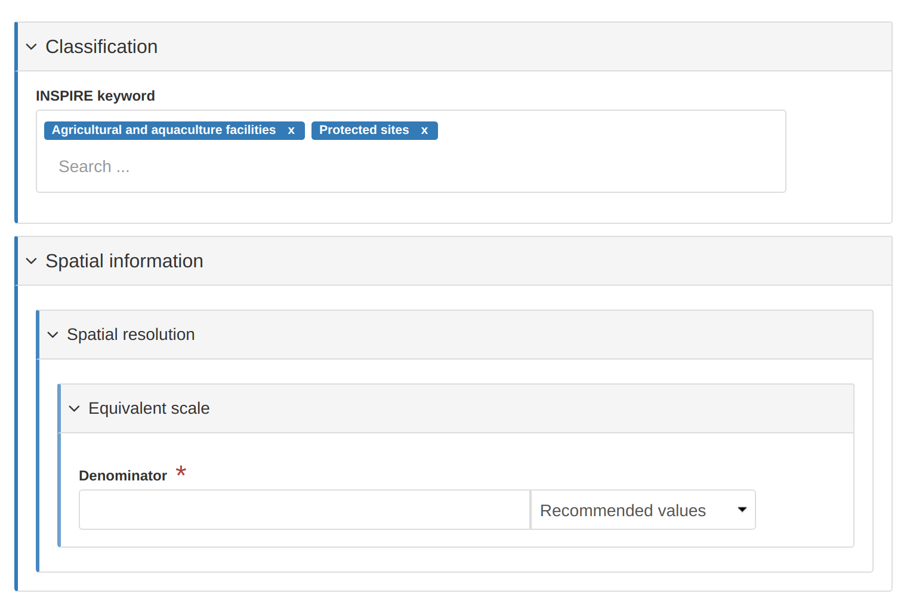

In this mode, the form is not created using the XSD, but using the XML document only. Note the changes:

-   less nested levels
-   no `+` action
-   no menu to choose the type of resolution

To overcome this:

-   Adjust the XPath to point to the final element to edit (to avoid all nested levels). Use the `del` attribute to properly remove the parent element.
-   Use `flatModeExceptions` to allow adding optional element in a `flat` tab
-   Use `action` in order to add the various type of elements.

Also note here the double `/` which is a particularity for elements having substitute like the spatial resolution. The metadocument (containing the XSD + the XML of the metadata) contains extra element `geonet:choose` when an element has subsitutions.

``` xml
<section name="Spatial information">
  <field name="Scale denominator"
         xpath="/*/mdb:identificationInfo/*/mri:spatialResolution/*//mri:equivalentScale/*/mri:denominator"
         or="spatialResolution" in="/*/mdb:identificationInfo/*"
         del="ancestor::mri:spatialResolution"/>
</section>
</tab>
<flatModeExceptions>
<for name="mri:spatialResolution"/>
</flatModeExceptions>
```

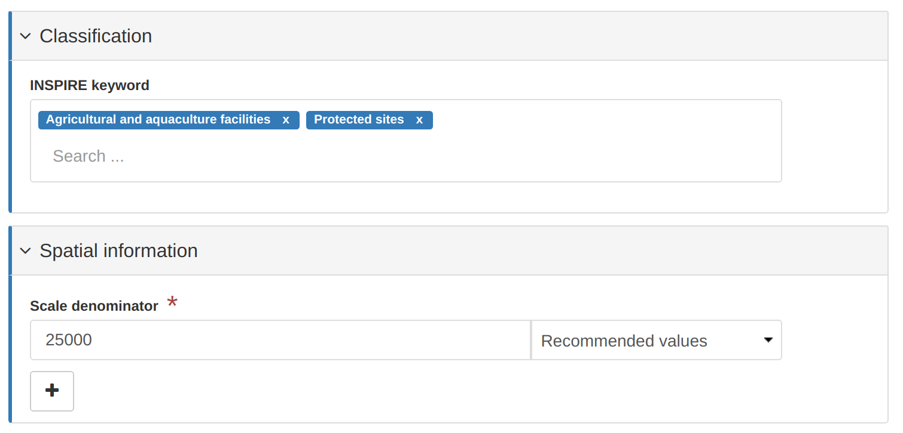
