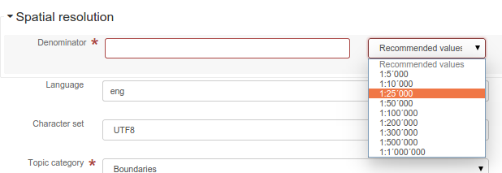
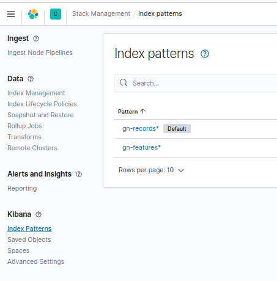
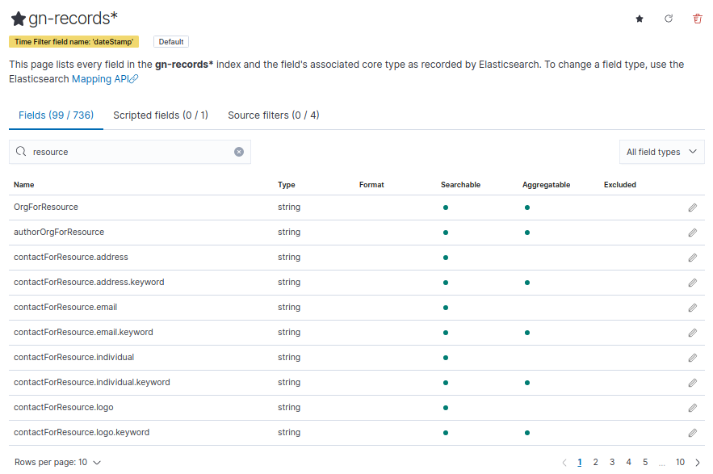
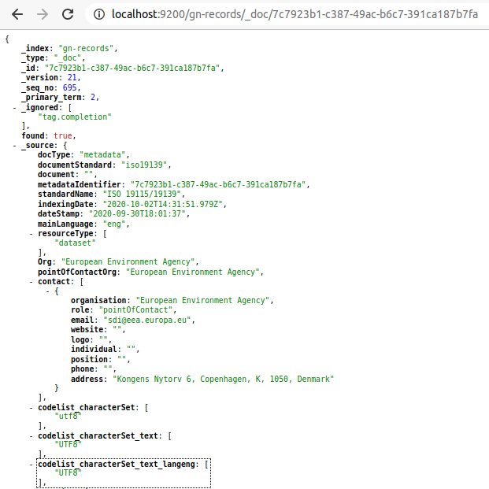
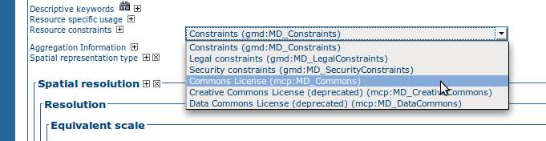
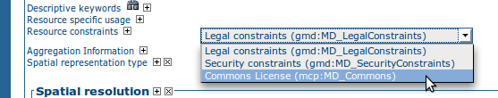

# Implementing schema plugins {#implementing-a-schema-plugin}

## Metadata schemas and profiles

A metadata schema describes:

1.  the names, descriptions and any value codelists of the elements in the metadata schema
2.  how the elements of the metadata schema are laid out in a metadata document (structure)
3.  constraints on elements and content in a metadata document
4.  documentation on how the elements of the metadata schema should be used
5.  sample metadata documents and metadata templates
6.  scripts to convert metadata documents to and from other metadata schemas

A metadata schema is usually an implementation of a metadata standard.

A metadata profile is an adaptation of a metadata schema to suit the needs of a particular community. A metadata profile contains all the components of a metadata schema but may extend, restrict or redefine these components.

## Implementing a metadata schema or profile

There are many ways in which a metadata schema or profile can be implemented. This section will describe the way in which metadata schemas are implemented on <https://github.com/geonetwork/schema-plugins> or <https://github.com/metadata101>.

Each metadata schema is a Maven module implemented as a filesystem tree. The root of the tree is the name of the metadata schema in abbreviated form. The essential components of a metadata schema in the `src/main/plugin/<schema_id>` folder and are laid out as follows:

1.  **loc** directory with subdirectories for each three letter language code that this information is localized into, with the content in XML files (labels.xml, codelists.xml). For example: `loc/eng/codelists.xml` describes the english codelists for metadata elements
2.  **schema** directory and file named **schema.xsd** providing a single entry point to the XSD hierarchy. For example: `schema/gmd/gmd.xsd`
3.  **schematron** directory has constraints on elements and content in a metadata document implemented using the ISO schematron language
4.  **docs** directory has documentation on how the elements of the metadata schema should be used.
5.  **sample-data** directory has sample metadata documents
6.  **convert** directory has XSLTs that convert metadata documents to and from other schemas

More information on the content of these directories and files will be given in the next section.

!!! info "See Also"

    Some schemas on <https://github.com/geonetwork/schema-plugins> or <https://github.com/metadata101> have more information than described above because they have been implemented as GeoNetwork schema plugins.


## Schema Plugins

A schema plugin that can be used in GeoNetwork is a directory of stylesheets, XML schema descriptions (XSDs) and other information necessary for GeoNetwork to index, view and possibly edit content from XML metadata records.

To be used in GeoNetwork, a schema directory can be manually placed in the `schema_plugins` sub directory of the GeoNetwork data directory. For some schema an additional JAR file should be added to the WEB-INF/lib folder. The default GeoNetwork data directory location is `INSTALL_DIR/web/geonetwork/WEB-INF/data`.

The contents of these schemas are parsed during GeoNetwork initialization. If valid, they will be available for use when GeoNetwork starts up.

Schemas can also added to GeoNetwork dynamically if a zip archive of the schema directory is created and then uploaded to GeoNetwork in one of following ways using functions in the Administration menu:

1.  Server file path (specified using file chooser)
2.  HTTP URL (eg. <http://somehost/somedirectory/iso19139.mcp.zip>)
3.  As an online resource attached to an ISO19115/19139 metadata record

Uploaded schemas are also stored in the `schema_plugins` sub directory of the GeoNetwork data directory.

!!! info "See Also"

    A template module is available here <https://github.com/geonetwork/schema-plugins/tree/develop/iso19139.xyz> and is a good example to start with.


### Contents of a GeoNetwork schema

When installed, a GeoNetwork schema is a directory.

The following subdirectories can be present in `src/main/plugin/<schema_id>`:

-   **schema**: (*Optional*) Directory containing the official XSDs of the metadata schema. If the schema is described by a DTD then this directory is optional. Note that schemas described by a DTD cannot be edited by GeoNetwork.
-   **schematron**: (*Optional*) Directory containing the schematrons used to check conditions on content.
-   **docs**: (*Optional*) Documentation about the schema
-   **index-fields**: (*Mandatory*) Directory of XSLT required to index metadata record.
-   **loc**: (*Mandatory*) Directory of localized information: labels, codelists or schema specific strings. Eg. `loc/eng/codelists.xml`
-   **convert**: (*Mandatory*) Directory of XSLTs to convert metadata from or to this schema. This could be to convert metadata to other schemas or to convert metadata from other schemas and formats to this schema. Eg. `convert/oai_dc.xsl`
-   **layout**: (*Mandatory for version 3.x*) contains configuration for presenting metadata in the editor.
-   **formatter**: (*Optional for version 3.x*) contains configuration for presenting metadata using Groovy or XSLT formatter.
-   **present**: (*Mandatory for version 2.x*) contains XSLTs for presenting metadata in the viewer/editor.
-   **present/csw**: (*Mandatory*) contains XSLTs for response to CSW requests for brief, summary and full records.
-   **process**: (*Optional*) contains XSLTs for processing metadata elements by metadata suggestions mechanism (see **suggest.xsl** below).
-   **sample-data**: (*Optional*) Sample metadata for this schema. The metadata samples are in MEF format so that samples can have thumbnails or browse graphics as well as online resources.
-   **templates**: (*Optional*) Directory containing template and subtemplate metadata records for this schema. Template metadata records are usually metadata records with the set of elements (and content) that will be used for a specific purpose. Eg. iso19139.mcp schema has a 'Minimum Element' template that has the mandatory elements for the schema and a example of the content that is expected.

The following stylesheets can be present:

-   **extract-date-modified.xsl**: (*Mandatory*) Extract the date of modification from the metadata record.
-   **extract-gml.xsl**: (*Mandatory*) Extract the spatial extent from the metadata record as a GML GeometryCollection element.
-   **extract-thumbnails.xsl**: (*Optional*) Extract the browse graphic/thumbnail from the metadata record.
-   **extract-uuid.xsl**: (*Mandatory*) Extract the UUID of the metadata record.
-   **extract-relations.xsl**: (*Optional*) Extract the associated resources of the metadata record (eg. online source, thumbnails).
-   **set-thumbnail.xsl**: (*Optional*) Set the browse graphic/thumbnail in the metadata record.
-   **set-uuid.xsl**: (*Optional*) Set the UUID of the metadata record.
-   **suggest.xsl**: (*Optional*) XSLT run by metadata suggestions service. The XSLT contains processes that can be registered and run on different elements of a metadata record. eg. expand keyword field with comma separated content into multiple keyword fields. See [Suggestion for improving metadata content](../user-guide/workflow/suggestion.md) for more info.
-   **unset-thumbnail.xsl**: (*Optional*) Remove the browse graphic/thumbnail from the metadata record.
-   **update-child-from-parent-info.xsl**: (*Optional*) XSLT to specify which elements in a child record are updated from a parent record. Used to manage hierarchical relationships between metadata records.
-   **update-fixed-info.xsl**: (*Optional*) XSLT to update 'fixed' content in metadata records.

The following configuration files can be present:

-   **oasis-catalog.xml**: (*Optional*) An oasis catalog describing any mappings that should be used for this schema eg. mapping URLs to local copies such as schemaLocations eg. <http://www.isotc211.org/2005/gmd/gmd.xsd> is mapped to `schema/gmd/gmd.xsd`. Path names used in the oasis catalog are relative to the location of this file which is the schema directory.
-   **schema.xsd**: (*Optional*) XML schema directory file that includes the XSDs used by this metadata schema. If the schema uses a DTD then this file should not be present. Metadata records from schemas that use DTDs cannot be edited in GeoNetwork.
-   **schema-conversions.xml**: (*Optional*) XML file that describes the converters that can be applied to records belonging to this schema. This information is used to show these conversions as options for the user to choose when a metadata record belonging to this schema is shown in the search results.
-   **schema-ident.xml**: (*Mandatory*) XML file that contains the schema name, identifier, version number and details on how to recognise metadata records that belong to this schema. This file has an XML schema definition in `INSTALL_DIR/web/geonetwork/xml/validation/schemaPlugins/schema-ident.xsd` which is used to validate it when the schema is loaded.
-   **schema-substitutes.xml**: (*Optional*) XML file that redefines the set of elements that can be used as substitutes for a specific element.
-   **schema-suggestions.xml**: (*Optional*) XML file that tells the editor which child elements of a complex element to automatically expand in the editor.

In the `index-fields` folder, the following files are required:

-   **index.xsl**: (*Mandatory*) Index the metadata record content. The output produce a list of field and values to index.

To help in understanding what each of these components is and what is required, we will now give a step-by-step example of how to build a schemaPlugin for GeoNetwork.

### Preparation

In order to create a schema plugin for GeoNetwork, you should check out the source code:

``` shell
git clone --recursive https://github.com/geonetwork/core-geonetwork
```

Then you could check out the schema plugin repository containing examples:

``` shell
git clone --recursive https://github.com/geonetwork/schema-plugins
```

To work with the example shown here, you should create your new schema plugin in a subdirectory of the schemas Maven module (see `schemas`). The `iso19139.xyz` plugin from the schema plugin repository could be a good start.

Once created, you need to register your new plugin in the build of the application. To do this:

-   Add the plugin as a module of the schemas module (see `schemas/pom.xml`):

    ``` xml
    <module>iso19139.xyz</module>
    ```

-   Register the plugin in the webapp in the `copy-schemas` execution (see `web/pom.xml`):

    ``` xml
    <resource>
       <directory>${project.basedir}/../schemas/iso19139.xyz/src/main/plugin</directory>
       <targetPath>${basedir}/src/main/webapp/WEB-INF/data/config/schema_plugins</targetPath>
     </resource>
    ```

-   Optionally register the dependency if you plugin implement custom Java (see `web/pom.xml`):

    ``` xml
    <dependency>
      <groupId>${project.groupId}</groupId>
      <artifactId>schema-iso19139.xyz</artifactId>
      <version>${project.version}</version>
    </dependency>
    ```

### Example - ISO19115/19139 Marine Community Profile (MCP)

The Marine Community Profile (MCP) is a profile of ISO19115/19139 developed for and with the Marine Community. The profile extends the ISO19115 metadata standard and is implemented using an extension of the XML implementation of ISO19115 described in ISO19139. Both the ISO19115 metadata standard and its XML implementation, ISO19139, are available through ISO distribution channels.

The documentation for the Marine Community Profile can be found at <http://www.aodc.gov.au/files/MarineCommunityProfilev1.4.pdf>. The implementation of the Marine Community Profile as XML schema definitions is based on the approach described at <https://www.seegrid.csiro.au/wiki/AppSchemas/MetadataProfiles>. The XML schema definitions (XSDs) are available at the URL <http://bluenet3.antcrc.utas.edu.au/mcp-1.4>.

Looking at the XML schema definitions, the profile adds a few new elements to the base ISO19139 standard. So the basic idea in defining a plugin Marine Community Profile schema for GeoNetwork is to use as much of the basic ISO19139 schema definition supplied with GeoNetwork as possible.

We'll now describe in basic steps how to create each of the components of a plugin schema for GeoNetwork that implements the MCP.

#### Creating the schema-ident.xml file

Now we need to provide the information necessary to identify the schema and metadata records that belong to the schema. The schema-ident.xml file for the MCP is as follows:

``` xml
<?xml version="1.0" encoding="UTF-8"?>
<schema xmlns="http://geonetwork-opensource.org/schemas/schema-ident"
        xmlns:xsi="http://www.w3.org/2001/XMLSchema-instance">
  <name>iso19139.mcp</name>
  <id>19c9a2b2-dddb-11df-9df4-001c2346de4c</id>
  <version>1.5</version>
  <schemaLocation>
    http://bluenet3.antcrc.utas.edu.au/mcp
    http://bluenet3.antcrc.utas.edu.au/mcp-1.5-experimental/schema.xsd
    http://www.isotc211.org/2005/gmd
    http://www.isotc211.org/2005/gmd/gmd.xsd
    http://www.isotc211.org/2005/srv
    http://schemas.opengis.net/iso/19139/20060504/srv/srv.xsd
  </schemaLocation>
  <autodetect xmlns:mcp="http://bluenet3.antcrc.utas.edu.au/mcp"
              xmlns:gmd="http://www.isotc211.org/2005/gmd"
              xmlns:gco="http://www.isotc211.org/2005/gco">
    <elements>
      <gmd:metadataStandardName>
        <gco:CharacterString>
          Australian Marine Community Profile of ISO 19115:2005/19139|
          Marine Community Profile of ISO 19115:2005/19139
        </gco:CharacterString>
      </gmd:metadataStandardName>
      <gmd:metadataStandardVersion>
        <gco:CharacterString>
          1.5-experimental|
          MCP:BlueNet V1.5-experimental|
          MCP:BlueNet V1.5
        </gco:CharacterString>
      </gmd:metadataStandardVersion>
    </elements>
  </autodetect>
</schema>
```

Each of the elements is as follows:

-   **name** - the name by which the schema will be known in GeoNetwork. If the schema is a profile of a base schema already added to GeoNetwork then the convention is to call the schema <base_schema_name>.<namespace_of_profile>.
-   **id** - a unique identifier for the schema.
-   **version** - the version number of the schema. Multiple versions of the schema can be present in GeoNetwork.
-   **schemaLocation** - a set of pairs, where the first member of the pair is a namespace URI and the second member is the official URL of the XSD. The contents of this element will be added to the root element of any metadata record displayed by GeoNetwork as a schemaLocation/noNamespaceSchemaLocation attribute, if such as attribute does not already exist. It will also be used whenever an official schemaLocation/noNamespaceSchemaLocation is required (eg. in response to a ListMetadataFormats OAI request).
-   **autodetect** - contains elements or attributes (with content) that must be present in any metadata record that belongs to this schema. This is used during schema detection whenever GeoNetwork receives a metadata record of unknown schema.
-   **filters** - (Optional) contains custom filter to be applied based on user privileges

After creating this file you can validate it manually using the XML schema definition (XSD) in `INSTALL_DIR/web/geonetwork/xml/validation/schemaPlugins/schema-ident.xsd`. This XSD is also used to validate this file when the schema is loaded. If schema-ident.xml fails validation, the schema will not be loaded.

#### More on autodetect

The autodetect section of schema-ident.xml is used when GeoNetwork needs to identify which metadata schema a record belongs to.

The five rules that can be used in this section in order of evaluation are:

1.  **Attributes** - Find one or more attributes and/or namespaces in the document. An example use case is a profile of ISO19115/19139 that adds optional elements under a new namespace to gmd:identificationInfo/gmd:MD_DataIdentification. To detect records that belong to this profile the autodetect section in the schema-ident.xml file could look something like the following:

    ``` xml
    <autodetect xmlns:cmar="http://www.marine.csiro.au/schemas/cmar.xsd">
      <!-- catch all cmar records that have the cmar vocab element -->
      <attributes cmar:vocab="http://www.marine.csiro.au/vocabs/projectCodes.xml"/>
    </autodetect>
    ```

    Some other points about attributes autodetect:

    -   multiple attributes can be specified - all must be match for the record to be recognized as belonging to this schema.
    -   if the attributes have a namespace then the namespace should be specified on the autodetect element or somewhere in the schema-ident.xml document.

2.  **Elements** - Find one or more elements in the document. An example use case is the one shown in the example schema-ident.xml file earlier:

    ``` xml
    <autodetect xmlns:mcp="http://bluenet3.antcrc.utas.edu.au/mcp"
                xmlns:gmd="http://www.isotc211.org/2005/gmd"
                xmlns:gco="http://www.isotc211.org/2005/gco">
      <elements>
        <gmd:metadataStandardName>
          <gco:CharacterString>
            Australian Marine Community Profile of ISO 19115:2005/19139|
            Marine Community Profile of ISO 19115:2005/19139
          </gco:CharacterString>
        </gmd:metadataStandardName>
        <gmd:metadataStandardVersion>
          <gco:CharacterString>
            1.5-experimental|
            MCP:BlueNet V1.5-experimental|
            MCP:BlueNet V1.5
          </gco:CharacterString>
        </gmd:metadataStandardVersion>
      </elements>
    </autodetect>
    ```

    Some other points about elements autodetect:

    -   multiple elements can be specified - eg. as in the above, both metadataStandardName and metadataStandardVersion have been specified - all must be match for the record to be recognized as belonging to this schema.
    -   multiple values for the elements can be specified. eg. as in the above, a match for gmd:metadataStandardVersion will be found for `1.5-experimental` OR `MCP:BlueNet V1.5-experimental` OR `MCP:BlueNet V1.5` - the vertical line or pipe character '|' is used to separate the options here. Regular expression can be used also.
    -   if the elements have a namespace then the namespace(s) should be specified on the autodetect element or somewhere in the schema-ident.xml document before the element in which they are used - eg. in the above there are there namespace declarations on the autodetect element so as not to clutter the content.

3.  **Root element** - root element of the document must match. An example use case is the one used for the eml-gbif schema. Documents belonging to this schema always have root element of eml:eml so the autodetect section for this schema is:

    ``` xml
    <autodetect xmlns:eml="eml://ecoinformatics.org/eml-2.1.1">
      <elements type="root">
        <eml:eml/>
      </elements>
    </autodetect>
    ```

    Some other points about root element autodetect:

    -   multiple elements can be specified - any element in the set that matches the root element of the record will trigger a match.
    -   if the elements have a namespace then the namespace(s) should be specified on the autodetect element or somewhere in the schema-ident.xml document before the element that uses them - eg. as in the above there is a namespace declaration on the autodetect element for clarity.

4.  **Namespaces** - Find one or more namespaces in the document. An example use case is the one used for the csw:Record schema. Records belonging to the csw:Record schema can have three possible root elements: csw:Record, csw:SummaryRecord and csw:BriefRecord, but instead of using a multiple element root autodetect, we could use the common csw namespace for autodetect as follows:

    ``` xml
    <autodetect>
      <namespaces xmlns:csw="http://www.opengis.net/cat/csw/2.0.2"/>
    </autodetect>
    ```

    Some other points about namespaces autodetect:

    -   multiple namespaces can be specified - all must be present for the record to be recognized as belonging to this schema.
    -   the prefix is ignored. A namespace match occurs if the namespace URI found in the record matches the namespace URI specified in the namespaces autodetect element.

5.  **Default schema** - This is the fail-safe provision for records that don't match any of the installed schemas. The value for the default schema is specified in the appHandler configuration of the `INSTALL_DIR/web/geonetwork/WEB-INF/config.xml` config file or it could be a default specified by the operation calling autodetect (eg. a value parsed from a user bulk loading some metadata records). For flexibility and accuracy reasons it is preferable that records be detected using the autodetect information of an installed schema. The default schema is just a 'catch all' method of assigning records to a specific schema. The config element in `INSTALL_DIR/web/geonetwork/WEB-INF/config.xml` looks like the following:

    ``` xml
    <appHandler class="org.fao.geonet.Geonetwork">
      .....
      <param name="preferredSchema" value="iso19139" />
      .....
    </appHandler>
    ```

#### More on autodetect evaluation

The rules for autodetect are evaluated as follows:

``` shell
for-each autodetect rule type in ( 'attributes/namespaces', 'elements',
                                   'namespaces', 'root element' )
  for-each schema
    if schema has autodetect rule type then
      check rule for a match
      if match add to list of previous matches
    end if
  end for-each

  if more than one match throw 'SCHEMA RULE CONFLICT EXCEPTION'
  if one match then set matched = first match and break loop
end for-each

if no match then
  if namespaces of record and default schema overlap then
    set match = default schema
  else throw 'NO SCHEMA MATCHES EXCEPTION'
end if

return matched schema
```

As an example, suppose we have three schemas iso19139.mcp, iso19139.mcp-1.4 and iso19139.mcp-cmar with the following autodetect elements:

##### iso19139.mcp-1.4

``` xml
<autodetect xmlns:mcp="http://bluenet3.antcrc.utas.edu.au/mcp"
            xmlns:gmd="http://www.isotc211.org/2005/gmd"
            xmlns:gco="http://www.isotc211.org/2005/gco">
  <elements>
    <gmd:metadataStandardName>
      <gco:CharacterString>
        Australian Marine Community Profile of ISO 19115:2005/19139
      </gco:CharacterString>
    </gmd:metadataStandardName>
    <gmd:metadataStandardVersion>
      <gco:CharacterString>MCP:BlueNet V1.4</gco:CharacterString>
    </gmd:metadataStandardVersion>
  </elements>
</autodetect>
```

##### iso19139.mcp-cmar

``` xml
<autodetect>
    <attributes xmlns:mcp-cmar="http://www.marine.csiro.au/schemas/mcp-cmar">
</autodetect>
```

##### iso19139.mcp

``` xml
<autodetect xmlns:mcp="http://bluenet3.antcrc.utas.edu.au/mcp">
  <elements type="root">
    <mcp:MD_Metadata/>
  </elements>
</autodetect>
```

A record going through autodetect processing (eg. on import) would be checked against:

-   iso19139.mcp-cmar first as it has an 'attributes' rule
-   then iso19139.mcp-1.4 as it has an 'elements' rules
-   then finally against iso19139.mcp, as it has a 'root element' rule.

The idea behind this processing algorithm is that base schemas will use a 'root element' rule (or the more difficult to control 'namespaces' rule) and profiles will use a finer or more specific rule such as 'attributes' or 'elements'.

#### More on filters

The goal is to add the capability to configure the download and dynamic operation based on the catalog content where they could have different meanings depending :

-   on the schema (eg. URL to a file for download is not located at the same place for dublin core and ISO19139)
-   on the record encoding rules (eg. download could be WFS links and not only uploaded file).

Filter configuration for each type of operation is defined in schema-ident.xml in the filters section.

A filter define:

-   an operation (which match canEdit, canDownload, canDynamic method in AccessManager)
-   an XPath to select elements to filter
-   an optional element definition to substitute the replaced element by (if a match is found this element attributes or children are inserted). This is used to highlight removed element.

``` xml
<filters>
  <!-- Filter element having withheld nilReason for user who can not edit -->
  <filter xpath="*//*[@gco:nilReason='withheld']"
          ifNotOperation="editing">
    <keepMarkedElement gco:nilReason="withheld"/>
  </filter>
  <!-- Filter element having protocol download for user who can not download -->
  <filter xpath="*//gmd:onLine[*/gmd:protocol/gco:CharacterString = 'WWW:DOWNLOAD-1.0-http--download']"
          ifNotOperation="download"/>
  <!-- Filter element having protocol WMS for user who can not dynamic -->
  <filter xpath="*//gmd:onLine[starts-with(*/gmd:protocol/gco:CharacterString, 'OGC:WMS')]"
          ifNotOperation="dynamic"/>
</filters>
```

The filters are applied in XMLSerializer according to user privileges.

After setting up schema-ident.xml, our new GeoNetwork plugin schema for MCP contains:

    schema-ident.xml

#### Creating the schema-conversions.xml file {#schema_conversions}

This file describes the converters that can be applied to metadata records that belong to the schema. Each converter must be manually defined as a GeoNetwork (Jeeves) service that can be called to transform a particular metadata record to a different schema. The schema-conversions.xml file for the MCP is as follows:

``` xml
<conversions>
   <converter name="xml_iso19139.mcp"
              nsUri="http://bluenet3.antcrc.utas.edu.au/mcp"
              schemaLocation="http://bluenet3.antcrc.utas.edu.au/mcp-1.5-experimental/schema.xsd"
              xslt="xml_iso19139.mcp.xsl"/>
   <converter name="xml_iso19139.mcp-1.4"
              nsUri="http://bluenet3.antcrc.utas.edu.au/mcp"
              schemaLocation="http://bluenet3.antcrc.utas.edu.au/mcp/schema.xsd"
              xslt="xml_iso19139.mcp-1.4.xsl"/>
   <converter name="xml_iso19139.mcpTooai_dc"
              nsUri="http://www.openarchives.org/OAI/2.0/"
              schemaLocation="http://www.openarchives.org/OAI/2.0/oai_dc.xsd"
              xslt="oai_dc.xsl"/>
   <converter name="xml_iso19139.mcpTorifcs"
              nsUri="http://ands.org.au/standards/rif-cs/registryObjects"
              schemaLocation="http://services.ands.org.au/home/orca/schemata/registryObjects.xsd"
              xslt="rif.xsl"/>
</conversions>
```

Each converter has the following attributes:

-   **name** - the name of the converter. This is the service name of the GeoNetwork (Jeeves) service and should be unique (prefixing the service name with ``xml_<schema_name>`` is a good way to make this name unique).
-   **nsUri** - the primary namespace of the schema produced by the converter. eg. xml_iso19139.mcpTorifcs transforms metadata records from iso19139.mcp to the RIFCS schema. Metadata records in the RIFCS metadata schema have primary namespace URI of <http://ands.org.au/standards/rif-cs/registryObjects>.
-   **schemaLocation** - the location (URL) of the XML schema definition (XSD) corresponding to the nsURI.
-   **xslt** - the name of the XSLT that actually carries out the transformation. This XSLT should be located in the convert subdirectory of the schema plugin.

After setting up schema-conversions.xml, our new GeoNetwork plugin schema for MCP contains:

    schema-conversions.xml schema-ident.xml

#### Creating the schema directory and schema.xsd file {#schema_and_schema_xsd}

The schema and schema.xsd components are used by the GeoNetwork editor and validation functions.

GeoNetwork's editor uses the XSDs to build a form that will not only order the elements in a metadata document correctly but also offer options to create any elements that are not in the metadata document. The idea behind this approach is twofold. Firstly, the editor can use the XML schema definition rules to help the user avoid creating a document that is structurally incorrect eg. missing mandatory elements or elements not ordered correctly. Secondly, the same editor code can be used on any XML metadata document with a defined XSD.

If you are defining your own metadata schema then you can create an XML schema document using the XSD language. The elements of the language can be found online at <http://www.w3schools.com/schema/> or you can refer to a textbook such as Priscilla Walmsley's Definitive XML Schema (Prentice Hall, 2002). GeoNetwork's XML schema parsing code understands almost all of the XSD language with the exception of redefine, any and anyAttribute (although the last two can be handled under special circumstances).

In the case of the Marine Commuity Profile, we are basically defining a number of extensions to the base standard ISO19115/19139. These extensions are defined using the XSD extension mechanism on the types defined in ISO19139. The following snippet shows how the Marine Community Profile extends the gmd:MD_Metadata element to add a new element called revisionDate:

``` xml
<xs:schema targetNamespace="http://bluenet3.antcrc.utas.edu.au/mcp"
           xmlns:mcp="http://bluenet3.antcrc.utas.edu.au/mcp">

  <xs:element name="MD_Metadata" substitutionGroup="gmd:MD_Metadata"
                                 type="mcp:MD_Metadata_Type"/>

  <xs:complexType name="MD_Metadata_Type">
    <xs:annotation>
      <xs:documentation>
       Extends the metadata element to include revisionDate
      </xs:documentation>
    </xs:annotation>
    <xs:complexContent>
      <xs:extension base="gmd:MD_Metadata_Type">
        <xs:sequence>
          <xs:element name="revisionDate" type="gco:Date_PropertyType"
                      minOccurs="0"/>
        </xs:sequence>
        <xs:attribute ref="gco:isoType" use="required"
                      fixed="gmd:MD_Metadata"/>
      </xs:extension>
    </xs:complexContent>
  </xs:complexType>

</xs:schema>
```

In short, we have defined a new element mcp:MD_Metadata with type mcp:MD_Metadata_Type, which is an extension of gmd:MD_Metadata_Type. By extension, we mean that the new type includes all of the elements of the old type plus one new element, mcp:revisionDate. A mandatory attribute (gco:isoType) is also attached to mcp:MD_Metadata with a fixed value set to the name of the element that we extended (gmd:MD_Metadata).

By defining the profile in this way, it is not necessary to modify the underlying ISO19139 schemas. So the schema directory for the MCP essentially consists of the extensions plus the base ISO19139 schemas. One possible directory structure is as follows:

    extensions gco gmd gml gmx gsr gss gts resources srv xlink

The extensions directory contains a single file mcpExtensions.xsd, which imports the gmd namespace. The remaining directories are the ISO19139 base schemas.

The schema.xsd file, which is the file GeoNetwork looks for, will import the mcpExtensions.xsd file and any other namespaces not imported as part of the base ISO19139 schema. It is shown as follows:

``` xml
<xs:schema targetNamespace="http://bluenet3.antcrc.utas.edu.au/mcp"
           elementFormDefault="qualified"
        xmlns:xs="http://www.w3.org/2001/XMLSchema"
        xmlns:mcp="http://bluenet3.antcrc.utas.edu.au/mcp"
        xmlns:gmd="http://www.isotc211.org/2005/gmd"
        xmlns:gmx="http://www.isotc211.org/2005/gmx"
        xmlns:srv="http://www.isotc211.org/2005/srv">
  <xs:include schemaLocation="schema/extensions/mcpExtensions.xsd"/>
  <!-- this is a logical place to include any additional schemas that are
       related to ISO19139 including ISO19119 -->
  <xs:import namespace="http://www.isotc211.org/2005/srv"
             schemaLocation="schema/srv/srv.xsd"/>
  <xs:import namespace="http://www.isotc211.org/2005/gmx"
             schemaLocation="schema/gmx/gmx.xsd"/>
</xs:schema>
```

At this stage, our new GeoNetwork plugin schema for MCP contains:

``` shell
schema-conversions.xml  schema-ident.xml  schema.xsd  schema
```

#### Creating the extract-\... XSLTs

GeoNetwork needs to extract certain information from a metadata record and translate it into a common, simplified XML structure that is independent of the metadata schema. Rather than do this with Java coded XPaths, XSLTs are used to process the XML and return the common, simplified XML structure.

The three xslts we'll create are:

-   **extract-date-modified.xsl** - this XSLT processes the metadata record and extracts the date the metadata record was last modified. For the MCP, this information is held in the mcp:revisionDate element which is a child of mcp:MD_Metadata. The easiest way to create this for MCP is to copy extract-date-modified.xsl from the iso19139 schema and modify it to suit the MCP namespace and to use mcp:revisionDate in place of gmd:dateStamp.
-   **extract-gml.xsl** - this XSLT processes the metadata record and extracts the spatial extent as a gml GeometryCollection element. The gml is passed to geotools for insertion into the spatial index (either a shapefile or a spatial database). For ISO19115/19139 and profiles, this task is quite easy because spatial extents (apart from the bounding box) are encoded as gml in the metadata record. Again, the easiest way to create this for the MCP is to copy extract-gml.xsd from the iso19139 schema ad modify it to suit the MCP namespace.

An example bounding box fragment from an MCP metadata record is:

``` xml
<gmd:extent>
  <gmd:EX_Extent>
    <gmd:geographicElement>
      <gmd:EX_GeographicBoundingBox>
        <gmd:westBoundLongitude>
          <gco:Decimal>112.9</gco:Decimal>
        </gmd:westBoundLongitude>
        <gmd:eastBoundLongitude>
          <gco:Decimal>153.64</gco:Decimal>
        </gmd:eastBoundLongitude>
        <gmd:southBoundLatitude>
          <gco:Decimal>-43.8</gco:Decimal>
        </gmd:southBoundLatitude>
        <gmd:northBoundLatitude>
          <gco:Decimal>-9.0</gco:Decimal>
        </gmd:northBoundLatitude>
      </gmd:EX_GeographicBoundingBox>
    </gmd:geographicElement>
  </gmd:EX_Extent>
</gmd:extent>
```

Running extract-gml.xsl on the metadata record that contains this XML will produce:

``` xml
<gml:GeometryCollection xmlns:gml="http://www.opengis.net/gml">
  <gml:Polygon>
    <gml:exterior>
      <gml:LinearRing>
        <gml:coordinates>
          112.9,-9.0, 153.64,-9.0, 153.64,-43.8, 112.9,-43.8, 112.9,-9.0
        </gml:coordinates>
      </gml:LinearRing>
    </gml:exterior>
  </gml:Polygon>
</gml:GeometryCollection>
```

If there is more than one extent in the metadata record, then they should also appear in this gml:GeometryCollection element.

To find out more about gml, see Lake, Burggraf, Trninic and Rae, "GML Geography Mark-Up Language, Foundation for the Geo-Web", Wiley, 2004.

Finally, a note on projections. It is possible to have bounding polygons in an MCP record in a projection other than EPSG:4326. GeoNetwork transforms all projections known to GeoTools (and encoded in a form that GeoTools understands) to EPSG:4326 when writing the spatial extents to the shapefile or spatial database.

-   **extract-uuid.xsl** - this XSLT processes the metadata record and extracts the identifier for the record. For the MCP and base ISO standard, this information is held in the gmd:fileIdentifier element which is a child of mcp:MD_Metadata.

These xslts can be tested by running them on a metadata record from the schema. You should use the saxon xslt processor. For example:

``` shell
java -jar INSTALL_DIR/web/geonetwork/WEB-INF/lib/saxon-9.1.0.8b-patch.jar
     -s testmcp.xml -o output.xml extract-gml.xsl
```

At this stage, our new GeoNetwork plugin schema for MCP contains:

    extract-date-modified.xsl  extract-gml.xsd   extract-uuid.xsl
    schema-conversions.xml  schema-ident.xml  schema.xsd  schema

#### Creating the localized strings in the loc directory

The loc directory contains localized strings specific to this schema, arranged by language abbreviation in sub-directories.

You should provide localized strings in whatever languages you expect your schema to be used in.

Localized strings for this schema can be used in the presentation xslts and schematron error messages. For the presentation xslts:

-   codelists for controlled vocabulary fields should be in loc/<language_abbreviation>/codelists.xml eg. `loc/eng/codelists.xml`
-   label strings that replace XML element names with more intelligible/alternative phrases and rollover help strings should be in loc/<language_abbreviation>/labels.xml eg. `loc/eng/labels.xml`.
-   all other localized strings should be in loc/<language_abbreviation>/strings.xml eg. `loc/eng/strings.xml`

Note that because the MCP is a profile of ISO19115/19139 and we have followed the GeoNetwork naming convention for profiles, we need only include the labels and codelists that are specific to the MCP or that we want to override. Other labels and codelists will be retrieved from the base schema iso19139.

#### More on codelists.xml

Typically codelists are generated from enumerated lists in the metadata schema XSDs such as the following from <http://www.isotc211.org/2005/gmd/identification.xsd> for gmd:MD_TopicCategoryCode in the iso19139 schema:

``` xml
<xs:element name="MD_TopicCategoryCode" type="gmd:MD_TopicCategoryCode_Type"/>

<xs:simpleType name="MD_TopicCategoryCode_Type">
   <xs:restriction base="xs:string">
     <xs:enumeration value="farming"/>
     <xs:enumeration value="biota"/>
     <xs:enumeration value="boundaries"/>
     <xs:enumeration value="climatologyMeteorologyAtmosphere"/>
     <xs:enumeration value="economy"/>
     <xs:enumeration value="elevation"/>
     <xs:enumeration value="environment"/>
     <xs:enumeration value="geoscientificInformation"/>
     <xs:enumeration value="health"/>
     <xs:enumeration value="imageryBaseMapsEarthCover"/>
     <xs:enumeration value="intelligenceMilitary"/>
     <xs:enumeration value="inlandWaters"/>
     <xs:enumeration value="location"/>
     <xs:enumeration value="oceans"/>
     <xs:enumeration value="planningCadastre"/>
     <xs:enumeration value="society"/>
     <xs:enumeration value="structure"/>
     <xs:enumeration value="transportation"/>
     <xs:enumeration value="utilitiesCommunication"/>
   </xs:restriction>
 </xs:simpleType>
```

The following is part of the codelists.xml entry manually created for this element:

``` xml
<codelist name="gmd:MD_TopicCategoryCode">
  <entry>
    <code>farming</code>
    <label>Farming</label>
    <description>Rearing of animals and/or cultivation of plants. Examples: agriculture,
      irrigation, aquaculture, plantations, herding, pests and diseases affecting crops and
      livestock</description>
  </entry>
  <!-- - - - - - - - - - - - - - - - - - - - - - - - - -->
  <entry>
    <code>biota</code>
    <label>Biota</label>
    <description>Flora and/or fauna in natural environment. Examples: wildlife, vegetation,
      biological sciences, ecology, wilderness, sealife, wetlands, habitat</description>
  </entry>
  <!-- - - - - - - - - - - - - - - - - - - - - - - - - -->
  <entry>
    <code>boundaries</code>
    <label>Boundaries</label>
    <description>Legal land descriptions. Examples: political and administrative
    boundaries</description>
  </entry>

  .....

</codelist>
```

The codelists.xml file maps the enumerated values from the XSD to a localized label and a description via the code element.

A localized copy of codelists.xml is made available on an XPath to the presentation XSLTs eg. /root/gui/schemas/iso19139/codelist for the iso19139 schema.

The XSLT metadata.xsl which contains templates used by all metadata schema presentation XSLTs, handles the creation of a select list/drop down menu in the editor and display of the code and description in the metadata viewer.

The iso19139 schema has additional codelists that are managed external to the XSDs in catalog/vocabulary files such as <http://www.isotc211.org/2005/resources/Codelist/gmxCodelists.xml> These have also been added to the codelists.xml file so that they can be localized, overridden in profiles and include an extended description to provide more useful information when viewing the metadata record.

To use the ISO19139 codelist in a profile you can add a template to point to the codelist to use:

``` xml
<xsl:template mode="mode-iso19139.xyz" match="*[*/@codeList]">
  <xsl:param name="schema" select="$schema" required="no"/>
  <xsl:param name="labels" select="$labels" required="no"/>

  <xsl:apply-templates mode="mode-iso19139" select=".">
    <xsl:with-param name="schema" select="$schema"/>
    <xsl:with-param name="labels" select="$labels"/>
    <xsl:with-param name="codelists" select="$codelists"/><!-- Will be the profile codelist -->
  </xsl:apply-templates>
</xsl:template>
```

To override some of the ISO19139 codelist, you can check if the codelist is defined in xyz profile and if not use the ISO19139 one:

``` xml
<!-- check iso19139.xyz first, then fall back to iso19139 -->
<xsl:variable name="listOfValues" as="node()">
  <xsl:variable name="profileCodeList" as="node()" select="gn-fn-metadata:getCodeListValues($schema, name(*[@codeListValue]), $codelists, .)"/>
  <xsl:choose>
    <xsl:when test="count($profileCodeList/*) = 0"> <!-- do iso19139 -->
      <xsl:copy-of select="gn-fn-metadata:getCodeListValues('iso19139', name(*[@codeListValue]), $iso19139codelists, .)"/>
    </xsl:when>
    <xsl:otherwise>
      <xsl:copy-of select="$profileCodeList"/>
    </xsl:otherwise>
  </xsl:choose>
</xsl:variable>
```

The iso19139 schema has additional templates in its presentation xslts to handlese codelists because they are specific to that schema. These are discussed in the section on presentation XSLTs later in this manual.

#### More on labels.xml

A localized copy of labels.xml is made available on an XPath to the presentation XSLTs eg. /root/gui/schemas/iso19139/labels for the iso19139 schema.

The `labels.xml` file can also be used to provide helper values in the form of a drop down/select list for free text fields. As an example:

``` xml
<element name="gmd:credit" id="27.0">
  <label>Credit</label>
  <description>Recognition of those who contributed to the resource(s)</description>
  <helper>
    <option value="University of Tasmania">UTAS</option>
    <option value="University of Queensland">UQ</option>
  </helper>
</element>
```

This would result in the Editor (through the XSLT metadata.xsl) displaying the credit field with these helper options listed beside it in a drop down/select menu something like the following:



#### More on strings.xml

A localized copy of `strings.xml` is made available on an XPath to the presentation XSLTs eg. /root/gui/schemas/iso19139/strings for the iso19139 schema.

After adding the localized strings, our new GeoNetwork plugin schema for MCP contains:

    extract-date-modified.xsl  extract-gml.xsd  extract-uuid.xsl
    loc  present  schema-conversions.xml  schema-ident.xml  schema.xsd
    schema

#### Creating the presentations using formatter

!!! info "Version Added"

    3.0


!!! info "See Also"

    See formatter section TODO for version 3.x


#### Customizing the editor

!!! info "Version Added"

    3.0


!!! info "See Also"

    See editor configuration section TODO for version 3.x


#### Creating the presentations XSLTs in the present directory

!!! warning "Deprecated"

    3.0.0


Each metadata schema should contain XSLTs that display and possibly edit metadata records that belong to the schema. These XSLTs are held in the `present` directory.

To be used in the XSLT include/import hierarchy these XSLTs must follow a naming convention: metadata-<schema-name>.xsl. So for example, the presentation xslt for the iso19139 schema is `metadata-iso19139.xsl`. For the MCP, since our schema name is iso19139.mcp, the presentation XSLT would be called `metadata-iso19193.mcp.xsl`.

Any XSLTs included by the presentation XSLT should also be in the present directory (this is a convention for clarity - it is not mandatory as include/import URLs can be mapped in the oasis-catalog.xml for the schema to other locations).

There are certain XSLT templates that the presentation XSLT must have:

-   the **main** template, which must be called: metadata-<schema-name>. For the MCP profile of iso19139 the main template would look like the following (taken from metadata-iso19139.mcp.xsl):

```{=html}
<!-- -->
```
    <xsl:template name="metadata-iso19139.mcp">
      <xsl:param name="schema"/>
      <xsl:param name="edit" select="false()"/>
      <xsl:param name="embedded"/>

      <xsl:apply-templates mode="iso19139" select="." >
        <xsl:with-param name="schema" select="$schema"/>
        <xsl:with-param name="edit"   select="$edit"/>
        <xsl:with-param name="embedded" select="$embedded" />
      </xsl:apply-templates>
    </xsl:template>

Analyzing this template:

1.  The name="metadata-iso19139.mcp" is used by the main element processing template in metadata.xsl: elementEP. The main metadata services, show and edit, end up calling metadata-show.xsl and metadata-edit.xsl respectively with the metadata record passed from the Java service. Both these XSLTs, process the metadata record by applying the elementEP template from metadata.xsl to the root element. The elementEP template calls this main schema template using the schema name iso19139.mcp.
2.  The job of this main template is set to process all the elements of the metadata record using templates declared with a mode name that matches the schema name or the name of the base schema (in this case iso19139). This modal processing is to ensure that only templates intended to process metadata elements from this schema or the base schema are applied. The reason for this is that almost all profiles change or add a small number of elements to those in the base schema. So most of the metadata elements in a profile can be processed in the mode of the base schema. We'll see later in this section how to override processing of an element in the base schema.

-   a **completeTab** template, which must be called: <schema-name>CompleteTab. This template will display all tabs, apart from the 'default' (or simple mode) and the 'XML View' tabs, in the left hand frame of the editor/viewer screen. Here is an example for the MCP:

``` xml
<xsl:template name="iso19139.mcpCompleteTab">
  <xsl:param name="tabLink"/>

  <xsl:call-template name="displayTab"> <!-- non existent tab - by profile -->
    <xsl:with-param name="tab"     select="''"/>
    <xsl:with-param name="text"    select="/root/gui/strings/byGroup"/>
    <xsl:with-param name="tabLink" select="''"/>
  </xsl:call-template>

  <xsl:call-template name="displayTab">
    <xsl:with-param name="tab"     select="'mcpMinimum'"/>
    <xsl:with-param name="text"    select="/root/gui/strings/iso19139.mcp/mcpMinimum"/>
    <xsl:with-param name="indent"  select="'&#xA0;&#xA0;&#xA0;'"/>
    <xsl:with-param name="tabLink" select="$tabLink"/>
  </xsl:call-template>

  <xsl:call-template name="displayTab">
    <xsl:with-param name="tab"     select="'mcpCore'"/>
    <xsl:with-param name="text"    select="/root/gui/strings/iso19139.mcp/mcpCore"/>
    <xsl:with-param name="indent"  select="'&#xA0;&#xA0;&#xA0;'"/>
    <xsl:with-param name="tabLink" select="$tabLink"/>
  </xsl:call-template>

  <xsl:call-template name="displayTab">
    <xsl:with-param name="tab"     select="'complete'"/>
    <xsl:with-param name="text"    select="/root/gui/strings/iso19139.mcp/mcpAll"/>
    <xsl:with-param name="indent"  select="'&#xA0;&#xA0;&#xA0;'"/>
    <xsl:with-param name="tabLink" select="$tabLink"/>
  </xsl:call-template>

  ...... (same as for iso19139CompleteTab in
 GEONETWORK_DATA_DIR/schema_plugins/iso19139/present/
 metadata-iso19139.xsl) ......

</xsl:template>
```

This template is called by the template named "tab" (which also adds the "default" and "XML View" tabs) in `INSTALL_DIR/web/geonetwork/xsl/metadata-tab-utils.xsl` using the schema name. That XSLT also has the code for the "displayTab" template.

'mcpMinimum', 'mcpCore', 'complete' etc are the names of the tabs. The name of the current or active tab is stored in the global variable "currTab" available to all presentation XSLTs. Logic to decide what to display when a particular tab is active should be contained in the root element processing tab.

-   a **root element** processing tab. This tab should match on the root element of the metadata record. For example, for the iso19139 schema:

``` xml
<xsl:template mode="iso19139" match="gmd:MD_Metadata">
  <xsl:param name="schema"/>
  <xsl:param name="edit"/>
  <xsl:param name="embedded"/>

  <xsl:choose>

  <!-- metadata tab -->
  <xsl:when test="$currTab='metadata'">
    <xsl:call-template name="iso19139Metadata">
      <xsl:with-param name="schema" select="$schema"/>
      <xsl:with-param name="edit"   select="$edit"/>
    </xsl:call-template>
  </xsl:when>

  <!-- identification tab -->
  <xsl:when test="$currTab='identification'">
    <xsl:apply-templates mode="elementEP" select="gmd:identificationInfo|geonet:child[string(@name)='identificationInfo']">
      <xsl:with-param name="schema" select="$schema"/>
      <xsl:with-param name="edit"   select="$edit"/>
    </xsl:apply-templates>
  </xsl:when>

  .........

</xsl:template>
```

This template is basically a very long "choose" statement with "when" clauses that test the value of the currently defined tab (in global variable currTab). Each "when" clause will display the set of metadata elements that correspond to the tab definition using "elementEP" directly (as in the "when" clause for the 'identification' tab above) or via a named template (as in the 'metadata' tab above). For the MCP our template is similar to the one above for iso19139, except that the match would be on "mcp:MD_Metadata" (and the processing mode may differ - see the section 'An alternative XSLT design for profiles' below for more details).

-   a **brief** template, which must be called: <schema-name>Brief. This template processes the metadata record and extracts from it a format neutral summary of the metadata for purposes such as displaying the search results. Here is an example for the eml-gbif schema (because it is fairly short!):

``` xml
<xsl:template match="eml-gbifBrief">
 <xsl:for-each select="/metadata/*[1]">
  <metadata>
    <title><xsl:value-of select="normalize-space(dataset/title[1])"/></title>
    <abstract><xsl:value-of select="dataset/abstract"/></abstract>

    <xsl:for-each select="dataset/keywordSet/keyword">
      <xsl:copy-of select="."/>
    </xsl:for-each>

    <geoBox>
        <westBL><xsl:value-of select="dataset/coverage/geographicCoverage/boundingCoordinates/westBoundingCoordinate"/></westBL>
        <eastBL><xsl:value-of select="dataset/coverage/geographicCoverage/boundingCoordinates/eastBoundingCoordinate"/></eastBL>
        <southBL><xsl:value-of select="dataset/coverage/geographicCoverage/boundingCoordinates/southBoundingCoordinate"/></southBL>
        <northBL><xsl:value-of select="dataset/coverage/geographicCoverage/boundingCoordinates/northBoundingCoordinate"/></northBL>
    </geoBox>
    <xsl:copy-of select="geonet:info"/>
  </metadata>
 </xsl:for-each>
</xsl:template>
```

Analyzing this template:

1.  The template matches on an element eml-gbifBrief, created by the mode="brief" template in metadata-utils.xsl. The metadata record will be the first child in the /metadata XPath.
2.  Then process metadata elements to produce a flat XML structure that is used by search-results-xhtml.xsl to display a summary of the metadata record found by a search.

Once again, for profiles of an existing schema, it makes sense to use a slightly different approach so that the profile need not duplicate templates. Here is an example from metadata-iso19139.mcp.xsl:

``` xml
<xsl:template match="iso19139.mcpBrief">
  <metadata>
    <xsl:for-each select="/metadata/*[1]">
      <!-- call iso19139 brief -->
      <xsl:call-template name="iso19139-brief"/>
      <!-- now brief elements for mcp specific elements -->
      <xsl:call-template name="iso19139.mcp-brief"/>
    </xsl:for-each>
  </metadata>
</xsl:template>
```

This template splits the processing between the base iso19139 schema and a brief template that handles elements specific to the profile. This assumes that:

1.  The base schema has separated the <metadata> element from the remainder of its brief processing so that it can be called by profiles
2.  The profile includes links to equivalent elements that can be used by the base schema to process common elements eg. for ISO19139, elements in the profile have gco:isoType attributes that give the name of the base element and can be used in XPath matches such as "gmd:MD_DataIdentification|*[@gco:isoType='gmd:MD_DataIdentification']".

-   templates that match on elements specific to the schema. Here is an example from the eml-gbif schema:

``` xml
<!-- keywords are processed to add thesaurus name in brackets afterwards
     in view mode -->

<xsl:template mode="eml-gbif" match="keywordSet">
  <xsl:param name="schema"/>
  <xsl:param name="edit"/>

  <xsl:choose>
    <xsl:when test="$edit=false()">
      <xsl:variable name="keyword">
        <xsl:for-each select="keyword">
          <xsl:if test="position() &gt; 1">,  </xsl:if>
          <xsl:value-of select="."/>
        </xsl:for-each>
        <xsl:if test="keywordThesaurus">
          <xsl:text> (</xsl:text>
          <xsl:value-of select="keywordThesaurus"/>
          <xsl:text>)</xsl:text>
        </xsl:if>
      </xsl:variable>
      <xsl:apply-templates mode="simpleElement" select=".">
        <xsl:with-param name="schema" select="$schema"/>
        <xsl:with-param name="edit"   select="$edit"/>
        <xsl:with-param name="text"    select="$keyword"/>
      </xsl:apply-templates>
    </xsl:when>
    <xsl:otherwise>
      <xsl:apply-templates mode="complexElement" select=".">
        <xsl:with-param name="schema" select="$schema"/>
        <xsl:with-param name="edit"   select="$edit"/>
      </xsl:apply-templates>
    </xsl:otherwise>
  </xsl:choose>
</xsl:template>
```

Analyzing this template:

1.  In view mode the individual keywords from the set are concatenated into a comma separated string with the name of the thesaurus in brackets at the end.
2.  In edit mode, the keywordSet is handled as a complex element ie. the user can add individual keyword elements with content and a single thesaurus name.
3.  This is an example of the type of processing that can be done on an element in a metadata record.

For profiles, templates for elements can be defined in the same way except that the template will process in the mode of the base schema. Here is an example showing the first few lines of a template for processing the mcp:revisionDate element:

``` xml
<xsl:template mode="iso19139" match="mcp:revisionDate">
   <xsl:param name="schema"/>
   <xsl:param name="edit"/>

   <xsl:choose>
     <xsl:when test="$edit=true()">
       <xsl:apply-templates mode="simpleElement" select=".">
         <xsl:with-param name="schema"  select="$schema"/>
         <xsl:with-param name="edit"   select="$edit"/>

   ......
```

If a template for a profile is intended to override a template in the base schema, then the template can be defined in the presentation XSLT for the profile with a priority attribute set to a high number and an XPath condition that ensures the template is processed for the profile only. For example in the MCP, we can override the handling of gmd:EX_GeographicBoundingBox in metadata-iso19139.xsl by defining a template in metadata-iso19139.mcp.xsl as follows:

``` xml
<xsl:template mode="iso19139" match="gmd:EX_GeographicBoundingBox[starts-with(//geonet:info/schema,'iso19139.mcp')]" priority="3">

......
```

Finally, a profile may also extend some of the existing codelists in the base schema. These extended codelists should be held in a localized codelists.xml. As an example, in iso19139 these codelists are often attached to elements like the following:

``` xml
<gmd:role>
  <gmd:CI_RoleCode codeList="http://www.isotc211.org/2005/resources/Codelist/gmxCodelists.xml#CI_RoleCode" codeListValue="custodian">custodian</gmd:CI_RoleCode>
</gmd:role>
```

Templates for handling these elements are in the iso19139 presentation XSLT `GEONETWORK_DATA_DIR/schema_plugins/iso19139/present/metadata-iso19139.xsl`. These templates use the name of the element (eg. gmd:CI_RoleCode) and the codelist XPath (eg. /root/gui/schemas/iso19139/codelists) to build select list/drop down menus when editing and to display a full description when viewing. See templates near the template named 'iso19139Codelist'. These templates can handle the extended codelists for any profile because they:

-   match on any element that has a child element with attribute codeList
-   use the schema name in the codelists XPath
-   fall back to the base iso19139 schema if the profile codelist doesn't have the required codelist

However, if you don't need localized codelists, it is often easier and more direct to extract codelists directly from the `gmxCodelists.xml` file. This is in fact the solution that has been adopted for the MCP. The `gmxCodelists.xml` file is included in the presentation xslt for the MCP using a statement like:

``` xml
<xsl:variable name="codelistsmcp"
              select="document('../schema/resources/Codelist/gmxCodelists.xml')"/>
```

Check the codelist handling templates in `metadata-iso19139.mcp.xsl` to see how this works.

#### An alternative XSLT design for profiles

In all powerful languages there will be more than one way to achieve a particular goal. This alternative XSLT design is for processing profiles. The idea behind the alternative is based on the following observations about the GeoNetwork XSLTs:

1.  All elements are initially processed by apply-templates in mode "elementEP".
2.  The template "elementEP" (see `INSTALL_DIR/web/geonetwork/xsl/metadata.xsl`) eventually calls the **main** template of the schema/profile.
3.  The main template can initially process the element in a mode particular to the profile and if this is not successful (ie. no template matches and thus no HTML elements are returned), process the element in the mode of the base schema.

The advantage of this design is that overriding a template for an element in the base schema does not need the priority attribute or an XPath condition check on the schema name.

Here is an example for the MCP (iso19139.mcp) with base schema iso19139:

-   the **main** template, which must be called: metadata-iso19139.mcp.xsl:

``` xml
<!-- main template - the way into processing iso19139.mcp -->
<xsl:template name="metadata-iso19139.mcp">
  <xsl:param name="schema"/>
  <xsl:param name="edit" select="false()"/>
  <xsl:param name="embedded"/>

    <!-- process in profile mode first -->
    <xsl:variable name="mcpElements">
      <xsl:apply-templates mode="iso19139.mcp" select="." >
        <xsl:with-param name="schema" select="$schema"/>
        <xsl:with-param name="edit"   select="$edit"/>
        <xsl:with-param name="embedded" select="$embedded" />
      </xsl:apply-templates>
    </xsl:variable>

    <xsl:choose>

      <!-- if we got a match in profile mode then show it -->
      <xsl:when test="count($mcpElements/*)>0">
        <xsl:copy-of select="$mcpElements"/>
      </xsl:when>

      <!-- otherwise process in base iso19139 mode -->
      <xsl:otherwise>
        <xsl:apply-templates mode="iso19139" select="." >
          <xsl:with-param name="schema" select="$schema"/>
          <xsl:with-param name="edit"   select="$edit"/>
          <xsl:with-param name="embedded" select="$embedded" />
        </xsl:apply-templates>
      </xsl:otherwise>
    </xsl:choose>
</xsl:template>
```

Analyzing this template:

1.  The name="metadata-iso19139.mcp" is used by the main element processing template in metadata.xsl: elementEP. The main metadata services, show and edit, end up calling metadata-show.xsl and metadata-edit.xsl respectively with the metadata record passed from the Java service. Both these XSLTs, process the metadata record by applying the elementEP template from metadata.xsl to the root element. elementEP calls the appropriate main schema template using the schema name.
2.  The job of this main template is set to process all the elements of the metadata profile. The processing takes place in one of two modes. Firstly, the element is processed in the profile mode (iso19139.mcp). If a match is found then HTML elements will be returned and copied to the output document. If no HTML elements are returned then the element is processed in the base schema mode, iso19139.

-   templates that match on elements specific to the profile have mode iso19139.mcp:

``` xml
<xsl:template mode="iso19139.mcp" match="mcp:taxonomicElement">
  <xsl:param name="schema"/>
  <xsl:param name="edit"/>

  .....
</xsl:template>
```

-   templates that override elements in the base schema are processed in the profile mode iso19139.mcp

``` xml
<xsl:template mode="iso19139.mcp" match="gmd:keyword">
  <xsl:param name="schema"/>
  <xsl:param name="edit"/>

  .....
</xsl:template>
```

Notice that the template header of the profile has a simpler design than that used for the original design? Neither the priority attribute or the schema XPath condition is required because we are using a different mode to the base schema.

-   To support processing in two modes we need to add a null template to the profile mode iso19139.mcp as follows:

``` xml
<xsl:template mode="iso19139.mcp" match="*|@*"/>
```

This template will match all elements that we don't have a specific template for in the profile mode iso19139.mcp. These elements will be processed in the base schema mode iso19139 instead because the null template returns nothing (see the main template discussion above).

The remainder of the discussion in the original design relating to tabs etc applies to the alternative design and is not repeated here.

#### CSW Presentation XSLTs

The CSW server can be asked to provide records in a number of output schemas. The two supported by GeoNetwork are:

-   **ogc** - <http://www.opengis.net/cat/csw/2.0.2> - a dublin core derivative
-   **iso** - <http://www.isotc211.org/2005/gmd> - ISO19115/19139

From each of these output schemas, a **brief**, **summary** or **full** element set can be requested.

These output schemas and element sets are implemented in GeoNetwork as XSLTs and they are stored in the 'csw' subdirectory of the 'present' directory. The ogc output schema XSLTs are implemented as ogc-brief.xsl, ogc-summary and ogc-full.xsl. The iso output schema XSLTs are implemented as iso-brief.xsl, iso-summary.xsl and iso-full.xsl.

To create these XSLTs for the MCP, the best option is to copy and modify the csw presentation XSLTs from the base schema iso19139.

After creating the presentation XSLTs, our new GeoNetwork plugin schema for MCP contains:

    extract-date-modified.xsl  extract-gml.xsd  extract-uuid.xsl
    loc  present  schema-conversions.xml  schema-ident.xml  schema.xsd
    schema

#### Creating the index.xsl to index content from the metadata record

This XSLT indexes the content of elements in the metadata record. The essence of this XSLT is to select elements from the metadata record and map them to index field names. Using Kibana user can browse the index and check all fields available. The number of fields depends on the catalog as some fields are dynamic eg. codelist, thesaurus.

In Kibana, navigate to ``Stack Management --> Index pattern``



Select ``gn-records`` to retrieve the list of fields:



If Elasticsearch instance is accessible, user can get the details about a record using <http://localhost:9200/gn-records/_doc/7c7923b1-c387-49ac-b6c7-391ca187b7fa> (``Kibana --> dev tools`` can also be used to get the document details):



For example, here is the mapping created between the metadata element mcp:revisionDate and the index field changeDate:

``` xml
<xsl:for-each select="mcp:revisionDate/*">
  <changeDate><xsl:value-of select="string(.)"/></changeDate>
</xsl:for-each>
```

Notice that we are creating a new XML document. The Field elements in this document are read by GeoNetwork to create a document object for indexing (see the SearchManager class in the GeoNetwork source).

Once again, because the MCP is a profile of ISO19115/19139, it is probably best to modify `index.xsl` from the schema iso19139 to handle the namespaces and additional elements of the MCP.

At this stage, our new GeoNetwork plugin schema for MCP contains:

    extract-date-modified.xsl  extract-gml.xsd  extract-uuid.xsl
    index.xsl  loc  present  schema-conversions.xml  schema-ident.xml
    schema.xsd  schema

#### Creating the sample-data directory

This is a simple directory. Put MEF files with sample metadata in this directory. Make sure they have a `.mef` suffix.

A MEF file is a zip archive with the metadata, thumbnails, file based online resources and an info file describing the contents. The contents of a MEF file are discussed in more detail in the next section of this manual.

Sample data in this directory can be added to the catalog using the Administration menu.

At this stage, our new GeoNetwork plugin schema for MCP contains:

    extract-date-modified.xsl  extract-gml.xsd  extract-uuid.xsl
    index-fields.xsl  loc  present  sample-data schema-ident.xml  schema.xsd
    schema

#### Creating schematrons to describe MCP conditions

Schematrons are rules that are used to check conditions and content in the metadata record as part of the two stage validation process used by GeoNetwork.

Schematron rules are created in the schematrons directory that you checked out earlier - see [Preparation](implementing-a-schema-plugin.md#preparation) above.

An example rule is:

``` xml
<!-- anzlic/trunk/gml/3.2.0/gmd/spatialRepresentation.xsd-->
<!-- TEST 12 -->
<sch:pattern>
  <sch:title>$loc/strings/M30</sch:title>
  <sch:rule context="//gmd:MD_Georectified">
    <sch:let name="cpd" value="(gmd:checkPointAvailability/gco:Boolean='1' or gmd:checkPointAvailability/gco:Boolean='true') and
      (not(gmd:checkPointDescription) or count(gmd:checkPointDescription[@gco:nilReason='missing'])>0)"/>
    <sch:assert
      test="$cpd = false()"
      >$loc/strings/alert.M30</sch:assert>
    <sch:report
      test="$cpd = false()"
      >$loc/strings/report.M30</sch:report>
  </sch:rule>
</sch:pattern>
```

As for most of GeoNetwork, the output of this rule can be localized to different languages. The corresponding localized strings are:

``` xml
<strings>

  .....

  <M30>[ISOFTDS19139:2005-TableA1-Row15] - Check point description required if available</M30>

  .....

  <alert.M30><div>'checkPointDescription' is mandatory if 'checkPointAvailability' = 1 or true.</div></alert.M30>

  .....

  <report.M30>Check point description documented.</report.M30>

  .....

</strings>
```

Procedure for adding schematron rules, working within the schematrons directory:

1.  Place your schematron rules in 'rules'. Naming convention is 'schematron-rules-<suffix>.sch' eg. `schematron-rules-iso-mcp.sch`. Place localized strings for the rule assertions into 'rules/loc/<language_prefix>'.

Schematron rules are compiled when the schema is loaded on startup. Schema can also be reloaded using the API operation http://localhost:8080/geonetwork/srv/api/standards/reload to update schematron.

At this stage, our new GeoNetwork plugin schema for MCP contains:

    extract-date-modified.xsl  extract-gml.xsd  extract-uuid.xsl
    index-fields.xsl  loc  present  sample-data  schema-conversions.xml
    schema-ident.xml  schema.xsd  schema  schematron/schematron-rules-iso-mcp.sch

#### Adding the components necessary to create and edit MCP metadata

So far we have added all the components necessary for GeoNetwork to identify, view and validate MCP metadata records. Now we will add the remaining components necessary to create and edit MCP metadata records.

We'll start with the XSLTs that set the content of various elements in the MCP metadata records.

#### Creating set-uuid.xsl

-   **set-uuid.xsl** - this XSLT takes as a parameter the UUID of the metadata record and writes it into the appropriate element of the metadata record. For the MCP this element is the same as the base ISO schema (called iso19139 in GeoNetwork), namely gmd:fileIdentifier. However, because the MCP uses a different namespace on the root element, this XSLT needs to be modified.

#### Creating the update-\... XSLTs

-   **update-fixed-info.xsl** - this XSLT is run after editing to fix certain elements and content in the metadata record. For the MCP there are a number of actions we would like to take to 'hard-wire' certain elements and content. To do this the XSLT the following processing logic:

```{=html}
<!-- -->
```
    if the element is one that we want to process then
      add a template with a match condition for that element and process it
    else copy the element to output

Because the MCP is a profile of ISO19115/19139, the easiest path to creating this XSLT is to copy update-fixed-info.xsl from the iso19139 schema and modify it for the changes in namespace required by the MCP and then to include the processing we want.

A simple example of MCP processing is to make sure that the gmd:metadataStandardName and gmd:metadataStandardVersion elements have the content needed to ensure that the record is recognized as MCP. To do this we can add two templates as follows:

``` xml
<xsl:template match="gmd:metadataStandardName" priority="10">
  <xsl:copy>
    <gco:CharacterString>Australian Marine Community Profile of ISO 19115:2005/19139</gco:CharacterString>
  </xsl:copy>
</xsl:template>

<xsl:template match="gmd:metadataStandardVersion" priority="10">
  <xsl:copy>
    <gco:CharacterString>MCP:BlueNet V1.5</gco:CharacterString>
  </xsl:copy>
</xsl:template>
```

Processing by `update-fixed-info.xsl` can be enabled/disabled using the *Automatic Fixes* check box in the System Configuration menu. By default, it is enabled.

Some important tasks handled in `upgrade-fixed-info.xsl`:

-   creating URLs for metadata with attached files (eg. onlineResources with 'File for download' in iso19139)
-   setting date stamp/revision date
-   setting codelist URLs to point to online ISO codelist catalogs
-   adding default spatial reference system attributes to spatial extents

A specific task required for the MCP `update-fixed-info.xsl` was to automatically create an online resource with a URL pointing to the metadata.show service with parameter set to the metadata uuid. This required some changes to the update-fixed-info.xsl supplied with iso19139. In particular:

-   the parent elements may not be present in the metadata record
-   processing of the online resource elements for the metadata point of truth URL should not interfere with other processing of online resource elements

Rather than describe the individual steps required to implement this and the decisions required in the XSLT language, take a look at the `update-fixed-info.xsl` already present for the MCP schema in the iso19139.mcp directory and refer to the dot points above.

#### Creating the templates directory

This is a simple directory. Put XML metadata files to be used as templates in this directory. Make sure they have a `.xml` suffix. Templates in this directory can be added to the catalog using the Administration menu.

#### Editor behaviour: Adding schema-suggestions.xml and schema-substitutes.xml

-   **schema-suggestions.xml** - The default behaviour of the GeoNetwork advanced editor when building the editor forms is to show elements that are not in the metadata record as unexpanded elements. To add these elements to the record, the user will have to click on the '+' icon next to the element name. This can be tedious especially as some metadata standards have elements nested in others (ie. complex elements). The schema-suggestions.xml file allows you to specify elements that should be automatically expanded by the editor. An example of this is the online resource information in the ISO19115/19139 standard. If the following XML was added to the `schema-suggestions.xml` file:

``` xml
<field name="gmd:CI_OnlineResource">
  <suggest name="gmd:protocol"/>
  <suggest name="gmd:name"/>
  <suggest name="gmd:description"/>
</field>
```

The effect of this would be that when an online resource element was expanded, then input fields for the protocol (a drop down/select list), name and description would automatically appear in the editor.

Once again, a good place to start when building a `schema-suggestions.xml` file for the MCP is the `schema-suggestions.xml` file for the iso19139 schema.

-   **schema-substitutes.xml** - Recall from the earlier [Creating the schema directory and schema.xsd file](implementing-a-schema-plugin.md#schema_and_schema_xsd) section, that the method we used to extend the base ISO19115/19139 schemas is to extend the base type, define a new element with the extended base type and allow the new element to substitute for the base element. So for example, in the MCP, we want to add a new resource constraint element that holds Creative Commons and other commons type licensing information. This requires that the MD_Constraints type be extended and a new mcp:MD_Commons element be defined which can substitute for gmd:MD_Constraints. This is shown in the following snippet of XSD:

``` xml
<xs:complexType name="MD_CommonsConstraints_Type">
  <xs:annotation>
    <xs:documentation>
      Add MD_Commons as an extension of gmd:MD_Constraints_Type
    </xs:documentation>
  </xs:annotation>
  <xs:complexContent>
    <xs:extension base="gmd:MD_Constraints_Type">
      <xs:sequence minOccurs="0">
        <xs:element name="jurisdictionLink" type="gmd:URL_PropertyType" minOccurs="1"/>
        <xs:element name="licenseLink" type="gmd:URL_PropertyType" minOccurs="1"/>
        <xs:element name="imageLink" type="gmd:URL_PropertyType" minOccurs="1"/>
        <xs:element name="licenseName" type="gco:CharacterString_PropertyType" minOccurs="1"/>
        <xs:element name="attributionConstraints" type="gco:CharacterString_PropertyType" minOccurs="0" maxOccurs="unbounded"/>
        <xs:element name="derivativeConstraints" type="gco:CharacterString_PropertyType" minOccurs="0" maxOccurs="unbounded"/>
        <xs:element name="commercialUseConstraints" type="gco:CharacterString_PropertyType" minOccurs="0" maxOccurs="unbounded"/>
        <xs:element name="collectiveWorksConstraints" type="gco:CharacterString_PropertyType" minOccurs="0" maxOccurs="unbounded"/>
        <xs:element name="otherConstraints" type="gco:CharacterString_PropertyType" minOccurs="0" maxOccurs="unbounded"/>
      </xs:sequence>
      <xs:attribute ref="mcp:commonsType" use="required"/>
      <xs:attribute ref="gco:isoType" use="required" fixed="gmd:MD_Constraints"/>
    </xs:extension>
  </xs:complexContent>
</xs:complexType>

<xs:element name="MD_Commons" substitutionGroup="gmd:MD_Constraints" type="mcp:MD_CommonsConstraints_Type"/>
```

For MCP records, the GeoNetwork editor will show a choice of elements from the substitution group for gmd:MD_Constraints when adding 'Resource Constraints' to the metadata document. This will now include mcp:MD_Commons.



Note that by similar process, two other elements, now deprecated in favour of MD_Commons, were also added as substitutes for MD_Constraints. If it was necessary to constrain the choices shown in this menu, say to remove the deprecated elements and limit the choices to just legal, security and commons, then this can be done by the following piece of XML in the schema-substitutes.xml file:

``` xml
<field name="gmd:MD_Constraints">
  <substitute name="gmd:MD_LegalConstraints"/>
  <substitute name="gmd:MD_SecurityConstraints"/>
  <substitute name="mcp:MD_Commons"/>
</field>
```

The result of this change is shown below.



Once again, a good place to start when building a schema-substitutes.xml file for the MCP is the schema-substitutes.xml file for the iso19139 schema.

#### Adding components to support conversion of metadata records to other schemas

#### Creating the convert directory

If the new GeoNetwork plugin schema is to support on the fly translation of metadata records to other schemas, then the convert directory should be created and populated with appropriate XSLTs.

#### Supporting OAIPMH conversions

The OAIPMH server in GeoNetwork can deliver metadata records from any of the schemas known to GeoNetwork. It can also be configured to deliver schemas not known to GeoNetwork if an XSLT exists to convert a metadata record to that schema. The file `INSTALL_DIR/web/geonetwork/WEB-INF/config-oai-prefixes.xml` describes the schemas (known as prefixes in OAI speak) that can be produced by an XSLT. A simple example of the content of this file is shown below:

``` xml
<schemas>
  <schema prefix="oai_dc" nsUrl="http://www.openarchives.org/OAI/2.0/"
          schemaLocation="http://www.openarchives.org/OAI/2.0/oai_dc.xsd"/>
</schemas>
```

In the case of the prefix oai_dc shown above, if a schema converter with prefix *oai_dc* exists in the `schema-conversions.xml` file of a GeoNetwork schema, then records that belong to this schema will be transformed and included in OAIPMH requests for the *oai_dc* prefix. See [Creating the schema-conversions.xml file](implementing-a-schema-plugin.md#schema_conversions) for more info.

To add oai_dc support for the MCP, the easiest method is to copy oai_dc.xsl from the convert directory of the iso19139 schema, modify it to cope with the different namespaces and additional elements of the MCP and add it to the `schema-conversions.xml` file for the MCP.
