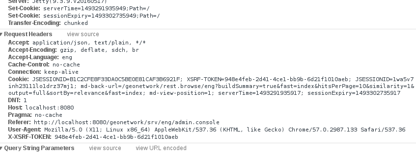

# Miscellaneous {#customizing-misc}

## Invalid CSRF Token

GeoNetwork has a security filter that prevents CSRF attacks. See more info about this type of attack on <https://www.owasp.org/index.php/Cross-Site_Request_Forgery_(CSRF)> . All calls to POST, DELETE and PUT endpoints without the proper token will return an error.


By default, all AngularJS requests will take care of this token, but all third party APIs and custom user interface calls will have to manually add this token to the request. The token is stored on a cookie called XSRF-TOKEN. This cookie contains a string that has to be added to all requests either by a parameter called "_csrf" or by a header called X-XSRF-TOKEN.



### Example of CSRF call using curl {#example-csrf-curl}

First, do a call to a POST endpoint to get the session and the csrf

``` bash
$rm -f /tmp/cookie; curl -c /tmp/cookie http://localhost:8080/geonetwork/srv/eng/info?type=me -X POST ; cat /tmp/cookie

   <html>
   <head>
   <meta http-equiv="Content-Type" content="text/html;charset=utf-8"/>
   <title>Error 403 Expected CSRF token not found. Has your session expired?</title>
   </head>
   <body><h2>HTTP ERROR 403</h2>
   <p>Problem accessing /geonetwork/srv/eng/info. Reason:
   <pre>    Expected CSRF token not found. Has your session expired?</pre></p><hr><a href="http://eclipse.org/jetty">Powered by Jetty:// 9.3.9.v20160517</a><hr/>

</body>
</html>
# Netscape HTTP Cookie File
# https://curl.haxx.se/docs/http-cookies.html
# This file was generated by libcurl! Edit at your own risk.

localhost       FALSE   /geonetwork     FALSE   0       XSRF-TOKEN      3825c5f1-49b3-4c62-bc3a-1916d5872d02
```

Then, using the cookie and the token, you can do whatever you want:

``` bash
$curl -v -X POST "http://localhost:8080/geonetwork/srv/eng/info?type=me" -H "X-XSRF-TOKEN: 3825c5f1-49b3-4c62-bc3a-1916d5872d02" --user admin:admin -b /tmp/cookie
*   Trying ::1...
 * TCP_NODELAY set
   * Connected to localhost (::1) port 8080 (#0)
     * Server auth using Basic with user 'admin'
       > POST /geonetwork/srv/eng/info?type=me HTTP/1.1
       > Host: localhost:8080
       > Authorization: Basic YWRtaW46YWRtaW4=
       > User-Agent: curl/7.52.1
       > Accept: */*
       > Cookie: XSRF-TOKEN=3825c5f1-49b3-4c62-bc3a-1916d5872d02
       > X-XSRF-TOKEN: 3825c5f1-49b3-4c62-bc3a-1916d5872d02
       >
       < HTTP/1.1 200 OK
       < Date: Wed, 17 May 2017 08:52:05 GMT
       * Added cookie JSESSIONID="1na1v7dpu7d7bcsnelvh0vnvn" for domain localhost, path /geonetwork, expire 0
         < Set-Cookie: JSESSIONID=1na1v7dpu7d7bcsnelvh0vnvn;Path=/geonetwork
         < Expires: Thu, 01 Jan 1970 00:00:00 GMT
         * Added cookie serverTime="1495011125647" for domain localhost, path /, expire 0
           < Set-Cookie: serverTime=1495011125647;Path=/
           * Added cookie sessionExpiry="1495011125647" for domain localhost, path /, expire 0
             < Set-Cookie: sessionExpiry=1495011125647;Path=/
             < Content-Type: application/xml; charset=UTF-8
             < Pragma: no-cache
             < Cache-Control: no-cache
             < Expires: -1
             < Transfer-Encoding: chunked
             < Server: Jetty(9.3.9.v20160517)
             <
             <?xml version="1.0" encoding="UTF-8"?>
             <info>
               <me authenticated="true">
                 <profile>Administrator</profile>
                 <username>admin</username>
                 <id>1</id>
                 <name>admin</name>
                 <surname>admin</surname>
                 <email />
                 <organisation />
                 <hash />
               </me>
             <env>
             <baseURL>/geonetwork</baseURL>
             <node>srv</node>
           </env>
         </info>

* Curl_http_done: called premature == 0

* Connection #0 to host localhost left intact
```

## Using the H2 database {#using-h2-database}

!!! info "Important"

    The instructions below should only be used to examine the database for trouble-shooting purposes as it is possible to corrupt it using this method. Always take a backup first before making any changes!


If you are using the default embedded H2 database and you need to examine the tables, you can do so using a Graphical UI. Two that have been tested are:

-   dbeaver (<http://dbeaver.io>)
-   h2's own tool (<http://www.h2database.com/html/download.html>)

The following approach uses the h2 tool.

### Find the Geonetwork database

This is called `gn.h2.db`. The location is dependent on which web server you are using, and where your data directory is. See [Configuring the database](../install-guide/configuring-database.md) for more information. Note that on windows you will need to use a path of the form `driveletter/path/to/gn.h2.db`.

### Using the H2 tool

Download the platform independent zip file from <http://www.h2database.com/html/download.html> and unblock/extract it. At a command prompt change to the following directory:

`h2/bin`

Note that using the included bat or shell scripts to access the database seem to show errors, so the command prompt approach is recommended.

Make a note of the URL to your database. This will be of the form:

`jdbc:h2:path/to/gn`

Note do not include `.h2.db` at the end of the path.

Type the following command to access the tool:

`java -cp h2*.jar org.h2.tools.shell`

You will be asked for the URL, which you made a note of above. The default credentials are:

-   username: www-data
-   password: www-data

You may need to do one or other of the following:

-   Shut down GeoNetwork
-   Remove the lock file `gn.lock.db`
-   Give write permissions on `gn.h2.db`

When you have successfully connected you will see a prompt as below, where you can enter SQL commands. These should end with a semicolon.

`sql>`

A useful command reference can be found at <http://www.h2database.com/html/commands.html>

To leave the tool, type `quit` and press enter.
