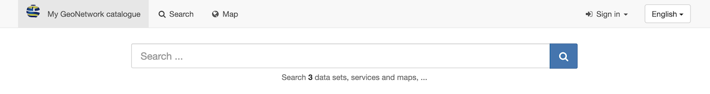
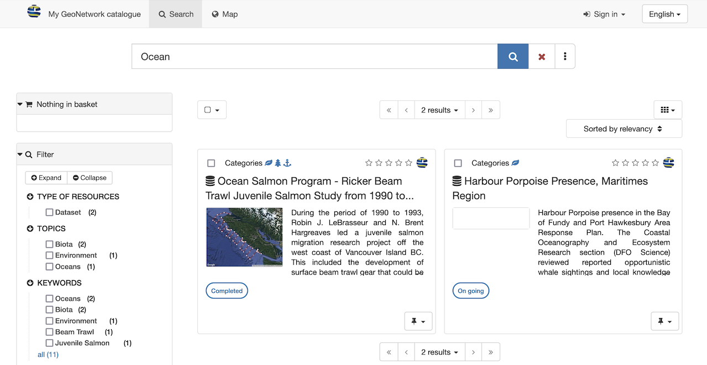

---
tags:
- Search
- Catalog
- Topics
- Grid
- List
- Home
hide:
  - tags
---

# Home

The Catalogue page is used to browse records, and has provides a quick search field.

## Search Catalogue

1.  Enter the desired keywords and search terms into the **Search** field
    at the top of the page and press the **:fontawesome-solid-magnifying-glass: Search** button
    (or use the ++enter++ key), to list search results.

    

    
    

    *Search field*

2.  Search for complete words.

    Use **Search** field to enter: `Ocean`
    
    Results are shown on the **Search** tab.

    

    
    

    *Search results for Ocean*

3.  Search using the wildcard `*` to match the start or end of word. 
    Keep in mind the entire record contents is searched, not only the
    titles and description.
    
    Use **Search** field to enter: `Area*`

    

    
    

    *Search for start of a word*

4.  The wildcard `*` can also be used multiple times to match part of a word.

    Use **Search** field to enter: `*brass*`

    

    
    

    *Search for part of a word*

5. Search results are shown on the **Seach** tab, which allows filtering and exploring of records.

## Browse Catalogue

1.  Navigate to **My GeoNetwork catalogue** to browse records.
    In a production system the catalogue name and logo will
    match your organisation or project team.

2.  The catalog page can be explored using the quick lists of:

    -   **Latest news**: recently updated records
    -   **Most popular**: frequently used records
    -   **Comments**: records with new comments and discussion

    

    
    

    *Latest news*

3.  Records are displayed as 
    -    :fontawesome-solid-table-cells-large: block list
    -    :fontawesome-solid-bars: large list
    -    :fontawesome-solid-align-justify: small list
    
    using the toggle on the right.

    Click on any of the listed records to view.

    

    
    

    *Large list display of records*

4.  The catalog page provides a number of quick searches to browse
    catalog contents:

    -   Use **Browse by Topics** to
        explore records based on subject matter.
    -   Use **Browse by Resources** to
        explore different kinds of content.

    Each option lists "search facets" (shown as small bubbles), click
    on a "search facet" such as `Dataset` to explore.

    
    *Browse metadata catalogue*

