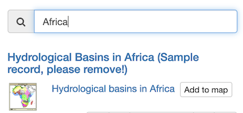

---
tags:
- Map
- Layers
- Background Layers
- Measure
hide:
  - tags
---

# Map

The Catalogue includes an interactive map that is used to preview datasets.

!!! info "How do I?"

    [Visualizing Data](visualize/index.md)

## Map area

The map viewer has a number of features to explore the data:

* Interactive map used to preview content.
  
  Use the mouse to pan and zoom the map.

* Controls used to add and manage map contents.

* Navigation including **Zoom in**, **Zoom out**, **Zoom to extent**.

* Location search including searching for your current position.

  
  *Map viewer*

## Add layers

The interactive map views datasets as distinct layers. Layers can be drawn from a wide range of data sources.

### Map

Use records in the catalogue that include a saved map:

1. From the **Map** viewer, press **Add layer** control, and change to **Map** tab.

   This tab lists records that include saved Map.

2. Use the **Search** field to locate the record to display.

3. Use **Add to map** to include map contents.

### Search

Make use of records in the catalogue with web mapping services:

1.  From the **Map** viewer, press **Add layer** control, and change to **Search** tab.
 
    
    *Add layer from search*
   
2.  Use the **Search** field to locate the record to display.
   
    Only records with **Add to map** are listed.

    
    *Search* 

3.  Press **Add to map** to visualize the dataset.

### Add layers services

Use web mapping service:

1. From the **Map** viewer, press **Add layer** control, and change to **Search** tab.

   

2. To browse contents of a Web Map Service, supply a the service description URL
   (known as ``GetCapabilities`` document).
   
   **type a WMS service URL:**
   :   ``https://maps.geocat.net/geoserver/geocat/ows?service=wms&version=1.3.0&request=GetCapabilities``
   
   The Web Map Service contents are immediately listed.

3. Use WMS layers **Search** field to locate ``Coastline`` layer.
   
   **Search**
   :   ``Coastline``
   
   
   *Add WMS Layer*

4. Press **:fontawesome-solid-plus: Add to map**.

5. Use the WMS layers **Search** field to locate the ``Countries`` layer.

   **Search**
   :   ``Countries``
   
   Press the **:fontawesome-solid-paintbrush: Layer styles** to list styles available
   for the ``Countries`` layer.

   
   *Add WMS Layer style*
   
6. Locate the ``mapcolor9` layer style, and press **Add to map**.

### Add files

Use **`KML`** files on the map.

## Manage layers

### Layer order

1.  From the **Map** viewer, press **Manage layers** control

    
    *Manager layers*
    
2. Placing the cursor over a layer shows **Move layer up**, **Move layer down**, and **Remove layer** button.
    
    
    *Move layer up*
    
3. Use these buttons to mange the layer order, and remove layers.

### Background map

1.  From the **Map** viewer, press **Manage layers** control

2.  Change the **Background map** from `OpenStreetMap` to `Stamen Watercolor`.
    
    
    *Manage basemap*

## Legend

1.  From the **Map** viewer, press **Legend** control

    
    *Legend*

## Filter data

Select a `WFS` layer to filter content, using a CQL query.

## Use a WPS process

Use a Web Processing Service to perform analysis and display the result.

## Maps

### Download map

1.  From the **Map** viewer, press **Maps** control

2.  Press ***Download --> OGC context (XML)** button

### Load map

1.  From the **Map** viewer, press **Maps** control

2.  Press ***Load --> From file** button.
    
    Select a previously downloaded OGC context file.

### Load map reset to default

1.  From the **Map** viewer, press **Maps** control

2.  Press ***Load --> Default map** button.

## Print

## Measure

## Annotation
   
## Synchronize all layers

## Zoom in/out, zoom to extent

## Switch 2D to 3D

## Graticule

