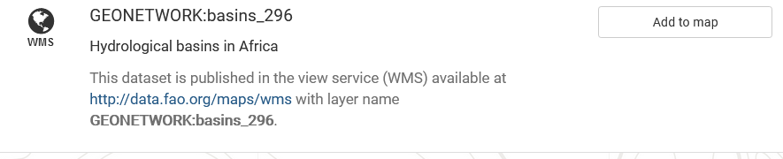

# Visualizing Data

All employees can use the data catalogue to search and discover
environmental and scientific data. To begin, simply navigate to the Data
Catalogue homepage and select a search type.

!!! Overview

    Geospatially enabled data in the data catalogue can be visualized using the interactive web map viewer feature.

!!! Process

    Discover > Combine Data/Select Data --> Visualize

!!! Related training

    Discovering Data, Accessing Data

!!! Before You Start

    There are no conditions to using this feature. Anyone accessing the Data
    Catalogue can visualize geospatial data with the map viewer.

## Discover

1.  To begin visualizing geospatial data, simply locate the data using
    the data catalogue's search functionality (for more information,
    see Discovering Data).

2.  If a dataset can be visualized using the map viewer you will see two
    additional buttons: a globe or globe with drop down menu, and the
    pushpin with drop down menu.

    
    *Add to map and view on map buttons*

    These allow you to:

    -   view on map, which will open the selected dataset in the map
        viewer, or
    -   choose layers to view on map, which will open the selected
        layers in map viewer, or
    -   add the dataset to the Map, where you can combine multiple
        datasets to view in a single map.

## View Data

3.  To view a single dataset on the map viewer, press the
    **View on map*** button for that dataset. The map viewer will open
    and display the data.

    \[screenshot of search result, arrow points to view on map button\]

## Combine Data

4.  By adding datasets to the Map Preview you are able to overlay
    multiple datasets into a single viewer. This can be used to generate
    new insights and support decision making.

    \[screenshot of example displayed in map viewer\]

    Add datasets to the preview list by pressing **Add to map list** 
    button (see pushpin icon) on each dataset from the search results
    page or metadata details.

    \[screenshot of search result and arrow to add to map preview
    button\]

5.  The **Add to map list** with your selected datasets will display on
    the left-hand side of the search results page. At any time you can:

    \[screenshot of map preview list\]

    -   remove data you have added to the preview by clicking the **X**
        beside the title
    -   combine and visualize the datasets by clicking **Add to map**.
        Select the **Map** tab in the administration menu to view the
        results.

## Visualize

6.  Whether you have selected one or multiple datasets to visualize, the
    map viewer has a number of features to explore the data.

    \[screenshots of map viewer with expanded panel -- ie) add layers,
    manage layers, etc\]
