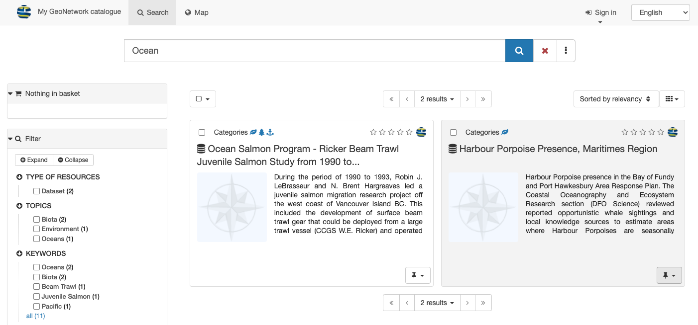
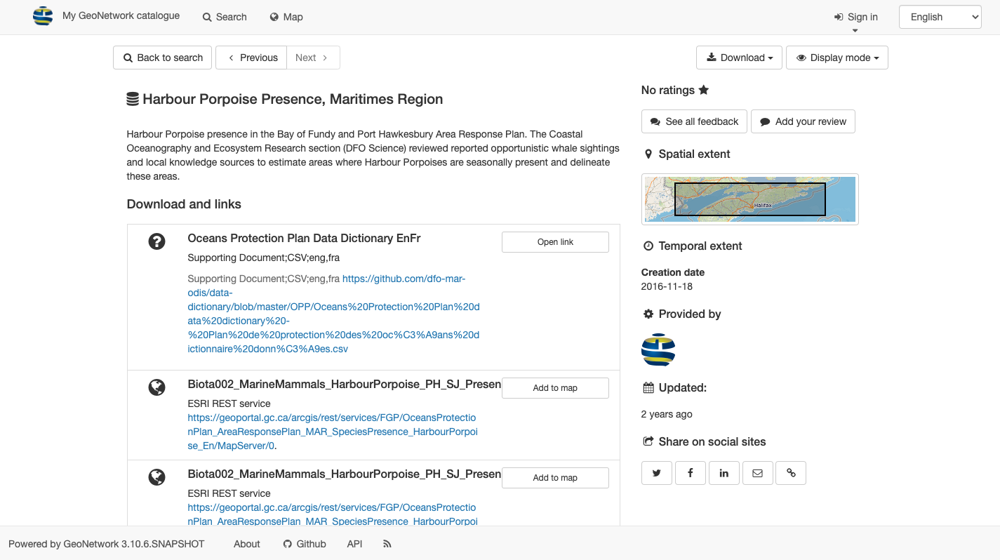
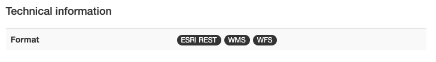
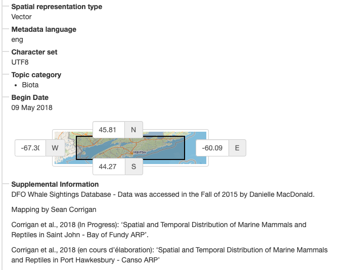
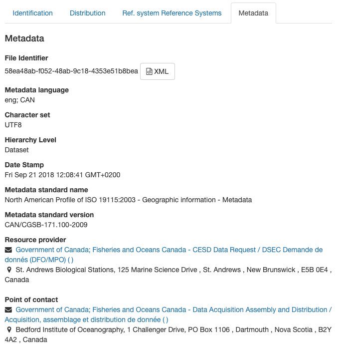
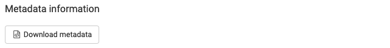
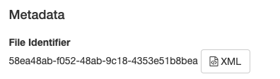
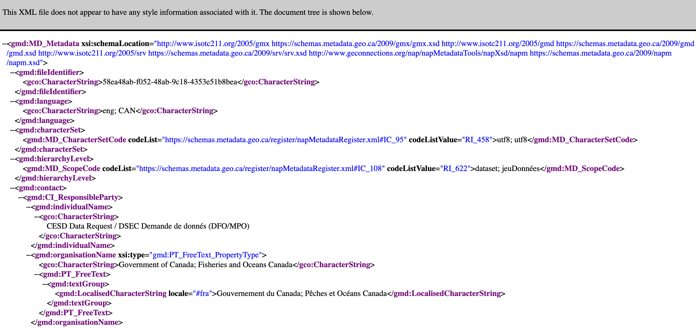

# View Record

View record contents to discovering more in depth details about record and the dataset described.

Locate record to view:

1.  Use **Search** field: `Ocean`

2.  Locate the record with title `Ocean`.

    The background of the record will change to gray when your mouse is
    over the `Harbour Porpoise Presence, Maritimes Region` record.
    
    Click on the record to view.

    

    
    

    *Search Ocean*

3.  The record contents are displayed, using the initial
    **Default View** display mode.

    

    
    

    *Default view*

4.  Record actions for viewing and download:

    -   **Next** and **Previous** buttons used to review search results.
    -   **Download** used to [export record](#download-from-record-view)
        as `ZIP`, `XML` or `PDF`.
    -   The **Display mode** drop-down to change between **Default View**
        and **Full View** covered in the next section.

    

    
    

    *Record actions*

## Default View

The **Default view**, provides a quick summary of record contents:

1.  Use **Display mode** drop-down menu to select **Default view**.

    

    
    

    *Change display mode to default view*

2.  Record title and description are shown at the top of the page.

    
    *Record description*

3.  **About this resource** provides information on the contents, such as topic category.

    
    *About this resource*

4.  **Technical information** provides details such data format.

    
    *Technical information*

5.  **Metadata information** provides a button to download the XML record, contact information, and the
    unique identifier.

    
    *Metadata information*

6.  On the right hand side:

    -   **Spatial extent** is shown visually on a map
    -   Information on updates and feedback.

    

    
    

    *Default view*

## Full View

The **Full view** is used to show complete record contents.

1.  Use **Display mode** drop-down menu to select **Full view**.

2.  The advanced view divides the record up into a number of tabs:

    -   Identification
    -   Distribution
    -   Quality
    -   Spatial Representation
    -   Reference Systems
    -   Metadata

3.  The **Identification** tab provides:

    -   Citation information:
        
        
        *Citation details*
        
    -   Status and legal constraints (such as the Data Dissemination
        Policy).
        
        
        *Abstract and keywords*
        
    -   Additional information including temporal and spatial extent
        
        
        *Additional identification information*
    
4.  The **Distribution** tab has details on how the content can be accessed.

    
    *Data distribution details*

5.  The **Quality** tab lists data quality information.

    
    *Data quality details*

6.  The **Spatial rep.** tab provides a summary of the spatial representation.

    
    *Spatial representation details*

7.  The **Reference System** tab covers information on the spatial reference system used.

    This is provided as a machine readable code to the reference system.
    
    The example uses the code  `http://www.opengis.net/def/crs/EPSG/0/26917` for the 
    `NAD83 / UTM zone 17N]` reference system.

8.  The **Metadata** tab covers the unique File Identifier, providing a link to view the XML document,
    along with point of contact information for the record.

    
    *Record metadata details*

## XML Record

1.  The XML record can be shown from either:

    -   **Default View** metadata heading provides a **Download metadata** button.
        
        
        *Default view download metadata*
    
    - **Full View** metadata tab provides a link to **XML**.

       
       *Full view download metadata*
    
2.  The XML file is downloaded, or shown directly in your browser.

    

    
    

    *XML download shown in FireFox*

3.  Keep in mind XML record does not include any attached documents or thumbnails.

    To download complete record information see the download section.
    
## Download from record view

Download the contents of a single record.

1.  View the `Harbour Porpoise Presence, Maritimes Region` record, showing a number of **:fontawesome-solid-download: Download** options:

    

    
    

    *Record download options*

2.  **Permalink** provides a URL that
    can be shared via email or message.

    
    *Permalink to GEODBA.ACCOMMODATIONS record*

    Use ++control+c++ (or ++command+c++ on macOS) to copy text to clipboard:

    
    *Permalink copied*

3.  **Export (ZIP)** archive including:

    -   A folder containing complete **`metadata.xml`** record, and simplified
        ***`metadata-iso19139.xml`*** record.
    -   ***`index.html`** and **`index.csv`** summary described in
        the [previous section](#download-from-search-results).

    
    *Export (ZIP) index.html summary*

    This file is useful for exchanging information between systems. The
    archive contents follows the "Metadata Exchange Format" convention
    used to share records between catalogs.

4.  **Export (PDF)** document.

    

    
    

    *Export (PDF) document*

5.  **Export (XML)** machine readable
    document.

    

    
    

    *XML download shown in FireFox*

6.  **Export (RDF)** machine readable
    definition of vocabulary used.

    This file is useful for exchanging information between systems.

