---
tags:
- Search
- Catalog
- Filter
- Grid
- List
hide:
  - tags
---

# Search

The **Search** tab lists search results for filtering and sorting.

## Search Catalogue

1.  Enter the desired keywords and search terms into the **Search** field
    at the top of the page and press the **:fontawesome-solid-magnifying-glass: Search** button
    (or use the ++enter++ key), to list search results.

    

    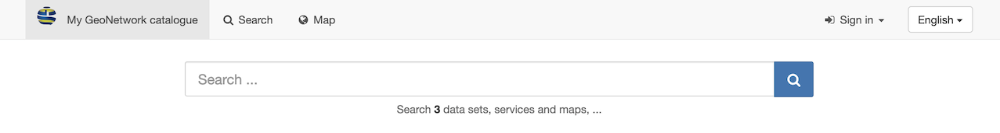
    

    *Search field*
    

2.  Search for complete words.

    Use **Search** field to enter: `Ocean`

    

    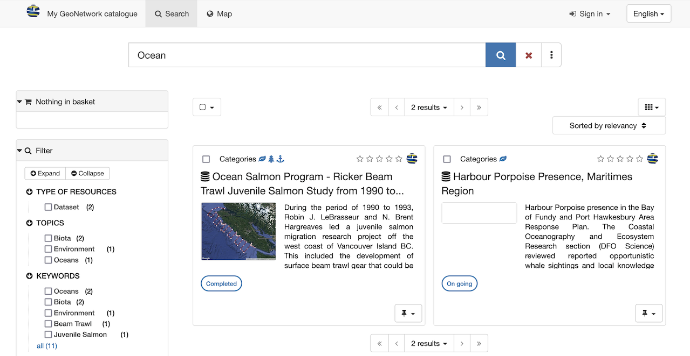
    

    *Search results for Ocean*

3.  Search using the wildcard `*` to match the start or end of word. 
    Keep in mind the entire record contents is searched, not only the
    titles and description.
    
    Use **Search** field to enter: `Area*`

    

    
    

    *Search for start of a word*

4.  The wildcard `*` can also be used multiple times to match part of a word.

    Use **Search** field to enter: `*brass*`

    

    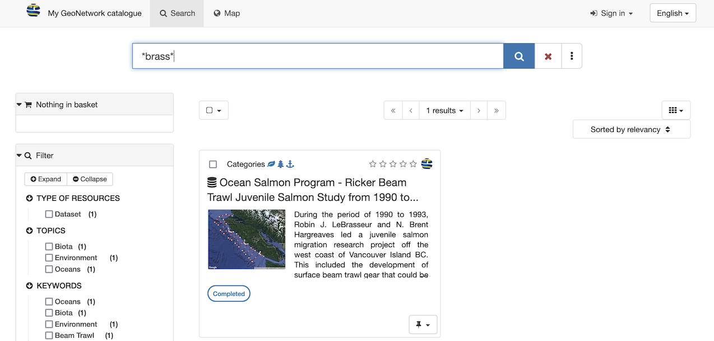
    

    *Search for part of a word*

5. Filtering and exploring [search results](#search-results) is described below.

## Search Results

To further explore listed records:

1.  Navigate to the **:fontawesome-solid-magnifying-glass: Search** page (or browse or search the catalogue to
    list search results).

    

    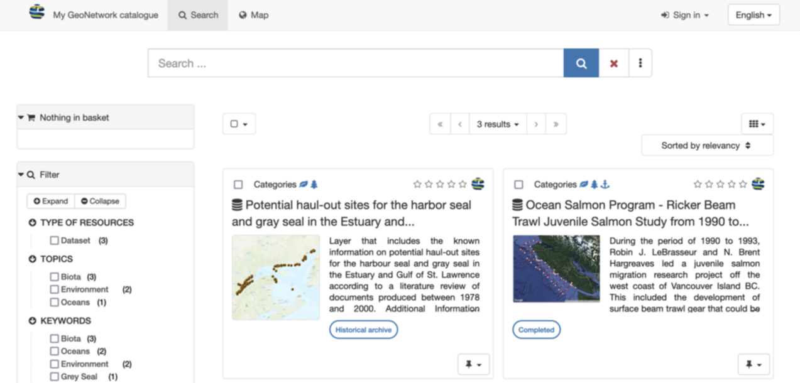
    

    *Search page*
    
2.  Use the **:fontawesome-solid-magnifying-glass: Filter** section on the right hand side to refine search results
    using additional search facets, keywords, and details such as download format.
    
    Click on the "search facet" `Oceans` to filter the search results to
    matching records.

    

    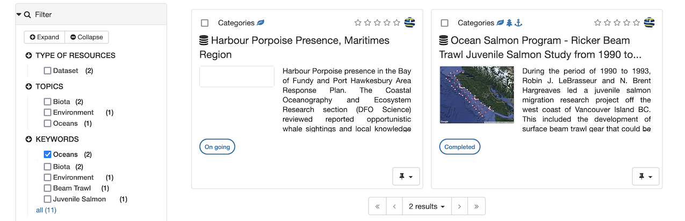
    

    *Filter results*

3.  Options are provided at the top of the search results to:
    
    * Presentation of matching records (as a **:fontawesome-solid-table-cells-large: Grid**
    or **:fontawesome-solid-bars: List**)
    * Sort the results
    * Manage how many results are shown per page
    * Advance to additional pages of results
    * Quickly select records

    

    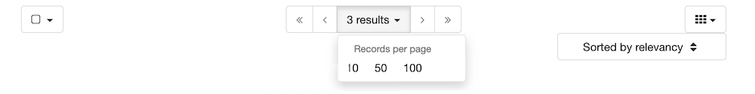
    

    *Browse results*

4.  To clear the search results use **:fontawesome-solid-xmark: Clear current search query, filters, and sorts** 
    at any time. This button is located in the **Search** field at the top of the page.

5.  The **:fontawesome-solid-ellipsis-vertical: Advanced** search options are located in the 
    **Search** field at the top of the page.
    
    These options can be used to further refine search results by category, keywords, contact
    or date range.

    

    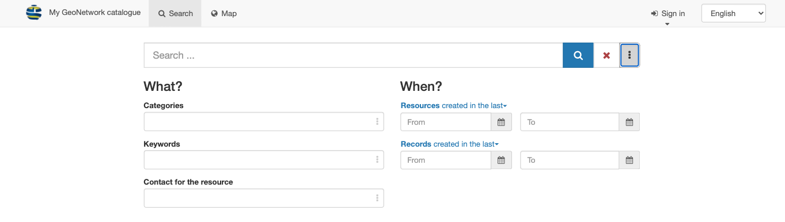
    

    *Advanced search options*

6.  Open the **:fontawesome-solid-ellipsis-vertical: Advanced** search options panel.
    
    Use the drop down menu for **Records created in the last** to select `this week`.
    This acts as a short cut to fill in the **From** and **To** calendar fields.
    
    Press the **:fontawesome-solid-magnifying-glass:  Search** button to filter using this date range.

    

    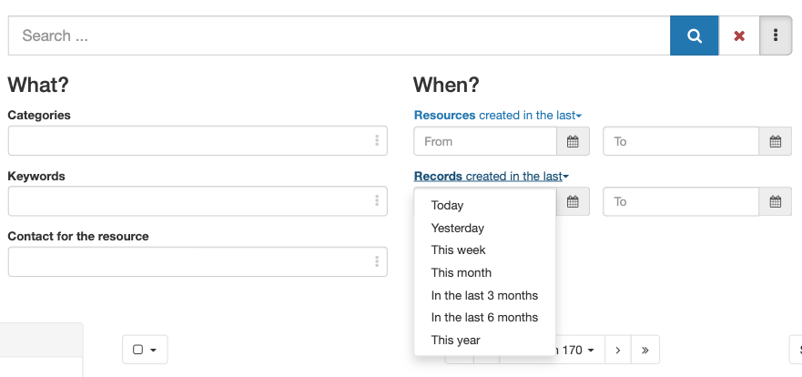
    

    *Record updated in the last week*

7.  To search for data in the year `2016` use the advanced search
    options to fill **Resources created in the last** in:
    
    **From**
    :   `2016-01-01`
    
    **To**
    :   `2016-12-31`
    
    Press **Search** button to show data from `2016`.

    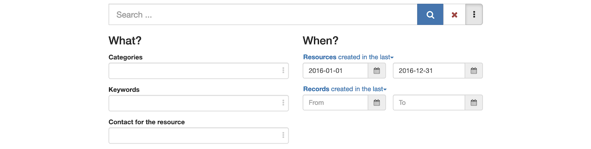
    *Resource updated in 2016*
    
    !!! note

        The **Resource** date filter shows records with data identification
        (creation, publication, revision) dates included within the
        calendar date range.

8.  A slide out map is provided at the bottom of the page, providing
    visual feedback on the extent of each record.

    

    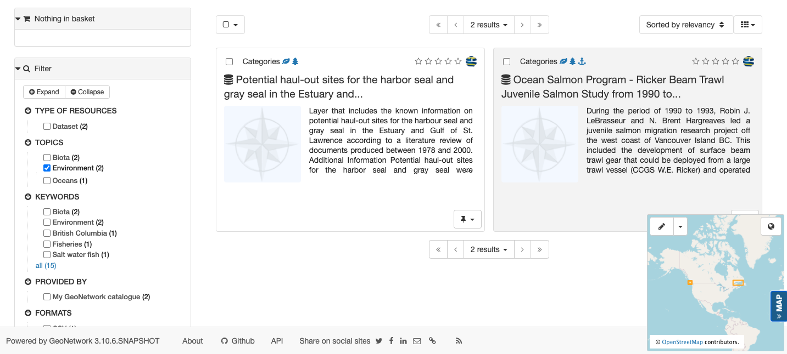
    

    *Search map*

    The map can be controlled by by toggling beween two modes:

    -   Pan: Click and drag the map location, using the mouse wheel to
        adjust zoom level.

    -   Bounding Box: Hold ++shift++ and click and drag to define an extent used to filter
        records.
        
        The drop down controls if the extent is used to list
        only records that are withing, or all records that intersect.
        
        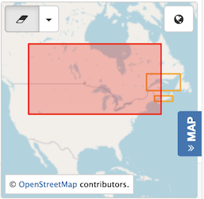
        *Search bounding box intersects*

9.  Records are selected (using the checkbox located next to each one)
    to quickly download or generate a PDF of one or more records.

    

    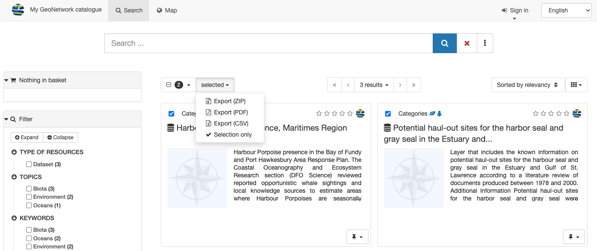
    

    *Selected Records*

10.  Additional tips and tricks with search results:

    -   Details on
        [selecting multiple records and exporting](#download-from-search-results)
        as a `ZIP` or `PDF`.

## Download from search results

Multiple metadata records can be exported for download.

To select records from multiple search results:

1.  Use the **Search** field to enter: `Ocean`

    
    *Search results for Ocean*

2.  Use the checkboxes next to each record to select the contents for
    download.

    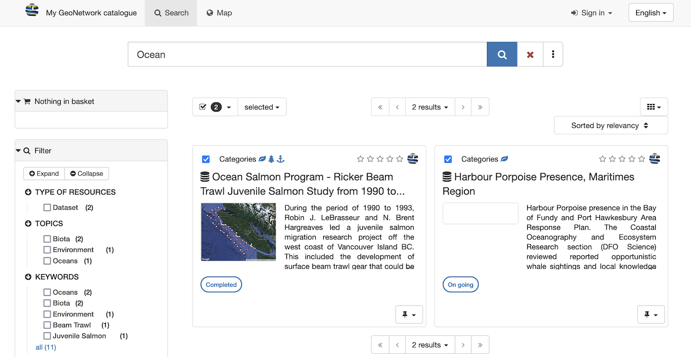
    **Select records for download**

3.  At the top of the page the number of selected records is shown.

    Next to the number of selected records is a **selected** drop-down,
    offering a number of export options for download.
    
    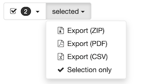
    *Export options for download*

4.  **Export (ZIP)** archive including `xml` records along with any
    attachments and thumbnails.

    The resulting file includes:

    -   A folder for each metadata record exported

    -   ***`index.html`*** summary of contents

        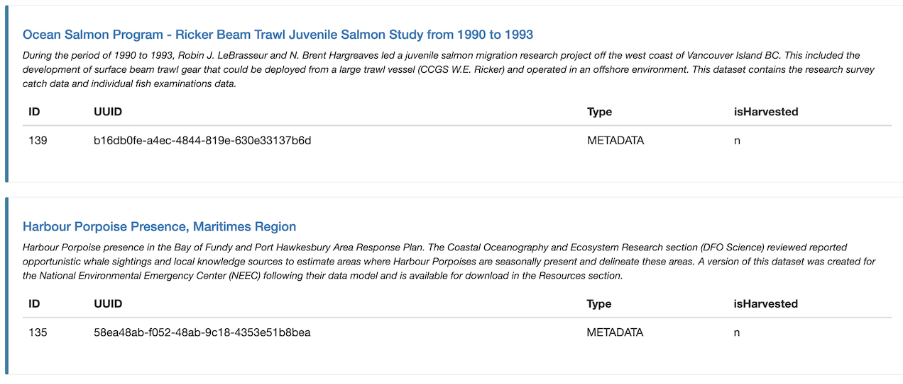
        *Export ZIP index summary*

    -   ***`index.csv`*** summary of contents

        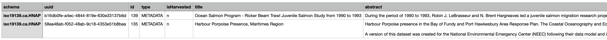
        *Export ZIP csv summary*

5.  **Export (PDF)** document of
    exported records.

    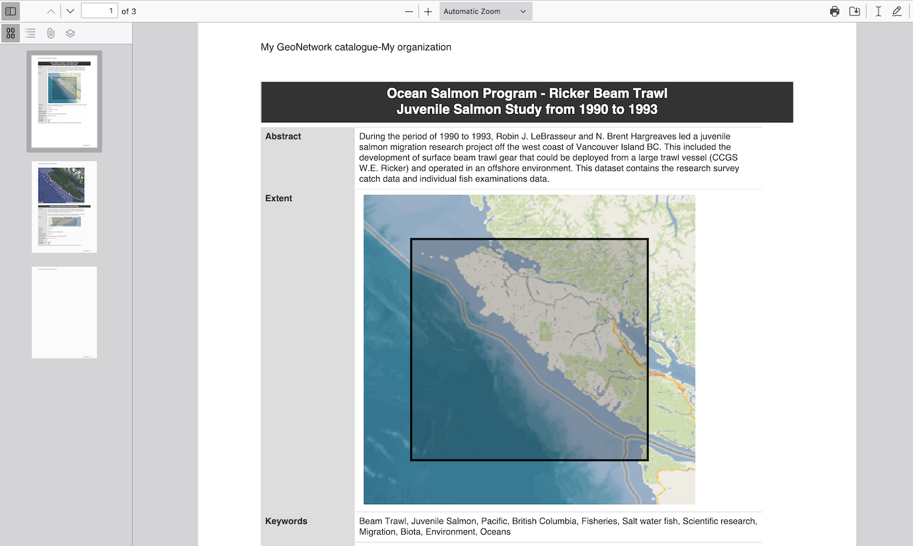
    *Export PDF in Firefox*

6.  **Export (CSV)** download providing
    a tabular summary of exported records.

    
    
    *Export CSV*
