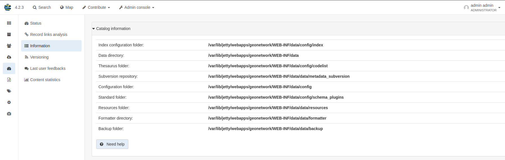

# Customizing the data directory {#customizing-data-directory}

The data directory is the location on the file system where the catalog stores much of its custom configuration and uploaded files. This configuration defines such things as:

-   What thesaurus is used by GeoNetwork?
-   What schema is plugged in GeoNetwork?

The data directory also contains a number of support files used by the catalog for various purposes:

-   index configuration
-   logos
-   uploaded document attached to metadata records
-   thumbnails

It is a good idea to define an external data directory when going to production in order to make future updates easier. The data directory allows to run the WAR in readonly mode if needed.

## Creating a new data directory

The data directory needs to be created before starting the catalogue. It must be readable and writable by the user starting the catalogue.

If the data directory is an empty folder, the catalogue will initialize the directory default structure using `INSTALL_DIR/web/geonetwork/WEB-INF/data`.

If the data directory is not set, the following message is displayed in the log when the application starts:

``` shell
2015-12-16 07:59:17,108 WARN  [geonetwork.data.directory] -     - Data directory properties is not set. Use geonetwork.dir or geonetwork.dir properties.
2015-12-16 07:59:17,108 WARN  [geonetwork.data.directory] -     - Data directory provided could not be used. Using default location: /data/dev/gn/3.0.x/web/src/main/webapp/WEB-INF/data
```

If the data directory is not accessible for the user, the log displays:

``` shell
2015-12-16 08:09:17,723 WARN  [geonetwork.data.directory] -     - Data directory '/tmp/gndatadir' is not writable. Set read/write privileges to user starting the catalogue (ie. francois).
2015-12-16 08:09:17,723 WARN  [geonetwork.data.directory] -     - Data directory provided could not be used. Using default location: /data/dev/gn/3.0.x/web/src/main/webapp/WEB-INF/data
```

## Setting the data directory

The data directory variable can be set using:

-   Java environment variable
-   Servlet context parameter
-   System environment variable
-   Bean configuration (added in version 3.0.4)

For Java environment variable and servlet context parameter use:

-   <webappName>.dir and if not set using geonetwork.dir

For system environment variable use:

-   <webappName>_dir and if not set using geonetwork_dir

Resolution order is:

1.  <webappname>.dir
    1.  Java environment variable (ie. -D<webappname>.dir=/a/data/dir)
    2.  Servlet context parameter (ie. web.xml)
    3.  Config.xml appHandler parameter (ie. config.xml)
    4.  System environment variable (ie. <webappname>_dir=/a/data/dir). "." is not supported in env variables
2.  geonetwork.dir
    1.  Java environment variable (ie. -Dgeonetwork.dir=/a/data/dir)
    2.  Servlet context parameter (ie. web.xml)
    3.  Config.xml appHandler parameter (ie. config.xml)
    4.  System environment variable (ie. geonetwork_dir=/a/data/dir). "." is not supported in env variables

## Java System Property

Depending on the servlet container used it is also possible to specify the data directory location with a Java System Property.

For Tomcat, configuration is:

``` shell
CATALINA_OPTS="-Dgeonetwork.dir=/var/lib/geonetwork_data"
```

## Bean configuration

!!! info "Version Added"

    3.0.4


To configure the data directory using a custom bean configuration, update the GeonetworkDataDirectory bean in `core/src/main/resources/config-spring-geonetwork.xml`:

``` xml
<bean id="GeonetworkDataDirectory" class="org.fao.geonet.kernel.GeonetworkDataDirectory" lazy-init="true">
  <property name="systemDataDir" ref="GNSystemDataDir"/>
  <property name="schemaPluginsDir" ref="GNSchemaPluginsDir"/>
</bean>
<bean id="GNSystemDataDir" class="java.nio.file.Paths" factory-method="get">
   <constructor-arg index="0" value="/path/to/gn/dir"/>
   <constructor-arg index="1"><array /></constructor-arg>
</bean>
<bean id="GNSchemaPluginsDir" class="java.nio.file.Paths" factory-method="get">
    <constructor-arg index="0" value="/path/to/schema/dir"/>
    <constructor-arg index="1"><array /></constructor-arg>
</bean>
```

## Using a S3 object storage

If your infrastructure doesn't have a persistent storage available, you can configure GeoNetwork to use an Amazon S3 (or compatible) object storage to store the images and data.

In order to do that, you must use a custom bean configuration. Replace the `filesystemStore`, `resourceStore` and `resources` beans in `core/src/main/resources/config-spring-geonetwork.xml` with something like that:

``` xml
<bean id="s3credentials" class="org.fao.geonet.resources.S3Credentials">
  <property name="region" value="eu-west-1"/>
  <property name="bucket" value="geonetwork-test"/>
  <property name="keyPrefix" value="geonetwork"/>
  <!-- Only needed if you don't have a ~/.aws/credentials -->
  <property name="accessKey" value="MyAccessKey"/>
  <property name="secretKey" value="MySecretKey"/>
  <!-- Only needed when not using Amazon S3-->
  <property name="endpoint" value="sos-ch-dk-2.exo.io"/>
</bean>
<bean id="filesystemStore" class="org.fao.geonet.api.records.attachments.S3Store" />
<bean id="resourceStore"
      class="org.fao.geonet.api.records.attachments.ResourceLoggerStore">
  <constructor-arg index="0" ref="filesystemStore"/>
</bean>
<bean id="resources" class="org.fao.geonet.resources.S3Resources"/>
```

The `s3credentials` bean can be left empty and the following system environment variables can be used to configure it (convenient in a container environment):

-   AWS_S3_PREFIX
-   AWS_S3_BUCKET
-   AWS_DEFAULT_REGION
-   AWS_S3_ENDPOINT
-   AWS_ACCESS_KEY_ID
-   AWS_SECRET_ACCESS_KEY

## Structure of the data directory

The data directory contains:

``` text
data_directory/
 |--config: Extra configuration (eg. could contain overrides)
 |   |--schemaplugin-uri-catalog.xml
 |   |--codelist: The thesauri in SKOS format
 |   |--index: Index configuration
 |   |--schemaPlugins: The directory used to store new metadata standards
 |
 |--data
 |   |--metadata_data: The data related to metadata records
 |   |--resources:
 |   |     |--htmlcache
 |   |     |--images
 |   |     |   |--harvesting
 |   |     |   |--logos
 |   |     |   |--statTmp
 |   |
 |   |--metadata_subversion: The subversion repository
 |   |--backup: Folder containing removed metadata
```

## Advanced data directory configuration

All sub-directories could be configured separately using Java system property. For example, to put the index config directory in a custom location use:

-   <webappName>.indexConfig.dir and if not set using:
-   geonetwork.indexConfig.dir

Examples:

-   Add the following Java properties to start-geonetwork.sh script:

``` shell
java -Xms1g -Xmx1g -Xss2M -XX:MaxPermSize=128m -Dgeonetwork.dir=/app/geonetwork_data_dir
```

-   Add the following system properties to start-geonetwork.sh script:

``` shell
export geonetwork_dir=/app/geonetwork_data_dir
```

-   If no changes are made to thesaurus or schema, it could be relevant to use the version from the webapp. In such case, set:

``` shell
-Dgeonetwork.dir=/data/catalogue
-Dgeonetwork.schema.dir=/app/tomcat/webapps/geonetwork/WEB-INF/data/config/schema_plugins
-Dgeonetwork.indexConfig.dir=/app/tomcat/webapps/geonetwork/WEB-INF/data/config/index
-Dgeonetwork.codeList.dir=/app/tomcat/webapps/geonetwork/WEB-INF/data/config/codelist
```

The list of properties that can be set are:

-   geonetwork.dir
-   geonetwork.indexConfig.dir
-   geonetwork.config.dir
-   geonetwork.codeList.dir
-   geonetwork.schema.dir
-   geonetwork.data.dir
-   geonetwork.resources.dir
-   geonetwork.svn.dir
-   geonetwork.upload.dir
-   geonetwork.backup.dir
-   geonetwork.formatter.dir
-   geonetwork.htmlcache.dir

## Check the configuration

After startup, check the configuration in `Admin console` --> `Statistics and status` --> `Information` page.


