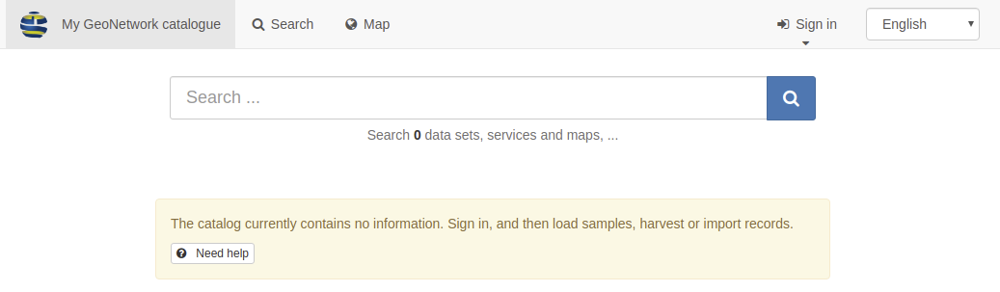

# Installing from WAR file

This section describes how to install GeoNetwork with the WAR.

At the end of the installation process you will end up with the web applications running.

Host ports requirements:

-   Java web server [Apache Tomcat](https://tomcat.apache.org/) or [Jetty](https://www.eclipse.org/jetty/): 8080
-   [Elasticsearch](https://www.elastic.co/elasticsearch/): 9200
-   [Kibana](https://www.elastic.co/kibana/): 5601
-   Database eg. 5432 for a default [PostgreSQL](https://www.postgresql.org/) installation


For  [Apache Tomcat](https://tomcat.apache.org/) we recommend the following versions: 8.5.x and 9.0.x. The latest Apache Tomcat 10.x cannot be used at this time.

For [Jetty](https://www.eclipse.org/jetty/) we the following versions: 9.4.x. Newer versions to Jetty cannot be used at this time.

1.  Download the WAR file

    GeoNetwork releases are available in <https://sourceforge.net/projects/geonetwork/files/GeoNetwork_opensource/>

    You can download the WAR file `geonetwork.war` from your browser or use command line like

    ``` shell
    wget https://downloads.sourceforge.net/project/geonetwork/GeoNetwork_opensource/v3.10.2/geonetwork.war
    ```

2.  Copy the WAR to the Java web server

    After download, copy the WAR file in the webapp folder of Tomcat or Jetty.

    ``` shell
    cp geonetwork.war /usr/share/apache-tomcat{X}/webapps/.
    ```

3.  Start the Java web server

    If started, Tomcat will automatically deploy the application. If not, start the Java web server to deploy.

    !!! note

        You need to ensure Tomcat is configured with enough memory for GeoNetwork to launch. This can be be configured via the `setenv` script in tomcat with the appropriate memory for the JAVA_OPTS property). `-Xms2g -Xmx2g` is usually fine.

    !!! note

        For the  `/monitor/metrics` endpoint to work correctly, you must add to `JAVA_OPTS` the following option: `--add-opens=jdk.management/com.sun.management.internal=ALL-UNNAMED` 

4.  Configure the search platform

    Open <http://localhost:8080/geonetwork> in your web browser. You should see the GeoNetwork home page indicating that the search is not yet available.

    

    You need to install Elasticsearch or to configure GeoNetwork to use an existing instance.

    Download Elasticsearch for your platform <https://www.elastic.co/downloads/elasticsearch>

    ``` shell
    wget https://artifacts.elastic.co/downloads/elasticsearch/elasticsearch-8.11.3-linux-x86_64.tar.gz
    tar xvfz elasticsearch-8.11.3-linux-x86_64.tar.gz
    cd elasticsearch-8.11.3-linux-x86_64/bin
    ./elasticsearch
    ```

    Open <http://localhost:9200> in your web browser to check that Elasticsearch is running.

    To use an existing instance check Configure connection in [Installing search platform](installing-index.md).

5.  Up and running?

    Open or refresh <http://localhost:8080/geonetwork> in your web browser. You should see the GeoNetwork home page:

    

    You have now a default GeoNetwork up and running.

    To customize your catalog, you may follow the next steps to configure the database (See [Configuring the database](configuring-database.md)) instead of using the default H2 database and the data directory (See [Customizing the data directory](customizing-data-directory.md)) .

    See [Loading templates and sample data](loading-samples.md) to start loading metadata records.
