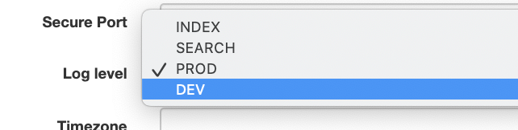

# Logging

This section describes how to use the geonetwork log files to find more details on incidents.

## Customising the log file location

The default log file location is `logs/geonetwork.log` (with backups created 
``geonetwork-1.log``, ``geonetwork-2.log``,...).

It is possible to change the directory where these log files are generated
with a Java system property  `log_dir`. The Java System property `log_dir`
is the name of a directory, and **does not end** with a `/`.

For the example `-Dlog_dir=/var/tomcat/logs` the files will be created in
`/var/tomcat/logs/geonetwork.log`, and will rotate through the filenames
`/var/tomcat/logs/geonetwork-1.log`,`/var/tomcat/logs/geonetwork-2.log`,...

To set the `log_dir` property, you can add it to the `JAVA_OPTS` in the startup 
script of your servlet container. For example, if you are using Tomcat, you 
can add it to the `setenv.sh` or `setenv.bat` file in the `bin` directory of 
your Tomcat installation.

Details of some errors, such as XSL transformation errors, are not written to 
`geonetwork.log`. They are written to a file called **`catalina.out`** (if 
using Tomcat).

## Setting the Loglevel

GeoNetwork by default has 4 log levels: PROD, INDEX, SEARCH, DEV.

-   PROD is the default option, it will only log critical errors.
-   INDEX is similar to PROD, but with extended logging around the indexation process.
-   Search is similar to PROD, but with extended logging around the search process.
-   DEV is the most extended level, all debug messages will be logged.

You can set the log level from the Admin --> Settings page.

## Log4j

GeoNetwork uses [Apache log4j](https://logging.apache.org/log4j) for logging. 
The log4j configuration files are located in the **`/WEB-INF/classes`** directory of the GeoNetwork web application:
**`/WEB-INF/classes/log4j2.xml`**, **`/WEB-INF/classes/log4j2-dev.xml`** and **`/WEB-INF/classes/log4j2-index.xml`**.
The configuration file configures for each debug level at what severity messages will be logged.

The file used is determined by the log level set in the *Admin* → *Settings* page.
