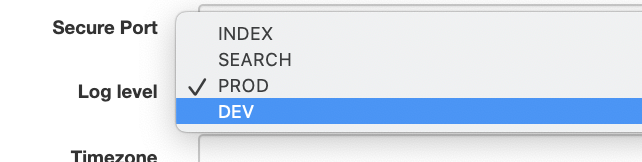

# Logging

This section describes how to use the geonetwork log files to find more details on incidents.

## Customising the log file location

The default log file location is `logs/geonetwork.log` (with backups created
``geonetwork-1.log``, ``geonetwork-2.log``,...).

It is possible to change the directory where these log files are generated
with a Java system property  `log_dir`. The Java System property `log_dir`
is the name of a directory, and **does not end** with a `/`.

For the example `-Dlog_dir=/var/tomcat/logs` the files will be created in
`/var/tomcat/logs/geonetwork.log`, and will rotate through the filenames
`/var/tomcat/logs/geonetwork-1.log`,`/var/tomcat/logs/geonetwork-2.log`,...

To set the `log_dir` property, you can add it to the `JAVA_OPTS` in the startup
script of your servlet container. For example, if you are using Tomcat, you
can add it to the `setenv.sh` or `setenv.bat` file in the `bin` directory of
your Tomcat installation.

Details of some errors, such as XSL transformation errors, are not written to
`geonetwork.log`. They are written to a file called **`catalina.out`** (if
using Tomcat).

## Setting the Loglevel

GeoNetwork by default has 5 log levels: PROD, INDEX, DEV, TEST, JSON.

-   PROD is the default option, it will only log critical errors.
-   INDEX is similar to PROD, but with extended logging around the indexation process.
-   DEV is the most extended level, all debug messages will be logged.
-   TEST is a simplified configuration useful for running tests, with fewer logger categories and a `warn` root level.
-   JSON outputs structured JSON logs suitable for log aggregation tools such as Elasticsearch/Kibana (ELK stack).

You can set the log level from the Admin --> Settings page.



## Log4j

GeoNetwork uses [Apache Log4j2](https://logging.apache.org/log4j) for logging.
The log4j configuration files are located in the **`/WEB-INF/classes`** directory of the GeoNetwork web application:
**`log4j2.xml`** (PROD), **`log4j2-dev.xml`** (DEV), **`log4j2-index.xml`** (INDEX), **`log4j2-json.xml`** (JSON) and **`log4j2-test.xml`** (TEST).
Each configuration file defines which log levels apply to each logger module.

The file used is determined by the log level set in the *Admin* → *Settings* page.

### Configuration structure

Each Log4j2 configuration file defines three appenders:

-   **Console** — writes to `SYSTEM_OUT` (stdout).
-   **RollingFile** (`File`) — writes to `geonetwork.log` in the log directory.
-   **Harvester** — a routing appender that writes to per-harvester log files (see [Harvester logging](#harvester-logging)).

The default `PatternLayout` format used by the Console and RollingFile appenders is:

```
%date{ISO8601} %-5level [%logger] - %message%n
```

Which produces output like:

```
2024-06-15T10:23:45,123 INFO  [geonetwork.harvester] - Starting harvester run
```

### Log file rotation

The `RollingFile` appender uses size-based rotation:

-   Maximum file size: **10 MB** per log file.
-   Up to **3 backup files** are kept, named `geonetwork.log-1.log`, `geonetwork.log-2.log`, `geonetwork.log-3.log`.
-   When the current log file exceeds 10 MB, it is rolled over and the oldest backup is deleted.

### Auto-discovery of configuration files

GeoNetwork scans `/WEB-INF/classes` for files matching the regex `log4j2(-(.*?))?.xml`. Any file that matches this pattern is automatically made available in the *Admin* → *Settings* log level dropdown. The matched group (e.g. `dev` from `log4j2-dev.xml`) is uppercased to form the display name. The base `log4j2.xml` without a suffix is displayed as **PROD**.

## Harvester logging

Harvester logs are written to separate files via a **Routing** appender. Each harvester gets its own log file, dynamically named based on the harvester's thread context (`ctx:logfile` and `ctx:harvester`).

-   The log file name is determined at runtime from the harvester context.
-   If no specific context is set, logs go to `harvester_default.log` in the log directory.
-   Harvester log files use the `PatternLayout` with timezone-aware timestamps:
    ```
    %date{ISO8601}{${ctx:timeZone}} %-5level [%logger] - %message%n
    ```
-   Even when JSON logging is enabled, harvester logs continue to use plain-text `PatternLayout` since they are consumed separately from the main log file.

## Logger modules

The Log4j2 configuration files define logger categories that administrators can adjust. Each log level preset (PROD, INDEX, DEV, etc.) sets these loggers to different levels.

### GeoNetwork loggers

The main GeoNetwork logger `geonetwork` controls the base level for all GeoNetwork modules. Submodule loggers inherit from it unless explicitly configured:

| Logger | Description |
|--------|-------------|
| `geonetwork.accessmanager` | Access control and permissions |
| `geonetwork.atom` | ATOM feed support |
| `geonetwork.csw` | CSW service |
| `geonetwork.csw.search` | CSW search operations |
| `geonetwork.database` | Database operations |
| `geonetwork.databasemigration` | Database schema migration |
| `geonetwork.datamanager` | Metadata data manager |
| `geonetwork.editor` | Metadata editor |
| `geonetwork.editorexpandelement` | Editor element expansion |
| `geonetwork.editorfillelement` | Editor element filling |
| `geonetwork.encryptor` | Encryption services |
| `geonetwork.formatter` | Metadata formatter |
| `geonetwork.geoserver.publisher` | GeoServer layer publishing |
| `geonetwork.geoserver.rest` | GeoServer REST interactions |
| `geonetwork.harvester` | Harvester operations (also writes to harvester log files) |
| `geonetwork.harvest-man` | Harvester manager |
| `geonetwork.index` | Elasticsearch indexing |
| `geonetwork.ldap` | LDAP authentication |
| `geonetwork.mef` | MEF import/export |
| `geonetwork.schemamanager` | Metadata schema management |
| `geonetwork.search` | Search operations |
| `geonetwork.security` | Security framework |
| `geonetwork.thesaurus` | Thesaurus operations |
| `geonetwork.doi` | DOI registration |
| `geonetwork.engine` | Jeeves engine |
| `geonetwork.xlinkprocessor` | XLink resolution |
| `geonetwork.xmlresolver` | XML entity resolution |

### Third-party loggers

| Logger | Description |
|--------|-------------|
| `org.springframework` | Spring Framework (base) |
| `org.springframework.beans` | Spring bean wiring |
| `org.springframework.security` | Spring Security |
| `org.springframework.security.ldap` | Spring Security LDAP |
| `org.hibernate.SQL` | Hibernate SQL statements |
| `org.hibernate.type` | Hibernate type resolution |
| `org.hibernate.tool.hbm2ddl` | Hibernate schema generation |
| `org.jzkit` | JZKIT search toolkit |
| `org.apache.camel` | Apache Camel routing |

### Log levels per preset

Each preset adjusts logger levels differently. As a general guide:

-   **PROD** — most GeoNetwork loggers at `error`, third-party at `error`. Minimal output.
-   **INDEX** — similar to PROD, but `geonetwork.search` at `warn` and `geonetwork.harvest-man` at `info` for indexation monitoring.
-   **DEV** — most GeoNetwork loggers at `debug`, Spring/Hibernate at `debug`. Very verbose.
-   **TEST** — simplified configuration with fewer logger categories, root level at `warn`.
-   **JSON** — same logger levels as PROD, but output format is JSON (see below).

## JSON logging

The **JSON** log level uses `log4j2-json.xml` which replaces the default `PatternLayout` with Log4j2's `JsonTemplateLayout`. This produces structured JSON output on both the console and the rolling log file, making it suitable for ingestion by log aggregation tools such as the ELK stack (Elasticsearch, Logstash, Kibana).

Each log event is output as a JSON object with the following fields:

-   `@timestamp` — event timestamp in ISO 8601 format
-   `level` — log level (e.g. ERROR, INFO, DEBUG)
-   `loggerName` — the logger that produced the event
-   `message` — the log message
-   `exception` — stack trace, if present

A sample JSON log line:

```json
{"@timestamp":"2024-06-15T10:23:45.123+0000","level":"ERROR","loggerName":"geonetwork.index","message":"Failed to index record abc-123","exception":null}
```

To activate JSON logging, go to *Admin* → *Settings* and select **JSON** from the log level dropdown.

The `JsonTemplateLayout` is provided by the `log4j-layout-template-json` library which is included in GeoNetwork's dependencies. The event template is embedded inline in the `log4j2-json.xml` configuration file and can be customized directly to add or modify fields.

Harvester logs continue to use plain-text `PatternLayout` as they are consumed separately.

For log ingestion, you can point **Filebeat** or **Logstash** directly at the `geonetwork.log` file when JSON mode is enabled, since each line is a self-contained JSON object.

## Custom log configurations

You can create your own log level preset by adding a new configuration file to `/WEB-INF/classes/`:

1.  Copy an existing configuration (e.g. `log4j2.xml`) as a starting point.
2.  Name the new file following the pattern `log4j2-<name>.xml` (e.g. `log4j2-debug-search.xml`).
3.  Adjust the logger levels as needed.
4.  Restart GeoNetwork (or wait for the configuration to be reloaded).

The new configuration will automatically appear in the *Admin* → *Settings* log level dropdown as **`<NAME>`** (uppercased from the filename suffix, e.g. `DEBUG-SEARCH`).

## Log REST API

GeoNetwork provides REST endpoints for managing and viewing logs. All endpoints require **Administrator** role.

### List available log configurations

```
GET /{portal}/api/site/logging
```

Returns a JSON array of available log configuration files:

```json
[
  {"name": "PROD", "file": "log4j2.xml"},
  {"name": "DEV", "file": "log4j2-dev.xml"},
  {"name": "INDEX", "file": "log4j2-index.xml"},
  {"name": "JSON", "file": "log4j2-json.xml"},
  {"name": "TEST", "file": "log4j2-test.xml"}
]
```

### Get recent log activity

```
GET /{portal}/api/site/logging/activity?lines={n}
```

Returns the last *n* lines from the log file as plain text. Default is **2000** lines; maximum is **20000**.

### Download log file as ZIP

```
GET /{portal}/api/site/logging/activity/zip
```

Downloads the current log file as a ZIP archive, named `catalog-log-<timestamp>.zip`.

## Troubleshooting

### Enable Log4j2 internal status logging

If log output is not appearing as expected, enable Log4j2's internal status logger to diagnose configuration problems. Set the `status` attribute on the `<Configuration>` element:

```xml
<Configuration status="trace" dest="out">
```

Alternatively, set the system property at startup:

```
-Dorg.apache.logging.log4j.simplelog.StatusLogger.level=DEBUG
```

This will output Log4j2's internal messages to the console, helping identify issues with appender configuration, missing files, or pattern errors.

### XSL transformation errors

XSL transformation errors are not written to `geonetwork.log`. They are written to **`catalina.out`** (when using Tomcat). Check this file if you suspect issues with metadata formatting or schema processing.

### Temporarily increase logging for a specific module

To debug a specific subsystem without increasing the global log level, edit the active Log4j2 configuration file and change only the target logger. For example, to debug search issues while keeping everything else at `error`:

```xml
<Logger name="geonetwork.search" level="debug"/>
```

Then switch to a different log configuration and back in *Admin* → *Settings* to reload, or restart GeoNetwork. Remember to revert the change after debugging.
