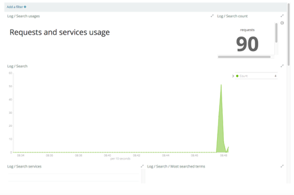

# Setup GeoNetwork {#statistics_geonetwork}

!!! note

    GeoNetwork package should be build using the Maven `es` profile in order to be able to configure the search/content statistics to use Elasticsearch/Kibana:
    
    ``` shell
    $ cd GN_SOURCES/
    $ mvn clean install -Penv-prod,es
    ```
    
    If you're using a development environment, can use the following command from the Geonetwork sources folder:
    
    ``` shell
    $ cd GN_SOURCES/web
    $ mvn jetty:run -Penv-dev,es
    ```


To setup the search/content statistics in GeoNetwork, do the following steps:

-   Start GeoNetwork.

-   Login as an `or` user and load the templates (<http://localhost:8080/geonetwork/srv/eng/admin.console#/metadata>).

-   Create some metadata records (optionally you can load the samples).

-   Enable search statistics in the Settings page (<http://localhost:8080/geonetwork/srv/eng/admin.console#/settings>).

    

-   Do some searches in GeoNetwork.

-   Go to `us` in <http://localhost:8080/geonetwork/srv/eng/admin.console#/dashboard> and select Search Statistics`.

    The first time you're prompted to select the Kibana default index. Select `.dashboards`:

    

    and set as default to get it working.

    

-   Reload the page and check the dashboards.

    

## Content statistics/validation

Content and validation status statistics are available also from to `us` in <http://localhost:8080/geonetwork/srv/eng/admin.console#/dashboard>, but require to index manually the content in Elasticsearch. This will be improved in future versions.

-   To index the content and validation status in Elasticsearch, go to <http://localhost:8080/geonetwork/srv/eng/admin.console#/tools> and select the following option:

    

-   Access the `cs` and `on` in `us` (<http://localhost:8080/geonetwork/srv/eng/admin.console#/dashboard>)
