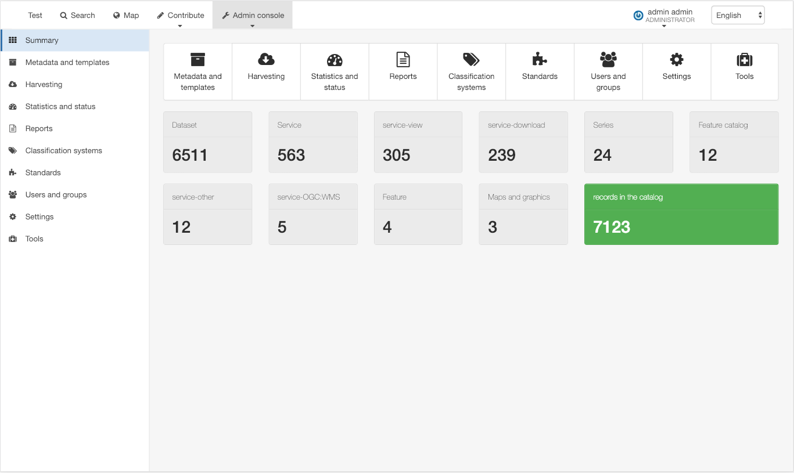
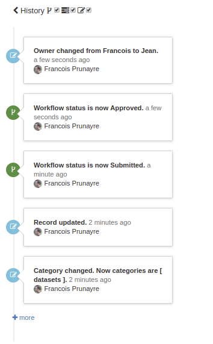

# Version 3.6.0 {#version-360}

## New features/fixes

-   [Web accessibility standards and guidelines improvements](https://github.com/geonetwork/core-geonetwork/pulls?q=is%3Apr+is%3Aclosed+Accessibility+milestone%3A3.6.0)
-   Improved user interface and new design for the recent/popular homepage and admin console

-   [Social bar config via settings](https://github.com/geonetwork/core-geonetwork/pull/3180)
-   [Record history and tasks](https://github.com/geonetwork/core-geonetwork/pull/3209)

-   Map viewer improvements (eg. projection switcher, better WFS2 support, TMS support, HTTPs redirect support, WPS support, external lviewer support, legend panel)
-   [Digital Object Identifier creation](https://github.com/geonetwork/core-geonetwork/pull/3281)
-   [ISO19139 / DataCite output format](https://github.com/geonetwork/core-geonetwork/pull/3212)
-   [Editor board / Permalink](https://github.com/geonetwork/core-geonetwork/pull/3197)
-   [Editor / Inline validation](https://github.com/geonetwork/core-geonetwork/pull/3298)
-   [Editor / Use thesaurus for any fields](https://github.com/geonetwork/core-geonetwork/pull/3078)
-   [Thesaurus / Better Registry support](https://github.com/geonetwork/core-geonetwork/pulls?q=is%3Apr+Registry+is%3Aclosed+milestone%3A3.6.0) and [GEMET update to version 4.1.2](https://github.com/geonetwork/util-gemet/pull/4)
-   [Standard / Add API to reload configuration](https://github.com/geonetwork/core-geonetwork/pull/3081)
-   [Formatter / Add support for JSON output](https://github.com/geonetwork/core-geonetwork/pull/3191)
-   [Harvesting / Add support for WPS2](https://github.com/geonetwork/core-geonetwork/pull/3257)
-   [Harvesting / WFS features improvements (eg. asynch indexing for better performances, precision model configuration, CDATA support, Elasticsearch 6.4.x support)](https://github.com/geonetwork/core-geonetwork/pull/3205)
-   Performance improvements on indexing and JS & LESS compilation
-   Better HTTPs support
-   Security fixes and library updates

and more \... see [3.6.0 issues](https://github.com/geonetwork/core-geonetwork/issues?q=is%3Aissue+milestone%3A3.6.0+is%3Aclosed) and [pull requests](https://github.com/geonetwork/core-geonetwork/pulls?q=milestone%3A3.6.0+is%3Aclosed+is%3Apr) for full details.
