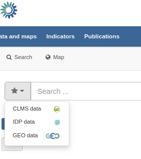
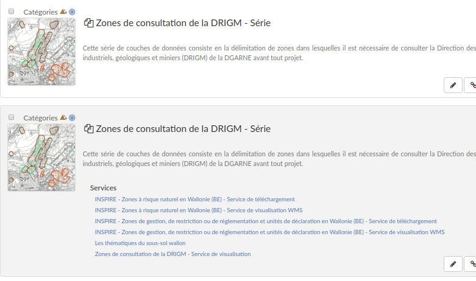
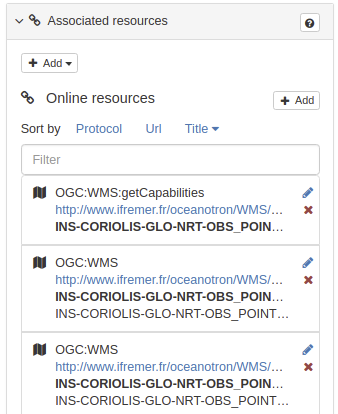

# Version 3.8.0 {#version-380}

## New features/fixes

-   Search experience
    -   [Saved searches](https://github.com/geonetwork/core-geonetwork/pull/3778)

        <figure>
        
        <figcaption>Saved user searches</figcaption>
        </figure>

    -   [Improve PDF output](https://github.com/geonetwork/core-geonetwork/pull/3912)

    -   [Add template to display related record as list](https://github.com/geonetwork/core-geonetwork/pull/3908)

        > <figure>
        > 
        > <figcaption>Add template</figcaption>
        > </figure>

    -   [Add support for negative query on any fields](https://github.com/geonetwork/core-geonetwork/pull/3683)
-   Standards
    -   [ISO19115-3:2018 is now a default standard](https://github.com/metadata101/iso19115-3.2018)
    -   [ISO19139 / JSON-LD formatter](https://github.com/geonetwork/core-geonetwork/pull/3714)
    -   [ISO19139:2007 / Update schema](https://github.com/geonetwork/core-geonetwork/pull/3920)
    -   INSPIRE Technical guidance v2 support
        -   Add support for [etf-webapp validation with TG2 for datasets and sds](https://github.com/geonetwork/core-geonetwork/pull/3915) and also [support validating non ISO19139 records like ISO19115-3](https://github.com/geonetwork/core-geonetwork/pull/3766)
        -   [Improve support for gmx:Anchor encoding](https://github.com/geonetwork/core-geonetwork/pull/3911)
    -   [ISO19110 / Populate columns and codelist values from CSV](https://github.com/geonetwork/core-geonetwork/pull/3864)
-   Editor
    -   [Working copy support for approved records](https://github.com/geonetwork/core-geonetwork/pull/3592)

    -   [Associated resource can now be filtered, sorted](https://github.com/geonetwork/core-geonetwork/pull/3804), add [support for WFS and Atom services](https://github.com/geonetwork/core-geonetwork/pull/3817).

        > <figure>
        > 
        > <figcaption>Filtering associated resources</figcaption>
        > </figure>
-   Harvester
    -   [GeoNetwork / Add paging for better support of large catalogues](https://github.com/geonetwork/core-geonetwork/pull/3916)
    -   [THREDDS / Modernise and simplify harvester](https://github.com/geonetwork/core-geonetwork/pull/3936)
    -   [WFS feature / Zoom to results](https://github.com/geonetwork/core-geonetwork/pull/3701), add support for CDATA, Update to Elasticsearch 7.2.
-   Administration
    -   New user interface settings for: humanizing date, enable user searches, enable saved selections, fluid or not container
-   Security fixes and library updates

And more \... see [3.8.0 issues](https://github.com/geonetwork/core-geonetwork/issues?q=is%3Aissue+milestone%3A3.8.0+is%3Aclosed) and [pull requests](https://github.com/geonetwork/core-geonetwork/pulls?q=milestone%3A3.8.0+is%3Aclosed+is%3Apr) for full details.
