# Version 4.0.0-alpha.1 {#version-400-alpha1}

## Why 4.0.0-alpha.1?

GeoNetwork 4.0.0-alpha.1 release is an alpha version of GeoNetwork using Elasticsearch as search engine (instead of the previous home made search based on Lucene). This version is a beta release made available for users who would like to test it.

This version provides support of GeoNetwork main functionalities and user can search, edit records and manage the catalogue as usual. Only the searches (and all related protocols) are affected by the search engine change and the user search experience has been improved with the following:

Some of the main goals of moving from Lucene to Elasticsearch are:

-   Be able to share index across catalogs (clustering)
-   Improve search experience (see below)
-   Improve performances for searches and indexing
-   Add dashboards with Kibana
-   Simplify code base

## What's new?

This release is all about user search experience:

-   Autocomplete support phrase query, does not return private terms, takes current search into account

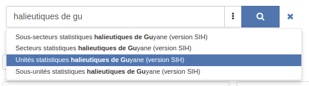

-   Facets / OR query support

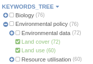

-   Facets / Negative query support

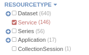

-   Facets / Nested aggregations support

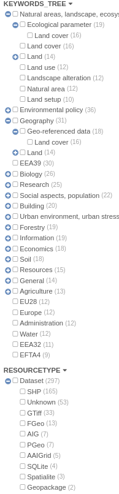

-   Facets / Paging to collect more values

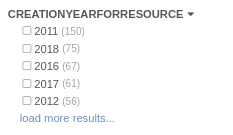

-   Facets / Histograms

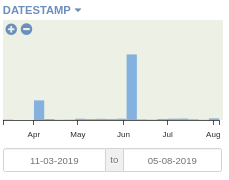

-   Facets / Configuration from the admin --> Settings --> UI based on [Elasticsearch API](https://www.elastic.co/guide/en/elasticsearch/reference/current/search-aggregations.html)
-   Record view / More like this \...

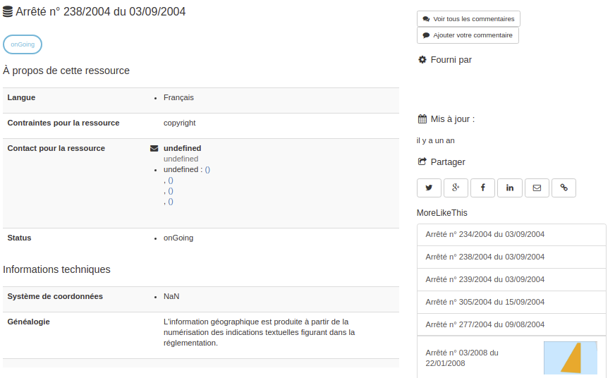

-   Search / Custom scoring function
-   Search / Range field support eg. temporal coverage

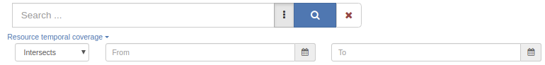

-   Performances improved for search and indexing
-   Build your own dashboards to analyze content, improve quality, create data visualization in Kibana

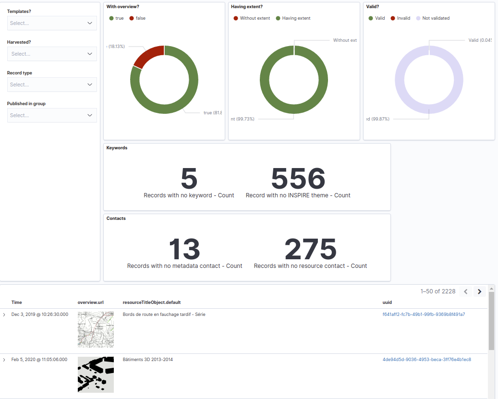

-   Summary of indexing errors

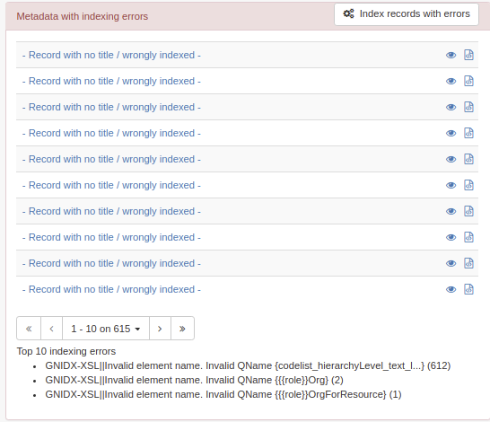

Regarding search protocols, only CSW has been migrated for now (ie. OAI-PMH, RDF, Z39.50/SRU, OpenSearch, \... are not available in this version). This means that a GeoNetwork 3.x can only harvest GeoNetwork 3.99 using CSW.

More details can be found in <https://github.com/geonetwork/core-geonetwork/pull/2830>.

For the installation check [Installation guide](../../install-guide/index.md).

For reporting any issues go to <https://github.com/geonetwork/core-geonetwork/issues>.

## Some features now removed

-   CSW / Virtual CSW is replaced by sub-portal (see [Portal configuration](../../administrator-guide/configuring-the-catalog/portal-configuration.md))
-   CSW / results_with_summary custom GeoNetwork output schema is removed. To retrieve facets use the main search API.
-   Deprecated Jeeves services removed (ie. services not used by Angular application like harvester config). Use the swagger API instead (see [GeoNetwork API](../../api/the-geonetwork-api.md)).
-   Metadata notifier manager (can be replaced by event system)
-   Overrides mechanism of configuration file

## What is next?

This version is a beta version and needs testing and feedback from the community. As a roadmap for version 4, we have to find resources to move forward on the following topics:

### Existing features not implemented

-   Transifex / Support multiple branches translation
-   Multilingual metadata / Records are indexed and displayed but no logic to display depending on user interface language or search on specific language

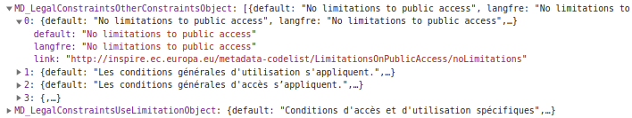

-   Indexing / Language specific analyzer (draft configuration made for French)
-   Indexing / Spatial / Support for bounding polygons
-   User interface / Search / Advanced search form
-   User interface / Search / Active filters
-   User interface / Search / Facet as tab
-   Search / Other protocols (ie. OAI-PMH, RDF, Z39.50/SRU, OpenSearch)
-   API / DirectoryUtils.search
-   API / ReportUploads
-   API / INSPIRE Atom Harvester
-   Search / Statistics and search stat dashboards

### New features to develop

-   Search on records and WFS features
-   Search / Synonyms supports
-   Associated records / Use of multiple search API for better performance or Join query.
-   Harvester / GN4 protocol
-   Clustering
-   Large catalogs / Better support of batch operations (eg. privileges, new owner, validation) and large selection

``` 
":{"type":"too_many_clauses","reason":"maxClauseCount is set to 1024"}}}}]},"status":400}
```

-   Large catalogs / Define strategy to speed up search and not use track_total_hits
-   Security / Elasticsearch and Kibana configuration (for now, do not expose Elasticsearch to the internet)
-   Java 11 support

``` 
future versions of Elasticsearch will require Java 11;
your Java version from [/usr/lib/jvm/java-8-openjdk-amd64/jre]
does not meet this requirement
```
