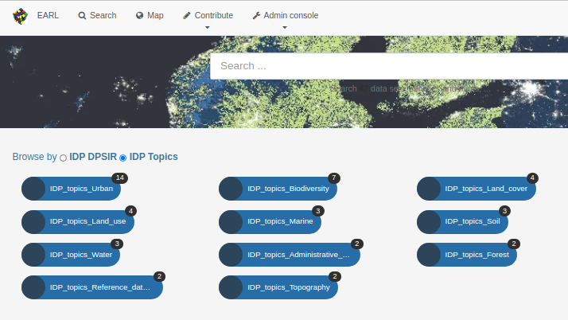
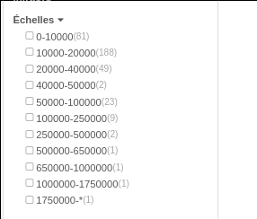
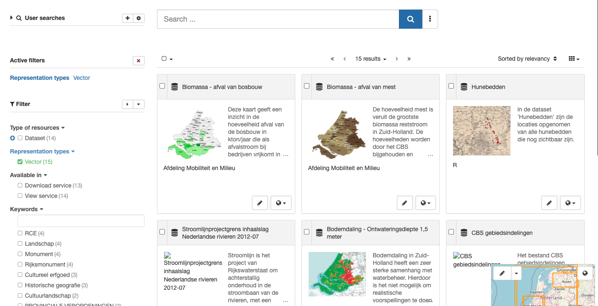
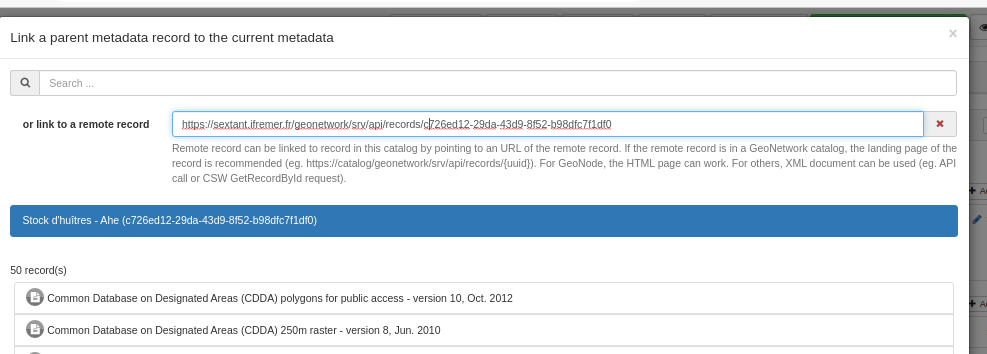

# Version 4.0.0-alpha.2 {#version-400-alpha2}

-   [Home page categories can now be configured from admin console](https://github.com/geonetwork/core-geonetwork/pull/4933)

-   [Improved search](https://github.com/geonetwork/core-geonetwork/pull/4881) eg. Full text search can now make exact phrase match using "version 17", base query can now be customized, score configuration, advanced querying using q(-status:obsolete)
-   [Add more like this configuration](https://github.com/geonetwork/core-geonetwork/pull/4687)
-   [Aggregation can now use histogram](https://github.com/geonetwork/core-geonetwork/pull/4683)

-   [Improved search results layout](https://github.com/geonetwork/core-geonetwork/pull/4929)

-   [Active filter is enabled by default and now support negative filter with better translations. Facet values can also be filtered.](https://github.com/geonetwork/core-geonetwork/pull/4877)
-   [Associated resources / Remote record support](https://github.com/geonetwork/core-geonetwork/pull/4899)

-   Security update: [Spring 5](https://github.com/geonetwork/core-geonetwork/pull/4749), [JPA 2](https://github.com/geonetwork/core-geonetwork/pull/4827), [Quartz, MySQL, Guava](https://github.com/geonetwork/core-geonetwork/pull/4834)
-   [OpenAPI support](https://github.com/geonetwork/core-geonetwork/pull/4749)
-   [Translation API](https://github.com/geonetwork/core-geonetwork/pull/4823) to override default translations.

and more \... see [4.0.0-alpha.2 issues](https://github.com/geonetwork/core-geonetwork/issues?q=is%3Aissue+milestone%3A4.0.0-alpha.2+is%3Aclosed) and [pull requests](https://github.com/geonetwork/core-geonetwork/pulls?q=is%3Apr+milestone%3A4.0.0-alpha.2+is%3Aclosed) for full details.
