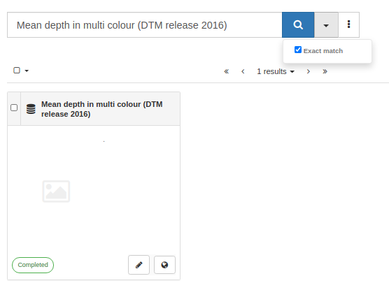
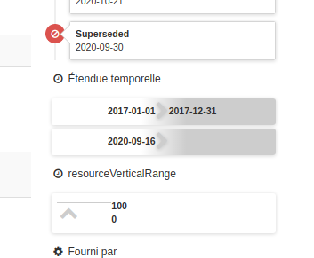

# Version 4.0.0 {#version-400}

GeoNetwork 4.0.0 release is the first version of GeoNetwork using Elasticsearch as search engine!

By moving from Lucene to Elasticsearch GeoNetwork 4.0.0 offers:

-   shared index across catalogs (clustering)
-   Improved search experience
-   Improved performance for searching and indexing
-   Opportunity to add dashboards with Kibana
-   Simplify the geonetwork codebase

The Elasticsearch engine supports GeoNetwork core functionality: user can search, edit records and manage the catalogue as usual. Only the searches (and all related protocols) are affected by the change to Elasticsearch. The editor and admin application remains the same.

There remains opportunities to help:

-   **A number of features that you enjoy in GeoNetwork 3 may not yet be available**.
-   Multilingual editing is the same, but multilingual search is not yet fully operational.
-   Read carefully the [list of missing features](https://github.com/geonetwork/core-geonetwork/issues/4727) before migrating.

Before you start:

-   Installing the application require to install an Elasticsearch instance (see [Installing search platform](../../install-guide/installing-index.md)).

Release highlights:

-   The GeoNetwork ``4.0.0`` release is aligned with GeoNetwork 3.10.4 (see [Version 3.10.4](version-3.10.4.md)).

-   The user search experience has been greatly improved.

    For more infromation see the description in [Version 4.0.0-alpha.1](version-4.0.0-alpha.1.md) and [Version 4.0.0-alpha.2](version-4.0.0-alpha.2.md).

-   [Search / Exact match support](https://github.com/geonetwork/core-geonetwork/pull/5072)

    

-   [Record view / Use timeline to render resource events, temporal extent and vertical extent](https://github.com/geonetwork/core-geonetwork/pull/5065)

    

-   [Map / Add mouse position](https://github.com/geonetwork/core-geonetwork/pull/5030)

-   [Indexing / Improvements](https://github.com/geonetwork/core-geonetwork/pull/5064)

-   [API / Retrieve any extents](https://github.com/geonetwork/core-geonetwork/pull/4930)

-   [Improve ISO19110 support](https://github.com/geonetwork/core-geonetwork/pull/5059)

-   [Restrict access to Elasticsearch API](https://github.com/geonetwork/core-geonetwork/pull/5023)

See [4.0.0 issues](https://github.com/geonetwork/core-geonetwork/issues?q=is%3Aissue+milestone%3A4.0.0+is%3Aclosed) and [pull requests](https://github.com/geonetwork/core-geonetwork/pulls?q=is%3Apr+milestone%3A4.0.0+is%3Aclosed) for full details.
