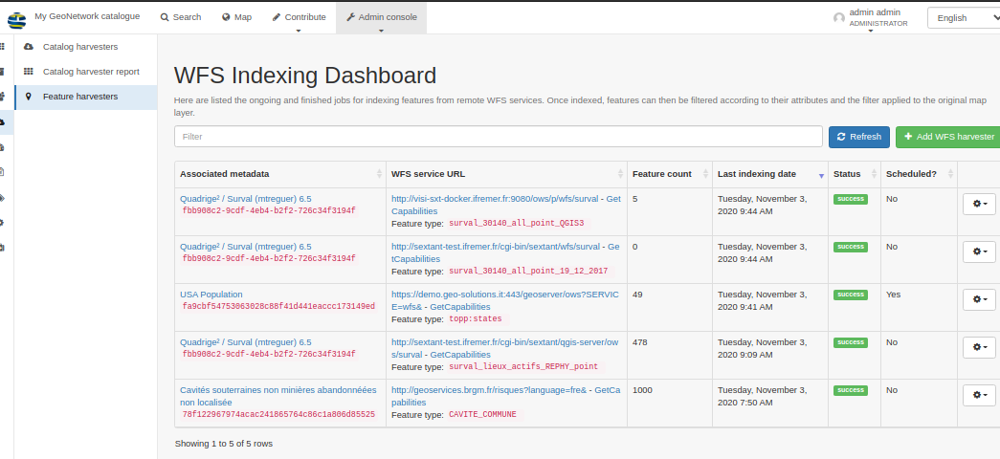

# Version 4.0.1 {#version-401}

GeoNetwork 4.0.1 release is a minor release aligned with GeoNetwork 3.10.5 (see [Version 3.10.5](version-3.10.5.md)) with some changes:

-   [Search / Facet / Fix more action when collapse state is set](https://github.com/geonetwork/core-geonetwork/pull/5122)
-   [Search / Suggestion / Apply score](https://github.com/geonetwork/core-geonetwork/pull/5133)
-   [INSPIRE / Add conformance class 2b for monitoring](https://github.com/geonetwork/core-geonetwork/pull/5117)
-   [Record view / Fix extent image due to HTTPs change](https://github.com/geonetwork/core-geonetwork/pull/5154)
-   [Record view / More like this improvement](https://github.com/geonetwork/core-geonetwork/pull/5134)
-   [DOI / Stored as resource identifier instead of online resource](https://github.com/geonetwork/core-geonetwork/pull/5124)
-   [Map / Improvements](https://github.com/geonetwork/core-geonetwork/pull/5140)
-   [WFS feature harvester scheduler and QGIS server support](https://github.com/geonetwork/core-geonetwork/pull/5140)

-   [Indexing / Fix usage of custom indexing name](https://github.com/geonetwork/core-geonetwork/pull/5151)
-   [ISO19115-3 / ISO19139 conversion / Fix for multiple individuals in organization](https://github.com/geonetwork/core-geonetwork/pull/5150)
-   [CSW / Restore possibility to query any index fields](https://github.com/geonetwork/core-geonetwork/pull/5127)

and more \... see [4.0.1 issues](https://github.com/geonetwork/core-geonetwork/issues?q=is%3Aissue+milestone%3A4.0.1+is%3Aclosed) and [pull requests](https://github.com/geonetwork/core-geonetwork/pulls?q=is%3Apr+milestone%3A4.0.1+is%3Aclosed) for full details.
