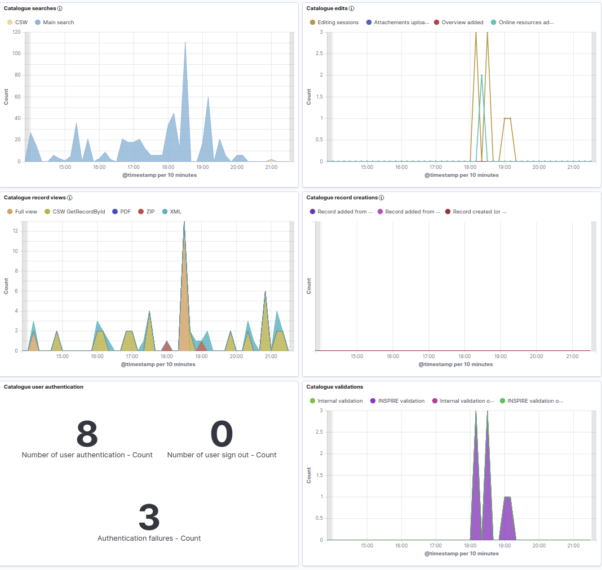

# Version 4.0.3 {#version-403}

GeoNetwork 4.0.3 release is a minor release with some changes:

-   Interactive graphics for facets (See [Interactive graphics](../../customizing-application/configuring-faceted-search.md#configuring-facet-graphics))
-   [Map / WPS support improvements](https://github.com/geonetwork/core-geonetwork/pull/5362)
-   Indexing / [Improvements](https://github.com/geonetwork/core-geonetwork/pull/5425), [better multilingual support](https://github.com/geonetwork/core-geonetwork/pull/5436) and [more robust](https://github.com/geonetwork/core-geonetwork/pull/5398)
-   [Monitoring your catalogue usage using Kibana](https://github.com/geonetwork/docker-geonetwork/pull/60)

-   Translation pack builder for faster initialization of the client application.

and more \... see [4.0.3 issues](https://github.com/geonetwork/core-geonetwork/issues?q=is%3Aissue+milestone%3A4.0.3+is%3Aclosed) and [pull requests](https://github.com/geonetwork/core-geonetwork/pulls?q=is%3Apr+milestone%3A4.0.3+is%3Aclosed) for full details.

Version 4.0.3 is also the version to use if [testing the draft OGC API Records service](https://github.com/geonetwork/geonetwork-microservices/tree/main/modules/services/ogc-api-records).
