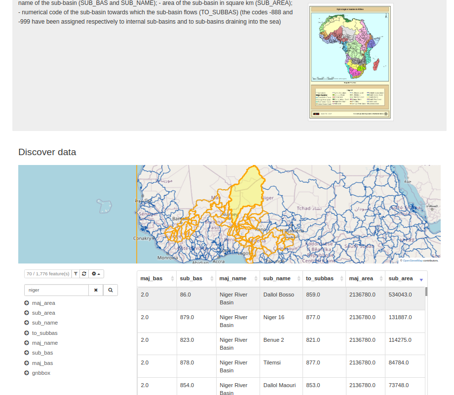

# Version 4.2.1 {#version-421}

GeoNetwork 4.2.1 release is a minor release.

## List of changes

Major changes:

-   Accessibility improvements on [map tools](https://github.com/geonetwork/core-geonetwork/pull/6211), [top tool bar skip link](https://github.com/geonetwork/core-geonetwork/pull/6217)

-   [Search / Aggregation / Add support for terms missing value](https://github.com/geonetwork/core-geonetwork/pull/6335)

-   [Record view / Group associated resources by type](https://github.com/geonetwork/core-geonetwork/pull/6328)

-   [Record view / More like this / Suggest records of same type](https://github.com/geonetwork/core-geonetwork/pull/6452)

-   [Record view / Preview tabular data](https://github.com/geonetwork/core-geonetwork/pull/6440)

    

-   DOI improvements: [Fix on published records](https://github.com/geonetwork/core-geonetwork/pull/6338), [Configure DOI URL pattern](https://github.com/geonetwork/core-geonetwork/pull/6347), [Disabled for metadata workflow](https://github.com/geonetwork/core-geonetwork/pull/6367), [Multilingual exception](https://github.com/geonetwork/core-geonetwork/pull/6472)

-   [Editing / Upload file or overview from main form](https://github.com/geonetwork/core-geonetwork/pull/6371)

-   [Editor configuration / Use condition on any elements](https://github.com/geonetwork/core-geonetwork/pull/6355)

-   [API / Batch editing / Add support for attribute](https://github.com/geonetwork/core-geonetwork/pull/6423)

-   [INSPIRE / Atom service migrated to Elasticsearch and Spring](https://github.com/geonetwork/core-geonetwork/pull/6395)

-   [Admin / Settings / Configure profile allowed to delete published metadata](https://github.com/geonetwork/core-geonetwork/pull/6398)

-   [Admin / Indexing error improvements](https://github.com/geonetwork/core-geonetwork/pull/6432)

-   [Print / Improve styling](https://github.com/geonetwork/core-geonetwork/pull/6517)

-   Library update: [Switch to OpenPDF](https://github.com/geonetwork/core-geonetwork/pull/6343), [Keycloak](https://github.com/geonetwork/core-geonetwork/pull/6531), [Log4j2](https://github.com/geonetwork/core-geonetwork/pull/6397)

and more \... see [4.2.1 issues](https://github.com/geonetwork/core-geonetwork/issues?q=is%3Aissue+milestone%3A4.2.1+is%3Aclosed) and [pull requests](https://github.com/geonetwork/core-geonetwork/pulls?page=3&q=is%3Apr+milestone%3A4.2.1+is%3Aclosed) for full details.
