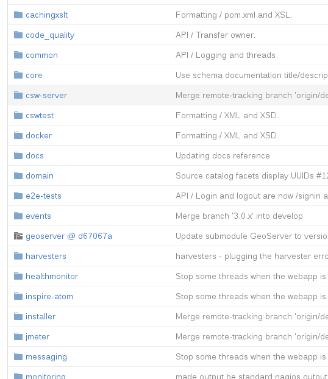

# Separate your code {#tuto-hookcustomizations-newproject}

GeoNetwork is built using Maven. This means, there are several folders inside the source code and each of them is a different Maven project that can be built separately.



## Create your own project

The best way to work with GeoNetwork and easily upgrade later is add your own Maven project(s) to the Maven build stack, so GeoNetwork code remains unaltered and your changes are decoupled.

To do this, go to the root folder of the source code and create a new folder. This can be done on a GNU/Linux terminal using the following command:

``` shell
cd core-geonetwork
mkdir custom
```

Then we have to tell Maven this is a new project that can be built. So we add a new file called pom.xml on this "custom" folder and add the following:

``` xml
<project xmlns="http://maven.apache.org/POM/4.0.0"
  xmlns:xsi="http://www.w3.org/2001/XMLSchema-instance"
  xsi:schemaLocation="http://maven.apache.org/POM/4.0.0 http://maven.apache.org/maven-v4_0_0.xsd">

  <modelVersion>4.0.0</modelVersion>

  <parent>
    <groupId>org.geonetwork-opensource</groupId>
    <artifactId>geonetwork</artifactId>
    <version>3.1.0-SNAPSHOT</version>
  </parent>

  <groupId>org.geonetwork-opensource</groupId>
  <artifactId>custom</artifactId>
  <packaging>jar</packaging>
  <name>Hook your customizations tutorial</name>
  <description/>

  <licenses>
    <license>
      <name>General Public License (GPL)</name>
      <url>http://www.gnu.org/licenses/old-licenses/gpl-2.0.txt</url>
      <distribution>repo</distribution>
    </license>
  </licenses>

  <properties>
    <geonetwork.build.dir>${project.build.directory}/${project.build.finalName}</geonetwork.build.dir>
    <closure.compile.level/>
  </properties>
    <profiles>
        <profile>
            <id>tests-and-static-analysis</id>
            <activation>
                <property><name>!skipTests</name></property>
            </activation>
        </profile>
    </profiles>
</project>
```

## Add your project

Then you should add it to the list of projects Maven will automatically build. On the root folder of the source code, edit the file pom.xml and add your own project:

``` xml
<modules>
  <module>schemas-test</module>
  <module>web-ui</module>
  <module>custom</module>
  <module>web-ui-docs</module>
  <module>web-client</module>
  <module>web</module>
</modules>
```

The idea is that not only we build the project, but also add it to the war file that is being generated. To do this, we edit the file web/pom.xml and add our project as a new dependency inside the tag dependencies:

``` xml
<dependency>
  <groupId>${project.groupId}</groupId>
  <artifactId>custom</artifactId>
  <version>${project.version}</version>
</dependency>
```

And on the same file, we should also add our resources folder to the build (if we are going to modify the UI, which we will on this tutorial):

``` xml
<resource>
  <directory>${project.basedir}/../custom/src/main/resources</directory>
</resource>
```

``` xml
<resourcesAsCSV>
  ${project.basedir}/src/main/webapp,
  ${rootProjectDir}/web-ui/src/main/resources/,
  ${rootProjectDir}/custom/src/main/resources/,
  ${build.webapp.resources}
</resourcesAsCSV>
```

Now, if we build GeoNetwork, it will also build and add our project.
