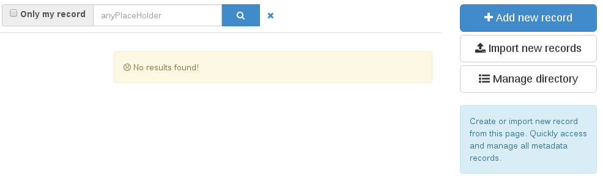
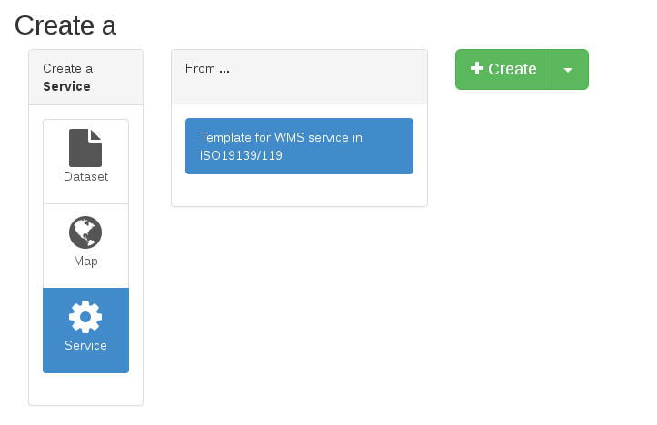
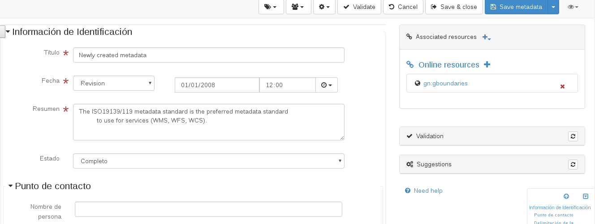
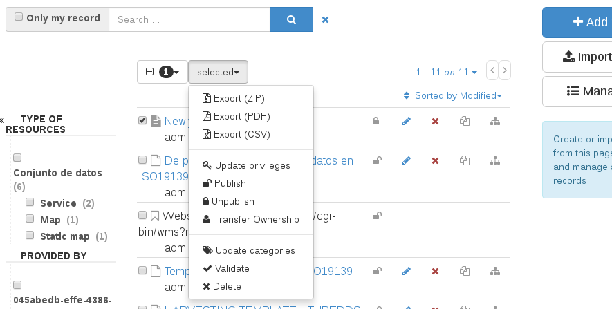

# Edit {#tuto-introduction-edit}

To add new metadata, you should enter the editor dashboard: <http://localhost:8080/geonetwork/srv/eng/catalog.edit#/board>

There, you can click on the blue "Add new record" button at the right to create a new metadata. Depending on the schema selected on previous steps, you will be offered different templates to start a new metadata.

After selecting a template and clicking on the green "Create" button at the right, the editor will be opened with your newly created metadata. You can complete and change the values you need to and then click on the blue save icon.

After saving and closing the editor, you metadata is already on your catalog. You can search for it on the home page or the editor dashboard.

If you want your metadata to be publicly available, you should also modify the privileges so the "All" group, which represents the anonymous users, can see it. To do this, go back to the editor dashboard: <http://localhost:8080/geonetwork/srv/eng/catalog.edit#/board>

Select the metadata you want to publish and, on the top menu, select the "Publish" option. Now your metadata is publicly available on your catalog. If you access with an anonymous tab, your metadata is visible.

See more on [Editing metadata](../../../user-guide/describing-information/editing-metadata.md).
