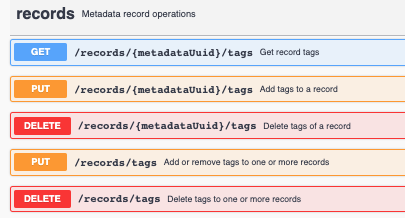

# Advanced topics {#extra}

## GeoNetwork API

In recent releases most of GeoNetworks functionality is exposed via a centralised API based on OpenApi. An optimal approach to get started with the API is via the Interactive documentation page provided by OpenAPI. This page is accessibly via <http://localhost:8080/geonetwork/doc/api>.

{width="400px"}

The page describes each of the methods and its properties, but also offers the capability to try out any operation via a web form.

## Kibana Dashboard

Kibana is an optional component which can be installed with Elastic Search. Kibana offers a dynamic way to create visualisations of the contentn of the Elastc Search index.

The GeoNetwork community has prepared some sample visualisations. Load the samples from <https://github.com/geonetwork/core-geonetwork/blob/4.0.x/es/es-dashboards/data/export.ndjson> via the 'Saved objects --> Import' option in Kibana.

If installed, you can access kibana from the GeoNetwork admin interface. To access the Kibana interface you need to be logged in as administrator.

Read more about the usage of kibana at <https://www.elastic.co/guide/en/kibana/current/introduction.html>

## Search engines

Search engines provide a good mechanism for wide data discovery for public portals. The process of having catalogue content ingested by search engine crawlers requires some attention. The search engine expects to find `robots.txt`, at the root of the domain. The catalogue provide a `robots.txt` file at http://localhost:8080/geonetwork/srv/api/robots.txt. 

```shell
User-agent: *
Disallow: /geonetwork/catalog/
Disallow: /geonetwork/static/
Sitemap: http://localhost:8080/geonetwork/srv/api/sitemap
```

This file contains references to the sitemap which register all record landing pages available for indexing. The sitemap is paginated if needed. For better indexing, you may need to register the sitemap manually at individual search engines.

```xml
<urlset xmlns="http://www.sitemaps.org/schemas/sitemap/0.9" xmlns:xsi="http://www.w3.org/2001/XMLSchema-instance" xmlns:dct="http://purl.org/dc/terms/" xsi:schemaLocation="http://www.sitemaps.org/schemas/sitemap/0.9 https://www.sitemaps.org/schemas/sitemap/0.9/sitemap.xsd">
  <url>
    <loc>http://localhost:8080/geonetwork/srv/api/records/da165110-88fd-11da-a88f-000d939bc5d8?language=all</loc>
    <lastmod>2024-06-04</lastmod>
  </url>
```

GeoNetwork includes a representation of that record in [schema.org](https://schema.org/) (Structured Data for the Web) framework, encoded as [`json-ld`](https://en.wikipedia.org/wiki/JSON-LD), on any HTML representation (through the GeoNetwork API / sitemap) of a published metadata record. The `json-ld` representation is embedded in the html page as a script element and contains also [Croissant extension](https://docs.mlcommons.org/croissant/). "Croissant 🥐 is a high-level format for machine learning datasets that combines metadata, resource file descriptions, data structure, and default ML semantics into a single file; it works with existing datasets to make them easier to find, use, and support with tools. Croissant builds on schema.org, and its Dataset vocabulary, a widely used format to represent datasets on the Web, and make them searchable." It covers data model aspects (ISO19110) and additional details about distributions not covered by schema.org.


This enables the search engine to extract the information in a structured way.
