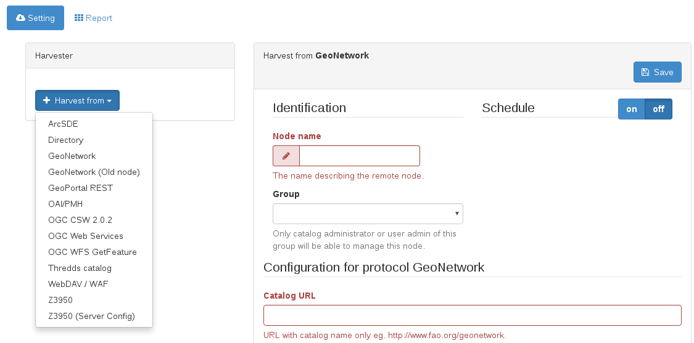
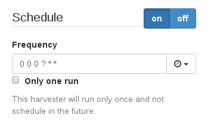
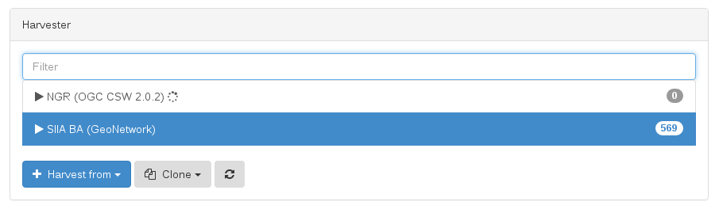

# Harvesting {#tuto-introduction-harvesting}

The quickest way to add relevant data to your catalog is by harvesting. This means, copying data from other catalos in your own catalog. There are many protocols that can be used for harvesting.

## GeoNetwork

GeoNetwork can harvest from other GeoNetwork catalogs. For this tutorial, we are going to use this catalog: <http://ide.siia.gov.ar/geonetwork>

To add a new harvester, we have to enter the administration console: <http://localhost:8080/geonetwork/srv/eng/admin.console#/harvest>

We select the **GeoNetwork** option on the *Harvest from* dropdown. This will open a harvester editor at the right. We enter a *Node name* and the *Catalog URL* and we can already save it.

All harvesters can be run manually at will with the *Harvest* button. This means, it will run just once every time an authorized user runs it.

But the most interesting feature of harvesters is the scheduler. You can define a frequency of running.

## CSW

GeoNetwork can also harvest from CSW catalogs. The process is quite similar, but instead of choosing the GeoNetwork type of harvester, we chose the **OGC CSW 2.0.2** harvester type.

For this tutorial, we are going to use the following catalog: <http://nationaalgeoregister.nl/geonetwork/srv/eng/csw>

While the harvester is running, there will be an animated circle. Once the harvester has finished, the number of records harvested will be shown.

See more on [Harvesting](../../../user-guide/harvesting/index.md).
