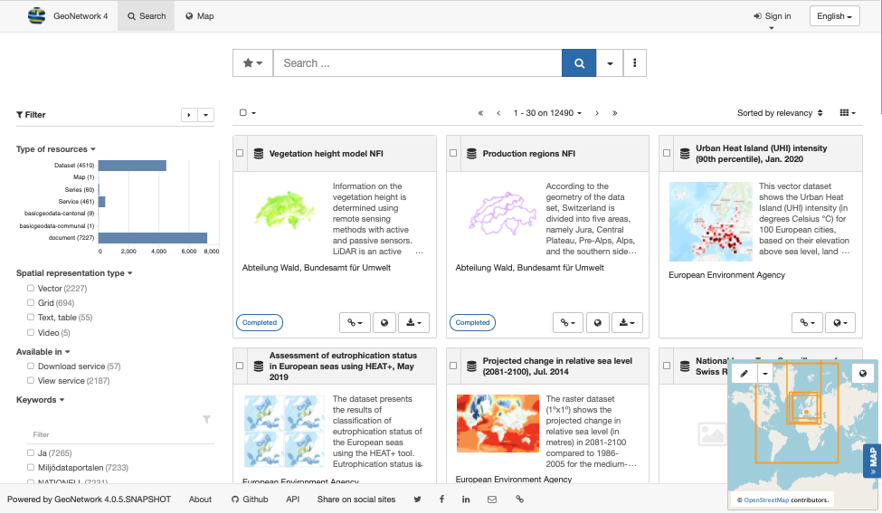

# GeoNetwork Orientation {#tuto-introduction}

In this workshop you are introduced to the main features of the GeoNetwork system from a usage and data curation perspective. The tutorial contains information and hands-on exercises explaining how to use the GeoNetwork system.

## GeoNetwork opensource

GeoNetwork opensource is a standards based and decentralised spatial information management system, designed to enable access to spatial databases and cartographic products from a variety of data providers through descriptive metadata, enhancing the spatial information exchange and sharing between organisations and their audience, using the capacities and the power of the Internet.

The system provides a broad community of users with easy and timely access to available spatial data and thematic maps from multidisciplinary sources, that may in the end support informed decision making.

The main goal of the software is to increase collaboration within and between organisations for reducing duplication and enhancing information consistency and quality and to improve the accessibility of a wide variety of geographic information along with the associated information, organised and documented in a standardised and consistent way.

{width="800px"}

The tutorial starts with an introduction on cataloguing concepts and then continues with installation, configuration and usage of the GeoNetwork software.

At various points references are made to the product documentation to find more details on a certain topic.

## Tutorial contents

-   [Metadata and Catalogues](introduction/index.md)
-   [Discovering information](introduction/discover.md)
-   [Maps and dataset visualisation](introduction/map.md)
-   [Multi schema support](introduction/schema.md)
-   [Deployment](deployment/index.md)
-   [Setup](setup/index.md)
-   [Editing Metadata](edit/index.md)
-   [Harvesting](harvesting/index.md)
-   [Advanced topics](extra/index.md)
