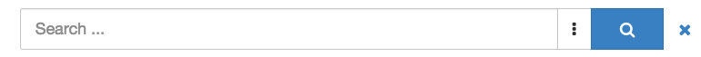
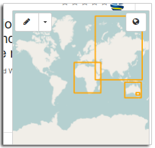
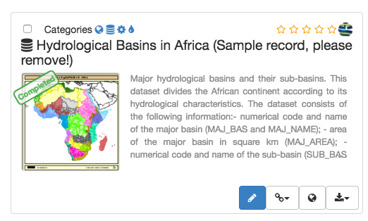
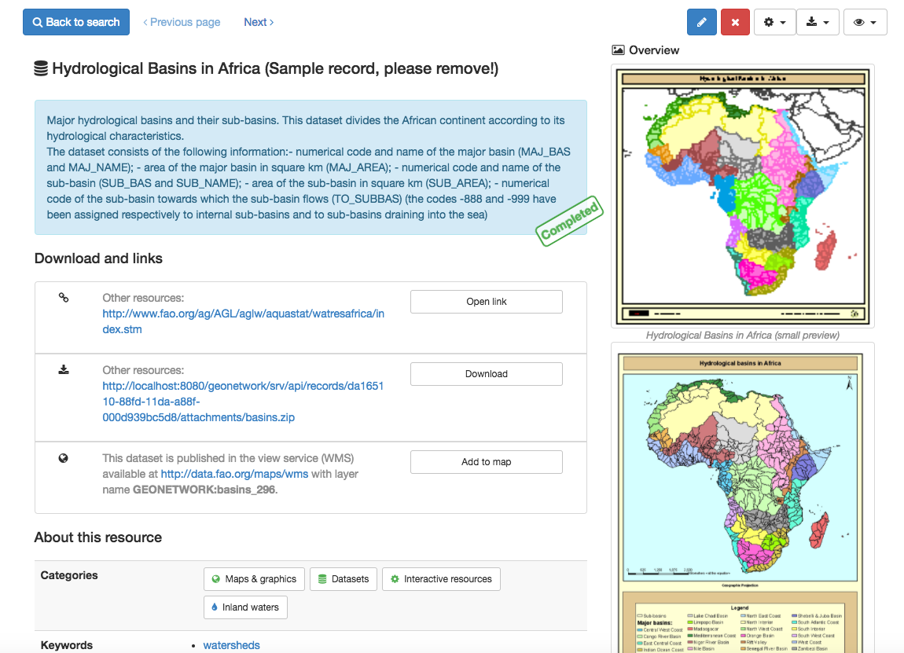
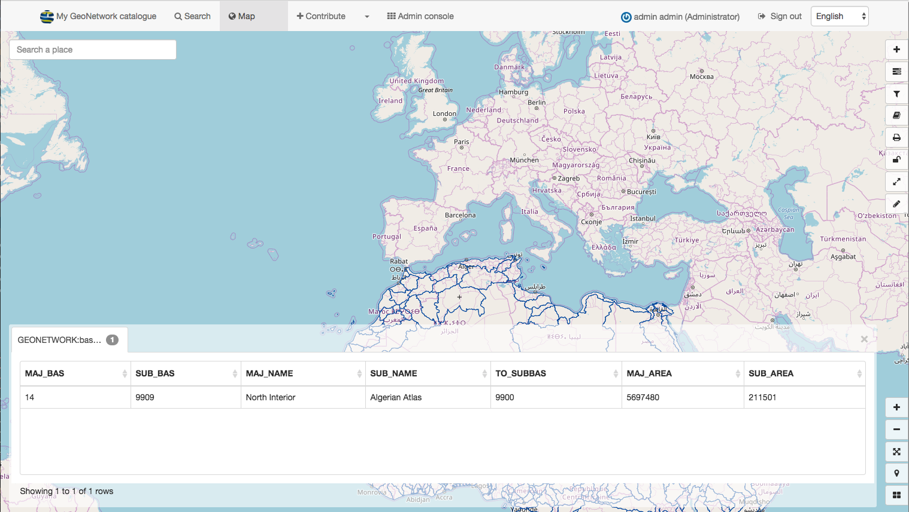

# Discovering information

We start our tour through GeoNetwork with an introduction to the search mechanism. For this tour you need to access a preconfigured and populated GeoNetwork instance. Use for example <http://nationaalgeoregister.nl>, <http://geocat.ch>, or alternatively continue with the next chapters of the tutorial first, in which you will install, configure and populate a local instance of GeoNetwork.

The process of discovery includes searching by keyword, location, organisation or others, filtering the results and the evaluation of individual records. GeoNetwork provides various ways of searching for records in the catalogue:

-   A full text search box provides suggestions as you type. This options queries all elements of the metadata, so you can use keywords, organisations names, filenames, etc. Use * to match partial search terms. If you want to search only on a specific field, such as title, use the advanced search.

{width="600px"}

-   To use a spatial filter, draw a polygon in the map-filter widget. You can switch the mode of the widget from "intersect" to "within" so you only receive records that are within the bounding box you defined.

{width="400px"}

## Search results

The search results show the main information of each resource: title, abstract, schema, thumbnail, download links.

{width="600px"}

You can use the facets in the left sidebar to further filter the search result. Facets provice a summary of common elements in the current search result.

To get more information, click the title of the record, this will bring you to the index-view, a view of the metadata that displays a subset of the metadata, directly from the search index.

{width="600px"}

The view menu displays the available view modes. In a default configuration are available "Default" and "Full". The "Full" view displays all metadata elements by applying an XML to HTML transformation.

## View data on map

From the results or the record view, you can add linked WMS and WFS layers to the map viewer by clicking the *Interactive map* url of the *Online resource* element in the *Distribution* section.

{width="600px"}

!!! abstract "Explore"

    Find a record that has a linked WMS layer and add it to the map.

