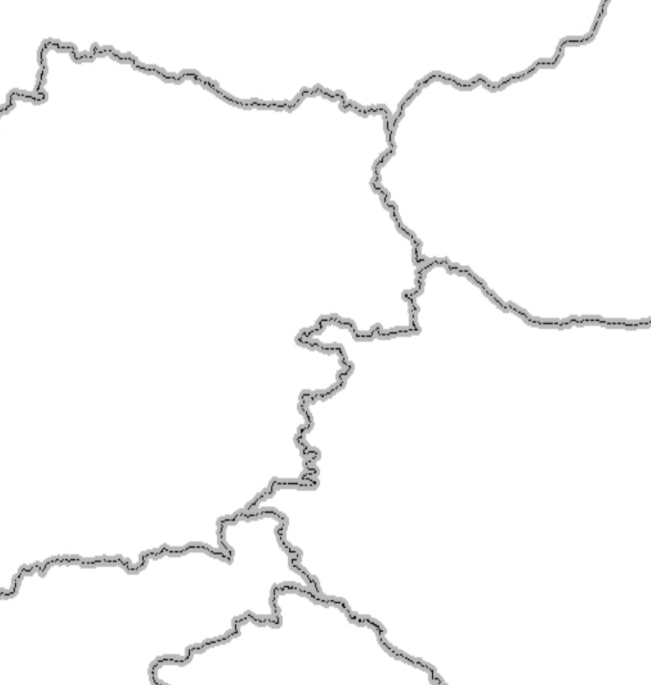

# Metadata and Catalogues {#introduction.rst}

This section introduces metadata and catalogues. In the process of listing an asset in a catalog, one creates a **record** (a document describing the properties of the asset).

Metadata, or 'data about data', is used in a variety of contexts. In the spatial domain metadata is used for documents that describe spatial assets, such as datasets, web services/processes, maps, scientific articles, sensors, along with documents such as PDFs.

In order to share metadata between organisations, common metadata models, such as Dublin Core, DCAT and ISO19115 have been adopted. When the common models are tailored for a specific organisational or domain context they are referred to as a 'metadata profiles'.

*   Catalog: Assist an organization with managing assets, offering discovery and search.
*   Records: Document describing the properties of an asset
*   Metadata is "data about data":
    
    * Common Metadata models are recipes used to create records that can be shared between organizations.
    * Metadata Profiles adapt a common metadatamodel for an organization, domain, or specific use.

## Metadata in the spatial domain

{width="400px"}

In the above image you see the rendering of a spatial dataset. Based on the image itself it is hard to tell what type of data is represented in the image. It could be roads or rivers, but considering the symbology of the dataset this seems unlikely. Most likely this dataset contains boundaries, but because we do not have any metadata describing the dataset we can only guess. Metadata defines what a dataset is about, so everyone who receives the datasets knows what the data represents.

## Catalogue purposes

Metadata serves three main purposes; discovery, identification and assessment.

-   Catalogues are able to let users query through large amounts of records, created locally or imported from other catalogues, so users are able to **discover** resources that may be of interest to them.
-   When you're looking at a map or dataset you want to verify what it is you're looking at. Metadata supports the **identification** of the asset.
-   Users are enabled to assess if a dataset is relevant for their use case by checking its metadata. Important attributes for **assessment** are location, scale, legal constraints (data license), date of modification, accuracy and lineage information.

## Populating a catalogue

Catalogues can be populated in three ways:

-   A catalogue can have functionality so users can register assets inside the catalogue.
-   Catalogues can 'harvest' (import) records from other catalogues at intervals, thus reaching a wider audience for the information.
-   Catalogues can create records from external assets in an automated way.

!!! abstract "Exercise"

    Open a browser and visit a common spatial catalogue like:
    
    *  https://data.bev.gv.at
    *  https://catalogue.ec.gc.ca
    *  Many others in [gallery](../../../annexes/gallery/index.md)
    
    Answer the following questons:
    
    -   What type of assets do the records in this catalogue describe (imagery, vector data, web services, maps, etc)
    -   Try to locate some records that describe data in your area for a topic of your interest.
    -   Locate a map, try to find out what is the data license of the data represented in the map.
        What suggestions would you make to the map administrator to improve this aspect.

